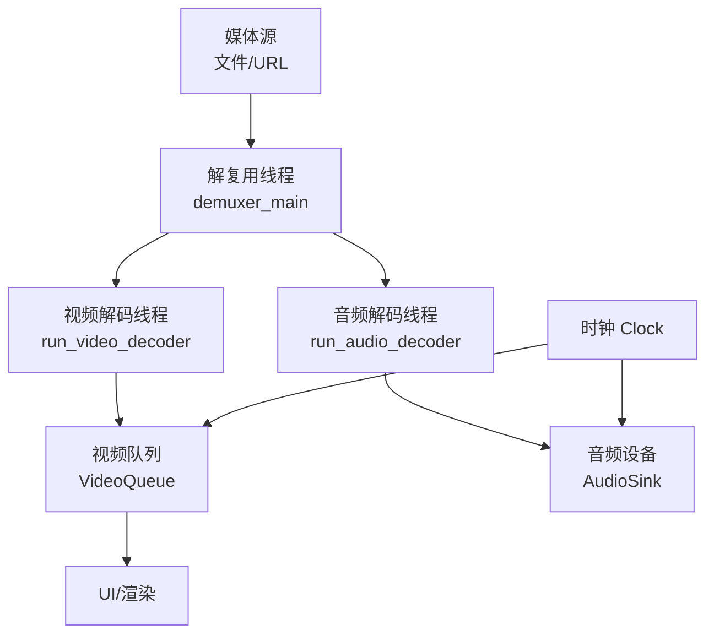
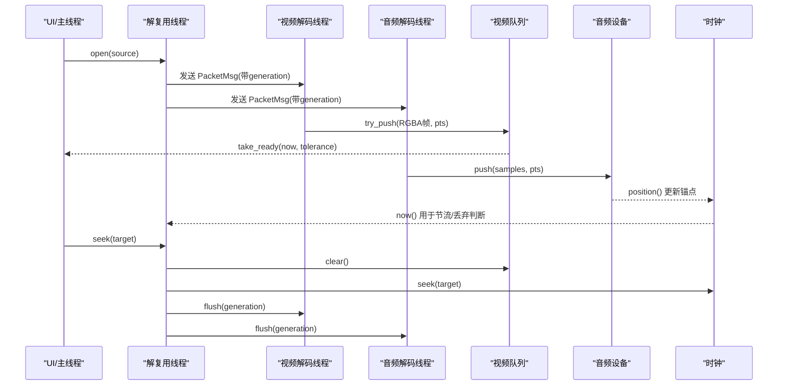
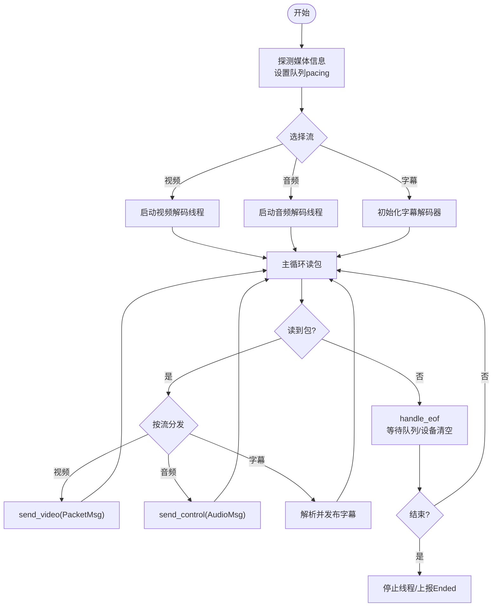
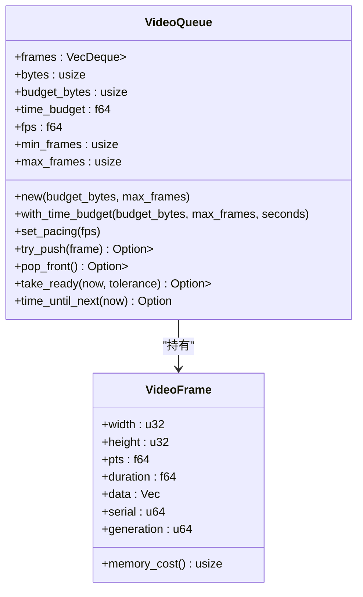
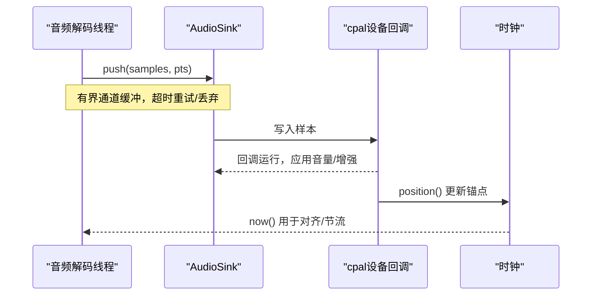
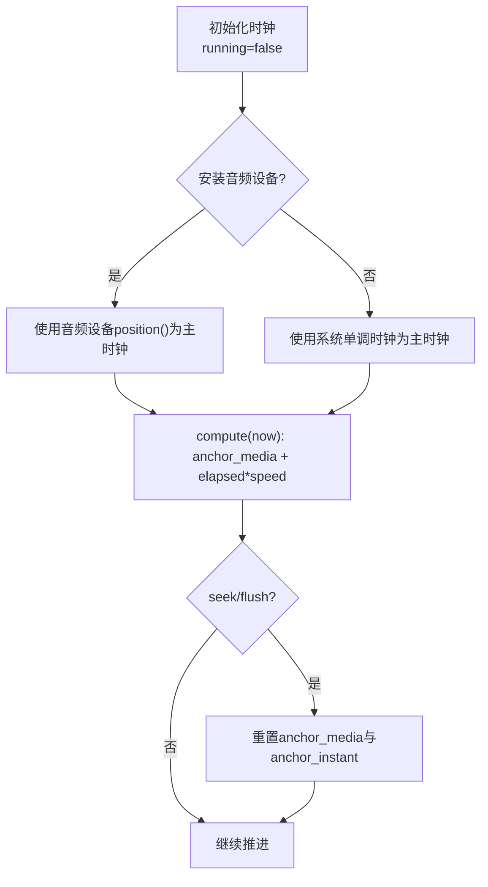
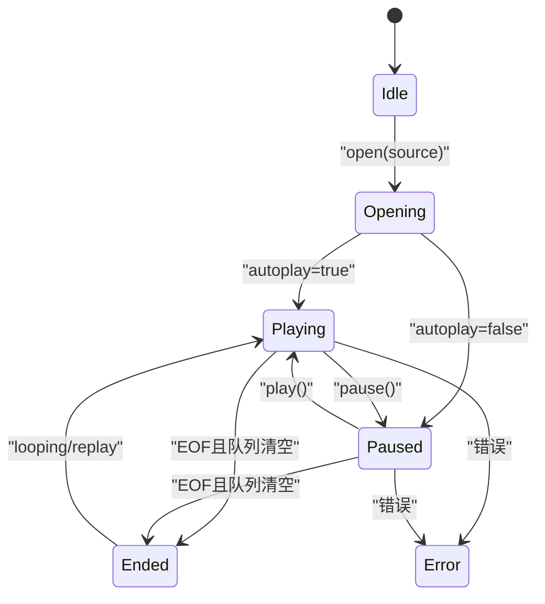
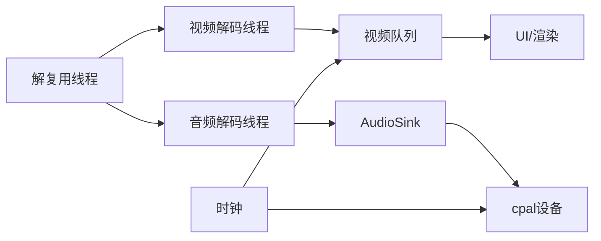

# 播放管线设计

<cite>
**本文引用的文件**
- [engine.rs](file://crates/mvp-core/src/engine.rs)
- [workers.rs](file://crates/mvp-core/src/engine/workers.rs)
- [clock.rs](file://crates/mvp-core/src/engine/clock.rs)
- [queue.rs](file://crates/mvp-core/src/engine/queue.rs)
- [audio.rs](file://crates/mvp-core/src/audio.rs)
- [video.rs](file://crates/mvp-core/src/video.rs)
- [lib.rs](file://crates/mvp-core/src/lib.rs)
</cite>

## 目录
1. [简介](#简介)
2. [项目结构](#项目结构)
3. [核心组件](#核心组件)
4. [架构总览](#架构总览)
5. [详细组件分析](#详细组件分析)
6. [依赖关系分析](#依赖关系分析)
7. [性能考量](#性能考量)
8. [故障排查指南](#故障排查指南)
9. [结论](#结论)
10. [附录](#附录)

## 简介
本文件面向“播放管线”的详细设计，聚焦以下目标：
- 解复用线程、视频解码线程、音频解码线程的协作机制
- 数据在管线中的流转：文件输入 → 解复用器 → 音视频解码器 → 渲染输出
- 时钟同步机制：主时钟选择策略与时间基准管理
- 队列设计：按字节数限制而非帧数限制，防止内存溢出
- 时序图与数据流图：展示各阶段处理逻辑与状态转换

## 项目结构
播放管线位于 mvp-core 引擎层，围绕三个工作线程（解复用、视频解码、音频解码）与共享状态组织。关键模块职责如下：
- 引擎外壳与共享状态：engine.rs
- 工作线程与消息通道：workers.rs
- 时钟与基准：clock.rs
- 视频队列与预算：queue.rs
- 音频输出与设备回调：audio.rs
- 视频帧与颜色转换：video.rs
- 库入口与 FFmpeg 初始化：lib.rs

图表来源
- [engine.rs:1-20](file://crates/mvp-core/src/engine.rs#L1-L20)
- [workers.rs:134-146](file://crates/mvp-core/src/engine/workers.rs#L134-L146)
- [queue.rs:67-86](file://crates/mvp-core/src/engine/queue.rs#L67-L86)
- [audio.rs:153-162](file://crates/mvp-core/src/audio.rs#L153-L162)
- [clock.rs:43-46](file://crates/mvp-core/src/engine/clock.rs#L43-L46)

章节来源
- [engine.rs:1-20](file://crates/mvp-core/src/engine.rs#L1-L20)
- [lib.rs:1-18](file://crates/mvp-core/src/lib.rs#L1-L18)

## 核心组件
- 解复用线程：负责打开容器、探测信息、选择音/视频/字幕流，读取数据包并分发到对应解码线程；同时处理跳转、AB循环、轨道切换等控制。
- 视频解码线程：接收数据包，解码为原始帧，进行色彩空间转换、缩放、HDR→SDR色调映射、杜比视界重塑（可选），产出显示就绪的 RGBA 帧进入视频队列。
- 音频解码线程：接收数据包，解码并重采样到设备格式，推入音频设备队列；设备回调以无锁方式消费并驱动时钟锚点。
- 时钟：维护媒体位置，优先使用音频设备作为主时钟基准；当无音频或音频停顿时回退到系统单调时钟。
- 队列：视频队列采用“字节预算 + 时间预算 + 最小/最大帧数”的多维约束，避免内存爆炸与高延迟；音频通过有界通道缓冲设备回调。

章节来源
- [workers.rs:281-687](file://crates/mvp-core/src/engine/workers.rs#L281-L687)
- [queue.rs:67-253](file://crates/mvp-core/src/engine/queue.rs#L67-L253)
- [audio.rs:153-162](file://crates/mvp-core/src/audio.rs#L153-L162)
- [clock.rs:1-46](file://crates/mvp-core/src/engine/clock.rs#L1-L46)

## 架构总览
播放管线由“解复用线程”统一调度，将数据包分发给“视频解码线程”和“音频解码线程”。视频帧经转换后进入“视频队列”，由 UI 按时间取帧渲染；音频帧经重采样后进入“音频设备队列”，由 cpal 回调实时播放。时钟提供统一的媒体时间基准，协调音视频同步与跳播。

图表来源
- [engine.rs:537-594](file://crates/mvp-core/src/engine.rs#L537-L594)
- [workers.rs:281-687](file://crates/mvp-core/src/engine/workers.rs#L281-L687)
- [queue.rs:180-253](file://crates/mvp-core/src/engine/queue.rs#L180-L253)
- [audio.rs:519-575](file://crates/mvp-core/src/audio.rs#L519-L575)
- [clock.rs:74-126](file://crates/mvp-core/src/engine/clock.rs#L74-L126)

## 详细组件分析

### 解复用线程（demuxer_main）
- 打开输入、探测媒体信息、设置视频队列 pacing（基于视频帧率）
- 选择音/视频/字幕流，启动视频/音频解码线程
- 主循环读取数据包，按流类型分发到对应解码线程
- 处理跳转：清理视频队列、重置时钟、通知解码线程 flush
- 处理 AB 循环、轨道切换、内嵌字幕解析与发布
- 遇到 EOF：等待队列清空，必要时触发结束事件或循环

图表来源
- [workers.rs:281-687](file://crates/mvp-core/src/engine/workers.rs#L281-L687)
- [workers.rs:700-793](file://crates/mvp-core/src/engine/workers.rs#L700-L793)

章节来源
- [workers.rs:281-687](file://crates/mvp-core/src/engine/workers.rs#L281-L687)
- [workers.rs:700-793](file://crates/mvp-core/src/engine/workers.rs#L700-L793)

### 视频解码线程与视频队列
- 解码线程从通道接收 PacketMsg，解码为原始帧，进行颜色转换与 HDR 处理，生成 RGBA 帧
- 视频队列 VideoQueue 采用“字节预算 + 时间预算 + 最小/最大帧数”的多维约束：
  - 字节预算：防止高分辨率帧导致内存爆炸
  - 时间预算：限制解码超前量，降低跳播延迟
  - 最小/最大帧数：保证可播放性与上限
- 队列提供 try_push、take_ready、time_until_next 等方法，确保消费端按需取帧，生产端在满队时阻塞或丢弃过期帧

图表来源
- [queue.rs:67-253](file://crates/mvp-core/src/engine/queue.rs#L67-L253)
- [video.rs:18-55](file://crates/mvp-core/src/video.rs#L18-L55)

章节来源
- [queue.rs:67-253](file://crates/mvp-core/src/engine/queue.rs#L67-L253)
- [video.rs:18-55](file://crates/mvp-core/src/video.rs#L18-L55)

### 音频解码线程与设备回调
- 音频解码线程接收 PacketMsg，解码并重采样到设备格式，调用 AudioSink::push 推送样本
- 设备回调（cpal）在无锁条件下消费样本，应用音量与增强链，填充输出缓冲区
- 音频设备回调通过“锚点 + 速度”模型计算当前媒体位置，供时钟使用

图表来源
- [audio.rs:519-575](file://crates/mvp-core/src/audio.rs#L519-L575)
- [audio.rs:604-618](file://crates/mvp-core/src/audio.rs#L604-L618)
- [clock.rs:133-158](file://crates/mvp-core/src/engine/clock.rs#L133-L158)

章节来源
- [audio.rs:519-575](file://crates/mvp-core/src/audio.rs#L519-L575)
- [audio.rs:604-618](file://crates/mvp-core/src/audio.rs#L604-L618)
- [clock.rs:133-158](file://crates/mvp-core/src/engine/clock.rs#L133-L158)

### 时钟同步机制
- 主时钟策略：优先使用音频设备作为主时钟基准；若无音频或音频停顿时，回退到系统单调时钟
- 锚点管理：首次样本到达时建立锚点；seek/flush 时重置锚点；暂停时冻结时钟
- 速度控制：支持变速播放，保持位置连续性
- 与队列联动：视频队列根据 now() 决定何时取帧；解复用线程根据 now() 与队列前沿 PTS 判断是否丢弃过时帧

图表来源
- [clock.rs:48-126](file://crates/mvp-core/src/engine/clock.rs#L48-L126)
- [clock.rs:133-158](file://crates/mvp-core/src/engine/clock.rs#L133-L158)

章节来源
- [clock.rs:48-126](file://crates/mvp-core/src/engine/clock.rs#L48-L126)
- [clock.rs:133-158](file://crates/mvp-core/src/engine/clock.rs#L133-L158)

### 数据流与状态转换
- 数据流：文件输入 → 解复用器 → 音视频解码器 → 渲染输出（视频队列/UI，音频设备）
- 状态转换：Idle → Opening → Playing/Paused → Ended/Error；跳转时回到相应状态

图表来源
- [engine.rs:106-136](file://crates/mvp-core/src/engine.rs#L106-L136)
- [workers.rs:700-793](file://crates/mvp-core/src/engine/workers.rs#L700-L793)

章节来源
- [engine.rs:106-136](file://crates/mvp-core/src/engine.rs#L106-L136)
- [workers.rs:700-793](file://crates/mvp-core/src/engine/workers.rs#L700-L793)

## 依赖关系分析
- 解复用线程依赖 FFmpeg 输入上下文与中断回调，向视频/音频解码线程发送带 generation 的消息，避免旧数据污染
- 视频解码线程依赖 RgbaConverter 进行颜色转换与 HDR 处理，输出 RGBA 帧进入 VideoQueue
- 音频解码线程依赖 AudioSink 将样本推送到设备，设备回调更新时钟锚点
- 时钟依赖音频设备 position() 与系统 Instant，提供统一的媒体时间
- 队列依赖 VideoFrame 的 memory_cost() 进行字节预算统计

图表来源
- [engine.rs:310-372](file://crates/mvp-core/src/engine.rs#L310-L372)
- [workers.rs:281-687](file://crates/mvp-core/src/engine/workers.rs#L281-L687)
- [queue.rs:67-253](file://crates/mvp-core/src/engine/queue.rs#L67-L253)
- [audio.rs:153-162](file://crates/mvp-core/src/audio.rs#L153-L162)
- [clock.rs:43-46](file://crates/mvp-core/src/engine/clock.rs#L43-L46)

章节来源
- [engine.rs:310-372](file://crates/mvp-core/src/engine.rs#L310-L372)
- [workers.rs:281-687](file://crates/mvp-core/src/engine/workers.rs#L281-L687)
- [queue.rs:67-253](file://crates/mvp-core/src/engine/queue.rs#L67-L253)
- [audio.rs:153-162](file://crates/mvp-core/src/audio.rs#L153-L162)
- [clock.rs:43-46](file://crates/mvp-core/src/engine/clock.rs#L43-L46)

## 性能考量
- 视频队列预算：采用字节预算 + 时间预算 + 最小/最大帧数，避免高分辨率帧导致内存爆炸与高延迟
- 解码超前限制：视频/音频解码线程分别限制超前量（VIDEO_LEAD/AUDIO_LEAD），确保跳播响应性
- 丢帧策略：当视频队列落后于时钟一定阈值时，解复用线程丢弃过时数据包，避免进一步滞后
- 音频设备回调：无锁设计，避免阻塞；音量变化平滑过渡，减少爆音
- 颜色转换优化：重用 SwsContext，批量处理，限制色调映射线程数，平衡 CPU 占用

章节来源
- [queue.rs:88-147](file://crates/mvp-core/src/engine/queue.rs#L88-L147)
- [workers.rs:25-129](file://crates/mvp-core/src/engine/workers.rs#L25-L129)
- [video.rs:144-155](file://crates/mvp-core/src/video.rs#L144-L155)

## 故障排查指南
- 音频设备不可用：日志记录并继续静音播放；检查设备枚举与配置
- 解码线程异常：捕获 panic 并转为错误状态，UI 可提示用户恢复
- 队列满/丢帧：监控 dropped_frames 与 presentation_drops，调整队列预算或硬件能力
- 时钟漂移：确认音频设备 primed 状态与锚点更新；必要时回退到系统时钟
- 跳转失败：记录警告并继续播放；检查容器是否支持跳转

章节来源
- [workers.rs:134-162](file://crates/mvp-core/src/engine/workers.rs#L134-L162)
- [workers.rs:215-262](file://crates/mvp-core/src/engine/workers.rs#L215-L262)
- [audio.rs:226-231](file://crates/mvp-core/src/audio.rs#L226-L231)

## 结论
该播放管线通过“解复用线程 + 视频/音频解码线程 + 时钟 + 队列”的协作，实现了高效、稳定、低延迟的音视频播放。核心设计要点包括：
- 主时钟优先音频设备，无音频时回退系统时钟，确保同步准确性
- 视频队列采用多维预算约束，防止内存溢出与高延迟
- 解复用线程智能丢帧与节流，保障音视频流畅性
- 无锁音频设备回调与平滑音量控制，提升用户体验

## 附录
- 关键常量参考：
  - VIDEO_PACKET_QUEUE、AUDIO_PACKET_QUEUE：解复用到解码器的通道深度
  - VIDEO_LEAD、AUDIO_LEAD：解码超前限制
  - RESYNC_LAG：视频队列落后阈值，触发丢帧
  - QUEUE_CHUNKS：音频设备队列深度
- 配置项参考：
  - frame_queue_bytes/frame_queue_frames/frame_queue_seconds：视频队列预算
  - buffer_pool_bytes：RGB 缓冲区池预算
  - hardware_decoding/hdr_tone_map/dv_reshape：解码与处理选项

章节来源
- [workers.rs:25-129](file://crates/mvp-core/src/engine/workers.rs#L25-L129)
- [engine.rs:155-213](file://crates/mvp-core/src/engine.rs#L155-L213)