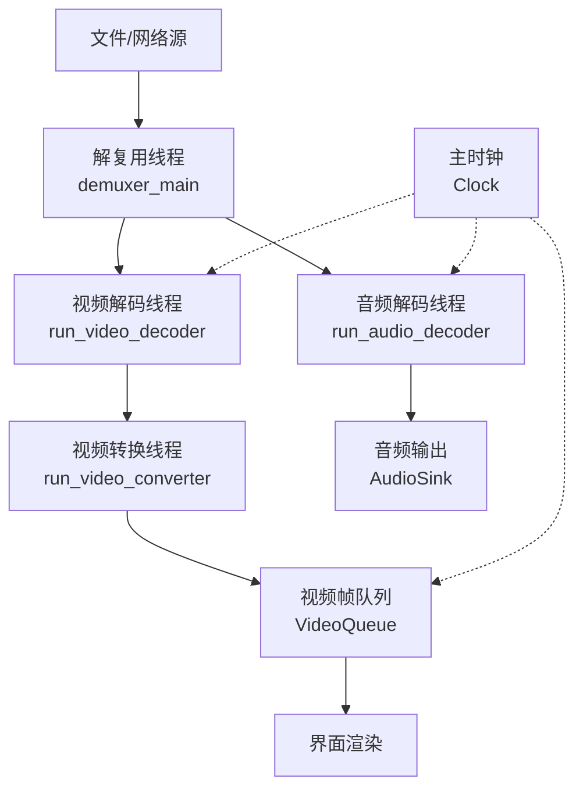
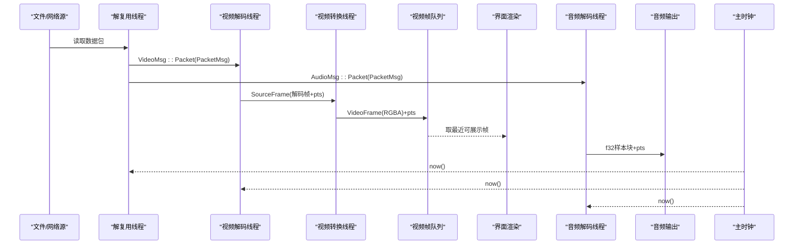
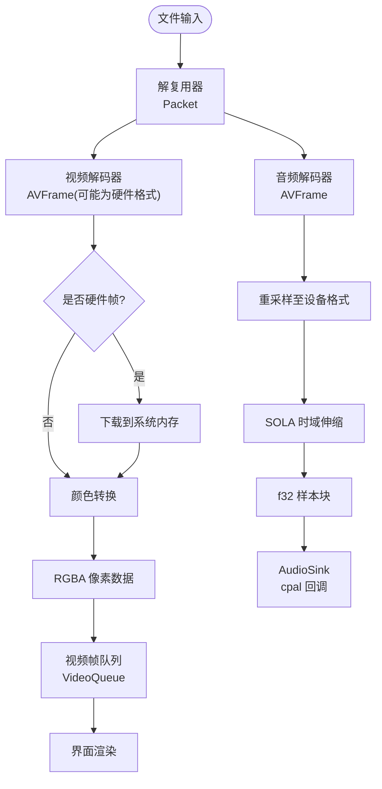
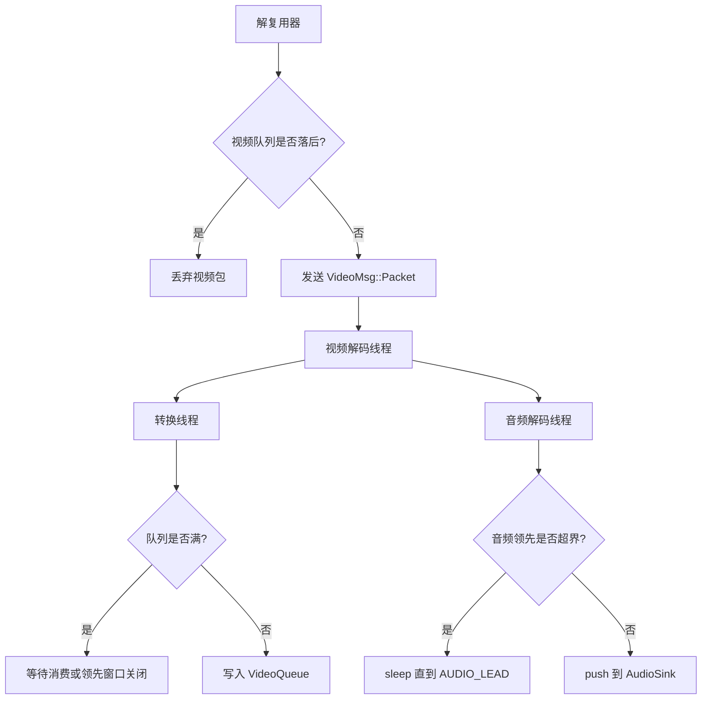
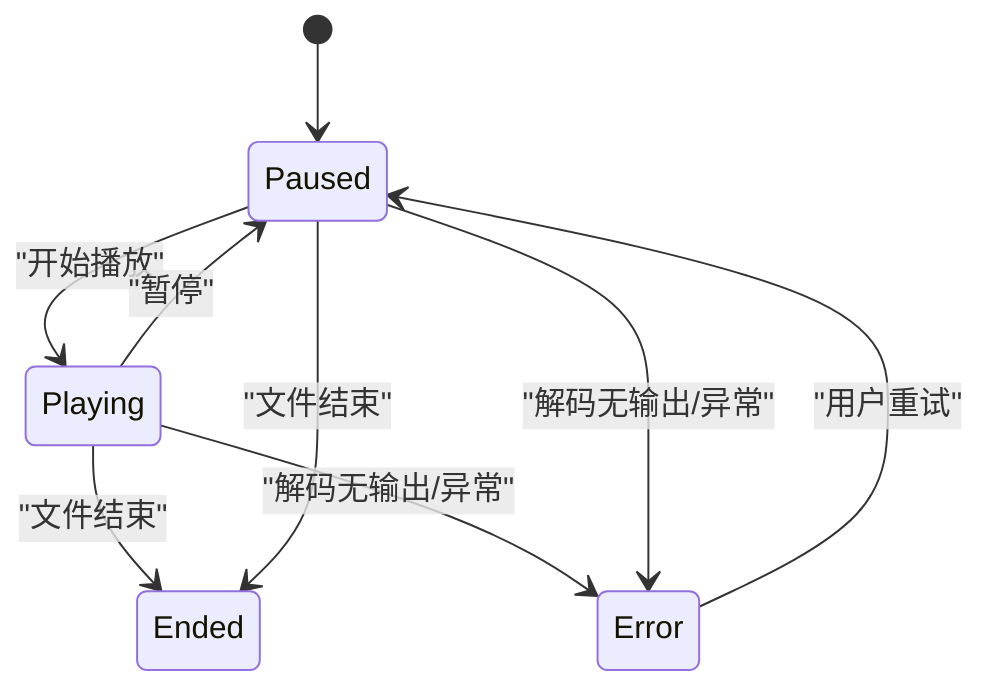
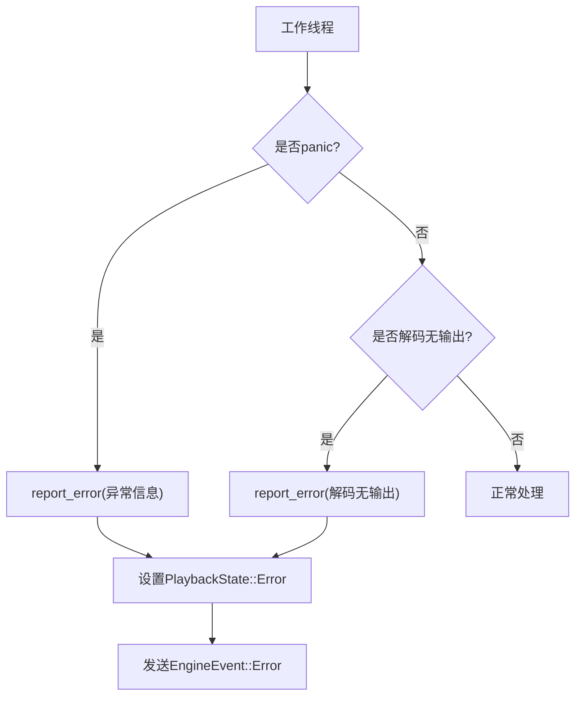
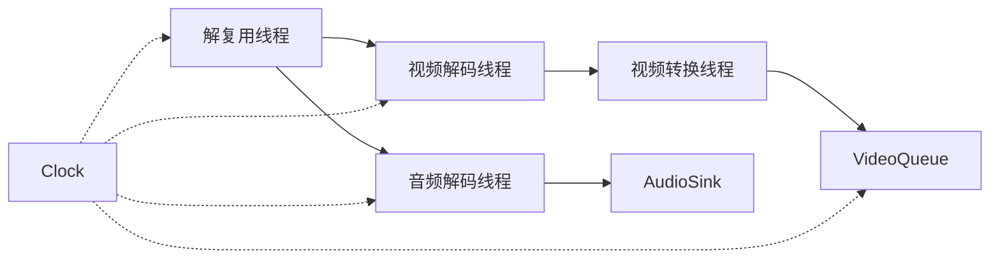

# 数据流架构

<cite>
**本文引用的文件**   
- [README.md](file://README.md)
- [workers.rs](file://crates/mvp-core/src/engine/workers.rs)
- [queue.rs](file://crates/mvp-core/src/engine/queue.rs)
- [clock.rs](file://crates/mvp-core/src/engine/clock.rs)
- [audio.rs](file://crates/mvp-core/src/audio.rs)
- [video.rs](file://crates/mvp-core/src/video.rs)
</cite>

## 目录
1. [引言](#引言)
2. [项目结构](#项目结构)
3. [核心组件](#核心组件)
4. [架构总览](#架构总览)
5. [详细组件分析](#详细组件分析)
6. [依赖关系分析](#依赖关系分析)
7. [性能考量](#性能考量)
8. [故障排查指南](#故障排查指南)
9. [结论](#结论)

## 引言
本文聚焦 MVP-Versatile-Player 的播放管线数据流，从“文件输入 → 解复用器 → 音视频解码器 → 渲染输出”的全链路进行说明。重点解释：
- 各阶段的数据格式转换：原始数据包 → 解码帧 → 渲染格式；
- 数据流向控制：背压机制、流量控制、缓冲区管理；
- 关键数据结构：PacketMsg、VideoMsg、AudioMsg 的设计与使用场景；
- 数据流时序图、状态转换图与错误处理流程；
- 性能监控指标与调试技巧。

该播放器采用多工作线程架构：解复用线程负责读取容器并分发包，视频与音频各自拥有独立解码线程，视频帧再进入独立的颜色转换与队列阶段，最终由界面渲染或声卡回调消费。时钟以系统时间为主参考，音频设备作为同步锚点，保证音画同步与稳定回放。

**章节来源**
- [README.md:315-357](file://README.md#L315-L357)

## 项目结构
MVP 的核心播放逻辑位于 `mvp-core`，其中引擎相关代码集中在 `engine` 子模块：
- `workers.rs`：解复用线程、视频解码线程、视频转换线程、音频解码线程的主循环与状态机；
- `queue.rs`：消息类型 PacketMsg、VideoMsg、AudioMsg，以及按字节预算的视频帧队列 VideoQueue；
- `clock.rs`：主时钟 Clock，统一提供媒体位置、速率、暂停/播放、跳转等能力；
- `audio.rs`：音频输出 AudioSink，负责 cpal 回调、音量、静音、速度、欠载统计等；
- `video.rs`：视频帧 VideoFrame 与 RGBA 转换器 RgbaConverter，负责像素格式转换、HDR/杜比视界处理。



**图表来源**
- [workers.rs:134-146](file://crates/mvp-core/src/engine/workers.rs#L134-L146)
- [workers.rs:906-1106](file://crates/mvp-core/src/engine/workers.rs#L906-L1106)
- [workers.rs:1719-1879](file://crates/mvp-core/src/engine/workers.rs#L1719-L1879)
- [workers.rs:1297-1447](file://crates/mvp-core/src/engine/workers.rs#L1297-L1447)
- [queue.rs:73-253](file://crates/mvp-core/src/engine/queue.rs#L73-L253)
- [clock.rs:43-159](file://crates/mvp-core/src/engine/clock.rs#L43-L159)

**章节来源**
- [README.md:315-357](file://README.md#L315-L357)
- [workers.rs:134-146](file://crates/mvp-core/src/engine/workers.rs#L134-L146)

## 核心组件
- 解复用线程：打开 FFmpeg 输入上下文，探测媒体信息，选择视频/音频/字幕轨道，按时间基与起始偏移计算播放时间戳，将包分发给对应解码线程。
- 视频解码线程：打开视频解码器（优先硬件解码，失败回退软件解码），接收 PacketMsg，驱动解码器产出解码帧，必要时下载 GPU 帧到系统内存，送入转换线程。
- 视频转换线程：将解码帧转换为 RGBA，应用 HDR 色调映射与杜比视界重塑开关，按展示领先窗口限制写入 VideoQueue。
- 音频解码线程：打开音频解码器，重采样至设备格式，SOLA 时域伸缩变速，按 AUDIO_LEAD 控制背压，推送到 AudioSink。
- 时钟：系统时钟为主，音频设备为同步锚点；支持播放/暂停、速率、跳转、A/B 循环。
- 队列：VideoQueue 按字节预算与时间预算限制容量，确保不会因大分辨率帧导致内存暴涨；同时维护最小缓冲帧数，避免抖动卡顿。

**章节来源**
- [workers.rs:134-146](file://crates/mvp-core/src/engine/workers.rs#L134-L146)
- [workers.rs:906-1106](file://crates/mvp-core/src/engine/workers.rs#L906-L1106)
- [workers.rs:1297-1447](file://crates/mvp-core/src/engine/workers.rs#L1297-L1447)
- [workers.rs:1719-1879](file://crates/mvp-core/src/engine/workers.rs#L1719-L1879)
- [clock.rs:43-159](file://crates/mvp-core/src/engine/clock.rs#L43-L159)
- [queue.rs:73-253](file://crates/mvp-core/src/engine/queue.rs#L73-L253)

## 架构总览
播放管线的端到端数据流如下：



**图表来源**
- [workers.rs:639-680](file://crates/mvp-core/src/engine/workers.rs#L639-L680)
- [workers.rs:1059-1089](file://crates/mvp-core/src/engine/workers.rs#L1059-L1089)
- [workers.rs:1262-1287](file://crates/mvp-core/src/engine/workers.rs#L1262-L1287)
- [workers.rs:1393-1440](file://crates/mvp-core/src/engine/workers.rs#L1393-L1440)
- [workers.rs:1937-2094](file://crates/mvp-core/src/engine/workers.rs#L1937-L2094)

## 详细组件分析

### 数据格式转换链
- 解复用阶段：FFmpeg 的 `Packet`，携带容器时间戳与流索引。
- 视频解码阶段：`AVFrame` 视频帧，可能为硬件格式（D3D11VA/DXVA2）或软件格式；若为硬件帧，需下载到系统内存。
- 视频转换阶段：RgbaConverter 将 YUV/其他格式转为 RGBA，可选 HDR 色调映射与杜比视界重塑；输出为 Vec<u8> 像素数据。
- 渲染阶段：界面将 RGBA 数据上传为纹理或直接绘制。
- 音频解码阶段：`AVFrame` 音频帧，经重采样至设备采样率与布局，SOLA 变速后输出 f32 样本块。
- 音频输出阶段：cpal 回调线程消费 AudioSink 中的样本块，应用音量、静音、音效增强。



**图表来源**
- [workers.rs:1605-1624](file://crates/mvp-core/src/engine/workers.rs#L1605-L1624)
- [workers.rs:1297-1447](file://crates/mvp-core/src/engine/workers.rs#L1297-L1447)
- [workers.rs:2005-2094](file://crates/mvp-core/src/engine/workers.rs#L2005-L2094)

**章节来源**
- [workers.rs:1605-1624](file://crates/mvp-core/src/engine/workers.rs#L1605-L1624)
- [workers.rs:1297-1447](file://crates/mvp-core/src/engine/workers.rs#L1297-L1447)
- [workers.rs:2005-2094](file://crates/mvp-core/src/engine/workers.rs#L2005-L2094)

### 背压与流量控制
- 视频通道：解复用器向视频解码线程发送 VideoMsg::Packet，使用 send_timeout 与 CONTROL_POLL 轮询中断/跳转；当视频队列落后于时钟超过 RESYNC_LAG，直接丢弃旧包以避免进一步滞后。
- 音频通道：音频解码线程通过 wait_for_audio_lead 控制解码领先量 AUDIO_LEAD，防止积压导致变速不生效；音频输出使用 cpal 回调，暂停时回调不运行，停止时标记关闭以结束等待。
- 视频帧队列：VideoQueue 按字节预算与时间预算限制容量，满队返回新帧而非丢弃最老帧，确保展示顺序正确；take_ready 丢弃过时帧但保留最新可用帧。
- 控制指令：跳转与轨道切换通过共享状态下发，不走包队列，避免被积压包阻塞。



**图表来源**
- [workers.rs:215-262](file://crates/mvp-core/src/engine/workers.rs#L215-L262)
- [workers.rs:1393-1440](file://crates/mvp-core/src/engine/workers.rs#L1393-L1440)
- [workers.rs:1917-1934](file://crates/mvp-core/src/engine/workers.rs#L1917-L1934)
- [queue.rs:164-253](file://crates/mvp-core/src/engine/queue.rs#L164-L253)

**章节来源**
- [workers.rs:215-262](file://crates/mvp-core/src/engine/workers.rs#L215-L262)
- [workers.rs:1393-1440](file://crates/mvp-core/src/engine/workers.rs#L1393-L1440)
- [workers.rs:1917-1934](file://crates/mvp-core/src/engine/workers.rs#L1917-L1934)
- [queue.rs:164-253](file://crates/mvp-core/src/engine/queue.rs#L164-L253)

### 关键数据结构：PacketMsg、VideoMsg、AudioMsg
- PacketMsg：封装一个解复用后的 FFmpeg Packet，附带所属解码会话 generation 与时间戳 timestamp（秒）。用于在解码前后保持时间一致性，并在跳转时丢弃旧会话数据。
- VideoMsg：视频解码线程的消息枚举，包含 Packet、Eof（带 generation）、Stop。Eof 必须带 generation，避免在新会话 flush 后误触发 EOF。
- AudioMsg：音频解码线程的消息枚举，结构与 VideoMsg 类似，同样包含 Packet、Eof、Stop。

```mermaid
classDiagram
class PacketMsg {
+packet
+generation
+timestamp
}
class VideoMsg {
<<enumeration>>
+Packet(PacketMsg)
+Eof{generation}
+Stop
}
class AudioMsg {
<<enumeration>>
+Packet(PacketMsg)
+Eof{generation}
+Stop
}
VideoMsg --> PacketMsg : "包含"
AudioMsg --> PacketMsg : "包含"
```

**图表来源**
- [queue.rs:16-65](file://crates/mvp-core/src/engine/queue.rs#L16-L65)

**章节来源**
- [queue.rs:16-65](file://crates/mvp-core/src/engine/queue.rs#L16-L65)

### 状态转换与生命周期
播放状态在解复用线程中维护，主要状态包括 Playing、Paused、Ended、Error。跳转会清空视频队列、重置时钟、刷新解码器；结束时会等待音视频队列耗尽，然后设置 Ended 并停止时钟。



**图表来源**
- [workers.rs:452-457](file://crates/mvp-core/src/engine/workers.rs#L452-L457)
- [workers.rs:700-793](file://crates/mvp-core/src/engine/workers.rs#L700-L793)

**章节来源**
- [workers.rs:452-457](file://crates/mvp-core/src/engine/workers.rs#L452-L457)
- [workers.rs:700-793](file://crates/mvp-core/src/engine/workers.rs#L700-L793)

### 错误处理流程
- 每个工作线程捕获 panic，上报错误并设置 PlaybackState::Error，同时发送 EngineEvent::Error。
- 解码无输出检测：如果持续喂包但长时间未产生帧，报“解码无输出”，并中止管道。
- 音频设备不可用：记录警告并继续静音播放，不影响视频。
- 跳转失败：记录警告并继续播放，避免快速拖动进度条导致管道死亡。



**图表来源**
- [workers.rs:134-162](file://crates/mvp-core/src/engine/workers.rs#L134-L162)
- [workers.rs:1094-1103](file://crates/mvp-core/src/engine/workers.rs#L1094-L1103)
- [workers.rs:391-398](file://crates/mvp-core/src/engine/workers.rs#L391-L398)

**章节来源**
- [workers.rs:134-162](file://crates/mvp-core/src/engine/workers.rs#L134-L162)
- [workers.rs:1094-1103](file://crates/mvp-core/src/engine/workers.rs#L1094-L1103)
- [workers.rs:391-398](file://crates/mvp-core/src/engine/workers.rs#L391-L398)

## 依赖关系分析
- 解复用线程依赖 FFmpeg 输入上下文与媒体信息描述；选择轨道后分别启动视频与音频解码线程。
- 视频解码线程依赖硬件/软件解码器、颜色转换器、视频帧队列；转换线程依赖 RgbaConverter 与池化缓冲区。
- 音频解码线程依赖 AudioSink、重采样器、SOLA 时域伸缩器；AudioSink 依赖 cpal 设备回调。
- 所有线程共享 Clock 提供的时间基准，并通过 Shared 状态协调跳转、轨道切换、播放状态。



**图表来源**
- [workers.rs:330-417](file://crates/mvp-core/src/engine/workers.rs#L330-L417)
- [workers.rs:906-1106](file://crates/mvp-core/src/engine/workers.rs#L906-L1106)
- [workers.rs:1719-1879](file://crates/mvp-core/src/engine/workers.rs#L1719-L1879)
- [clock.rs:43-159](file://crates/mvp-core/src/engine/clock.rs#L43-L159)

**章节来源**
- [workers.rs:330-417](file://crates/mvp-core/src/engine/workers.rs#L330-L417)
- [workers.rs:906-1106](file://crates/mvp-core/src/engine/workers.rs#L906-L1106)
- [workers.rs:1719-1879](file://crates/mvp-core/src/engine/workers.rs#L1719-L1879)
- [clock.rs:43-159](file://crates/mvp-core/src/engine/clock.rs#L43-L159)

## 性能考量
- 硬件解码优先：尝试 D3D11VA，失败回退 DXVA2，再失败走软件解码；软件解码启用多线程以提升吞吐。
- 颜色转换与解码分离：避免解码线程被 CPU 转换阻塞，提升并行度。
- 队列按字节预算：防止 4K RGBA 等大帧导致内存暴涨；同时保证最小缓冲帧数，避免抖动。
- 音频背压：AUDIO_LEAD 控制解码领先量，避免积压导致变速不生效；cpal 回调线程内完成音效增强，零分配、零锁。
- 时钟稳定性：系统时钟为主，音频设备为锚点，避免驱动报告偏差导致的画面狂奔或冻结。
- 关闭优化：解复用 abort 标志在工作线程循环开头检查，直接丢弃积压包，缩短关闭耗时。

**章节来源**
- [workers.rs:1449-1586](file://crates/mvp-core/src/engine/workers.rs#L1449-L1586)
- [workers.rs:1689-1699](file://crates/mvp-core/src/engine/workers.rs#L1689-L1699)
- [queue.rs:67-124](file://crates/mvp-core/src/engine/queue.rs#L67-L124)
- [workers.rs:1917-1934](file://crates/mvp-core/src/engine/workers.rs#L1917-L1934)
- [clock.rs:133-159](file://crates/mvp-core/src/engine/clock.rs#L133-L159)

## 故障排查指南
- 解码无输出：检查是否误识别容器或损坏文件；查看日志中的“解码无输出”提示；确认 FFmpeg 版本与解码器可用性。
- 音频设备不可用：播放器会继续静音播放视频；检查 cpal 设备列表与权限。
- 跳转卡顿：确认跳转目标是否在有效范围内；检查无索引容器的二分查找路径是否自死锁（已修复）。
- 画面冻结：检查视频队列是否落后于时钟；确认 take_ready 是否正确丢弃过时帧。
- 声音断断续续：检查音频背压是否生效；确认 cpal 回调是否正常运行；查看 AudioSink 的 underruns 统计。
- 调试工具：使用 seek_probe 示例打印打开→解码→跳转→停止每一步的时间戳；设置 RUST_LOG=mvp_core=debug 查看内部细节。

**章节来源**
- [workers.rs:1094-1103](file://crates/mvp-core/src/engine/workers.rs#L1094-L1103)
- [workers.rs:391-398](file://crates/mvp-core/src/engine/workers.rs#L391-L398)
- [README.md:538-544](file://README.md#L538-L544)

## 结论
MVP-Versatile-Player 的播放管线通过解复用、视频解码、颜色转换、音频解码与输出的多线程协作，实现了高效稳定的音视频回放。关键设计包括：
- 数据包到解码帧再到渲染格式的清晰转换链；
- 基于时钟与队列的背压与流量控制；
- PacketMsg、VideoMsg、AudioMsg 的结构化消息传递；
- 健壮的错误处理与性能监控；
- 对硬件解码、HDR/杜比视界、SOLA 变速等高级特性的支持。

这些设计共同保证了播放器在面对复杂媒体与极端情况时的鲁棒性与用户体验。