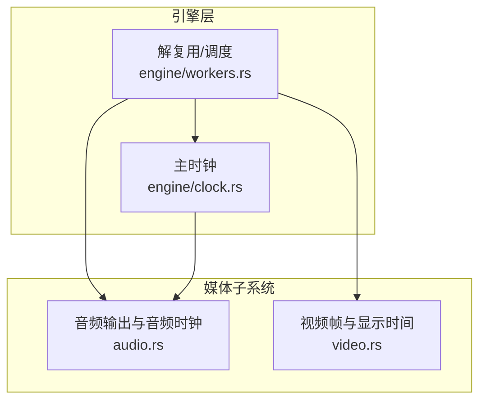
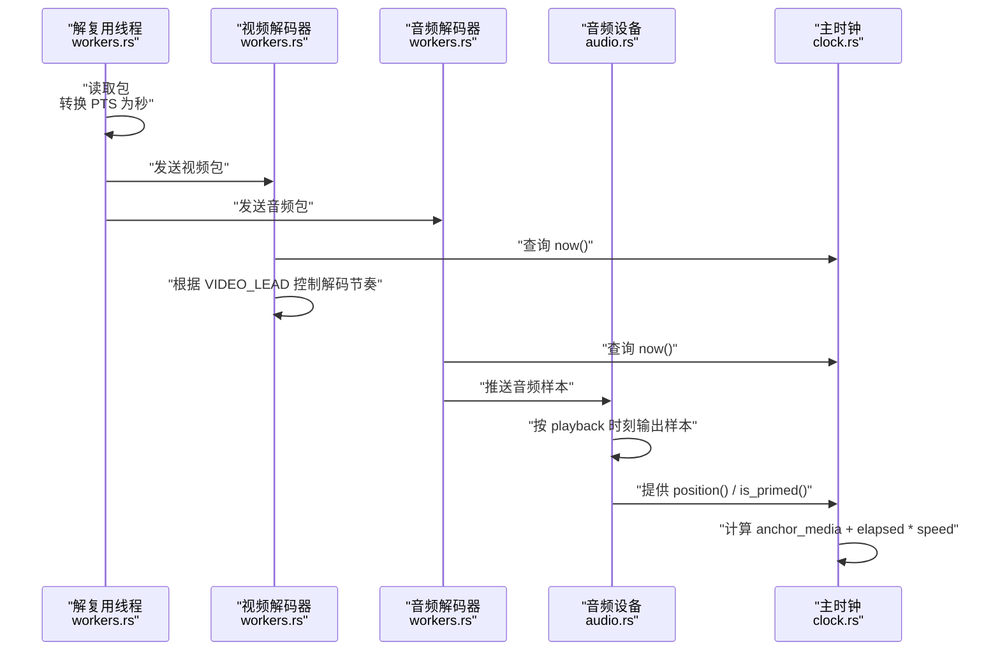
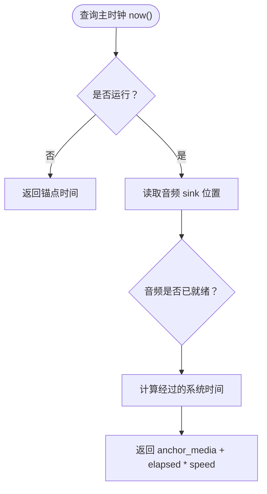
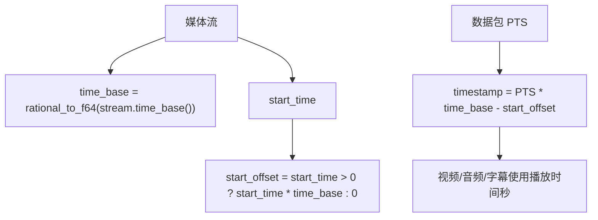
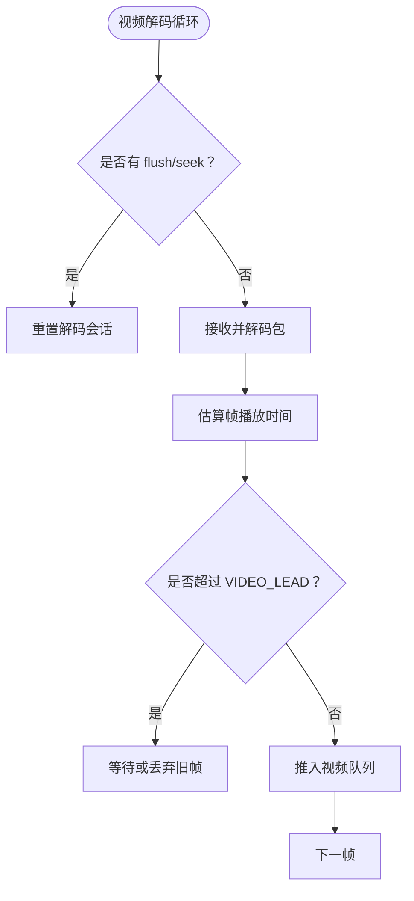
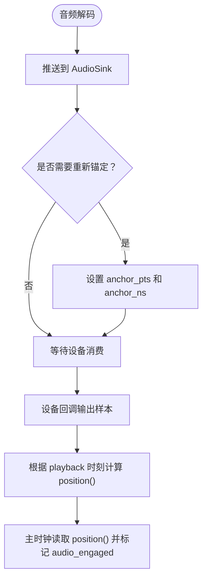
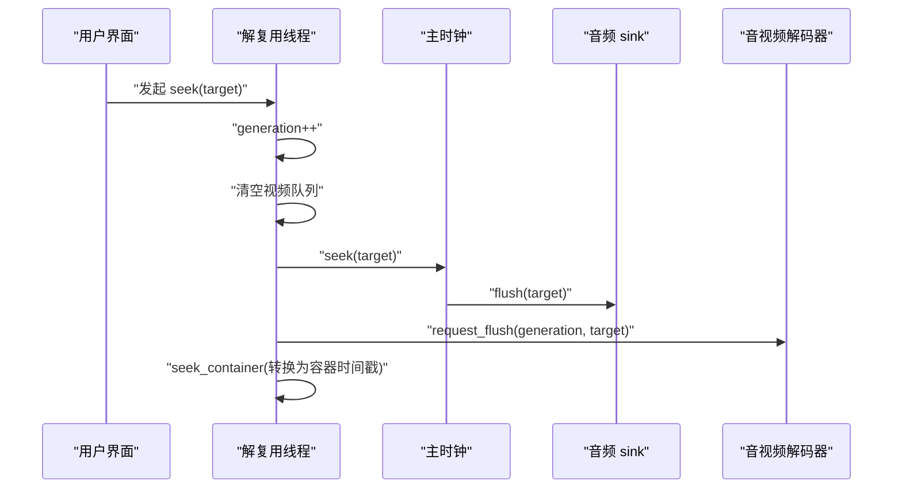
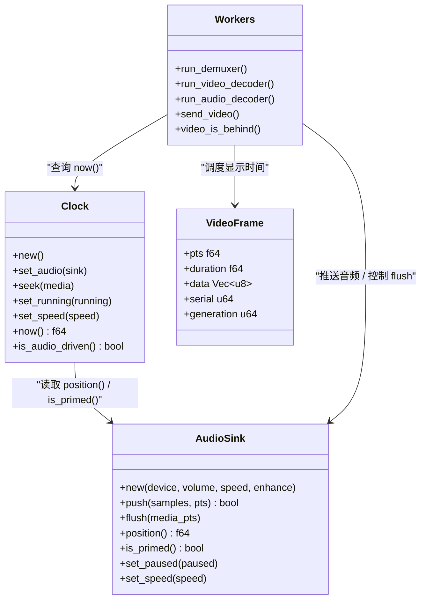

# 时钟同步机制

<cite>
**本文引用的文件**   
- [clock.rs](file://crates/mvp-core/src/engine/clock.rs)
- [audio.rs](file://crates/mvp-core/src/audio.rs)
- [workers.rs](file://crates/mvp-core/src/engine/workers.rs)
- [video.rs](file://crates/mvp-core/src/video.rs)
</cite>

## 目录
1. [引言](#引言)
2. [项目结构与时钟相关位置](#项目结构与时钟相关位置)
3. [核心组件](#核心组件)
4. [架构总览](#架构总览)
5. [详细组件分析](#详细组件分析)
6. [依赖关系分析](#依赖关系分析)
7. [性能与稳定性特征](#性能与稳定性特征)
8. [故障排查指南](#故障排查指南)
9. [结论](#结论)

## 引言
本文聚焦播放器中的“时钟同步机制”，围绕以下目标展开：
- 主时钟选择策略：优先使用音频设备作为参考，回退到系统时钟。
- 时间基准管理：不同媒体流的 time_base 转换、PTS 到秒的换算、start_offset 的作用。
- 音视频同步算法：视频解码器如何根据主时钟控制解码节奏；音频如何通过缓冲和重采样保持与视频同步。
- 时间戳处理：start_offset 的计算与应用；seek 操作对时钟、队列、解码会话的影响。
- 时序图与异常处理：关键流程的时序图和常见异常场景的处理策略。

该机制的核心思想是：用一个稳定的“主时钟”统一播放进度，让视频解码节奏和音频输出都向它靠拢；同时通过音频设备的实际播放状态来校准主时钟，避免纯系统时钟带来的长期漂移。

## 项目结构与时钟相关位置
时钟同步涉及四个主要模块：
- 主时钟：`engine/clock.rs`
- 音频输出与音频时钟：`audio.rs`
- 解复用与解码调度：`engine/workers.rs`
- 视频帧与显示时间：`video.rs`

**图示来源**
- [clock.rs:1-158](file://crates/mvp-core/src/engine/clock.rs#L1-L158)
- [audio.rs:1-26](file://crates/mvp-core/src/audio.rs#L1-L26)
- [workers.rs:67-118](file://crates/mvp-core/src/engine/workers.rs#L67-L118)
- [video.rs:18-36](file://crates/mvp-core/src/video.rs#L18-L36)

**章节来源**
- [clock.rs:1-158](file://crates/mvp-core/src/engine/clock.rs#L1-L158)
- [audio.rs:1-26](file://crates/mvp-core/src/audio.rs#L1-L26)
- [workers.rs:67-118](file://crates/mvp-core/src/engine/workers.rs#L67-L118)
- [video.rs:18-36](file://crates/mvp-core/src/video.rs#L18-L36)

## 核心组件
- 主时钟 `Clock`：提供统一的播放时间（秒），支持运行/暂停、变速、跳转、查询是否由音频驱动。
- 音频输出 `AudioSink`：负责打开音频设备、排队音频数据、计算音频播放位置、处理静音/音量/速度/暂停等。
- 解复用与解码调度 `workers.rs`：负责读取媒体流、转换时间戳、分发音视频包、控制解码队列、处理 seek、EOF、A-B 循环等。
- 视频帧 `VideoFrame`：携带 PTS（秒）、duration、RGBA 像素数据、序列号、生成代等信息，用于渲染和去重。

**章节来源**
- [clock.rs:43-158](file://crates/mvp-core/src/engine/clock.rs#L43-L158)
- [audio.rs:153-162](file://crates/mvp-core/src/audio.rs#L153-L162)
- [workers.rs:201-262](file://crates/mvp-core/src/engine/workers.rs#L201-L262)
- [video.rs:18-36](file://crates/mvp-core/src/video.rs#L18-L36)

## 架构总览
时钟同步的整体流程如下：
1. 解复用线程从容器读取数据包，将每个包的 PTS 转换为“播放时间秒”。
2. 视频包进入视频队列，视频解码器根据主时钟决定何时解码、何时丢弃。
3. 音频包进入音频队列，音频解码器根据主时钟和音频缓冲长度决定是否进行时间拉伸或等待。
4. 音频设备回调按实际播放时刻输出样本，并更新音频时钟锚点。
5. 主时钟以系统时钟为单调基础，结合音频设备状态判断是否“由音频驱动”，从而在音频可用时尽量贴近真实播放进度。

**图示来源**
- [workers.rs:639-680](file://crates/mvp-core/src/engine/workers.rs#L639-L680)
- [workers.rs:1386-1431](file://crates/mvp-core/src/engine/workers.rs#L1386-L1431)
- [audio.rs:519-575](file://crates/mvp-core/src/audio.rs#L519-L575)
- [clock.rs:133-158](file://crates/mvp-core/src/engine/clock.rs#L133-L158)

## 详细组件分析

### 主时钟选择策略：音频优先，系统时钟回退
主时钟的设计明确区分两种时间源：
- 音频时钟：基于音频设备实际播放位置，样本级准确，是音视频同步的关键。
- 系统时钟：单调且精确，用作主时钟的基础；当音频未启动、无音频、或音频停顿时，主时钟继续按系统时间推进。

关键点：
- `Clock::set_audio` 安装或清除音频 sink，重置音频参与状态。
- `Clock::compute` 每次读取音频 sink 的位置，并标记是否已“被音频驱动”。
- 如果未运行，返回冻结的锚点时间；否则返回锚点时间加上经过的系统时间与速度的乘积。
- 音频 sink 的 `position()` 不是简单计数已写出的帧数，而是基于 cpal 提供的 playback 时刻推导当前正在播放的样本位置，避免驱动吞掉多个回调导致时钟过快。

**图示来源**
- [clock.rs:122-158](file://crates/mvp-core/src/engine/clock.rs#L122-L158)
- [audio.rs:604-618](file://crates/mvp-core/src/audio.rs#L604-L618)

**章节来源**
- [clock.rs:1-158](file://crates/mvp-core/src/engine/clock.rs#L1-L158)
- [audio.rs:13-26](file://crates/mvp-core/src/audio.rs#L13-L26)
- [audio.rs:604-618](file://crates/mvp-core/src/audio.rs#L604-L618)

### 时间基准管理：time_base、PTS 到秒、start_offset
每个媒体流都有独立的 time_base 和 start_time。播放器需要把容器时间戳统一到“播放时间秒”：
- `stream_start_offset`：如果流的 start_time 有效且非最小值，则将其乘以 time_base 得到偏移量；否则偏移量为 0。
- 解复用阶段对每个包计算播放时间：`pts * time_base - start_offset`。
- 这个“播放时间秒”会传给视频/音频解码器和字幕处理逻辑，保证所有媒体在同一时间轴上对齐。

**图示来源**
- [workers.rs:831-838](file://crates/mvp-core/src/engine/workers.rs#L831-L838)
- [workers.rs:630-655](file://crates/mvp-core/src/engine/workers.rs#L630-L655)

**章节来源**
- [workers.rs:831-838](file://crates/mvp-core/src/engine/workers.rs#L831-L838)
- [workers.rs:630-655](file://crates/mvp-core/src/engine/workers.rs#L630-L655)

### 视频解码器的时钟同步：根据主时钟控制解码节奏
视频解码器并不直接“调整解码速度”，而是通过“解码提前量”控制解码节奏：
- `VIDEO_LEAD`：允许视频解码器领先主时钟约 0.5 秒，吸收渲染抖动。
- 解复用阶段判断“视频队列是否落后”：如果队列最前端的 PTS 已经落后于主时钟超过 `RESYNC_LAG`，则丢弃旧包，避免越拖越晚。
- 视频解码器循环中会根据主时钟和队列状态决定解码、等待或跳过。

**图示来源**
- [workers.rs:67-73](file://crates/mvp-core/src/engine/workers.rs#L67-L73)
- [workers.rs:201-262](file://crates/mvp-core/src/engine/workers.rs#L201-L262)
- [workers.rs:1386-1431](file://crates/mvp-core/src/engine/workers.rs#L1386-L1431)

**章节来源**
- [workers.rs:67-73](file://crates/mvp-core/src/engine/workers.rs#L67-L73)
- [workers.rs:201-262](file://crates/mvp-core/src/engine/workers.rs#L201-L262)
- [workers.rs:1386-1431](file://crates/mvp-core/src/engine/workers.rs#L1386-L1431)

### 音频同步：缓冲、重采样与时间拉伸
音频路径的目标是让声音与视频保持一致，同时避免卡顿和爆音：
- 音频解码器会提前解码音频，并通过 `AudioSink::push` 推送到设备队列。
- `AudioSink` 内部维护锚点：首次可靠数据到来时建立 `anchor_pts` 和 `anchor_ns`；后续通过系统时间差和速度计算当前位置。
- 如果音频队列过长，可能使用时间拉伸（SOLA）调整播放节奏；如果过短，则填充静音以避免断音。
- 音频设备回调不直接使用“已写出帧数”作为时钟，而是基于 cpal 的 playback 时刻推导当前播放位置，避免驱动行为导致的时钟失真。

**图示来源**
- [audio.rs:519-575](file://crates/mvp-core/src/audio.rs#L519-L575)
- [audio.rs:604-618](file://crates/mvp-core/src/audio.rs#L604-L618)
- [clock.rs:144-151](file://crates/mvp-core/src/engine/clock.rs#L144-L151)

**章节来源**
- [audio.rs:519-575](file://crates/mvp-core/src/audio.rs#L519-L575)
- [audio.rs:604-618](file://crates/mvp-core/src/audio.rs#L604-L618)
- [clock.rs:144-151](file://crates/mvp-core/src/engine/clock.rs#L144-L151)

### 时间戳处理：start_offset 的应用与 seek 的影响
- `start_offset` 用于把容器时间轴对齐到“播放时间秒”。例如某些容器（如蓝光 TS）的 start_time 很大，如果不减去偏移，seek 会指向错误位置。
- `seek_container` 会把“播放时间秒”转换为容器的绝对时间戳，考虑容器的 start_time。
- seek 会：
  - 增加解码会话 generation。
  - 清空视频队列。
  - 调用主时钟 `seek`，重置锚点和音频 sink 的 flush。
  - 请求 flush，使音视频解码器丢弃旧数据。
  - 清理图形字幕缓存，刷新字幕解码器。

**图示来源**
- [workers.rs:485-535](file://crates/mvp-core/src/engine/workers.rs#L485-L535)
- [workers.rs:847-876](file://crates/mvp-core/src/engine/workers.rs#L847-L876)
- [clock.rs:74-84](file://crates/mvp-core/src/engine/clock.rs#L74-L84)

**章节来源**
- [workers.rs:485-535](file://crates/mvp-core/src/engine/workers.rs#L485-L535)
- [workers.rs:847-876](file://crates/mvp-core/src/engine/workers.rs#L847-L876)
- [clock.rs:74-84](file://crates/mvp-core/src/engine/clock.rs#L74-L84)

### 异常情况处理策略
- 音频设备不可用：解复用阶段记录警告并上报错误事件，但视频仍可继续播放。
- 音频设备回调错误或欠载：统计 dropped/underruns，输出静音而非重复最后样本。
- 视频队列落后：丢弃旧包，避免越拖越晚。
- 解码停滞：监控解码器长时间无帧输出，防止误判容器导致无限旋转。
- EOF 处理：音频文件以音频队列耗尽为准；无音频设备时回退到主时钟接近 duration。

**章节来源**
- [workers.rs:373-398](file://crates/mvp-core/src/engine/workers.rs#L373-L398)
- [audio.rs:424-455](file://crates/mvp-core/src/audio.rs#L424-L455)
- [workers.rs:201-262](file://crates/mvp-core/src/engine/workers.rs#L201-L262)
- [workers.rs:700-793](file://crates/mvp-core/src/engine/workers.rs#L700-L793)

## 依赖关系分析
时钟同步的依赖关系如下：
- `Clock` 依赖 `AudioSink` 的 `position()` 和 `is_primed()`。
- `workers.rs` 依赖 `Clock::now()` 控制视频/音频解码节奏。
- `AudioSink` 依赖 cpal 的设备回调和系统时间，提供样本级准确的播放位置。
- `video.rs` 提供视频帧的时间信息，但不直接参与时钟同步，而是由 `workers.rs` 根据主时钟调度。

**图示来源**
- [clock.rs:43-158](file://crates/mvp-core/src/engine/clock.rs#L43-L158)
- [audio.rs:153-162](file://crates/mvp-core/src/audio.rs#L153-L162)
- [workers.rs:906-957](file://crates/mvp-core/src/engine/workers.rs#L906-L957)
- [video.rs:18-36](file://crates/mvp-core/src/video.rs#L18-L36)

**章节来源**
- [clock.rs:43-158](file://crates/mvp-core/src/engine/clock.rs#L43-L158)
- [audio.rs:153-162](file://crates/mvp-core/src/audio.rs#L153-L162)
- [workers.rs:906-957](file://crates/mvp-core/src/engine/workers.rs#L906-L957)
- [video.rs:18-36](file://crates/mvp-core/src/video.rs#L18-L36)

## 性能与稳定性特征
- 主时钟使用系统时钟作为单调基础，避免音频驱动回调频率不稳定导致的时钟失真。
- 音频路径通过 cpal 的 playback 时刻推导播放位置，避免驱动吞掉多个回调导致时钟过快。
- 视频解码器通过 `VIDEO_LEAD` 控制解码提前量，平衡流畅性和响应性。
- 音频解码器通过 `AUDIO_LEAD` 控制音频缓冲长度，避免慢速播放时缓冲堆积导致变速延迟。
- 解复用阶段对视频队列落后进行丢包，避免越拖越晚。
- 音频设备回调使用无锁原子变量和通道，确保实时线程安全。

[本节为通用性能讨论，不直接分析具体代码行]

## 故障排查指南
常见问题及定位建议：
- 声音卡顿或爆音：检查 `AudioSink::underruns()` 和 `dropped_chunks()`，确认是否音频队列不足或设备回调异常。
- 画面与声音不同步：检查 `Clock::is_audio_driven()` 是否为真；若为假，说明音频未就绪或已停止，主时钟回退到系统时钟。
- seek 后画面不动：检查 `seek_container` 是否正确转换容器时间戳；确认 `start_offset` 是否被正确应用。
- 视频解码停滞：检查解码器是否长时间无帧输出，确认是否误判容器或硬件解码问题。
- 音频设备不可用：查看解复用阶段的错误日志，确认是否启用音频输出以及设备名称配置。

**章节来源**
- [audio.rs:498-506](file://crates/mvp-core/src/audio.rs#L498-L506)
- [clock.rs:128-131](file://crates/mvp-core/src/engine/clock.rs#L128-L131)
- [workers.rs:847-876](file://crates/mvp-core/src/engine/workers.rs#L847-L876)
- [workers.rs:373-398](file://crates/mvp-core/src/engine/workers.rs#L373-L398)

## 结论
该播放器的时钟同步机制以“主时钟”为核心，优先使用音频设备作为参考，回退到系统时钟以保证稳定性。时间基准通过 time_base 和 start_offset 统一到播放时间秒，视频解码器通过解码提前量控制节奏，音频通过缓冲和时间拉伸保持同步。seek 操作会重置时钟、队列和解码会话，确保播放进度一致。整体设计在保证同步精度的同时，兼顾了性能和鲁棒性。

[本节为总结性内容，不直接分析具体代码行]