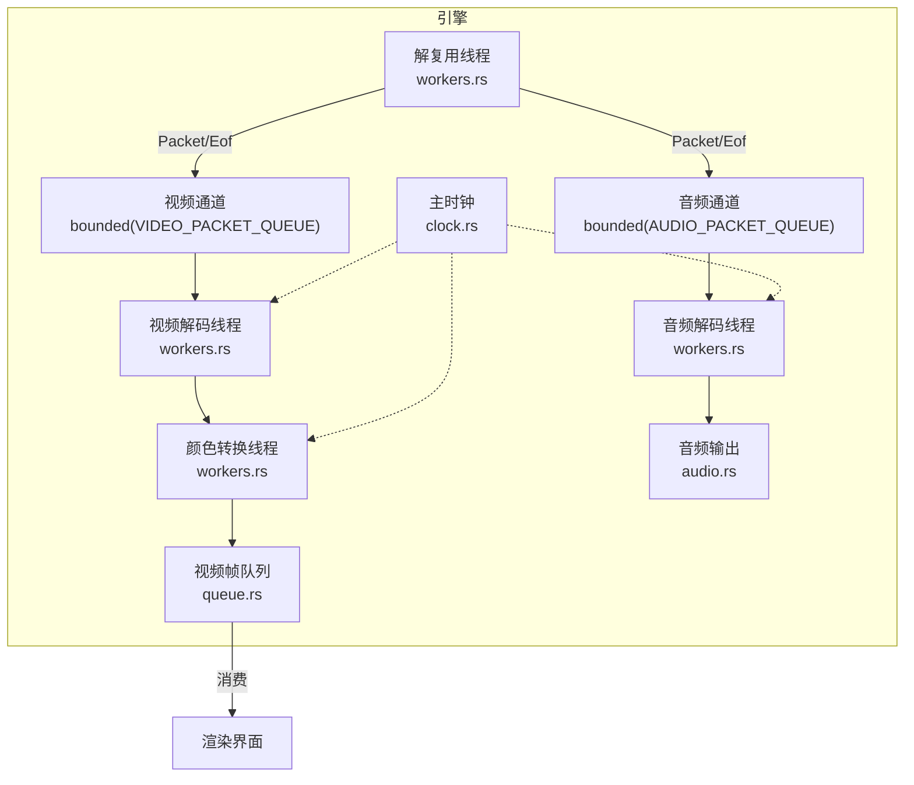
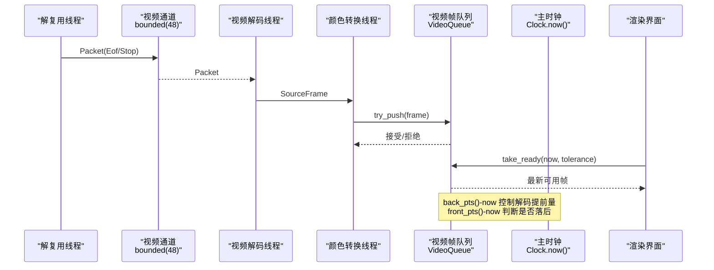
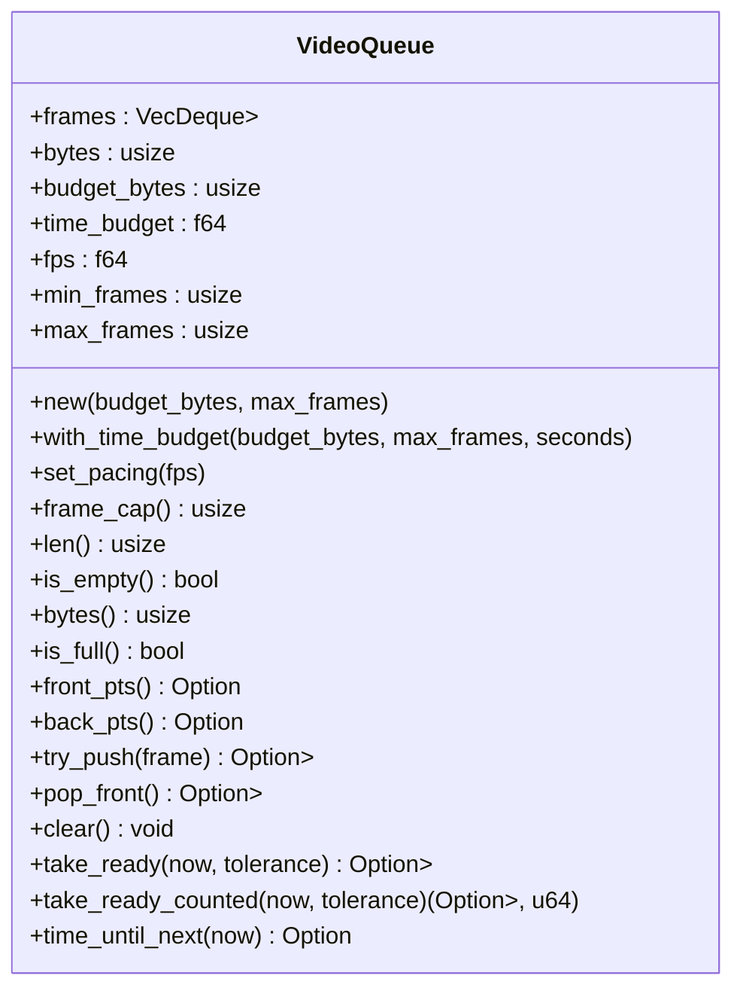
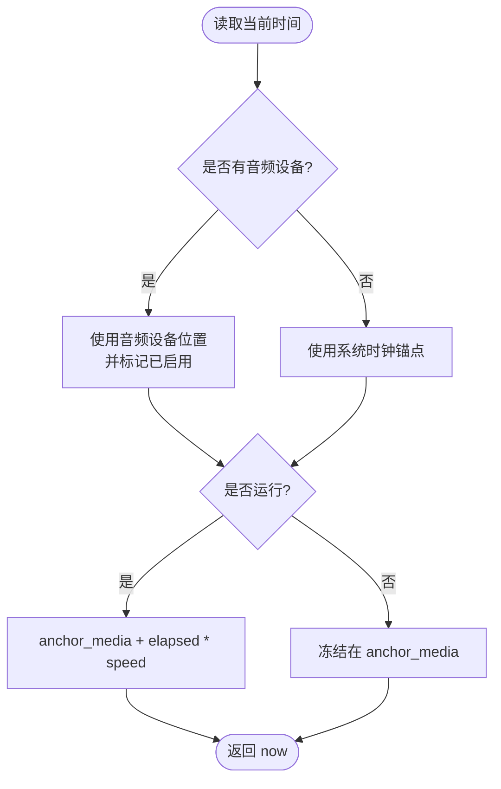
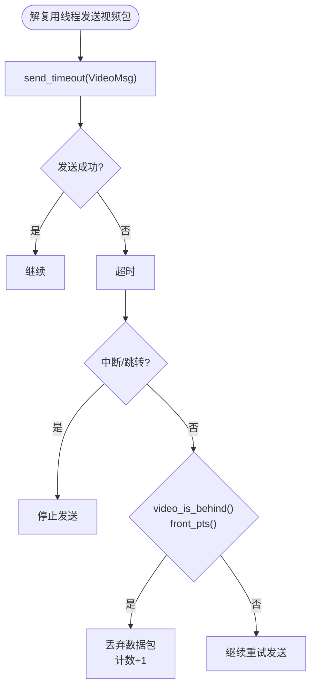
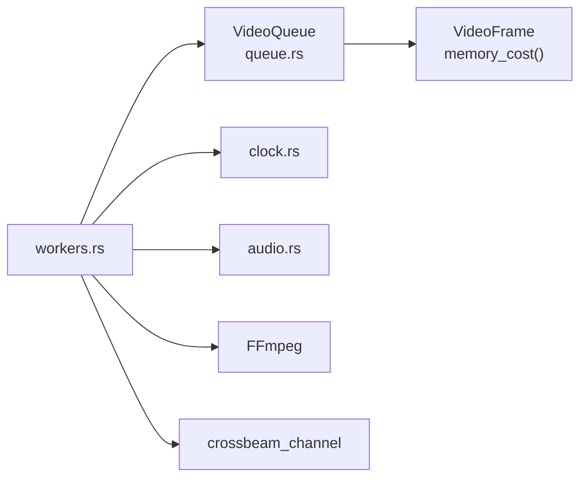

# 队列管理设计

<cite>
**本文引用的文件**   
- [crates/mvp-core/src/engine/queue.rs](file://crates/mvp-core/src/engine/queue.rs)
- [crates/mvp-core/src/engine/clock.rs](file://crates/mvp-core/src/engine/clock.rs)
- [crates/mvp-core/src/engine/workers.rs](file://crates/mvp-core/src/engine/workers.rs)
- [crates/mvp-core/src/audio.rs](file://crates/mvp-core/src/audio.rs)
- [crates/mvp-core/examples/fps_probe.rs](file://crates/mvp-core/examples/fps_probe.rs)
</cite>

## 目录
1. [引言](#引言)
2. [项目结构](#项目结构)
3. [核心组件](#核心组件)
4. [架构总览](#架构总览)
5. [详细组件分析](#详细组件分析)
6. [依赖关系分析](#依赖关系分析)
7. [性能与调优建议](#性能与调优建议)
8. [故障排查指南](#故障排查指南)
9. [结论](#结论)

## 引言
本设计文档聚焦于播放器引擎中的“队列管理系统”，重点解释以下目标：
- 为什么视频队列采用“按字节数限制”而非“按帧数限制”的设计，以及如何避免内存溢出并适配不同分辨率和编码格式。
- 视频队列与音频队列的不同策略，包括常量 VIDEO_PACKET_QUEUE=48、AUDIO_PACKET_QUEUE=192 的设计考量。
- 队列的前后沿管理：front_pts() 用于判断是否落后于时钟，back_pts() 用于控制解码提前量。
- 节流机制：当队列超过阈值时如何通知上游减速或丢弃数据包。
- 队列状态监控与性能调优建议。

## 项目结构
与队列管理直接相关的代码集中在 mvp-core 的 engine 模块中：
- queue.rs：定义视频帧队列 VideoQueue，提供字节预算、时间预算、前后沿 PTS 查询、取帧等能力。
- workers.rs：解复用线程、视频解码线程、颜色转换线程、音频解码线程；包含通道容量常量、丢包/跳过逻辑、解码提前量门控等。
- clock.rs：主播放时钟，统一媒体位置来源（音频设备优先，回退到系统时钟）。
- audio.rs：音频输出端点，提供缓冲长度、欠载统计等监控指标。
- fps_probe.rs：示例程序，周期性打印队列、解码、丢弃等性能快照。

**图表来源**
- [crates/mvp-core/src/engine/workers.rs:25-51](file://crates/mvp-core/src/engine/workers.rs#L25-L51)
- [crates/mvp-core/src/engine/queue.rs:67-86](file://crates/mvp-core/src/engine/queue.rs#L67-L86)
- [crates/mvp-core/src/engine/clock.rs:43-46](file://crates/mvp-core/src/engine/clock.rs#L43-L46)
- [crates/mvp-core/src/audio.rs:477-506](file://crates/mvp-core/src/audio.rs#L477-L506)

**章节来源**
- [crates/mvp-core/src/engine/queue.rs:67-253](file://crates/mvp-core/src/engine/queue.rs#L67-L253)
- [crates/mvp-core/src/engine/workers.rs:25-128](file://crates/mvp-core/src/engine/workers.rs#L25-L128)
- [crates/mvp-core/src/engine/clock.rs:1-46](file://crates/mvp-core/src/engine/clock.rs#L1-L46)
- [crates/mvp-core/src/audio.rs:477-506](file://crates/mvp-core/src/audio.rs#L477-L506)

## 核心组件
- 视频帧队列 VideoQueue：以字节预算为主、可选时间预算为辅，维护最小/最大帧数，提供 front_pts()/back_pts()、is_full()/try_push()/take_ready() 等接口。
- 主时钟 Clock：提供 now()、set_speed()、seek()、set_running()，作为音视频同步的主参考。
- 工作线程与通道：
  - 视频通道 bounded(VIDEO_PACKET_QUEUE=48)，用于解复用到视频解码。
  - 音频通道 bounded(AUDIO_PACKET_QUEUE=192)，用于解复用到音频解码。
  - 解码器到转换器之间使用小型队列（VIDEO_SOURCE_QUEUE=4）隔离两阶段抖动。
- 音频输出 AudioSink：提供 queued_seconds()、underruns()、dropped_chunks() 等监控指标。

**章节来源**
- [crates/mvp-core/src/engine/queue.rs:67-253](file://crates/mvp-core/src/engine/queue.rs#L67-L253)
- [crates/mvp-core/src/engine/clock.rs:43-158](file://crates/mvp-core/src/engine/clock.rs#L43-L158)
- [crates/mvp-core/src/engine/workers.rs:25-51](file://crates/mvp-core/src/engine/workers.rs#L25-L51)
- [crates/mvp-core/src/audio.rs:477-506](file://crates/mvp-core/src/audio.rs#L477-L506)

## 架构总览
下图展示从解复用到呈现的关键数据流与控制流，以及队列在其中的作用。

**图表来源**
- [crates/mvp-core/src/engine/workers.rs:1382-1444](file://crates/mvp-core/src/engine/workers.rs#L1382-L1444)
- [crates/mvp-core/src/engine/queue.rs:170-253](file://crates/mvp-core/src/engine/queue.rs#L170-L253)
- [crates/mvp-core/src/engine/clock.rs:122-158](file://crates/mvp-core/src/engine/clock.rs#L122-L158)

## 详细组件分析

### 视频队列 VideoQueue：按字节预算为主的时间预算队列
- 设计要点
  - 字节预算 budget_bytes：防止高码率/高分辨率导致内存爆炸。例如 4K RGBA 单帧可达数十 MB，若仅按帧数限制，可能占用数百 MB。
  - 时间预算 time_budget：将“延迟上限”转化为帧数上限，避免“只限内存但允许无限超前”。通过 set_pacing(fps) 把秒数换算为帧数。
  - 最小/最大帧数：min_frames=2 保证基本缓冲；max_frames 由构造参数决定，且受时间预算约束。
  - is_full()：同时检查帧数上限与字节预算，任一超限即认为满。
  - front_pts()/back_pts()：分别返回队首与队尾 PTS，供外部判断“是否落后”和“是否超前过多”。
  - try_push()/pop_front()/clear()：严格 FIFO，满时不丢弃旧帧，而是返回待入队帧给调用者等待。
  - take_ready()/take_ready_counted()：取出所有已到期帧，返回最新一个；同时统计被覆盖丢弃的帧数，用于区分“解码跟不上”和“屏幕不需要这么多帧”。

**图表来源**
- [crates/mvp-core/src/engine/queue.rs:67-253](file://crates/mvp-core/src/engine/queue.rs#L67-L253)

**章节来源**
- [crates/mvp-core/src/engine/queue.rs:67-253](file://crates/mvp-core/src/engine/queue.rs#L67-L253)

### 主时钟 Clock：统一的媒体时间源
- 作用
  - 提供 now() 作为当前媒体时间，驱动队列的“到期判断”和“提前量门控”。
  - 支持 seek()、set_running()、set_speed()，并在有音频设备时优先以音频设备位置校准。
- 与队列的关系
  - 视频转换线程用 back_pts()-now < VIDEO_LEAD 控制解码提前量。
  - 解复用线程用 front_pts()-now > RESYNC_LAG 判断视频是否落后，决定是否丢弃数据包。

**图表来源**
- [crates/mvp-core/src/engine/clock.rs:133-158](file://crates/mvp-core/src/engine/clock.rs#L133-L158)

**章节来源**
- [crates/mvp-core/src/engine/clock.rs:43-158](file://crates/mvp-core/src/engine/clock.rs#L43-L158)

### 视频通道与工作线程：节流与丢包策略
- 通道容量
  - VIDEO_PACKET_QUEUE=48：解复用到视频解码的通道容量。
  - AUDIO_PACKET_QUEUE=192：解复用到音频解码的通道容量。
- 解复用线程对视频通道的发送策略 send_video()
  - 使用超时发送，周期检查中断/跳转。
  - 如果视频队列“落后于时钟”（front_pts() < now - RESYNC_LAG），则丢弃该数据包，避免继续阻塞解复用线程而饿死音频。
- 解码线程与转换线程
  - 解码线程 drain_video()：丢弃早于 seek 目标的帧；若 pts < now - 0.25 且队列非空，则丢弃以避免进一步落后。
  - 转换线程 run_video_converter()：
    - 使用 back_pts()-now < VIDEO_LEAD 控制解码提前量，确保不会跑得太远。
    - 当队列满或提前量过大时，等待直到可入队；等待期间会响应中止/跳转信号。

**图表来源**
- [crates/mvp-core/src/engine/workers.rs:201-262](file://crates/mvp-core/src/engine/workers.rs#L201-L262)

**章节来源**
- [crates/mvp-core/src/engine/workers.rs:201-262](file://crates/mvp-core/src/engine/workers.rs#L201-L262)
- [crates/mvp-core/src/engine/workers.rs:1138-1266](file://crates/mvp-core/src/engine/workers.rs#L1138-L1266)
- [crates/mvp-core/src/engine/workers.rs:1297-1447](file://crates/mvp-core/src/engine/workers.rs#L1297-L1447)

### 音频队列与输出：缓冲与欠载监控
- 音频通道容量 AUDIO_PACKET_QUEUE=192：比视频更大，因为音频对实时性要求更高，且需要更平滑地应对网络/磁盘抖动。
- 音频输出 AudioSink
  - queued_seconds()：根据实际 chunk 大小估算缓冲时长。
  - underruns()：记录设备欠载次数。
  - dropped_chunks()：记录因队列满而丢弃的块数量。
- 音频解码提前量 AUDIO_LEAD=0.5s：限制音频解码领先播放头的真实秒数，避免慢速播放下用户感知到的延迟过大。

**章节来源**
- [crates/mvp-core/src/engine/workers.rs:50-91](file://crates/mvp-core/src/engine/workers.rs#L50-L91)
- [crates/mvp-core/src/audio.rs:477-506](file://crates/mvp-core/src/audio.rs#L477-L506)

### 关键常量与设计权衡
- VIDEO_PACKET_QUEUE=48：足够容纳一定数量的未解码包，避免频繁阻塞解复用线程，同时限制内存占用。
- AUDIO_PACKET_QUEUE=192：更大的音频缓冲，保障声音连续性与低延迟切换。
- VIDEO_LEAD=0.5s：视频解码最多领先播放头 0.5 秒，平衡流畅度与响应性。
- AUDIO_LEAD=0.5s：音频解码最多领先 0.5 秒真实时间，避免慢速播放下的“感觉延迟”。
- RESYNC_LAG=0.25s：视频落后超过 0.25 秒即视为落后，触发丢包恢复。
- DECODE_STALL=12s：解码无输出判定为卡死的阈值，防止误判容器导致的长时间空转。

**章节来源**
- [crates/mvp-core/src/engine/workers.rs:25-128](file://crates/mvp-core/src/engine/workers.rs#L25-L128)

## 依赖关系分析
- 耦合关系
  - VideoQueue 依赖 VideoFrame 的 memory_cost() 计算字节开销。
  - 工作线程依赖 Shared 提供的全局状态（时钟、队列、事件、配置）。
  - 音频输出依赖 AudioSink 的位置与缓冲状态，作为主时钟的权威来源之一。
- 外部依赖
  - FFmpeg：解复用、解码、硬件加速路径。
  - crossbeam_channel：带超时的有界通道，实现背压与节流。
  - parking_lot::Mutex：高性能互斥锁，保护共享状态。

**图表来源**
- [crates/mvp-core/src/engine/queue.rs:67-253](file://crates/mvp-core/src/engine/queue.rs#L67-L253)
- [crates/mvp-core/src/engine/workers.rs:1-128](file://crates/mvp-core/src/engine/workers.rs#L1-L128)
- [crates/mvp-core/src/engine/clock.rs:1-46](file://crates/mvp-core/src/engine/clock.rs#L1-L46)
- [crates/mvp-core/src/audio.rs:477-506](file://crates/mvp-core/src/audio.rs#L477-L506)

**章节来源**
- [crates/mvp-core/src/engine/queue.rs:67-253](file://crates/mvp-core/src/engine/queue.rs#L67-L253)
- [crates/mvp-core/src/engine/workers.rs:1-128](file://crates/mvp-core/src/engine/workers.rs#L1-L128)
- [crates/mvp-core/src/engine/clock.rs:1-46](file://crates/mvp-core/src/engine/clock.rs#L1-L46)
- [crates/mvp-core/src/audio.rs:477-506](file://crates/mvp-core/src/audio.rs#L477-L506)

## 性能与调优建议
- 监控指标
  - 队列帧数：snapshot.queued_frames。
  - 音频缓冲时长：snapshot.audio_queue_seconds。
  - 解码帧数、丢弃帧数、呈现丢弃帧数、跳过帧数：snapshot.decoded_frames/dropped_frames/presentation_drops/skipped_frames。
  - 各阶段耗时：download_ms、convert_ms、tone_map_ms、queue_wait_ms。
- 调优方向
  - 调整 VIDEO_PACKET_QUEUE/AUDIO_PACKET_QUEUE：在网络不稳定场景可适当增大，但需评估内存占用。
  - 调整 VIDEO_LEAD/AUDIO_LEAD：提高流畅度会增加延迟，降低则提升响应性。
  - 调整 RESYNC_LAG：更敏感的回退检测可减少卡顿，但可能导致更多丢包。
  - 调整 DECODE_STALL：对高延迟/大 I/O 场景适当放宽，避免误报。
  - 观察 AudioSink.underruns()/dropped_chunks()：若欠载频繁，考虑增大音频缓冲或优化音频路径。

**章节来源**
- [crates/mvp-core/examples/fps_probe.rs:106-176](file://crates/mvp-core/examples/fps_probe.rs#L106-L176)
- [crates/mvp-core/src/audio.rs:477-506](file://crates/mvp-core/src/audio.rs#L477-L506)
- [crates/mvp-core/src/engine/workers.rs:93-128](file://crates/mvp-core/src/engine/workers.rs#L93-L128)

## 故障排查指南
- 常见问题
  - 画面卡顿：检查 dropped_frames 是否快速上升，确认是否因 front_pts() 落后于时钟触发丢包。
  - 音画不同步：检查 AudioSink.underruns() 是否增加，必要时增大 AUDIO_PACKET_QUEUE 或优化音频路径。
  - 解码无输出：DECODE_STALL 触发，可能是容器误判或损坏，查看错误日志。
  - 跳转后黑屏：检查 generation 是否正确递增，Eof 是否被忽略，队列是否清空。
- 定位步骤
  - 使用 fps_probe 示例打印快照，关注 queued_frames、audio_queue_seconds、dropped_frames、queue_wait_ms。
  - 检查 video_is_behind() 的判断条件，确认 RESYNC_LAG 是否合理。
  - 检查 run_video_converter() 的 lead gate，确认 VIDEO_LEAD 是否过大导致延迟。

**章节来源**
- [crates/mvp-core/src/engine/workers.rs:201-262](file://crates/mvp-core/src/engine/workers.rs#L201-L262)
- [crates/mvp-core/src/engine/workers.rs:1094-1103](file://crates/mvp-core/src/engine/workers.rs#L1094-L1103)
- [crates/mvp-core/examples/fps_probe.rs:106-176](file://crates/mvp-core/examples/fps_probe.rs#L106-L176)

## 结论
本队列管理系统通过“字节预算为主、时间预算为辅”的视频队列设计，有效避免了高分辨率/高码率场景下的内存溢出，并通过 front_pts()/back_pts() 精确控制解码提前量与落后检测。视频与音频队列采用不同的容量与策略，兼顾流畅度与响应性。结合主时钟与监控指标，系统可在复杂环境下保持稳定播放，并为性能调优提供明确依据。