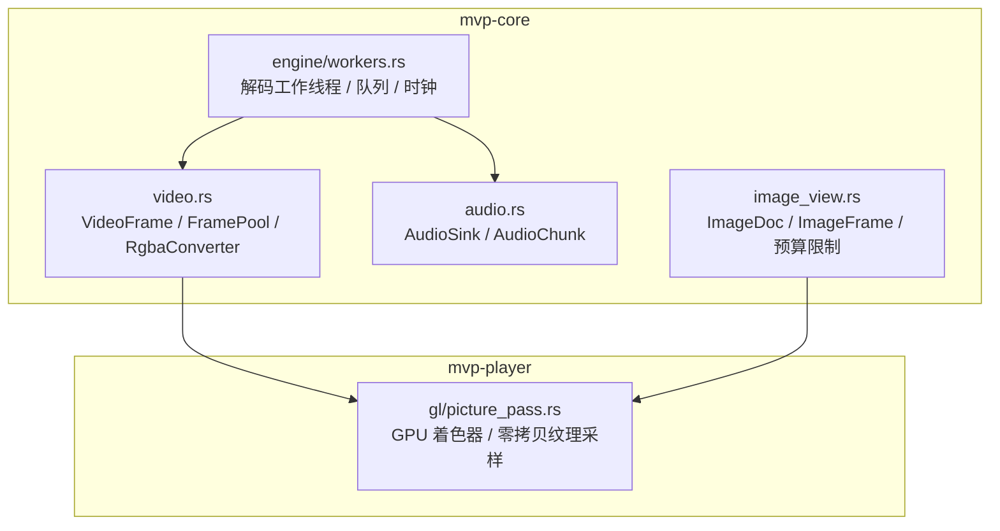
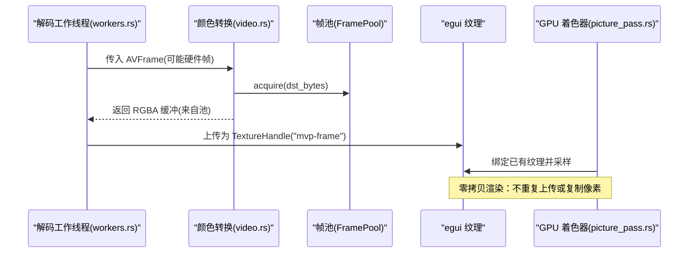
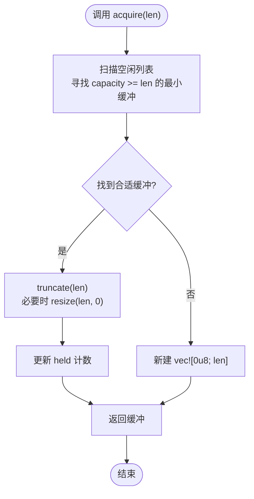
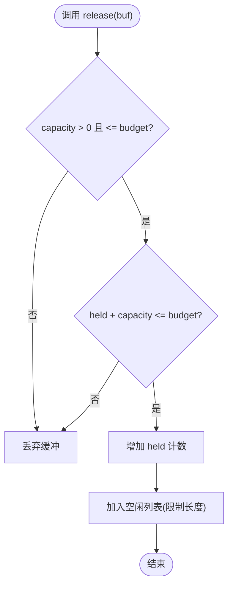
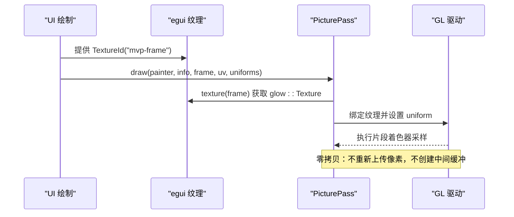
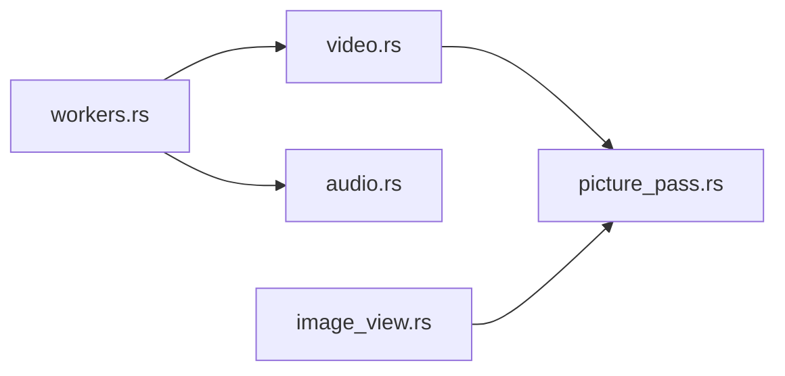

# 内存管理

<cite>
**本文引用的文件**   
- [video.rs](file://crates/mvp-core/src/video.rs)
- [audio.rs](file://crates/mvp-core/src/audio.rs)
- [workers.rs](file://crates/mvp-core/src/engine/workers.rs)
- [picture_pass.rs](file://crates/mvp-player/src/gl/picture_pass.rs)
- [image_view.rs](file://crates/mvp-core/src/image_view.rs)
</cite>

## 目录
1. [简介](#简介)
2. [项目结构](#项目结构)
3. [核心组件](#核心组件)
4. [架构总览](#架构总览)
5. [详细组件分析](#详细组件分析)
6. [依赖关系分析](#依赖关系分析)
7. [性能与内存特性](#性能与内存特性)
8. [故障排查指南](#故障排查指南)
9. [结论](#结论)
10. [附录：最佳实践与常见问题](#附录最佳实践与常见问题)

## 简介
本文围绕 MVP 多格式播放器的内存管理实现，重点说明以下方面：
- 帧池化机制：FramePool 的设计原理、缓冲区分配策略、内存预算控制。
- 零拷贝渲染技术：如何避免不必要的内存复制，直接操作 GPU 纹理。
- 内存泄漏防护：RAII 模式、智能指针使用、资源自动清理。
- 数据类型内存布局与生命周期：VideoFrame、AudioBuffer（音频块）等。
- 内存监控、性能分析与调试工具的使用。
- 内存优化最佳实践与常见问题解决方案。

本项目的视频路径以“解码 → 转换/色调映射 → 写入预分配 RGBA 缓冲 → 上传为 egui 纹理”为主；音频路径通过无锁通道将样本交给实时设备回调；图像路径独立于视频管线，直接解码到 RGBA 并受像素/尺寸预算限制。

## 项目结构
与内存管理密切相关的代码分布在以下模块：
- mvp-core：核心解码、转换、音频输出、图片加载。
- mvp-player：GPU 渲染与 UI 集成。

**图表来源**
- [video.rs:18-142](file://crates/mvp-core/src/video.rs#L18-L142)
- [audio.rs:66-162](file://crates/mvp-core/src/audio.rs#L66-L162)
- [workers.rs:25-50](file://crates/mvp-core/src/engine/workers.rs#L25-L50)
- [image_view.rs:15-36](file://crates/mvp-core/src/image_view.rs#L15-L36)
- [picture_pass.rs:1-25](file://crates/mvp-player/src/gl/picture_pass.rs#L1-L25)

**章节来源**
- [video.rs:1-142](file://crates/mvp-core/src/video.rs#L1-L142)
- [audio.rs:1-162](file://crates/mvp-core/src/audio.rs#L1-L162)
- [workers.rs:1-50](file://crates/mvp-core/src/engine/workers.rs#L1-L50)
- [image_view.rs:1-36](file://crates/mvp-core/src/image_view.rs#L1-L36)
- [picture_pass.rs:1-25](file://crates/mvp-player/src/gl/picture_pass.rs#L1-L25)

## 核心组件
- VideoFrame：表示一帧已解码、可直接显示的 RGBA 像素数据，包含宽高、时间戳、序列号、生成代等信息，并提供字节长度、有效性检查与近似内存占用估算。
- FramePool：按“最佳适配”策略复用 Vec<u8> 作为 RGBA 像素缓冲，维护全局预算与空闲列表上限，避免频繁分配和清零开销。
- RgbaConverter：负责 YUV→RGBA 缩放、Dolby Vision 重塑、HDR→SDR 色调映射，并将结果直接写入 FramePool 提供的缓冲。
- AudioSink/AudioChunk：音频输出端，使用跨线程无锁通道传递 f32 交错样本，提供精确主时钟、丢包/欠载统计、音量平滑与实时增益。
- ImageDoc/ImageFrame：静态图与动画帧的 RGBA 缓冲，带像素数、最大维度、动画帧数与总字节预算。
- PicturePass：在 GPU 上对 egui 纹理进行单通道着色处理，避免二次上传与中间缓冲。

**章节来源**
- [video.rs:18-142](file://crates/mvp-core/src/video.rs#L18-L142)
- [audio.rs:66-162](file://crates/mvp-core/src/audio.rs#L66-L162)
- [image_view.rs:15-36](file://crates/mvp-core/src/image_view.rs#L15-L36)
- [picture_pass.rs:1-25](file://crates/mvp-player/src/gl/picture_pass.rs#L1-L25)

## 架构总览
下图展示从解码到渲染的关键内存路径：解码线程产出 AVFrame，必要时下载至系统内存；RgbaConverter 将像素写入 FramePool 分配的 RGBA 缓冲；egui 将该缓冲上传为 GPU 纹理；PicturePass 直接采样该纹理进行画面增强，无需再次复制像素。

**图表来源**
- [workers.rs:1229-1258](file://crates/mvp-core/src/engine/workers.rs#L1229-L1258)
- [video.rs:687-705](file://crates/mvp-core/src/video.rs#L687-L705)
- [picture_pass.rs:1-25](file://crates/mvp-player/src/gl/picture_pass.rs#L1-L25)

## 详细组件分析

### 帧池化机制：FramePool 设计与预算控制
FramePool 是一个小型空闲列表，用于复用 RGBA 字节缓冲，避免每帧 megabytes 级别的分配与清零。其关键设计点：
- 分配策略：acquire(len) 在空闲列表中查找“最小足够大”的缓冲（best-fit），减少大缓冲浪费；若找不到则新建长度为 len 的缓冲。
- 释放策略：release(buf) 仅回收容量非零且不超过预算的缓冲；同时限制空闲列表长度，防止过多对象堆积。
- 预算控制：held 字段跟踪池中缓冲的总容量，确保 buffered_bytes() 不会超过 budget。
- 清理接口：clear() 在播放停止时清空池，释放所有空闲缓冲。

**图表来源**
- [video.rs:79-111](file://crates/mvp-core/src/video.rs#L79-L111)

释放流程：

**图表来源**
- [video.rs:113-130](file://crates/mvp-core/src/video.rs#L113-L130)

**章节来源**
- [video.rs:57-142](file://crates/mvp-core/src/video.rs#L57-L142)

### 零拷贝渲染技术：GPU 纹理直采
PicturePass 的核心思想是：视频帧已经作为 egui 的 TextureHandle 存在于 GPU 中，渲染增强时直接绑定该纹理并在片段着色器中采样，从而避免第二次上传与像素复制。

关键点：
- 使用 egui_glow 获取底层 glow::Texture，绑定到当前绘制上下文。
- 单次片段着色完成白平衡、亮度对比度、伽马、饱和度、锐化、边缘感知平滑等效果。
- 仅在需要离屏快照时才创建临时 FBO 并读回像素，正常显示路径不产生额外缓冲。

**图表来源**
- [picture_pass.rs:1-25](file://crates/mvp-player/src/gl/picture_pass.rs#L1-L25)
- [picture_pass.rs:331-381](file://crates/mvp-player/src/gl/picture_pass.rs#L331-L381)

**章节来源**
- [picture_pass.rs:1-25](file://crates/mvp-player/src/gl/picture_pass.rs#L1-L25)
- [picture_pass.rs:331-381](file://crates/mvp-player/src/gl/picture_pass.rs#L331-L381)

### 内存泄漏防护：RAII、智能指针与自动清理
项目中广泛采用 RAII 与智能指针来保证资源自动释放：
- cpal::Stream：AudioSink 持有流句柄，Drop 时自动关闭音频输出。
- Arc<Shared>：共享状态通过引用计数安全跨线程访问。
- Mutex<Vec<Vec<u8>>>：FramePool 的空闲列表使用互斥保护，避免竞争条件。
- crossbeam_channel：bounded channel 在发送阻塞时提供背压，避免无限增长。
- ffmpeg_next 的 AVFrame：通过 av_frame_ref 引用计数，移动帧而不复制像素缓冲。

这些机制确保：
- 线程退出或播放器关闭时，音频流、解码上下文、帧缓冲等资源被正确释放。
- 长时间运行的播放过程中，队列长度与池大小受到预算限制，避免内存持续增长。

**章节来源**
- [audio.rs:153-170](file://crates/mvp-core/src/audio.rs#L153-L170)
- [video.rs:63-67](file://crates/mvp-core/src/video.rs#L63-L67)
- [workers.rs:1229-1258](file://crates/mvp-core/src/engine/workers.rs#L1229-L1258)

### 数据类型内存布局与生命周期

#### VideoFrame
- 内存布局：紧凑 RGBA8，大小为 width × height × 4 字节，无行对齐填充。
- 生命周期：由 RgbaConverter.convert 从 FramePool.acquire 获取缓冲，经缩放/色调映射后返回给上层；上层将其上传为 egui 纹理后，缓冲可被释放回池。
- 有效性检查：is_valid() 确保宽高为正且 data 长度足够。
- 内存成本估算：memory_cost() 使用 capacity 与 len 的最大值，便于队列预算。

**章节来源**
- [video.rs:18-55](file://crates/mvp-core/src/video.rs#L18-L55)

#### AudioBuffer（AudioChunk）
- 内存布局：Vec<f32> 交错样本，携带 generation 标记用于 seek 后丢弃旧数据。
- 生命周期：解码线程 push(samples, pts)，设备回调从 bounded channel 取出并播放；flush 时递增 generation，回调丢弃旧 chunk。
- 预算控制：channel 有界，push 超时退避，closed 标志允许快速退出。

**章节来源**
- [audio.rs:66-116](file://crates/mvp-core/src/audio.rs#L66-L116)
- [audio.rs:519-575](file://crates/mvp-core/src/audio.rs#L519-L575)

#### ImageFrame
- 内存布局：紧凑 RGBA8，大小 width × height × 4 字节。
- 生命周期：load() 解码为 ImageDoc.frames，受 MAX_PIXELS、MAX_DIMENSION、MAX_ANIMATION_FRAMES、MAX_ANIMATION_BYTES 限制；ImageView 持有文档并管理动画时钟。

**章节来源**
- [image_view.rs:15-36](file://crates/mvp-core/src/image_view.rs#L15-L36)
- [image_view.rs:416-492](file://crates/mvp-core/src/image_view.rs#L416-L492)

## 依赖关系分析
- workers.rs 协调 demuxer、video decoder、audio decoder，并通过 bounded channels 与 queue 控制前后阶段。
- video.rs 的 RgbaConverter 依赖 FFmpeg 的 SwsContext 与 pixel format descriptor，结合 FramePool 输出 RGBA。
- audio.rs 的 AudioSink 依赖 cpal 与 crossbeam，提供实时音频输出与统计。
- picture_pass.rs 依赖 egui_glow 与 glow，直接采样 egui 纹理。
- image_view.rs 独立于视频管线，使用 image crate 解码静态图与动画。

**图表来源**
- [workers.rs:1-50](file://crates/mvp-core/src/engine/workers.rs#L1-L50)
- [video.rs:1-142](file://crates/mvp-core/src/video.rs#L1-L142)
- [audio.rs:1-162](file://crates/mvp-core/src/audio.rs#L1-L162)
- [picture_pass.rs:1-25](file://crates/mvp-player/src/gl/picture_pass.rs#L1-L25)
- [image_view.rs:1-36](file://crates/mvp-core/src/image_view.rs#L1-L36)

**章节来源**
- [workers.rs:1-50](file://crates/mvp-core/src/engine/workers.rs#L1-L50)
- [video.rs:1-142](file://crates/mvp-core/src/video.rs#L1-L142)
- [audio.rs:1-162](file://crates/mvp-core/src/audio.rs#L1-L162)
- [picture_pass.rs:1-25](file://crates/mvp-player/src/gl/picture_pass.rs#L1-L25)
- [image_view.rs:1-36](file://crates/mvp-core/src/image_view.rs#L1-L36)

## 性能与内存特性
- 帧池化降低分配与清零开销：FramePool.acquire 避免对大缓冲进行 memset，release 限制空闲列表长度与总预算。
- 零拷贝渲染减少 GPU 带宽压力：PicturePass 直接采样 egui 纹理，避免二次上传。
- 音频路径无锁实时：AudioSink 使用原子与 bounded channel，避免回调阻塞。
- 图像加载预算：MAX_PIXELS、MAX_DIMENSION、MAX_ANIMATION_FRAMES、MAX_ANIMATION_BYTES 防止超大图或动画耗尽内存。
- 解码队列与领先量：VIDEO_LEAD、AUDIO_LEAD、RESYNC_LAG 控制解码提前量与重同步阈值，平衡延迟与稳定性。

[本节为通用性能讨论，不直接分析具体文件]

## 故障排查指南
- 视频帧无效：检查 VideoFrame.is_valid() 与 RgbaConverter.prepare() 的尺寸/格式校验。
- 音频欠载：观察 AudioSink.underruns() 与 queued_seconds()，调整队列深度或设备配置。
- 内存增长：监控 FramePool.buffered_bytes() 与 ImageDoc 的 frames 总字节，确认预算是否生效。
- 渲染失败：PicturePass.failed 指示着色器编译/链接失败，回退到原始渲染路径。
- 解码卡顿：检查 workers.rs 中的 DECODE_STALL、VIDEO_LEAD、AUDIO_LEAD 与 RESYNC_LAG 参数。

**章节来源**
- [video.rs:44-55](file://crates/mvp-core/src/video.rs#L44-L55)
- [audio.rs:478-506](file://crates/mvp-core/src/audio.rs#L478-L506)
- [picture_pass.rs:120-137](file://crates/mvp-player/src/gl/picture_pass.rs#L120-L137)
- [workers.rs:67-118](file://crates/mvp-core/src/engine/workers.rs#L67-L118)

## 结论
本项目通过 FramePool 的预算化缓冲复用、PicturePass 的零拷贝纹理采样、AudioSink 的无锁实时输出以及严格的图像加载预算，构建了高效且安全的内存管理体系。RAII 与智能指针贯穿各层，确保资源自动释放；队列与领先量参数平衡了延迟与稳定性。在实际使用中，建议结合监控指标与调试工具，持续优化内存占用与渲染性能。

[本节为总结性内容，不直接分析具体文件]

## 附录：最佳实践与常见问题

### 最佳实践
- 始终通过 FramePool.acquire/release 管理视频像素缓冲，避免直接 Vec 分配。
- 启用 PicturePass 的单通道着色，避免中间缓冲与二次上传。
- 合理设置 VIDEO_LEAD、AUDIO_LEAD、RESYNC_LAG，根据设备性能调优。
- 对大图与动画启用 MAX_DIMENSION、MAX_PIXELS、MAX_ANIMATION_BYTES 限制。
- 使用 AudioSink.flush 与 generation 机制确保 seek 后旧数据被丢弃。

### 常见问题
- 内存泄漏：确认所有 Vec<u8> 通过 FramePool.release 归还，AudioSink.close 被调用。
- 渲染黑屏：检查 PicturePass.failed 与 egui 纹理是否存在。
- 音频爆音：检查 underruns 与 queued_seconds，调整设备采样率与队列深度。
- 解码卡顿：检查 DECODE_STALL 与队列长度，必要时降低解码提前量。

[本节为通用指导，不直接分析具体文件]