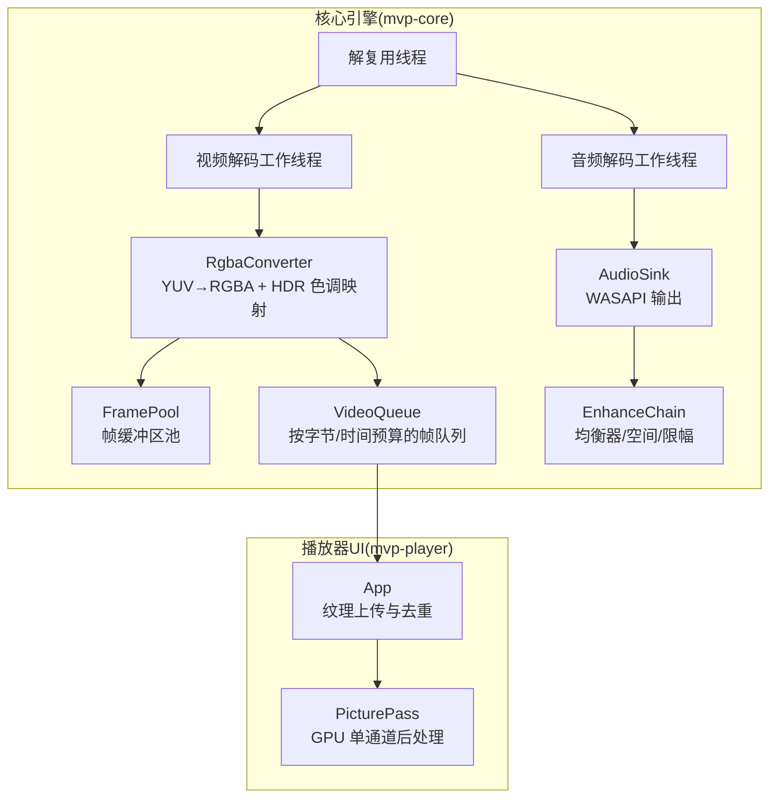
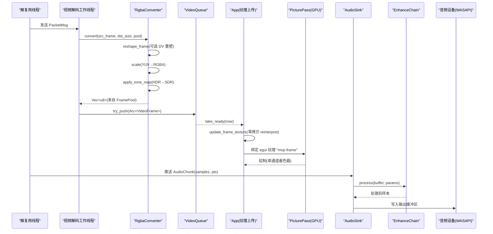
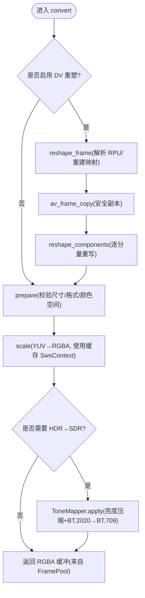
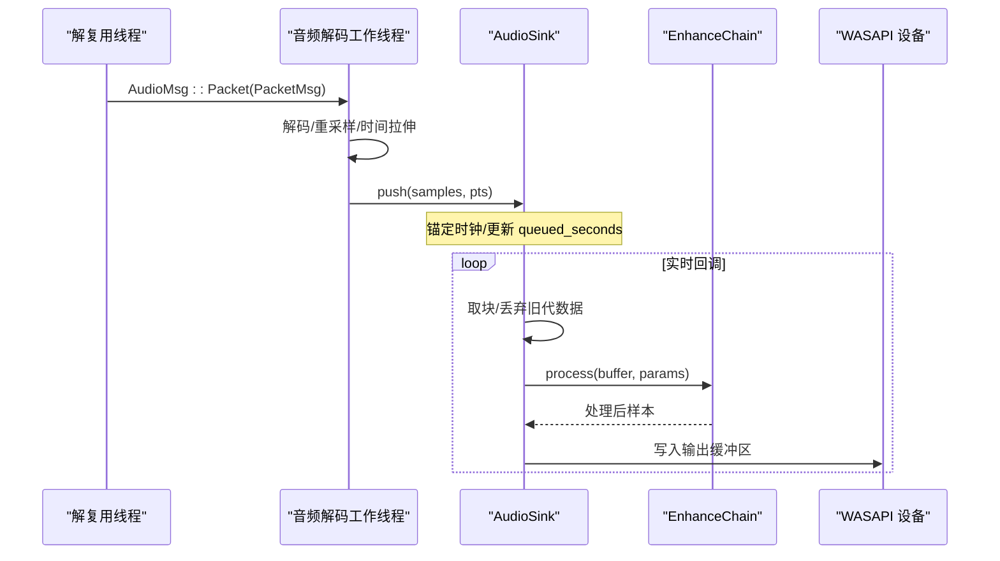
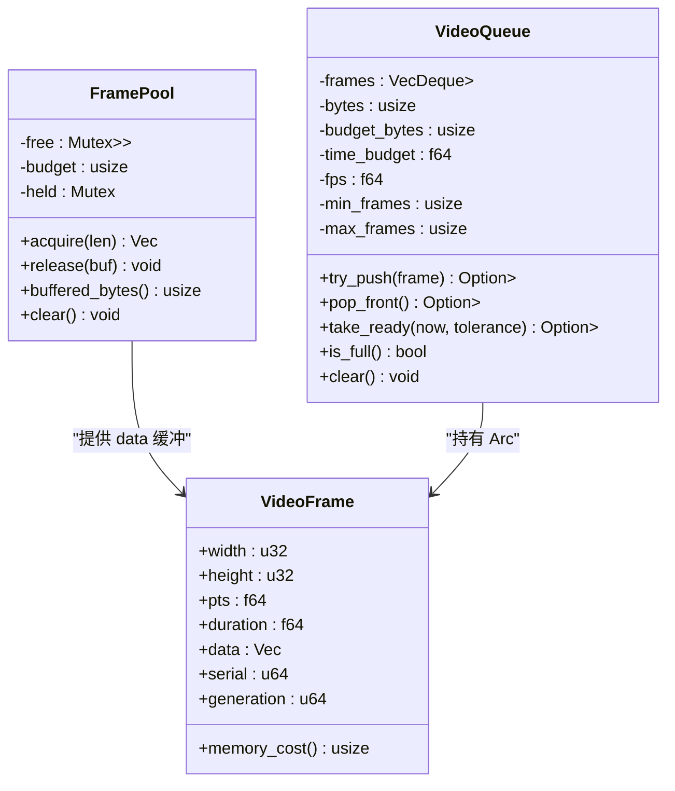
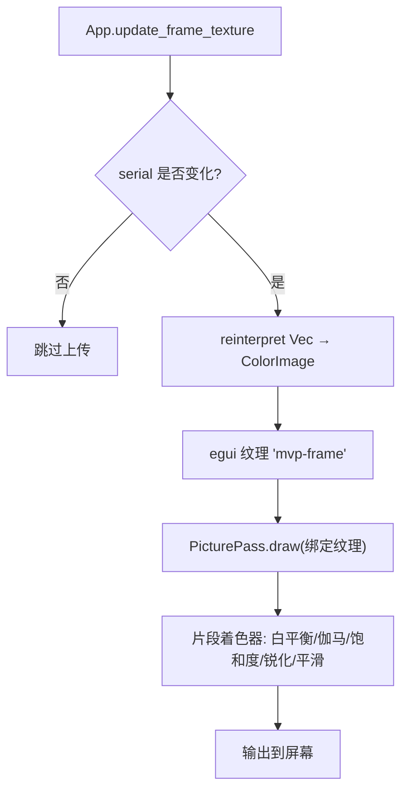
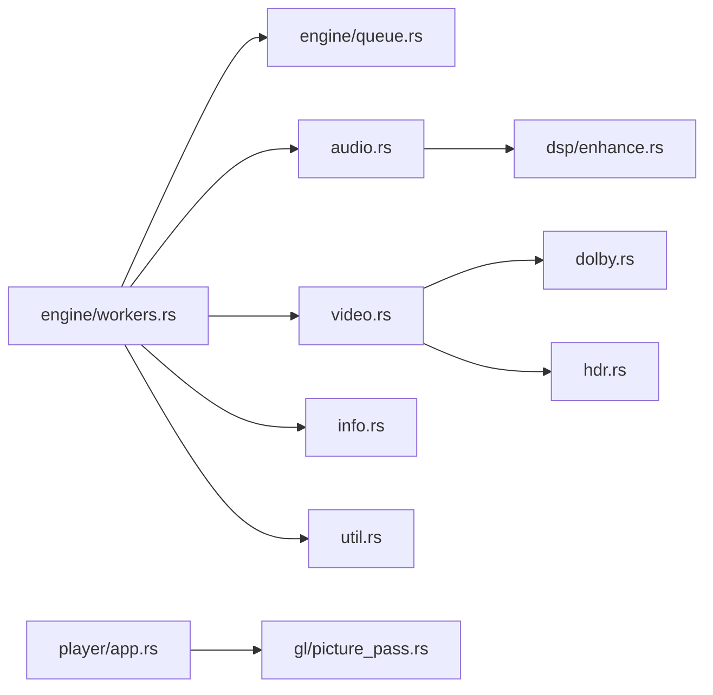

# 数据流设计

<cite>
**本文引用的文件**   
- [lib.rs](file://crates/mvp-core/src/lib.rs)
- [video.rs](file://crates/mvp-core/src/video.rs)
- [audio.rs](file://crates/mvp-core/src/audio.rs)
- [queue.rs](file://crates/mvp-core/src/engine/queue.rs)
- [workers.rs](file://crates/mvp-core/src/engine/workers.rs)
- [hdr.rs](file://crates/mvp-core/src/hdr.rs)
- [enhance.rs](file://crates/mvp-core/src/dsp/enhance.rs)
- [picture_pass.rs](file://crates/mvp-player/src/gl/picture_pass.rs)
- [app.rs](file://crates/mvp-player/src/app.rs)
</cite>

## 目录
1. [引言](#引言)
2. [项目结构](#项目结构)
3. [核心组件](#核心组件)
4. [架构总览](#架构总览)
5. [详细组件分析](#详细组件分析)
6. [依赖关系分析](#依赖关系分析)
7. [性能考量](#性能考量)
8. [故障排查指南](#故障排查指南)
9. [结论](#结论)

## 引言
本文件面向“数据流设计”，聚焦媒体数据在系统中的完整流转路径与内存管理策略，覆盖以下关键目标：
- 视频数据流：原始数据包 → 解码帧 → 颜色空间转换 → HDR 色调映射 → GPU 纹理上传 → 最终渲染。
- 音频数据流：原始数据包 → 解码 → 重采样 → 音效处理 → 音频设备输出。
- 内存管理：帧池化、零拷贝渲染、队列预算控制、泄漏防护。
- 可视化：提供数据流图与内存布局图，并说明关键数据结构的生命周期。

## 项目结构
本项目采用多 crate 分层组织：
- mvp-core：媒体引擎核心，封装 FFmpeg 解复用、解码、色彩转换、HDR 处理、音频输出与 DSP。
- mvp-player：UI 与渲染层，负责 egui/GPU 纹理上传、画面后处理着色器、界面交互。
- mvp-platform / mvp-subtitle：平台能力与字幕解析（与本数据流文档关联较弱）。

**图表来源**
- [workers.rs:134-189](file://crates/mvp-core/src/engine/workers.rs#L134-L189)
- [workers.rs:342-417](file://crates/mvp-core/src/engine/workers.rs#L342-L417)
- [video.rs:553-706](file://crates/mvp-core/src/video.rs#L553-L706)
- [queue.rs:67-253](file://crates/mvp-core/src/engine/queue.rs#L67-L253)
- [audio.rs:154-318](file://crates/mvp-core/src/audio.rs#L154-L318)
- [enhance.rs:1-33](file://crates/mvp-core/src/dsp/enhance.rs#L1-L33)
- [picture_pass.rs:1-25](file://crates/mvp-player/src/gl/picture_pass.rs#L1-L25)
- [app.rs:707-769](file://crates/mvp-player/src/app.rs#L707-L769)

**章节来源**
- [lib.rs:1-43](file://crates/mvp-core/src/lib.rs#L1-L43)
- [workers.rs:134-189](file://crates/mvp-core/src/engine/workers.rs#L134-L189)

## 核心组件
- 解复用与调度：demuxer_main 统一读取容器包，分发到视频/音频解码工作线程；支持跳转、轨道切换、A-B 循环等控制。
- 视频路径：解码 → 可选杜比视界重塑 → YUV→RGBA 缩放 → HDR 色调映射 → 帧池分配 → 队列缓冲 → UI 零拷贝上传。
- 音频路径：解码 → 重采样至设备格式 → 时间拉伸 → AudioSink 队列 → 实时回调中应用增益与 DSP → 设备输出。
- HDR 处理：从帧/参数推断 HdrInfo，构建 ToneMapper，按 PQ/HLG 曲线进行亮度压缩与 BT.2020→BT.709 色域转换。
- 渲染路径：egui 纹理“mvp-frame”直接绑定 PicturePass 着色器，一次片段着色完成白平衡、伽马、饱和度、锐化、边缘感知平滑。

**章节来源**
- [workers.rs:281-687](file://crates/mvp-core/src/engine/workers.rs#L281-L687)
- [video.rs:553-706](file://crates/mvp-core/src/video.rs#L553-L706)
- [hdr.rs:352-479](file://crates/mvp-core/src/hdr.rs#L352-L479)
- [picture_pass.rs:1-25](file://crates/mvp-player/src/gl/picture_pass.rs#L1-L25)

## 架构总览
下图展示端到端的数据流与控制流，标注了关键阶段与边界。

**图表来源**
- [workers.rs:201-242](file://crates/mvp-core/src/engine/workers.rs#L201-L242)
- [video.rs:687-706](file://crates/mvp-core/src/video.rs#L687-L706)
- [queue.rs:190-253](file://crates/mvp-core/src/engine/queue.rs#L190-L253)
- [app.rs:707-769](file://crates/mvp-player/src/app.rs#L707-L769)
- [picture_pass.rs:316-381](file://crates/mvp-player/src/gl/picture_pass.rs#L316-L381)
- [audio.rs:320-461](file://crates/mvp-core/src/audio.rs#L320-L461)
- [enhance.rs:1-33](file://crates/mvp-core/src/dsp/enhance.rs#L1-L33)

## 详细组件分析

### 视频数据流：原始数据包 → 解码帧 → 颜色空间转换 → HDR 色调映射 → GPU 纹理上传
- 解复用线程将 Packet 分发给视频解码工作线程，带 generation 标记以丢弃旧会话数据。
- RgbaConverter::convert 执行：
  - 可选 Dolby Vision 重塑（reshape_frame），仅在启用且可解析时复制并重写分量。
  - 通过 SwsContext 缓存进行 YUV→RGBA 缩放（prepare/scale）。
  - 对 RGBA 缓冲应用 ToneMapper（apply_tone_map），实现 HDR→SDR 映射与色域转换。
- 像素缓冲来自 FramePool，避免重复分配；返回的 Vec<u8> 由 UI 零拷贝 reinterpret 为 ColorImage 并上传为 egui 纹理。

**图表来源**
- [video.rs:687-706](file://crates/mvp-core/src/video.rs#L687-L706)
- [video.rs:720-749](file://crates/mvp-core/src/video.rs#L720-L749)
- [video.rs:753-800](file://crates/mvp-core/src/video.rs#L753-L800)
- [hdr.rs:352-479](file://crates/mvp-core/src/hdr.rs#L352-L479)

**章节来源**
- [workers.rs:342-364](file://crates/mvp-core/src/engine/workers.rs#L342-L364)
- [video.rs:553-706](file://crates/mvp-core/src/video.rs#L553-L706)
- [hdr.rs:352-479](file://crates/mvp-core/src/hdr.rs#L352-L479)

### 音频数据流：解码 → 重采样 → 音效处理 → 设备输出
- 解复用线程将音频 Packet 发送给音频解码工作线程。
- 解码工作线程：
  - 打开音频解码器，必要时重置 resampler 与 TimeStretcher。
  - 将解码后的音频帧重采样到设备采样率/声道布局，并进行时间拉伸以适应变速播放。
  - 通过 AudioSink::push 将 f32 交错样本推入有界 channel，附带 generation 与 pts。
- AudioSink 实时回调：
  - 从 channel 取块，按 flush_generation 丢弃旧数据。
  - 应用线性音量（软膝渐变）与 EnhanceChain（均衡器、低音/清晰度、响度、空间、限幅）。
  - 转换为设备样本格式并写入 WASAPI 输出。

**图表来源**
- [workers.rs:1731-1902](file://crates/mvp-core/src/engine/workers.rs#L1731-L1902)
- [audio.rs:320-461](file://crates/mvp-core/src/audio.rs#L320-L461)
- [audio.rs:519-575](file://crates/mvp-core/src/audio.rs#L519-L575)
- [enhance.rs:1-33](file://crates/mvp-core/src/dsp/enhance.rs#L1-L33)

**章节来源**
- [workers.rs:1731-1902](file://crates/mvp-core/src/engine/workers.rs#L1731-L1902)
- [audio.rs:154-318](file://crates/mvp-core/src/audio.rs#L154-L318)
- [audio.rs:320-461](file://crates/mvp-core/src/audio.rs#L320-L461)
- [audio.rs:519-575](file://crates/mvp-core/src/audio.rs#L519-L575)

### 内存管理策略：帧池化、零拷贝渲染、队列预算与泄漏防护
- 帧池化（FramePool）：
  - 维护空闲 Vec<u8> 列表，按“最佳适配”原则分配，限制总保留字节数（budget）。
  - acquire/truncate/resize 避免无意义清零；release 仅回收小于 budget 的缓冲。
- 零拷贝渲染：
  - VideoFrame.data 为紧凑 RGBA8；App.update_frame_texture 将其 reinterpret 为 egui::ColorImage，不复制像素。
  - PicturePass 直接读取 egui 纹理 “mvp-frame”，无需二次上传。
- 队列预算（VideoQueue）：
  - 同时受“最大帧数”和“字节预算”约束，并可设置“时间预算”限制解码超前量。
  - is_full 拒绝新帧而不丢弃最老帧，防止呈现队列只持有未来时间戳导致死锁。
- 泄漏防护：
  - 所有工作线程 catch_unwind，异常转为错误状态，不影响主进程。
  - AudioSink.close 设置 closing 标志，中断阻塞的 push；flush 提升 generation 使回调丢弃旧数据。
  - FramePool.clear 清空空闲缓冲，held 归零。

**图表来源**
- [video.rs:63-142](file://crates/mvp-core/src/video.rs#L63-L142)
- [queue.rs:67-253](file://crates/mvp-core/src/engine/queue.rs#L67-L253)
- [video.rs:18-55](file://crates/mvp-core/src/video.rs#L18-L55)

**章节来源**
- [video.rs:63-142](file://crates/mvp-core/src/video.rs#L63-L142)
- [queue.rs:67-253](file://crates/mvp-core/src/engine/queue.rs#L67-L253)
- [app.rs:707-769](file://crates/mvp-player/src/app.rs#L707-L769)
- [workers.rs:134-162](file://crates/mvp-core/src/engine/workers.rs#L134-L162)

### 渲染管线：GPU 纹理与单通道后处理
- App.update_frame_texture：
  - 若 serial 未变化或尺寸无效则跳过。
  - 将 Vec<u8> reinterpret 为 egui::ColorImage，设置到纹理 “mvp-frame”。
- PicturePass：
  - 编译/链接顶点与片段着色器，构建四边形。
  - draw 方法绑定 egui 纹理，按当前视口绘制，执行白平衡、伽马、饱和度、锐化、边缘感知平滑。
  - render_offscreen 用于截图：离屏 FBO 渲染并 glReadPixels，翻转行序后回传。

**图表来源**
- [app.rs:707-769](file://crates/mvp-player/src/app.rs#L707-L769)
- [picture_pass.rs:316-381](file://crates/mvp-player/src/gl/picture_pass.rs#L316-L381)
- [picture_pass.rs:399-516](file://crates/mvp-player/src/gl/picture_pass.rs#L399-L516)

**章节来源**
- [app.rs:707-769](file://crates/mvp-player/src/app.rs#L707-L769)
- [picture_pass.rs:120-188](file://crates/mvp-player/src/gl/picture_pass.rs#L120-L188)
- [picture_pass.rs:316-381](file://crates/mvp-player/src/gl/picture_pass.rs#L316-L381)

## 依赖关系分析
- 模块耦合：
  - workers.rs 依赖 queue、audio、video、dsp、info、util。
  - video.rs 依赖 dolby、hdr、ffmpeg_next。
  - audio.rs 依赖 cpal、crossbeam_channel、dsp。
  - picture_pass.rs 依赖 eframe/egui_glow/glow。
- 外部依赖：
  - FFmpeg：解复用、解码、色彩转换、重采样。
  - cpal：WASAPI 音频输出。
  - egui/eframe：UI 与 OpenGL 抽象。

**图表来源**
- [workers.rs:1-24](file://crates/mvp-core/src/engine/workers.rs#L1-L24)
- [video.rs:1-17](file://crates/mvp-core/src/video.rs#L1-L17)
- [audio.rs:1-36](file://crates/mvp-core/src/audio.rs#L1-L36)
- [picture_pass.rs:1-33](file://crates/mvp-player/src/gl/picture_pass.rs#L1-L33)

**章节来源**
- [workers.rs:1-24](file://crates/mvp-core/src/engine/workers.rs#L1-L24)
- [video.rs:1-17](file://crates/mvp-core/src/video.rs#L1-L17)
- [audio.rs:1-36](file://crates/mvp-core/src/audio.rs#L1-L36)

## 性能考量
- 视频路径：
  - SwsContext 缓存跨帧复用，仅在几何/格式/色彩空间变化时重建。
  - ToneMapper 表驱动（to_linear/gain/encode），CPU 侧近似但高效；未来可迁移至 GPU 着色器以提升精度与速度。
  - FramePool 避免每帧分配，减少 GC/堆压力。
- 音频路径：
  - 设备回调零分配、零锁，使用 crossbeam 有界 channel 与原子状态。
  - EnhanceChain 预分配延迟线，参数通过 genlock 发布，避免实时线程阻塞。
- 渲染路径：
  - 零拷贝上传，避免二次复制。
  - PicturePass 单次片段着色完成所有后处理，避免中间缓冲。

[本节为通用指导，不直接分析具体文件]

## 故障排查指南
- 视频解码卡顿或黑屏：
  - 检查 VideoQueue.is_full 与 bytes 预算，确认是否因高分辨率导致队列满。
  - 查看 RgbaConverter.prepare 的错误信息（无效尺寸/未知像素格式）。
- HDR 显示异常：
  - 确认 HdrInfo.from_codec_parameters 是否正确解析 DOVI_CONF。
  - 检查 ToneMapper.is_identity 与 needs_tone_map，确保 SDR 显示开启色调映射。
- 音频无声或爆音：
  - 检查 AudioSink.push 是否被 back-pressure 拒绝（dropped_chunks 计数）。
  - 确认 EnhanceChain.bypass 与 ready 状态，以及设备回调中 applied_gain 渐变。
- 内存泄漏：
  - 监控 FramePool.buffered_bytes 与 held 值，确保 release 正常。
  - 调用 Engine.stop 前确保 AudioSink.close 已设置 closing 标志。

**章节来源**
- [queue.rs:164-253](file://crates/mvp-core/src/engine/queue.rs#L164-L253)
- [video.rs:753-800](file://crates/mvp-core/src/video.rs#L753-L800)
- [hdr.rs:175-271](file://crates/mvp-core/src/hdr.rs#L175-L271)
- [audio.rs:519-575](file://crates/mvp-core/src/audio.rs#L519-L575)
- [enhance.rs:241-321](file://crates/mvp-core/src/dsp/enhance.rs#L241-L321)

## 结论
本数据流设计通过解复用-解码-转换-渲染的分层架构，结合帧池化、零拷贝上传与严格预算的队列机制，实现了高性能、低内存占用的多媒体播放体验。视频路径在 CPU 侧完成 HDR 色调映射与色彩转换，随后通过 egui 纹理零拷贝上传至 GPU；音频路径在实时回调中应用 DSP 效果并稳定输出至 WASAPI。整体系统具备健壮的错误处理与内存保护机制，适合复杂媒体场景下的稳定播放。