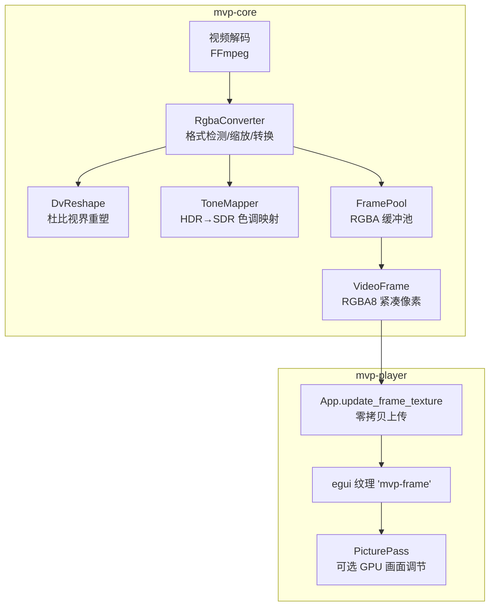
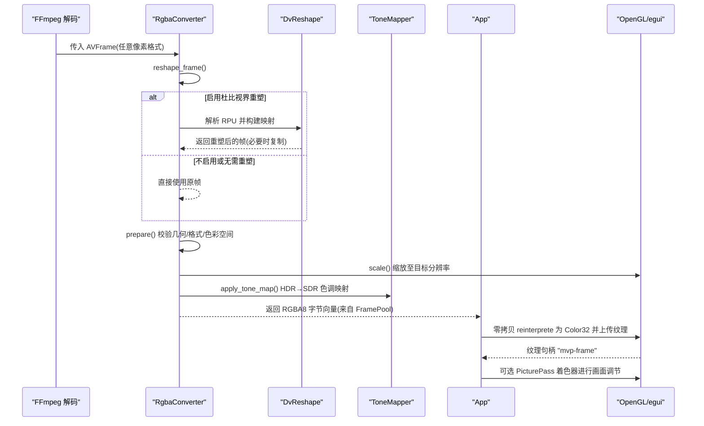
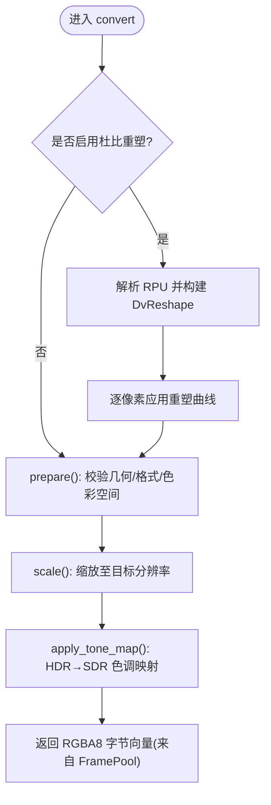
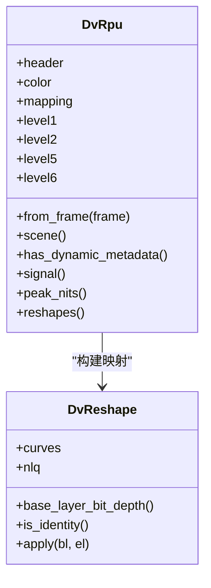
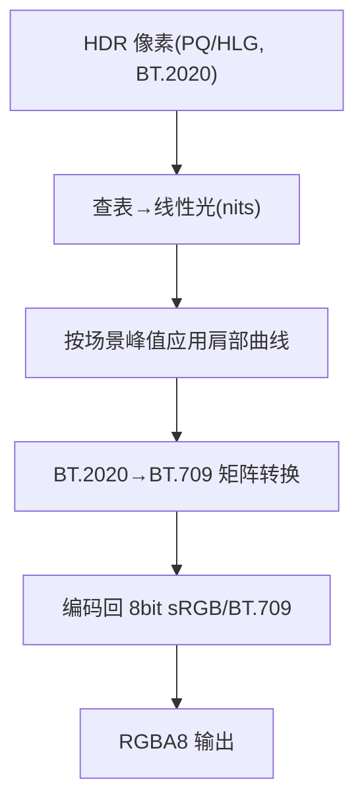
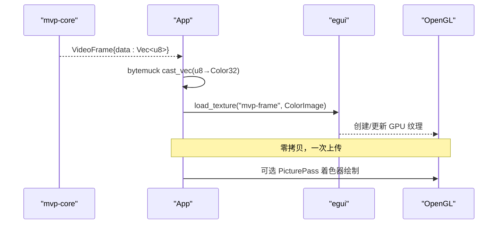
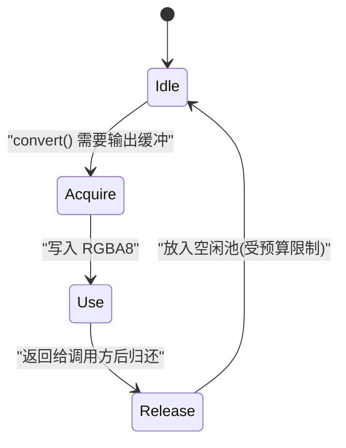
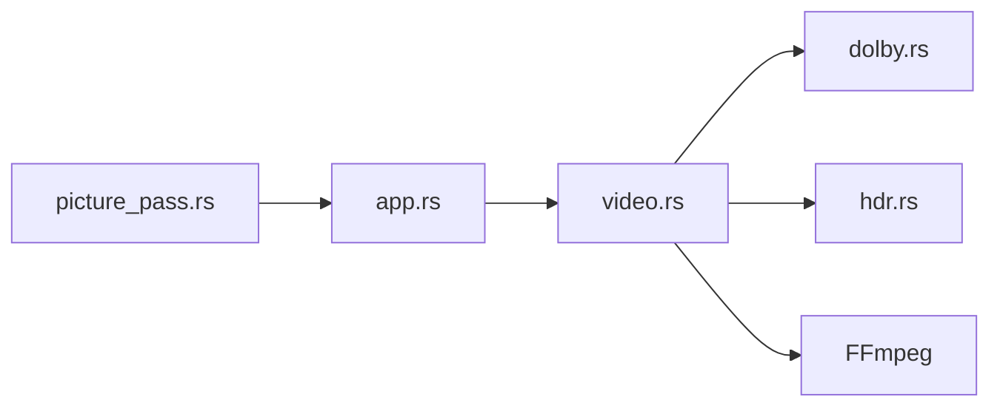

# 视频数据流

<cite>
**本文引用的文件**
- [video.rs](file://crates/mvp-core/src/video.rs)
- [dolby.rs](file://crates/mvp-core/src/dolby.rs)
- [reshape.rs](file://crates/mvp-core/src/dolby/reshape.rs)
- [hdr.rs](file://crates/mvp-core/src/hdr.rs)
- [lib.rs](file://crates/mvp-core/src/lib.rs)
- [app.rs](file://crates/mvp-player/src/app.rs)
- [picture_pass.rs](file://crates/mvp-player/src/gl/picture_pass.rs)
</cite>

## 目录
1. [简介](#简介)
2. [项目结构](#项目结构)
3. [核心组件](#核心组件)
4. [架构总览](#架构总览)
5. [详细组件分析](#详细组件分析)
6. [依赖关系分析](#依赖关系分析)
7. [性能考量](#性能考量)
8. [故障排查指南](#故障排查指南)
9. [结论](#结论)
10. [附录：关键处理步骤与代码片段路径](#附录：关键处理步骤与代码片段路径)

## 简介
本文件面向“从解码到渲染”的视频数据流，覆盖以下完整链路：
- 原始视频帧（YUV/平面或打包）→ 杜比视界重塑 → 色彩空间转换 → HDR 色调映射 → RGBA 输出
- RgbaConverter 的工作原理：像素格式检测、颜色矩阵选择、缩放与转换过程
- 杜比视界处理流程：RPU 解析、映射应用、动态元数据处理
- 硬件解码支持、GPU 纹理上传与零拷贝渲染机制
- 视频帧生命周期管理、内存池使用与性能优化策略
- 提供具体代码示例的“路径引用”，便于快速定位实现

## 项目结构
本项目将媒体引擎与播放器界面解耦：
- mvp-core：解码、色彩转换、HDR/杜比视界处理、帧缓冲池、图像查看器
- mvp-player：UI、OpenGL 渲染、egui 纹理上传、画面调节着色器

图表来源
- [video.rs:18-55](file://crates/mvp-core/src/video.rs#L18-L55)
- [video.rs:553-706](file://crates/mvp-core/src/video.rs#L553-L706)
- [app.rs:708-769](file://crates/mvp-player/src/app.rs#L708-L769)
- [picture_pass.rs:1-25](file://crates/mvp-player/src/gl/picture_pass.rs#L1-L25)

章节来源
- [lib.rs:19-43](file://crates/mvp-core/src/lib.rs#L19-L43)
- [video.rs:1-7](file://crates/mvp-core/src/video.rs#L1-L7)

## 核心组件
- VideoFrame：包含宽高、时间戳、紧凑 RGBA8 像素、序列号与生成代，用于跳过重复上传与回退跳转
- FramePool：按大小最佳匹配复用 Vec<u8> 缓冲，避免频繁分配与清零开销
- RgbaConverter：缓存 SwsContext，按帧尺寸/格式/色彩空间重建；负责杜比视界重塑、缩放、色调映射
- DvRpu/DvReshape：解析参考图片单元（RPU），构建并应用重塑曲线（多项式/MMR）与非线性反量化（NLQ）
- ToneMapper：基于 PQ/HLG 的色调映射表，将 HDR 压缩至 SDR 显示范围，同时做 BT.2020→BT.709 色域转换
- App.update_frame_texture：将 CPU 侧 RGBA 通过 bytemuck 零拷贝重解释为 egui Color32，再上传为 GPU 纹理
- PicturePass：可选的 GPU 单通道画面调节着色器，直接采样 egui 已上传的纹理，避免二次拷贝

章节来源
- [video.rs:18-55](file://crates/mvp-core/src/video.rs#L18-L55)
- [video.rs:57-142](file://crates/mvp-core/src/video.rs#L57-L142)
- [video.rs:553-706](file://crates/mvp-core/src/video.rs#L553-L706)
- [dolby.rs:478-708](file://crates/mvp-core/src/dolby.rs#L478-L708)
- [reshape.rs:185-355](file://crates/mvp-core/src/dolby/reshape.rs#L185-L355)
- [hdr.rs:352-495](file://crates/mvp-core/src/hdr.rs#L352-L495)
- [app.rs:708-769](file://crates/mvp-player/src/app.rs#L708-L769)
- [picture_pass.rs:1-25](file://crates/mvp-player/src/gl/picture_pass.rs#L1-L25)

## 架构总览
下图展示一帧从解码到渲染的关键调用链与数据流向。

图表来源
- [video.rs:687-706](file://crates/mvp-core/src/video.rs#L687-L706)
- [video.rs:720-749](file://crates/mvp-core/src/video.rs#L720-L749)
- [video.rs:753-800](file://crates/mvp-core/src/video.rs#L753-L800)
- [app.rs:708-769](file://crates/mvp-player/src/app.rs#L708-L769)
- [picture_pass.rs:316-381](file://crates/mvp-player/src/gl/picture_pass.rs#L316-L381)

## 详细组件分析

### RgbaConverter：像素格式检测、颜色矩阵选择、缩放与转换
- 像素格式检测与布局适配
  - 通过 FFmpeg 像素格式描述符推导分量布局（平面/半平面/打包）、位深、色度子采样，仅对支持的三分量格式执行重塑
  - 行跨距检查防止越界访问
- 颜色空间与范围选择
  - 根据帧的 color_trc/color_primaries 与杜比配置决定色彩空间与范围
- 缩放与转换
  - 使用 SwsContext 缓存，仅在尺寸/格式/色彩变化时重建
  - 输出紧凑 RGBA8，无填充，直接写入 FramePool 分配的缓冲
- 杜比视界重塑
  - 若启用 dv_reshape，则从帧侧数据读取 RPU，构建 DvReshape，并对 Y/Cb/Cr 逐像素应用重塑曲线
- 色调映射
  - 在 RGBA 上按亮度计算增益表，将 HDR 压缩到 SDR 白点附近，同时进行 BT.2020→BT.709 色域转换

图表来源
- [video.rs:687-706](file://crates/mvp-core/src/video.rs#L687-L706)
- [video.rs:720-749](file://crates/mvp-core/src/video.rs#L720-L749)
- [video.rs:753-800](file://crates/mvp-core/src/video.rs#L753-L800)

章节来源
- [video.rs:157-357](file://crates/mvp-core/src/video.rs#L157-L357)
- [video.rs:553-706](file://crates/mvp-core/src/video.rs#L553-L706)

### 杜比视界处理流程：RPU 解析、映射应用、动态元数据处理
- RPU 解析
  - 从解码帧的侧数据中读取 AVDOVIMetadata，安全地解析 header、color metadata、mapping、level1/2/5/6 扩展块
- 映射应用
  - 将 RPU 中的多项式/MMR 曲线与 NLQ 参数转换为可评估的 DvReshape
  - 对基底层分量进行重塑，必要时组合增强层残差
- 动态元数据
  - Level1 提供每帧的最小/平均/最大亮度（PQ 码值→尼特），用于场景峰值平滑与色调映射曲线重建
  - 平滑窗口约 0.12 秒，避免闪烁；峰值桶化（32 nits）减少重建频率

图表来源
- [dolby.rs:478-708](file://crates/mvp-core/src/dolby.rs#L478-L708)
- [reshape.rs:185-355](file://crates/mvp-core/src/dolby/reshape.rs#L185-L355)

章节来源
- [dolby.rs:1-87](file://crates/mvp-core/src/dolby.rs#L1-L87)
- [dolby.rs:478-708](file://crates/mvp-core/src/dolby.rs#L478-L708)
- [reshape.rs:1-70](file://crates/mvp-core/src/dolby/reshape.rs#L1-L70)
- [reshape.rs:185-355](file://crates/mvp-core/src/dolby/reshape.rs#L185-L355)

### 色调映射与色彩空间转换
- 输入：HDR（PQ/HLG）+ BT.2020 色域
- 过程：
  - 查表将 8bit 码值转为线性光（尼特）
  - 按场景峰值调整肩部曲线，保留高光层次
  - 色域转换 BT.2020→BT.709（矩阵乘法）
  - 编码回 sRGB/BT.709 码值
- 输出：RGBA8（alpha 不变）

图表来源
- [hdr.rs:352-495](file://crates/mvp-core/src/hdr.rs#L352-L495)

章节来源
- [hdr.rs:1-26](file://crates/mvp-core/src/hdr.rs#L1-L26)
- [hdr.rs:352-495](file://crates/mvp-core/src/hdr.rs#L352-L495)

### GPU 纹理上传与零拷贝渲染
- 零拷贝上传
  - 引擎输出的 Vec<u8>（RGBA8）与 egui::Color32 同构（4 字节/像素，对齐一致），通过 bytemuck 重解释为 Color32，避免像素拷贝
  - 以 Arc<ColorImage> 形式交给 egui，保持唯一所有权，避免额外持有
- 渲染路径
  - 默认：egui 直接绘制纹理，无额外 pass
  - 可选：PicturePass 着色器直接采样 "mvp-frame" 纹理，进行白平衡、对比度、饱和度、锐化、边缘感知平滑等效果，无需中间缓冲

图表来源
- [app.rs:708-769](file://crates/mvp-player/src/app.rs#L708-L769)
- [picture_pass.rs:1-25](file://crates/mvp-player/src/gl/picture_pass.rs#L1-L25)

章节来源
- [app.rs:708-769](file://crates/mvp-player/src/app.rs#L708-L769)
- [picture_pass.rs:316-381](file://crates/mvp-player/src/gl/picture_pass.rs#L316-L381)

### 视频帧生命周期管理与内存池
- 生命周期
  - 解码线程产出 VideoFrame，携带 serial/generation 标识，用于去重与回退跳转
  - UI 线程消费帧，若 serial 未变则跳过重复上传
- 内存池
  - FramePool 维护空闲缓冲列表，按“最适匹配”原则获取，限制总占用预算，释放时丢弃超大缓冲
  - 避免每次转换都分配/清零大缓冲，显著降低 4K 帧的分配压力

图表来源
- [video.rs:57-142](file://crates/mvp-core/src/video.rs#L57-L142)

章节来源
- [video.rs:57-142](file://crates/mvp-core/src/video.rs#L57-L142)

## 依赖关系分析
- mvp-core 内部依赖
  - video.rs 依赖 dolby.rs（RPU/重塑）、hdr.rs（HDR/色调映射）、FFmpeg（解码/缩放）
- mvp-player 与 mvp-core 的耦合
  - app.rs 消费 VideoFrame，并通过 egui 上传纹理
  - picture_pass.rs 直接操作 OpenGL，读取 egui 纹理进行画面调节

图表来源
- [video.rs:14-16](file://crates/mvp-core/src/video.rs#L14-L16)
- [app.rs:708-769](file://crates/mvp-player/src/app.rs#L708-L769)
- [picture_pass.rs:1-25](file://crates/mvp-player/src/gl/picture_pass.rs#L1-L25)

章节来源
- [video.rs:14-16](file://crates/mvp-core/src/video.rs#L14-L16)
- [app.rs:708-769](file://crates/mvp-player/src/app.rs#L708-L769)
- [picture_pass.rs:1-25](file://crates/mvp-player/src/gl/picture_pass.rs#L1-L25)

## 性能考量
- 缩放上下文缓存：SwsContext 跨帧复用，仅在几何/格式/色彩变化时重建
- 色调映射并行：按可用核心数拆分波段，限制线程数以不影响其他解码任务
- 动态元数据平滑：SCENE_SMOOTHING≈0.12 秒，SCENE_PEAK_STEP=32 nits 桶化，避免逐帧重建
- 内存池：按容量最佳匹配，限制空闲缓冲数量与总字节预算，避免 4K 帧的 memset 浪费
- 零拷贝上传：Vec<u8>→Color32 重解释，一次上传至 GPU，避免二次拷贝
- 可选 GPU 调节：PicturePass 单 pass 完成多效果，避免中间缓冲与多次读写

[本节为通用性能讨论，不直接分析具体文件]

## 故障排查指南
- 像素格式不支持重塑
  - 现象：提示“像素格式不支持重塑”
  - 原因：非三分量、RGB/调色板/位流/硬件格式，或位深/子采样超出支持范围
  - 处理：关闭 dv_reshape 或更换解码路径
  - 参考路径：[video.rs:307-357](file://crates/mvp-core/src/video.rs#L307-L357)
- 位深与 RPU 不一致
  - 现象：提示“位深与 RPU 声明不一致”
  - 原因：基底层位深与 RPU 声明不符，无法安全重塑
  - 处理：关闭 dv_reshape
  - 参考路径：[video.rs:364-403](file://crates/mvp-core/src/video.rs#L364-L403)
- 行跨距异常
  - 现象：提示“行跨距不支持重塑”
  - 原因：stride 异常可能导致越界
  - 处理：关闭 dv_reshape
  - 参考路径：[video.rs:378-393](file://crates/mvp-core/src/video.rs#L378-L393)
- 无效几何/格式
  - 现象：提示“解码帧尺寸无效/目标尺寸无效/解码帧像素格式未知/解码帧没有像素数据”
  - 原因：损坏帧或误检
  - 处理：跳过该帧或降级播放
  - 参考路径：[video.rs:753-800](file://crates/mvp-core/src/video.rs#L753-L800)
- 着色器不可用
  - 现象：画面调节失败，回退到原始路径
  - 原因：驱动编译/链接失败
  - 处理：禁用画面调节或更新驱动
  - 参考路径：[picture_pass.rs:120-188](file://crates/mvp-player/src/gl/picture_pass.rs#L120-L188)

章节来源
- [video.rs:307-403](file://crates/mvp-core/src/video.rs#L307-L403)
- [video.rs:753-800](file://crates/mvp-core/src/video.rs#L753-L800)
- [picture_pass.rs:120-188](file://crates/mvp-player/src/gl/picture_pass.rs#L120-L188)

## 结论
- 本实现以 CPU 端高效转换为主，结合零拷贝上传与可选 GPU 画面调节，兼顾兼容性与性能
- 杜比视界重塑默认关闭，确保颜色数学未经充分验证时不引入不可预测的色彩偏差
- 色调映射采用查表与场景峰值自适应，能在 CPU 上实时处理 4K 帧
- 内存池与 SwsContext 缓存显著降低分配与重建成本
- 未来可考虑将色调映射移至 GPU 着色器以获得更高精度与更低延迟

[本节为总结性内容，不直接分析具体文件]

## 附录：关键处理步骤与代码片段路径
- 初始化 FFmpeg
  - 路径：[lib.rs:50-69](file://crates/mvp-core/src/lib.rs#L50-L69)
- 视频帧结构与缓冲池
  - 路径：[video.rs:18-55](file://crates/mvp-core/src/video.rs#L18-L55), [video.rs:57-142](file://crates/mvp-core/src/video.rs#L57-L142)
- RgbaConverter 主流程
  - 路径：[video.rs:687-706](file://crates/mvp-core/src/video.rs#L687-L706)
- 杜比视界重塑
  - 路径：[video.rs:720-749](file://crates/mvp-core/src/video.rs#L720-L749), [dolby.rs:478-708](file://crates/mvp-core/src/dolby.rs#L478-L708), [reshape.rs:185-355](file://crates/mvp-core/src/dolby/reshape.rs#L185-L355)
- 色调映射
  - 路径：[hdr.rs:352-495](file://crates/mvp-core/src/hdr.rs#L352-L495)
- GPU 纹理上传与零拷贝
  - 路径：[app.rs:708-769](file://crates/mvp-player/src/app.rs#L708-L769)
- 可选画面调节着色器
  - 路径：[picture_pass.rs:1-25](file://crates/mvp-player/src/gl/picture_pass.rs#L1-L25), [picture_pass.rs:316-381](file://crates/mvp-player/src/gl/picture_pass.rs#L316-L381)