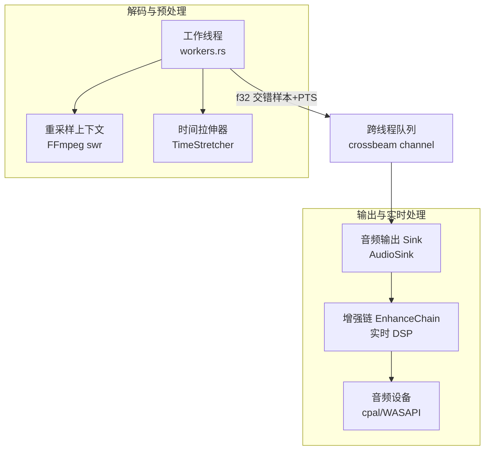
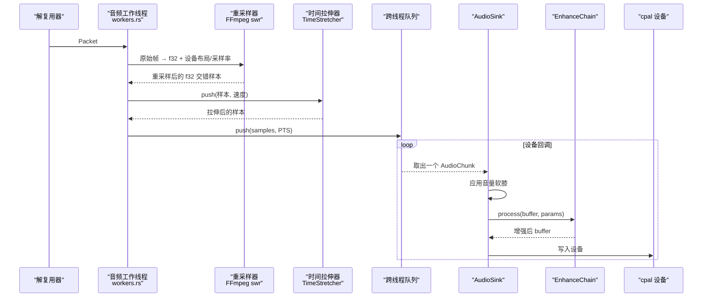
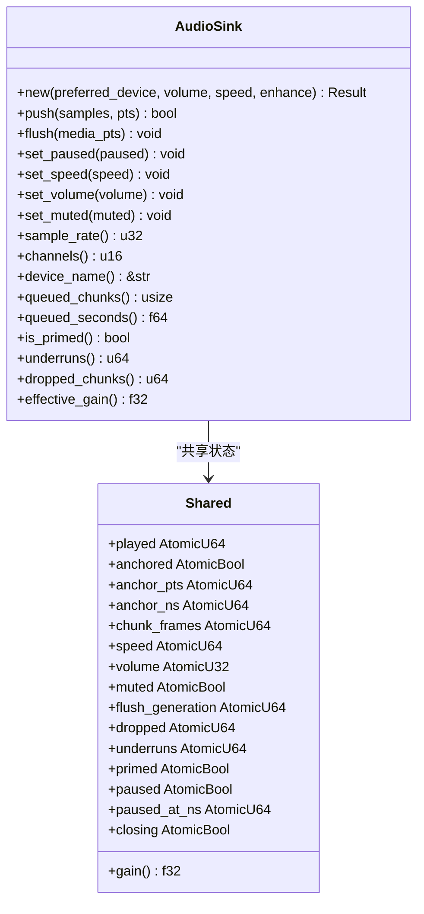
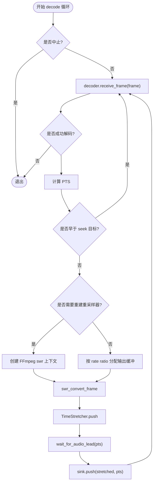
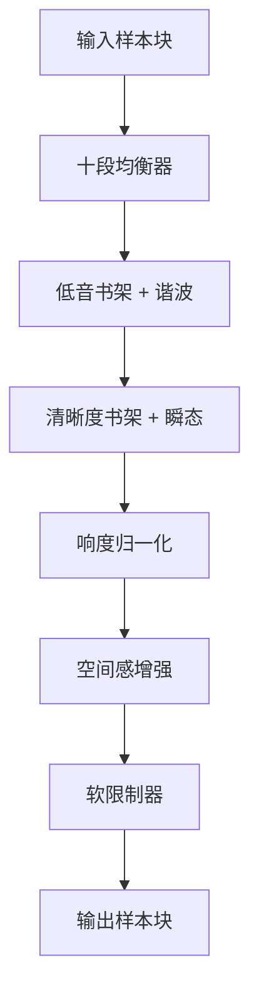
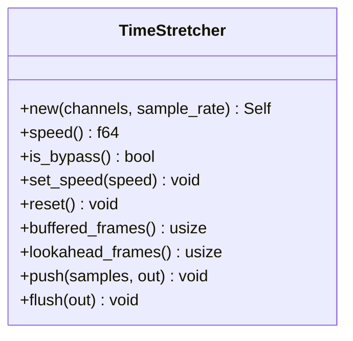
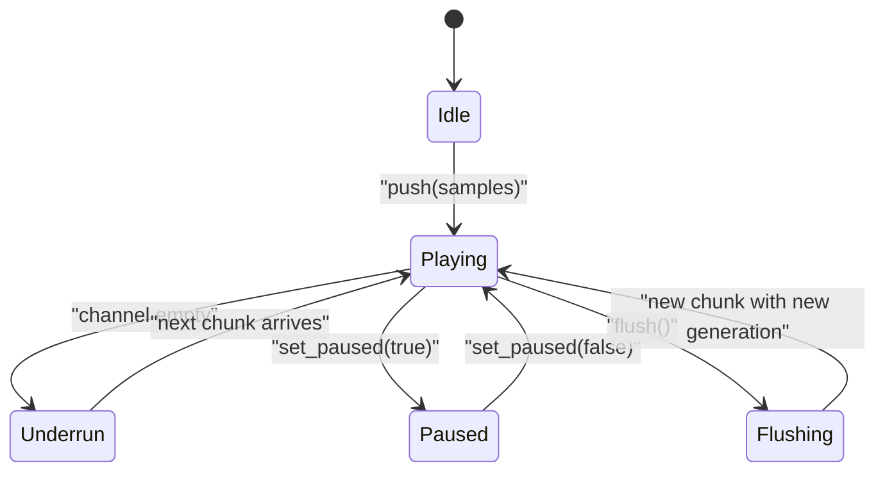
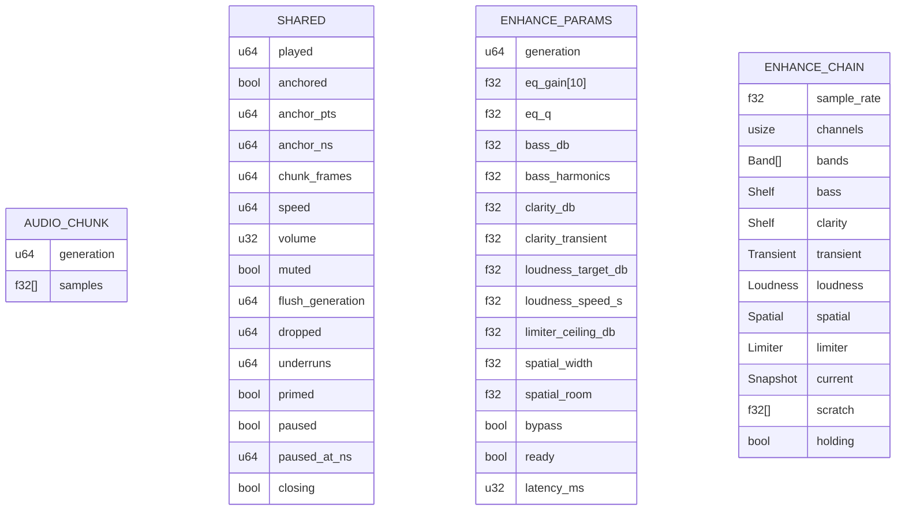
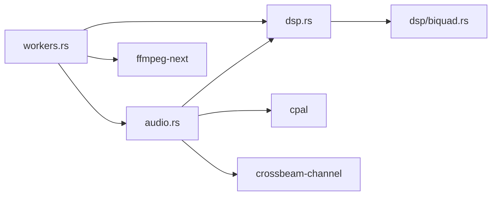

# 音频数据流

<cite>
**本文引用的文件**   
- [audio.rs](file://crates/mvp-core/src/audio.rs)
- [workers.rs](file://crates/mvp-core/src/engine/workers.rs)
- [dsp.rs](file://crates/mvp-core/src/dsp.rs)
- [enhance.rs](file://crates/mvp-core/src/dsp/enhance.rs)
- [queue.rs](file://crates/mvp-core/src/engine/queue.rs)
</cite>

## 目录
1. [引言](#引言)
2. [项目结构](#项目结构)
3. [核心组件](#核心组件)
4. [架构总览](#架构总览)
5. [详细组件分析](#详细组件分析)
6. [依赖关系分析](#依赖关系分析)
7. [性能与延迟特性](#性能与延迟特性)
8. [故障排查指南](#故障排查指南)
9. [结论](#结论)

## 引言
本文面向“音频数据流”的完整处理链路，覆盖从解码器输出的原始音频帧到最终设备输出的全过程：原始音频帧 → 重采样与声道重映射 → 音效增强（十段均衡、响度归一化、空间感增强等）→ 音量控制与设备输出。文档同时解释缓冲区管理策略（队列容量、丢帧与欠载）、延迟控制与同步机制（主时钟锚点、播放速度、暂停恢复），并给出 DSP 处理管道、格式转换细节、内存布局图以及关键数据结构说明。

## 项目结构
本项目中音频相关代码集中在 `mvp-core` 模块：
- 音频输出与实时回调：`audio.rs`
- 解码工作线程、重采样与时间拉伸：`engine/workers.rs`
- DSP 基础与时域变速：`dsp.rs`
- 实时音效增强链：`dsp/enhance.rs`
- 通用队列模型（视频为主，但体现缓冲预算思想）：`engine/queue.rs`

**图表来源**
- [workers.rs:1740-1747](file://crates/mvp-core/src/engine/workers.rs#L1740-L1747)
- [workers.rs:2005-2065](file://crates/mvp-core/src/engine/workers.rs#L2005-L2065)
- [audio.rs:153-162](file://crates/mvp-core/src/audio.rs#L153-L162)
- [audio.rs:320-461](file://crates/mvp-core/src/audio.rs#L320-L461)
- [enhance.rs:934-978](file://crates/mvp-core/src/dsp/enhance.rs#L934-L978)

**章节来源**
- [audio.rs:1-12](file://crates/mvp-core/src/audio.rs#L1-L12)
- [workers.rs:1740-1747](file://crates/mvp-core/src/engine/workers.rs#L1740-L1747)

## 核心组件
- 音频输出端 AudioSink：负责打开系统默认或指定设备、维护实时回调、应用音量与增强链、统计欠载与丢弃。
- 工作线程 drain_audio：负责解码、重采样、声道重映射、时间拉伸、按播放进度投递到输出队列。
- 增强链 EnhanceChain：在设备回调中运行，包含十段均衡、低音/清晰度书架滤波、瞬态强调、响度归一化、空间感增强、软限制器。
- 时间拉伸 TimeStretcher：基于 SOLA 算法实现保音调速，避免 atempo 滤镜带来的额外管线与拷贝。
- 参数同步 EnhanceParams：通过原子参数块与世代号，向实时线程安全发布音效参数。

**章节来源**
- [audio.rs:153-162](file://crates/mvp-core/src/audio.rs#L153-L162)
- [workers.rs:1936-2095](file://crates/mvp-core/src/engine/workers.rs#L1936-L2095)
- [enhance.rs:934-978](file://crates/mvp-core/src/dsp/enhance.rs#L934-L978)
- [dsp.rs:21-50](file://crates/mvp-core/src/dsp.rs#L21-L50)
- [enhance.rs:206-225](file://crates/mvp-core/src/dsp/enhance.rs#L206-L225)

## 架构总览
音频数据流的关键阶段如下：
1. 解码器输出原始音频帧（可能为任意采样率、声道布局与采样格式）。
2. 根据设备当前采样率与声道布局，使用 FFmpeg 软件重采样上下文进行格式转换与声道重映射。
3. 可选的时间拉伸（保音调速）将帧转换为目标时长。
4. 通过有界跨线程通道投递到 AudioSink。
5. 设备回调从通道取块，应用线性音量（带软膝限幅），再进入增强链。
6. 增强链执行 EQ、低音/清晰度、瞬态、响度、空间感、限制器等效果。
7. 最终写入 cpal 设备输出。

**图表来源**
- [workers.rs:2005-2065](file://crates/mvp-core/src/engine/workers.rs#L2005-L2065)
- [workers.rs:2083-2094](file://crates/mvp-core/src/engine/workers.rs#L2083-L2094)
- [audio.rs:320-461](file://crates/mvp-core/src/audio.rs#L320-L461)
- [enhance.rs:991-1077](file://crates/mvp-core/src/dsp/enhance.rs#L991-L1077)

## 详细组件分析

### 音频输出与实时回调（AudioSink）
- 设备初始化：
  - 选择默认或匹配名称的输出设备；读取默认配置；必要时将采样率切换到更稳定的偏好值（如 48 kHz），以避免某些驱动在高采样率下回调过快导致时钟漂移。
  - 根据设备支持的采样格式构建输出流，并在回调中按格式转换。
- 实时回调职责：
  - 从跨线程通道取块，若为空则填充静音并记录欠载。
  - 对每个样本先应用线性音量（带软膝限幅），再交给增强链。
  - 将增强后的样本写入设备。
- 时钟与位置：
  - 使用“锚点 + 纳秒基线”的方式计算媒体时间，避免直接以回调计数作为时钟。
  - 支持暂停/恢复、速度变化、静音切换、音量平滑过渡。
- 队列与丢弃：
  - 使用 bounded crossbeam channel，容量固定；当队列满时，push 会阻塞一段时间，超时则丢弃该块并计数。
  - flush 通过递增 generation 让回调丢弃旧块，保证 seek 后不会播放旧数据。

**图表来源**
- [audio.rs:81-116](file://crates/mvp-core/src/audio.rs#L81-L116)
- [audio.rs:153-162](file://crates/mvp-core/src/audio.rs#L153-L162)
- [audio.rs:172-318](file://crates/mvp-core/src/audio.rs#L172-L318)
- [audio.rs:320-461](file://crates/mvp-core/src/audio.rs#L320-L461)
- [audio.rs:519-575](file://crates/mvp-core/src/audio.rs#L519-L575)
- [audio.rs:591-618](file://crates/mvp-core/src/audio.rs#L591-L618)

**章节来源**
- [audio.rs:172-318](file://crates/mvp-core/src/audio.rs#L172-L318)
- [audio.rs:320-461](file://crates/mvp-core/src/audio.rs#L320-L461)
- [audio.rs:519-575](file://crates/mvp-core/src/audio.rs#L519-L575)
- [audio.rs:591-618](file://crates/mvp-core/src/audio.rs#L591-L618)
- [audio.rs:698-743](file://crates/mvp-core/src/audio.rs#L698-L743)

### 解码工作线程与重采样（drain_audio）
- 重采样上下文重建：
  - 当输入帧的格式、采样率或声道数发生变化时重建 FFmpeg 软件重采样上下文。
  - 目标格式为 packed f32，目标声道布局由设备声道数决定。
- 输出缓冲分配：
  - 为避免 swr_convert_frame 内部缓存导致的截断问题，预先按 rate ratio 估算输出大小并加上余量。
- 时间拉伸：
  - 使用 TimeStretcher 进行保音调速；速度变化时重置内部缓冲。
- 播放进度控制：
  - 通过 wait_for_audio_lead 确保已解码但未播放的音频不超过 AUDIO_LEAD，避免速度变化滞后。
- Seek 与轨道切换：
  - 遇到 seek 目标时丢弃早于目标的帧；轨道切换时重建解码器、重采样器与时间拉伸器，并刷新输出时钟。

**图表来源**
- [workers.rs:1936-2095](file://crates/mvp-core/src/engine/workers.rs#L1936-L2095)
- [workers.rs:2005-2065](file://crates/mvp-core/src/engine/workers.rs#L2005-L2065)
- [workers.rs:1909-1934](file://crates/mvp-core/src/engine/workers.rs#L1909-L1934)

**章节来源**
- [workers.rs:1740-1747](file://crates/mvp-core/src/engine/workers.rs#L1740-L1747)
- [workers.rs:1936-2095](file://crates/mvp-core/src/engine/workers.rs#L1936-L2095)
- [workers.rs:1881-1907](file://crates/mvp-core/src/engine/workers.rs#L1881-L1907)

### 实时音效增强链（EnhanceChain）
- 处理顺序：
  - 十段均衡器 → 低音书架 + 二次谐波 → 清晰度书架 + 瞬态强调 → 响度归一化 → 空间感增强 → 软限制器。
- 参数发布与平滑：
  - 通过 EnhanceParams 原子参数块发布参数；回调侧读取一致快照并按时间平滑更新系数，避免“拉链噪声”。
- 各子模块：
  - 十段均衡：每频带一个 biquad，按用户增益与 Q 值重建系数。
  - 低音/清晰度：低/高书架滤波，分别用于低频提升与高频清晰度。
  - 瞬态强调：快慢包络差检测突出瞬态。
  - 响度归一化：K-weighting 近似 ITU-R BS.1770，短时期功率估计与缓慢增益调整。
  - 空间感增强：Mid/Side 宽度控制 + Schroeder 混响（多梳状滤波器 + 全通扩散），仅作用于前两个声道。
  - 软限制器：前看峰值限制，tanh 软膝，保护后续设备不削波。

**图表来源**
- [enhance.rs:10-26](file://crates/mvp-core/src/dsp/enhance.rs#L10-L26)
- [enhance.rs:1058-1077](file://crates/mvp-core/src/dsp/enhance.rs#L1058-L1077)

**章节来源**
- [enhance.rs:10-26](file://crates/mvp-core/src/dsp/enhance.rs#L10-L26)
- [enhance.rs:934-978](file://crates/mvp-core/src/dsp/enhance.rs#L934-L978)
- [enhance.rs:991-1077](file://crates/mvp-core/src/dsp/enhance.rs#L991-L1077)
- [enhance.rs:1079-1103](file://crates/mvp-core/src/dsp/enhance.rs#L1079-L1103)

### 时间拉伸（TimeStretcher）
- 算法：SOLA（同步重叠相加），保持音高不变的同时改变播放速度。
- 参数：
  - hop_in 固定约 20 ms；hop_out = hop_in / speed；overlap 约为输出步长的三分之一，上限 15 ms。
  - search 范围用于对齐相邻窗口的最佳相关性。
- 行为：
  - bypass 模式（speed=1.0）直通。
  - flush 时补零以确保尾部被完全输出。
  - 内部缓冲定期回收，避免无限增长。

**图表来源**
- [dsp.rs:21-50](file://crates/mvp-core/src/dsp.rs#L21-L50)
- [dsp.rs:52-179](file://crates/mvp-core/src/dsp.rs#L52-L179)
- [dsp.rs:181-299](file://crates/mvp-core/src/dsp.rs#L181-L299)

**章节来源**
- [dsp.rs:21-50](file://crates/mvp-core/src/dsp.rs#L21-L50)
- [dsp.rs:52-179](file://crates/mvp-core/src/dsp.rs#L52-L179)
- [dsp.rs:181-299](file://crates/mvp-core/src/dsp.rs#L181-L299)

### 音频缓冲区管理与同步
- 队列管理：
  - 输出端使用 bounded crossbeam channel，容量固定（例如 128 个 chunk）。
  - push 使用 send_timeout，超时则丢弃并计数；close 设置 closing 标志以立即中断等待。
- 延迟控制：
  - 工作线程通过 wait_for_audio_lead 控制解码超前量，避免速度变化滞后。
  - 输出端 queued_seconds 基于最近 chunk 的帧数估算延迟。
- 同步机制：
  - 主时钟使用 anchor_pts + anchor_ns + speed 计算 position，支持暂停/恢复与速度变化。
  - flush 通过 generation 标记丢弃旧数据，避免 seek 后播放旧音频。

**图表来源**
- [audio.rs:519-575](file://crates/mvp-core/src/audio.rs#L519-L575)
- [audio.rs:591-618](file://crates/mvp-core/src/audio.rs#L591-L618)
- [workers.rs:1909-1934](file://crates/mvp-core/src/engine/workers.rs#L1909-L1934)

**章节来源**
- [audio.rs:519-575](file://crates/mvp-core/src/audio.rs#L519-L575)
- [audio.rs:591-618](file://crates/mvp-core/src/audio.rs#L591-L618)
- [workers.rs:1909-1934](file://crates/mvp-core/src/engine/workers.rs#L1909-L1934)

### 音频格式转换、声道重映射与采样率转换
- 重采样上下文：
  - 输入：原始帧的 format、channel_layout、rate。
  - 输出：packed f32，设备 channel_layout（由设备声道数推导），设备 rate。
- 输出缓冲分配：
  - 按 in_samples * device_rate / in_rate 估算输出大小，并加上 RESAMPLE_MARGIN 以容纳内部缓存。
- 声道重映射：
  - 使用设备默认声道布局（例如立体声为左右），由 FFmpeg 完成重排。
- 采样率转换：
  - 通过 FFmpeg software resampling 上下文完成，避免驱动回调频率异常导致的时钟漂移。

**章节来源**
- [workers.rs:2005-2065](file://crates/mvp-core/src/engine/workers.rs#L2005-L2065)
- [workers.rs:1740-1747](file://crates/mvp-core/src/engine/workers.rs#L1740-L1747)

### 音频设备初始化、错误处理与性能监控
- 设备初始化：
  - 查找默认或匹配名称的设备；读取默认配置；必要时切换到偏好采样率。
  - 根据设备支持的采样格式构建输出流。
- 错误处理：
  - 设备错误回调增加 dropped 计数并记录日志；不视为致命错误，通常可恢复。
  - 无法启动流或创建流时返回 MediaError::AudioDevice。
- 性能监控：
  - underruns：回调缺数据的次数。
  - dropped_chunks：因队列满而丢弃的块数。
  - queued_seconds：估算的延迟秒数。
  - is_primed：是否已有真实样本到达设备。

**章节来源**
- [audio.rs:172-318](file://crates/mvp-core/src/audio.rs#L172-L318)
- [audio.rs:478-506](file://crates/mvp-core/src/audio.rs#L478-L506)

### 内存布局与关键数据结构
- 音频样本布局：
  - 交错格式（interleaved）：[左0, 右0, 左1, 右1, ...]，所有通道在同一时间点连续存储。
- 关键数据结构：
  - AudioChunk：包含 generation 与 samples（Vec<f32>）。
  - Shared：原子状态，包括 played、anchored、anchor_pts、anchor_ns、chunk_frames、speed、volume、muted、flush_generation、dropped、underruns、primed、paused、paused_at_ns、closing。
  - EnhanceParams：原子参数块，包含 bypass、eq_gain、eq_q、bass_db、bass_harmonics、clarity_db、clarity_transient、loudness_target_db、loudness_speed_s、limiter_ceiling_db、spatial_width、spatial_room。
  - EnhanceChain：包含 bands、bass、clarity、transient、loudness、spatial、limiter、current、scratch、holding。

**图表来源**
- [audio.rs:66-79](file://crates/mvp-core/src/audio.rs#L66-L79)
- [audio.rs:81-116](file://crates/mvp-core/src/audio.rs#L81-L116)
- [enhance.rs:206-225](file://crates/mvp-core/src/dsp/enhance.rs#L206-L225)
- [enhance.rs:934-978](file://crates/mvp-core/src/dsp/enhance.rs#L934-L978)

**章节来源**
- [audio.rs:66-79](file://crates/mvp-core/src/audio.rs#L66-L79)
- [audio.rs:81-116](file://crates/mvp-core/src/audio.rs#L81-L116)
- [enhance.rs:206-225](file://crates/mvp-core/src/dsp/enhance.rs#L206-L225)
- [enhance.rs:934-978](file://crates/mvp-core/src/dsp/enhance.rs#L934-L978)

## 依赖关系分析
- 模块耦合：
  - workers.rs 依赖 audio.rs（AudioSink）与 dsp.rs（TimeStretcher）。
  - audio.rs 依赖 dsp.rs（EnhanceChain、EnhanceParams）。
  - enhance.rs 依赖 dsp/biquad.rs（Biquad、Coeffs）。
- 外部依赖：
  - cpal：音频设备抽象与回调。
  - ffmpeg-next：解码、重采样、帧操作。
  - crossbeam-channel：无锁跨线程通信。

**图表来源**
- [workers.rs:1740-1747](file://crates/mvp-core/src/engine/workers.rs#L1740-L1747)
- [audio.rs:31-35](file://crates/mvp-core/src/audio.rs#L31-L35)
- [dsp.rs:13-19](file://crates/mvp-core/src/dsp.rs#L13-L19)

**章节来源**
- [workers.rs:1740-1747](file://crates/mvp-core/src/engine/workers.rs#L1740-L1747)
- [audio.rs:31-35](file://crates/mvp-core/src/audio.rs#L31-L35)
- [dsp.rs:13-19](file://crates/mvp-core/src/dsp.rs#L13-L19)

## 性能与延迟特性
- 设备采样率偏好：
  - 优先使用 48 kHz 或 44.1 kHz，避免某些驱动在高采样率下回调过快导致时钟漂移。
- 重采样缓冲：
  - 预分配输出缓冲大小为 in_samples * device_rate / in_rate + RESAMPLE_MARGIN，避免截断。
- 时间拉伸延迟：
  - SOLA 算法具有固有 look-ahead（约 40–120 ms），通过 flush 确保尾部输出。
- 增强链延迟：
  - 仅限制器的前看引入延迟（约 1 ms），空间感增强为 wet 效果不引入额外延迟。
- 音量平滑：
  - 音量变化在一个缓冲内平滑过渡，避免点击噪声。

**章节来源**
- [audio.rs:698-743](file://crates/mvp-core/src/audio.rs#L698-L743)
- [workers.rs:2035-2050](file://crates/mvp-core/src/engine/workers.rs#L2035-L2050)
- [dsp.rs:21-25](file://crates/mvp-core/src/dsp.rs#L21-L25)
- [enhance.rs:980-989](file://crates/mvp-core/src/dsp/enhance.rs#L980-L989)

## 故障排查指南
- 设备未找到或无法读取默认格式：
  - 检查系统默认音频设备是否存在，确认 cpal 后端（WASAPI）可用。
- 不支持的采样格式：
  - 确认设备支持的采样格式列表，必要时调整系统设置。
- 无法启动或创建音频流：
  - 检查权限、独占模式、其他应用占用情况。
- 欠载频繁：
  - 检查解码性能、队列长度、系统负载；考虑降低增强链复杂度或关闭不必要的效果。
- 声音断续或卡顿：
  - 检查时间拉伸速度设置、重采样上下文重建频率；确认 seek 后时钟重新锚定。
- 音效无声或异常：
  - 检查 EnhanceParams.bypass 是否开启；确认参数发布是否成功；验证增强链是否处于 idle 状态。

**章节来源**
- [audio.rs:186-307](file://crates/mvp-core/src/audio.rs#L186-L307)
- [audio.rs:226-231](file://crates/mvp-core/src/audio.rs#L226-L231)
- [workers.rs:2025-2028](file://crates/mvp-core/src/engine/workers.rs#L2025-L2028)

## 结论
本项目的音频数据流设计以“单设备实例 + 实时回调 + 跨线程队列”为核心，结合 FFmpeg 重采样与自研 SOLA 时间拉伸，实现了稳定、低延迟且可扩展的音频处理管道。增强链在设备回调中运行，确保参数变更即时生效且不引入额外延迟。通过原子参数块与世代号机制，系统在多线程环境下保持了数据一致性与实时性。整体架构在保证音质的同时，兼顾了性能与可维护性。