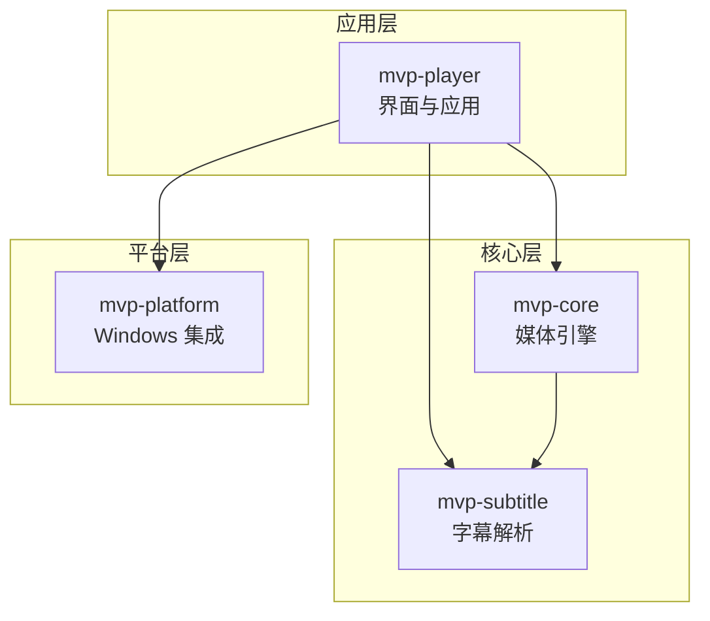
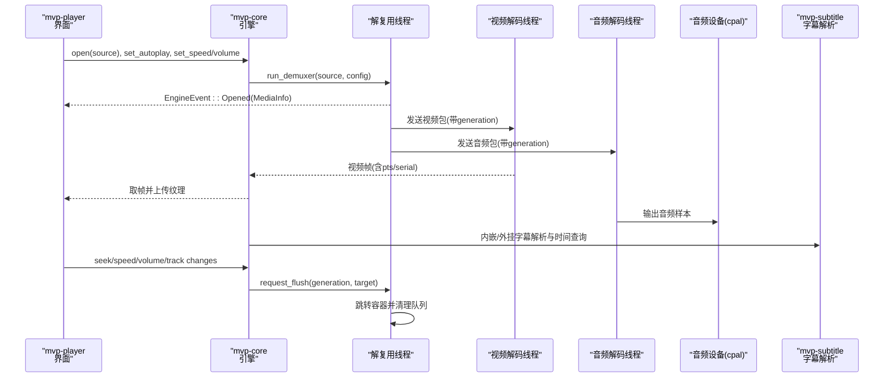
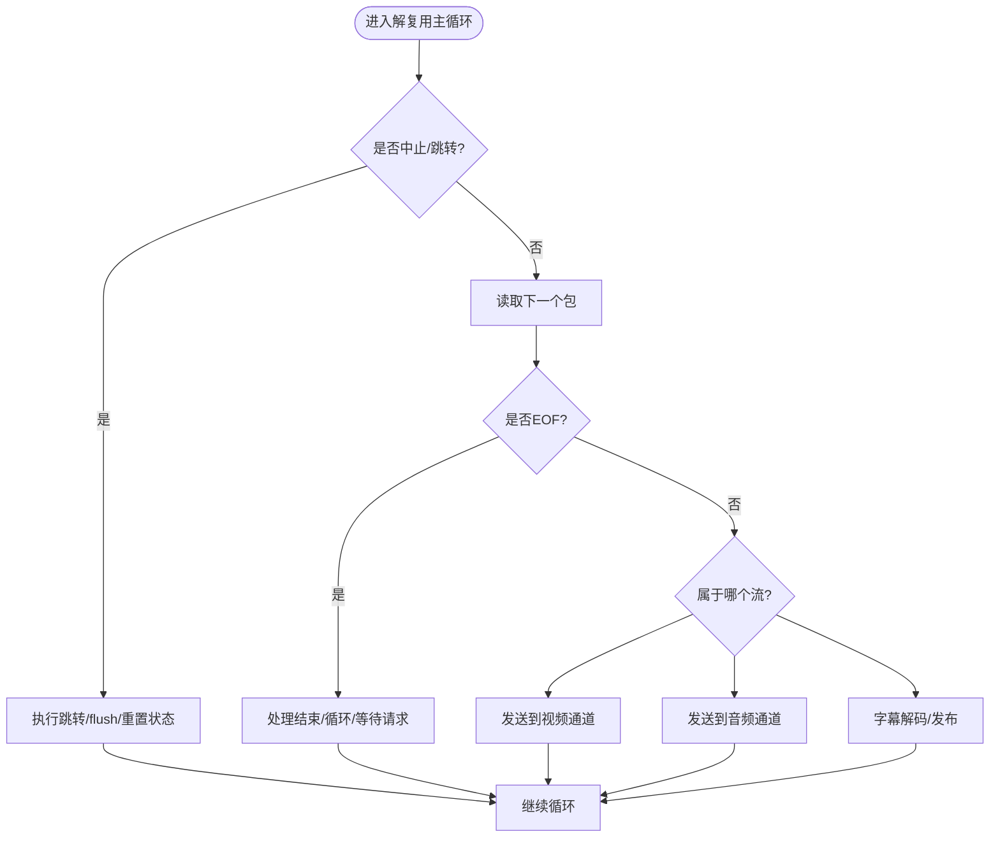
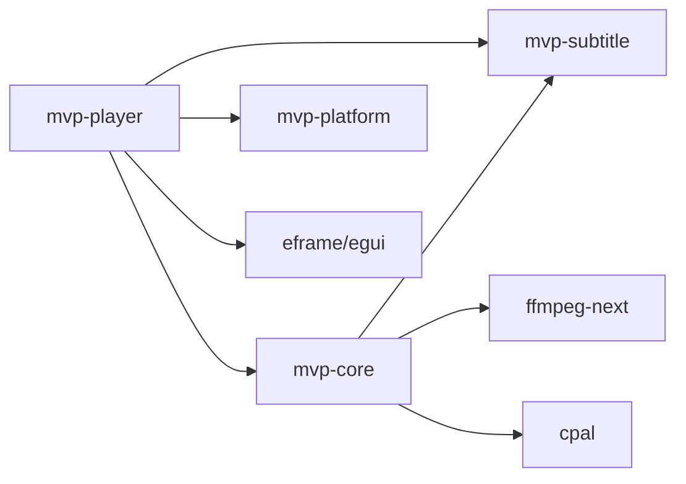

# 整体架构概览

<cite>
**本文引用的文件**
- [Cargo.toml](file://Cargo.toml)
- [README.md](file://README.md)
- [mvp-core/Cargo.toml](file://crates/mvp-core/Cargo.toml)
- [mvp-platform/Cargo.toml](file://crates/mvp-platform/Cargo.toml)
- [mvp-subtitle/Cargo.toml](file://crates/mvp-subtitle/Cargo.toml)
- [mvp-player/Cargo.toml](file://crates/mvp-player/Cargo.toml)
- [mvp-core/src/lib.rs](file://crates/mvp-core/src/lib.rs)
- [mvp-platform/src/lib.rs](file://crates/mvp-platform/src/lib.rs)
- [mvp-subtitle/src/lib.rs](file://crates/mvp-subtitle/src/lib.rs)
- [mvp-player/src/main.rs](file://crates/mvp-player/src/main.rs)
- [mvp-player/src/app.rs](file://crates/mvp-player/src/app.rs)
- [mvp-core/src/engine/workers.rs](file://crates/mvp-core/src/engine/workers.rs)
- [mvp-core/src/engine/queue.rs](file://crates/mvp-core/src/engine/queue.rs)
- [mvp-core/src/engine/clock.rs](file://crates/mvp-core/src/engine/clock.rs)
</cite>

## 目录
1. [简介](#简介)
2. [项目结构](#项目结构)
3. [核心组件](#核心组件)
4. [架构总览](#架构总览)
5. [详细组件分析](#详细组件分析)
6. [依赖关系分析](#依赖关系分析)
7. [性能考量](#性能考量)
8. [故障排查指南](#故障排查指南)
9. [结论](#结论)
10. [附录](#附录)

## 简介
本文件为 MVP-Versatile-Player 的整体架构概览，聚焦于四个核心 crate 的职责划分与交互：mvp-core（媒体引擎核心）、mvp-platform（Windows 平台集成）、mvp-subtitle（字幕解析）、mvp-player（用户界面）。文档解释各模块之间的依赖关系、数据流向与关键架构原则，包括直接链接 FFmpeg、无副作用进程、延迟初始化、队列有界化等设计决策，并给出系统架构图以直观展示组件关系。

## 项目结构
仓库采用 Rust Workspace 组织，包含四个 crate：
- mvp-core：FFmpeg 绑定、音视频解码、时钟、播放列表、图片查看器模型、杜比视界/HDR 处理等。
- mvp-platform：Windows 系统集成（文件关联、单实例 IPC、外壳工具、电源管理、显示器工作区）。
- mvp-subtitle：纯逻辑字幕解析（SRT/ASS/VTT/MicroDVD），编码识别与时间区间查询。
- mvp-player：基于 eframe/egui 的图形界面与应用主循环，负责窗口、渲染、设置与 UI 状态。

图表来源
- [Cargo.toml:1-8](file://Cargo.toml#L1-L8)
- [mvp-player/Cargo.toml:32-34](file://crates/mvp-player/Cargo.toml#L32-L34)
- [mvp-core/Cargo.toml:22-25](file://crates/mvp-core/Cargo.toml#L22-L25)
- [mvp-platform/Cargo.toml:14-39](file://crates/mvp-platform/Cargo.toml#L14-L39)

章节来源
- [Cargo.toml:1-8](file://Cargo.toml#L1-L8)
- [README.md:315-323](file://README.md#L315-L323)

## 核心组件
- mvp-core（媒体引擎核心）
  - 职责：封装 FFmpeg 解复用/解码、音频输出（cpal）、视频帧队列与时钟、播放列表、图片查看器、HDR/杜比视界处理、错误与日志。
  - 关键特性：直接链接 FFmpeg；线程安全的工作者；按字节与时间双重限界的队列；系统时钟为主时钟；panic 捕获保证健壮性。
- mvp-platform（Windows 平台集成）
  - 职责：文件关联注册（HKCU）、单实例互斥与隐藏窗口 IPC、任务栏闪烁、深色标题栏、阻止休眠、显示器工作区与 DPI。
  - 可移植性：非 Windows 分支提供空实现或返回错误，便于跨平台检查。
- mvp-subtitle（字幕解析）
  - 职责：多格式字幕解析与时间区间查询；自动编码检测；纯逻辑无外部依赖，便于测试与复用。
- mvp-player（用户界面）
  - 职责：命令行解析、单实例协调、窗口与 OpenGL/Glow 上下文、egui 界面、设置持久化、截图与画面调节、播放控制。

章节来源
- [mvp-core/src/lib.rs:1-47](file://crates/mvp-core/src/lib.rs#L1-L47)
- [mvp-platform/src/lib.rs:1-34](file://crates/mvp-platform/src/lib.rs#L1-L34)
- [mvp-subtitle/src/lib.rs:1-60](file://crates/mvp-subtitle/src/lib.rs#L1-L60)
- [mvp-player/src/main.rs:1-14](file://crates/mvp-player/src/main.rs#L1-L14)

## 架构总览
MVP 播放器采用分层模块化设计：
- 界面层（mvp-player）负责用户交互、窗口生命周期、设置与渲染管线。
- 引擎层（mvp-core）负责媒体读取、解码、时钟同步、队列缓冲与输出。
- 平台层（mvp-platform）屏蔽操作系统差异，提供文件关联、单实例、电源与显示能力。
- 字幕层（mvp-subtitle）提供纯文本字幕解析能力，被引擎与界面复用。

图表来源
- [mvp-player/src/app.rs:484-544](file://crates/mvp-player/src/app.rs#L484-L544)
- [mvp-core/src/engine/workers.rs:281-687](file://crates/mvp-core/src/engine/workers.rs#L281-L687)
- [mvp-core/src/engine/queue.rs:11-65](file://crates/mvp-core/src/engine/queue.rs#L11-L65)
- [mvp-subtitle/src/lib.rs:1-60](file://crates/mvp-subtitle/src/lib.rs#L1-L60)

## 详细组件分析

### 媒体引擎核心（mvp-core）
- 解复用与工作者
  - 解复用线程负责打开输入、探测媒体信息、选择流、分发包到视频/音频/字幕通道，并处理跳转、A-B 循环、轨道切换与 EOF。
  - 视频/音频工作者各自解码并产出帧/样本，遵循 generation 机制避免旧数据污染新会话。
- 队列与背压
  - 视频帧队列按字节预算与时间预算双重限制，防止高码率/高分辨率导致内存暴涨；满队时丢弃最旧帧或拒绝新帧，确保可播放性。
  - 音频通道保持背压，暂停/停止时通过超时快速退出阻塞。
- 时钟同步
  - 主时钟使用系统单调时钟，结合音频设备位置进行锚定与平滑过渡，避免驱动报告偏差导致的“画面狂奔/冻结”。
- 错误与健壮性
  - 每个工作者捕获 panic，将损坏文件转化为错误状态，不拖垮整个播放器。

图表来源
- [mvp-core/src/engine/workers.rs:469-687](file://crates/mvp-core/src/engine/workers.rs#L469-L687)
- [mvp-core/src/engine/workers.rs:700-793](file://crates/mvp-core/src/engine/workers.rs#L700-L793)

章节来源
- [mvp-core/src/engine/workers.rs:1-132](file://crates/mvp-core/src/engine/workers.rs#L1-L132)
- [mvp-core/src/engine/queue.rs:67-253](file://crates/mvp-core/src/engine/queue.rs#L67-L253)
- [mvp-core/src/engine/clock.rs:1-159](file://crates/mvp-core/src/engine/clock.rs#L1-L159)

### 平台集成（mvp-platform）
- 文件关联：仅写入当前用户注册表（HKCU），无需管理员权限；支持一键注册/注销，覆盖多种扩展名。
- 单实例：命名互斥体 + 隐藏顶层窗口作为 WM_COPYDATA IPC 端点，二次启动将文件加入已有窗口播放列表。
- 外壳与电源：AppUserModelID、深色标题栏、任务栏闪烁、播放时阻止屏幕/系统休眠。
- 显示器与工作区：获取工作区与 DPI，用于窗口尺寸与位置适配。

章节来源
- [mvp-platform/src/lib.rs:1-34](file://crates/mvp-platform/src/lib.rs#L1-L34)
- [mvp-platform/Cargo.toml:14-39](file://crates/mvp-platform/Cargo.toml#L14-L39)

### 字幕解析（mvp-subtitle）
- 纯逻辑库：无 FFmpeg/Windows 依赖，可在任意主机测试与复用。
- 多格式支持：SRT、ASS/SSA、WebVTT、MicroDVD；自动编码检测（UTF-8/UTF-16 BOM/GBK/Big5/Shift_JIS/Windows-1252）。
- 鲁棒性：解析从不失败、从不 panic；无效行/异常时间戳会被跳过，保证其余内容可用。
- 时间区间查询：Cue 半开区间、active_at/active_all/index_at 等方法供引擎与界面使用。

章节来源
- [mvp-subtitle/src/lib.rs:1-60](file://crates/mvp-subtitle/src/lib.rs#L1-L60)
- [mvp-subtitle/Cargo.toml:1-11](file://crates/mvp-subtitle/Cargo.toml#L1-L11)

### 用户界面（mvp-player）
- 启动流程：解析命令行、单实例互斥、字体预取、窗口几何恢复、创建窗口并移交控制权给 PlayerApp。
- 应用对象：拥有引擎、播放列表、设置、UI 状态；唯一允许这些组件相互通信的地方。
- 打开媒体：区分图片与媒体，调用引擎打开本地路径或 URL；根据扩展名与探测结果决定模式（视频/音频/图片）。
- 帧上传：零拷贝重解释 RGBA 为 ColorImage 并上传 GPU；记录已上传序列号避免重复上传。
- 字幕加载：外部字幕优先策略；图形字幕（PGS/VobSub）解码为位图轨道。

章节来源
- [mvp-player/src/main.rs:40-182](file://crates/mvp-player/src/main.rs#L40-L182)
- [mvp-player/src/app.rs:65-204](file://crates/mvp-player/src/app.rs#L65-L204)
- [mvp-player/src/app.rs:368-544](file://crates/mvp-player/src/app.rs#L368-L544)
- [mvp-player/src/app.rs:715-769](file://crates/mvp-player/src/app.rs#L715-L769)

## 依赖关系分析
- 直接依赖
  - mvp-player 依赖 mvp-core、mvp-platform、mvp-subtitle。
  - mvp-core 依赖 ffmpeg-next、cpal、image、mvp-subtitle。
  - mvp-platform 仅在 Windows 目标启用 windows crate 功能集。
  - mvp-subtitle 无外部媒体依赖，仅用编码与一次性初始化库。
- 间接依赖
  - eframe/egui/rfd/raw-window-handle/image 在界面层用于渲染与文件对话框。
  - crossbeam-channel/parking_lot/once_cell 用于线程间通信与同步。
- 耦合与内聚
  - 界面与引擎通过 Engine API 松耦合；引擎内部通过 bounded channel 与共享状态解耦解复用/解码/输出。
  - 平台层独立于媒体逻辑，仅暴露必要能力。

图表来源
- [mvp-player/Cargo.toml:32-34](file://crates/mvp-player/Cargo.toml#L32-L34)
- [mvp-core/Cargo.toml:22-25](file://crates/mvp-core/Cargo.toml#L22-L25)
- [mvp-platform/Cargo.toml:14-39](file://crates/mvp-platform/Cargo.toml#L14-L39)

章节来源
- [mvp-player/Cargo.toml:1-38](file://crates/mvp-player/Cargo.toml#L1-L38)
- [mvp-core/Cargo.toml:1-32](file://crates/mvp-core/Cargo.toml#L1-L32)
- [mvp-platform/Cargo.toml:1-48](file://crates/mvp-platform/Cargo.toml#L1-L48)
- [mvp-subtitle/Cargo.toml:1-11](file://crates/mvp-subtitle/Cargo.toml#L1-L11)

## 性能考量
- 直接链接 FFmpeg：无子进程与管道预热延迟，首帧更快。
- 延迟初始化：FFmpeg 表首次使用时才初始化；声卡与解码线程在首次播放时开启。
- 队列有界化：视频帧队列按字节与时间双重限制，避免 4K/高码率导致内存暴涨；音频通道保持背压。
- 主时钟稳定：系统单调时钟为主，避免驱动计数不准导致的画面速度异常。
- 关闭速度优化：不清理积压包，直接丢弃；声卡暂停时立即结束等待；设置落盘轻量。
- 渲染优化：GPU 着色器完成画面调节与增强；零拷贝重解释像素；按需构建 GL 上下文与着色器。

章节来源
- [README.md:325-358](file://README.md#L325-L358)
- [README.md:425-453](file://README.md#L425-L453)
- [mvp-core/src/engine/queue.rs:67-253](file://crates/mvp-core/src/engine/queue.rs#L67-L253)
- [mvp-core/src/engine/clock.rs:122-159](file://crates/mvp-core/src/engine/clock.rs#L122-L159)
- [mvp-player/src/main.rs:101-109](file://crates/mvp-player/src/main.rs#L101-L109)

## 故障排查指南
- 常见错误定位
  - 无法打开文件：检查输入验证与容器类型（如光盘镜像需先装载）。
  - 解码无输出：超过阈值（约 12 秒）会报“解码无输出”并停止，避免空转。
  - 音频设备不可用：引擎会发出错误事件并继续静音播放。
  - 跳转失败：记录警告并继续播放，避免中断用户体验。
- 日志与诊断
  - 日志文件位于 %APPDATA%\MVP-Versatile-Player\mvp.log，自动轮转（2 MB 上限）。
  - 可通过环境变量调整日志级别；帮助菜单可直接打开日志。
- 调试建议
  - 使用示例程序（dv_probe/seek_probe/fps_probe）探测媒体与跳转行为。
  - 对损坏文件，观察错误状态而非崩溃；工作者 panic 会被捕获并上报。

章节来源
- [README.md:339-358](file://README.md#L339-L358)
- [README.md:435-453](file://README.md#L435-L453)
- [mvp-core/src/engine/workers.rs:134-162](file://crates/mvp-core/src/engine/workers.rs#L134-L162)
- [mvp-player/src/main.rs:184-294](file://crates/mvp-player/src/main.rs#L184-L294)

## 结论
MVP-Versatile-Player 通过清晰的四层模块化设计，将界面、引擎、平台与字幕解析解耦，实现了高性能、低延迟、强韧性的多媒体播放体验。直接链接 FFmpeg、无副作用进程、延迟初始化与队列有界化等关键原则，确保了启动速度与运行稳定性。系统架构图与流程图展示了组件间的依赖与数据流向，为后续扩展与维护提供了坚实基础。

## 附录
- 构建与运行
  - 开发构建与运行脚本位于 scripts/dev.ps1；发布构建启用 LTO、strip 等优化。
  - 打包产物包含可执行文件与 FFmpeg DLL，可直接分发。
- 已知限制
  - 仅支持 Windows；HDR 色调映射为 CPU 近似；杜比视界增强层未接通；部分元数据不生效等。

章节来源
- [README.md:233-263](file://README.md#L233-L263)
- [README.md:548-583](file://README.md#L548-L583)