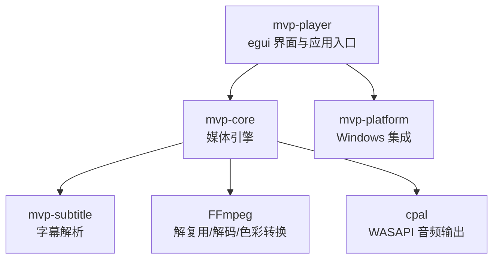
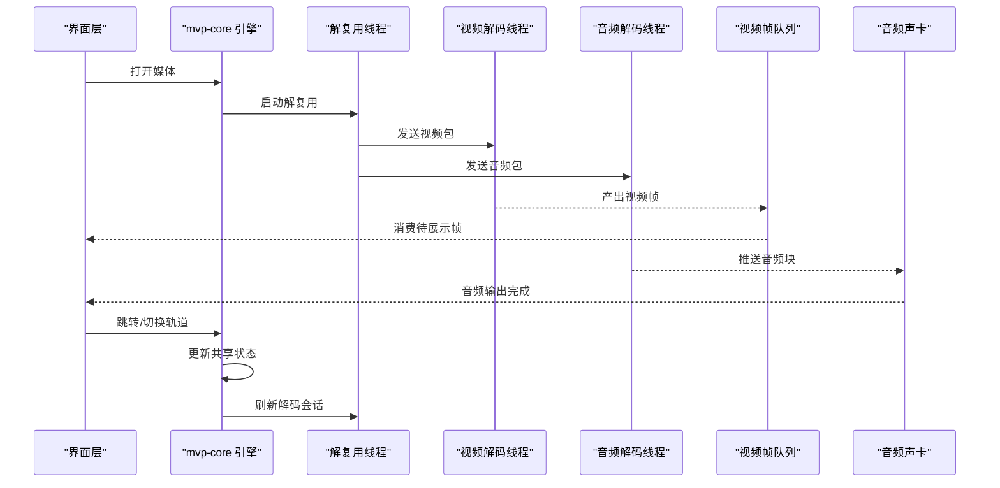
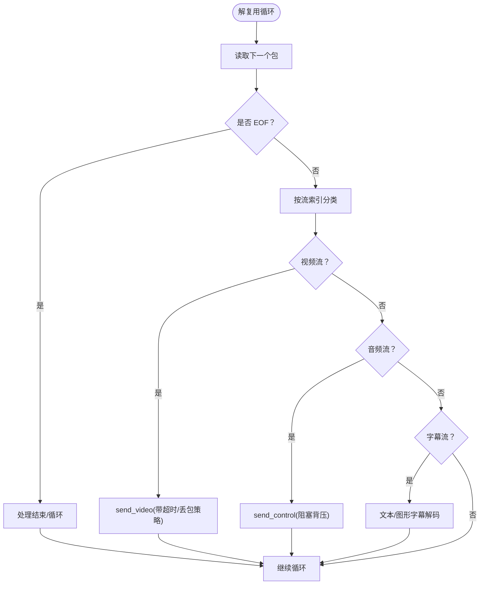
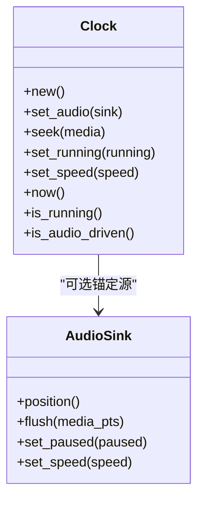
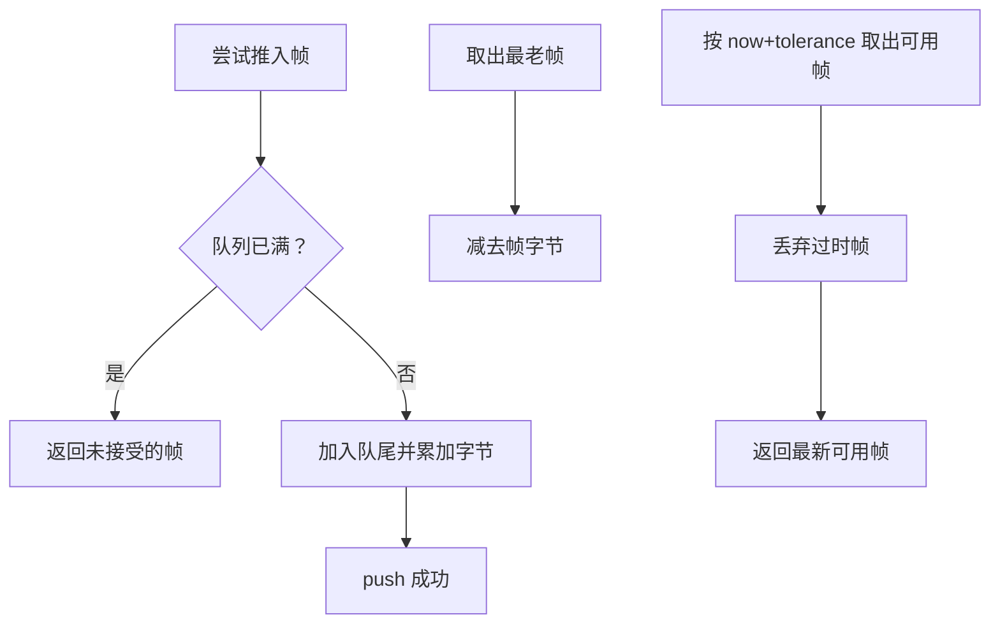
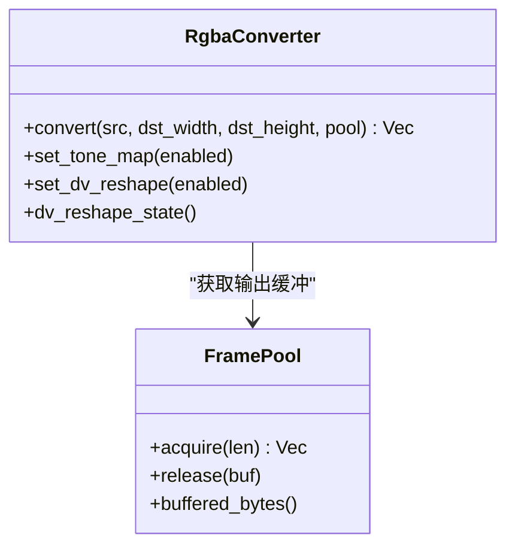
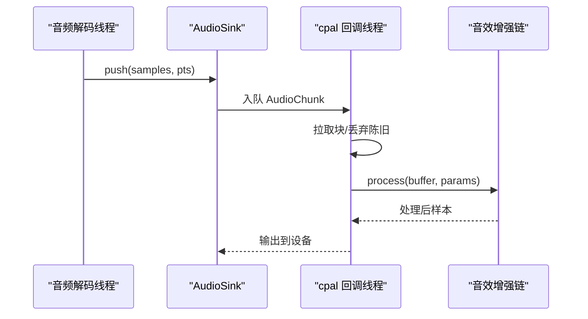
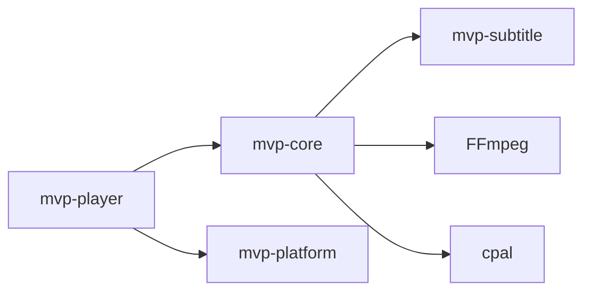

# 架构设计

<cite>
**本文引用的文件**   
- [README.md](file://README.md)
- [Cargo.toml](file://Cargo.toml)
- [mvp-core/lib.rs](file://crates/mvp-core/src/lib.rs)
- [mvp-platform/lib.rs](file://crates/mvp-platform/src/lib.rs)
- [mvp-subtitle/lib.rs](file://crates/mvp-subtitle/src/lib.rs)
- [mvp-player/main.rs](file://crates/mvp-player/src/main.rs)
- [mvp-core/engine/workers.rs](file://crates/mvp-core/src/engine/workers.rs)
- [mvp-core/engine/queue.rs](file://crates/mvp-core/src/engine/queue.rs)
- [mvp-core/engine/clock.rs](file://crates/mvp-core/src/engine/clock.rs)
- [mvp-core/video.rs](file://crates/mvp-core/src/video.rs)
- [mvp-core/audio.rs](file://crates/mvp-core/src/audio.rs)
</cite>

## 目录
1. [引言](#引言)
2. [项目结构](#项目结构)
3. [核心组件](#核心组件)
4. [架构总览](#架构总览)
5. [详细组件分析](#详细组件分析)
6. [依赖关系分析](#依赖关系分析)
7. [性能与内存特性](#性能与内存特性)
8. [故障排查指南](#故障排查指南)
9. [结论](#结论)

## 引言
MVP-Versatile-Player 是一个面向 Windows 的多功能音视频与图片播放器，直接链接 FFmpeg 内核，通过四个 Rust crate 实现模块化架构：
- mvp-core：媒体引擎，负责解复用、解码、时钟、队列、色彩转换、HDR/杜比视界处理、音频输出与图片查看。
- mvp-platform：Windows 集成，包括文件关联、单实例 IPC、外壳能力、电源管理与显示器工作区探测。
- mvp-subtitle：纯逻辑字幕解析，支持 SRT / ASS / SSA / WebVTT / MicroDVD，并做编码识别。
- mvp-player：基于 egui 的界面与应用入口，负责窗口、主题、UI 交互与播放控制。

本架构文档重点说明：
- 四个 crate 的职责边界与交互关系。
- 播放管线数据流：解复用线程 → 视频/音频解码器 → 渲染/输出。
- 多线程模型：音视频分别解码、控制指令不排队、队列按字节数设上限。
- 主时钟机制、色彩空间转换、杜比视界重塑、内存池等关键技术点。

## 项目结构
仓库采用 Cargo workspace 组织，根 `Cargo.toml` 声明四个成员 crate；应用可执行由 `mvp-player` 提供，媒体能力集中在 `mvp-core`，平台能力集中在 `mvp-platform`，字幕解析集中在 `mvp-subtitle`。

**图表来源**
- [Cargo.toml:1-8](file://Cargo.toml#L1-L8)
- [mvp-player/main.rs:1-14](file://crates/mvp-player/src/main.rs#L1-L14)
- [mvp-core/lib.rs:1-43](file://crates/mvp-core/src/lib.rs#L1-L43)
- [mvp-platform/lib.rs:1-34](file://crates/mvp-platform/src/lib.rs#L1-L34)
- [mvp-subtitle/lib.rs:1-59](file://crates/mvp-subtitle/src/lib.rs#L1-L59)

**章节来源**
- [Cargo.toml:1-78](file://Cargo.toml#L1-L78)
- [README.md:315-323](file://README.md#L315-L323)

## 核心组件
### mvp-core：媒体引擎
职责：
- 初始化 FFmpeg，暴露版本与配置信息。
- 管理播放引擎生命周期：打开媒体、选择轨道、启动解复用与解码线程。
- 维护主时钟、播放状态、播放列表、媒体信息。
- 视频帧缓冲池、YUV→RGBA 转换、HDR 色调映射、杜比视界重塑。
- 音频输出封装、设备回调、音效增强链、样本级时钟锚定。
- 字幕解码与图形字幕位图窗口管理。

关键导出类型包括 `Engine`、`Clock`、`EngineConfig`、`MediaSource`、`PlaybackState`、`VideoFrame`、`RgbaConverter`、`FramePool`、`AudioSink`、`DvPlan`、`DvReshape`、`ToneMapper` 等。

**章节来源**
- [mvp-core/lib.rs:1-43](file://crates/mvp-core/src/lib.rs#L1-L43)
- [mvp-core/lib.rs:50-103](file://crates/mvp-core/src/lib.rs#L50-L103)

### mvp-platform：Windows 集成
职责：
- 文件关联与注册表能力注册（HKCU，无需管理员）。
- 单实例守护与 `WM_COPYDATA` IPC。
- AppUserModelID、深色标题栏、任务栏闪烁、ShellExecute 辅助。
- 播放时阻止系统休眠。
- 显示器工作区与缩放探测，用于窗口初始尺寸与位置计算。

该 crate 对非 Windows 平台提供空实现，保证跨平台编译可用。

**章节来源**
- [mvp-platform/lib.rs:1-34](file://crates/mvp-platform/src/lib.rs#L1-L34)

### mvp-subtitle：字幕解析
职责：
- 解析 SRT / ASS / SSA / WebVTT / MicroDVD。
- 自动检测编码（UTF-8 / UTF-16 BOM / GBK / Big5 / Shift_JIS / Windows-1252）。
- 将不同格式统一为 `Cue` 模型，提供时间区间查询与样式。
- 纯逻辑库，无 FFmpeg 或 Windows 依赖，便于测试与信息面板复用。

**章节来源**
- [mvp-subtitle/lib.rs:1-59](file://crates/mvp-subtitle/src/lib.rs#L1-L59)
- [mvp-subtitle/lib.rs:61-201](file://crates/mvp-subtitle/src/lib.rs#L61-L201)

### mvp-player：界面与应用
职责：
- 命令行解析、单实例握手、窗口创建、主题与字体预取。
- 驱动 `PlayerApp`，协调 UI 与 `mvp-core` 引擎。
- 提供视频、音频、图片三套独立界面，以及设置、菜单、传输控件等。

**章节来源**
- [mvp-player/main.rs:1-14](file://crates/mvp-player/src/main.rs#L1-L14)
- [mvp-player/main.rs:40-182](file://crates/mvp-player/src/main.rs#L40-L182)

## 架构总览
播放管线遵循“解复用线程分发包 → 视频/音频解码线程分别处理 → 视频帧进入队列并由渲染消费，音频块进入声卡队列”的模式。控制指令（跳转、切换音轨/字幕）通过共享状态下发，不走包队列，避免陈旧指令被积压。

**图表来源**
- [mvp-core/engine/workers.rs:134-146](file://crates/mvp-core/src/engine/workers.rs#L134-L146)
- [mvp-core/engine/workers.rs:281-328](file://crates/mvp-core/src/engine/workers.rs#L281-L328)
- [mvp-core/engine/workers.rs:342-417](file://crates/mvp-core/src/engine/workers.rs#L342-L417)
- [mvp-core/engine/queue.rs:1-23](file://crates/mvp-core/src/engine/queue.rs#L1-L23)
- [mvp-core/audio.rs:153-170](file://crates/mvp-core/src/audio.rs#L153-L170)

## 详细组件分析

### 播放管线与多线程模型
- 解复用线程负责读取容器包，并根据流索引分发给视频/音频解码线程。
- 视频解码线程将解码后的帧送入 `VideoQueue`，由渲染线程按 PTS 消费。
- 音频解码线程将重采样后的 f32 块推入 `AudioSink`，由 cpal 回调在 WASAPI 线程输出。
- 控制指令（seek、track change）通过 `Shared::request_flush` 与共享状态下发，不走通道，避免阻塞。
- 视频包在队列满且画面落后时钟时丢弃，音频包保持背压，声音不能断。

**图表来源**
- [mvp-core/engine/workers.rs:451-681](file://crates/mvp-core/src/engine/workers.rs#L451-L681)
- [mvp-core/engine/workers.rs:201-262](file://crates/mvp-core/src/engine/workers.rs#L201-L262)
- [mvp-core/engine/workers.rs:689-793](file://crates/mvp-core/src/engine/workers.rs#L689-L793)

**章节来源**
- [mvp-core/engine/workers.rs:1-132](file://crates/mvp-core/src/engine/workers.rs#L1-L132)
- [mvp-core/engine/workers.rs:281-681](file://crates/mvp-core/src/engine/workers.rs#L281-L681)
- [mvp-core/engine/workers.rs:689-793](file://crates/mvp-core/src/engine/workers.rs#L689-L793)

### 主时钟机制
主时钟由 `Clock` 维护，使用系统单调时钟作为基准，并在音频设备就绪后以音频位置进行锚定校正。关键点：
- 停止时冻结位置，运行中按速度推进。
- 跳转时重置锚点并调用音频 sink flush。
- 当音频设备不可用或暂停时，回退到墙钟。
- 音频 sink 提供 `position()`，但驱动写入计数不等于播放位置，因此需要锚定与连续性保护。

**图表来源**
- [mvp-core/engine/clock.rs:43-158](file://crates/mvp-core/src/engine/clock.rs#L43-L158)
- [mvp-core/audio.rs:504-618](file://crates/mvp-core/src/audio.rs#L504-L618)

**章节来源**
- [mvp-core/engine/clock.rs:1-165](file://crates/mvp-core/src/engine/clock.rs#L1-L165)
- [mvp-core/audio.rs:1-26](file://crates/mvp-core/src/audio.rs#L1-L26)
- [mvp-core/audio.rs:504-618](file://crates/mvp-core/src/audio.rs#L504-L618)

### 视频帧队列与内存预算
`VideoQueue` 同时按帧数与字节数限制容量，防止 4K RGBA 帧占用过多内存。关键行为：
- `try_push` 满时返回原帧，不丢弃旧帧，避免队列只持有未来帧导致消费者永远等待。
- `take_ready` 消费已到达 PTS 的帧，丢弃被跳过的中间帧。
- 支持时间预算（seconds），结合 FPS 换算为帧数上限，控制解码超前量。
- 统计丢弃帧数，区分“解码跟不上”和“高帧率源产生多余帧”。

**图表来源**
- [mvp-core/engine/queue.rs:67-101](file://crates/mvp-core/src/engine/queue.rs#L67-L101)
- [mvp-core/engine/queue.rs:180-253](file://crates/mvp-core/src/engine/queue.rs#L180-L253)

**章节来源**
- [mvp-core/engine/queue.rs:1-253](file://crates/mvp-core/src/engine/queue.rs#L1-L253)

### 视频转换与 HDR/杜比视界
`RgbaConverter` 负责：
- 根据像素格式与目标尺寸构建 SwsContext。
- 可选地应用杜比视界重塑曲线（默认关闭）。
- 将 YUV/其他格式转换为紧凑 RGBA，写入 `FramePool` 提供的缓冲区。
- 可选 HDR→SDR 色调映射，按场景峰值平滑重建映射表。

`FramePool` 提供最小适配大小的缓冲区回收，避免频繁分配与零填充浪费。

**图表来源**
- [mvp-core/video.rs:548-607](file://crates/mvp-core/src/video.rs#L548-L607)
- [mvp-core/video.rs:683-706](file://crates/mvp-core/src/video.rs#L683-L706)
- [mvp-core/video.rs:57-142](file://crates/mvp-core/src/video.rs#L57-L142)

**章节来源**
- [mvp-core/video.rs:1-55](file://crates/mvp-core/src/video.rs#L1-L55)
- [mvp-core/video.rs:548-706](file://crates/mvp-core/src/video.rs#L548-L706)
- [mvp-core/video.rs:751-800](file://crates/mvp-core/src/video.rs#L751-L800)

### 音频输出与实时回调
`AudioSink` 通过 cpal 打开 WASAPI 输出，回调线程内：
- 从 bounded channel 拉取音频块，按生成号丢弃陈旧数据。
- 应用音量软限幅与音效增强链（均衡器、响度归一化、空间感等）。
- 记录 underruns 与 dropped chunks，供统计面板显示。
- 使用原子状态与无锁 seqlock 发布参数，回调线程不分配、不加锁、不做 IO。

**图表来源**
- [mvp-core/audio.rs:320-461](file://crates/mvp-core/src/audio.rs#L320-L461)
- [mvp-core/audio.rs:519-575](file://crates/mvp-core/src/audio.rs#L519-L575)

**章节来源**
- [mvp-core/audio.rs:153-170](file://crates/mvp-core/src/audio.rs#L153-L170)
- [mvp-core/audio.rs:320-461](file://crates/mvp-core/src/audio.rs#L320-L461)
- [mvp-core/audio.rs:519-618](file://crates/mvp-core/src/audio.rs#L519-L618)

### 字幕解析与图形字幕
- 文本字幕通过 `mvp-subtitle` 解析为 `Cue`，按时间区间查询当前显示内容。
- 图形字幕（PGS/VobSub/DVB）在解复用线程解码为位图，维护一个按时间与字节预算裁剪的窗口，避免累积数千张位图。
- 外部字幕优先策略与同目录自动加载语言后缀匹配。

**章节来源**
- [mvp-core/engine/workers.rs:419-449](file://crates/mvp-core/src/engine/workers.rs#L419-L449)
- [mvp-core/engine/workers.rs:661-680](file://crates/mvp-core/src/engine/workers.rs#L661-L680)
- [mvp-subtitle/lib.rs:1-59](file://crates/mvp-subtitle/src/lib.rs#L1-L59)

## 依赖关系分析
- `mvp-player` 依赖 `mvp-core` 与 `mvp-platform`。
- `mvp-core` 依赖 `ffmpeg-next`、`cpal`、`parking_lot`、`crossbeam-channel`、`mvp-subtitle`。
- `mvp-platform` 依赖 `windows` crate，并提供非 Windows 空实现。
- `mvp-subtitle` 无外部媒体依赖，纯逻辑库。

**图表来源**
- [Cargo.toml:17-51](file://Cargo.toml#L17-L51)
- [mvp-core/lib.rs:19-43](file://crates/mvp-core/src/lib.rs#L19-L43)
- [mvp-platform/lib.rs:23-34](file://crates/mvp-platform/src/lib.rs#L23-L34)

**章节来源**
- [Cargo.toml:17-51](file://Cargo.toml#L17-L51)
- [mvp-core/lib.rs:19-43](file://crates/mvp-core/src/lib.rs#L19-L43)

## 性能与内存特性
- 启动延迟优化：FFmpeg 表懒初始化，声卡在首次播放打开，窗口出现前只做必要初始化。
- 关闭速度优化：解复用 abort 标志在工作线程循环开头检查，丢弃积压包；音频 push 最多阻塞 500 ms，暂停时回调不运行，停止时先标记关闭立即结束等待。
- 队列按字节数设上限，避免 4K RGBA 帧占用半 GB。
- 视频帧缓冲池复用 Vec<u8>，避免重复分配与零填充。
- 色调映射与杜比视界重塑按需启用，默认关闭重塑以避免无法验证的色彩数学开销。
- 音频回调线程无分配、无锁、无 IO，参数通过原子与 seqlock 发布，平滑过渡避免台阶噪声。

**章节来源**
- [README.md:425-453](file://README.md#L425-L453)
- [mvp-core/engine/workers.rs:25-132](file://crates/mvp-core/src/engine/workers.rs#L25-L132)
- [mvp-core/video.rs:57-142](file://crates/mvp-core/src/video.rs#L57-L142)
- [mvp-core/audio.rs:320-461](file://crates/mvp-core/src/audio.rs#L320-L461)

## 故障排查指南
常见问题与定位要点：
- 解码无输出：解复用持续投喂但解码器长时间无帧输出，12 秒内报“解码无输出”并停下，避免空转。
- 跳转自死锁：无索引容器（如蓝光 MPEG-TS）跳转靠二分查找读包，会回调播放器自身；代码已修复自死锁，确保中断回调不持锁。
- 音频欠载：统计面板显示 underruns，可能因网络抖动或设备回调吞掉大量样本；检查声卡设备与缓冲。
- 颜色异常：HDR/SDR 映射与杜比视界重塑默认关闭，开启后需对照 libplacebo；Profile 5 IPT 基底层无法还原，信息面板会提示。
- 日志路径：发布版无控制台，日志写 `%APPDATA%\MVP-Versatile-Player\mvp.log`，超过 2 MB 自动轮转。

**章节来源**
- [README.md:35-51](file://README.md#L35-L51)
- [README.md:425-453](file://README.md#L425-L453)
- [README.md:548-583](file://README.md#L548-L583)

## 结论
MVP-Versatile-Player 通过四个 crate 明确划分职责：媒体引擎、平台集成、字幕解析与界面应用。播放管线采用解复用线程分发、音视频分别解码、控制指令走共享状态、队列按字节数设上限的设计，兼顾稳定性与低延迟。主时钟以系统时钟为主、音频锚定为辅，避免驱动计数器不准导致的画面狂奔或冻结。色彩转换与 HDR/杜比视界处理按需启用，内存池与回调线程无分配策略保障性能。整体架构清晰、可测试性强，适合进一步扩展多轨道、硬件纹理零拷贝与着色器 HDR 映射等下一步工作。