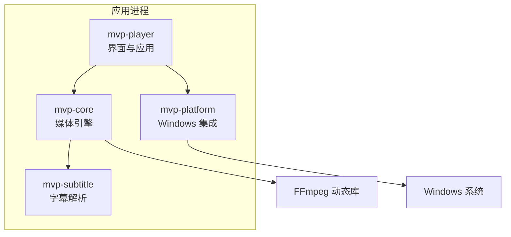
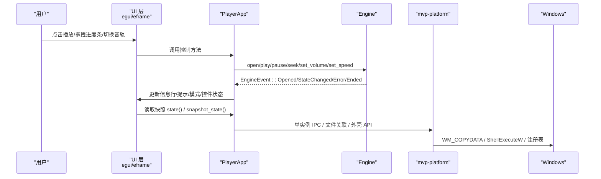
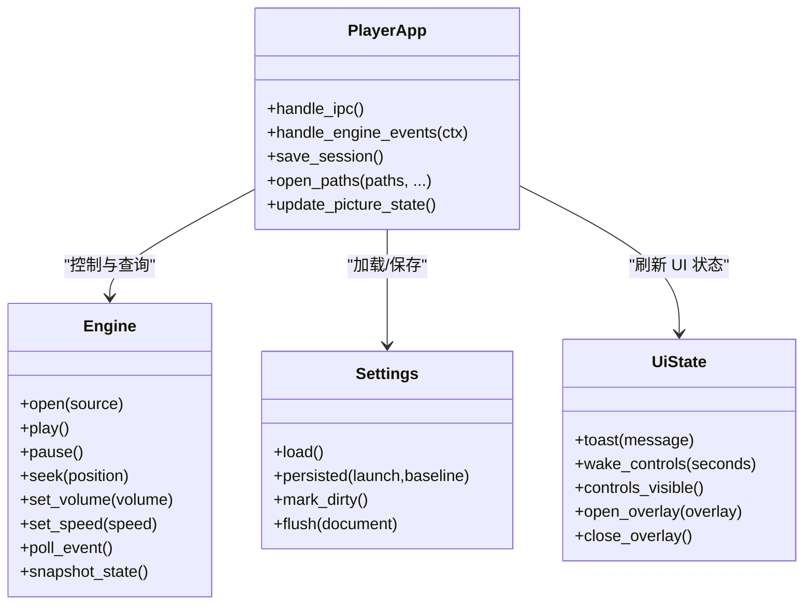
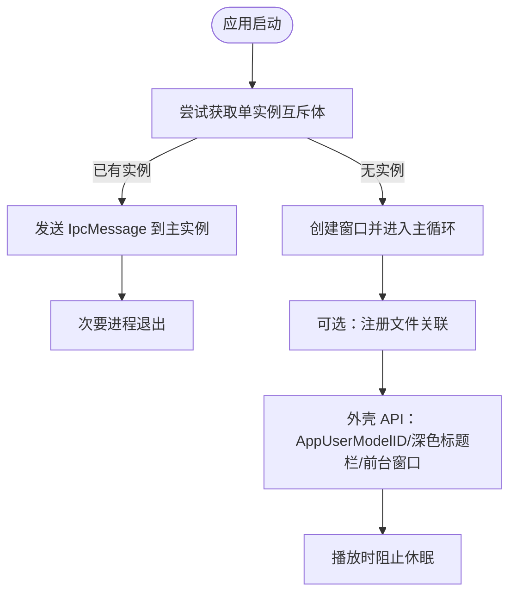
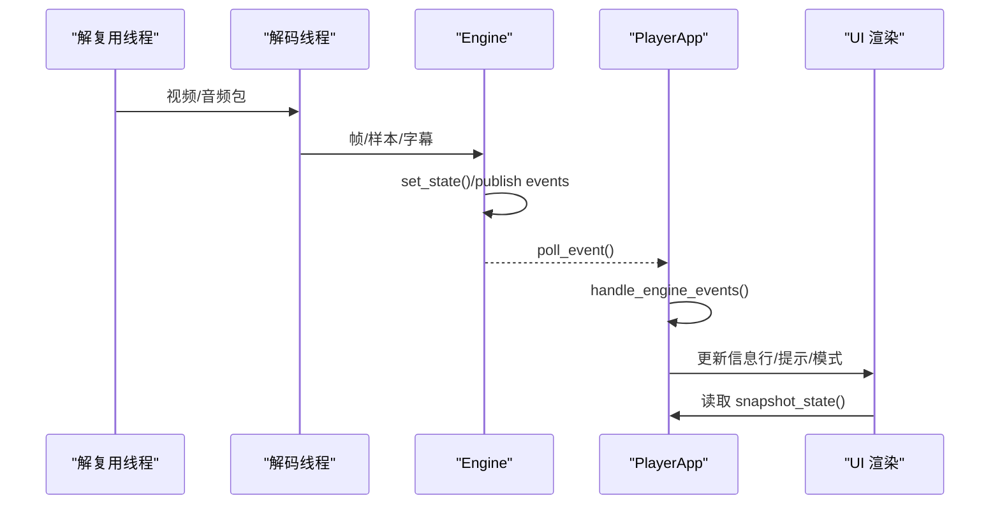
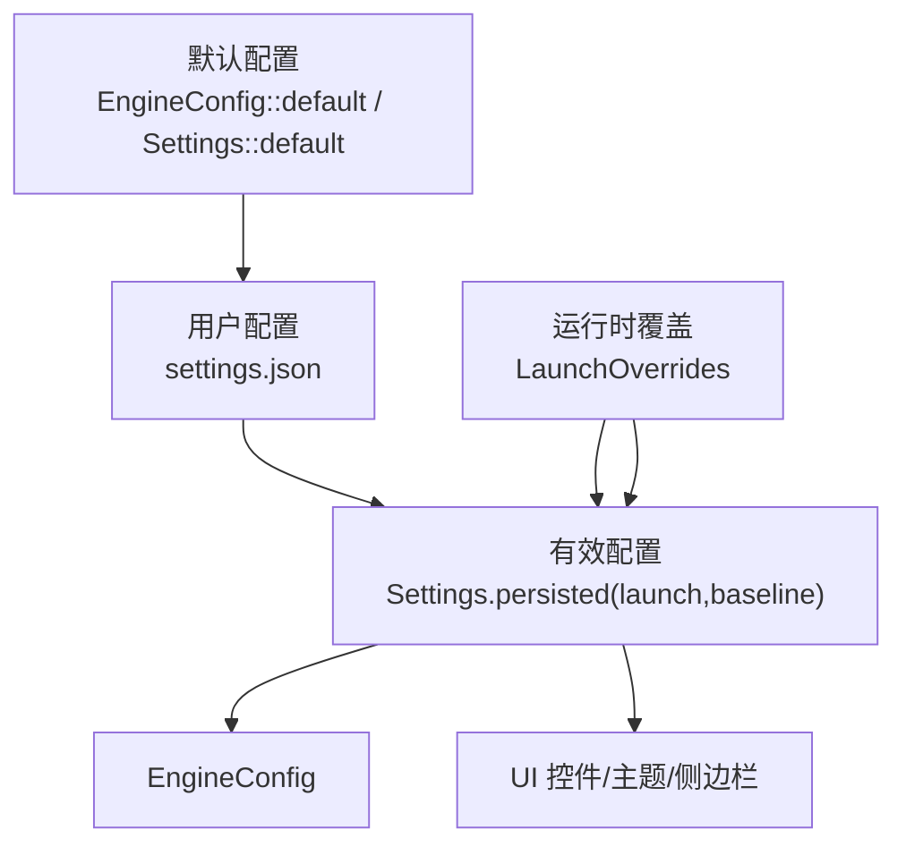
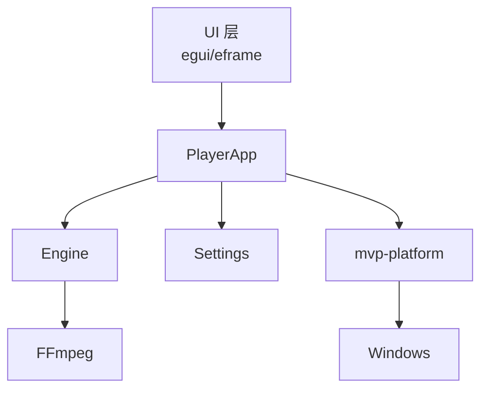
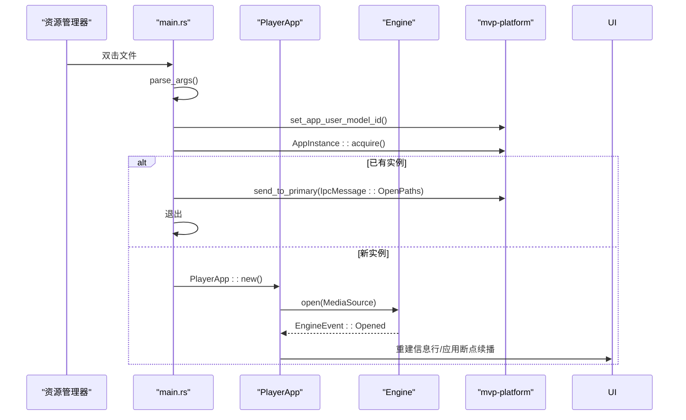
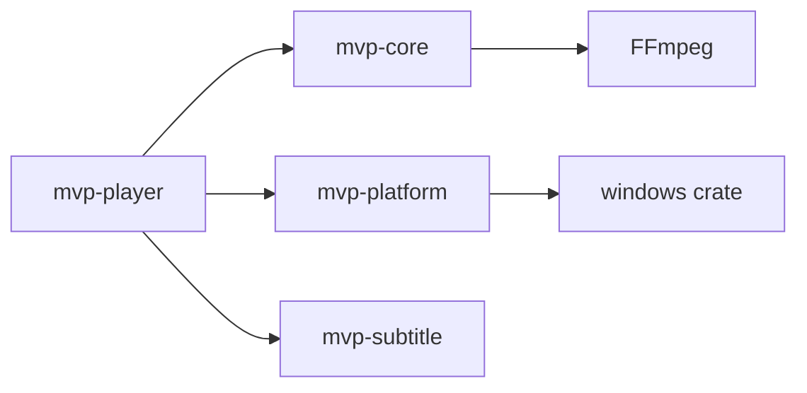

# 组件交互模式

<cite>
**本文引用的文件**   
- [README.md](file://README.md)
- [Cargo.toml](file://Cargo.toml)
- [main.rs](file://crates/mvp-player/src/main.rs)
- [app.rs](file://crates/mvp-player/src/app.rs)
- [state.rs](file://crates/mvp-player/src/state.rs)
- [settings.rs](file://crates/mvp-player/src/settings.rs)
- [ui/mod.rs](file://crates/mvp-player/src/ui/mod.rs)
- [transport.rs](file://crates/mvp-player/src/ui/transport.rs)
- [lib.rs](file://crates/mvp-core/src/lib.rs)
- [engine.rs](file://crates/mvp-core/src/engine.rs)
- [player_loop.rs](file://crates/mvp-core/tests/player_loop.rs)
- [lib.rs](file://crates/mvp-platform/src/lib.rs)
- [single_instance.rs](file://crates/mvp-platform/src/single_instance.rs)
- [assoc.rs](file://crates/mvp-platform/src/assoc.rs)
- [shell.rs](file://crates/mvp-platform/src/shell.rs)
</cite>

## 目录
1. [引言](#引言)
2. [项目结构](#项目结构)
3. [核心组件](#核心组件)
4. [架构总览](#架构总览)
5. [详细组件分析](#详细组件分析)
6. [依赖关系分析](#依赖关系分析)
7. [性能与稳定性考量](#性能与稳定性考量)
8. [故障排查指南](#故障排查指南)
9. [结论](#结论)

## 引言
本文面向“组件交互模式”，聚焦 MVP-Versatile-Player 中 UI 层与媒体引擎层的协作、Windows 平台集成、事件传播链路，以及配置系统的层次结构。目标是让读者既能理解高层交互图，也能定位到具体源码位置，从而在扩展功能或排查问题时快速定位责任模块。

## 项目结构
仓库采用多 crate 工作区组织：
- `mvp-core`：FFmpeg 直接绑定的媒体引擎、播放列表、图片查看器、杜比视界/HDR 处理等。
- `mvp-platform`：Windows 集成（文件关联、单实例 IPC、外壳工具、电源管理、显示器与工作区）。
- `mvp-subtitle`：字幕解析与编码识别。
- `mvp-player`：基于 eframe/egui 的界面与应用主循环，持有引擎、播放列表、设置与 UI 状态。

**图表来源**
- [README.md:315-323](file://README.md#L315-L323)
- [Cargo.toml:1-8](file://Cargo.toml#L1-L8)

**章节来源**
- [README.md:315-323](file://README.md#L315-L323)
- [Cargo.toml:1-8](file://Cargo.toml#L1-L8)

## 核心组件
- 应用入口与生命周期：负责命令行解析、单实例检测、窗口创建、日志初始化。
- 应用对象 `PlayerApp`：唯一拥有引擎、播放列表、设置和 UI 状态的地方，是各层通信的中心。
- 媒体引擎 `Engine`：解复用、解码、时钟、队列、音频输出、事件通道。
- Windows 集成：文件关联注册、单实例 IPC、外壳 API、电源阻止休眠。
- 配置系统：默认值、用户持久化设置、运行时覆盖参数。

**章节来源**
- [main.rs:1-10](file://crates/mvp-player/src/main.rs#L1-L10)
- [app.rs:1-25](file://crates/mvp-player/src/app.rs#L1-L25)
- [engine.rs:1-21](file://crates/mvp-core/src/engine.rs#L1-L21)
- [lib.rs:1-16](file://crates/mvp-platform/src/lib.rs#L1-L16)
- [settings.rs:1-10](file://crates/mvp-player/src/settings.rs#L1-L10)

## 架构总览
整体交互遵循“UI 驱动控制、引擎异步生产、事件驱动更新”的模式：
- UI 通过 `PlayerApp` 调用引擎接口（打开、播放、暂停、跳转、音量、速度等）。
- 引擎在后台线程解复用/解码，把帧、字幕、状态变化通过 `EngineEvent` 推送到 UI。
- UI 每帧拉取事件、快照状态，并渲染画面；同时把用户操作写回设置或引擎。
- Windows 集成提供文件关联、单实例 IPC、外壳能力，作为应用启动与系统集成的支撑。

**图表来源**
- [app.rs:837-889](file://crates/mvp-player/src/app.rs#L837-L889)
- [engine.rs:138-153](file://crates/mvp-core/src/engine.rs#L138-L153)
- [single_instance.rs:53-62](file://crates/mvp-platform/src/single_instance.rs#L53-L62)
- [shell.rs:232-289](file://crates/mvp-platform/src/shell.rs#L232-L289)

## 详细组件分析

### UI 层与媒体引擎层交互
- 应用状态管理：`PlayerApp` 持有 `Settings`、`Playlist`、`UiState` 与 `Engine`，是唯一允许这些对象互相访问的位置。
- 事件驱动更新：引擎通过 `EngineEvent` 通知 UI，UI 每帧限制处理数量，避免卡顿。
- 配置参数传递：`EngineConfig` 由设置决定，包含硬件解码、HDR 色调映射、杜比视界重塑、音频开关、初始音量/速度、队列预算等。

**图表来源**
- [app.rs:1-25](file://crates/mvp-player/src/app.rs#L1-L25)
- [app.rs:837-889](file://crates/mvp-player/src/app.rs#L837-L889)
- [engine.rs:155-213](file://crates/mvp-core/src/engine.rs#L155-L213)
- [settings.rs:1093-1124](file://crates/mvp-player/src/settings.rs#L1093-L1124)
- [state.rs:729-767](file://crates/mvp-player/src/state.rs#L729-L767)

**章节来源**
- [app.rs:1-25](file://crates/mvp-player/src/app.rs#L1-L25)
- [app.rs:837-889](file://crates/mvp-player/src/app.rs#L837-L889)
- [engine.rs:155-213](file://crates/mvp-core/src/engine.rs#L155-L213)
- [settings.rs:1093-1124](file://crates/mvp-player/src/settings.rs#L1093-L1124)
- [state.rs:729-767](file://crates/mvp-player/src/state.rs#L729-L767)

### 媒体引擎与平台集成交互
- 单实例 IPC：通过命名互斥体 + 隐藏顶层窗口 + `WM_COPYDATA` 实现跨进程消息。
- 文件关联注册：写入 HKCU，支持 `RegisteredApplications`/`Capabilities`，并提供“默认应用”深链。
- 外壳 API：AppUserModelID、深色标题栏、任务栏闪烁、前台窗口、ShellExecuteW。
- 电源管理：播放时阻止系统休眠。

**图表来源**
- [main.rs:65-99](file://crates/mvp-player/src/main.rs#L65-L99)
- [single_instance.rs:1-19](file://crates/mvp-platform/src/single_instance.rs#L1-L19)
- [assoc.rs:1-20](file://crates/mvp-platform/src/assoc.rs#L1-L20)
- [shell.rs:11-28](file://crates/mvp-platform/src/shell.rs#L11-L28)
- [power.rs:80-124](file://crates/mvp-platform/src/power.rs#L80-L124)

**章节来源**
- [main.rs:65-99](file://crates/mvp-player/src/main.rs#L65-L99)
- [single_instance.rs:1-19](file://crates/mvp-platform/src/single_instance.rs#L1-L19)
- [assoc.rs:1-20](file://crates/mvp-platform/src/assoc.rs#L1-L20)
- [shell.rs:11-28](file://crates/mvp-platform/src/shell.rs#L11-L28)
- [power.rs:80-124](file://crates/mvp-platform/src/power.rs#L80-L124)

### 事件传播机制：从底层硬件事件到上层 UI 更新
事件传播分为三层：
1. 底层：FFmpeg 解复用/解码线程产生包、帧、字幕，并通过内部队列与条件变量协调。
2. 引擎层：`Engine` 将关键状态变化封装为 `EngineEvent`，通过有界通道推送给 UI。
3. UI 层：`PlayerApp.handle_engine_events` 每帧最多处理固定数量事件，更新信息行、错误提示、播放结束逻辑等。

**图表来源**
- [engine.rs:1-21](file://crates/mvp-core/src/engine.rs#L1-L21)
- [engine.rs:138-153](file://crates/mvp-core/src/engine.rs#L138-L153)
- [engine.rs:440-449](file://crates/mvp-core/src/engine.rs#L440-L449)
- [app.rs:856-889](file://crates/mvp-player/src/app.rs#L856-L889)

**章节来源**
- [engine.rs:1-21](file://crates/mvp-core/src/engine.rs#L1-L21)
- [engine.rs:138-153](file://crates/mvp-core/src/engine.rs#L138-L153)
- [engine.rs:440-449](file://crates/mvp-core/src/engine.rs#L440-L449)
- [app.rs:856-889](file://crates/mvp-player/src/app.rs#L856-L889)

### 配置系统的层次结构
配置系统分为三层：
- 默认配置：`EngineConfig::default()` 与 `Settings::default()` 提供初始值。
- 用户配置：`settings.json` 持久化用户偏好，支持迁移与原子写入。
- 运行时配置：命令行参数（如 `--volume`、`--speed`）作为 `LaunchOverrides`，仅影响本次启动，不写回设置。

**图表来源**
- [engine.rs:190-213](file://crates/mvp-core/src/engine.rs#L190-L213)
- [settings.rs:843-857](file://crates/mvp-player/src/settings.rs#L843-L857)
- [settings.rs:1082-1091](file://crates/mvp-player/src/settings.rs#L1082-L1091)
- [app.rs:997-1004](file://crates/mvp-player/src/app.rs#L997-L1004)

**章节来源**
- [engine.rs:190-213](file://crates/mvp-core/src/engine.rs#L190-L213)
- [settings.rs:843-857](file://crates/mvp-player/src/settings.rs#L843-L857)
- [settings.rs:1082-1091](file://crates/mvp-player/src/settings.rs#L1082-L1091)
- [app.rs:997-1004](file://crates/mvp-player/src/app.rs#L997-L1004)

### 组件交互图与事件流程图
- 组件交互图展示 UI、引擎、平台、系统之间的职责边界与依赖。
- 事件流程图展示一次打开文件、播放、跳转、停止的完整链路。

**图表来源**
- [main.rs:40-181](file://crates/mvp-player/src/main.rs#L40-L181)
- [app.rs:837-889](file://crates/mvp-player/src/app.rs#L837-L889)
- [engine.rs:537-594](file://crates/mvp-core/src/engine.rs#L537-L594)
- [lib.rs:1-16](file://crates/mvp-platform/src/lib.rs#L1-L16)

**图表来源**
- [main.rs:40-181](file://crates/mvp-player/src/main.rs#L40-L181)
- [app.rs:837-889](file://crates/mvp-player/src/app.rs#L837-L889)
- [engine.rs:551-594](file://crates/mvp-core/src/engine.rs#L551-L594)
- [shell.rs:11-28](file://crates/mvp-platform/src/shell.rs#L11-L28)

## 依赖关系分析
- `mvp-player` 依赖 `mvp-core`（引擎）、`mvp-platform`（Windows 集成）、`mvp-subtitle`（字幕）。
- `mvp-core` 直接链接 FFmpeg，并通过 `mvp-subtitle` 解析字幕。
- `mvp-platform` 使用 `windows` crate 调用 Win32 API，并在非 Windows 平台提供空实现以保持可移植性。

**图表来源**
- [Cargo.toml:1-8](file://Cargo.toml#L1-L8)
- [Cargo.toml:33-51](file://Cargo.toml#L33-L51)
- [lib.rs:1-16](file://crates/mvp-platform/src/lib.rs#L1-L16)

**章节来源**
- [Cargo.toml:1-8](file://Cargo.toml#L1-L8)
- [Cargo.toml:33-51](file://Cargo.toml#L33-L51)
- [lib.rs:1-16](file://crates/mvp-platform/src/lib.rs#L1-L16)

## 性能与稳定性考量
- 引擎线程隔离：解复用与解码分离，避免慢视频阻塞声卡。
- 队列按字节与帧数双重上限，防止 4K RGBA 帧占用过大内存。
- 控制指令不走包队列，避免“全部丢弃”指令被积压导致死锁。
- 关闭路径快速：abort 标志优先，声卡关闭避免背压等待，设置落盘节流。
- UI 事件每帧限制最大处理数，防止恶意生产者冻结界面。

**章节来源**
- [README.md:325-358](file://README.md#L325-L358)
- [README.md:439-453](file://README.md#L439-L453)
- [engine.rs:310-372](file://crates/mvp-core/src/engine.rs#L310-L372)
- [engine.rs:613-661](file://crates/mvp-core/src/engine.rs#L613-L661)
- [app.rs:856-864](file://crates/mvp-player/src/app.rs#L856-L864)

## 故障排查指南
- 日志位置：`%APPDATA%\MVP-Versatile-Player\mvp.log`，发布构建无控制台，日志是主要排查途径。
- 常见错误：
  - FFmpeg 初始化失败：检查开发包路径与 libclang。
  - 音频设备不可用：UI 显示警告而非致命错误。
  - 文件关联未生效：检查 HKCU 注册表与“默认应用”设置页。
  - 单实例 IPC 失败：检查命名互斥体与隐藏窗口是否创建成功。
- 调试建议：
  - 使用 `RUST_LOG=mvp_core=debug` 查看引擎内部细节。
  - 使用端到端测试验证播放、跳转、字幕、截图等行为。
  - 对文件关联使用 `registry_live` 测试验证注册与注销。

**章节来源**
- [main.rs:184-207](file://crates/mvp-player/src/main.rs#L184-L207)
- [app.rs:877-885](file://crates/mvp-player/src/app.rs#L877-L885)
- [README.md:481-498](file://README.md#L481-L498)
- [README.md:538-544](file://README.md#L538-L544)

## 结论
MVP-Versatile-Player 的组件交互以 `PlayerApp` 为中心，UI 层通过事件驱动更新，媒体引擎负责异步解码与时间同步，Windows 平台集成提供文件关联、单实例 IPC 与外壳能力。配置系统分层清晰，默认值、用户设置与运行时覆盖共同决定最终行为。该设计在保证高性能与稳定性的同时，提供了良好的可扩展性与可维护性。