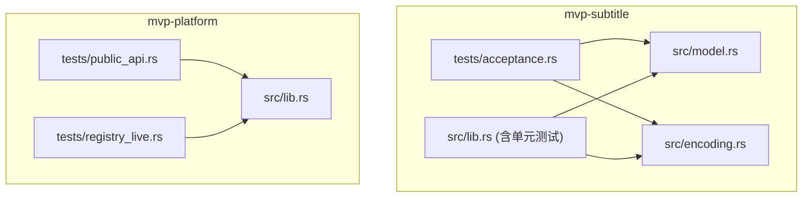
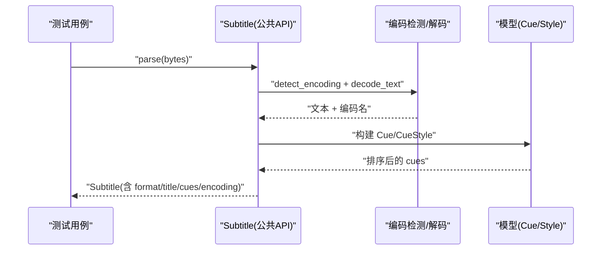
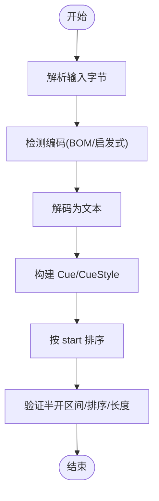
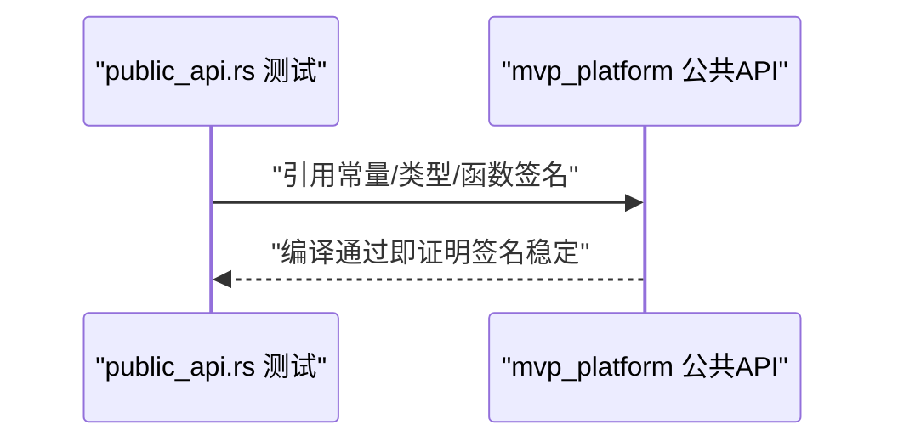
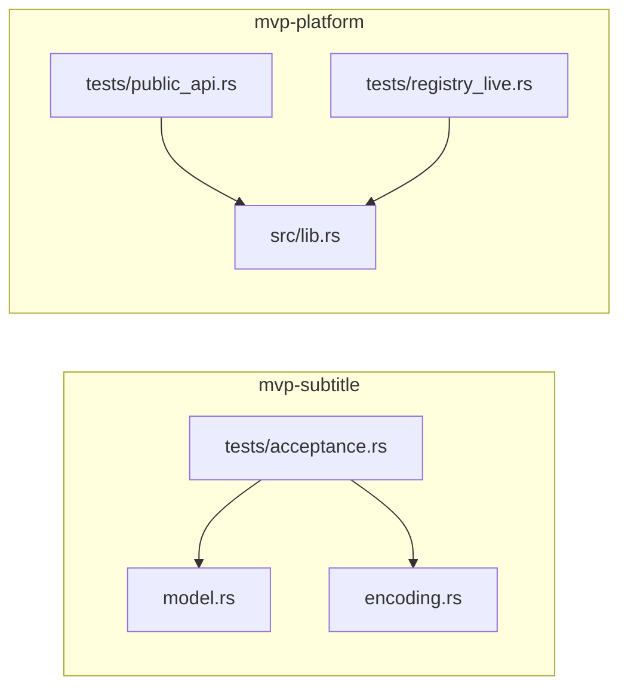

# 单元测试

<cite>
**本文引用的文件**
- [crates/mvp-subtitle/tests/acceptance.rs](file://crates/mvp-subtitle/tests/acceptance.rs)
- [crates/mvp-subtitle/src/lib.rs](file://crates/mvp-subtitle/src/lib.rs)
- [crates/mvp-subtitle/src/model.rs](file://crates/mvp-subtitle/src/model.rs)
- [crates/mvp-subtitle/src/encoding.rs](file://crates/mvp-subtitle/src/encoding.rs)
- [crates/mvp-platform/tests/public_api.rs](file://crates/mvp-platform/tests/public_api.rs)
- [crates/mvp-platform/tests/registry_live.rs](file://crates/mvp-platform/tests/registry_live.rs)
- [crates/mvp-platform/src/lib.rs](file://crates/mvp-platform/src/lib.rs)
</cite>

## 目录
1. [简介](#简介)
2. [项目结构](#项目结构)
3. [核心组件](#核心组件)
4. [架构总览](#架构总览)
5. [详细组件分析](#详细组件分析)
6. [依赖分析](#依赖分析)
7. [性能考虑](#性能考虑)
8. [故障排查指南](#故障排查指南)
9. [结论](#结论)
10. [附录](#附录)

## 简介
本文件面向 MVP-Versatile-Player 的单元测试体系，聚焦两个模块：
- mvp-subtitle：字幕解析与时间轴处理（SRT、ASS、WebVTT、MicroDvd），以及编码识别与解码。
- mvp-platform：Windows 平台公共 API 的稳定性契约测试与可选的注册表集成测试。

文档将说明测试的组织方式与命名约定、设计原则（隔离性、可重复性、快速执行）、测试数据管理策略、断言与自定义断言实践，并通过具体示例展示如何测试字幕解析器、编码识别、时间轴处理等核心能力。最后给出覆盖率统计与质量门禁配置建议。

## 项目结构
mvp-subtitle 与 mvp-platform 各自在 crates 目录下独立组织，测试位于各 crate 的 tests 目录或源码内的 #[cfg(test)] 模块中：
- mvp-subtitle：
  - acceptance.rs：端到端/验收级测试，通过公共 API Subtitle::parse 验证解析结果、编码、时间轴行为。
  - src/lib.rs 内嵌单元测试：覆盖空轨道、格式推断、强制格式、Cue 区间语义、shift/merge 等行为。
- mvp-platform：
  - public_api.rs：编译期契约测试，仅引用类型与函数签名，不执行任何系统调用，确保公共 API 稳定。
  - registry_live.rs：带副作用的“活”测试，默认忽略，需显式启用以验证注册表关联流程。

**图表来源**
- [crates/mvp-subtitle/tests/acceptance.rs:1-346](file://crates/mvp-subtitle/tests/acceptance.rs#L1-L346)
- [crates/mvp-subtitle/src/lib.rs:1-201](file://crates/mvp-subtitle/src/lib.rs#L1-L201)
- [crates/mvp-subtitle/src/model.rs:121-156](file://crates/mvp-subtitle/src/model.rs#L121-L156)
- [crates/mvp-subtitle/src/encoding.rs:1-35](file://crates/mvp-subtitle/src/encoding.rs#L1-L35)
- [crates/mvp-platform/tests/public_api.rs:1-150](file://crates/mvp-platform/tests/public_api.rs#L1-L150)
- [crates/mvp-platform/tests/registry_live.rs:1-151](file://crates/mvp-platform/tests/registry_live.rs#L1-L151)
- [crates/mvp-platform/src/lib.rs:1-34](file://crates/mvp-platform/src/lib.rs#L1-L34)

**章节来源**
- [crates/mvp-subtitle/tests/acceptance.rs:1-346](file://crates/mvp-subtitle/tests/acceptance.rs#L1-L346)
- [crates/mvp-subtitle/src/lib.rs:1-201](file://crates/mvp-subtitle/src/lib.rs#L1-L201)
- [crates/mvp-platform/tests/public_api.rs:1-150](file://crates/mvp-platform/tests/public_api.rs#L1-L150)
- [crates/mvp-platform/tests/registry_live.rs:1-151](file://crates/mvp-platform/tests/registry_live.rs#L1-L151)
- [crates/mvp-platform/src/lib.rs:1-34](file://crates/mvp-platform/src/lib.rs#L1-L34)

## 核心组件
- 字幕解析与模型
  - Subtitle：统一模型，包含 format、title、cues、encoding；提供 parse、parse_with_format、active_at、index_at、shift、merge_adjacent 等方法。
  - Cue/CueStyle：单条字幕的时间范围与样式信息。
  - 编码检测与解码：detect_encoding、decode_text、EncodingHint。
- 平台公共 API
  - assoc：文件关联、注册表能力键、命令行生成等。
  - single_instance：单实例守卫与 IPC。
  - shell：窗口与 Shell 辅助。
  - power：阻止休眠。
  - monitor：工作区与 DPI。

这些组件的测试覆盖了从输入到输出的完整路径，并保证对异常输入的鲁棒性。

**章节来源**
- [crates/mvp-subtitle/src/model.rs:121-156](file://crates/mvp-subtitle/src/model.rs#L121-L156)
- [crates/mvp-subtitle/src/encoding.rs:1-35](file://crates/mvp-subtitle/src/encoding.rs#L1-L35)
- [crates/mvp-platform/src/lib.rs:1-34](file://crates/mvp-platform/src/lib.rs#L1-L34)

## 架构总览
下图展示了测试如何通过公共 API 驱动字幕解析与平台功能，强调“只通过公开接口”的原则，避免直接访问内部实现。

**图表来源**
- [crates/mvp-subtitle/tests/acceptance.rs:1-346](file://crates/mvp-subtitle/tests/acceptance.rs#L1-L346)
- [crates/mvp-subtitle/src/model.rs:121-156](file://crates/mvp-subtitle/src/model.rs#L121-L156)
- [crates/mvp-subtitle/src/encoding.rs:1-35](file://crates/mvp-subtitle/src/encoding.rs#L1-L35)

## 详细组件分析

### mvp-subtitle 测试组织与命名约定
- 验收测试位于 tests/acceptance.rs，通过 Subtitle::parse 这一唯一入口进行端到端验证，覆盖：
  - 标准 SRT、带点号毫秒、无小时字段的时间戳。
  - 标记清理（如 <i>、{\an8}、\N）。
  - GBK 中文文件的编码识别与解码往返。
  - UTF-8/UTF-16LE 的 BOM 处理。
  - ASS 重排 Format 行与样式覆盖（对齐、粗体、颜色、边距）。
  - WebVTT 的 NOTE、STYLE、cue 标识符与 align:start。
  - 半开区间 [start, end) 的行为验证。
  - shift 延迟与排序保持。
  - 畸形输入容错（不 panic、可用 Subtitle）。
  - merge_adjacent 合并相邻相同文本且小间隙的 cue。
- 源码内单元测试位于 src/lib.rs 的 #[cfg(test)] 模块，覆盖：
  - 空轨道可用性、扩展名到格式映射、内容格式推断、强制格式解析。
  - Cue 的 duration、contains 半开区间、index_at 查找当前与下一个。
  - active_at 优先最新开始、负偏移保持但排序、merge 边界情况。

命名约定：
- 测试函数使用描述性英文命名，表达被测场景（如 well_formed_srt、bom_encodings、ass_reordered_format_and_overrides）。
- 每个测试聚焦单一职责，便于定位失败原因。

**章节来源**
- [crates/mvp-subtitle/tests/acceptance.rs:1-346](file://crates/mvp-subtitle/tests/acceptance.rs#L1-L346)
- [crates/mvp-subtitle/src/lib.rs:61-201](file://crates/mvp-subtitle/src/lib.rs#L61-L201)

### mvp-platform 公共 API 测试
- public_api.rs 是编译期契约测试，仅引用常量、类型与函数签名，确保下游依赖不会因签名变更而静默破坏。
- 覆盖：
  - 常量与重导出名称稳定（APP_NAME、PROG_ID_PREFIX、EXE_NAME）。
  - assoc 模块所有公共函数签名稳定。
  - FileKinds、AssocReport 的结构与 trait（Copy/Eq/Clone）稳定。
  - single_instance、shell、power、monitor 模块的函数签名稳定。
  - PixelRect 值类型属性与 to_points 计算正确。

该测试不执行任何系统调用，因此可在任意平台快速编译通过，保障跨平台开发体验。

**章节来源**
- [crates/mvp-platform/tests/public_api.rs:1-150](file://crates/mvp-platform/tests/public_api.rs#L1-L150)
- [crates/mvp-platform/src/lib.rs:1-34](file://crates/mvp-platform/src/lib.rs#L1-L34)

### 测试数据管理策略
- 固定数据（内联字符串/字节）：
  - 验收测试直接在测试中构造最小可复现样本（如 SRT/VTT/ASS 片段），无需外部文件，保证可重复性与快速执行。
  - 示例路径参考：[crates/mvp-subtitle/tests/acceptance.rs:9-42](file://crates/mvp-subtitle/tests/acceptance.rs#L9-L42)、[crates/mvp-subtitle/tests/acceptance.rs:137-176](file://crates/mvp-subtitle/tests/acceptance.rs#L137-L176)。
- 随机数据：
  - 当前仓库未见基于随机生成的测试数据；如有需要，可通过 property-based testing（如 proptest）生成边界值，但应控制规模以保证速度。
- 环境依赖数据：
  - 图形字幕测试（mvp-core）通过环境变量开关，未设置则跳过，体现隔离与可重复性原则。虽非本文重点，但可作为参考模式。

**章节来源**
- [crates/mvp-subtitle/tests/acceptance.rs:9-42](file://crates/mvp-subtitle/tests/acceptance.rs#L9-L42)
- [crates/mvp-subtitle/tests/acceptance.rs:137-176](file://crates/mvp-subtitle/tests/acceptance.rs#L137-L176)

### 断言库与自定义断言
- 断言库：
  - 使用 Rust 标准 assert_eq!/assert! 进行精确断言，确保期望与实现一致。
- 自定义断言：
  - 针对复杂状态（如“cues 是否按 start 排序”、“半开区间是否正确”）编写小型辅助断言，提升可读性与复用性。
  - 例如在 shift 测试中检查 windows(2) 的相邻元素顺序，或在 merge_adjacent 后验证长度与合并数量。
- 建议：
  - 将常见校验封装为私有函数（如 assert_sorted_by_start、assert_half_open_range），减少重复代码。

**章节来源**
- [crates/mvp-subtitle/tests/acceptance.rs:241-276](file://crates/mvp-subtitle/tests/acceptance.rs#L241-L276)
- [crates/mvp-subtitle/tests/acceptance.rs:313-346](file://crates/mvp-subtitle/tests/acceptance.rs#L313-L346)

### 字幕解析器测试示例
- 解析 SRT：
  - 验证格式、编码、cue 数量、时间与文本。
  - 参考路径：[crates/mvp-subtitle/tests/acceptance.rs:9-42](file://crates/mvp-subtitle/tests/acceptance.rs#L9-L42)
- 编码识别与解码：
  - GBK 中文文件 detect_encoding 与 decode_text 往返；BOM 处理（UTF-8/UTF-16LE）。
  - 参考路径：[crates/mvp-subtitle/tests/acceptance.rs:79-135](file://crates/mvp-subtitle/tests/acceptance.rs#L79-L135)
- 时间轴处理：
  - 半开区间 [start, end) 的 contains/active_at 行为；shift 延迟与排序保持；merge_adjacent 合并逻辑。
  - 参考路径：[crates/mvp-subtitle/tests/acceptance.rs:214-276](file://crates/mvp-subtitle/tests/acceptance.rs#L214-L276)、[crates/mvp-subtitle/tests/acceptance.rs:313-346](file://crates/mvp-subtitle/tests/acceptance.rs#L313-L346)

**图表来源**
- [crates/mvp-subtitle/tests/acceptance.rs:9-42](file://crates/mvp-subtitle/tests/acceptance.rs#L9-L42)
- [crates/mvp-subtitle/tests/acceptance.rs:214-276](file://crates/mvp-subtitle/tests/acceptance.rs#L214-L276)
- [crates/mvp-subtitle/src/model.rs:121-156](file://crates/mvp-subtitle/src/model.rs#L121-L156)

### 平台公共 API 测试示例
- 常量与重导出稳定：
  - APP_NAME、PROG_ID_PREFIX、EXE_NAME 的值与类型重导出一致性。
  - 参考路径：[crates/mvp-platform/tests/public_api.rs:18-30](file://crates/mvp-platform/tests/public_api.rs#L18-L30)
- 函数签名稳定：
  - assoc、single_instance、shell、power、monitor 的所有公共函数签名被显式命名，防止意外变更。
  - 参考路径：[crates/mvp-platform/tests/public_api.rs:32-129](file://crates/mvp-platform/tests/public_api.rs#L32-L129)
- 值类型稳定：
  - FileKinds、AssocReport、PixelRect 的 Copy/Eq/Clone 与计算方法。
  - 参考路径：[crates/mvp-platform/tests/public_api.rs:50-75](file://crates/mvp-platform/tests/public_api.rs#L50-L75)、[crates/mvp-platform/tests/public_api.rs:131-149](file://crates/mvp-platform/tests/public_api.rs#L131-L149)

**图表来源**
- [crates/mvp-platform/tests/public_api.rs:1-150](file://crates/mvp-platform/tests/public_api.rs#L1-L150)
- [crates/mvp-platform/src/lib.rs:1-34](file://crates/mvp-platform/src/lib.rs#L1-L34)

### 注册表“活”测试（可选）
- registry_live.rs 默认忽略，需显式运行以写入 HKCU 注册表，验证文件关联注册/注销流程。
- 关键断言：
  - register/unregister 往返、capabilities 键写入、命令行列引号正确、卸载后不留痕迹。
- 安全与隔离：
  - 仅操作 HKCU 下自有键，不读取用户其他应用选择；每次测试前后恢复状态。

**章节来源**
- [crates/mvp-platform/tests/registry_live.rs:1-151](file://crates/mvp-platform/tests/registry_live.rs#L1-L151)

## 依赖分析
- mvp-subtitle 测试依赖：
  - encoding_rs：用于 GBK/UTF-16LE 编码构造与检测。
  - 子模块 model/encoding/srt/ass/vtt/microdvd：通过公共 API 间接依赖。
- mvp-platform 测试依赖：
  - anyhw：错误类型。
  - windows 目标特定依赖：仅在 Windows 上启用，契约测试不触发实际系统调用。

**图表来源**
- [crates/mvp-subtitle/tests/acceptance.rs:1-346](file://crates/mvp-subtitle/tests/acceptance.rs#L1-L346)
- [crates/mvp-subtitle/src/model.rs:121-156](file://crates/mvp-subtitle/src/model.rs#L121-L156)
- [crates/mvp-subtitle/src/encoding.rs:1-35](file://crates/mvp-subtitle/src/encoding.rs#L1-L35)
- [crates/mvp-platform/tests/public_api.rs:1-150](file://crates/mvp-platform/tests/public_api.rs#L1-L150)
- [crates/mvp-platform/tests/registry_live.rs:1-151](file://crates/mvp-platform/tests/registry_live.rs#L1-L151)
- [crates/mvp-platform/src/lib.rs:1-34](file://crates/mvp-platform/src/lib.rs#L1-L34)

**章节来源**
- [crates/mvp-subtitle/tests/acceptance.rs:1-346](file://crates/mvp-subtitle/tests/acceptance.rs#L1-L346)
- [crates/mvp-platform/tests/public_api.rs:1-150](file://crates/mvp-platform/tests/public_api.rs#L1-L150)
- [crates/mvp-platform/tests/registry_live.rs:1-151](file://crates/mvp-platform/tests/registry_live.rs#L1-L151)

## 性能考虑
- 测试数据内联：避免 I/O 开销，保证快速执行。
- 最小化资源：不启动 UI、不打开窗口、不写注册表（除非显式启用 live 测试）。
- 并行执行：cargo test 默认多线程并行，适合纯逻辑测试；live 测试建议 --test-threads=1 以避免竞争。
- 复杂度：解析与时间轴操作通常为 O(n)，merge_adjacent 为线性扫描，测试覆盖边界条件即可。

[本节为通用指导，不直接分析具体文件]

## 故障排查指南
- 解析失败但不 panic：
  - 验收测试覆盖多种畸形输入，确保始终返回可用的 Subtitle；若出现异常，检查输入字节与编码提示。
  - 参考路径：[crates/mvp-subtitle/tests/acceptance.rs:278-311](file://crates/mvp-subtitle/tests/acceptance.rs#L278-L311)
- 编码识别错误：
  - 确认 BOM 存在与否；必要时使用 EncodingHint 强制指定；检查 GBK/Big5/Shift_JIS 的近似行为。
  - 参考路径：[crates/mvp-subtitle/tests/acceptance.rs:79-135](file://crates/mvp-subtitle/tests/acceptance.rs#L79-L135)、[crates/mvp-subtitle/src/encoding.rs:1-35](file://crates/mvp-subtitle/src/encoding.rs#L1-L35)
- 时间轴行为不符预期：
  - 验证半开区间、shift 后排序、merge 阈值；检查 active_at/index_at 的边界。
  - 参考路径：[crates/mvp-subtitle/tests/acceptance.rs:214-276](file://crates/mvp-subtitle/tests/acceptance.rs#L214-L276)
- 平台 API 签名变更导致下游编译失败：
  - public_api.rs 会捕获签名变化；修复时保持向后兼容或发布新版本。
  - 参考路径：[crates/mvp-platform/tests/public_api.rs:18-129](file://crates/mvp-platform/tests/public_api.rs#L18-L129)
- 注册表测试失败：
  - 确认以管理员权限或非管理员 HKCU 写入；确保测试前后 unregister；检查命令行列引号。
  - 参考路径：[crates/mvp-platform/tests/registry_live.rs:30-151](file://crates/mvp-platform/tests/registry_live.rs#L30-L151)

**章节来源**
- [crates/mvp-subtitle/tests/acceptance.rs:278-311](file://crates/mvp-subtitle/tests/acceptance.rs#L278-L311)
- [crates/mvp-subtitle/src/encoding.rs:1-35](file://crates/mvp-subtitle/src/encoding.rs#L1-L35)
- [crates/mvp-platform/tests/public_api.rs:18-129](file://crates/mvp-platform/tests/public_api.rs#L18-L129)
- [crates/mvp-platform/tests/registry_live.rs:30-151](file://crates/mvp-platform/tests/registry_live.rs#L30-L151)

## 结论
- mvp-subtitle 的测试通过公共 API 驱动，覆盖多格式解析、编码识别、时间轴处理与容错，确保“永不失败、永不 panic”的设计目标。
- mvp-platform 的契约测试保障公共 API 稳定，避免下游破坏；可选的注册表“活”测试用于验证真实系统集成。
- 测试遵循隔离性、可重复性、快速执行原则，采用内联固定数据与最小依赖，便于持续集成。

[本节为总结，不直接分析具体文件]

## 附录

### 测试覆盖率统计
- 使用 cargo-tarpaulin 或 llvm-cov 收集覆盖率：
  - 推荐命令（示例）：
    - cargo tarpaulin --workspace --out Xml
    - cargo llvm-cov report --workspace --lcov > coverage.lcov
- 报告输出：
  - XML/LCOV 可用于 CI 可视化与历史趋势。
- 注意事项：
  - 排除 platform 的 cfg(windows) 分支在非 Windows 环境下的不可达代码。
  - 忽略 live 测试（默认 ignore）以避免注册表写入。

[本节为通用指导，不直接分析具体文件]

### 质量门禁配置指南
- CI 流水线建议：
  - 默认运行：cargo test --workspace（包含契约测试与纯逻辑测试）。
  - 可选运行：cargo test -p mvp-platform --test registry_live -- --ignored --test-threads=1（仅在 Windows 且具备权限的环境）。
  - 覆盖率门槛：要求关键模块（subtitle/platform）达到最低覆盖率阈值（例如 80%+），否则失败。
- 工具链：
  - GitHub Actions / GitLab CI 中集成 cargo-tarpaulin 或 codecov 上传。
  - 缓存 target 目录加速构建。
- 分支保护：
  - 主分支合并前必须通过全部测试与覆盖率门禁。

[本节为通用指导，不直接分析具体文件]