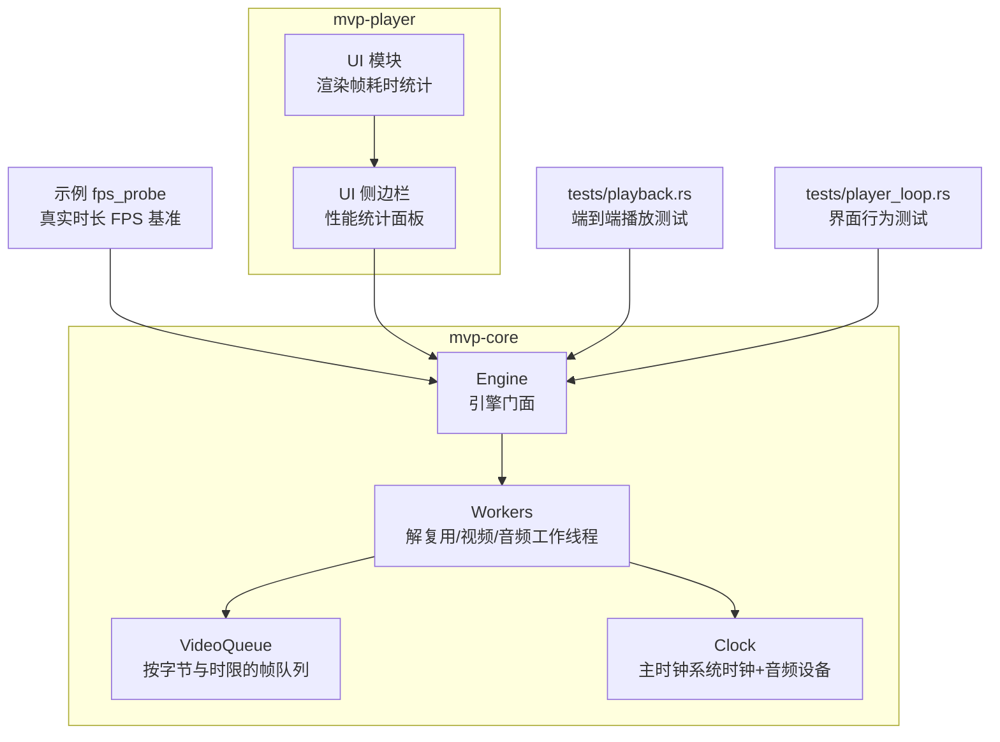
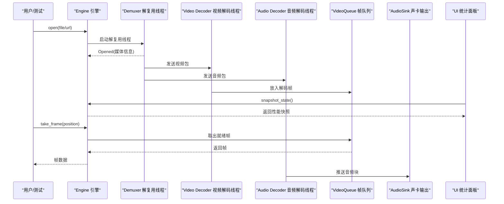
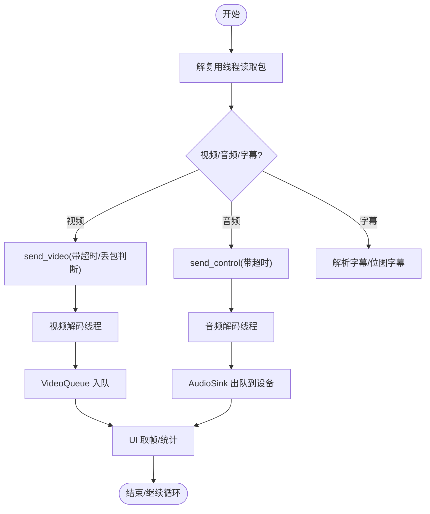
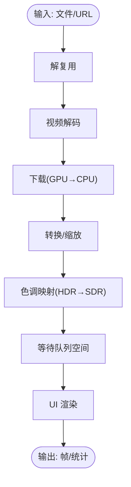
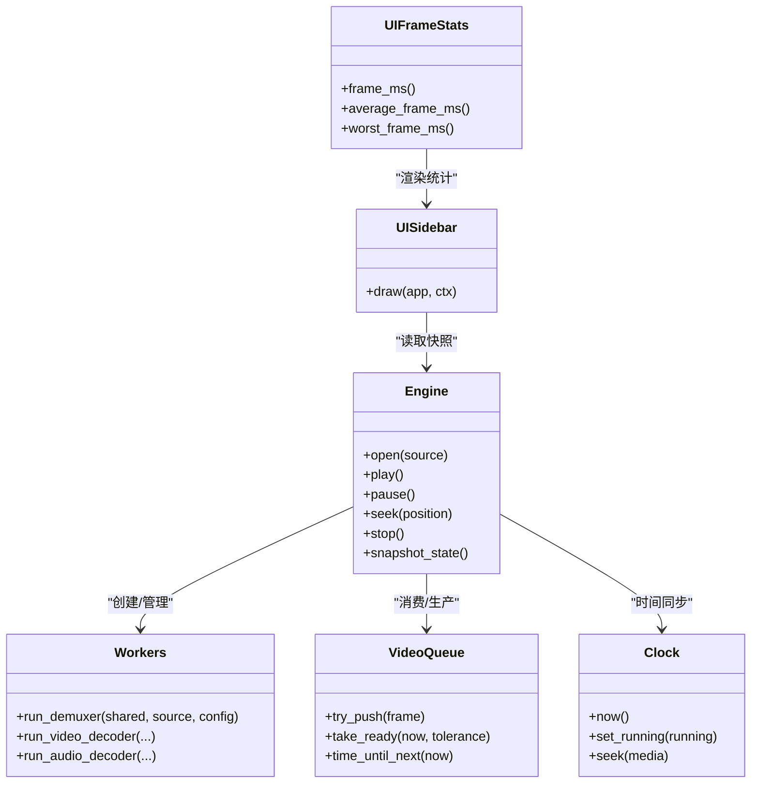

# 性能测试

<cite>
**本文引用的文件**   
- [README.md](file://README.md)
- [fps_probe.rs](file://crates/mvp-core/examples/fps_probe.rs)
- [playback.rs](file://crates/mvp-core/tests/playback.rs)
- [player_loop.rs](file://crates/mvp-core/tests/player_loop.rs)
- [workers.rs](file://crates/mvp-core/src/engine/workers.rs)
- [queue.rs](file://crates/mvp-core/src/engine/queue.rs)
- [clock.rs](file://crates/mvp-core/src/engine/clock.rs)
- [engine.rs](file://crates/mvp-core/src/engine.rs)
- [sidebar.rs](file://crates/mvp-player/src/ui/sidebar.rs)
- [mod.rs](file://crates/mvp-player/src/ui/mod.rs)
</cite>

## 目录
1. [引言](#引言)
2. [项目结构](#项目结构)
3. [核心组件](#核心组件)
4. [架构总览](#架构总览)
5. [详细组件分析](#详细组件分析)
6. [依赖关系分析](#依赖关系分析)
7. [性能考量](#性能考量)
8. [故障排查指南](#故障排查指南)
9. [结论](#结论)
10. [附录：工具与回归检测](#附录工具与回归检测)

## 引言
本文件面向 MVP-Versatile-Player 的性能测试与基准评估，覆盖以下目标：
- 播放性能基准：解码速度、帧率稳定性、内存泄漏检测。
- 多线程性能策略：解复用、视频解码、音频解码工作线程的监控与隔离。
- 延迟测试：从输入到渲染的整体延迟测量，以及各阶段延迟分解。
- 资源使用监控：CPU 占用率、内存增长、GPU 使用率的跟踪与分析。
- 长时间运行测试：验证播放器稳定性与内存管理能力。
- 性能回归检测机制：确保新代码不引入性能退化。
- 性能分析工具使用指南：perf、valgrind、Visual Studio Profiler 的配置与应用。

本项目采用“解复用 + 独立音视频解码 + 队列缓冲 + 系统时钟”的架构，并通过大量端到端与界面行为测试保障播放正确性与稳定性；同时提供实时统计面板与示例程序用于性能观测。

**章节来源**
- [README.md:315-357](file://README.md#L315-L357)
- [README.md:457-547](file://README.md#L457-L547)

## 项目结构
与性能相关的代码主要分布在以下位置：
- mvp-core：媒体引擎（FFmpeg 绑定、A/V 时钟、播放列表、图片查看器）
- mvp-player：egui 界面与应用程序（含性能统计面板）
- examples：性能探测示例（如 fps_probe）
- tests：端到端与界面行为测试（包含丢帧、时钟一致性、关闭耗时等）

**图表来源**
- [engine.rs:1-21](file://crates/mvp-core/src/engine.rs#L1-L21)
- [workers.rs:1-6](file://crates/mvp-core/src/engine/workers.rs#L1-L6)
- [queue.rs:1-10](file://crates/mvp-core/src/engine/queue.rs#L1-L10)
- [clock.rs:1-15](file://crates/mvp-core/src/engine/clock.rs#L1-L15)
- [sidebar.rs:775-831](file://crates/mvp-player/src/ui/sidebar.rs#L775-L831)
- [mod.rs:166-194](file://crates/mvp-player/src/ui/mod.rs#L166-L194)
- [fps_probe.rs:1-17](file://crates/mvp-core/examples/fps_probe.rs#L1-L17)

**章节来源**
- [README.md:315-323](file://README.md#L315-L323)

## 核心组件
- 引擎门面 Engine：封装生命周期、控制指令（打开、播放、暂停、跳转、停止）、状态快照与事件分发。
- 工作线程 Workers：解复用线程负责读取包并分发给视频/音频解码线程；所有入口捕获 panic，损坏文件不会拖垮播放器。
- 帧队列 VideoQueue：按字节预算与时间预算限制，避免高码率/高分辨率导致内存暴涨；拒绝旧帧被丢弃导致的“未来时间戳冻结”。
- 主时钟 Clock：以系统时钟为主，音频设备为参考，保证 A/V 同步与稳定推进。
- UI 统计面板：展示解码帧数、丢帧、队列深度、音频欠载、启动耗时、下载/转换/色调映射/等待队列耗时等。

关键设计要点：
- 音视频分别解码，慢视频不会饿死声卡。
- 控制指令不走包队列，避免阻塞。
- 队列按字节设上限，而非仅按帧数。
- 主时钟是系统时钟，避免驱动计数不准导致画面狂奔或冻结。
- 像素只拷贝一次，零拷贝交给 GPU。
- 每个工作线程捕获 panic，错误转为可恢复状态。

**章节来源**
- [engine.rs:1-21](file://crates/mvp-core/src/engine.rs#L1-L21)
- [workers.rs:1-6](file://crates/mvp-core/src/engine/workers.rs#L1-L6)
- [queue.rs:67-100](file://crates/mvp-core/src/engine/queue.rs#L67-L100)
- [clock.rs:1-15](file://crates/mvp-core/src/engine/clock.rs#L1-L15)
- [README.md:325-357](file://README.md#L325-L357)

## 架构总览
下图展示了从输入到渲染的关键路径与性能观测点：

**图表来源**
- [engine.rs:1-21](file://crates/mvp-core/src/engine.rs#L1-L21)
- [workers.rs:281-417](file://crates/mvp-core/src/engine/workers.rs#L281-L417)
- [queue.rs:180-246](file://crates/mvp-core/src/engine/queue.rs#L180-L246)
- [sidebar.rs:775-831](file://crates/mvp-player/src/ui/sidebar.rs#L775-L831)

## 详细组件分析

### 播放性能基准测试
- 实时 FPS 基准：示例 fps_probe 模拟界面取帧节奏，按屏幕刷新周期拉取帧，打印管线计数器（解码帧、丢帧、呈现丢弃、跳过帧、下载/转换/色调映射/等待队列耗时）。
- 端到端播放测试：playback.rs 对真实媒体进行打开、解码、跳转、停止等流程，断言分辨率、时间戳单调、画面非空、截图合法 PNG、损坏文件不崩溃。
- 界面行为测试：player_loop.rs 复现 PlayerApp::update 的真实调用顺序，验证在启用音频设备时的帧产出、队列填充后画面不冻结、音频持续到达设备、关闭时快速释放工作线程。

建议的基准指标：
- 平均/中位/尾延迟：下载、转换、色调映射、队列等待。
- 实际呈现帧率 vs 源帧率。
- 丢帧与呈现丢弃的比例。
- 音频队列长度与欠载次数。
- 关闭耗时（暂停/播放状态下）。

**章节来源**
- [fps_probe.rs:1-17](file://crates/mvp-core/examples/fps_probe.rs#L1-L17)
- [fps_probe.rs:82-177](file://crates/mvp-core/examples/fps_probe.rs#L82-L177)
- [playback.rs:1-10](file://crates/mvp-core/tests/playback.rs#L1-L10)
- [playback.rs:148-197](file://crates/mvp-core/tests/playback.rs#L148-L197)
- [player_loop.rs:35-90](file://crates/mvp-core/tests/player_loop.rs#L35-L90)
- [player_loop.rs:92-140](file://crates/mvp-core/tests/player_loop.rs#L92-L140)
- [player_loop.rs:584-653](file://crates/mvp-core/tests/player_loop.rs#L584-L653)

### 多线程性能测试策略
- 解复用线程：负责读取包、选择轨道、分发至视频/音频解码线程；对网络流设置超时与重连参数；对 RTSP 使用 TCP；中断回调避免自死锁。
- 视频解码线程：将解码帧放入 VideoQueue；当队列落后于时钟时丢弃包以避免进一步滞后。
- 音频解码线程：通过 AudioSink 推送到 cpal 设备；保持背压，暂停时关闭设备避免阻塞。
- 控制指令走共享状态，不走包通道，避免被积压包阻塞。

监控点：
- 解复用吞吐与丢包。
- 视频解码耗时与队列等待。
- 音频设备欠载与队列长度。
- 线程退出时间与清理开销。

**图表来源**
- [workers.rs:201-279](file://crates/mvp-core/src/engine/workers.rs#L201-L279)
- [workers.rs:281-417](file://crates/mvp-core/src/engine/workers.rs#L281-L417)
- [queue.rs:180-246](file://crates/mvp-core/src/engine/queue.rs#L180-L246)

**章节来源**
- [workers.rs:201-279](file://crates/mvp-core/src/engine/workers.rs#L201-L279)
- [workers.rs:281-417](file://crates/mvp-core/src/engine/workers.rs#L281-L417)

### 延迟测试与分解
- 整体延迟：从输入（文件/URL）到渲染（UI 显示）的全链路延迟，可通过 fps_probe 的 t=… 与 pos=… 观察媒体推进与实际呈现的关系。
- 阶段延迟分解：
  - 下载（download_ms）：硬件帧从显存拷贝到 CPU。
  - 转换（convert_ms）：色彩转换与缩放。
  - 色调映射（tone_map_ms）：HDR→SDR 映射部分。
  - 队列等待（queue_wait_ms）：解码器等待帧队列空间的时间。
- 时钟来源：UI 侧边栏显示“音频设备”或“系统时钟”，帮助判断 A/V 同步与漂移。

**图表来源**
- [engine.rs:289-308](file://crates/mvp-core/src/engine.rs#L289-L308)
- [sidebar.rs:816-831](file://crates/mvp-player/src/ui/sidebar.rs#L816-L831)

**章节来源**
- [engine.rs:289-308](file://crates/mvp-core/src/engine.rs#L289-L308)
- [sidebar.rs:816-831](file://crates/mvp-player/src/ui/sidebar.rs#L816-L831)

### 资源使用监控
- CPU 占用率：通过 UI 模块记录的渲染半程耗时（last/average/worst frame ms）与慢帧阈值（100ms）辅助定位瓶颈。
- 内存增长：VideoQueue 按字节预算限制，避免 4K RGBA 帧导致内存暴涨；FramePool 管理缓冲区池。
- GPU 使用率：下载与转换阶段的耗时反映 GPU/CPU 带宽压力；色调映射在 CPU 近似实现，4K 下可能成为热点。

实践建议：
- 使用任务管理器/性能监视器记录 CPU/GPU/内存曲线。
- 结合 snapshot_state 的 download_ms/convert_ms/tone_map_ms/queue_wait_ms 定位热点。
- 关注 dropped_frames/presentation_drops/skipped_frames 比例，区分“解码跟不上”和“屏幕不需要这么多帧”。

**章节来源**
- [mod.rs:166-194](file://crates/mvp-player/src/ui/mod.rs#L166-L194)
- [queue.rs:67-100](file://crates/mvp-core/src/engine/queue.rs#L67-L100)
- [engine.rs:289-308](file://crates/mvp-core/src/engine.rs#L289-L308)

### 长时间运行测试与稳定性
- 端到端测试覆盖打开→解码→跳转→停止全流程，断言时间戳单调、位置不超过媒体结尾、重复播放回到开头。
- 界面行为测试验证：
  - 队列填满后画面不冻结。
  - 音频持续到达设备且欠载次数低。
  - 频繁切换播放/暂停与跳转的安全性。
  - 关闭时快速释放工作线程（暂停/播放两种场景均 < 300ms）。

建议扩展：
- 增加长时间循环播放（例如 1–2 小时），监控内存增长与丢帧趋势。
- 加入随机跳转风暴（seek storm）与网络抖动模拟。
- 记录日志轮转与异常恢复能力。

**章节来源**
- [playback.rs:498-589](file://crates/mvp-core/tests/playback.rs#L498-L589)
- [player_loop.rs:92-140](file://crates/mvp-core/tests/player_loop.rs#L92-L140)
- [player_loop.rs:142-191](file://crates/mvp-core/tests/player_loop.rs#L142-L191)
- [player_loop.rs:232-262](file://crates/mvp-core/tests/player_loop.rs#L232-L262)
- [player_loop.rs:584-653](file://crates/mvp-core/tests/player_loop.rs#L584-L653)

## 依赖关系分析
- Engine 依赖 workers（解复用/解码）、queue（帧队列）、clock（主时钟）、audio（声卡输出）。
- UI 通过 EngineSnapshot 获取性能指标，渲染半程耗时由 UI 模块维护。
- 示例 fps_probe 直接驱动 Engine，模拟界面取帧节奏。

**图表来源**
- [engine.rs:529-661](file://crates/mvp-core/src/engine.rs#L529-L661)
- [workers.rs:134-146](file://crates/mvp-core/src/engine/workers.rs#L134-L146)
- [queue.rs:74-100](file://crates/mvp-core/src/engine/queue.rs#L74-L100)
- [clock.rs:44-126](file://crates/mvp-core/src/engine/clock.rs#L44-L126)
- [sidebar.rs:14-64](file://crates/mvp-player/src/ui/sidebar.rs#L14-L64)
- [mod.rs:166-194](file://crates/mvp-player/src/ui/mod.rs#L166-L194)

**章节来源**
- [engine.rs:529-661](file://crates/mvp-core/src/engine.rs#L529-L661)
- [workers.rs:134-146](file://crates/mvp-core/src/engine/workers.rs#L134-L146)
- [queue.rs:74-100](file://crates/mvp-core/src/engine/queue.rs#L74-L100)
- [clock.rs:44-126](file://crates/mvp-core/src/engine/clock.rs#L44-L126)
- [sidebar.rs:14-64](file://crates/mvp-player/src/ui/sidebar.rs#L14-L64)
- [mod.rs:166-194](file://crates/mvp-player/src/ui/mod.rs#L166-L194)

## 性能考量
- 解码速度与帧率稳定性：
  - 使用 fps_probe 在发布构建下运行，比较软件/硬件解码路径。
  - 关注 presented fps 与 ticks Hz 的差异，识别掉帧与屏幕刷新不同步。
- 内存管理：
  - VideoQueue 的字节预算与时间预算共同约束内存与延迟。
  - FramePool 减少分配与拷贝。
- 渲染路径：
  - 下载/转换/色调映射/队列等待四段耗时用于定位瓶颈。
  - UI 渲染半程耗时（last/average/worst）用于发现界面卡顿。
- 音频路径：
  - 音频队列长度与欠载次数用于判断是否饥饿。
  - 暂停时关闭设备避免阻塞。

[本节为通用指导，不直接分析具体文件]

## 故障排查指南
- 画面冻结：
  - 检查 dropped_frames/presentation_drops/skipped_frames 比例。
  - 确认 VideoQueue 是否因时间预算不足而拒绝入队。
- 声音断续：
  - 检查 audio_queue_seconds 与 underruns。
  - 确认设备回调是否正常运行（暂停时不应阻塞）。
- 关闭缓慢：
  - 确认 stop 流程是否先置 abort、唤醒视频线程、关闭声卡，再 join 线程。
- 跳转异常：
  - 检查 seek_request 与 flush 机制，避免自死锁。
  - 确认 handle_eof 与 ended 标志的正确性。

**章节来源**
- [workers.rs:474-535](file://crates/mvp-core/src/engine/workers.rs#L474-L535)
- [workers.rs:689-793](file://crates/mvp-core/src/engine/workers.rs#L689-L793)
- [engine.rs:627-661](file://crates/mvp-core/src/engine.rs#L627-L661)
- [queue.rs:180-246](file://crates/mvp-core/src/engine/queue.rs#L180-L246)

## 结论
MVP-Versatile-Player 通过解复用与音视频独立解码、按字节与时限的帧队列、系统时钟为主的主时钟，构建了稳定高效的播放管线。配合丰富的端到端与界面行为测试，以及实时统计面板与示例程序，能够全面评估与监控播放性能。建议在 CI 中加入自动化基准与回归检测，并结合系统级性能工具进行深度分析。

[本节为总结，不直接分析具体文件]

## 附录：工具与回归检测

### 性能分析工具使用指南
- perf（Linux）：
  - 采集火焰图：perf record -g -- ./target/release/mvp-versatile-player
  - 分析热点：perf report --sort=dso,symbol
- valgrind（Linux/Mac）：
  - 内存泄漏检测：valgrind --leak-check=full --show-leak-kinds=all ./target/debug/mvp-versatile-player
  - 性能分析：valgrind --tool=callgrind ./target/debug/mvp-versatile-player && kcachegrind callgrind.out.*
- Visual Studio Profiler（Windows）：
  - 使用“性能探查器”附加到进程，采集 CPU 采样、GPU 使用率、内存分配。
  - 对比发布构建与调试构建，关注下载/转换/色调映射阶段。

[本节为通用指导，不直接分析具体文件]

### 性能回归检测机制
- 基准用例：
  - 固定媒体样本（如 UHD120.mp4），在 fps_probe 下运行 N 次，记录平均/中位/尾延迟与 FPS。
  - 断言阈值：download_ms/convert_ms/tone_map_ms/queue_wait_ms 的上限。
- 自动化：
  - 在 CI 中运行 cargo test --workspace，并执行自定义基准脚本。
  - 对比历史基线，若超过阈值则失败。
- 长期监控：
  - 记录每次运行的 snapshot_state 指标，绘制趋势图。
  - 监控内存增长曲线，防止泄漏。

**章节来源**
- [fps_probe.rs:1-17](file://crates/mvp-core/examples/fps_probe.rs#L1-L17)
- [fps_probe.rs:82-177](file://crates/mvp-core/examples/fps_probe.rs#L82-L177)
- [README.md:457-547](file://README.md#L457-L547)