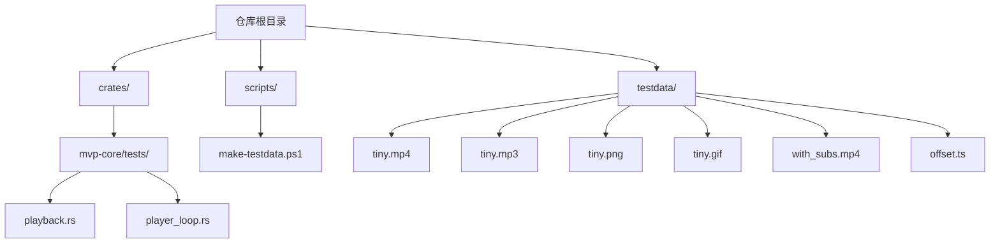
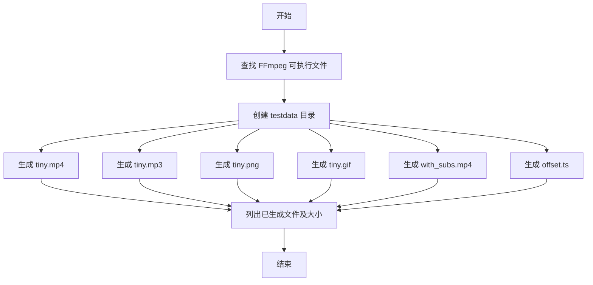
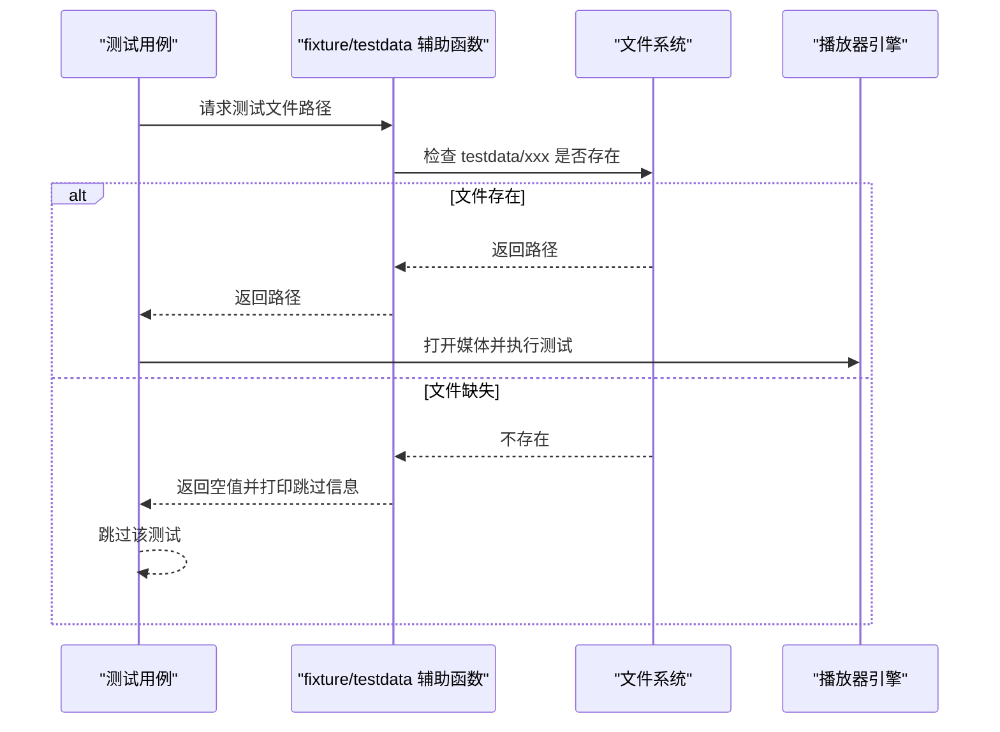
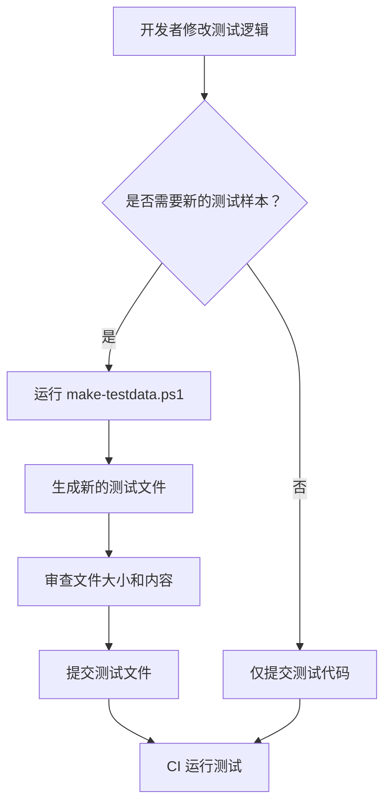
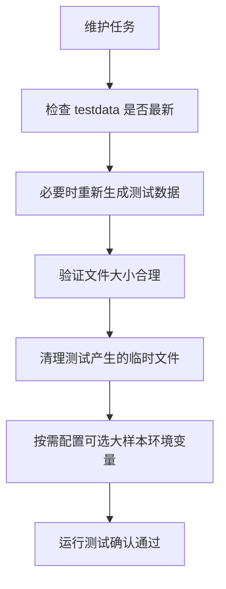

# 测试数据管理

<cite>
**本文引用的文件**   
- [scripts/make-testdata.ps1](file://scripts/make-testdata.ps1)
- [README.md](file://README.md)
- [crates/mvp-core/tests/playback.rs](file://crates/mvp-core/tests/playback.rs)
- [crates/mvp-core/tests/player_loop.rs](file://crates/mvp-core/tests/player_loop.rs)
</cite>

## 目录
1. [简介](#简介)
2. [项目结构与测试数据位置](#项目结构与测试数据位置)
3. [测试数据生成脚本](#测试数据生成脚本)
4. [测试数据分类与用途](#测试数据分类与用途)
5. [测试数据在测试中的使用方式](#测试数据在测试中的使用方式)
6. [版本控制策略](#版本控制策略)
7. [新增测试数据的指导原则](#新增测试数据的指导原则)
8. [清理与维护策略](#清理与维护策略)
9. [常见问题排查](#常见问题排查)
10. [结论](#结论)

## 简介
本文件面向维护者和贡献者，说明 `testdata` 目录下测试媒体的组织结构、生成方式、使用规范以及版本控制和维护流程。该项目的端到端播放测试依赖一组体积很小的媒体素材；这些素材由 PowerShell 脚本生成，并建议提交到仓库中，以便新克隆的仓库可以直接运行测试，而不必每次安装 FFmpeg。

## 项目结构与测试数据位置
测试数据位于仓库根目录下的 `testdata` 目录。测试代码通过相对路径解析出该目录，并在文件缺失时跳过相关测试，而不是直接失败。

**图表来源**  
- [scripts/make-testdata.ps1:1-79](file://scripts/make-testdata.ps1#L1-L79)
- [crates/mvp-core/tests/playback.rs:16-35](file://crates/mvp-core/tests/playback.rs#L16-L35)
- [crates/mvp-core/tests/player_loop.rs:16-22](file://crates/mvp-core/tests/player_loop.rs#L16-L22)

**章节来源**  
- [scripts/make-testdata.ps1:1-79](file://scripts/make-testdata.ps1#L1-L79)
- [crates/mvp-core/tests/playback.rs:16-35](file://crates/mvp-core/tests/playback.rs#L16-L35)
- [crates/mvp-core/tests/player_loop.rs:16-22](file://crates/mvp-core/tests/player_loop.rs#L16-L22)

## 测试数据生成脚本
`scripts/make-testdata.ps1` 是测试素材的唯一权威生成入口。它的主要职责包括：

- 定位 FFmpeg 可执行文件：优先使用参数传入的路径，否则尝试从系统命令查找。
- 创建或复用 `testdata` 目录。
- 调用 FFmpeg 生成多种格式、分辨率和编码的测试文件。
- 输出每个文件的名称和大小，便于确认生成结果。
- 在 FFmpeg 失败时抛出错误，避免留下半截文件。

### 脚本参数
| 参数 | 类型 | 默认值 | 说明 |
|---|---|---|---|
| `-Ffmpeg` | 字符串 | 脚本内硬编码的 FFmpeg 路径 | 指定 FFmpeg 可执行文件路径；若不存在则回退到系统 PATH 中的 `ffmpeg.exe` |

### 生成的测试文件
| 文件名 | 类型 | 主要特征 | 用途 |
|---|---|---|---|
| `tiny.mp4` | 视频容器 | H.264 + AAC，3 秒，320×240，25 fps | 基本播放、解码帧、跳转、暂停恢复、结束重播等核心播放测试 |
| `tiny.mp3` | 音频文件 | MP3，约 2 秒 | 纯音频打开、无视频流场景 |
| `tiny.png` | 静态图像 | PNG，320×240 | 图像处理、图片几何、缩放旋转测试 |
| `tiny.gif` | 动画图像 | GIF，循环动画，64×64 | 动画帧保留、动画时长检测 |
| `with_subs.mp4` | 带字幕的视频 | 含内嵌文本字幕轨道 | 内嵌字幕探测、自动选择、时间轴匹配 |
| `offset.ts` | MPEG-TS 容器 | 时间轴从 4200 秒开始 | 非零起始时间的跳转、容器时间与播放时间换算 |

### 生成流程概览

**图表来源**  
- [scripts/make-testdata.ps1:16-28](file://scripts/make-testdata.ps1#L16-L28)
- [scripts/make-testdata.ps1:31-74](file://scripts/make-testdata.ps1#L31-L74)
- [scripts/make-testdata.ps1:76-79](file://scripts/make-testdata.ps1#L76-L79)

**章节来源**  
- [scripts/make-testdata.ps1:1-79](file://scripts/make-testdata.ps1#L1-L79)

## 测试数据分类与用途
测试数据按媒体类型和功能目标分为以下几类：

### 基础播放测试
- `tiny.mp4` 是最核心的测试素材，用于验证：
  - 打开媒体并探测音视频流信息
  - 解码帧尺寸、像素数据和 PTS 时间戳
  - 跳转是否落在预期范围
  - 暂停后时钟冻结、播放后时钟恢复
  - 播放结束后再次播放是否从头重播
  - 显示位置不会超过媒体时长
  - 停止后引擎回到空闲状态

**章节来源**  
- [crates/mvp-core/tests/playback.rs:77-103](file://crates/mvp-core/tests/playback.rs#L77-L103)
- [crates/mvp-core/tests/playback.rs:148-197](file://crates/mvp-core/tests/playback.rs#L148-L197)
- [crates/mvp-core/tests/playback.rs:199-236](file://crates/mvp-core/tests/playback.rs#L199-L236)
- [crates/mvp-core/tests/playback.rs:324-354](file://crates/mvp-core/tests/playback.rs#L324-L354)
- [crates/mvp-core/tests/playback.rs:498-512](file://crates/mvp-core/tests/playback.rs#L498-L512)
- [crates/mvp-core/tests/playback.rs:520-589](file://crates/mvp-core/tests/playback.rs#L520-L589)
- [crates/mvp-core/tests/playback.rs:598-641](file://crates/mvp-core/tests/playback.rs#L598-L641)

### 音频测试
- `tiny.mp3` 用于验证纯音频文件可以正常打开，且没有视频流。

**章节来源**  
- [crates/mvp-core/tests/playback.rs:643-655](file://crates/mvp-core/tests/playback.rs#L643-L655)

### 图像处理测试
- `tiny.png` 用于验证静态图像的加载、几何尺寸、帧数、格式信息和图像视图的缩放、旋转、翻转操作。

**章节来源**  
- [crates/mvp-core/tests/playback.rs:705-717](file://crates/mvp-core/tests/playback.rs#L705-L717)
- [crates/mvp-core/tests/playback.rs:737-757](file://crates/mvp-core/tests/playback.rs#L737-L757)

### 动画图像测试
- `tiny.gif` 用于验证 GIF 动画的多帧保留、动画标志位和动画时长。

**章节来源**  
- [crates/mvp-core/tests/playback.rs:719-735](file://crates/mvp-core/tests/playback.rs#L719-L735)

### 字幕测试
- `with_subs.mp4` 用于验证内嵌文本字幕的探测、默认字幕轨道选择和按时间查询。

**章节来源**  
- [crates/mvp-core/tests/playback.rs:392-445](file://crates/mvp-core/tests/playback.rs#L392-L445)
- [crates/mvp-core/tests/playback.rs:447-496](file://crates/mvp-core/tests/playback.rs#L447-L496)

### 边界情况测试
- `offset.ts` 用于验证时间轴不从 0 开始的容器（类似蓝光传输流）仍能正确跳转，并且播放器不会把容器时间误当作播放时间。

**章节来源**  
- [crates/mvp-core/tests/playback.rs:238-322](file://crates/mvp-core/tests/playback.rs#L238-L322)

## 测试数据在测试中的使用方式
测试代码通过统一的辅助函数读取 `testdata` 目录下的文件。如果文件不存在，测试会打印跳过信息并返回，而不是直接失败。这保证了即使没有预先生成测试数据，测试套件也能以“绿色”方式运行。

### 测试数据路径解析
测试代码将 `CARGO_MANIFEST_DIR` 向上回溯两级，再进入 `testdata` 目录，从而获得绝对路径。

**图表来源**  
- [crates/mvp-core/tests/playback.rs:16-35](file://crates/mvp-core/tests/playback.rs#L16-L35)
- [crates/mvp-core/tests/player_loop.rs:16-22](file://crates/mvp-core/tests/player_loop.rs#L16-L22)

**章节来源**  
- [crates/mvp-core/tests/playback.rs:16-35](file://crates/mvp-core/tests/playback.rs#L16-L35)
- [crates/mvp-core/tests/player_loop.rs:16-22](file://crates/mvp-core/tests/player_loop.rs#L16-L22)

## 版本控制策略
测试数据采用“二进制小样本入库”的策略：

- 测试素材被刻意保持很小，总大小只有几百 KB，适合直接提交到 Git。
- 这样 `cargo test` 在刚克隆的仓库中就能运行，无需本地安装 FFmpeg。
- 只有在测试素材本身需要变更时才重新运行生成脚本。
- README 明确说明 `testdata/` 中的媒体文件由 `scripts/make-testdata.ps1` 生成，缺少文件时相关测试会跳过而不是失败。

**图表来源**  
- [README.md:497-502](file://README.md#L497-L502)
- [scripts/make-testdata.ps1:1-7](file://scripts/make-testdata.ps1#L1-L7)

**章节来源**  
- [README.md:497-502](file://README.md#L497-L502)
- [scripts/make-testdata.ps1:1-7](file://scripts/make-testdata.ps1#L1-L7)

## 新增测试数据的指导原则
新增测试数据时应遵循以下原则：

### 文件大小限制
- 测试素材应保持很小，避免让仓库膨胀。
- 生成脚本注释明确指出文件“故意很小”，目的是让测试在干净环境中快速运行。
- 新增文件应评估是否真的需要作为固定样本提交；如果样本太大，应考虑通过环境变量引入外部样本，而不是放入仓库。

### 格式多样性要求
- 至少覆盖常见容器和编码组合，例如 MP4 + H.264 + AAC。
- 至少包含一种纯音频格式，例如 MP3。
- 至少包含一种静态图像格式，例如 PNG。
- 至少包含一种动画图像格式，例如 GIF。
- 如有必要，增加带字幕的容器，用于验证字幕探测和默认轨道行为。

### 边缘情况覆盖
- 非零起始时间的容器，例如 `offset.ts`，用于守住跳转和时间换算逻辑。
- 缺失文件、垃圾输入、损坏输入等异常路径，确保播放器不会崩溃。
- 长时间稳定播放、队列填满、反复切换播放状态等性能与稳定性场景。

### 新增步骤建议
1. 确定新增测试要覆盖的行为。
2. 判断是否需要新的媒体样本。
3. 如需新样本，修改 `scripts/make-testdata.ps1` 生成对应文件。
4. 运行脚本并检查输出文件大小。
5. 更新测试用例，使其引用新文件。
6. 提交测试代码和测试数据。
7. 在本地和 CI 环境运行测试，确认未出现回归。

**章节来源**  
- [scripts/make-testdata.ps1:1-7](file://scripts/make-testdata.ps1#L1-L7)
- [crates/mvp-core/tests/playback.rs:657-699](file://crates/mvp-core/tests/playback.rs#L657-L699)
- [crates/mvp-core/tests/player_loop.rs:92-140](file://crates/mvp-core/tests/player_loop.rs#L92-L140)
- [crates/mvp-core/tests/player_loop.rs:232-262](file://crates/mvp-core/tests/player_loop.rs#L232-L262)

## 清理与维护策略
为确保测试环境整洁一致，建议执行以下维护动作：

- **定期重新生成测试数据**：当 FFmpeg 版本、编码器行为或测试需求变化时，重新运行 `scripts/make-testdata.ps1`。
- **不要手动编辑二进制测试文件**：测试数据应由脚本生成，避免手工修改导致不可复现。
- **删除临时快照文件**：部分测试会在临时目录写入中间文件，例如截图测试会写入临时 PNG，测试完成后应清理。
- **区分可选大样本**：杜比视界等大样本不适合入库，应通过环境变量指向本地路径，并由测试根据环境变量决定是否运行。
- **保持测试跳过语义一致**：缺失测试数据时，测试应跳过而非失败，保证基础构建可用。

**图表来源**  
- [scripts/make-testdata.ps1:1-7](file://scripts/make-testdata.ps1#L1-L7)
- [crates/mvp-core/tests/playback.rs:367-389](file://crates/mvp-core/tests/playback.rs#L367-L389)
- [README.md:504-512](file://README.md#L504-L512)

**章节来源**  
- [scripts/make-testdata.ps1:1-7](file://scripts/make-testdata.ps1#L1-L7)
- [crates/mvp-core/tests/playback.rs:367-389](file://crates/mvp-core/tests/playback.rs#L367-L389)
- [README.md:504-512](file://README.md#L504-L512)

## 常见问题排查
| 问题 | 可能原因 | 处理建议 |
|---|---|---|
| 运行测试时报找不到 FFmpeg | 脚本参数中的 FFmpeg 路径无效，且系统 PATH 中也找不到 | 使用 `-Ffmpeg` 指定正确的 FFmpeg 路径，或将 FFmpeg 加入系统 PATH |
| 测试跳过并提示文件缺失 | `testdata` 目录中没有对应媒体文件 | 运行 `scripts/make-testdata.ps1` 生成测试数据 |
| 跳转测试失败 | 容器时间轴偏移或跳转实现回归 | 检查 `offset.ts` 是否由脚本生成，并确认播放器对容器起始时间的处理 |
| 图片测试失败 | PNG/GIF 文件损坏或未生成 | 重新生成测试数据，并检查图像尺寸和帧数是否符合预期 |
| 字幕测试失败 | 内嵌字幕轨道未被探测或默认轨道选择异常 | 检查 `with_subs.mp4` 是否包含文本字幕轨道，并确认默认轨道选择逻辑 |
| 大样本测试无法运行 | 杜比视界或 PGS 等外部样本未配置环境变量 | 按文档设置相应环境变量，或使用示例程序探测样本 |

**章节来源**  
- [scripts/make-testdata.ps1:16-28](file://scripts/make-testdata.ps1#L16-L28)
- [crates/mvp-core/tests/playback.rs:25-35](file://crates/mvp-core/tests/playback.rs#L25-L35)
- [crates/mvp-core/tests/playback.rs:238-322](file://crates/mvp-core/tests/playback.rs#L238-L322)
- [crates/mvp-core/tests/playback.rs:705-735](file://crates/mvp-core/tests/playback.rs#L705-L735)
- [crates/mvp-core/tests/playback.rs:392-496](file://crates/mvp-core/tests/playback.rs#L392-L496)
- [README.md:504-512](file://README.md#L504-L512)

## 结论
`testdata` 目录是本项目端到端测试的基础设施。它通过 `scripts/make-testdata.ps1` 生成一组体积小、覆盖面广的媒体样本，支撑播放、图像、动画、字幕和边界情况的测试。维护者应优先通过脚本生成测试数据，保持文件格式和尺寸的稳定性，并在新增测试需求时补充必要的边缘情况样本。对于过大或不适合入库的样本，应通过环境变量引入，而不是直接提交到仓库。