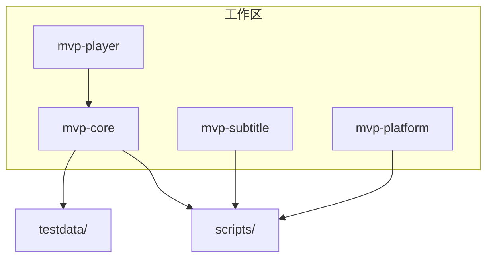
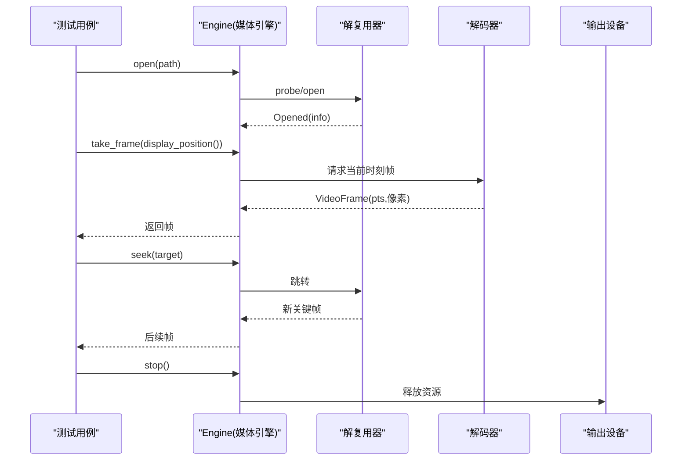
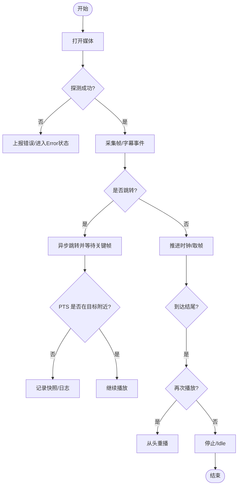
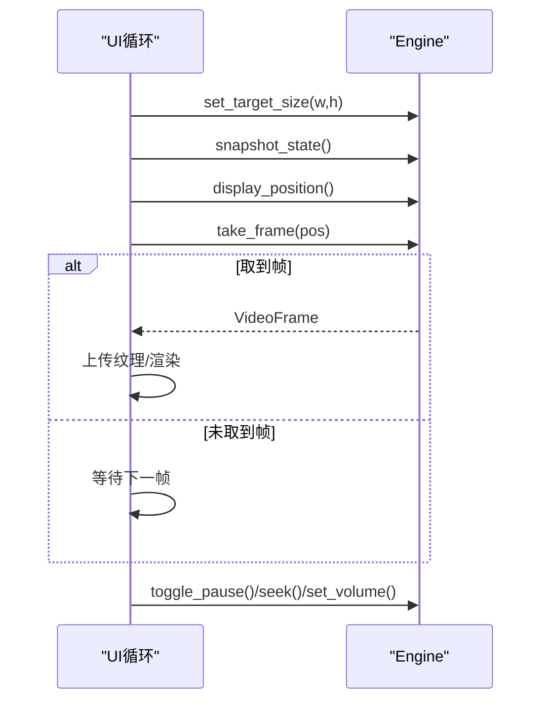
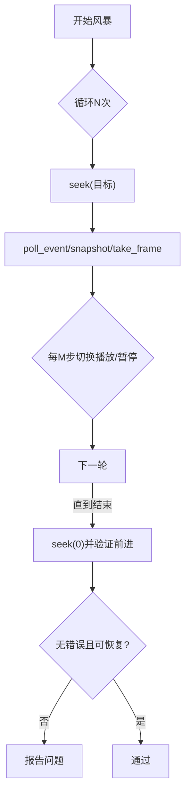
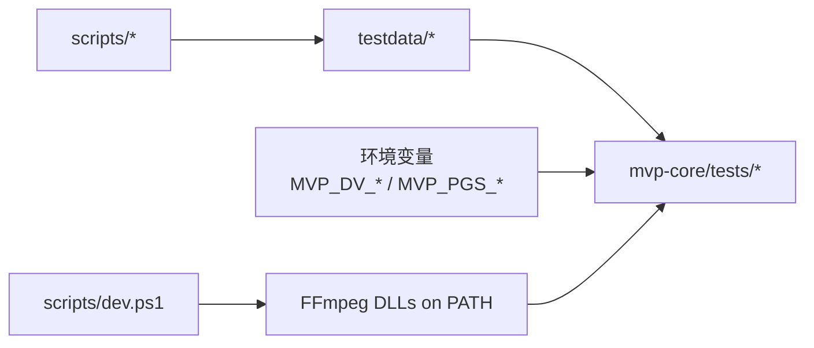

# 测试策略

<cite>
**本文引用的文件**
- [playback.rs](file://crates/mvp-core/tests/playback.rs)
- [player_loop.rs](file://crates/mvp-core/tests/player_loop.rs)
- [seek_storm.rs](file://crates/mvp-core/tests/seek_storm.rs)
- [dolby_vision.rs](file://crates/mvp-core/tests/dolby_vision.rs)
- [graphic_subtitle.rs](file://crates/mvp-core/tests/graphic_subtitle.rs)
- [acceptance.rs](file://crates/mvp-subtitle/tests/acceptance.rs)
- [public_api.rs](file://crates/mvp-platform/tests/public_api.rs)
- [registry_live.rs](file://crates/mvp-platform/tests/registry_live.rs)
- [make-testdata.ps1](file://scripts/make-testdata.ps1)
- [dev.ps1](file://scripts/dev.ps1)
- [Cargo.toml](file://Cargo.toml)
</cite>

## 目录
1. [简介](#简介)
2. [项目结构](#项目结构)
3. [核心组件](#核心组件)
4. [架构总览](#架构总览)
5. [详细组件分析](#详细组件分析)
6. [依赖关系分析](#依赖关系分析)
7. [性能考量](#性能考量)
8. [故障排查指南](#故障排查指南)
9. [结论](#结论)
10. [附录](#附录)

## 简介
本测试策略文档面向 MVP-Versatile-Player 的测试体系，覆盖单元测试、集成测试与端到端（E2E）测试的组织方式与执行方法；说明测试数据生成工具的使用；阐述播放测试（真实解码验证、时间戳单调性检查、跳转准确性）、界面行为测试（状态机驱动、用户交互模拟、性能指标验证）、字幕解析测试（多格式兼容、编码识别、时间轴处理）以及 Windows 集成测试（文件关联注册、系统 API 调用）。同时提供测试环境搭建、用例编写指南与持续集成建议。

## 项目结构
仓库采用 Cargo workspace 组织多个 crate：
- mvp-core：媒体引擎与图像/字幕基础能力，包含大量 E2E 与回归测试
- mvp-subtitle：字幕解析公共 API 及验收测试
- mvp-platform：Windows 平台能力（文件关联、单实例、电源、显示器等），包含编译期契约测试与可选的“活”注册表测试
- mvp-player：UI 应用（本策略聚焦其上层行为由 core 测试覆盖）

测试分布：
- crates/*/tests：跨 crate 的集成/E2E 测试
- crates/*/src 内联 #[cfg(test)]：单元级快速测试（如 vtt.rs 中的小模块测试）
- scripts：测试数据生成与开发环境准备脚本

图表来源
- [Cargo.toml:1-8](file://Cargo.toml#L1-L8)
- [make-testdata.ps1:1-79](file://scripts/make-testdata.ps1#L1-L79)

章节来源
- [Cargo.toml:1-78](file://Cargo.toml#L1-L78)

## 核心组件
- 端到端播放测试（mvp-core/tests）：以真实媒体样本驱动 Engine，验证打开、解码、时钟推进、暂停/播放、跳转、结束重播、位置上限、错误恢复、图片加载、内嵌字幕等
- 播放器循环测试（mvp-core/tests/player_loop.rs）：复现 UI 更新循环对 Engine 的调用顺序，验证帧队列、音频设备队列、音量/静音、停止释放等
- 极端场景测试（seek_storm.rs）：高频拖拽/跳转风暴下保持管线存活与可恢复
- HDR/Dolby Vision 测试（dolby_vision.rs）：可选运行，基于环境变量注入真实 DV 样本，校验探测、RPU、软硬解路径与跳转
- 图形字幕测试（graphic_subtitle.rs）：可选运行，基于环境变量注入 PGS/VobSub 样本，校验位图字幕解码与查找
- 字幕解析验收测试（mvp-subtitle/tests/acceptance.rs）：SRT/ASS/WebVTT 多格式、编码识别、BOM、半开区间、合并、偏移等
- 平台 API 契约测试（mvp-platform/tests/public_api.rs）：仅编译期签名稳定性的断言，不触碰系统
- Windows 注册表“活”测试（mvp-platform/tests/registry_live.rs）：标记为 ignore，显式执行，验证文件关联注册/注销与命令行构造

章节来源
- [playback.rs:1-771](file://crates/mvp-core/tests/playback.rs#L1-L771)
- [player_loop.rs:1-653](file://crates/mvp-core/tests/player_loop.rs#L1-L653)
- [seek_storm.rs:1-138](file://crates/mvp-core/tests/seek_storm.rs#L1-L138)
- [dolby_vision.rs:1-459](file://crates/mvp-core/tests/dolby_vision.rs#L1-L459)
- [graphic_subtitle.rs:1-78](file://crates/mvp-core/tests/graphic_subtitle.rs#L1-L78)
- [acceptance.rs:1-346](file://crates/mvp-subtitle/tests/acceptance.rs#L1-L346)
- [public_api.rs:1-150](file://crates/mvp-platform/tests/public_api.rs#L1-L150)
- [registry_live.rs:1-151](file://crates/mvp-platform/tests/registry_live.rs#L1-L151)

## 架构总览
测试分层与职责：
- 单元测试：位于源码内联模块，快速、无外部依赖，覆盖解析细节与纯函数逻辑
- 集成测试：跨模块协作，使用真实 FFmpeg 运行时与设备（音频/视频），验证管线行为
- 端到端测试：以真实媒体样本驱动 Engine，覆盖打开、解码、时钟、跳转、字幕、错误恢复
- 平台集成测试：Windows 注册表与系统 API 的行为验证（默认忽略，按需启用）

图表来源
- [playback.rs:48-75](file://crates/mvp-core/tests/playback.rs#L48-L75)
- [player_loop.rs:54-89](file://crates/mvp-core/tests/player_loop.rs#L54-L89)

## 详细组件分析

### 端到端播放测试（playback.rs）
- 真实解码验证：打开 tiny.mp4，采集若干帧，断言分辨率、像素大小、非黑帧、PTS 有限且递增
- 时间戳单调性：遍历相邻帧，断言 pts 非递减，并保证时钟推进
- 跳转准确性：在 2.0s 处跳转，等待关键帧后断言 PTS 落在合理区间；针对 offset.ts（容器起始时间远大于 0）验证跳转与时间轴转换
- 状态机：pause 冻结时钟，play 恢复；stop 回到 Idle；结束后 play 重播
- 字幕：内嵌文本字幕自动选择与按时间查询；关闭字幕后 cues 清空
- 图片：PNG/GIF 几何与动画帧完整性；ImageView 缩放/旋转/翻转/重置
- 健壮性：缺失文件上报错误而非 panic；垃圾输入不崩溃并可恢复

图表来源
- [playback.rs:77-103](file://crates/mvp-core/tests/playback.rs#L77-L103)
- [playback.rs:148-197](file://crates/mvp-core/tests/playback.rs#L148-L197)
- [playback.rs:199-236](file://crates/mvp-core/tests/playback.rs#L199-L236)
- [playback.rs:257-322](file://crates/mvp-core/tests/playback.rs#L257-L322)
- [playback.rs:324-354](file://crates/mvp-core/tests/playback.rs#L324-L354)
- [playback.rs:514-589](file://crates/mvp-core/tests/playback.rs#L514-L589)

章节来源
- [playback.rs:1-771](file://crates/mvp-core/tests/playback.rs#L1-L771)

### 播放器循环测试（player_loop.rs）
- 复现 UI update 序列：设置目标尺寸、snapshot_state、display_position、take_frame、toggle_pause
- 帧队列与纹理上传：确保每帧唯一所有权，避免静默放弃
- 队列填满后画面不冻结：预填充队列后仍能在窗口期内持续取到帧
- 音频设备可达性：设备队列长度与欠载次数阈值断言
- 禁用轨道不阻塞解复用：多种 subtitle/audio 组合均能解码出帧
- 频繁切换播放安全：反复 toggle_pause + 多次 seek
- 时钟一致性：稳态播放期间 display_position 与墙钟一致，丢帧/解码数在阈值内
- 播放中跳转保持时钟一致：多次跳转后仍能取到帧
- 目标尺寸收敛：根据源尺寸与视口计算稳定目标
- 移动游标不丢弃已解码帧：set_playhead 向后/向前步进
- 音量/静音生效：effective_gain 与 is_muted 与设备同步
- 停止及时释放：paused/playing 两种状态下 stop 耗时受限

图表来源
- [player_loop.rs:35-89](file://crates/mvp-core/tests/player_loop.rs#L35-L89)
- [player_loop.rs:92-140](file://crates/mvp-core/tests/player_loop.rs#L92-L140)
- [player_loop.rs:142-191](file://crates/mvp-core/tests/player_loop.rs#L142-L191)
- [player_loop.rs:193-230](file://crates/mvp-core/tests/player_loop.rs#L193-L230)
- [player_loop.rs:232-262](file://crates/mvp-core/tests/player_loop.rs#L232-L262)
- [player_loop.rs:264-339](file://crates/mvp-core/tests/player_loop.rs#L264-L339)
- [player_loop.rs:341-387](file://crates/mvp-core/tests/player_loop.rs#L341-L387)
- [player_loop.rs:389-430](file://crates/mvp-core/tests/player_loop.rs#L389-L430)
- [player_loop.rs:432-493](file://crates/mvp-core/tests/player_loop.rs#L432-L493)
- [player_loop.rs:495-582](file://crates/mvp-core/tests/player_loop.rs#L495-L582)
- [player_loop.rs:584-653](file://crates/mvp-core/tests/player_loop.rs#L584-L653)

章节来源
- [player_loop.rs:1-653](file://crates/mvp-core/tests/player_loop.rs#L1-L653)

### 极端场景：跳转风暴（seek_storm.rs）
- 高频 seek + 随机边界值（f64::MAX、NaN、负数）+ 交替 pause/play
- 断言风暴过程中无 Engine 错误事件或 Error 状态
- 风暴后仍可恢复：seek 回起点并前进，证明解复用器未被破坏

图表来源
- [seek_storm.rs:50-138](file://crates/mvp-core/tests/seek_storm.rs#L50-L138)

章节来源
- [seek_storm.rs:1-138](file://crates/mvp-core/tests/seek_storm.rs#L1-L138)

### HDR/Dolby Vision 测试（dolby_vision.rs）
- 可选运行：需设置 MVP_DV_SAMPLE 或 MVP_DV_DIR
- 探测：验证 base layer、HDR 类型、DOVI 记录
- RPU 读取：bit depth、色彩/映射信息、峰值亮度
- 软/硬解：分别验证解码出有效帧
- 跳转：在长片段上跳转并等待帧
- 批量扫描：对目录下所有媒体进行 probe/decode/seek，带看门狗区分 panic 与 hang

章节来源
- [dolby_vision.rs:1-459](file://crates/mvp-core/tests/dolby_vision.rs#L1-L459)

### 图形字幕测试（graphic_subtitle.rs）
- 可选运行：需设置 MVP_PGS_SAMPLE
- 检测外部图形字幕文件，解码为位图 cues，断言矩形索引平面与 RGBA 数据完整
- 按时间查找首个 cue 可用

章节来源
- [graphic_subtitle.rs:1-78](file://crates/mvp-core/tests/graphic_subtitle.rs#L1-L78)

### 字幕解析验收测试（acceptance.rs）
- 多格式：SRT（含点毫秒、缺小时字段）、ASS（Format 列重排、样式覆盖）、WebVTT（NOTE、标识符、align/start）
- 编码识别：GBK、UTF-8/UTF-16LE BOM 自动识别与解码
- 时间轴：半开区间 [start, end)、shift 延迟、merge_adjacent 合并邻近相同文本
- 鲁棒性：畸形输入不 panic，始终返回可用 Subtitle

章节来源
- [acceptance.rs:1-346](file://crates/mvp-subtitle/tests/acceptance.rs#L1-L346)

### 平台 API 契约测试（public_api.rs）
- 仅编译期断言：常量、re-export、函数签名、类型属性（Copy/Eq/Clone）
- 不执行任何系统调用，确保下游 crate 不受 API 变更影响

章节来源
- [public_api.rs:1-150](file://crates/mvp-platform/tests/public_api.rs#L1-L150)

### Windows 集成测试（registry_live.rs）
- 默认忽略：写入 HKCU\Software\Classes，需显式启用
- 验证：注册/注销往返、不窃取其他应用条目、每个扩展生成 ProgID、命令行引号正确、彻底清理
- 仅 Windows 平台编译

章节来源
- [registry_live.rs:1-151](file://crates/mvp-platform/tests/registry_live.rs#L1-L151)

## 依赖关系分析
- 测试依赖 FFmpeg 共享库：通过 dev.ps1 将 ffmpeg/bin 加入 PATH，并在首次运行时生成 .cargo/config.toml 指向本地 kit
- 测试数据：scripts/make-testdata.ps1 生成 tiny.mp4/mp3/png/gif、with_subs.mp4、offset.ts 等小样本
- 可选大样本：Dolby Vision/PGS 通过环境变量注入，避免仓库体积膨胀
- 日志：env_logger 用于调试卡顿/失败原因

图表来源
- [dev.ps1:1-71](file://scripts/dev.ps1#L1-L71)
- [make-testdata.ps1:1-79](file://scripts/make-testdata.ps1#L1-L79)
- [dolby_vision.rs:1-40](file://crates/mvp-core/tests/dolby_vision.rs#L1-L40)
- [graphic_subtitle.rs:1-31](file://crates/mvp-core/tests/graphic_subtitle.rs#L1-L31)

章节来源
- [dev.ps1:1-71](file://scripts/dev.ps1#L1-L71)
- [make-testdata.ps1:1-79](file://scripts/make-testdata.ps1#L1-L79)

## 性能考量
- 稳态播放时钟精度：display_position 与墙钟偏差在阈值内，丢帧/解码计数合理
- 音频设备队列与欠载：队列秒数下限与欠载次数上限保障声音连续性
- 停止响应：无论 paused/playing，stop 应在限定时间内释放 worker
- 跳转风暴：高频操作下管线存活与恢复，避免死锁/卡死
- 帧队列满后不冻结：预填充队列后仍能持续产出帧

章节来源
- [player_loop.rs:264-339](file://crates/mvp-core/tests/player_loop.rs#L264-L339)
- [player_loop.rs:142-191](file://crates/mvp-core/tests/player_loop.rs#L142-L191)
- [player_loop.rs:584-653](file://crates/mvp-core/tests/player_loop.rs#L584-L653)
- [seek_storm.rs:50-138](file://crates/mvp-core/tests/seek_storm.rs#L50-L138)

## 故障排查指南
- 缺少测试素材：若 testdata 缺失，测试会跳过并打印提示；重新运行 make-testdata.ps1 生成
- 无音频设备：相关测试会跳过；确认系统存在默认输出设备
- 卡顿/挂起：开启 env_logger 查看 Engine 内部解释；Dolby Vision 测试自带看门狗区分 panic/hang
- 跳转风暴后不可恢复：检查是否有未消费的 EngineEvent::Error 或 PlaybackState::Error
- 注册表测试：仅在 Windows 上以 --ignored 显式运行，并确保权限允许写入 HKCU

章节来源
- [playback.rs:25-35](file://crates/mvp-core/tests/playback.rs#L25-L35)
- [player_loop.rs:142-150](file://crates/mvp-core/tests/player_loop.rs#L142-L150)
- [dolby_vision.rs:78-113](file://crates/mvp-core/tests/dolby_vision.rs#L78-L113)
- [registry_live.rs:1-15](file://crates/mvp-platform/tests/registry_live.rs#L1-L15)

## 结论
该项目的测试体系以“真实媒体 + 真实设备”为核心，围绕 Engine 的端到端行为构建强回归保护；辅以字幕解析的纯函数验收测试与平台 API 的编译期契约测试，形成从底层到上层的完整质量闭环。通过可选的大样本与环境变量控制，兼顾了覆盖率与可移植性。建议在 CI 中默认运行轻量测试，并将可选测试作为独立 job 或手动触发。

## 附录

### 测试环境搭建
- 安装 FFmpeg 开发包并通过 setup-ffmpeg.ps1 配置本地 kit
- 使用 dev.ps1 运行 cargo 命令，自动将 ffmpeg/bin 加入 PATH
- 生成测试素材：运行 scripts/make-testdata.ps1

章节来源
- [dev.ps1:1-71](file://scripts/dev.ps1#L1-L71)
- [make-testdata.ps1:1-79](file://scripts/make-testdata.ps1#L1-L79)

### 测试用例编写指南
- 优先使用内联 #[cfg(test)] 模块进行快速单元验证
- 需要真实 FFmpeg/设备时，放在 crates/*/tests/ 下
- 测试名使用完整英文句子，便于定位意图
- 对可能失败的 I/O 或外部依赖，使用 fixture() 模式或环境变量开关，缺失时优雅跳过
- 对长时间运行的测试，使用超时/看门狗，避免卡死

章节来源
- [AGENTS.md:173-191](file://AGENTS.md#L173-L191)
- [playback.rs:16-35](file://crates/mvp-core/tests/playback.rs#L16-L35)
- [dolby_vision.rs:23-33](file://crates/mvp-core/tests/dolby_vision.rs#L23-L33)
- [graphic_subtitle.rs:21-31](file://crates/mvp-core/tests/graphic_subtitle.rs#L21-L31)

### 持续集成配置建议
- 默认任务：
  - 构建 workspace
  - 运行 crates/*/tests 下的常规测试（不含 ignore）
  - 生成并运行 make-testdata.ps1 后的 playback/player_loop/seek_storm/acceptance 等
- 可选任务（单独 job）：
  - 设置 MVP_DV_SAMPLE/MVP_DV_DIR 运行 dolby_vision 测试
  - 设置 MVP_PGS_SAMPLE 运行 graphic_subtitle 测试
  - Windows 专用：运行 registry_live 测试（--ignored --test-threads=1）
- 缓存：
  - 缓存 FFmpeg kit 与 cargo target，减少重复下载与编译
- 并行：
  - 按 crate 并行执行测试，缩短总时长

[本节为通用实践建议，不直接引用具体代码文件]