# 播放功能测试

<cite>
**本文引用的文件**   
- [scripts/make-testdata.ps1](file://scripts/make-testdata.ps1)
- [crates/mvp-core/tests/playback.rs](file://crates/mvp-core/tests/playback.rs)
- [crates/mvp-core/tests/player_loop.rs](file://crates/mvp-core/tests/player_loop.rs)
- [crates/mvp-core/tests/seek_storm.rs](file://crates/mvp-core/tests/seek_storm.rs)
- [crates/mvp-core/tests/dolby_vision.rs](file://crates/mvp-core/tests/dolby_vision.rs)
- [crates/mvp-core/tests/graphic_subtitle.rs](file://crates/mvp-core/tests/graphic_subtitle.rs)
- [README.md](file://README.md)
</cite>

## 目录
1. [引言](#引言)
2. [项目结构与测试范围](#项目结构与测试范围)
3. [端到端播放测试总览](#端到端播放测试总览)
4. [架构与数据流](#架构与数据流)
5. [详细测试场景说明](#详细测试场景说明)
6. [测试数据生成工具](#测试数据生成工具)
7. [错误处理与边界情况](#错误处理与边界情况)
8. [依赖关系分析](#依赖关系分析)
9. [性能与稳定性关注点](#性能与稳定性关注点)
10. [故障排查指南](#故障排查指南)
11. [结论](#结论)

## 引言
本文面向 MVP-Versatile-Player 的播放功能测试，重点覆盖以下目标：
- 端到端播放测试的实现方式。
- 真实媒体文件的解码验证、时间戳单调性检查、跳转准确性。
- 视频打开与流信息验证、自动播放行为控制、帧解码质量与时钟推进。
- 跳转精度测试，包括容器时间轴偏移的特殊情况。
- 暂停恢复、播放结束后重播逻辑。
- 音频文件单独播放测试。
- 图片查看器功能测试（缩放、旋转、翻转）。
- 测试数据生成工具 `scripts/make-testdata.ps1` 的使用方法。
- 缺失文件、垃圾输入、异常状态恢复等错误处理测试。

该项目的核心播放器位于 `crates/mvp-core`，测试集中在其 `tests` 目录下；界面层在 `crates/mvp-player`，但播放能力由引擎提供。测试文档以实际测试代码为依据，不臆造未实现的行为。

## 项目结构与测试范围
仓库采用多 crate 结构：
- `mvp-core`：FFmpeg 绑定、播放引擎、图片查看器、播放列表、HDR/Dolby Vision 支持。
- `mvp-platform`：Windows 集成（文件关联、单实例、电源等）。
- `mvp-subtitle`：字幕解析。
- `mvp-player`：egui 界面与应用主程序。

播放相关测试主要位于：
- `crates/mvp-core/tests/playback.rs`：端到端播放测试。
- `crates/mvp-core/tests/player_loop.rs`：模拟界面调用顺序的集成测试。
- `crates/mvp-core/tests/seek_storm.rs`：大量跳转风暴下的鲁棒性测试。
- `crates/mvp-core/tests/dolby_vision.rs`：杜比视界/HDR 可选测试。
- `crates/mvp-core/tests/graphic_subtitle.rs`：图形字幕可选测试。

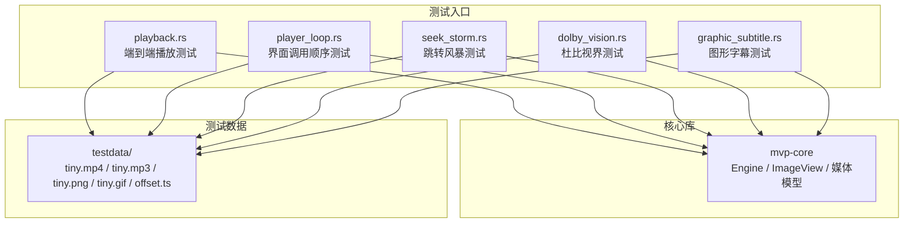

**图表来源**
- [crates/mvp-core/tests/playback.rs:1-20](file://crates/mvp-core/tests/playback.rs#L1-L20)
- [crates/mvp-core/tests/player_loop.rs:1-20](file://crates/mvp-core/tests/player_loop.rs#L1-L20)
- [crates/mvp-core/tests/seek_storm.rs:1-20](file://crates/mvp-core/tests/seek_storm.rs#L1-L20)
- [crates/mvp-core/tests/dolby_vision.rs:1-20](file://crates/mvp-core/tests/dolby_vision.rs#L1-L20)
- [crates/mvp-core/tests/graphic_subtitle.rs:1-20](file://crates/mvp-core/tests/graphic_subtitle.rs#L1-L20)

**章节来源**
- [README.md:315-358](file://README.md#L315-L358)
- [README.md:457-498](file://README.md#L457-L498)

## 端到端播放测试总览
端到端测试通过真实媒体文件驱动播放引擎，验证从打开、探测、解码、时钟推进到跳转、暂停、结束、重播的全链路行为。关键要点：
- 使用 `Engine::new(EngineConfig)` 创建引擎，可关闭音频设备以保证测试确定性。
- 使用 `MediaSource::Path` 打开本地文件。
- 等待 `EngineEvent::Opened` 事件获取媒体信息。
- 通过 `engine.take_frame(engine.display_position())` 拉取已到时帧。
- 断言分辨率、像素格式、帧大小、时间戳单调性、非空画面、跳转落点、暂停冻结、结束重播、错误状态等。

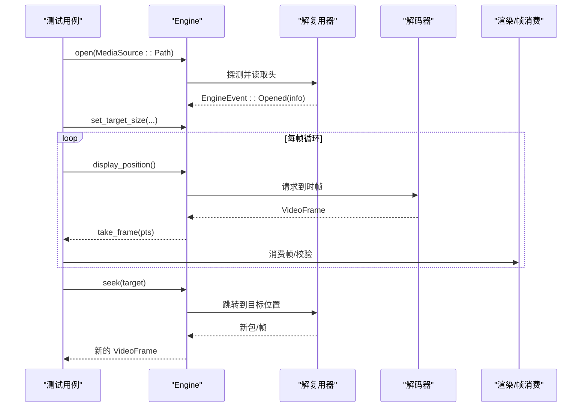

**图表来源**
- [crates/mvp-core/tests/playback.rs:48-75](file://crates/mvp-core/tests/playback.rs#L48-L75)
- [crates/mvp-core/tests/playback.rs:77-103](file://crates/mvp-core/tests/playback.rs#L77-L103)
- [crates/mvp-core/tests/playback.rs:148-197](file://crates/mvp-core/tests/playback.rs#L148-L197)
- [crates/mvp-core/tests/playback.rs:199-236](file://crates/mvp-core/tests/playback.rs#L199-L236)

**章节来源**
- [crates/mvp-core/tests/playback.rs:1-75](file://crates/mvp-core/tests/playback.rs#L1-L75)
- [crates/mvp-core/tests/playback.rs:77-103](file://crates/mvp-core/tests/playback.rs#L77-L103)

## 架构与数据流
播放管线遵循“解复用 → 音视频分别解码 → 帧队列/声卡输出”的设计：
- 解复用线程将包分发给视频解码器和音频解码器。
- 视频帧进入帧队列，按显示时间被界面消费。
- 音频数据送入 cpal 声卡。
- 控制指令（跳转、切换轨道）不走包队列，直接修改共享状态，避免过时指令堆积。
- 所有队列有字节数上限，防止大帧占用过多内存。
- 主时钟是系统时钟，保证单调性与稳定性。

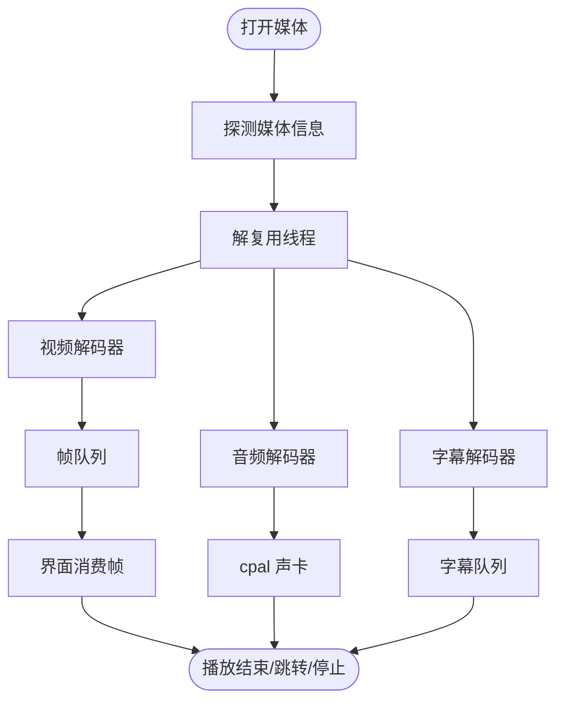

**图表来源**
- [README.md:325-358](file://README.md#L325-L358)

**章节来源**
- [README.md:325-358](file://README.md#L325-L358)

## 详细测试场景说明

### 视频文件打开与流信息验证
测试打开 `tiny.mp4`，等待 `Opened` 事件，断言：
- 视频流数量为 1，宽高为 320x240，编解码器包含 h264，像素格式非空，fps 接近 25。
- 音频流数量为 1，采样率与声道数合理。
- 时长大于 2 秒，文件大小大于 0，且不是静态图片。

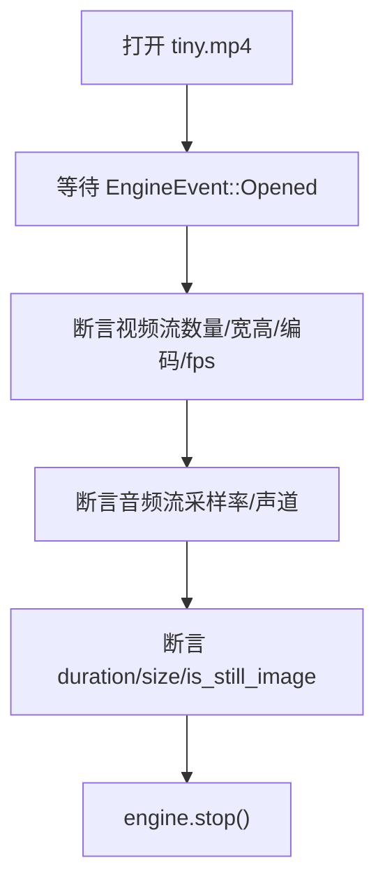

**图表来源**
- [crates/mvp-core/tests/playback.rs:77-103](file://crates/mvp-core/tests/playback.rs#L77-L103)

**章节来源**
- [crates/mvp-core/tests/playback.rs:77-103](file://crates/mvp-core/tests/playback.rs#L77-L103)

### 自动播放行为控制
测试 `autoplay` 开关对打开文件后初始状态的影响：
- 设置 `autoplay=false` 打开文件后，应处于 `Paused` 状态，但仍能探测到时长。
- 随后设置 `autoplay=true` 再次打开，应处于 `Playing` 状态，并能采集到至少一帧。

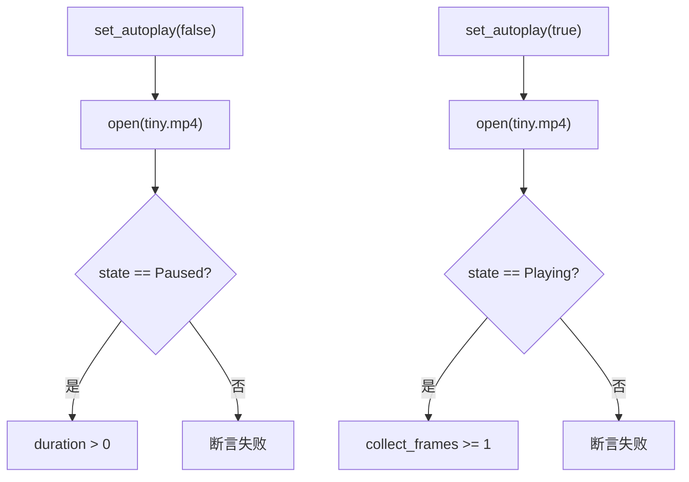

**图表来源**
- [crates/mvp-core/tests/playback.rs:105-146](file://crates/mvp-core/tests/playback.rs#L105-L146)

**章节来源**
- [crates/mvp-core/tests/playback.rs:105-146](file://crates/mvp-core/tests/playback.rs#L105-L146)

### 帧解码质量与时钟推进
测试解码帧的质量与时钟推进：
- 设置目标尺寸 320x240，打开文件，采集至少 6 帧。
- 每帧有效、宽高正确、数据长度符合 RGBA 布局。
- 时间戳单调非递减，最后一帧 pts > 0。
- 最后一帧非全黑，确保颜色转换正常。

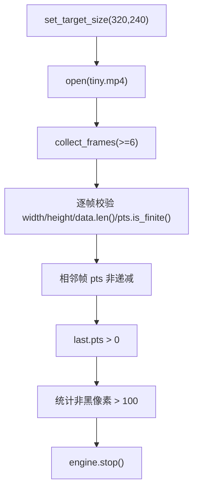

**图表来源**
- [crates/mvp-core/tests/playback.rs:148-197](file://crates/mvp-core/tests/playback.rs#L148-L197)

**章节来源**
- [crates/mvp-core/tests/playback.rs:148-197](file://crates/mvp-core/tests/playback.rs#L148-L197)

### 跳转准确性测试（含容器时间轴偏移）
普通跳转测试：
- 打开文件，先采集若干帧，再 `seek(2.0)`。
- 异步跳转后等待至少 3 帧到达，断言第一帧 pts 落在 `[0.8, 2.5]` 区间。

容器时间轴偏移测试：
- 使用 `offset.ts`，其 `start_time` 约 4200 秒。
- 打开文件后确认 `duration > 3.0` 且 `start_time > 3600.0`。
- 先采集帧，再 `seek(2.0)`，等待帧到达。
- 断言跳转后的帧 pts 不低于请求位置（考虑关键帧对齐），即 `(1.98..=info.duration)`。

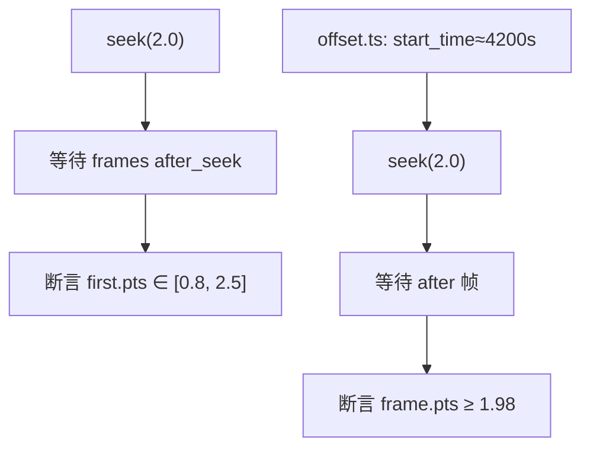

**图表来源**
- [crates/mvp-core/tests/playback.rs:199-236](file://crates/mvp-core/tests/playback.rs#L199-L236)
- [crates/mvp-core/tests/playback.rs:257-322](file://crates/mvp-core/tests/playback.rs#L257-L322)

**章节来源**
- [crates/mvp-core/tests/playback.rs:199-236](file://crates/mvp-core/tests/playback.rs#L199-L236)
- [crates/mvp-core/tests/playback.rs:257-322](file://crates/mvp-core/tests/playback.rs#L257-L322)

### 暂停恢复功能验证
- 打开文件，采集若干帧。
- 调用 `pause()`，断言状态为 `Paused`。
- 等待一段时间，断言 `position()` 基本不变。
- 调用 `play()`，断言状态为 `Playing`，且 `position()` 继续前进。

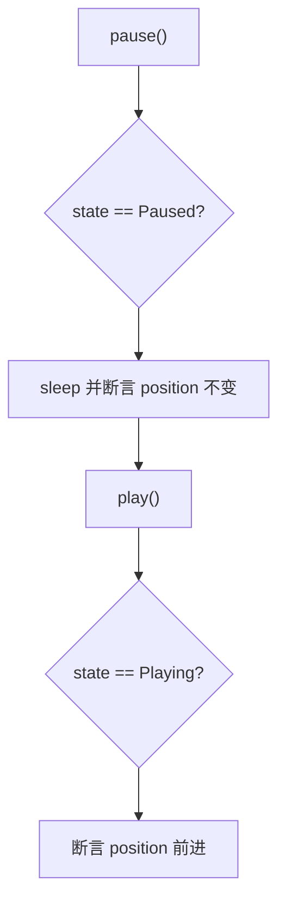

**图表来源**
- [crates/mvp-core/tests/playback.rs:324-354](file://crates/mvp-core/tests/playback.rs#L324-L354)

**章节来源**
- [crates/mvp-core/tests/playback.rs:324-354](file://crates/mvp-core/tests/playback.rs#L324-L354)

### 播放结束后的重播逻辑
- 运行文件至结束，断言状态为 `Ended`，且位置不超过 duration + 容差。
- 再次 `play()`，断言状态为 `Playing`，位置回到起始附近（< 1.0）。
- 再次采集帧，断言确实重新解码，且位置保持在 media 范围内。
- 第二次到达结尾后再 `play()`，同样应重播。

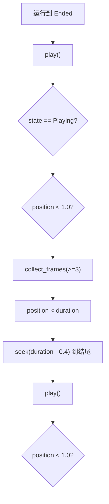

**图表来源**
- [crates/mvp-core/tests/playback.rs:514-589](file://crates/mvp-core/tests/playback.rs#L514-L589)

**章节来源**
- [crates/mvp-core/tests/playback.rs:514-589](file://crates/mvp-core/tests/playback.rs#L514-L589)

### 音频文件单独播放测试
- 打开 `tiny.mp3`，断言存在音频流、无视频流、`has_audio()` 为真。

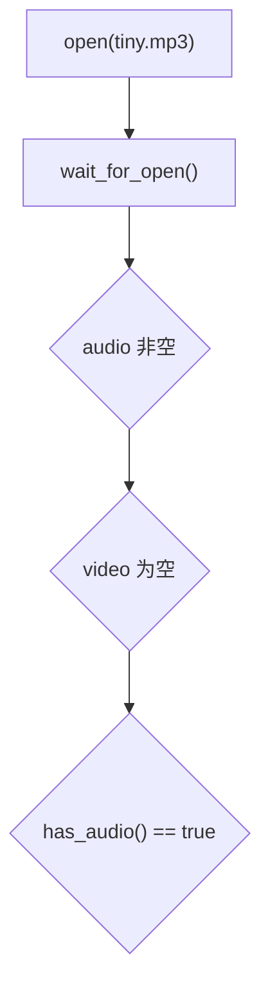

**图表来源**
- [crates/mvp-core/tests/playback.rs:643-655](file://crates/mvp-core/tests/playback.rs#L643-L655)

**章节来源**
- [crates/mvp-core/tests/playback.rs:643-655](file://crates/mvp-core/tests/playback.rs#L643-L655)

### 图片查看器功能测试
- 加载 `tiny.png`，断言宽高、非动画、帧数为 1、RGBA 数据长度正确、format 包含 PNG。
- 加载 `tiny.gif`，断言动画 GIF 保留多帧、动画时长 > 0。
- 使用 `ImageView` 打开 PNG，执行缩放、旋转、水平翻转、重置视图，断言属性变化。

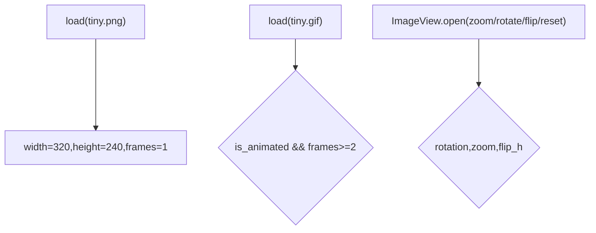

**图表来源**
- [crates/mvp-core/tests/playback.rs:705-757](file://crates/mvp-core/tests/playback.rs#L705-L757)

**章节来源**
- [crates/mvp-core/tests/playback.rs:705-757](file://crates/mvp-core/tests/playback.rs#L705-L757)

### 截图合法性与内嵌字幕
- 截图测试：将解码帧保存为 PNG，断言文件头合法、宽高正确、体积足够大。
- 内嵌字幕测试：打开带字幕的 MP4，选择文本字幕轨，轮询事件直到出现字幕 cue，断言文本包含预期内容，并按时间查询活跃字幕。

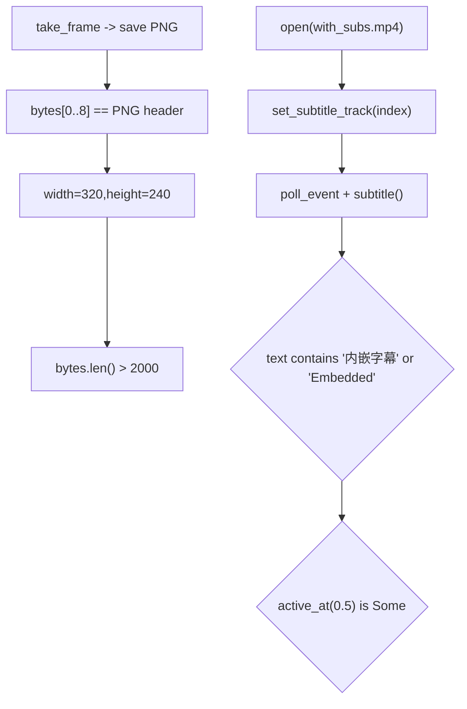

**图表来源**
- [crates/mvp-core/tests/playback.rs:356-390](file://crates/mvp-core/tests/playback.rs#L356-L390)
- [crates/mvp-core/tests/playback.rs:392-445](file://crates/mvp-core/tests/playback.rs#L392-L445)

**章节来源**
- [crates/mvp-core/tests/playback.rs:356-390](file://crates/mvp-core/tests/playback.rs#L356-L390)
- [crates/mvp-core/tests/playback.rs:392-445](file://crates/mvp-core/tests/playback.rs#L392-L445)

### 默认内嵌字幕轨道无需手动选择
- 设置 `set_subtitle_track_auto()`，打开文件后断言当前字幕轨道等于文件中第一个文本轨道索引。
- 轮询直到解码出字幕 cue，断言成功。
- 关闭字幕轨道后，`subtitle_track()` 返回 None，且字幕 cue 消失。

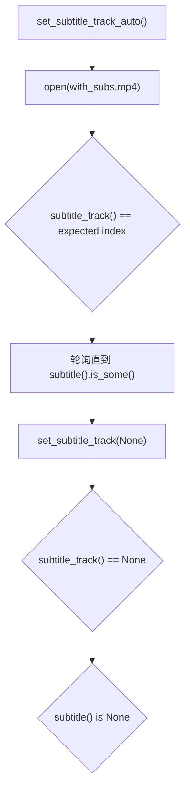

**图表来源**
- [crates/mvp-core/tests/playback.rs:447-496](file://crates/mvp-core/tests/playback.rs#L447-L496)

**章节来源**
- [crates/mvp-core/tests/playback.rs:447-496](file://crates/mvp-core/tests/playback.rs#L447-L496)

### 停止后回到空闲状态
- 打开文件，等待打开，调用 `stop()`，断言状态为 `Idle`。
- 停止后不能再取出帧。
- 重复 `stop()` 无害。

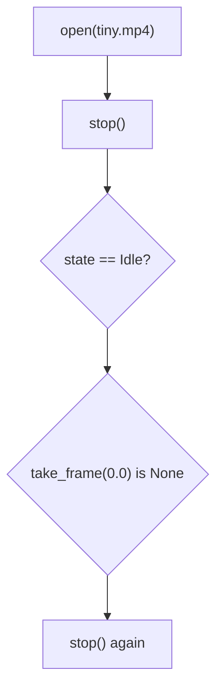

**图表来源**
- [crates/mvp-core/tests/playback.rs:498-512](file://crates/mvp-core/tests/playback.rs#L498-L512)

**章节来源**
- [crates/mvp-core/tests/playback.rs:498-512](file://crates/mvp-core/tests/playback.rs#L498-L512)

### 报告位置不超过媒体末尾
- 打开文件，设置音频延迟，反复点击进度条末尾并让其自然播放。
- 断言显示的 `display_position()` 从未超过 duration。

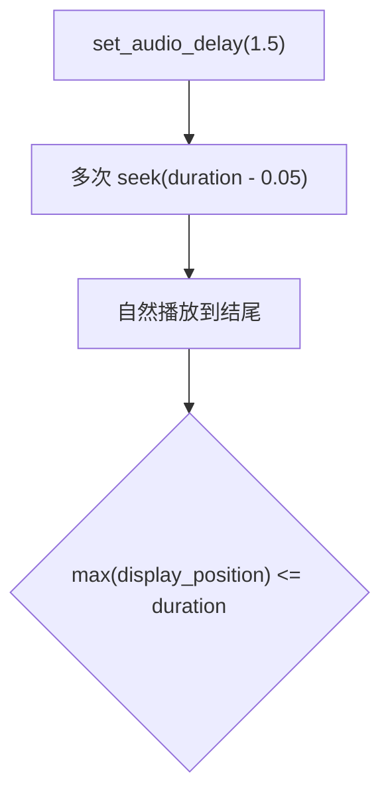

**图表来源**
- [crates/mvp-core/tests/playback.rs:591-641](file://crates/mvp-core/tests/playback.rs#L591-L641)

**章节来源**
- [crates/mvp-core/tests/playback.rs:591-641](file://crates/mvp-core/tests/playback.rs#L591-L641)

### 界面调用顺序与持续播放
- 模拟 `PlayerApp::update` 的真实调用顺序：设置目标尺寸、快照、取帧、切换暂停。
- 断言产生帧、帧可唯一拥有（Arc 可 unwrap）、队列填满后画面不冻住。
- 音频设备可达、丢帧少、时钟与墙上时钟一致、跳转后时钟一致。
- 音量/静音真正到达声卡、移动播放头不丢弃已解码帧、关闭时快速释放工作线程。

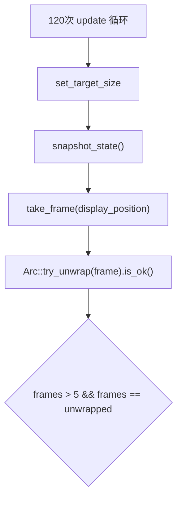

**图表来源**
- [crates/mvp-core/tests/player_loop.rs:35-90](file://crates/mvp-core/tests/player_loop.rs#L35-L90)

**章节来源**
- [crates/mvp-core/tests/player_loop.rs:35-90](file://crates/mvp-core/tests/player_loop.rs#L35-L90)

### 跳转风暴鲁棒性
- 对音频文件进行 4000 次跳转，包含极端值（`f64::MAX`、`NaN`、负数、两端）。
- 同时混入 play/pause、snapshot、take_frame、time_until_next_frame。
- 断言没有引擎错误事件或错误状态，且在风暴后仍能恢复播放。

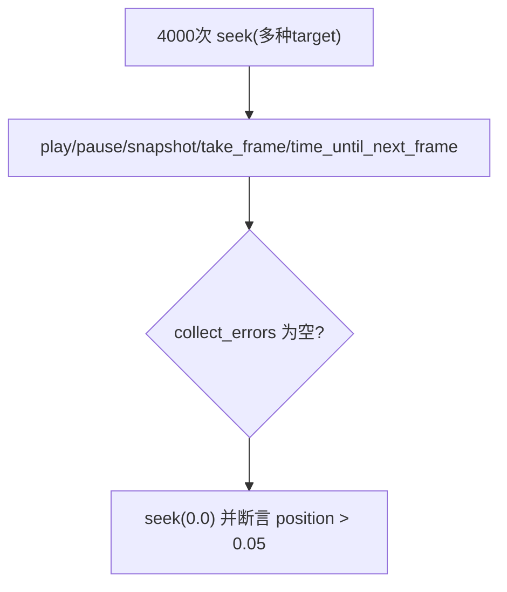

**图表来源**
- [crates/mvp-core/tests/seek_storm.rs:50-137](file://crates/mvp-core/tests/seek_storm.rs#L50-L137)

**章节来源**
- [crates/mvp-core/tests/seek_storm.rs:50-137](file://crates/mvp-core/tests/seek_storm.rs#L50-L137)

## 测试数据生成工具
`scripts/make-testdata.ps1` 用于生成端到端测试所需的媒体样本，默认路径指向 FFmpeg 可执行文件，若未找到则尝试系统 PATH 中的 `ffmpeg.exe`。生成的样本包括：
- `tiny.mp4`：3 秒 H.264 + AAC，320x240。
- `tiny.mp3`：2 秒 MP3。
- `tiny.png`：320x240 单帧 PNG。
- `tiny.gif`：循环动画 GIF。
- `with_subs.mp4`：带内嵌字幕的视频。
- `offset.ts`：MPEG-TS，时间轴从 4200 秒开始，用于测试容器时间偏移。

使用方法：
- 直接运行脚本：`.\\scripts\\make-testdata.ps1`
- 指定 FFmpeg 路径：`.\\scripts\\make-testdata.ps1 -Ffmpeg <path\\to\\ffmpeg.exe>`

脚本会写入 `testdata/` 目录，并在完成后列出每个文件的 KB 大小。

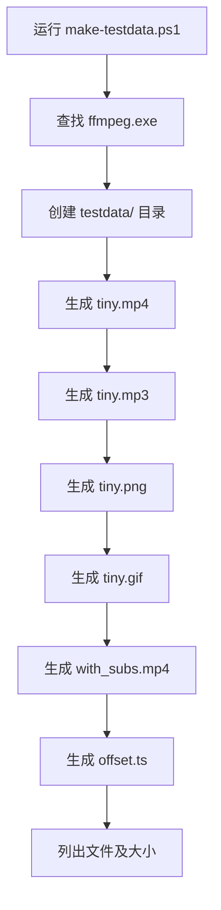

**图表来源**
- [scripts/make-testdata.ps1:1-79](file://scripts/make-testdata.ps1#L1-L79)

**章节来源**
- [scripts/make-testdata.ps1:1-79](file://scripts/make-testdata.ps1#L1-L79)

## 错误处理与边界情况

### 缺失文件错误
- 打开一个不存在的文件，断言引擎最终上报错误事件或进入错误状态。

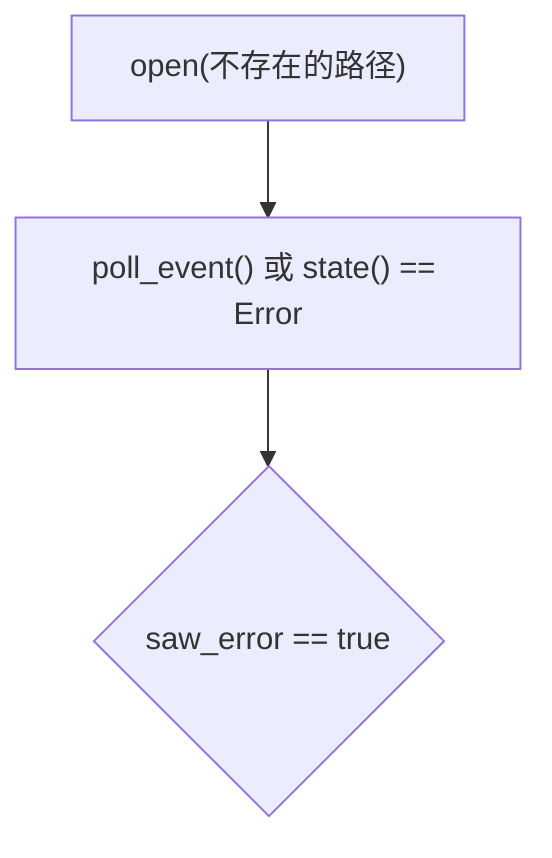

**图表来源**
- [crates/mvp-core/tests/playback.rs:657-679](file://crates/mvp-core/tests/playback.rs#L657-L679)

**章节来源**
- [crates/mvp-core/tests/playback.rs:657-679](file://crates/mvp-core/tests/playback.rs#L657-L679)

### 垃圾输入容错
- 写入随机二进制数据作为媒体文件，打开后断言引擎仍可继续使用。
- 清空错误事件后重新打开真实媒体文件，断言视频流存在。

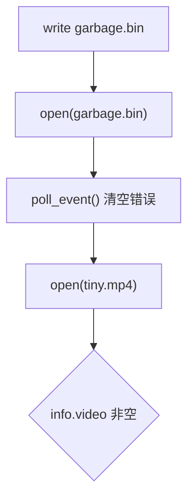

**图表来源**
- [crates/mvp-core/tests/playback.rs:681-699](file://crates/mvp-core/tests/playback.rs#L681-L699)

**章节来源**
- [crates/mvp-core/tests/playback.rs:681-699](file://crates/mvp-core/tests/playback.rs#L681-L699)

### 杜比视界与图形字幕（可选测试）
- 杜比视界测试需要环境变量 `MVP_DV_SAMPLE` 或 `MVP_DV_DIR`，否则跳过。
- 图形字幕测试需要环境变量 `MVP_PGS_SAMPLE`，否则跳过。
- 这些测试验证 HDR/Dolby Vision 探测、RPU 读取、软/硬解、跳转、文件夹扫描等。

```mermaid
flowchart TD
EnvDV["MVP_DV_SAMPLE/MVP_DV_DIR"] --> DVTests["dolby_vision.rs"]
EnvPGS["MVP_PGS_SAMPLE"] --> PGS["graphic_subtitle.rs"]
DVTests --> Probe["probe/rpus/decode/seek"]
PGS --> Decode["decode_external/active_at"]
```

**图表来源**
- [crates/mvp-core/tests/dolby_vision.rs:1-33](file://crates/mvp-core/tests/dolby_vision.rs#L1-L33)
- [crates/mvp-core/tests/graphic_subtitle.rs:1-31](file://crates/mvp-core/tests/graphic_subtitle.rs#L1-L31)

**章节来源**
- [crates/mvp-core/tests/dolby_vision.rs:1-33](file://crates/mvp-core/tests/dolby_vision.rs#L1-L33)
- [crates/mvp-core/tests/graphic_subtitle.rs:1-31](file://crates/mvp-core/tests/graphic_subtitle.rs#L1-L31)

## 依赖关系分析
测试与核心组件的依赖关系如下：
- `playback.rs` 依赖 `Engine`、`EngineConfig`、`EngineEvent`、`MediaSource`、`PlaybackState`、`ImageView`。
- `player_loop.rs` 依赖 `Engine`、`EngineConfig`、`EngineEvent`、`MediaSource`。
- `seek_storm.rs` 依赖 `Engine`、`EngineConfig`、`EngineEvent`、`MediaSource`、`PlaybackState`。
- `dolby_vision.rs` 依赖 `Engine`、`EngineConfig`、`EngineEvent`、`MediaSource`、`PlaybackState`、`MediaInfo`。
- `graphic_subtitle.rs` 依赖 `bitmap_subtitle` 模块。

```mermaid
graph LR
Playback["playback.rs"] --> Core["Engine / ImageView"]
PlayerLoop["player_loop.rs"] --> Core
SeekStorm["seek_storm.rs"] --> Core
DolbyVision["dolby_vision.rs"] --> Core
GraphicSub["graphic_subtitle.rs"] --> Bitmap["bitmap_subtitle"]
```

**图表来源**
- [crates/mvp-core/tests/playback.rs:13-14](file://crates/mvp-core/tests/playback.rs#L13-L14)
- [crates/mvp-core/tests/player_loop.rs:13-14](file://crates/mvp-core/tests/player_loop.rs#L13-L14)
- [crates/mvp-core/tests/seek_storm.rs:19-20](file://crates/mvp-core/tests/seek_storm.rs#L19-L20)
- [crates/mvp-core/tests/dolby_vision.rs:20-21](file://crates/mvp-core/tests/dolby_vision.rs#L20-L21)
- [crates/mvp-core/tests/graphic_subtitle.rs:19](file://crates/mvp-core/tests/graphic_subtitle.rs#L19)

**章节来源**
- [crates/mvp-core/tests/playback.rs:13-14](file://crates/mvp-core/tests/playback.rs#L13-L14)
- [crates/mvp-core/tests/player_loop.rs:13-14](file://crates/mvp-core/tests/player_loop.rs#L13-L14)
- [crates/mvp-core/tests/seek_storm.rs:19-20](file://crates/mvp-core/tests/seek_storm.rs#L19-L20)
- [crates/mvp-core/tests/dolby_vision.rs:20-21](file://crates/mvp-core/tests/dolby_vision.rs#L20-L21)
- [crates/mvp-core/tests/graphic_subtitle.rs:19](file://crates/mvp-core/tests/graphic_subtitle.rs#L19)

## 性能与稳定性关注点
- 帧队列填满后画面不应冻住：测试断言在 3 秒内仍有帧到达，并检查 decoded/dropped/queued 计数。
- 音频设备欠载与队列深度：断言 audio_queue_seconds > 0.25，underruns ≤ 5。
- 时钟推进与墙上时钟一致：断言 advanced ≈ elapsed，dropped_frames < 15，decoded_frames > 30。
- 跳转风暴下引擎存活：4000 次跳转后仍能恢复播放。
- 关闭速度：断言 stop 耗时 < 300ms，无论暂停还是播放中。

```mermaid
flowchart TD
QueueFull["frame queue filled"] --> LateCheck{"late > 10 in 3s?"}
AudioQ["audio_queue_seconds > 0.25"] --> Underrun{"underruns <= 5"}
Clock["advanced ≈ elapsed"] --> Drops{"dropped_frames < 15"}
Storm["4000 seeks"] --> Recover{"seek(0.0) advances"}
StopTime["stop() timing"] --> Bound{"< 300ms"}
```

**图表来源**
- [crates/mvp-core/tests/player_loop.rs:92-140](file://crates/mvp-core/tests/player_loop.rs#L92-L140)
- [crates/mvp-core/tests/player_loop.rs:142-191](file://crates/mvp-core/tests/player_loop.rs#L142-L191)
- [crates/mvp-core/tests/player_loop.rs:264-339](file://crates/mvp-core/tests/player_loop.rs#L264-L339)
- [crates/mvp-core/tests/seek_storm.rs:50-137](file://crates/mvp-core/tests/seek_storm.rs#L50-L137)
- [crates/mvp-core/tests/player_loop.rs:599-653](file://crates/mvp-core/tests/player_loop.rs#L599-L653)

**章节来源**
- [crates/mvp-core/tests/player_loop.rs:92-140](file://crates/mvp-core/tests/player_loop.rs#L92-L140)
- [crates/mvp-core/tests/player_loop.rs:142-191](file://crates/mvp-core/tests/player_loop.rs#L142-L191)
- [crates/mvp-core/tests/player_loop.rs:264-339](file://crates/mvp-core/tests/player_loop.rs#L264-L339)
- [crates/mvp-core/tests/seek_storm.rs:50-137](file://crates/mvp-core/tests/seek_storm.rs#L50-L137)
- [crates/mvp-core/tests/player_loop.rs:599-653](file://crates/mvp-core/tests/player_loop.rs#L599-L653)

## 故障排查指南
- 如果测试跳过：检查 `testdata/` 是否存在对应文件，或缺失环境变量（如 `MVP_DV_SAMPLE`、`MVP_PGS_SAMPLE`）。
- 如果跳转失败：启用日志 `env_logger` 并查看内部解释；检查容器 `start_time` 是否偏移。
- 如果画面冻结：检查帧队列是否填满、是否持续消费帧、是否丢帧过多。
- 如果声音无声：检查音频设备是否存在、volume/mute 是否生效、audio_queue_seconds 是否为正。
- 如果关闭卡顿：检查工作线程是否及时退出、声卡背压是否被中断。

**章节来源**
- [crates/mvp-core/tests/playback.rs:257-322](file://crates/mvp-core/tests/playback.rs#L257-L322)
- [crates/mvp-core/tests/player_loop.rs:142-191](file://crates/mvp-core/tests/player_loop.rs#L142-L191)
- [crates/mvp-core/tests/player_loop.rs:599-653](file://crates/mvp-core/tests/player_loop.rs#L599-L653)

## 结论
本播放功能测试文档基于仓库中的实际测试代码，覆盖了端到端播放的关键场景：
- 视频打开与流信息验证。
- 自动播放控制。
- 帧解码质量与时钟推进。
- 跳转准确性与容器时间轴偏移。
- 暂停恢复与结束重播。
- 音频单独播放。
- 图片查看器缩放/旋转/翻转。
- 测试数据生成工具使用方法。
- 缺失文件、垃圾输入、异常状态恢复等错误处理。

这些测试共同保证了播放引擎在真实媒体文件下的稳定性、准确性与鲁棒性。对于 HDR/Dolby Vision 与图形字幕等高级特性，测试提供了可选扩展路径，便于在具备样本时进一步验证。