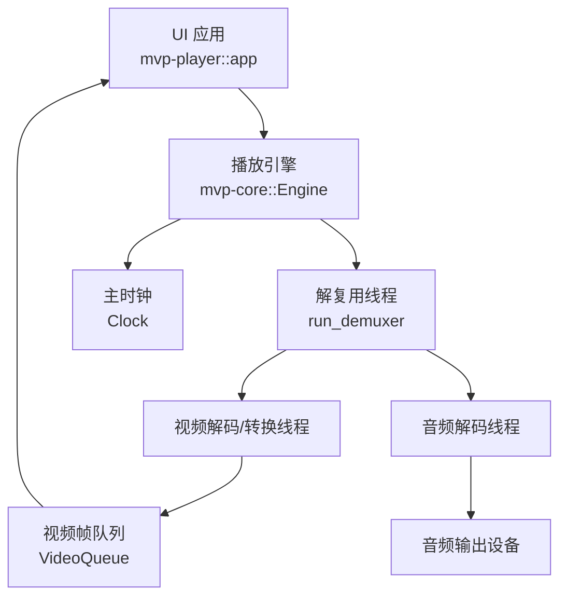
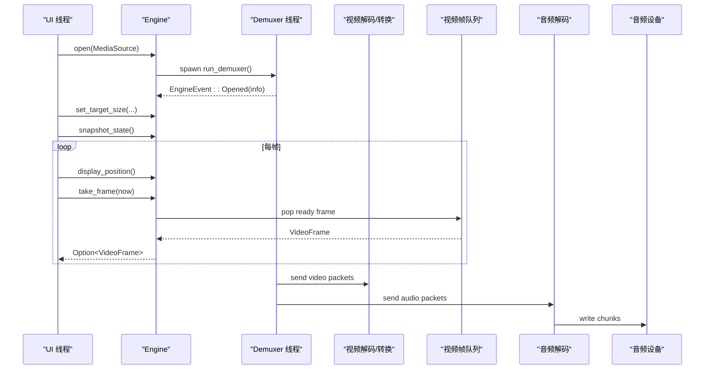
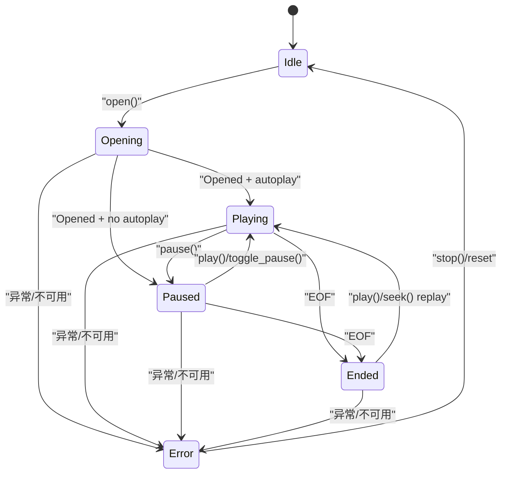
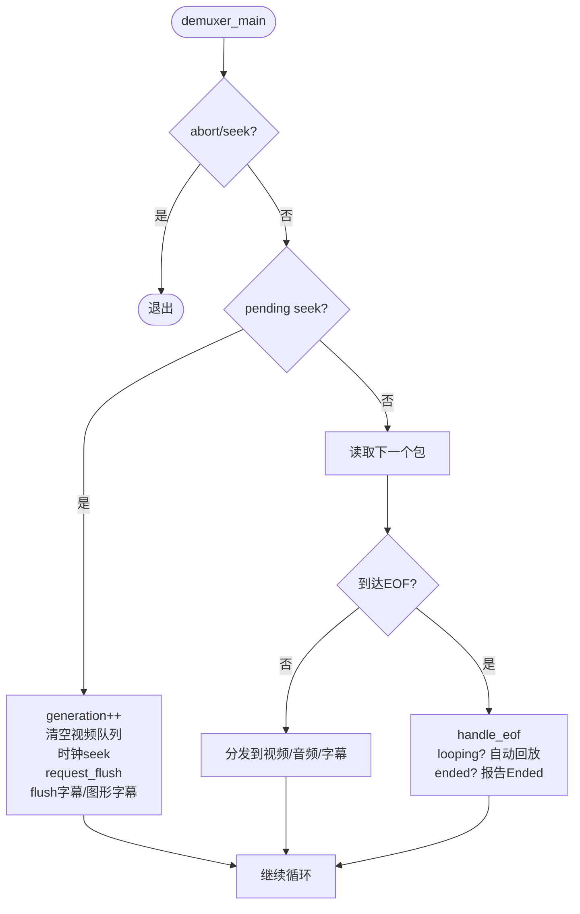
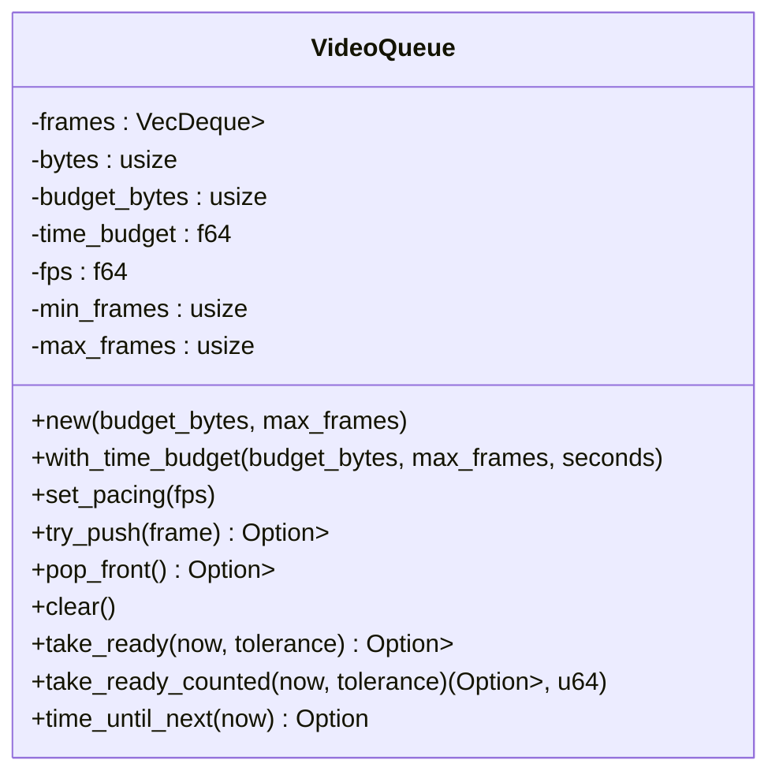
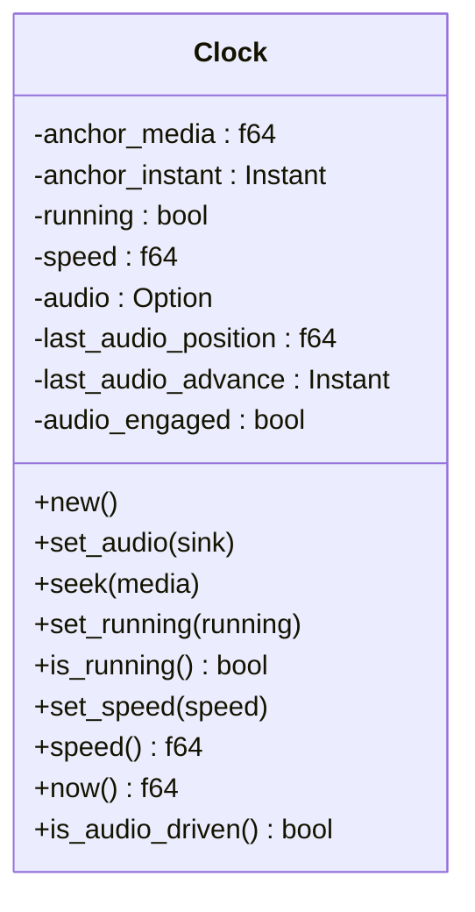
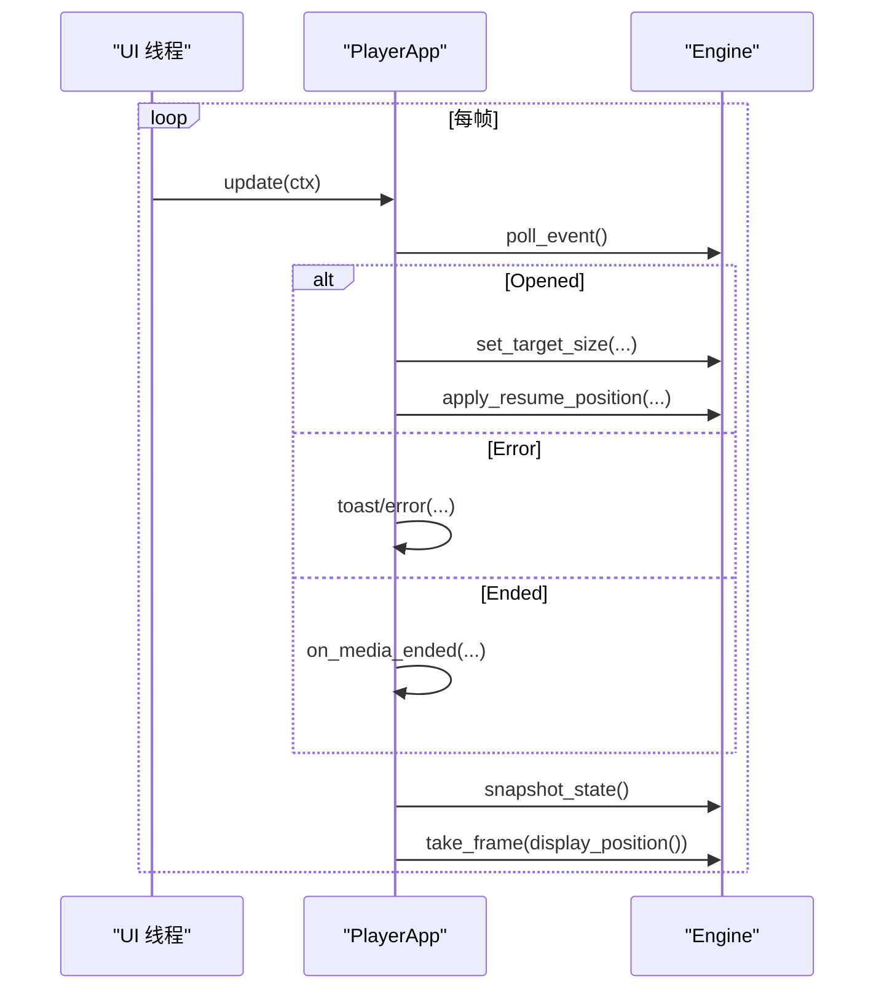
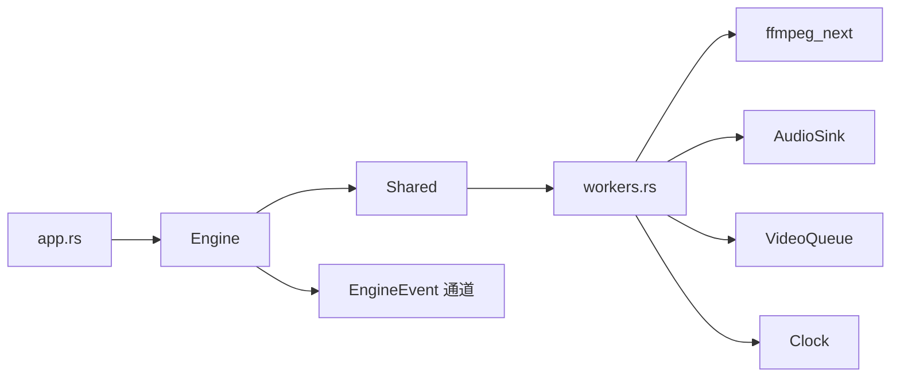
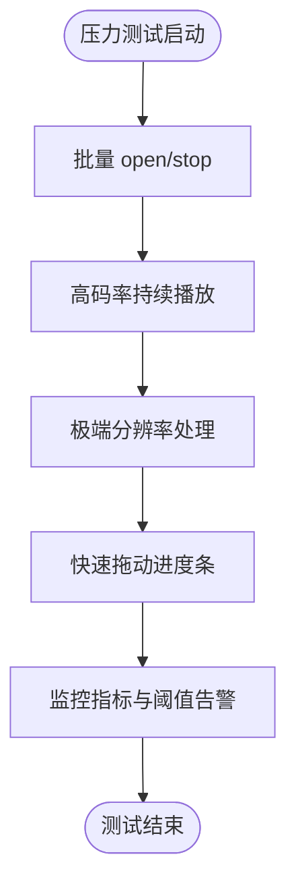

# 播放器循环测试

<cite>
**本文引用的文件**   
- [engine.rs](file://crates/mvp-core/src/engine.rs)
- [workers.rs](file://crates/mvp-core/src/engine/workers.rs)
- [queue.rs](file://crates/mvp-core/src/engine/queue.rs)
- [clock.rs](file://crates/mvp-core/src/engine/clock.rs)
- [player_loop.rs](file://crates/mvp-core/tests/player_loop.rs)
- [seek_storm.rs](file://crates/mvp-core/tests/seek_storm.rs)
- [playback.rs](file://crates/mvp-core/tests/playback.rs)
- [app.rs](file://crates/mvp-player/src/app.rs)
</cite>

## 目录
1. [引言](#引言)
2. [项目结构](#项目结构)
3. [核心组件](#核心组件)
4. [架构总览](#架构总览)
5. [详细组件分析](#详细组件分析)
6. [依赖关系分析](#依赖关系分析)
7. [性能与稳定性测试策略](#性能与稳定性测试策略)
8. [并发安全与压力测试](#并发安全与压力测试)
9. [故障排查指南](#故障排查指南)
10. [结论](#结论)

## 引言
本文件面向“播放器主循环”的测试设计与实现，覆盖以下目标：
- 事件驱动架构验证：UI 线程通过轮询引擎事件驱动播放流程。
- 多线程同步机制：解复用、视频解码、音频解码、字幕处理等线程之间的协作与中断。
- 资源管理与内存泄漏防护：帧队列字节预算、时间预算、解码会话 generation、工作线程退出。
- 状态机完整覆盖：Idle → Opening → Opened → Playing → Paused → Ended → Error 等转换。
- 长时间运行与用户操作模拟：快速切换文件、频繁跳转、批量播放列表操作。
- 性能监控：解码速度、内存使用、CPU 占用、丢帧、设备欠载等指标与阈值告警。
- 并发安全与压力测试：大量文件同时加载、高码率持续播放、极端分辨率处理下的稳定性。

## 项目结构
播放器核心位于 `mvp-core`，UI 应用位于 `mvp-player`。测试集中在 `mvp-core/tests`，其中 `player_loop.rs` 和 `seek_storm.rs` 直接针对主循环、事件流、多线程行为进行回归与压力验证；`playback.rs` 覆盖生命周期与状态机语义。

**图表来源**
- [engine.rs:1-21](file://crates/mvp-core/src/engine.rs#L1-L21)
- [workers.rs:134-146](file://crates/mvp-core/src/engine/workers.rs#L134-L146)
- [queue.rs:67-86](file://crates/mvp-core/src/engine/queue.rs#L67-L86)
- [clock.rs:1-15](file://crates/mvp-core/src/engine/clock.rs#L1-L15)

**章节来源**
- [engine.rs:1-21](file://crates/mvp-core/src/engine.rs#L1-L21)
- [app.rs:859-889](file://crates/mvp-player/src/app.rs#L859-L889)

## 核心组件
- 播放引擎接口：对外暴露 open、play、pause、seek、stop、snapshot_state、take_frame 等 API，封装内部线程与共享状态。
- 解复用与调度：demuxer 线程负责读取媒体、分发音视频包、管理字幕、处理 seek、track change、A-B 循环、EOF 与 loop。
- 视频路径：视频解码器 → 颜色转换 → 帧队列 → UI 消费。
- 音频路径：音频解码器 → 重采样/增强 → 音频设备。
- 主时钟：以系统单调时钟为主，音频设备作为参考源，保证 A/V 同步与位置连续性。
- 帧队列：按字节预算和时间预算限制，避免内存膨胀与延迟过大。

**章节来源**
- [engine.rs:106-153](file://crates/mvp-core/src/engine.rs#L106-L153)
- [engine.rs:310-372](file://crates/mvp-core/src/engine.rs#L310-L372)
- [workers.rs:281-467](file://crates/mvp-core/src/engine/workers.rs#L281-L467)
- [queue.rs:67-253](file://crates/mvp-core/src/engine/queue.rs#L67-L253)
- [clock.rs:1-46](file://crates/mvp-core/src/engine/clock.rs#L1-L46)

## 架构总览
播放器主循环由 UI 线程驱动，引擎在后台维护多个工作线程。UI 每帧轮询引擎事件并调用快照、取帧、设置目标尺寸等操作；引擎将控制命令（如 seek、track change）通过共享状态传递给 demuxer，数据则通过有界通道传递，避免阻塞 UI。

**图表来源**
- [app.rs:859-889](file://crates/mvp-player/src/app.rs#L859-L889)
- [engine.rs:555-593](file://crates/mvp-core/src/engine.rs#L555-L593)
- [workers.rs:451-687](file://crates/mvp-core/src/engine/workers.rs#L451-L687)
- [queue.rs:180-253](file://crates/mvp-core/src/engine/queue.rs#L180-L253)

## 详细组件分析

### 播放器状态机与事件驱动
状态定义包括 Idle、Opening、Playing、Paused、Ended、Error。UI 通过 EngineEvent 接收 Opened、StateChanged、Ended、Error 等事件，并在 app 中处理打开完成、错误提示、媒体结束等逻辑。

**图表来源**
- [engine.rs:106-153](file://crates/mvp-core/src/engine.rs#L106-L153)
- [workers.rs:451-457](file://crates/mvp-core/src/engine/workers.rs#L451-L457)
- [workers.rs:780-788](file://crates/mvp-core/src/engine/workers.rs#L780-L788)
- [engine.rs:669-700](file://crates/mvp-core/src/engine.rs#L669-L700)

**章节来源**
- [engine.rs:106-153](file://crates/mvp-core/src/engine.rs#L106-L153)
- [engine.rs:669-700](file://crates/mvp-core/src/engine.rs#L669-L700)
- [app.rs:859-889](file://crates/mvp-player/src/app.rs#L859-L889)

### 解复用与多线程同步
- demuxer 线程负责打开输入、探测媒体信息、选择音视频轨、启动解码器线程、分发数据包、处理 seek、track change、A-B 循环、EOF 与 loop。
- 所有入口捕获 panic，确保损坏文件不会拖垮整个播放器，而是转为 Error 状态并通过事件上报。
- 控制消息（seek、track change）通过共享状态而非数据包通道传递，避免被满队列阻塞。
- 视频通道采用超时发送并检查是否落后于时钟，若落后则丢弃旧帧以避免进一步滞后。
- 音频通道同样使用带超时的控制发送，确保 stop/pause 能及时响应。

**图表来源**
- [workers.rs:451-687](file://crates/mvp-core/src/engine/workers.rs#L451-L687)
- [workers.rs:700-793](file://crates/mvp-core/src/engine/workers.rs#L700-L793)

**章节来源**
- [workers.rs:134-146](file://crates/mvp-core/src/engine/workers.rs#L134-L146)
- [workers.rs:281-467](file://crates/mvp-core/src/engine/workers.rs#L281-L467)
- [workers.rs:469-687](file://crates/mvp-core/src/engine/workers.rs#L469-L687)
- [workers.rs:700-793](file://crates/mvp-core/src/engine/workers.rs#L700-L793)

### 视频帧队列与内存管理
- VideoQueue 使用 VecDeque 存储引用计数的帧，维护字节预算与时间预算。
- 全满时拒绝新帧而不是丢弃最旧帧，防止出现“队列看似满但无可用帧”的冻结问题。
- take_ready/take_ready_counted 返回当前应展示的帧，并统计被替代的帧数，用于区分“解码跟不上”和“屏幕不需要这么多帧”。
- clear 释放计数，避免内存泄漏。

**图表来源**
- [queue.rs:67-253](file://crates/mvp-core/src/engine/queue.rs#L67-L253)

**章节来源**
- [queue.rs:67-253](file://crates/mvp-core/src/engine/queue.rs#L67-L253)

### 主时钟与 A/V 同步
- Clock 使用系统单调时钟作为主时钟，音频设备作为参考源，保证样本级同步。
- 当音频停止或设备不可用时，回退到 wall clock，保持位置连续性。
- seek/set_running/set_speed 会重新锚定位置，避免跳变。

**图表来源**
- [clock.rs:25-46](file://crates/mvp-core/src/engine/clock.rs#L25-L46)
- [clock.rs:48-159](file://crates/mvp-core/src/engine/clock.rs#L48-L159)

**章节来源**
- [clock.rs:1-46](file://crates/mvp-core/src/engine/clock.rs#L1-L46)
- [clock.rs:48-159](file://crates/mvp-core/src/engine/clock.rs#L48-L159)

### UI 事件驱动与主循环
UI 每帧最多处理固定数量的引擎事件，避免 UI 卡顿；收到 Opened 后设置目标尺寸、恢复进度、动态范围提示等；遇到错误时根据类型显示警告或错误；Ended 时触发播放列表结束逻辑。

**图表来源**
- [app.rs:859-889](file://crates/mvp-player/src/app.rs#L859-L889)

**章节来源**
- [app.rs:859-889](file://crates/mvp-player/src/app.rs#L859-L889)

## 依赖关系分析
- Engine 持有 Shared 与事件通道，负责线程生命周期与状态发布。
- workers.rs 中的 demuxer 线程依赖 ffmpeg_next、AudioSink、video/subtitle 模块。
- queue.rs 提供视频帧队列，供 UI 消费。
- clock.rs 提供主时钟，与 AudioSink 交互。
- UI 层 app.rs 订阅 EngineEvent 并驱动 UI 更新。

**图表来源**
- [engine.rs:310-372](file://crates/mvp-core/src/engine.rs#L310-L372)
- [workers.rs:134-146](file://crates/mvp-core/src/engine/workers.rs#L134-L146)
- [queue.rs:67-86](file://crates/mvp-core/src/engine/queue.rs#L67-L86)
- [clock.rs:1-46](file://crates/mvp-core/src/engine/clock.rs#L1-L46)
- [app.rs:859-889](file://crates/mvp-player/src/app.rs#L859-L889)

**章节来源**
- [engine.rs:310-372](file://crates/mvp-core/src/engine.rs#L310-L372)
- [workers.rs:134-146](file://crates/mvp-core/src/engine/workers.rs#L134-L146)
- [queue.rs:67-86](file://crates/mvp-core/src/engine/queue.rs#L67-L86)
- [clock.rs:1-46](file://crates/mvp-core/src/engine/clock.rs#L1-L46)
- [app.rs:859-889](file://crates/mvp-player/src/app.rs#L859-L889)

## 性能与稳定性测试策略

### 事件驱动架构验证
- 测试复现 UI 调用顺序：设置目标尺寸、快照、取帧、暂停切换，确保管道与设备时序一致。
- 断言帧可被 UI 唯一拥有（Arc::try_unwrap），避免纹理上传失败。
- 断言图片不会因队列填满而冻结，且音频队列保持合理缓冲，设备欠载次数受控。

**章节来源**
- [player_loop.rs:35-90](file://crates/mvp-core/tests/player_loop.rs#L35-L90)
- [player_loop.rs:92-140](file://crates/mvp-core/tests/player_loop.rs#L92-L140)
- [player_loop.rs:142-191](file://crates/mvp-core/tests/player_loop.rs#L142-L191)

### 多线程同步机制测试
- 禁用轨道组合测试：确保解复用器不会因为轨道关闭而卡死。
- 频繁暂停/播放与暂停中跳转：验证控制命令与解码线程的同步。
- 停止释放工作线程：确保 paused 与 playing 状态下 stop 都能快速返回，不等待解码积压。

**章节来源**
- [player_loop.rs:193-230](file://crates/mvp-core/tests/player_loop.rs#L193-L230)
- [player_loop.rs:232-262](file://crates/mvp-core/tests/player_loop.rs#L232-L262)
- [player_loop.rs:599-653](file://crates/mvp-core/tests/player_loop.rs#L599-L653)

### 资源管理与内存泄漏防护
- 帧队列字节预算与时间预算：防止内存膨胀与延迟过大。
- 解码会话 generation：避免旧 seek 的数据污染新会话。
- 工作线程退出：demuxer 结束时发送 Stop 给视频/音频 worker，确保资源释放。

**章节来源**
- [queue.rs:67-253](file://crates/mvp-core/src/engine/queue.rs#L67-L253)
- [workers.rs:459-535](file://crates/mvp-core/src/engine/workers.rs#L459-L535)
- [workers.rs:683-687](file://crates/mvp-core/src/engine/workers.rs#L683-L687)

### 状态机完整覆盖
- Idle → Opening：open 后立即进入 Opening。
- Opening → Playing/Paused：根据 autoplay 配置决定。
- Playing ↔ Paused：play/pause/toggle_pause 切换。
- Playing/Paused → Ended：EOF 检测与 Ended 事件。
- Ended → Playing：replay 从开始或指定位置。
- 任意状态 → Error：异常或设备不可用。

**章节来源**
- [engine.rs:106-153](file://crates/mvp-core/src/engine.rs#L106-L153)
- [engine.rs:555-593](file://crates/mvp-core/src/engine.rs#L555-L593)
- [engine.rs:669-700](file://crates/mvp-core/src/engine.rs#L669-L700)
- [workers.rs:451-457](file://crates/mvp-core/src/engine/workers.rs#L451-L457)
- [workers.rs:780-788](file://crates/mvp-core/src/engine/workers.rs#L780-L788)
- [playback.rs:514-555](file://crates/mvp-core/tests/playback.rs#L514-L555)

### 长时间运行稳定性测试
- 稳态播放：断言时钟推进接近真实时间，丢帧与解码帧数符合预期。
- 跳转一致性：多次 seek 后时钟与目标位置误差受控，帧继续流动。
- 音量与静音：有效增益必须到达音频设备，静音与取消静音正确传播。

**章节来源**
- [player_loop.rs:264-339](file://crates/mvp-core/tests/player_loop.rs#L264-L339)
- [player_loop.rs:341-387](file://crates/mvp-core/tests/player_loop.rs#L341-L387)
- [player_loop.rs:495-582](file://crates/mvp-core/tests/player_loop.rs#L495-L582)

### 性能监控测试
- 指标来源：EngineSnapshot 包含 decoded_frames、dropped_frames、queued_frames、audio_queue_seconds、underruns、download_ms、convert_ms、tone_map_ms、queue_wait_ms 等。
- 监控点：
  - 解码速度：decoded_frames 增长速率。
  - 内存使用：queued_frames 与 bytes 预算。
  - CPU 占用：convert_ms、tone_map_ms、queue_wait_ms。
  - 设备健康：audio_queue_seconds、underruns。
- 阈值告警建议：
  - underruns > 阈值（例如每秒超过一定次数）。
  - dropped_frames 增长率异常。
  - convert_ms/tone_map_ms 显著升高。
  - audio_queue_seconds 低于下限（设备饥饿）。

**章节来源**
- [engine.rs:215-287](file://crates/mvp-core/src/engine.rs#L215-L287)
- [player_loop.rs:142-191](file://crates/mvp-core/tests/player_loop.rs#L142-L191)
- [player_loop.rs:264-339](file://crates/mvp-core/tests/player_loop.rs#L264-L339)

## 并发安全与压力测试

### 并发安全测试
- 频繁 toggle_pause 与 seek：验证控制命令与解码线程的原子性与互斥性。
- 移动 playhead：不重启解码器，保留已解码帧，仅调整时钟。
- 音量/静音：通过 Atomic 与设备回调传播，避免 UI 与设备不同步。

**章节来源**
- [player_loop.rs:232-262](file://crates/mvp-core/tests/player_loop.rs#L232-L262)
- [player_loop.rs:439-493](file://crates/mvp-core/tests/player_loop.rs#L439-L493)
- [player_loop.rs:495-582](file://crates/mvp-core/tests/player_loop.rs#L495-L582)

### 压力测试场景
- 大量文件同时加载：通过重复 open/stop 与事件轮询，验证管道重建与资源清理。
- 高码率视频持续播放：监控 decode stall、dropped_frames、queue_wait_ms。
- 极端分辨率处理：监控 convert_ms、tone_map_ms、download_ms，确保 GPU/CPU 负载可控。
- 快速拖动进度条（seek storm）：验证中断回调、AVERROR_EXIT 处理与管道恢复。

**图表来源**
- [seek_storm.rs:1-138](file://crates/mvp-core/tests/seek_storm.rs#L1-L138)
- [player_loop.rs:35-90](file://crates/mvp-core/tests/player_loop.rs#L35-L90)
- [engine.rs:215-287](file://crates/mvp-core/src/engine.rs#L215-L287)

**章节来源**
- [seek_storm.rs:1-138](file://crates/mvp-core/tests/seek_storm.rs#L1-L138)
- [player_loop.rs:35-90](file://crates/mvp-core/tests/player_loop.rs#L35-L90)
- [engine.rs:215-287](file://crates/mvp-core/src/engine.rs#L215-L287)

## 故障排查指南
- 黑屏/无帧：检查解复用器是否因轨道关闭而卡死；确认 set_subtitle_track/set_audio_track 在 open 前设置。
- 画面冻结：检查视频队列是否填满且无可用帧；确认 try_push 拒绝新帧而非丢弃最旧帧。
- 无声/声音断续：检查音频设备是否可用、audio_queue_seconds 是否过低、underruns 是否过高。
- 停止卡顿：确认 stop 先 raise abort、wake_video、close device，再 join 线程。
- 跳转后无帧：确认 handle_eof 与 seek 后的 flush 与 ended 标志清理。

**章节来源**
- [player_loop.rs:193-230](file://crates/mvp-core/tests/player_loop.rs#L193-L230)
- [player_loop.rs:92-140](file://crates/mvp-core/tests/player_loop.rs#L92-L140)
- [player_loop.rs:599-653](file://crates/mvp-core/tests/player_loop.rs#L599-L653)
- [workers.rs:700-793](file://crates/mvp-core/src/engine/workers.rs#L700-L793)

## 结论
播放器主循环测试围绕事件驱动、多线程同步、资源管理与状态机展开，覆盖了从基本播放到压力场景的全链路验证。通过帧队列预算、时钟同步、generation 隔离与 bounded channels，系统在长时间运行与高频操作下保持稳定。性能监控指标为调优与告警提供了依据，故障排查指南帮助快速定位常见问题。建议在 CI 中集成 player_loop.rs 与 seek_storm.rs，并结合性能指标阈值进行自动化回归。