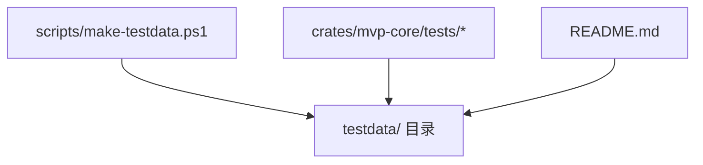
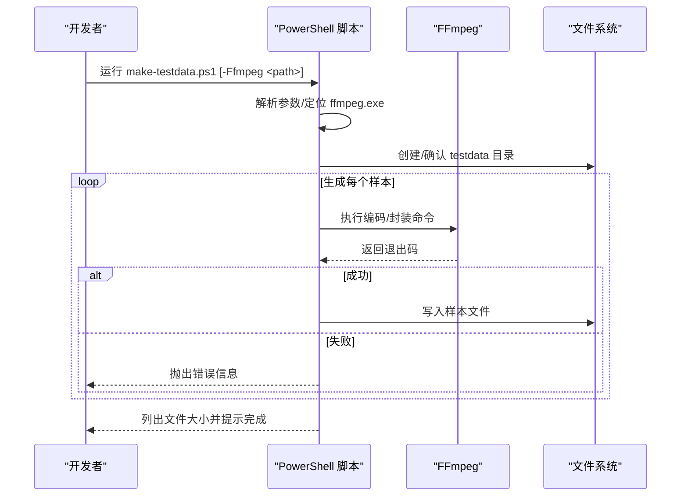
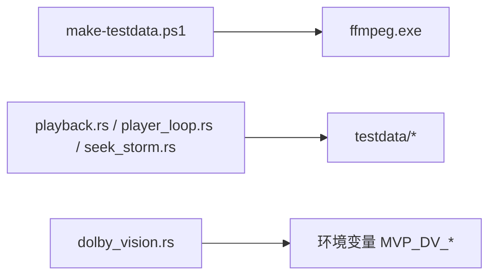

# 测试数据生成

<cite>
**本文引用的文件**
- [scripts/make-testdata.ps1](file://scripts/make-testdata.ps1)
- [README.md](file://README.md)
- [crates/mvp-core/tests/playback.rs](file://crates/mvp-core/tests/playback.rs)
- [crates/mvp-core/tests/player_loop.rs](file://crates/mvp-core/tests/player_loop.rs)
- [crates/mvp-core/tests/seek_storm.rs](file://crates/mvp-core/tests/seek_storm.rs)
- [crates/mvp-core/tests/dolby_vision.rs](file://crates/mvp-core/tests/dolby_vision.rs)
- [scripts/ffmpeg-env.ps1](file://scripts/ffmpeg-env.ps1)
</cite>

## 目录
1. [简介](#简介)
2. [项目结构](#项目结构)
3. [核心组件](#核心组件)
4. [架构总览](#架构总览)
5. [详细组件分析](#详细组件分析)
6. [依赖关系分析](#依赖关系分析)
7. [性能与体积控制](#性能与体积控制)
8. [故障排查指南](#故障排查指南)
9. [结论](#结论)
10. [附录：扩展与自定义](#附录：扩展与自定义)

## 简介
本文件面向“测试数据生成”这一目标，围绕仓库中的脚本 scripts/make-testdata.ps1，系统说明其功能、使用方法、生成的媒体样本类型、测试场景覆盖策略、数据组织与管理方式，以及如何在现有基础上扩展更多格式与边缘情况。同时给出版本管理与可重复性建议，确保测试环境稳定一致。

## 项目结构
- 测试数据生成脚本位于 scripts/make-testdata.ps1，负责在 testdata 目录下生成少量、体积小、便于纳入版本控制的媒体样本。
- 测试用例通过 crates/mvp-core/tests 下的多个测试文件引用 testdata 中的样本，例如 tiny.mp4、tiny.mp3、offset.ts 等。
- README 中说明了测试数据的来源、用途以及可选的 HDR/杜比视界与图形字幕素材的获取方式（通过环境变量指向外部真实样本）。

图表来源
- [scripts/make-testdata.ps1:1-79](file://scripts/make-testdata.ps1#L1-L79)
- [README.md:457-503](file://README.md#L457-L503)

章节来源
- [scripts/make-testdata.ps1:1-79](file://scripts/make-testdata.ps1#L1-L79)
- [README.md:457-503](file://README.md#L457-L503)

## 核心组件
- 脚本入口与参数
  - 支持通过 -Ffmpeg 指定 ffmpeg.exe 路径；若未提供则尝试从 PATH 查找。
  - 输出目录为仓库根下的 testdata。
- FFmpeg 调用封装
  - 统一封装为 Invoke-Ffmpeg，自动追加 -y 与 -loglevel error，并在失败时抛出错误。
- 样本生成任务
  - tiny.mp4：H.264 + AAC，短时长小分辨率，用于基础播放与跳转验证。
  - tiny.mp3：MP3 音频，用于纯音频解码与时间轴处理。
  - tiny.png：单帧 PNG，用于图片读取与渲染路径。
  - tiny.gif：循环动画 GIF，用于动画图像播放。
  - with_subs.mp4：带内嵌字幕轨道的视频，用于字幕解码与默认轨道选择。
  - offset.ts：MPEG-TS 容器，start_time 非零（4200s），用于验证无索引容器的跳转与时间换算。

章节来源
- [scripts/make-testdata.ps1:9-29](file://scripts/make-testdata.ps1#L9-L29)
- [scripts/make-testdata.ps1:31-74](file://scripts/make-testdata.ps1#L31-L74)

## 架构总览
测试数据生成流程如下：
- 解析参数并定位 ffmpeg.exe。
- 创建或确认 testdata 目录存在。
- 依次执行 FFmpeg 命令生成各样本。
- 打印文件大小清单并提示完成。

图表来源
- [scripts/make-testdata.ps1:14-29](file://scripts/make-testdata.ps1#L14-L29)
- [scripts/make-testdata.ps1:31-79](file://scripts/make-testdata.ps1#L31-L79)

## 详细组件分析

### 脚本参数与环境探测
- 参数
  - -Ffmpeg：指定 ffmpeg.exe 路径；缺省时尝试从 PATH 查找。
- 行为
  - 找不到 ffmpeg.exe 会立即报错，避免后续静默失败。
  - 使用 -y 强制覆盖输出文件，-loglevel error 仅输出错误日志，减少干扰。

章节来源
- [scripts/make-testdata.ps1:9-29](file://scripts/make-testdata.ps1#L9-L29)

### 样本生成任务详解
- tiny.mp4
  - 视频：testsrc2 生成 320x240@25fps 的测试画面，libx264 编码，yuv420p。
  - 音频：正弦波 440Hz，AAC 64k。
  - 时长：约 3 秒，最短流裁剪。
  - 用途：基础播放、跳转、暂停冻结、截图合法性等端到端测试。
- tiny.mp3
  - 音频：正弦波 440Hz，MP3 64k，约 2 秒。
  - 用途：纯音频解码、时间轴、音量/静音等。
- tiny.png
  - 图片：单帧 320x240。
  - 用途：图片读取与渲染路径。
- tiny.gif
  - 动画：64x64@10fps，循环播放。
  - 用途：动画图像播放。
- with_subs.mp4
  - 视频+音频同前，额外包含内嵌字幕轨道。
  - 用途：字幕解码、默认轨道选择。
- offset.ts
  - 容器：MPEG-TS，start_time=4200s，GOP=25。
  - 用途：验证无索引容器的跳转逻辑与时间换算，防止自死锁。

章节来源
- [scripts/make-testdata.ps1:31-74](file://scripts/make-testdata.ps1#L31-L74)

### 测试用例对样本的使用
- playback.rs
  - 读取 testdata 中的媒体文件进行端到端播放验证，包括分辨率、时间戳单调、画面非空、跳转落点、内嵌字幕解码等。
- player_loop.rs
  - 基于 tiny.mp4 与 scene.mp4（后者由测试自行生成）驱动引擎状态机，验证时钟、丢帧、跳转后一致性、关闭不阻塞等。
- seek_storm.rs
  - 使用 tiny.mp3 进行大量跳转压力测试。
- dolby_vision.rs
  - 需要外部真实杜比视界样本，通过环境变量 MVP_DV_SAMPLE 或 MVP_DV_DIR 指定，不在 testdata 中提交。

章节来源
- [crates/mvp-core/tests/playback.rs:6-28](file://crates/mvp-core/tests/playback.rs#L6-L28)
- [crates/mvp-core/tests/player_loop.rs:16-20](file://crates/mvp-core/tests/player_loop.rs#L16-L20)
- [crates/mvp-core/tests/seek_storm.rs:22-58](file://crates/mvp-core/tests/seek_storm.rs#L22-L58)
- [crates/mvp-core/tests/dolby_vision.rs:1-33](file://crates/mvp-core/tests/dolby_vision.rs#L1-L33)

## 依赖关系分析
- 脚本依赖
  - PowerShell 运行时。
  - FFmpeg 命令行工具（可执行文件）。
- 测试依赖
  - Rust 测试框架。
  - 本地构建的播放器引擎库（mvp-core）。
  - testdata 中的样本文件。
- 配置与环境
  - scripts/ffmpeg-env.ps1 提供本机 FFmpeg 与 libclang 路径探测逻辑，供其他脚本复用；make-testdata.ps1 直接接受 -Ffmpeg 参数，也可依赖 PATH。

图表来源
- [scripts/make-testdata.ps1:9-29](file://scripts/make-testdata.ps1#L9-L29)
- [scripts/ffmpeg-env.ps1:15-72](file://scripts/ffmpeg-env.ps1#L15-L72)
- [crates/mvp-core/tests/dolby_vision.rs:23-33](file://crates/mvp-core/tests/dolby_vision.rs#L23-L33)

章节来源
- [scripts/ffmpeg-env.ps1:15-72](file://scripts/ffmpeg-env.ps1#L15-L72)
- [crates/mvp-core/tests/dolby_vision.rs:23-33](file://crates/mvp-core/tests/dolby_vision.rs#L23-L33)

## 性能与体积控制
- 体积控制
  - 所有样本刻意保持极小体积（几百 KB 总量），便于纳入版本控制，保证新克隆仓库可直接运行 cargo test。
- 质量与速度
  - 使用 ultrafast 预设与低码率音频，牺牲画质换取快速生成与极小体积。
  - 采样分辨率较低（320x240、64x64），满足功能验证即可。
- 时间轴边界
  - offset.ts 设置 start_time=4200s，模拟蓝光式 TS 的时间偏移，确保跳转逻辑健壮。
- 可扩展性
  - 如需更大分辨率或更长时长，可在不影响现有测试的前提下新增独立样本，避免破坏最小化原则。

章节来源
- [scripts/make-testdata.ps1:1-7](file://scripts/make-testdata.ps1#L1-L7)
- [scripts/make-testdata.ps1:31-74](file://scripts/make-testdata.ps1#L31-L74)
- [README.md:497-503](file://README.md#L497-L503)

## 故障排查指南
- 找不到 ffmpeg.exe
  - 现象：脚本启动即报错。
  - 解决：通过 -Ffmpeg 指定路径，或将 ffmpeg.exe 加入 PATH。
- FFmpeg 命令失败
  - 现象：生成某个样本时报错并终止。
  - 解决：检查对应命令的参数与输入源；查看控制台错误输出。
- 测试跳过而非失败
  - 现象：缺少 testdata 文件或杜比视界样本时，相关测试打印跳过信息。
  - 解决：重新运行 make-testdata.ps1；对于杜比视界测试，设置 MVP_DV_SAMPLE 或 MVP_DV_DIR 指向真实样本。
- 跳转异常或卡顿
  - 现象：offset.ts 相关测试可能暴露跳转逻辑问题。
  - 解决：结合 README 中关于无索引容器跳转与自死锁修复的背景，检查播放器侧实现与日志。

章节来源
- [scripts/make-testdata.ps1:14-29](file://scripts/make-testdata.ps1#L14-L29)
- [README.md:497-503](file://README.md#L497-L503)
- [crates/mvp-core/tests/dolby_vision.rs:23-33](file://crates/mvp-core/tests/dolby_vision.rs#L23-L33)

## 结论
scripts/make-testdata.ps1 提供了轻量、可控、可复现的测试数据生成能力，覆盖基础容器与编解码器（MP4/H.264/AAC、MP3、PNG/GIF）、内嵌字幕与时间轴边界（offset.ts）。配合测试用例，能够保障播放、跳转、字幕、音频等关键路径的正确性。对于 HDR/杜比视界与图形字幕等高级特性，采用外部样本与环境变量的方式，既避免了仓库体积膨胀，又保留了可验证性。建议在扩展测试数据时遵循“最小必要、边界覆盖、可重复”的原则，并通过脚本化与参数化提升可维护性。

## 附录：扩展与自定义

### 支持的媒体格式现状
- 容器
  - MP4、MPEG-TS（TS）、MP3（音频容器）、PNG、GIF。
- 视频编码
  - H.264（libx264）。
- 音频编码
  - AAC、MP3（libmp3lame）。
- 字幕
  - 内嵌字幕轨道（with_subs.mp4），用于验证字幕解码与默认轨道选择。

章节来源
- [scripts/make-testdata.ps1:31-74](file://scripts/make-testdata.ps1#L31-L74)

### 如何添加新的测试样本
- 步骤
  - 在脚本中新增一个 Write-Host 提示与对应的 Invoke-Ffmpeg 调用。
  - 选择合适的 lavfi 源（如 testsrc2、sine）与编码器/封装器。
  - 控制分辨率、时长、码率与 GOP，确保体积与生成速度合理。
  - 在测试用例中增加对该样本的引用与断言。
- 示例思路（概念性）
  - 新增 MKV 容器：将输出封装改为 mkv，保留 H.264+AAC。
  - 新增 H.265 视频：将视频编码器切换为 libx265，调整参数以控制体积。
  - 新增 FLAC 音频：将音频编码器切换为 flac，设置合适比特深度与通道数。
  - 新增多音轨/多字幕：使用 -map 与 -c:s 添加多条字幕轨道（如 ASS/SRT）。
  - 新增图形字幕（PGS/VobSub）：由于当前 FFmpeg 共享包不含 PGS/VobSub 编码器，需准备真实 .sup/.idx+.sub 样本，并通过环境变量引入测试。

章节来源
- [scripts/make-testdata.ps1:25-29](file://scripts/make-testdata.ps1#L25-L29)
- [README.md:525-536](file://README.md#L525-L536)

### 批量生成与参数化
- 参数化
  - 可通过 PowerShell 变量或函数封装不同场景（短时长、HDR 元数据占位、多轨道）。
  - 将常用参数（分辨率、时长、码率、GOP）提取为配置块，便于统一调优。
- 批量
  - 使用循环遍历参数组合，生成矩阵式样本集。
  - 输出到子目录并按场景命名，便于测试按场景选取。

### 版本管理与更新策略
- 脚本与样本
  - 脚本变更应提交至仓库；样本文件因体积小已纳入版本控制，仅在必要时重新生成并提交。
- 可重复性
  - 固定 FFmpeg 版本与参数，确保跨机器一致。
  - 对于无法生成的外部样本（如杜比视界、PGS），通过环境变量管理路径，不入库。
- 回归验证
  - 每次修改样本或测试后，运行完整测试套件，确保无回归。
  - 对关键边界（如 offset.ts）单独保留专项测试。

章节来源
- [README.md:497-503](file://README.md#L497-L503)
- [crates/mvp-core/tests/dolby_vision.rs:23-33](file://crates/mvp-core/tests/dolby_vision.rs#L23-L33)