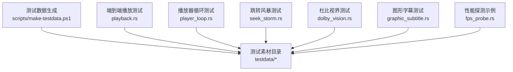
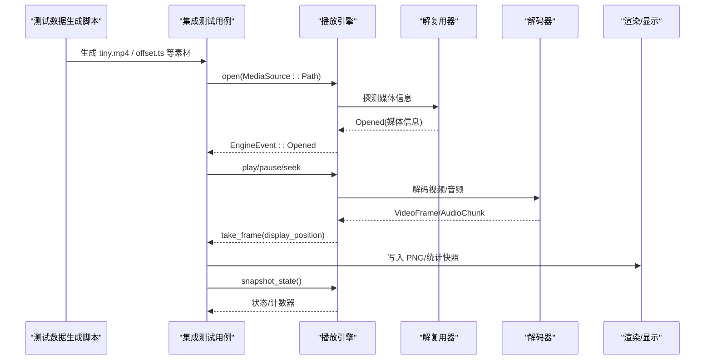
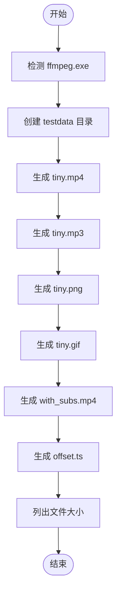
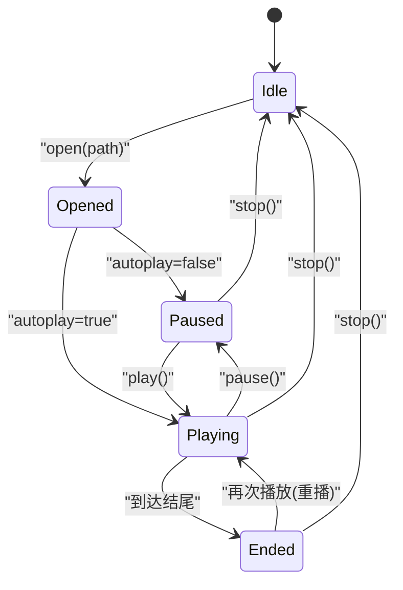
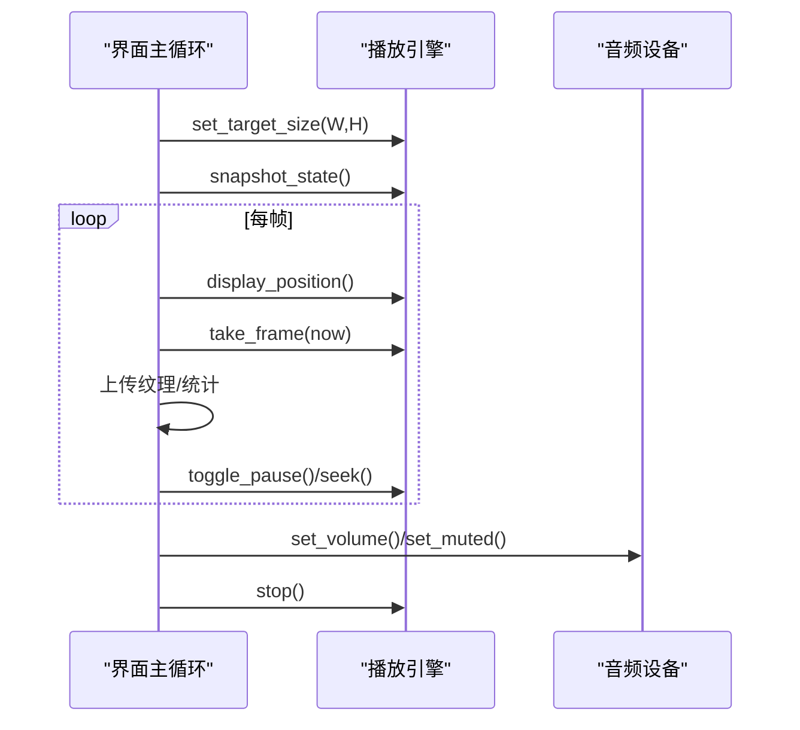
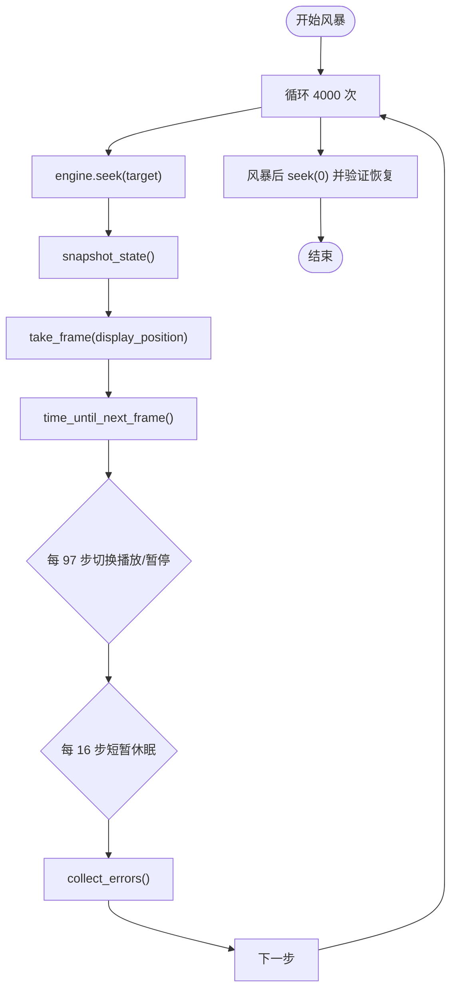
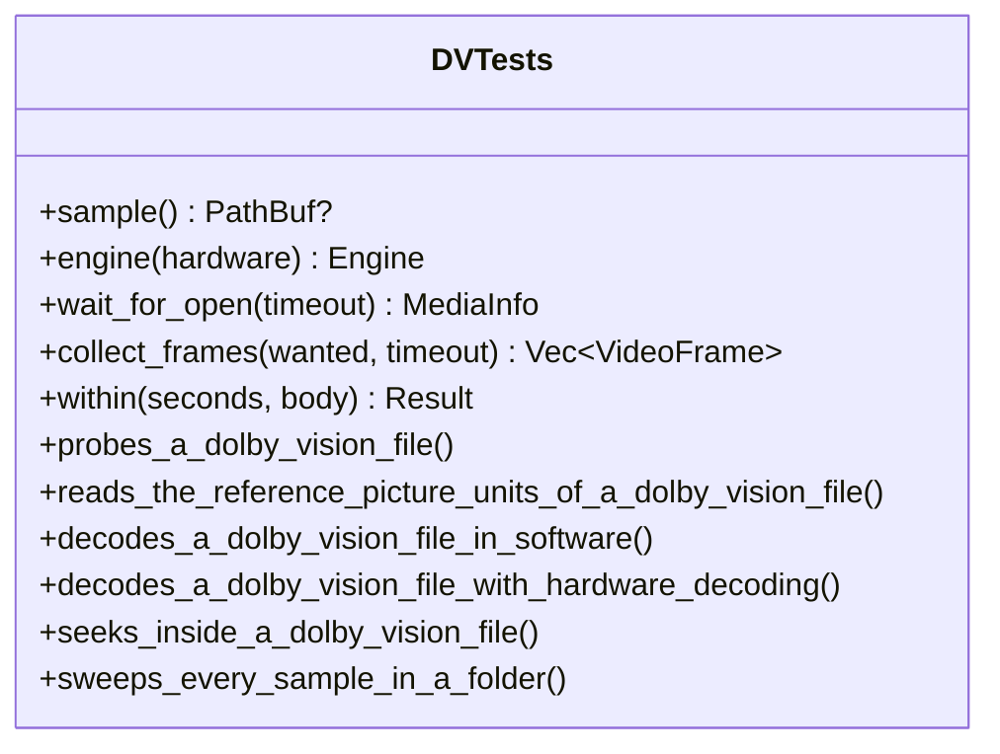
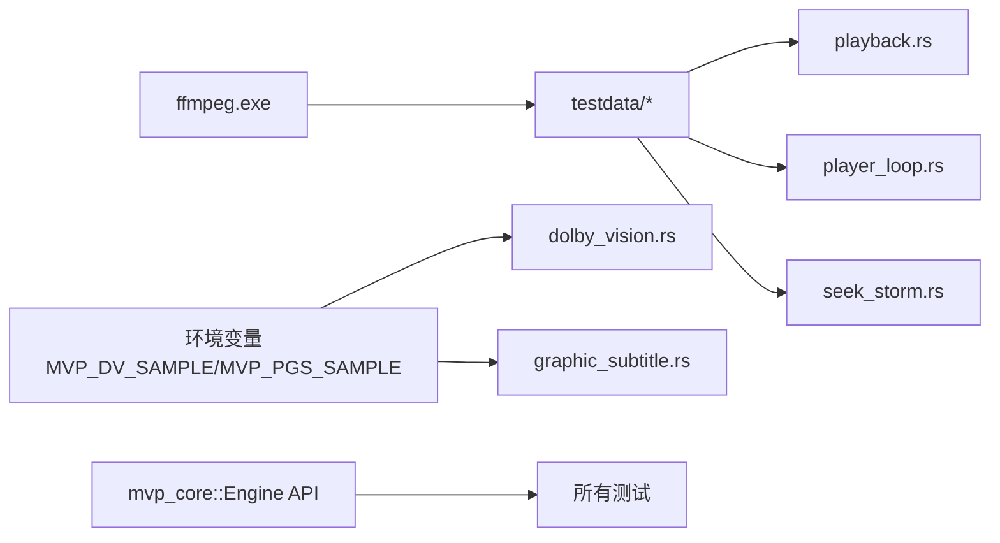

# 集成测试

<cite>
**本文引用的文件**   
- [scripts/make-testdata.ps1](file://scripts/make-testdata.ps1)
- [crates/mvp-core/tests/playback.rs](file://crates/mvp-core/tests/playback.rs)
- [crates/mvp-core/tests/player_loop.rs](file://crates/mvp-core/tests/player_loop.rs)
- [crates/mvp-core/tests/seek_storm.rs](file://crates/mvp-core/tests/seek_storm.rs)
- [crates/mvp-core/tests/dolby_vision.rs](file://crates/mvp-core/tests/dolby_vision.rs)
- [crates/mvp-core/tests/graphic_subtitle.rs](file://crates/mvp-core/tests/graphic_subtitle.rs)
- [crates/mvp-core/examples/fps_probe.rs](file://crates/mvp-core/examples/fps_probe.rs)
</cite>

## 目录
1. [引言](#引言)
2. [项目结构](#项目结构)
3. [核心组件](#核心组件)
4. [架构总览](#架构总览)
5. [详细组件分析](#详细组件分析)
6. [依赖关系分析](#依赖关系分析)
7. [性能考虑](#性能考虑)
8. [故障排查指南](#故障排查指南)
9. [结论](#结论)
10. [附录](#附录)

## 引言
本文件面向“集成测试”目标，系统性说明端到端播放测试、测试数据生成、播放状态机验证、多线程环境下的测试策略、性能基准与持续集成执行方式。文档以仓库中已有的测试代码和脚本为依据，不引入外部假设；所有实现细节均通过具体文件路径与行号进行溯源。

## 项目结构
与集成测试直接相关的代码集中在以下位置：
- 测试数据生成脚本：`scripts/make-testdata.ps1`
- 端到端播放与媒体解码测试：`crates/mvp-core/tests/playback.rs`
- 播放器调用序列与线程交互测试：`crates/mvp-core/tests/player_loop.rs`
- 高并发跳转风暴测试：`crates/mvp-core/tests/seek_storm.rs`
- 可选的杜比视界与图形字幕测试：`crates/mvp-core/tests/dolby_vision.rs`、`crates/mvp-core/tests/graphic_subtitle.rs`
- 性能探测示例（非严格基准）：`crates/mvp-core/examples/fps_probe.rs`

**图表来源**
- [scripts/make-testdata.ps1:1-79](file://scripts/make-testdata.ps1#L1-L79)
- [crates/mvp-core/tests/playback.rs:1-771](file://crates/mvp-core/tests/playback.rs#L1-L771)
- [crates/mvp-core/tests/player_loop.rs:1-653](file://crates/mvp-core/tests/player_loop.rs#L1-L653)
- [crates/mvp-core/tests/seek_storm.rs:1-138](file://crates/mvp-core/tests/seek_storm.rs#L1-L138)
- [crates/mvp-core/tests/dolby_vision.rs:1-459](file://crates/mvp-core/tests/dolby_vision.rs#L1-L459)
- [crates/mvp-core/tests/graphic_subtitle.rs:1-78](file://crates/mvp-core/tests/graphic_subtitle.rs#L1-L78)
- [crates/mvp-core/examples/fps_probe.rs:1-32](file://crates/mvp-core/examples/fps_probe.rs#L1-L32)

**章节来源**
- [scripts/make-testdata.ps1:1-79](file://scripts/make-testdata.ps1#L1-L79)
- [crates/mvp-core/tests/playback.rs:1-771](file://crates/mvp-core/tests/playback.rs#L1-L771)
- [crates/mvp-core/tests/player_loop.rs:1-653](file://crates/mvp-core/tests/player_loop.rs#L1-L653)
- [crates/mvp-core/tests/seek_storm.rs:1-138](file://crates/mvp-core/tests/seek_storm.rs#L1-L138)
- [crates/mvp-core/tests/dolby_vision.rs:1-459](file://crates/mvp-core/tests/dolby_vision.rs#L1-L459)
- [crates/mvp-core/tests/graphic_subtitle.rs:1-78](file://crates/mvp-core/tests/graphic_subtitle.rs#L1-L78)
- [crates/mvp-core/examples/fps_probe.rs:1-32](file://crates/mvp-core/examples/fps_probe.rs#L1-L32)

## 核心组件
本节聚焦集成测试的关键能力：真实媒体解码、时间戳单调性、跳转准确性、状态机转换、多线程鲁棒性与性能观测。

- 真实媒体解码验证
  - 使用 `Engine::open` 打开由脚本生成的媒体文件，等待 `Opened` 事件并校验流信息（分辨率、帧率、编解码器、时长等）。
  - 采集解码帧，检查像素格式、尺寸、数据长度、时间戳合法性与非递减顺序。
  - 对图片与 GIF 单独验证几何尺寸、帧数与动画时长。

- 时间戳单调性检查
  - 在稳态播放与多次 seek 后，断言帧 PTS 非递减，且显示位置与墙钟一致，避免时钟漂移或回退。

- 跳转准确性测试
  - 普通 MP4 跳转到指定秒数，允许关键帧略早但不得明显滞后。
  - 针对容器起始时间偏移（如 TS 从 4200s 开始），确保播放时间与容器时间正确换算，跳转结果落在预期区间。

- 播放状态机验证
  - 打开文件、自动播放、暂停恢复、停止重置、结束重播等状态转换均有断言覆盖。
  - 关闭引擎后应回到空闲态，不再输出帧；重复 stop 安全。

- 多线程环境测试策略
  - 模拟 UI 主循环与渲染线程的调用顺序：设置目标分辨率、快照状态、取帧、切换暂停等高频操作。
  - 音频设备队列与丢包计数用于判断是否出现欠载；音量/静音控制需真正到达设备。
  - 跳转风暴下，大量 seek、pause/play 交替、极端目标值（最大值、负值、NaN）仍保持管道存活并可恢复。

- 性能基准与监控
  - 示例程序 `fps_probe` 按界面驱动方式拉取帧，打印管线计数器，衡量每秒帧数与每帧耗时。
  - 测试中通过快照统计解码帧、丢弃帧、队列长度、音频缓冲秒数与欠载次数，作为回归保护。

**章节来源**
- [crates/mvp-core/tests/playback.rs:1-771](file://crates/mvp-core/tests/playback.rs#L1-L771)
- [crates/mvp-core/tests/player_loop.rs:1-653](file://crates/mvp-core/tests/player_loop.rs#L1-L653)
- [crates/mvp-core/tests/seek_storm.rs:1-138](file://crates/mvp-core/tests/seek_storm.rs#L1-L138)
- [crates/mvp-core/examples/fps_probe.rs:1-32](file://crates/mvp-core/examples/fps_probe.rs#L1-L32)

## 架构总览
集成测试围绕“测试数据生成 → 引擎打开媒体 → 事件轮询与帧消费 → 状态与指标断言”的主线展开。下图展示端到端流程与关键组件交互。

**图表来源**
- [scripts/make-testdata.ps1:31-74](file://scripts/make-testdata.ps1#L31-L74)
- [crates/mvp-core/tests/playback.rs:48-75](file://crates/mvp-core/tests/playback.rs#L48-L75)
- [crates/mvp-core/tests/player_loop.rs:35-90](file://crates/mvp-core/tests/player_loop.rs#L35-L90)
- [crates/mvp-core/examples/fps_probe.rs:1-32](file://crates/mvp-core/examples/fps_probe.rs#L1-L32)

## 详细组件分析

### 测试数据生成工具 scripts/make-testdata.ps1
该脚本负责再生成端到端测试所需的媒体夹具，默认输出到 `testdata` 目录。其关键点如下：
- 参数与查找逻辑：支持通过 `-Ffmpeg` 指定 ffmpeg 路径；若未提供则尝试系统 PATH 中的 `ffmpeg.exe`。
- 输出目录：自动创建 `testdata` 目录。
- 封装函数：`Invoke-Ffmpeg` 统一调用 ffmpeg，失败时抛出错误。
- 样本生成：
  - `tiny.mp4`：3 秒、320x240、H.264 + AAC。
  - `tiny.mp3`：2 秒纯音频。
  - `tiny.png`：320x240 静态图。
  - `tiny.gif`：循环动画。
  - `with_subs.mp4`：带内嵌字幕的视频。
  - `offset.ts`：MPEG-TS，时间轴从 4200s 开始，用于验证容器时间偏移场景下的跳转。

**图表来源**
- [scripts/make-testdata.ps1:9-29](file://scripts/make-testdata.ps1#L9-L29)
- [scripts/make-testdata.ps1:31-74](file://scripts/make-testdata.ps1#L31-L74)

**章节来源**
- [scripts/make-testdata.ps1:1-79](file://scripts/make-testdata.ps1#L1-L79)

### 端到端播放测试 playback.rs
该文件是端到端测试的核心，覆盖真实媒体文件的解码、时间戳单调性、跳转准确性、字幕处理、图像加载与子标题解析等。

- 打开与探测
  - 等待 `Opened` 事件，断言视频/音频流数量、分辨率、帧率、编解码器、时长与大小。
  - 对缺失文件与垃圾输入进行错误处理验证。

- 自动播放与暂停恢复
  - 根据 `autoplay` 配置，打开文件后应为暂停或播放状态。
  - 暂停期间时钟冻结，恢复后时钟继续前进。

- 解码帧与时序
  - 采集多帧，检查有效性、尺寸、数据长度、PTS 有限性与非递减顺序。
  - 最后一帧非全黑，证明颜色转换有效。

- 跳转准确性
  - 普通 MP4 跳转到 2.0s，允许关键帧略早，不得明显滞后。
  - 容器起始时间偏移（offset.ts）下，跳转必须落在请求位置之后且不超出媒体时长。

- 字幕与图片
  - 内嵌文本字幕可被选择并解码为提示，支持按时间查询。
  - 默认字幕轨道无需用户选择即可启用。
  - PNG/GIF 几何尺寸、帧数与动画时长正确。

- 状态机
  - 停止后回到空闲态，不再输出帧；重复 stop 安全。
  - 播放到结尾后再次播放应从头重播，而非时钟越界。

- 显示位置上限
  - 即使存在音频延迟或频繁 seek，显示位置不应超过媒体时长。

**图表来源**
- [crates/mvp-core/tests/playback.rs:105-146](file://crates/mvp-core/tests/playback.rs#L105-L146)
- [crates/mvp-core/tests/playback.rs:324-354](file://crates/mvp-core/tests/playback.rs#L324-L354)
- [crates/mvp-core/tests/playback.rs:499-512](file://crates/mvp-core/tests/playback.rs#L499-L512)
- [crates/mvp-core/tests/playback.rs:520-589](file://crates/mvp-core/tests/playback.rs#L520-L589)

**章节来源**
- [crates/mvp-core/tests/playback.rs:1-771](file://crates/mvp-core/tests/playback.rs#L1-L771)

### 播放器循环与多线程测试 player_loop.rs
该文件复现界面主循环的调用顺序，重点验证：
- 帧生产与唯一所有权：每帧必须可被界面独占使用，否则纹理上传会静默失败。
- 队列填满后画面不冻结：解码队列不会因驱逐旧帧导致后续无可用帧。
- 音频设备可达性：音频队列长度与欠载次数在合理范围。
- 禁用轨道不阻塞解复用器：各种 subtitle/audio 组合下仍可解码。
- 反复切换播放/暂停与暂停中跳转的安全性。
- 稳态播放时钟与墙钟一致，丢弃帧与解码帧计数合理。
- 播放中多次 seek 后时钟一致性，且仍有帧产出。
- 目标分辨率收敛到可用值，避免缩放到缩略图。
- 移动播放头保留已解码帧，避免不必要的重新解码。
- 音量与静音真正到达设备，新打开文件继承当前音量。
- 停止释放工作线程及时，不等待解码积压。

**图表来源**
- [crates/mvp-core/tests/player_loop.rs:35-90](file://crates/mvp-core/tests/player_loop.rs#L35-L90)
- [crates/mvp-core/tests/player_loop.rs:232-262](file://crates/mvp-core/tests/player_loop.rs#L232-L262)
- [crates/mvp-core/tests/player_loop.rs:501-582](file://crates/mvp-core/tests/player_loop.rs#L501-L582)
- [crates/mvp-core/tests/player_loop.rs:599-653](file://crates/mvp-core/tests/player_loop.rs#L599-L653)

**章节来源**
- [crates/mvp-core/tests/player_loop.rs:1-653](file://crates/mvp-core/tests/player_loop.rs#L1-L653)

### 跳转风暴测试 seek_storm.rs
该测试模拟快速拖动进度条产生的大量 seek，同时穿插 pause/play 与极端目标值，验证：
- 引擎不因中断回调导致的临时错误而崩溃。
- 风暴结束后引擎仍可响应新的 seek 并恢复播放。
- 收集所有非例行错误事件与状态，风暴期间应保持为空。

**图表来源**
- [crates/mvp-core/tests/seek_storm.rs:50-137](file://crates/mvp-core/tests/seek_storm.rs#L50-L137)

**章节来源**
- [crates/mvp-core/tests/seek_storm.rs:1-138](file://crates/mvp-core/tests/seek_storm.rs#L1-L138)

### 杜比视界与图形字幕测试 dolby_vision.rs / graphic_subtitle.rs
- Dolby Vision 测试为可选，通过环境变量 `MVP_DV_SAMPLE` 或 `MVP_DV_DIR` 指定样本路径或目录。
- 覆盖 probe、RPU 读取、软件/硬件解码、跳转与文件夹扫描。
- 每个阶段使用超时与线程包装，区分 panic 与 hang，避免测试永久挂起。
- 图形字幕测试通过 `MVP_PGS_SAMPLE` 指定 PGS/VobSub 样本，验证外部图形字幕解码为位图提示，并按时间激活。

**图表来源**
- [crates/mvp-core/tests/dolby_vision.rs:23-113](file://crates/mvp-core/tests/dolby_vision.rs#L23-L113)
- [crates/mvp-core/tests/dolby_vision.rs:117-459](file://crates/mvp-core/tests/dolby_vision.rs#L117-L459)

**章节来源**
- [crates/mvp-core/tests/dolby_vision.rs:1-459](file://crates/mvp-core/tests/dolby_vision.rs#L1-L459)
- [crates/mvp-core/tests/graphic_subtitle.rs:1-78](file://crates/mvp-core/tests/graphic_subtitle.rs#L1-L78)

## 依赖关系分析
集成测试依赖以下核心能力与外部工具：
- 测试数据生成依赖 ffmpeg；脚本自动查找或接受参数传入。
- 测试用例依赖 `mvp_core::Engine`、`MediaSource`、`EngineEvent`、`PlaybackState`、`ImageView` 等 API。
- 部分测试需要音频输出设备；若无设备则跳过相关断言。
- 杜比视界与图形字幕测试依赖环境变量提供的样本路径。

**图表来源**
- [scripts/make-testdata.ps1:11-29](file://scripts/make-testdata.ps1#L11-L29)
- [crates/mvp-core/tests/playback.rs:9-14](file://crates/mvp-core/tests/playback.rs#L9-L14)
- [crates/mvp-core/tests/dolby_vision.rs:23-33](file://crates/mvp-core/tests/dolby_vision.rs#L23-L33)
- [crates/mvp-core/tests/graphic_subtitle.rs:21-31](file://crates/mvp-core/tests/graphic_subtitle.rs#L21-L31)

**章节来源**
- [scripts/make-testdata.ps1:1-79](file://scripts/make-testdata.ps1#L1-L79)
- [crates/mvp-core/tests/playback.rs:1-771](file://crates/mvp-core/tests/playback.rs#L1-L771)
- [crates/mvp-core/tests/dolby_vision.rs:1-459](file://crates/mvp-core/tests/dolby_vision.rs#L1-L459)
- [crates/mvp-core/tests/graphic_subtitle.rs:1-78](file://crates/mvp-core/tests/graphic_subtitle.rs#L1-L78)

## 性能考虑
虽然仓库未提供正式的基准套件，但已有示例与测试包含性能观测与保护性断言：
- 示例 `fps_probe` 按界面驱动方式拉取帧，打印管线计数器，衡量每秒帧数与每帧耗时。
- 测试中使用 `snapshot_state()` 获取解码帧、丢弃帧、队列长度、音频缓冲秒数与欠载次数，作为回归保护。
- 图片分析测试断言分析复杂度不随分辨率线性增长，避免 4K 帧导致 CPU 占用异常。

建议在实际 CI 环境中：
- 记录 `fps_probe` 的输出，对比历史基线。
- 监控测试运行时的内存与 CPU 使用率（例如通过系统工具或 CI 平台指标）。
- 将关键断言（如丢弃帧数量、音频欠载次数）纳入告警阈值。

**章节来源**
- [crates/mvp-core/examples/fps_probe.rs:1-32](file://crates/mvp-core/examples/fps_probe.rs#L1-L32)
- [crates/mvp-core/tests/player_loop.rs:142-191](file://crates/mvp-core/tests/player_loop.rs#L142-L191)
- [crates/mvp-player/src/picture.rs:732-749](file://crates/mvp-player/src/picture.rs#L732-L749)

## 故障排查指南
常见问题与定位方法：
- 测试跳过：当 fixture 缺失或环境变量未设置时，测试会跳过；检查 `testdata` 是否存在或通过脚本重新生成。
- 引擎错误事件：通过 `poll_event()` 收集 `Error` 事件与 `StateChanged(Error(...))`，结合日志查看具体原因。
- 时钟不回退：断言帧 PTS 非递减；若失败，检查解码器与时间源。
- 跳转失败：检查容器起始时间偏移与关键帧间隔；必要时启用日志观察 demuxer 行为。
- 音频欠载：检查音频队列长度与欠载计数；确认设备可达与音量/静音控制生效。
- 停止卡顿：确认停止释放工作线程及时，避免等待解码积压。

**章节来源**
- [crates/mvp-core/tests/playback.rs:657-699](file://crates/mvp-core/tests/playback.rs#L657-L699)
- [crates/mvp-core/tests/seek_storm.rs:30-48](file://crates/mvp-core/tests/seek_storm.rs#L30-L48)
- [crates/mvp-core/tests/player_loop.rs:599-653](file://crates/mvp-core/tests/player_loop.rs#L599-L653)

## 结论
本项目的集成测试覆盖了端到端播放、时间戳单调性、跳转准确性、状态机转换、多线程鲁棒性与性能观测等多个维度。测试数据生成脚本提供了轻量级媒体样本，便于在无 FFmpeg 环境下运行基础测试；可选的杜比视界与图形字幕测试通过环境变量扩展了高级场景。建议在持续集成中结合性能探测示例与系统指标，建立回归基线与告警机制，确保播放质量与稳定性。

## 附录
- 运行测试数据生成脚本：
  - PowerShell：`.\scripts\make-testdata.ps1 [-Ffmpeg <path\to\ffmpeg.exe>]`
- 运行端到端测试：
  - `cargo test -p mvp-core --test playback`
- 运行播放器循环测试：
  - `cargo test -p mvp-core --test player_loop`
- 运行跳转风暴测试：
  - `cargo test -p mvp-core --test seek_storm`
- 运行杜比视界测试（可选）：
  - 设置 `MVP_DV_SAMPLE` 或 `MVP_DV_DIR`，然后 `cargo test -p mvp-core --test dolby_vision -- --nocapture`
- 运行图形字幕测试（可选）：
  - 设置 `MVP_PGS_SAMPLE`，然后 `cargo test -p mvp-core --test graphic_subtitle -- --nocapture`
- 运行性能探测示例：
  - `cargo run -p mvp-core --release --example fps_probe <file-or-url> [seconds] [screen-hz] [WxH] [--software]`