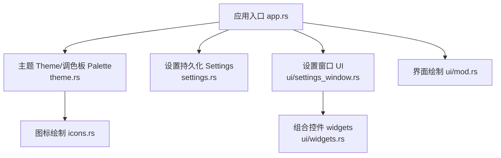
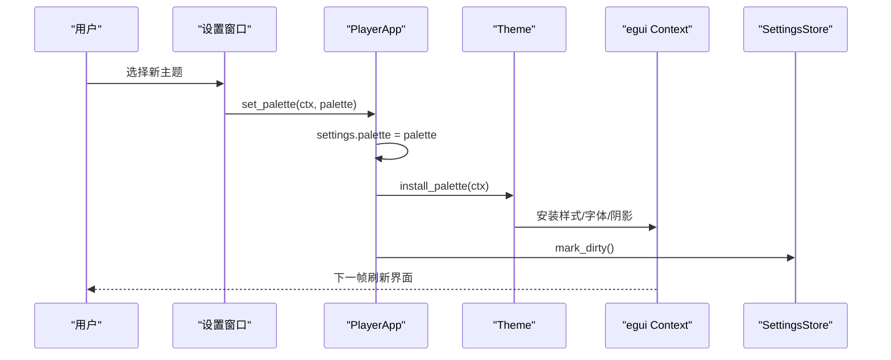
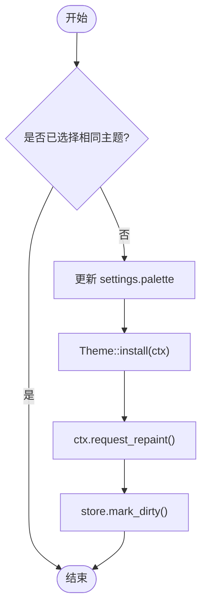
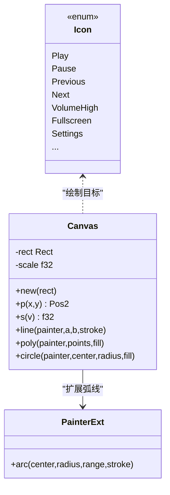
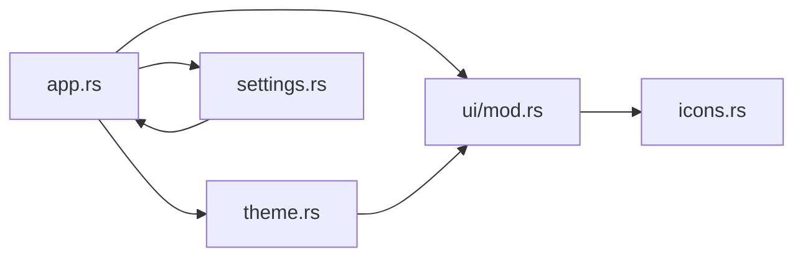

# 主题系统

<cite>
**本文引用的文件**
- [theme.rs](file://crates/mvp-player/src/theme.rs)
- [icons.rs](file://crates/mvp-player/src/icons.rs)
- [settings.rs](file://crates/mvp-player/src/settings.rs)
- [app.rs](file://crates/mvp-player/src/app.rs)
- [ui/mod.rs](file://crates/mvp-player/src/ui/mod.rs)
- [settings_window.rs](file://crates/mvp-player/src/ui/settings_window.rs)
</cite>

## 目录
1. [简介](#简介)
2. [项目结构](#项目结构)
3. [核心组件](#核心组件)
4. [架构总览](#架构总览)
5. [详细组件分析](#详细组件分析)
6. [依赖关系分析](#依赖关系分析)
7. [性能考量](#性能考量)
8. [故障排查指南](#故障排查指南)
9. [结论](#结论)
10. [附录](#附录)

## 简介
本文件系统性梳理 MVP Versatile Player 的主题系统，覆盖五种配色方案的设计理念与使用场景、主题数据结构（颜色令牌、字体与间距）、动态主题切换机制、主题持久化存储与用户偏好管理、图标资源组织与加载方式，以及主题扩展方法、自定义主题开发、第三方主题集成思路。同时提供主题调试工具、颜色对比度检查与无障碍访问支持建议。

## 项目结构
主题系统位于 mvp-player 子模块中，围绕 theme.rs 构建，配合 icons.rs 的矢量图标、settings.rs 的用户设置持久化、app.rs 的应用生命周期与安装逻辑、ui 层的设置窗口与绘制流程共同完成“选择—应用—保存—重绘”的闭环。

图表来源
- [app.rs:1360-1378](file://crates/mvp-player/src/app.rs#L1360-L1378)
- [theme.rs:85-176](file://crates/mvp-player/src/theme.rs#L85-L176)
- [settings.rs:596-772](file://crates/mvp-player/src/settings.rs#L596-L772)
- [settings_window.rs:157-166](file://crates/mvp-player/src/ui/settings_window.rs#L157-L166)
- [icons.rs:1-15](file://crates/mvp-player/src/icons.rs#L1-L15)
- [ui/mod.rs:48-144](file://crates/mvp-player/src/ui/mod.rs#L48-L144)

章节来源
- [app.rs:1360-1378](file://crates/mvp-player/src/app.rs#L1360-L1378)
- [theme.rs:85-176](file://crates/mvp-player/src/theme.rs#L85-L176)
- [settings.rs:596-772](file://crates/mvp-player/src/settings.rs#L596-L772)
- [settings_window.rs:157-166](file://crates/mvp-player/src/ui/settings_window.rs#L157-L166)
- [icons.rs:1-15](file://crates/mvp-player/src/icons.rs#L1-L15)
- [ui/mod.rs:48-144](file://crates/mvp-player/src/ui/mod.rs#L48-L144)

## 核心组件
- 调色板枚举与标签：定义五种内置深色主题，并提供显示名称与列表。
- 颜色令牌 Tokens：统一的颜色命名空间，所有界面元素通过令牌取值，保证一致性与可维护性。
- 配方 Recipe 与透明度 alpha：将基础色派生为悬停、选中、边框等半透明填充，确保不同主题下交互状态一致。
- 主题 Theme：聚合令牌并安装到 egui 上下文，包含字体栈、圆角、阴影、滚动条等样式。
- 图标系统 icons：基于 24x24 网格的矢量图标，按当前状态着色，无需位图或字体。
- 设置持久化 settings：JSON 文档保存用户偏好，包括所选主题。
- 应用层安装 app：启动时与应用内切换时安装主题，触发重绘与持久化。

章节来源
- [theme.rs:85-176](file://crates/mvp-player/src/theme.rs#L85-L176)
- [theme.rs:178-364](file://crates/mvp-player/src/theme.rs#L178-L364)
- [theme.rs:588-731](file://crates/mvp-player/src/theme.rs#L588-L731)
- [icons.rs:83-174](file://crates/mvp-player/src/icons.rs#L83-L174)
- [settings.rs:596-772](file://crates/mvp-player/src/settings.rs#L596-L772)
- [app.rs:1360-1378](file://crates/mvp-player/src/app.rs#L1360-L1378)

## 架构总览
主题系统遵循“数据驱动 + 令牌化 + 一次性安装”的架构：
- 数据层：Palette 枚举 + Recipe 基础色 + alpha 透明度表。
- 令牌层：Tokens 暴露给 UI 各组件。
- 安装层：Theme::install 将 Tokens 写入 egui 上下文，固定暗色主题，避免跟随系统导致不一致。
- 交互层：设置窗口提供主题选择；应用层在切换时更新设置并持久化。
- 渲染层：图标与控件按令牌与状态自动着色。

图表来源
- [settings_window.rs:157-166](file://crates/mvp-player/src/ui/settings_window.rs#L157-L166)
- [app.rs:1360-1378](file://crates/mvp-player/src/app.rs#L1360-L1378)
- [theme.rs:596-731](file://crates/mvp-player/src/theme.rs#L596-L731)
- [settings.rs:596-772](file://crates/mvp-player/src/settings.rs#L596-L772)

## 详细组件分析

### 五种配色方案与设计理念
- 原版蓝（默认）：高饱和蓝色强调，适合喜欢经典深色界面的用户。
- 陶土灰：暖灰基底配陶土强调色，降低视觉干扰，适合长时间观看。
- 灰绿：暖灰基底配低饱和鼠尾草绿强调色，自然柔和。
- 雾蓝：冷灰基底配低饱和石板蓝强调色，适合偏好冷色调的用户。
- 藕紫：暖灰基底配低饱和藕紫强调色，优雅克制。

设计原则
- 层次来自颜色而非线条：分隔线采用半透明白色，适配任意表面。
- 4pt 网格与 Apple 圆角：面板对齐一致，提升整体秩序感。
- 强调色仅用于交互与当前态：不用于装饰，保持画面主体突出。

章节来源
- [theme.rs:1-40](file://crates/mvp-player/src/theme.rs#L1-L40)
- [theme.rs:85-176](file://crates/mvp-player/src/theme.rs#L85-L176)
- [theme.rs:366-481](file://crates/mvp-player/src/theme.rs#L366-L481)

### 主题数据结构与颜色定义
- Palette：主题枚举，提供 all()/label()/choices() 等方法，供设置页展示。
- Recipe：每个主题的“基础色”，包含背景、面板、卡片、下沉区域、文本、强调色等。
- alpha：统一的半透明强度表，派生 hover、active、border、track、separator、accent_soft、focus_ring 等。
- Tokens：对外暴露的颜色令牌集合，UI 通过 Tokens 获取颜色，不直接耦合具体 Palette。
- 图片背景光晕：light_surround 根据主题返回合适的浅色背景，避免色偏。

复杂度与性能
- 令牌生成 O(1)，每次主题切换仅重新计算一次。
- 半透明填充复用同一白色基色，减少主题间差异带来的维护成本。

章节来源
- [theme.rs:178-364](file://crates/mvp-player/src/theme.rs#L178-L364)
- [theme.rs:484-498](file://crates/mvp-player/src/theme.rs#L484-L498)
- [theme.rs:158-176](file://crates/mvp-player/src/theme.rs#L158-L176)

### 字体配置与排版
- 字体族：优先使用系统字体，标题尝试加载加粗字重，缺失时回退。
- 字号体系：tiny/small/body/h3/h2/h1，对应时间戳、说明文字、正文、分组标题、窗口标题等。
- 等宽字体：用于进度条时间戳，候选字体按系统可用性选择。
- 按钮缩放：按钮几何统一放大，保证触控友好。

章节来源
- [theme.rs:500-586](file://crates/mvp-player/src/theme.rs#L500-L586)
- [theme.rs:768-800](file://crates/mvp-player/src/theme.rs#L768-L800)

### 动态主题切换机制
- 入口：设置窗口调用 set_palette，更新 settings.palette，并调用 install_palette。
- 安装：Theme::of 构造主题，Theme::install 将样式注入 egui Context，并固定暗色主题以避免系统主题切换导致的界面不一致。
- 重绘：请求下一帧刷新，确保即时反馈。
- 持久化：mark_dirty 标记设置变更，异步落盘。

图表来源
- [app.rs:1360-1378](file://crates/mvp-player/src/app.rs#L1360-L1378)
- [theme.rs:596-731](file://crates/mvp-player/src/theme.rs#L596-L731)
- [settings.rs:596-772](file://crates/mvp-player/src/settings.rs#L596-L772)

章节来源
- [app.rs:1360-1378](file://crates/mvp-player/src/app.rs#L1360-L1378)
- [theme.rs:596-731](file://crates/mvp-player/src/theme.rs#L596-L731)
- [settings_window.rs:157-166](file://crates/mvp-player/src/ui/settings_window.rs#L157-L166)

### 主题持久化存储与用户偏好管理
- 存储位置：单 JSON 文档，便于检查与重置。
- 安全写入：临时文件 + 原子重命名，防止崩溃损坏配置。
- 字段：palette 为用户首选主题；其他外观相关项如图片背景、窗口尺寸等一并持久化。
- 迁移兼容：未知键忽略，旧配置仍可加载。

章节来源
- [settings.rs:1-11](file://crates/mvp-player/src/settings.rs#L1-L11)
- [settings.rs:596-772](file://crates/mvp-player/src/settings.rs#L596-L772)

### 图标资源的组织结构与加载机制
- 矢量绘制：所有图标以 24x24 网格绘制，按目标矩形缩放，无位图与字体依赖。
- 状态着色：图标颜色由当前状态决定（悬停、按下、禁用），无需额外 tint。
- 统一画布：Canvas 将网格坐标映射到实际矩形，保证一致性。
- 控件封装：icon_button 与 primary_transport_button 提供标准交互与尺寸。

图表来源
- [icons.rs:16-81](file://crates/mvp-player/src/icons.rs#L16-L81)
- [icons.rs:83-174](file://crates/mvp-player/src/icons.rs#L83-L174)
- [icons.rs:176-549](file://crates/mvp-player/src/icons.rs#L176-L549)

章节来源
- [icons.rs:1-15](file://crates/mvp-player/src/icons.rs#L1-L15)
- [icons.rs:16-81](file://crates/mvp-player/src/icons.rs#L16-L81)
- [icons.rs:83-174](file://crates/mvp-player/src/icons.rs#L83-L174)
- [icons.rs:176-549](file://crates/mvp-player/src/icons.rs#L176-L549)

### 主题扩展方法与自定义主题开发
- 新增主题步骤：
  1) 在 Palette 枚举中添加新变体，并在 all()/label()/choices() 中注册。
  2) 在 Recipe 中为该变体定义基础色（bg、panel、elevated、sunken、wash、text、text_weak、text_muted、accent、accent_hover、accent_pressed、success、warning、danger）。
  3) 若需要新的图片背景光晕，可在 light_surround 中补充。
  4) 运行测试约束（如对比度与饱和度限制），确保新主题符合设计规范。
- 注意事项：
  - 半透明填充由 alpha 表派生，不要重复定义，以保持交互状态一致。
  - 强调色需满足 WCAG 对比度要求，保证可读性。
  - 保持暗色基调，避免引入亮色主题破坏整体一致性。

章节来源
- [theme.rs:85-176](file://crates/mvp-player/src/theme.rs#L85-L176)
- [theme.rs:366-481](file://crates/mvp-player/src/theme.rs#L366-L481)
- [theme.rs:158-176](file://crates/mvp-player/src/theme.rs#L158-L176)

### 第三方主题集成
- 插件化思路：
  - 将 Palette 与 Tokens 抽象为可替换接口，允许外部库提供主题包。
  - 在设置窗口中列出第三方主题，并通过相同的 install_palette 流程应用。
  - 通过版本化与兼容性检查，确保第三方主题与主程序 API 一致。
- 集成要点：
  - 遵循现有 Tokens 命名约定，避免破坏布局与对比度。
  - 提供最小可用集（至少包含 bg、panel、elevated、text、accent 等）。
  - 提供测试用例验证对比度与语义色一致性。

[本节为概念性指导，未直接分析具体文件]

### 主题调试工具、颜色对比度检查与无障碍访问
- 调试工具：
  - 设置窗口中的“关于”页面可查看版本与 FFmpeg 构建信息，辅助定位渲染问题。
  - 界面统计面板可观察渲染耗时，帮助发现主题切换后的性能异常。
- 对比度检查：
  - 代码中包含对强调色与文本对比度的断言，确保 WCAG AA 达标。
  - 新增主题时需通过类似测试，避免误用高饱和或低对比度颜色。
- 无障碍访问：
  - 键盘焦点环使用强调色，确保键盘导航可见性。
  - 分隔线与边框使用半透明白色，在不同背景下保持一致的可读性。
  - 按钮与控件尺寸统一放大，提升触控可达性。

章节来源
- [theme.rs:596-731](file://crates/mvp-player/src/theme.rs#L596-L731)
- [ui/mod.rs:112-131](file://crates/mvp-player/src/ui/mod.rs#L112-L131)
- [settings_window.rs:1-200](file://crates/mvp-player/src/ui/settings_window.rs#L1-L200)

## 依赖关系分析
- 应用层 app.rs 持有 Theme、Settings、UI 状态，负责生命周期与安装流程。
- 主题层 theme.rs 被 UI 与图标层引用，提供颜色与样式。
- 设置层 settings.rs 提供持久化模型，被应用层读写。
- 图标层 icons.rs 依赖 theme 的按钮尺寸与半径，保证视觉一致。
- UI 层 ui/mod.rs 协调各面板绘制顺序与性能优化。

图表来源
- [app.rs:1360-1378](file://crates/mvp-player/src/app.rs#L1360-L1378)
- [theme.rs:596-731](file://crates/mvp-player/src/theme.rs#L596-L731)
- [settings.rs:596-772](file://crates/mvp-player/src/settings.rs#L596-L772)
- [icons.rs:176-549](file://crates/mvp-player/src/icons.rs#L176-L549)
- [ui/mod.rs:48-144](file://crates/mvp-player/src/ui/mod.rs#L48-L144)

章节来源
- [app.rs:1360-1378](file://crates/mvp-player/src/app.rs#L1360-L1378)
- [theme.rs:596-731](file://crates/mvp-player/src/theme.rs#L596-L731)
- [settings.rs:596-772](file://crates/mvp-player/src/settings.rs#L596-L772)
- [icons.rs:176-549](file://crates/mvp-player/src/icons.rs#L176-L549)
- [ui/mod.rs:48-144](file://crates/mvp-player/src/ui/mod.rs#L48-L144)

## 性能考量
- 主题安装仅在切换或启动时执行，字体加载通过 OnceLock 缓存，避免重复开销。
- 半透明填充复用同一白色基色，减少主题间差异带来的计算量。
- 设置窗口进入页面时缓存 I/O 结果（设备列表、关联信息等），避免每帧读取。
- 隐藏窗口时降低刷新频率，减少不必要的解码与上传。

章节来源
- [theme.rs:608-731](file://crates/mvp-player/src/theme.rs#L608-L731)
- [settings_window.rs:20-31](file://crates/mvp-player/src/ui/settings_window.rs#L20-L31)
- [ui/mod.rs:146-283](file://crates/mvp-player/src/ui/mod.rs#L146-L283)

## 故障排查指南
- 主题不生效：
  - 确认设置窗口是否正确调用 set_palette，并触发了 request_repaint。
  - 检查 Theme::install 是否成功注入样式，尤其是 Visuals 与 Style。
- 颜色对比度不足：
  - 检查新增主题的 accent 与 on_accent 是否符合对比度要求。
  - 使用设置窗口的“关于”页面与统计面板辅助定位渲染问题。
- 图标显示异常：
  - 确认图标绘制矩形与缩放比例正确，避免溢出或裁剪。
  - 检查 icon_button 的尺寸是否与布局模型一致。
- 设置文件损坏：
  - 删除 settings.json 恢复默认，或使用临时文件+重命名的保护机制。

章节来源
- [app.rs:1360-1378](file://crates/mvp-player/src/app.rs#L1360-L1378)
- [theme.rs:596-731](file://crates/mvp-player/src/theme.rs#L596-L731)
- [icons.rs:648-784](file://crates/mvp-player/src/icons.rs#L648-L784)
- [settings.rs:1-11](file://crates/mvp-player/src/settings.rs#L1-L11)

## 结论
该主题系统以令牌化与配方为核心，通过五种精心设计的深色配色方案，兼顾美观与可用性。动态切换机制简洁高效，持久化存储安全可靠，图标系统轻量且灵活。通过对比度测试与无障碍设计，确保了良好的用户体验。未来可通过插件化扩展第三方主题，进一步丰富个性化选项。

## 附录
- 常用令牌与用途：
  - bg/panel/elevated/sunken：背景与层级表面。
  - text/text_weak/text_muted：文本层级。
  - accent/accent_hover/accent_pressed：交互强调。
  - border/border_strong/separator：分隔与轮廓。
  - success/warning/danger：状态语义色。
  - letterbox：视频黑边纯黑。
  - focus_ring：键盘焦点环。
- 常用尺寸与圆角：
  - space：2/4/8/12/16/24/32 pt 网格。
  - radius：5/8/12/16 pt 圆角。
  - button：统一放大系数与播放按钮直径。

章节来源
- [theme.rs:178-364](file://crates/mvp-player/src/theme.rs#L178-L364)
- [theme.rs:500-586](file://crates/mvp-player/src/theme.rs#L500-L586)