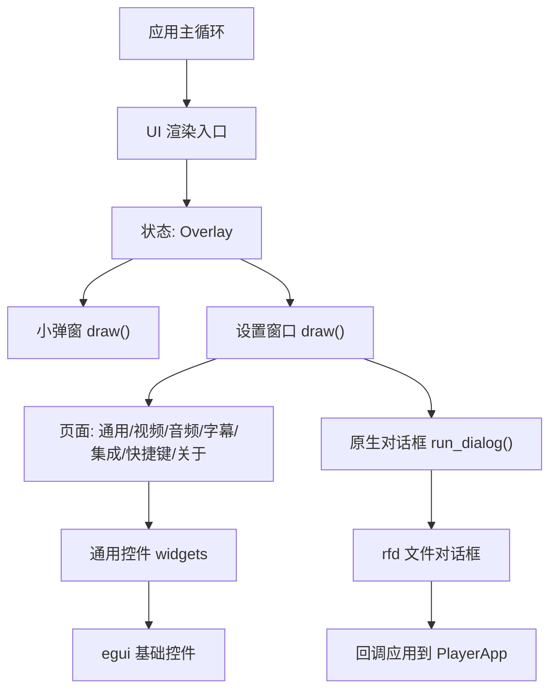
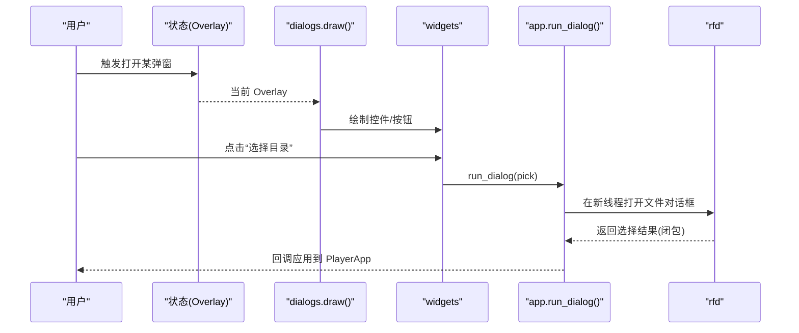
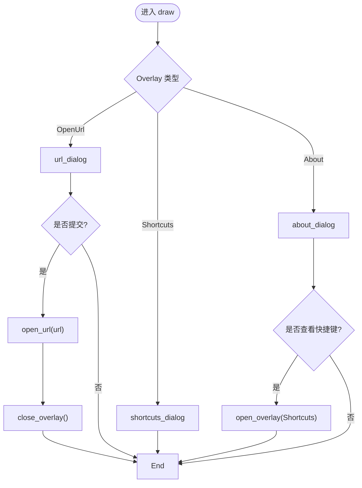
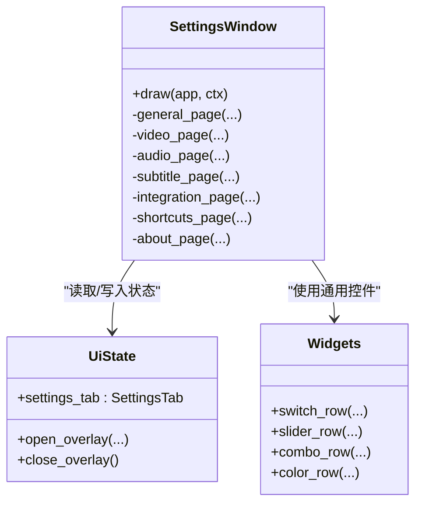
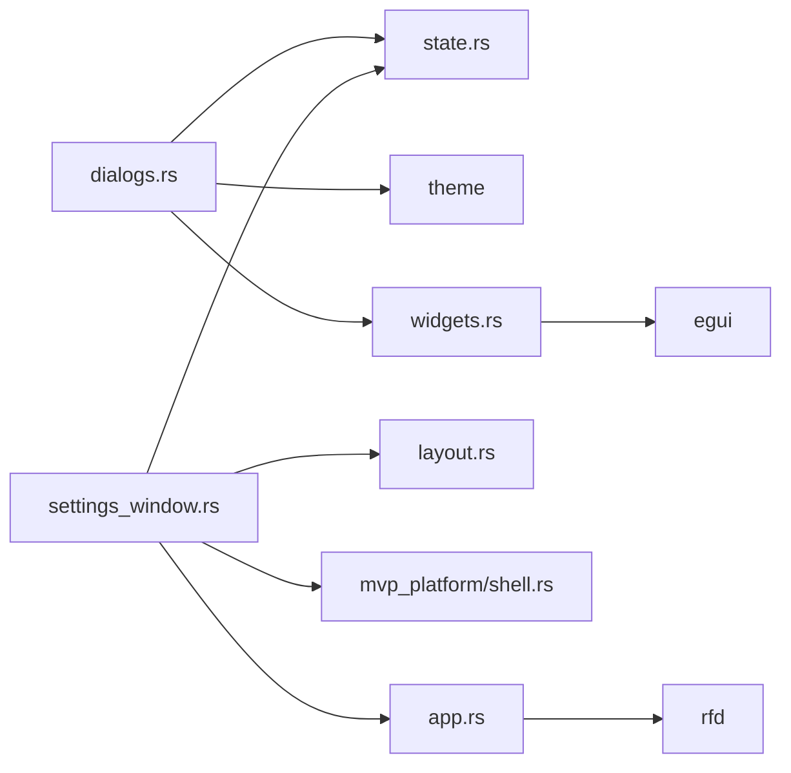

# 对话框系统

<cite>
**本文引用的文件**
- [crates/mvp-player/src/ui/dialogs.rs](file://crates/mvp-player/src/ui/dialogs.rs)
- [crates/mvp-player/src/ui/settings_window.rs](file://crates/mvp-player/src/ui/settings_window.rs)
- [crates/mvp-player/src/ui/widgets.rs](file://crates/mvp-player/src/ui/widgets.rs)
- [crates/mvp-player/src/state.rs](file://crates/mvp-player/src/state.rs)
- [crates/mvp-player/src/app.rs](file://crates/mvp-player/src/app.rs)
- [crates/mvp-platform/src/shell.rs](file://crates/mvp-platform/src/shell.rs)
</cite>

## 目录
1. [简介](#简介)
2. [项目结构](#项目结构)
3. [核心组件](#核心组件)
4. [架构总览](#架构总览)
5. [详细组件分析](#详细组件分析)
6. [依赖关系分析](#依赖关系分析)
7. [性能考量](#性能考量)
8. [故障排查指南](#故障排查指南)
9. [结论](#结论)
10. [附录：扩展与自定义指南](#附录：扩展与自定义指南)

## 简介
本文件系统性梳理 MVP-Versatile-Player 的对话框系统，覆盖模态与非模态对话框的设计模式、设置窗口的完整功能（播放、显示、音频、高级选项等）、对话框生命周期管理、数据绑定与验证机制、常用控件实现（文件选择、颜色选择器、数值输入框），以及样式定制、键盘导航与无障碍支持。同时提供扩展与自定义开发指南，帮助开发者在现有体系上快速新增或改造对话框能力。

## 项目结构
对话框相关代码集中在 UI 层，围绕“状态驱动 + 窗口/弹窗绘制”的模式组织：
- 小弹窗（模态）：打开网络串流、快捷键参考、关于信息
- 设置窗口（非模态）：多页签的设置面板
- 通用控件：开关、滑块、下拉、颜色选择行等
- 状态与生命周期：Overlay 枚举、打开/关闭方法、缓存策略
- 原生对话框桥接：通过线程安全的回调模型调用 rfd 文件对话框

**图表来源**
- [crates/mvp-player/src/ui/dialogs.rs:12-20](file://crates/mvp-player/src/ui/dialogs.rs#L12-L20)
- [crates/mvp-player/src/ui/settings_window.rs:19-155](file://crates/mvp-player/src/ui/settings_window.rs#L19-L155)
- [crates/mvp-player/src/app.rs:1614-1654](file://crates/mvp-player/src/app.rs#L1614-L1654)

**章节来源**
- [crates/mvp-player/src/ui/dialogs.rs:12-20](file://crates/mvp-player/src/ui/dialogs.rs#L12-L20)
- [crates/mvp-player/src/ui/settings_window.rs:19-155](file://crates/mvp-player/src/ui/settings_window.rs#L19-L155)
- [crates/mvp-player/src/app.rs:1614-1654](file://crates/mvp-player/src/app.rs#L1614-L1654)

## 核心组件
- 小弹窗模块：统一入口 draw(app, ctx)，根据当前 Overlay 分发到具体弹窗绘制函数
- 设置窗口：多页签布局，左侧导航条，右侧滚动内容区；每个页签负责自身区域的数据绑定与变更标记
- 通用控件：switch_row、slider_row、combo_row、color_row 等，封装 egui 控件并提供一致的交互与可访问性语义
- 状态管理：Overlay 枚举控制当前显示的覆盖层；UiState 提供 open/close 方法
- 原生对话框：run_dialog 将 rfd 调用放入独立线程，结果以闭包形式在主线程应用

**章节来源**
- [crates/mvp-player/src/ui/dialogs.rs:12-20](file://crates/mvp-player/src/ui/dialogs.rs#L12-L20)
- [crates/mvp-player/src/ui/settings_window.rs:19-155](file://crates/mvp-player/src/ui/settings_window.rs#L19-L155)
- [crates/mvp-player/src/ui/widgets.rs:496-747](file://crates/mvp-player/src/ui/widgets.rs#L496-L747)
- [crates/mvp-player/src/ui/widgets.rs:1296-1353](file://crates/mvp-player/src/ui/widgets.rs#L1296-L1353)
- [crates/mvp-player/src/state.rs:184-197](file://crates/mvp-player/src/state.rs#L184-L197)
- [crates/mvp-player/src/state.rs:752-765](file://crates/mvp-player/src/state.rs#L752-L765)
- [crates/mvp-player/src/app.rs:1614-1654](file://crates/mvp-player/src/app.rs#L1614-L1654)

## 架构总览
对话框系统采用“状态驱动 + 分层绘制”的架构：
- 状态层：Overlay 决定当前激活的覆盖层；SettingsTab 决定设置窗口当前页签
- 视图层：draw 函数根据状态绘制对应窗口/弹窗；设置窗口内部使用 ScrollArea 承载长列表
- 交互层：控件行封装了键盘导航、焦点环、悬停反馈、动画过渡
- 数据层：设置项直接绑定到 app.settings，变更时通过 store.mark_dirty() 持久化
- 原生层：文件对话框通过 run_dialog 异步执行，避免阻塞 UI 线程

**图表来源**
- [crates/mvp-player/src/ui/dialogs.rs:12-20](file://crates/mvp-player/src/ui/dialogs.rs#L12-L20)
- [crates/mvp-player/src/ui/widgets.rs:1296-1353](file://crates/mvp-player/src/ui/widgets.rs#L1296-L1353)
- [crates/mvp-player/src/app.rs:1614-1654](file://crates/mvp-player/src/app.rs#L1614-L1654)

## 详细组件分析

### 小弹窗（模态对话框）
- 统一入口：根据 Overlay 枚举分发到 url_dialog、shortcuts_dialog、about_dialog
- 固定宽度与居中锚点：确保在小窗口中也能完整显示按钮与文本
- 键盘交互：Enter 提交、Esc 关闭；焦点自动聚焦输入框
- 主题与框架：复用 sheet_frame 提供一致的背景、圆角与阴影
- 业务动作：打开网络串流、添加到播放列表、跳转快捷键参考、打开项目主页

**图表来源**
- [crates/mvp-player/src/ui/dialogs.rs:12-20](file://crates/mvp-player/src/ui/dialogs.rs#L12-L20)
- [crates/mvp-player/src/ui/dialogs.rs:37-104](file://crates/mvp-player/src/ui/dialogs.rs#L37-L104)
- [crates/mvp-player/src/ui/dialogs.rs:106-147](file://crates/mvp-player/src/ui/dialogs.rs#L106-L147)
- [crates/mvp-player/src/ui/dialogs.rs:149-227](file://crates/mvp-player/src/ui/dialogs.rs#L149-L227)

**章节来源**
- [crates/mvp-player/src/ui/dialogs.rs:12-20](file://crates/mvp-player/src/ui/dialogs.rs#L12-L20)
- [crates/mvp-player/src/ui/dialogs.rs:37-104](file://crates/mvp-player/src/ui/dialogs.rs#L37-L104)
- [crates/mvp-player/src/ui/dialogs.rs:106-147](file://crates/mvp-player/src/ui/dialogs.rs#L106-L147)
- [crates/mvp-player/src/ui/dialogs.rs:149-227](file://crates/mvp-player/src/ui/dialogs.rs#L149-L227)

### 设置窗口（非模态对话框）
- 窗口尺寸与约束：计算可用空间，限制最大/最小尺寸，确保标题栏与控制栏可见
- 页签导航：左侧竖排标签，选中态高亮；切换时更新 settings_tab
- 内容区：垂直滚动区域，按页签分派到不同 page 函数
- 数据绑定：每页内控件直接读写 app.settings，变更时标记 dirty
- 缓存优化：设备枚举、注册表查询等 I/O 操作仅在一次访问时执行，避免卡顿

**图表来源**
- [crates/mvp-player/src/ui/settings_window.rs:19-155](file://crates/mvp-player/src/ui/settings_window.rs#L19-L155)
- [crates/mvp-player/src/ui/widgets.rs:496-747](file://crates/mvp-player/src/ui/widgets.rs#L496-L747)
- [crates/mvp-player/src/state.rs:184-197](file://crates/mvp-player/src/state.rs#L184-L197)

#### 各页功能概览
- 通用（外观、启动与播放、播放结束、操作、窗口）
  - 主题配色、记住位置、继续播放阈值、保存播放列表、结束时行为、快进步长、滚轮音量、双击全屏、深色标题栏、置顶、隐藏控制栏延时
- 视频（解码、画面调节、画面、截图、图片）
  - 硬件解码、HDR 色调映射、杜比视界重塑、画质增强强度、默认画面比例、控制栏衬底、缩放鸟瞰图、截图目录与包含画面调节、幻灯片间隔、动画图片
- 音频（输出设备、音量）
  - 设备选择（跟随系统/指定设备）、音量滑块、静音开关、音频延迟
- 字幕（显示、加载）
  - 默认显示、字号、距底距离、描边/衬底、文字颜色（预设+自定义）、字幕延迟、自动加载同名字幕、外部字幕优先、立即加载字幕
- 集成（文件关联、程序信息）
  - 关联视频/音频/图片/播放列表、右键菜单、设为默认播放器、注册/取消关联、查看当前关联、打开设置目录
- 快捷键（只读参考）
  - 列出所有快捷键与其作用
- 关于（版本、FFmpeg 信息、运行环境）
  - 版本、内核版本与许可证、编译配置、启动耗时、默认音频设备、最后截图路径

**章节来源**
- [crates/mvp-player/src/ui/settings_window.rs:157-423](file://crates/mvp-player/src/ui/settings_window.rs#L157-L423)
- [crates/mvp-player/src/ui/settings_window.rs:425-610](file://crates/mvp-player/src/ui/settings_window.rs#L425-L610)
- [crates/mvp-player/src/ui/settings_window.rs:612-775](file://crates/mvp-player/src/ui/settings_window.rs#L612-L775)
- [crates/mvp-player/src/ui/settings_window.rs:777-832](file://crates/mvp-player/src/ui/settings_window.rs#L777-L832)
- [crates/mvp-player/src/ui/settings_window.rs:834-931](file://crates/mvp-player/src/ui/settings_window.rs#L834-L931)

### 数据绑定与验证机制
- 数据绑定：控件行直接引用 app.settings 字段，修改后通过 store.mark_dirty() 触发持久化
- 变更检测：控件行返回布尔值表示是否变化，便于批量标记 dirty
- 输入验证：
  - 网络地址输入为空时提示警告并阻止打开
  - 滑块范围限定（如音量 0–200%、字幕字号 10–64pt、延迟范围等）
  - 组合框选项为强类型枚举，避免非法值
- 异步结果应用：文件对话框结果以闭包形式在主线程安全应用，避免竞态

**章节来源**
- [crates/mvp-player/src/ui/settings_window.rs:157-423](file://crates/mvp-player/src/ui/settings_window.rs#L157-L423)
- [crates/mvp-player/src/ui/dialogs.rs:37-104](file://crates/mvp-player/src/ui/dialogs.rs#L37-L104)
- [crates/mvp-player/src/app.rs:1614-1654](file://crates/mvp-player/src/app.rs#L1614-L1654)

### 常用对话框与控件实现
- 文件选择对话框：通过 run_dialog 在新线程调用 rfd::FileDialog，支持文件夹选择与过滤器；结果回调更新设置并标记 dirty
- 颜色选择器：color_row 提供预设色块与自定义拾色器；选中的色块会回写到设置
- 数值输入框：slider_row 提供带读数的滑块；键盘方向键微调；范围限制与格式化显示
- 开关与下拉：switch_row 与 combo_row 提供一致的行列布局与可访问性语义

**章节来源**
- [crates/mvp-player/src/ui/settings_window.rs:360-392](file://crates/mvp-player/src/ui/settings_window.rs#L360-L392)
- [crates/mvp-player/src/ui/widgets.rs:496-747](file://crates/mvp-player/src/ui/widgets.rs#L496-L747)
- [crates/mvp-player/src/ui/widgets.rs:1296-1353](file://crates/mvp-player/src/ui/widgets.rs#L1296-L1353)
- [crates/mvp-player/src/app.rs:1614-1654](file://crates/mvp-player/src/app.rs#L1614-L1654)

### 生命周期管理与键盘导航
- 生命周期：
  - 打开：UiState.open_overlay 设置当前 Overlay
  - 绘制：dialogs.draw 与 settings_window.draw 根据状态绘制
  - 关闭：用户操作或窗口关闭时调用 close_overlay
- 键盘导航：
  - 弹窗内 Enter 提交、Esc 关闭
  - 滑块支持方向键微调
  - 开关支持 Space/Enter 切换
  - 设置窗口滚动区域禁用拖拽滚动以避免与滑块冲突

**章节来源**
- [crates/mvp-player/src/state.rs:752-765](file://crates/mvp-player/src/state.rs#L752-L765)
- [crates/mvp-player/src/ui/dialogs.rs:37-104](file://crates/mvp-player/src/ui/dialogs.rs#L37-L104)
- [crates/mvp-player/src/ui/settings_window.rs:124-150](file://crates/mvp-player/src/ui/settings_window.rs#L124-L150)
- [crates/mvp-player/src/ui/widgets.rs:516-522](file://crates/mvp-player/src/ui/widgets.rs#L516-L522)
- [crates/mvp-player/src/ui/widgets.rs:606-615](file://crates/mvp-player/src/ui/widgets.rs#L606-L615)

### 样式定制与无障碍支持
- 样式定制：
  - 主题配色即时生效，影响全局 egui 风格
  - 弹窗统一使用 sheet_frame，保持一致背景、圆角与阴影
  - 设置窗口通过 Metrics 计算合适尺寸，适配不同分辨率与缩放
- 无障碍：
  - 控件使用 egui 内置的可访问性语义（WidgetInfo）
  - 焦点环与悬停光标提升可达性
  - 颜色对比度与字体大小遵循主题 token

**章节来源**
- [crates/mvp-player/src/ui/settings_window.rs:157-166](file://crates/mvp-player/src/ui/settings_window.rs#L157-L166)
- [crates/mvp-player/src/ui/dialogs.rs:31-35](file://crates/mvp-player/src/ui/dialogs.rs#L31-L35)
- [crates/mvp-player/src/ui/widgets.rs:557-560](file://crates/mvp-player/src/ui/widgets.rs#L557-L560)
- [crates/mvp-player/src/ui/widgets.rs:652-653](file://crates/mvp-player/src/ui/widgets.rs#L652-L653)

## 依赖关系分析
- dialogs.rs 依赖 state（Overlay）、theme（font/space）、surface（sheet_shell）、widgets（按钮/芯片/键值对）
- settings_window.rs 依赖 state（SettingsTab、Overlay）、theme、layout（Metrics）、mvp_platform（shell/assoc）
- widgets.rs 依赖 theme、icons、egui 基础控件
- app.rs 提供 run_dialog 与 DialogResult 类型，协调原生对话框回调
- shell.rs 提供平台相关能力（如深色标题栏、资源管理器打开）

**图表来源**
- [crates/mvp-player/src/ui/dialogs.rs:1-11](file://crates/mvp-player/src/ui/dialogs.rs#L1-L11)
- [crates/mvp-player/src/ui/settings_window.rs:1-18](file://crates/mvp-player/src/ui/settings_window.rs#L1-L18)
- [crates/mvp-player/src/ui/widgets.rs:1-20](file://crates/mvp-player/src/ui/widgets.rs#L1-L20)
- [crates/mvp-player/src/app.rs:2466-2475](file://crates/mvp-player/src/app.rs#L2466-L2475)
- [crates/mvp-platform/src/shell.rs:164-186](file://crates/mvp-platform/src/shell.rs#L164-L186)

**章节来源**
- [crates/mvp-player/src/ui/dialogs.rs:1-11](file://crates/mvp-player/src/ui/dialogs.rs#L1-L11)
- [crates/mvp-player/src/ui/settings_window.rs:1-18](file://crates/mvp-player/src/ui/settings_window.rs#L1-L18)
- [crates/mvp-player/src/ui/widgets.rs:1-20](file://crates/mvp-player/src/ui/widgets.rs#L1-L20)
- [crates/mvp-player/src/app.rs:2466-2475](file://crates/mvp-player/src/app.rs#L2466-L2475)
- [crates/mvp-platform/src/shell.rs:164-186](file://crates/mvp-platform/src/shell.rs#L164-L186)

## 性能考量
- 设置窗口 I/O 缓存：音频设备枚举、注册表查询仅在访问页签时执行一次，避免每帧重复导致卡顿
- 滚动区域优化：禁用拖拽滚动以避免与滑块交互冲突；auto_shrink 设置为 false 保证内容正确溢出与滚动
- 尺寸计算：基于屏幕可用区域与最小/最大尺寸约束，防止标题栏或底部控制被裁剪
- 异步对话框：文件对话框在独立线程运行，避免阻塞 UI 主循环

**章节来源**
- [crates/mvp-player/src/ui/settings_window.rs:24-31](file://crates/mvp-player/src/ui/settings_window.rs#L24-L31)
- [crates/mvp-player/src/ui/settings_window.rs:124-150](file://crates/mvp-player/src/ui/settings_window.rs#L124-L150)
- [crates/mvp-player/src/ui/settings_window.rs:40-45](file://crates/mvp-player/src/ui/settings_window.rs#L40-L45)
- [crates/mvp-player/src/app.rs:1614-1654](file://crates/mvp-player/src/app.rs#L1614-L1654)

## 故障排查指南
- 弹窗按钮不可见或被裁剪：检查 dialog_width 与窗口尺寸约束；确保使用 sheet_frame 与合适的 anchor
- 滑块无法拖动：确认滚动区域 scroll_source 配置，避免拖拽事件被滚动区域抢占
- 文件对话框无响应：检查 run_dialog 是否已有未完成的对话框；确保回调正确应用
- 设置不生效：确认控件行返回 changed=true 并调用 store.mark_dirty()
- 颜色选择不显示：检查 color_row 预设列表与自定义拾色器逻辑

**章节来源**
- [crates/mvp-player/src/ui/dialogs.rs:22-35](file://crates/mvp-player/src/ui/dialogs.rs#L22-L35)
- [crates/mvp-player/src/ui/settings_window.rs:124-150](file://crates/mvp-player/src/ui/settings_window.rs#L124-L150)
- [crates/mvp-player/src/app.rs:1614-1654](file://crates/mvp-player/src/app.rs#L1614-L1654)
- [crates/mvp-player/src/ui/widgets.rs:1296-1353](file://crates/mvp-player/src/ui/widgets.rs#L1296-L1353)

## 结论
该对话框系统以清晰的状态驱动与分层绘制为核心，结合统一的控件库与主题系统，提供了稳定、易用且可扩展的模态与非模态对话框能力。设置窗口覆盖播放、显示、音频、字幕、集成与关于等全面功能，并通过缓存与异步处理保障性能。键盘导航与无障碍语义提升了可用性。开发者可基于现有模式快速扩展新对话框或定制样式。

## 附录：扩展与自定义指南
- 新增小弹窗：
  - 在 Overlay 枚举中添加新变体
  - 在 dialogs.draw 中增加分支，实现绘制函数
  - 复用 sheet_frame 与 widgets 保持风格一致
- 新增设置页签：
  - 在 SettingsTab 中添加新项
  - 在 settings_window.draw 中增加匹配分支，实现 page 函数
  - 使用 switch_row/slider_row/combo_row/color_row 进行数据绑定
  - 变更时调用 store.mark_dirty()
- 自定义控件：
  - 在 widgets.rs 中封装 egui 控件，提供一致的行列布局、键盘导航与可访问性
  - 使用 paint_focus 与 widget_info 提升可达性
- 原生对话框：
  - 使用 app.run_dialog 包装 rfd 调用，确保 UI 线程不被阻塞
  - 在回调中更新设置并标记 dirty

**章节来源**
- [crates/mvp-player/src/state.rs:184-197](file://crates/mvp-player/src/state.rs#L184-L197)
- [crates/mvp-player/src/ui/dialogs.rs:12-20](file://crates/mvp-player/src/ui/dialogs.rs#L12-L20)
- [crates/mvp-player/src/ui/settings_window.rs:19-155](file://crates/mvp-player/src/ui/settings_window.rs#L19-L155)
- [crates/mvp-player/src/ui/widgets.rs:496-747](file://crates/mvp-player/src/ui/widgets.rs#L496-L747)
- [crates/mvp-player/src/app.rs:1614-1654](file://crates/mvp-player/src/app.rs#L1614-L1654)