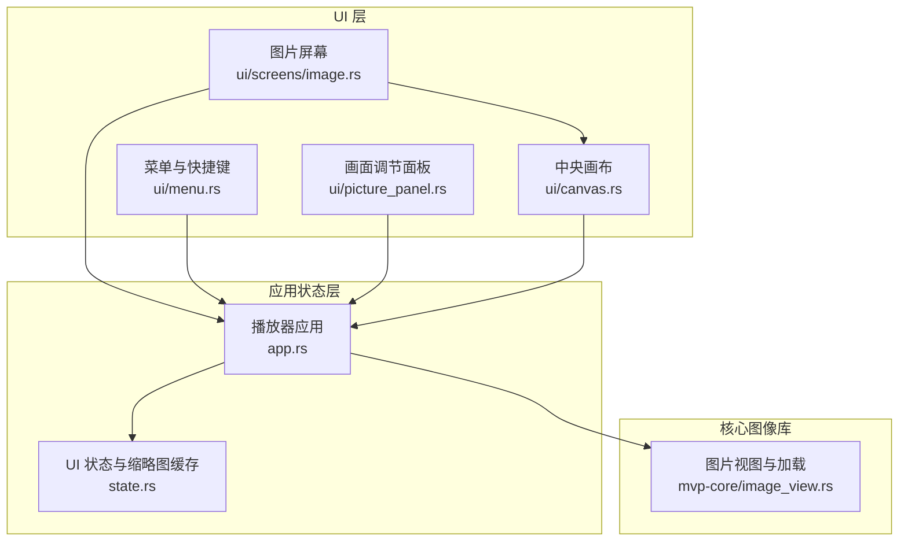
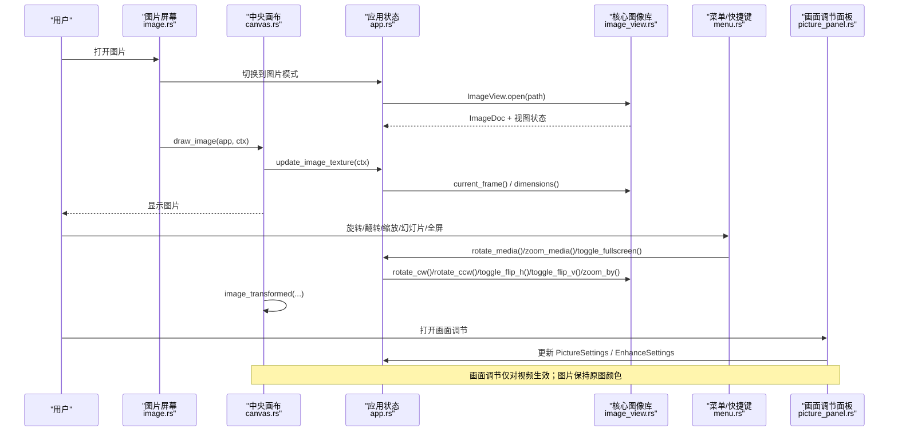
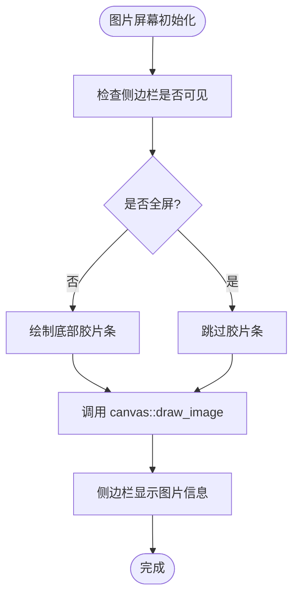
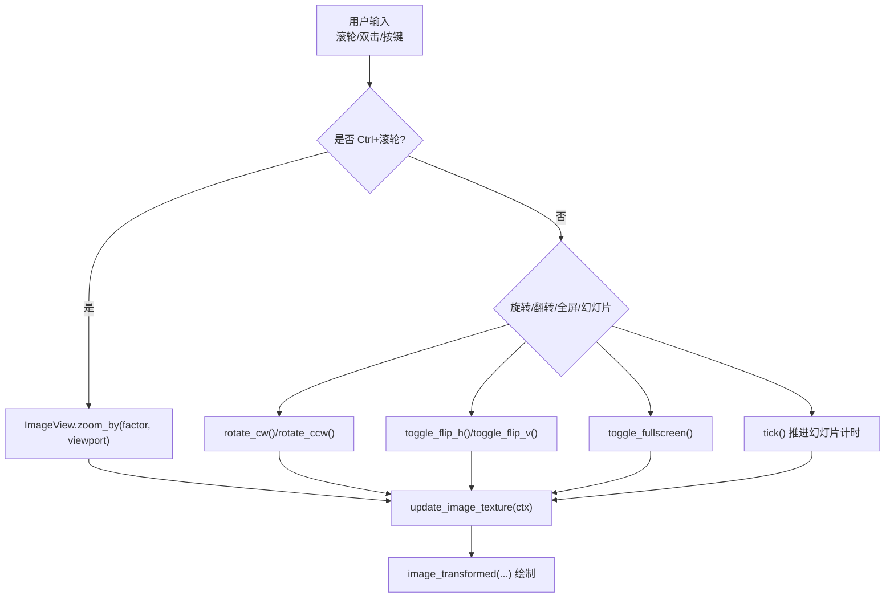
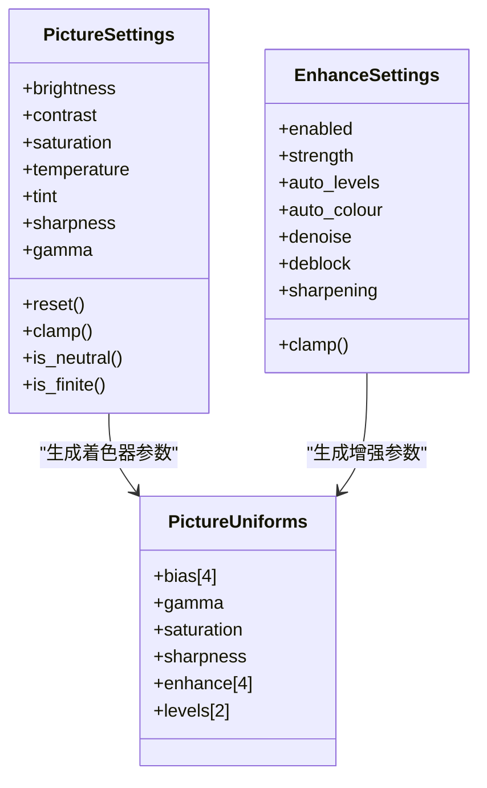
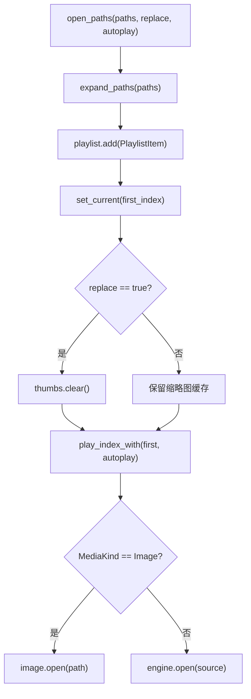
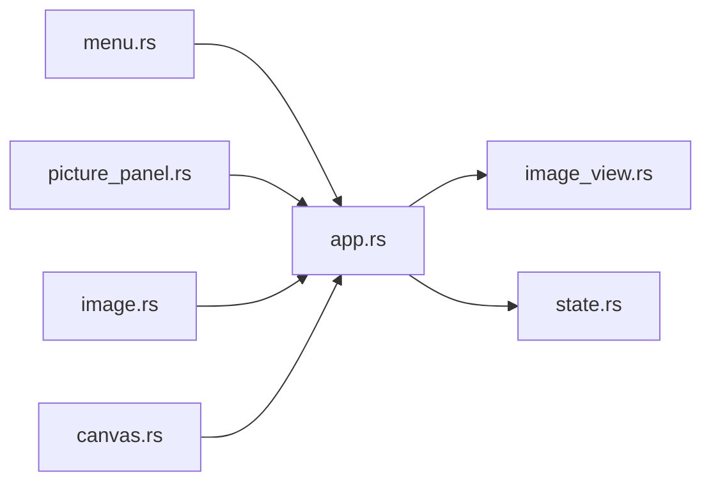
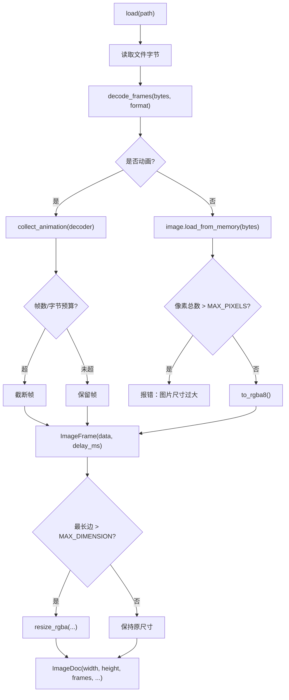

# 图片查看界面

<cite>
**本文引用的文件**   
- [image.rs](file://crates/mvp-player/src/ui/screens/image.rs)
- [canvas.rs](file://crates/mvp-player/src/ui/canvas.rs)
- [menu.rs](file://crates/mvp-player/src/ui/menu.rs)
- [picture_panel.rs](file://crates/mvp-player/src/ui/picture_panel.rs)
- [app.rs](file://crates/mvp-player/src/app.rs)
- [state.rs](file://crates/mvp-player/src/state.rs)
- [image_view.rs](file://crates/mvp-core/src/image_view.rs)
- [README.md](file://README.md)
</cite>

## 目录
1. [简介](#简介)
2. [项目结构](#项目结构)
3. [核心组件](#核心组件)
4. [架构总览](#架构总览)
5. [详细组件分析](#详细组件分析)
6. [依赖关系分析](#依赖关系分析)
7. [性能与渲染优化](#性能与渲染优化)
8. [故障排查指南](#故障排查指南)
9. [结论](#结论)
10. [附录：扩展与定制指南](#附录扩展与定制指南)

## 简介
本文件面向“图片查看界面”的完整说明，覆盖布局设计、浏览交互、编辑能力、多图管理、渲染优化以及扩展开发。该项目的图片查看器独立于视频管线，直接解码为 RGBA 像素，并在 GPU 纹理上完成缩放、平移、旋转、翻转、动画帧播放和幻灯片循环；缩略图胶片条提供多图片导航，侧边栏展示元数据信息，底部工具栏提供常用操作入口。

## 项目结构
图片查看相关代码分布在 UI 层、应用状态层与核心图像库三个层次：

- UI 层负责界面布局与交互：
  - `ui/screens/image.rs`：图片屏幕，包含底部缩略图胶片条与主画布调用。
  - `ui/canvas.rs`：中央画布，负责图片绘制、变换、背景、工具栏与全屏/缩放等交互。
  - `ui/menu.rs`：菜单项，提供旋转、翻转、缩放、幻灯片、全屏等命令。
  - `ui/picture_panel.rs`：画面调节面板（亮度、对比度、饱和度、色温、色调、锐度、Gamma）与画质增强开关。
- 应用状态层负责跨模块协调：
  - `app.rs`：播放器应用对象，持有媒体引擎、播放列表、图片视图状态、缩略图缓存、GPU 纹理与截图通道。
  - `state.rs`：通用 UI 状态与缩略图缓存实现。
- 核心图像库负责图片加载、EXIF 方向、动画帧与视图状态：
  - `mvp-core/image_view.rs`：图片文档、帧、视图状态、缩放/平移/旋转/翻转、幻灯片计时、加载与 EXIF 处理。

**图表来源**
- [image.rs:24-34](file://crates/mvp-player/src/ui/screens/image.rs#L24-L34)
- [canvas.rs:65-71](file://crates/mvp-player/src/ui/canvas.rs#L65-L71)
- [menu.rs:353-417](file://crates/mvp-player/src/ui/menu.rs#L353-L417)
- [picture_panel.rs:34-327](file://crates/mvp-player/src/ui/picture_panel.rs#L34-L327)
- [app.rs:66-204](file://crates/mvp-player/src/app.rs#L66-L204)
- [state.rs:356-392](file://crates/mvp-player/src/state.rs#L356-L392)
- [image_view.rs:134-191](file://crates/mvp-core/src/image_view.rs#L134-L191)

**章节来源**
- [image.rs:1-34](file://crates/mvp-player/src/ui/screens/image.rs#L1-L34)
- [canvas.rs:1-71](file://crates/mvp-player/src/ui/canvas.rs#L1-L71)
- [menu.rs:353-417](file://crates/mvp-player/src/ui/menu.rs#L353-L417)
- [picture_panel.rs:1-327](file://crates/mvp-player/src/ui/picture_panel.rs#L1-L327)
- [app.rs:66-204](file://crates/mvp-player/src/app.rs#L66-L204)
- [state.rs:356-392](file://crates/mvp-player/src/state.rs#L356-L392)
- [image_view.rs:1-191](file://crates/mvp-core/src/image_view.rs#L1-L191)

## 核心组件
- 图片屏幕与胶片条：负责在窗口模式下显示底部缩略图行，点击切换当前图片；全屏时隐藏胶片条，让照片成为唯一内容。
- 中央画布：负责图片绘制、变换、背景选择、工具栏按钮、鼠标滚轮缩放、双击自适应、拖拽平移、全屏切换。
- 应用状态：维护图片视图状态、缩略图缓存、GPU 纹理、播放列表、设置与模式切换。
- 核心图像库：负责图片解码、EXIF 方向修正、动画帧解析、视图状态（缩放、平移、旋转、翻转、幻灯片）。
- 画面调节面板：提供亮度、对比度、饱和度、色温、色调、锐度、Gamma 滑块与画质增强开关；仅对视频生效，但作为统一 UI 存在。

**章节来源**
- [image.rs:24-119](file://crates/mvp-player/src/ui/screens/image.rs#L24-L119)
- [canvas.rs:65-71](file://crates/mvp-player/src/ui/canvas.rs#L65-L71)
- [app.rs:127-157](file://crates/mvp-player/src/app.rs#L127-L157)
- [image_view.rs:134-191](file://crates/mvp-core/src/image_view.rs#L134-L191)
- [picture_panel.rs:34-327](file://crates/mvp-player/src/ui/picture_panel.rs#L34-L327)

## 架构总览
图片查看的整体流程如下：

**图表来源**
- [image.rs:24-34](file://crates/mvp-player/src/ui/screens/image.rs#L24-L34)
- [canvas.rs:65-71](file://crates/mvp-player/src/ui/canvas.rs#L65-L71)
- [app.rs:446-482](file://crates/mvp-player/src/app.rs#L446-L482)
- [image_view.rs:207-230](file://crates/mvp-core/src/image_view.rs#L207-L230)
- [menu.rs:353-417](file://crates/mvp-player/src/ui/menu.rs#L353-L417)
- [picture_panel.rs:34-327](file://crates/mvp-player/src/ui/picture_panel.rs#L34-L327)

## 详细组件分析

### 图片查看器布局设计
- 主图片显示区：由 `canvas::draw_image` 进入，使用中央面板填充背景，随后调用 `image_view` 进行图片绘制。
- 缩略图导航栏：由 `filmstrip` 函数实现，位于底部固定高度区域，横向滚动显示播放列表中所有图片条目；非图片条目以图标占位，保持顺序一致。
- 图片信息面板：侧边栏中展示图片分辨率、格式、颜色类型、文件大小、动画帧数、EXIF 方向等信息，来源于 `image_view::info_rows`。

**图表来源**
- [image.rs:24-34](file://crates/mvp-player/src/ui/screens/image.rs#L24-L34)
- [image.rs:42-119](file://crates/mvp-player/src/ui/screens/image.rs#L42-L119)
- [image_view.rs:741-777](file://crates/mvp-core/src/image_view.rs#L741-L777)

**章节来源**
- [image.rs:24-119](file://crates/mvp-player/src/ui/screens/image.rs#L24-L119)
- [canvas.rs:65-71](file://crates/mvp-player/src/ui/canvas.rs#L65-L71)
- [image_view.rs:741-777](file://crates/mvp-core/src/image_view.rs#L741-L777)

### 图片浏览交互逻辑
- 缩放操作：
  - 鼠标滚轮：在画面上按住 Ctrl 滚轮进行连续缩放，以指针为中心；缩放因子通过指数映射获得平滑体验。
  - 双击自适应：双击可触发全屏或根据设置切换；图片模式下“原始大小 100%”快捷键将视图重置为 1:1。
- 旋转与翻转：
  - 顺时针/逆时针旋转 90°，同时调整平移偏移以保持视觉稳定。
  - 水平/垂直翻转，通过 UV 坐标置换实现，不影响像素重绘。
- 全屏浏览：
  - 全屏时隐藏控制栏与胶片条，鼠标移动唤回控制。
- 幻灯片播放：
  - 开启后按间隔自动切换下一张图片；内部维护 `slideshow_elapsed` 与 `slideshow_interval`，并返回是否需要切换文件的信号。

**图表来源**
- [canvas.rs:287-351](file://crates/mvp-player/src/ui/canvas.rs#L287-L351)
- [image_view.rs:255-337](file://crates/mvp-core/src/image_view.rs#L255-L337)
- [image_view.rs:339-391](file://crates/mvp-core/src/image_view.rs#L339-L391)
- [menu.rs:353-417](file://crates/mvp-player/src/ui/menu.rs#L353-L417)

**章节来源**
- [canvas.rs:287-351](file://crates/mvp-player/src/ui/canvas.rs#L287-L351)
- [image_view.rs:255-391](file://crates/mvp-core/src/image_view.rs#L255-L391)
- [menu.rs:353-417](file://crates/mvp-player/src/ui/menu.rs#L353-L417)

### 图片编辑功能
- 亮度、对比度、饱和度、色温、色调、锐度、Gamma：由 `picture_panel.rs` 提供滑块与数值显示，支持全局或按文件记忆。
- 画质增强：总开关 + 强度，外加自动色阶、自动色彩、降噪、去块、锐化；统计量取自每帧抽样副本，每秒最多 10 次，目标值逐帧平滑推进。
- 注意：画面调节与画质增强仅对视频生效；图片查看器保持作者原始颜色，避免误调照片。

**图表来源**
- [picture_panel.rs:92-167](file://crates/mvp-player/src/ui/picture_panel.rs#L92-L167)
- [picture_panel.rs:236-300](file://crates/mvp-player/src/ui/picture_panel.rs#L236-L300)
- [picture.rs:143-157](file://crates/mvp-player/src/picture.rs#L143-L157)

**章节来源**
- [picture_panel.rs:34-327](file://crates/mvp-player/src/ui/picture_panel.rs#L34-L327)
- [picture.rs:1-157](file://crates/mvp-player/src/picture.rs#L1-L157)

### 多图片管理功能
- 文件夹浏览与批量加载：通过 `open_paths` 添加路径到播放列表，支持替换或追加；首次打开会清空旧缓存并重建缩略图。
- 文件排序：播放列表保持自然排序，胶片条与非图片条目占位保持一致顺序。
- 元数据显示：侧边栏展示图片分辨率、格式、颜色类型、文件大小、动画帧数、EXIF 方向与提示（如已缩小适配显卡）。

**图表来源**
- [app.rs:368-396](file://crates/mvp-player/src/app.rs#L368-L396)
- [app.rs:446-482](file://crates/mvp-player/src/app.rs#L446-L482)
- [image.rs:42-119](file://crates/mvp-player/src/ui/screens/image.rs#L42-L119)
- [image_view.rs:741-777](file://crates/mvp-core/src/image_view.rs#L741-L777)

**章节来源**
- [app.rs:368-396](file://crates/mvp-player/src/app.rs#L368-L396)
- [app.rs:446-482](file://crates/mvp-player/src/app.rs#L446-L482)
- [image.rs:42-119](file://crates/mvp-player/src/ui/screens/image.rs#L42-L119)
- [image_view.rs:741-777](file://crates/mvp-core/src/image_view.rs#L741-L777)

## 依赖关系分析
- UI 层依赖应用状态：图片屏幕与画布通过 `PlayerApp` 访问 `ImageView`、`ThumbCache`、`Settings` 与 `Mode`。
- 应用状态依赖核心图像库：`ImageView` 提供图片文档、视图状态与加载逻辑；`ThumbCache` 提供缩略图异步解码与缓存。
- 菜单与面板通过 `PlayerApp` 暴露的统一接口操作图片视图与设置，避免直接耦合底层实现。

**图表来源**
- [menu.rs:353-417](file://crates/mvp-player/src/ui/menu.rs#L353-L417)
- [picture_panel.rs:34-327](file://crates/mvp-player/src/ui/picture_panel.rs#L34-L327)
- [image.rs:24-119](file://crates/mvp-player/src/ui/screens/image.rs#L24-L119)
- [canvas.rs:65-71](file://crates/mvp-player/src/ui/canvas.rs#L65-L71)
- [app.rs:66-204](file://crates/mvp-player/src/app.rs#L66-L204)
- [image_view.rs:1-191](file://crates/mvp-core/src/image_view.rs#L1-L191)
- [state.rs:356-392](file://crates/mvp-player/src/state.rs#L356-L392)

**章节来源**
- [menu.rs:353-417](file://crates/mvp-player/src/ui/menu.rs#L353-L417)
- [picture_panel.rs:34-327](file://crates/mvp-player/src/ui/picture_panel.rs#L34-L327)
- [image.rs:24-119](file://crates/mvp-player/src/ui/screens/image.rs#L24-L119)
- [canvas.rs:65-71](file://crates/mvp-player/src/ui/canvas.rs#L65-L71)
- [app.rs:66-204](file://crates/mvp-player/src/app.rs#L66-L204)
- [image_view.rs:1-191](file://crates/mvp-core/src/image_view.rs#L1-L191)
- [state.rs:356-392](file://crates/mvp-player/src/state.rs#L356-L392)

## 性能与渲染优化
- 大图片内存管理：
  - 最大维度限制：超过 8192 像素的最长边会在加载时按比例缩小，避免显存溢出。
  - 像素上限：静态图片像素总数超过 64M 像素时报错，防止分配过大缓冲区。
  - 动画帧预算：最多保留 400 帧，总字节数不超过 512MB，超出则截断。
- 缩略图缓存：
  - 异步解码线程：缩略图请求通过通道发送到后台线程，解码后写入缓存。
  - 缓存上限：最多保留 256 张缩略图，超出时整体丢弃以避免无限增长。
- GPU 加速渲染：
  - 纹理上传去重：通过 `(viewer serial, frame index)` 标识当前帧，未变化时不重复上传。
  - 着色器路径：画面调节与增强通过 GPU 着色器一次采样完成，无额外复制。
  - 自适应解码：视频路径根据显示尺寸调整解码目标大小，减少内存与转换开销。

**图表来源**
- [image_view.rs:416-492](file://crates/mvp-core/src/image_view.rs#L416-L492)
- [image_view.rs:518-598](file://crates/mvp-core/src/image_view.rs#L518-L598)
- [image_view.rs:728-739](file://crates/mvp-core/src/image_view.rs#L728-L739)
- [state.rs:356-392](file://crates/mvp-player/src/state.rs#L356-L392)
- [app.rs:771-800](file://crates/mvp-player/src/app.rs#L771-L800)

**章节来源**
- [image_view.rs:416-492](file://crates/mvp-core/src/image_view.rs#L416-L492)
- [image_view.rs:518-598](file://crates/mvp-core/src/image_view.rs#L518-L598)
- [image_view.rs:728-739](file://crates/mvp-core/src/image_view.rs#L728-L739)
- [state.rs:356-392](file://crates/mvp-player/src/state.rs#L356-L392)
- [app.rs:771-800](file://crates/mvp-player/src/app.rs#L771-L800)

## 故障排查指南
- 无法打开图片：
  - 检查路径是否正确，确认文件未被占用。
  - 若报“图片尺寸过大”，说明像素总数超过 64M，需裁剪或使用更高显存设备。
  - 若报“没有任何可显示的帧”，可能是损坏文件或格式不支持。
- 缩略图不显示：
  - 检查缩略图线程是否成功启动；若失败，日志会警告“无法启动缩略图线程”。
  - 确认缓存未因频繁更换播放列表而清空。
- 画面调节无效：
  - 画面调节仅对视频生效；图片查看器保持原图颜色。
  - 若画质增强关闭，确保滑块处于中性值，否则仍可能进入着色器路径。
- 幻灯片不切换：
  - 检查 `slideshow_active` 是否启用，确认 `slideshow_interval` 设置合理。
  - 查看 `ImageView.tick()` 是否返回切换信号，确认播放列表有下一项。

**章节来源**
- [image_view.rs:416-492](file://crates/mvp-core/src/image_view.rs#L416-L492)
- [state.rs:356-392](file://crates/mvp-player/src/state.rs#L356-L392)
- [picture_panel.rs:34-327](file://crates/mvp-player/src/ui/picture_panel.rs#L34-L327)
- [image_view.rs:339-391](file://crates/mvp-core/src/image_view.rs#L339-L391)

## 结论
图片查看界面通过清晰的三层架构实现了高性能、可扩展的图片浏览体验：UI 层负责交互与布局，应用状态层协调资源与设置，核心图像库专注解码与视图状态。其关键优势包括：大图片内存保护、缩略图异步缓存、GPU 加速渲染、EXIF 方向自动修正、动画帧预算控制，以及与视频管线解耦的设计保证图片颜色不被误调。未来可在滤镜扩展、导出格式支持与自定义背景等方面进一步扩展。

## 附录：扩展与定制指南
- 自定义滤镜：
  - 在 `picture.rs` 中扩展 `EnhanceState` 与 `PictureUniforms`，新增滤镜参数并通过着色器应用。
  - 在 `picture_panel.rs` 中添加对应滑块与说明文本，确保与渲染路径一致。
- 导出格式支持：
  - 在 `image_view.rs` 的 `format_name_for` 中添加新格式映射，并在 `decode_frames` 中增加解码分支。
  - 考虑新增导出 API，将 `ImageDoc.frames` 序列化为指定格式。
- 自定义背景：
  - 在 `canvas.rs` 的工具栏中扩展 `ImageBackground` 选项，支持棋盘格、渐变或自定义图案。
  - 修改 `central` 的背景填充逻辑，根据设置选择不同背景。

**章节来源**
- [picture.rs:1-157](file://crates/mvp-player/src/picture.rs#L1-L157)
- [picture_panel.rs:34-327](file://crates/mvp-player/src/ui/picture_panel.rs#L34-L327)
- [image_view.rs:494-514](file://crates/mvp-core/src/image_view.rs#L494-L514)
- [canvas.rs:27-43](file://crates/mvp-player/src/ui/canvas.rs#L27-L43)