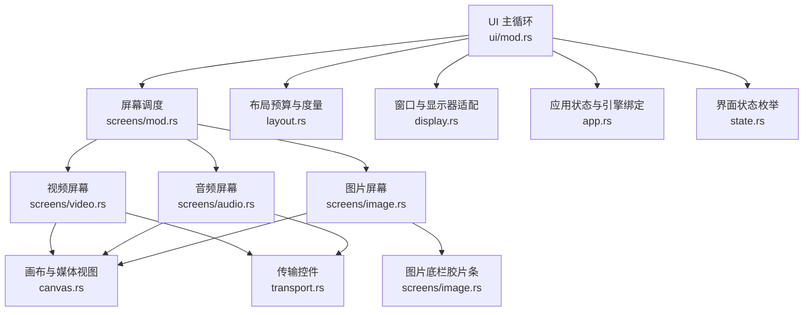
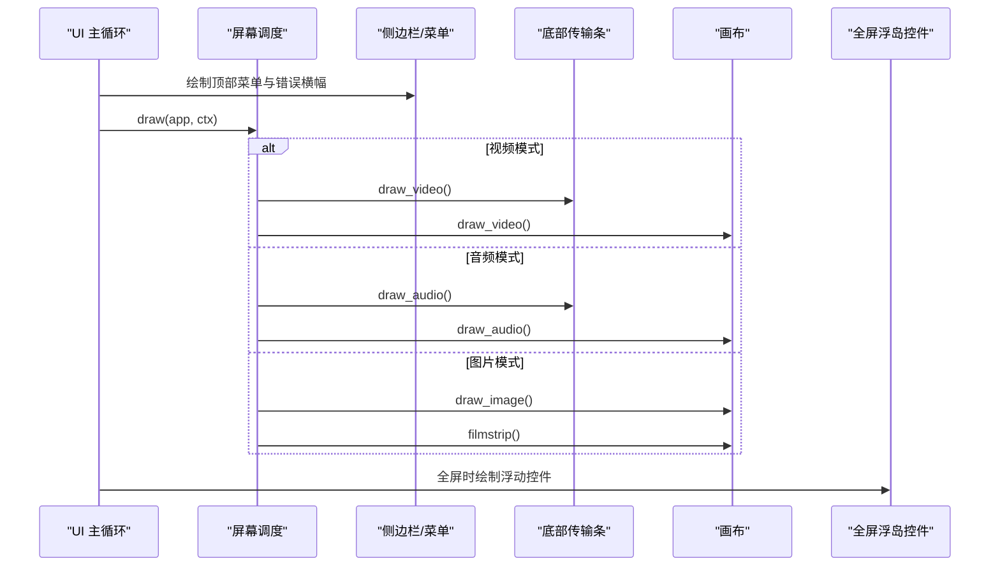
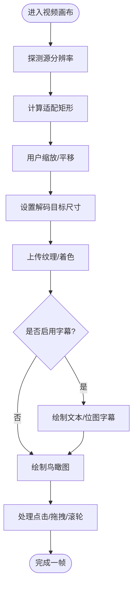
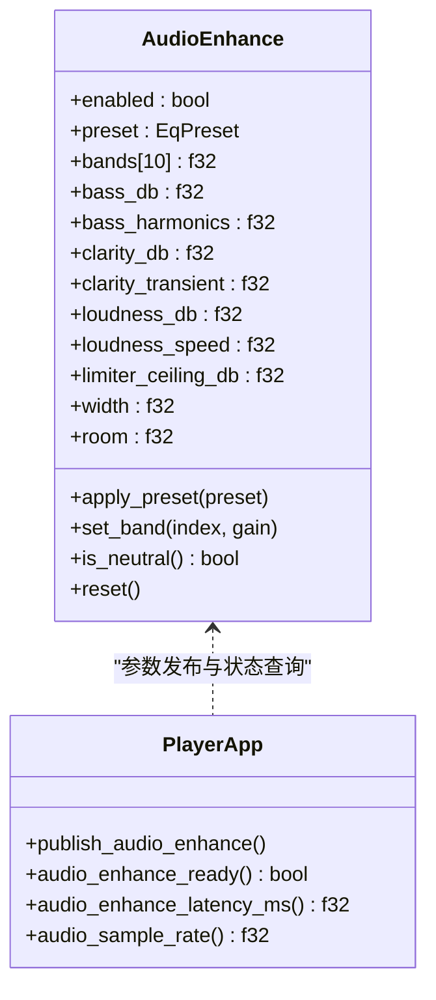
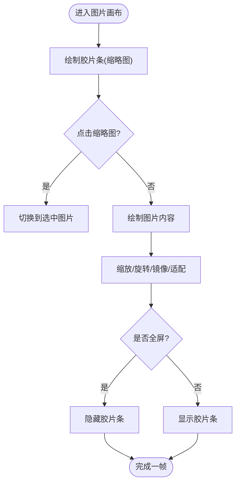
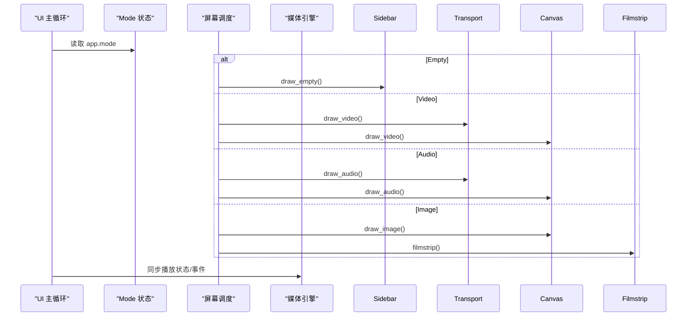
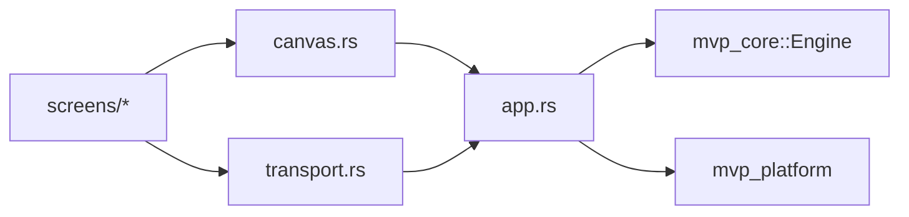
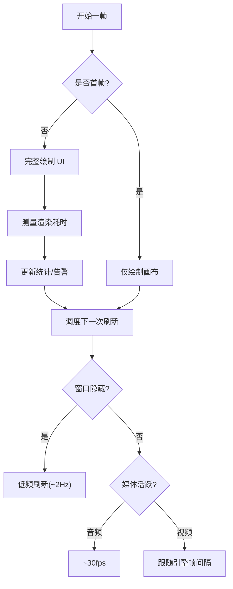
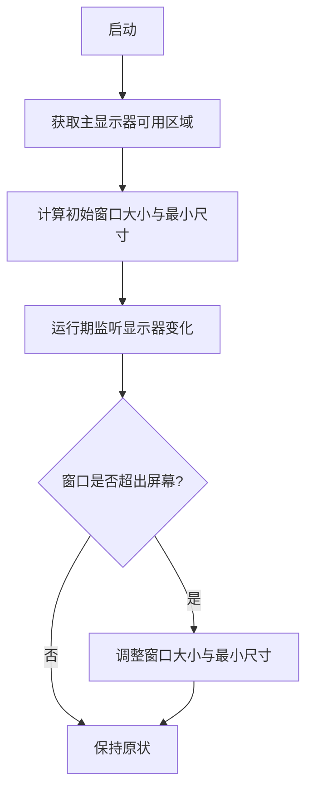

# 屏幕组件

<cite>
**本文引用的文件**   
- [screens/mod.rs](file://crates/mvp-player/src/ui/screens/mod.rs)
- [screens/video.rs](file://crates/mvp-player/src/ui/screens/video.rs)
- [screens/audio.rs](file://crates/mvp-player/src/ui/screens/audio.rs)
- [screens/image.rs](file://crates/mvp-player/src/ui/screens/image.rs)
- [ui/mod.rs](file://crates/mvp-player/src/ui/mod.rs)
- [canvas.rs](file://crates/mvp-player/src/ui/canvas.rs)
- [transport.rs](file://crates/mvp-player/src/ui/transport.rs)
- [audio_enhance.rs](file://crates/mvp-player/src/ui/audio_enhance.rs)
- [display.rs](file://crates/mvp-player/src/display.rs)
- [layout.rs](file://crates/mvp-player/src/layout.rs)
- [app.rs](file://crates/mvp-player/src/app.rs)
- [state.rs](file://crates/mvp-player/src/state.rs)
</cite>

## 目录
1. [引言](#引言)
2. [项目结构](#项目结构)
3. [核心组件](#核心组件)
4. [架构总览](#架构总览)
5. [详细组件分析](#详细组件分析)
6. [依赖关系分析](#依赖关系分析)
7. [性能与渲染优化](#性能与渲染优化)
8. [多显示器与响应式布局](#多显示器与响应式布局)
9. [界面定制与扩展指南](#界面定制与扩展指南)
10. [故障排查](#故障排查)
11. [结论](#结论)

## 引言
本文件聚焦“屏幕组件”，系统性说明三套独立界面的设计理念与实现：视频播放器界面、音频播放器界面、图片查看器界面。文档从架构到细节，覆盖布局结构、交互逻辑、功能特性、界面切换机制、响应式适配、多显示器支持，以及播放控制、进度条、音量调节、字幕显示、频谱分析与均衡器、播放列表管理、缩放旋转、全屏浏览等能力，并给出性能优化策略与扩展开发指南。

## 项目结构
屏幕组件位于 UI 层，采用“按媒体类型分屏”的设计：每种媒体（视频、音频、图片）拥有独立的绘制入口和面板顺序约定，由统一的调度模块根据当前模式分发绘制任务。

**图表来源**
- [ui/mod.rs:48-144](file://crates/mvp-player/src/ui/mod.rs#L48-L144)
- [screens/mod.rs:27-70](file://crates/mvp-player/src/ui/screens/mod.rs#L27-L70)
- [canvas.rs:19-77](file://crates/mvp-player/src/ui/canvas.rs#L19-L77)
- [transport.rs:22-111](file://crates/mvp-player/src/ui/transport.rs#L22-L111)
- [layout.rs:46-113](file://crates/mvp-player/src/layout.rs#L46-L113)
- [display.rs:23-92](file://crates/mvp-player/src/display.rs#L23-L92)
- [app.rs:66-192](file://crates/mvp-player/src/app.rs#L66-L192)
- [state.rs:15-49](file://crates/mvp-player/src/state.rs#L15-L49)

**章节来源**
- [ui/mod.rs:48-144](file://crates/mvp-player/src/ui/mod.rs#L48-L144)
- [screens/mod.rs:1-70](file://crates/mvp-player/src/ui/screens/mod.rs#L1-L70)

## 核心组件
- 屏幕调度：根据当前 Mode（空、视频、音频、图片）选择对应屏幕绘制函数，并提供仅画画布的“首帧快速路径”。
- 画布子系统：统一承载视频帧、音频海报、图片内容，负责媒体几何计算、字幕叠加、鸟瞰图、交互处理。
- 传输控件：进度条、时间戳、播放控制、音量、速度、设备选择、歌词/字幕开关等。
- 音频增强：十段均衡器、低音/清晰度、响度与保护、空间感等参数面板，曲线与 DSP 系数一致。
- 布局与显示：响应式预算、最小/最大尺寸、浮动控件宽度、音频海报自适应；窗口初始大小、越界修复、多显示器适配。

**章节来源**
- [screens/mod.rs:27-70](file://crates/mvp-player/src/ui/screens/mod.rs#L27-L70)
- [canvas.rs:19-77](file://crates/mvp-player/src/ui/canvas.rs#L19-L77)
- [transport.rs:22-111](file://crates/mvp-player/src/ui/transport.rs#L22-L111)
- [audio_enhance.rs:52-94](file://crates/mvp-player/src/ui/audio_enhance.rs#L52-L94)
- [layout.rs:46-113](file://crates/mvp-player/src/layout.rs#L46-L113)
- [display.rs:23-92](file://crates/mvp-player/src/display.rs#L23-L92)

## 架构总览
屏幕组件遵循“先侧边栏、再底部条、最后画布”的绘制契约，确保中央画布始终拿到剩余空间，避免被后续面板遮挡。

**图表来源**
- [ui/mod.rs:84-122](file://crates/mvp-player/src/ui/mod.rs#L84-L122)
- [screens/mod.rs:27-70](file://crates/mvp-player/src/ui/screens/mod.rs#L27-L70)
- [transport.rs:22-111](file://crates/mvp-player/src/ui/transport.rs#L22-L111)
- [canvas.rs:46-71](file://crates/mvp-player/src/ui/canvas.rs#L46-L71)

## 详细组件分析

### 视频播放器界面
- 设计理念：画面优先，控件集中在底部传输条，减少观看时的菜单干扰。
- 布局结构：侧边栏（可选）、底部传输条（进度条+按钮行）、中央画布（视频帧+字幕+鸟瞰图）。
- 交互逻辑：
  - 双击切换全屏；滚轮默认调音量，按住 Ctrl 滚轮缩放；拖拽平移已缩放的画面；点击唤醒控件。
  - 鼠标悬停进度条显示章节名称与时间预览。
- 功能特性：
  - 播放控制：上一项/下一项、快退/快进、播放/暂停、重播。
  - 进度条：实时位置、总时长、拖动预览、章节标记、A-B 循环区间。
  - 音量调节：静音切换、滑块、百分比显示。
  - 字幕显示：文本字幕与位图字幕（PGS/VobSub），支持延迟、字号、颜色、描边背景。
  - 画面变换：比例模式（拉伸/裁切/适应）、旋转、水平/垂直翻转、缩放与平移。
  - 截图：包含画面调整效果的离屏渲染。

**图表来源**
- [canvas.rs:155-262](file://crates/mvp-player/src/ui/canvas.rs#L155-L262)
- [canvas.rs:287-351](file://crates/mvp-player/src/ui/canvas.rs#L287-L351)
- [canvas.rs:401-530](file://crates/mvp-player/src/ui/canvas.rs#L401-L530)

**章节来源**
- [screens/video.rs:1-24](file://crates/mvp-player/src/ui/screens/video.rs#L1-L24)
- [canvas.rs:46-71](file://crates/mvp-player/src/ui/canvas.rs#L46-L71)
- [canvas.rs:155-262](file://crates/mvp-player/src/ui/canvas.rs#L155-L262)
- [canvas.rs:287-351](file://crates/mvp-player/src/ui/canvas.rs#L287-L351)
- [canvas.rs:401-530](file://crates/mvp-player/src/ui/canvas.rs#L401-L530)
- [transport.rs:22-70](file://crates/mvp-player/src/ui/transport.rs#L22-L70)

### 音频播放器界面
- 设计理念：无画面的音频不是“缺帧的视频”，而是以唱片封面、标题、技术信息与进度环为核心的“海报”体验。
- 布局结构：侧边栏（可选）、底部传输条（进度条+播放控制+大音量滑块+设备选择+歌词/字幕开关）、中央画布（唱片+信息列）。
- 交互逻辑：
  - 进度条拖动预览；音量滑块为主控；速度菜单；输出设备选择（下次启动生效）。
  - 歌词/字幕开关：当存在字幕轨道时作为歌词展示在画布底部。
- 功能特性：
  - 播放列表管理：通过侧边栏与底部条导航。
  - 频谱分析与均衡器：十段均衡器、低音提升/谐波、清晰度/瞬态增强、响度归一化、限制器、立体声宽度、空间残响；曲线与 DSP 系数一致。
  - 播放控制：上一曲/下一曲、快退/前进、播放/暂停、随机/循环、A-B 循环。

**图表来源**
- [audio_enhance.rs:97-259](file://crates/mvp-player/src/ui/audio_enhance.rs#L97-L259)
- [audio_enhance.rs:270-384](file://crates/mvp-player/src/ui/audio_enhance.rs#L270-L384)
- [app.rs:66-192](file://crates/mvp-player/src/app.rs#L66-L192)

**章节来源**
- [screens/audio.rs:1-23](file://crates/mvp-player/src/ui/screens/audio.rs#L1-L23)
- [canvas.rs:51-63](file://crates/mvp-player/src/ui/canvas.rs#L51-L63)
- [canvas.rs:737-800](file://crates/mvp-player/src/ui/canvas.rs#L737-L800)
- [transport.rs:72-111](file://crates/mvp-player/src/ui/transport.rs#L72-L111)
- [transport.rs:114-320](file://crates/mvp-player/src/ui/transport.rs#L114-L320)
- [audio_enhance.rs:52-94](file://crates/mvp-player/src/ui/audio_enhance.rs#L52-L94)
- [audio_enhance.rs:97-259](file://crates/mvp-player/src/ui/audio_enhance.rs#L97-L259)

### 图片查看器界面
- 设计理念：照片不是暂停的电影，没有进度条与音轨，重点在于“如何看”：缩放、旋转、镜像、适配模式、幻灯片。
- 布局结构：侧边栏（可选）、底部胶片条（同播放列表但用缩略图表示）、中央画布（图片工具与内容）。
- 交互逻辑：
  - 胶片条横向滚动，点击切换图片；当前项高亮边框。
  - 画布支持缩放、旋转、镜像、适配模式（适应/填充/拉伸等）。
- 功能特性：
  - 缩放与旋转：快捷键与鼠标滚轮缩放、方向键旋转、镜像翻转。
  - 全屏浏览：隐藏胶片条，仅保留图片。
  - 播放列表管理：非图片项以图标占位，保持顺序一致。

**图表来源**
- [screens/image.rs:24-34](file://crates/mvp-player/src/ui/screens/image.rs#L24-L34)
- [screens/image.rs:42-119](file://crates/mvp-player/src/ui/screens/image.rs#L42-L119)
- [screens/image.rs:130-185](file://crates/mvp-player/src/ui/screens/image.rs#L130-L185)

**章节来源**
- [screens/image.rs:1-185](file://crates/mvp-player/src/ui/screens/image.rs#L1-L185)
- [canvas.rs:65-71](file://crates/mvp-player/src/ui/canvas.rs#L65-L71)

### 界面切换机制
- 模式枚举：Empty、Video、Audio、Image，分别驱动不同屏幕与控件集。
- 调度流程：UI 主循环先绘制首帧画布（快速路径），随后完整绘制菜单、侧边栏、底部条、画布、浮岛控件、设置窗体与对话框。
- 键盘与指针：全局快捷键（空格播放、F 全屏、V 字幕、Z 比例、B A-B 循环等），指针移动唤醒全屏控件。

**图表来源**
- [state.rs:15-49](file://crates/mvp-player/src/state.rs#L15-L49)
- [ui/mod.rs:48-144](file://crates/mvp-player/src/ui/mod.rs#L48-L144)
- [screens/mod.rs:27-70](file://crates/mvp-player/src/ui/screens/mod.rs#L27-L70)

**章节来源**
- [state.rs:15-49](file://crates/mvp-player/src/state.rs#L15-L49)
- [ui/mod.rs:48-144](file://crates/mvp-player/src/ui/mod.rs#L48-L144)
- [screens/mod.rs:27-70](file://crates/mvp-player/src/ui/screens/mod.rs#L27-L70)

## 依赖关系分析
- 耦合与内聚：
  - 屏幕模块高度内聚于各自媒体类型，通过统一调度解耦。
  - 画布模块集中处理媒体几何、字幕、鸟瞰图与交互，降低各屏幕重复逻辑。
  - 传输控件为共享组件，视频/音频复用 seek_row 与按钮行。
- 外部依赖：
  - 媒体引擎（mvp_core）提供播放状态、帧、字幕、声道信息等。
  - 平台层（mvp_platform）提供显示器、电源、单实例等系统能力。
- 潜在循环依赖：
  - UI 与 App 通过引用传递，避免直接循环；状态与设置分离，降低耦合。

**图表来源**
- [screens/mod.rs:27-70](file://crates/mvp-player/src/ui/screens/mod.rs#L27-L70)
- [canvas.rs:19-77](file://crates/mvp-player/src/ui/canvas.rs#L19-L77)
- [transport.rs:22-111](file://crates/mvp-player/src/ui/transport.rs#L22-L111)
- [app.rs:66-192](file://crates/mvp-player/src/app.rs#L66-L192)

**章节来源**
- [screens/mod.rs:27-70](file://crates/mvp-player/src/ui/screens/mod.rs#L27-L70)
- [canvas.rs:19-77](file://crates/mvp-player/src/ui/canvas.rs#L19-L77)
- [transport.rs:22-111](file://crates/mvp-player/src/ui/transport.rs#L22-L111)
- [app.rs:66-192](file://crates/mvp-player/src/app.rs#L66-L192)

## 性能与渲染优化
- 首帧优化：首帧仅绘制画布，跳过菜单、侧边栏、传输条等重型 UI，缩短可见延迟。
- 渲染计时与告警：记录每帧渲染耗时、平均值、最坏值，连续慢帧日志告警。
- 调度策略：
  - 隐藏窗口时降低刷新频率（约 2Hz）。
  - 打开中文件高频轮询（100ms）避免卡住。
  - 音频模式按需降频（约 30fps），视频模式跟随引擎帧间隔。
- 解码目标尺寸：根据实际显示区域与缩放动态设置解码尺寸，降低内存与转换开销。
- 纹理与快照：避免重复上传未变化帧；截图走离屏渲染通道，仅在需要时触发。
- 字幕缓存：位图字幕纹理缓存，避免重复构建。

**图表来源**
- [ui/mod.rs:55-69](file://crates/mvp-player/src/ui/mod.rs#L55-L69)
- [ui/mod.rs:169-226](file://crates/mvp-player/src/ui/mod.rs#L169-L226)
- [ui/mod.rs:229-283](file://crates/mvp-player/src/ui/mod.rs#L229-L283)
- [canvas.rs:178-199](file://crates/mvp-player/src/ui/canvas.rs#L178-L199)
- [canvas.rs:566-600](file://crates/mvp-player/src/ui/canvas.rs#L566-L600)
- [canvas.rs:464-530](file://crates/mvp-player/src/ui/canvas.rs#L464-L530)

**章节来源**
- [ui/mod.rs:55-69](file://crates/mvp-player/src/ui/mod.rs#L55-L69)
- [ui/mod.rs:169-226](file://crates/mvp-player/src/ui/mod.rs#L169-L226)
- [ui/mod.rs:229-283](file://crates/mvp-player/src/ui/mod.rs#L229-L283)
- [canvas.rs:178-199](file://crates/mvp-player/src/ui/canvas.rs#L178-L199)
- [canvas.rs:566-600](file://crates/mvp-player/src/ui/canvas.rs#L566-L600)
- [canvas.rs:464-530](file://crates/mvp-player/src/ui/canvas.rs#L464-L530)

## 多显示器与响应式布局
- 窗口初始大小：根据主显示器可用区域计算初始宽高与最小尺寸，避免超出屏幕。
- 运行时守卫：检测显示器变化或远程桌面缩放，自动将窗口缩回可视范围，保留任务栏空间。
- 响应式预算：
  - 侧边栏宽度随窗口宽度动态调整，保证图片区不被完全占用。
  - 传输控件按宽度预算逐步舍弃次要控件（音量百分比、速度菜单、截图、A-B 循环等），保留核心播放控制。
  - 浮动传输条宽度受屏幕宽度约束，窄屏下收缩而非溢出。
  - 音频海报尺寸随画布自适应，小窗口隐藏技术信息行。

**图表来源**
- [display.rs:53-92](file://crates/mvp-player/src/display.rs#L53-L92)
- [display.rs:121-166](file://crates/mvp-player/src/display.rs#L121-L166)
- [layout.rs:70-94](file://crates/mvp-player/src/layout.rs#L70-L94)
- [layout.rs:320-328](file://crates/mvp-player/src/layout.rs#L320-L328)
- [layout.rs:161-187](file://crates/mvp-player/src/layout.rs#L161-L187)

**章节来源**
- [display.rs:53-92](file://crates/mvp-player/src/display.rs#L53-L92)
- [display.rs:121-166](file://crates/mvp-player/src/display.rs#L121-L166)
- [layout.rs:70-94](file://crates/mvp-player/src/layout.rs#L70-L94)
- [layout.rs:320-328](file://crates/mvp-player/src/layout.rs#L320-L328)
- [layout.rs:161-187](file://crates/mvp-player/src/layout.rs#L161-L187)

## 界面定制与扩展指南
- 新增屏幕类型：
  - 在 state.rs 的 Mode 枚举中添加新变体。
  - 在 screens/mod.rs 的 draw 与 draw_canvas_only 中添加分支。
  - 新建屏幕模块（如 screens/newtype.rs），定义 draw 函数，遵循“侧边栏→底部条→画布”的绘制顺序。
- 自定义传输控件：
  - 在 transport.rs 中扩展 seek_row 或按钮行，使用 layout.rs 的预算函数决定控件显隐。
  - 通过 widgets 模块复用通用控件（音量滑块、工具按钮等）。
- 音频增强扩展：
  - 在 audio_enhance.rs 中添加新的 DSP 参数与 UI 行，调用 publish_audio_enhance 发布到引擎。
  - 确保曲线绘制与 DSP 系数一致，避免视觉与声音不一致。
- 画布扩展：
  - 在 canvas.rs 中增加新的媒体视图分支，遵循 central 封装与 media_view 交互处理。
  - 注意字幕、鸟瞰图、交互处理的坐标一致性。
- 主题与布局：
  - 通过 theme 与 layout 模块统一字体、间距、半径等设计令牌，确保在不同 DPI 与窗口尺寸下表现一致。

**章节来源**
- [state.rs:15-49](file://crates/mvp-player/src/state.rs#L15-L49)
- [screens/mod.rs:27-70](file://crates/mvp-player/src/ui/screens/mod.rs#L27-L70)
- [transport.rs:412-565](file://crates/mvp-player/src/ui/transport.rs#L412-L565)
- [audio_enhance.rs:97-259](file://crates/mvp-player/src/ui/audio_enhance.rs#L97-L259)
- [canvas.rs:19-77](file://crates/mvp-player/src/ui/canvas.rs#L19-L77)
- [layout.rs:320-328](file://crates/mvp-player/src/layout.rs#L320-L328)

## 故障排查
- 首帧黑屏或延迟：检查首帧快速路径是否正确跳过重型 UI；确认 GL 上下文构建不在窗口创建前阻塞。
- 画面错位或底部黑边：确认面板绘制顺序（菜单→侧边栏→底部条→画布），避免画布先绘制后被覆盖。
- 进度条与时间戳不一致：检查 shown_position 逻辑，确保拖动预览优先于引擎时钟。
- 字幕不显示或错位：确认字幕轨道激活、延迟设置、坐标系缩放（位图字幕需按视频分辨率映射）。
- 音频均衡器无效：确认音效增强已启用且输出设备可用；所有参数中性时会自动旁路。
- 窗口超出屏幕：检查 display.rs 的 Guard 逻辑，确保显示器变化时重新适配。

**章节来源**
- [ui/mod.rs:55-69](file://crates/mvp-player/src/ui/mod.rs#L55-L69)
- [ui/mod.rs:84-122](file://crates/mvp-player/src/ui/mod.rs#L84-L122)
- [transport.rs:578-592](file://crates/mvp-player/src/ui/transport.rs#L578-L592)
- [canvas.rs:401-530](file://crates/mvp-player/src/ui/canvas.rs#L401-L530)
- [audio_enhance.rs:111-125](file://crates/mvp-player/src/ui/audio_enhance.rs#L111-L125)
- [display.rs:121-166](file://crates/mvp-player/src/display.rs#L121-L166)

## 结论
屏幕组件通过清晰的职责划分与严格的绘制契约，实现了视频、音频、图片三类媒体的独立界面。其响应式布局与多显示器适配确保了在不同环境下的可用性；性能优化策略保障了流畅的播放与交互体验。扩展点明确，便于开发者按需定制与增强功能。