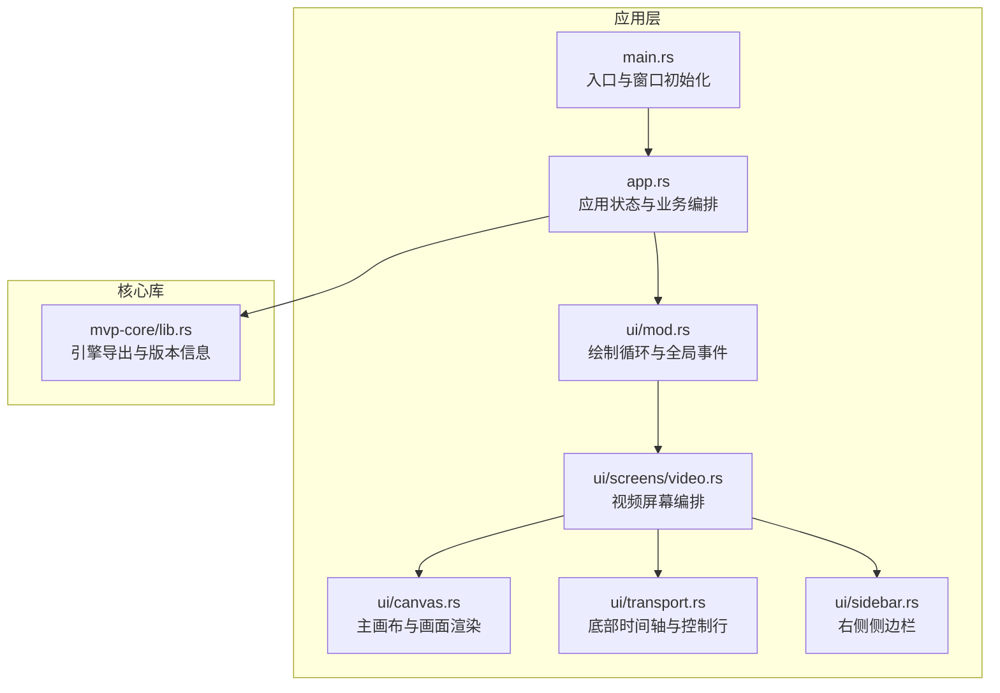
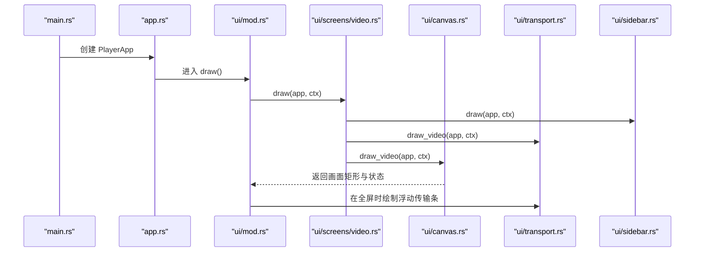
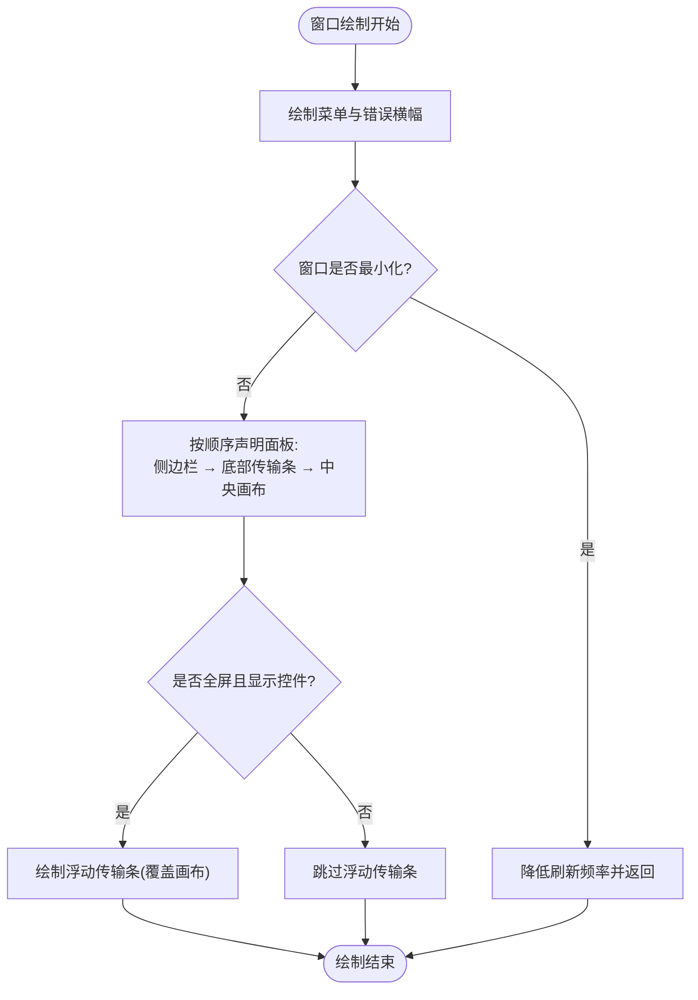
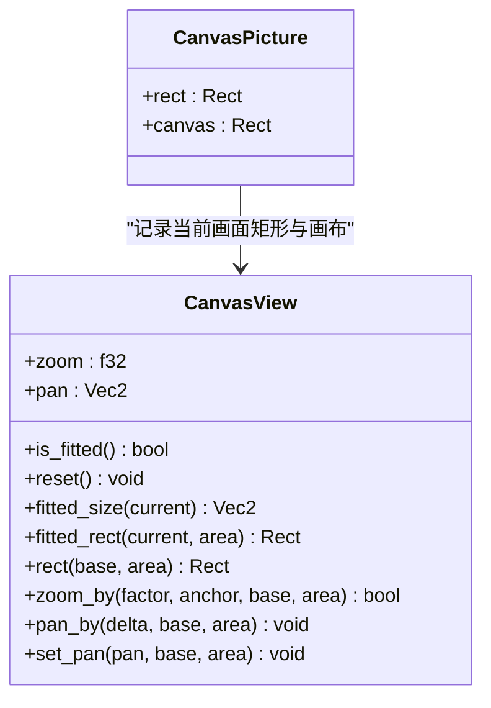
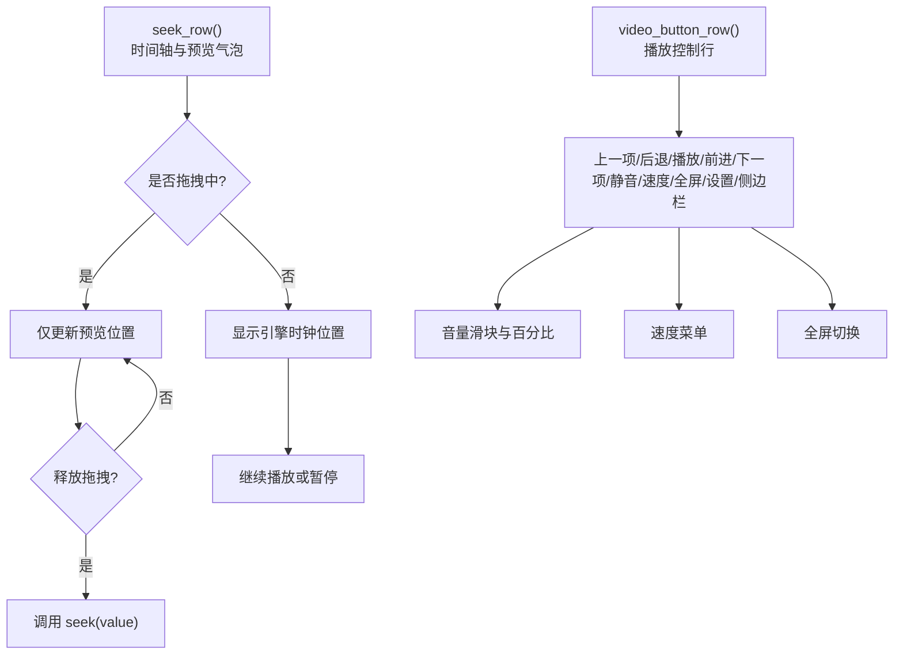
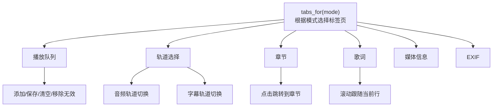
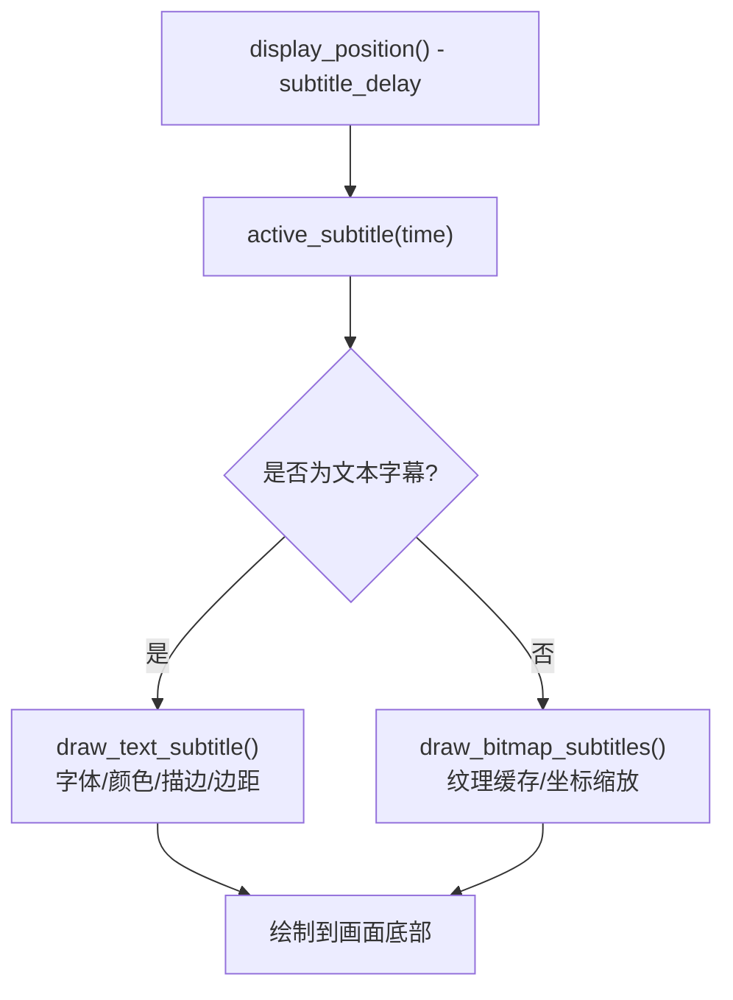
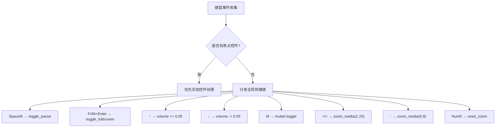
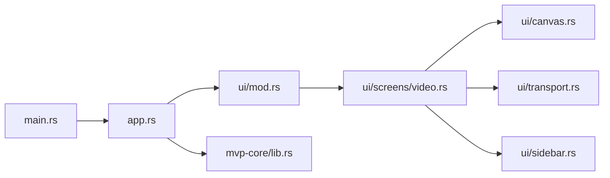
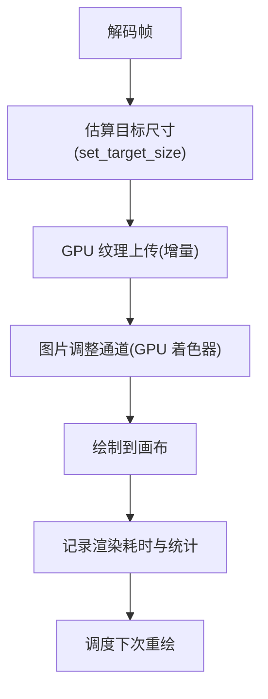

# 视频播放界面

<cite>
**本文引用的文件**   
- [main.rs](file://crates/mvp-player/src/main.rs)
- [app.rs](file://crates/mvp-player/src/app.rs)
- [view.rs](file://crates/mvp-player/src/view.rs)
- [layout.rs](file://crates/mvp-player/src/layout.rs)
- [ui/mod.rs](file://crates/mvp-player/src/ui/mod.rs)
- [ui/screens/video.rs](file://crates/mvp-player/src/ui/screens/video.rs)
- [ui/canvas.rs](file://crates/mvp-player/src/ui/canvas.rs)
- [ui/transport.rs](file://crates/mvp-player/src/ui/transport.rs)
- [ui/sidebar.rs](file://crates/mvp-player/src/ui/sidebar.rs)
- [ui/widgets.rs](file://crates/mvp-player/src/ui/widgets.rs)
- [lib.rs](file://crates/mvp-core/src/lib.rs)
</cite>

## 目录
1. [引言](#引言)
2. [项目结构](#项目结构)
3. [核心组件](#核心组件)
4. [架构总览](#架构总览)
5. [详细组件分析](#详细组件分析)
6. [依赖关系分析](#依赖关系分析)
7. [性能与渲染优化](#性能与渲染优化)
8. [故障排查指南](#故障排查指南)
9. [结论](#结论)
10. [附录：开发扩展指南](#附录开发扩展指南)

## 引言
本文面向“视频播放界面”的开发者与高级用户，系统性说明 MVP-Versatile-Player 的视频播放器布局、交互控制、字幕系统、渲染优化、状态管理、错误处理与性能监控，并提供界面定制与扩展的开发指南。文档以代码仓库中的实际实现为依据，重点覆盖以下方面：
- 主画布区域、底部时间轴、侧边栏控制面板的布局设计
- 播放/暂停、进度条拖拽、音量调节、全屏切换等交互逻辑
- 字幕轨道选择、样式设置、位置调整
- 硬件加速、色彩空间转换、HDR 处理等渲染优化策略
- 播放状态管理、错误处理机制和性能监控
- 自定义控件、主题适配等扩展能力

## 项目结构
MVP-Versatile-Player 采用多 crate 组织：
- mvp-core：媒体引擎（FFmpeg 绑定）、图像视图、播放列表、工具函数等
- mvp-platform：平台相关能力（单实例、显示器、电源管理等）
- mvp-player：桌面应用 UI（egui + Glow），包含窗口、布局、面板、控件、主题等
- mvp-subtitle：字幕解析模型与格式支持

视频播放界面的主要代码位于 mvp-player 的 ui 模块中，由 screens、canvas、transport、sidebar 等子模块协作完成；mvp-core 提供底层解码、帧缓冲、信息读取等能力。

图表来源
- [main.rs:40-181](file://crates/mvp-player/src/main.rs#L40-L181)
- [app.rs:66-178](file://crates/mvp-player/src/app.rs#L66-L178)
- [ui/mod.rs:49-144](file://crates/mvp-player/src/ui/mod.rs#L49-L144)
- [ui/screens/video.rs:16-24](file://crates/mvp-player/src/ui/screens/video.rs#L16-L24)
- [ui/canvas.rs:46-77](file://crates/mvp-player/src/ui/canvas.rs#L46-L77)
- [ui/transport.rs:23-37](file://crates/mvp-player/src/ui/transport.rs#L23-L37)
- [ui/sidebar.rs:14-64](file://crates/mvp-player/src/ui/sidebar.rs#L14-L64)
- [lib.rs:1-46](file://crates/mvp-core/src/lib.rs#L1-L46)

章节来源
- [main.rs:40-181](file://crates/mvp-player/src/main.rs#L40-L181)
- [ui/mod.rs:49-144](file://crates/mvp-player/src/ui/mod.rs#L49-L144)

## 核心组件
- 应用对象 PlayerApp：集中持有引擎、播放列表、设置、UI 状态、纹理与帧历史等，是各子系统通信的唯一枢纽
- 视频屏幕 Video Screen：负责在视频模式下编排侧边栏、底部时间轴与主画布
- 主画布 Canvas：计算画面适配矩形、渲染当前帧、处理缩放/平移、绘制字幕与小鸟地图
- 传输条 Transport：时间轴、播放控制按钮、音量滑块、速度菜单、全屏/设置/侧边栏开关等
- 侧边栏 Sidebar：播放队列、轨道选择、章节、歌词、EXIF、媒体信息等
- 视图几何 View：统一的缩放/平移数学模型，供图片与视频共用
- 布局 Layout：根据窗口宽度动态决定控件显示与尺寸，保证窄窗口下不重叠
- 核心库 Core：FFmpeg 引擎、图像视图、播放列表、工具函数、HDR/Dolby 等

章节来源
- [app.rs:66-178](file://crates/mvp-player/src/app.rs#L66-L178)
- [ui/screens/video.rs:16-24](file://crates/mvp-player/src/ui/screens/video.rs#L16-L24)
- [ui/canvas.rs:46-77](file://crates/mvp-player/src/ui/canvas.rs#L46-L77)
- [ui/transport.rs:23-37](file://crates/mvp-player/src/ui/transport.rs#L23-L37)
- [ui/sidebar.rs:14-64](file://crates/mvp-player/src/ui/sidebar.rs#L14-L64)
- [view.rs:44-128](file://crates/mvp-player/src/view.rs#L44-L128)
- [layout.rs:47-113](file://crates/mvp-player/src/layout.rs#L47-L113)
- [lib.rs:1-46](file://crates/mvp-core/src/lib.rs#L1-L46)

## 架构总览
视频播放界面的绘制流程遵循 egui 的面板顺序约定：先声明顶部面板（菜单、横幅），再声明侧边栏，然后声明底部传输条，最后绘制中央画布。全屏模式下，传输条作为浮动岛覆盖在画布之上。

图表来源
- [main.rs:171-181](file://crates/mvp-player/src/main.rs#L171-L181)
- [ui/mod.rs:49-144](file://crates/mvp-player/src/ui/mod.rs#L49-L144)
- [ui/screens/video.rs:16-24](file://crates/mvp-player/src/ui/screens/video.rs#L16-L24)
- [ui/canvas.rs:46-77](file://crates/mvp-player/src/ui/canvas.rs#L46-L77)
- [ui/transport.rs:23-37](file://crates/mvp-player/src/ui/transport.rs#L23-L37)
- [ui/sidebar.rs:14-64](file://crates/mvp-player/src/ui/sidebar.rs#L14-L64)

## 详细组件分析

### 布局结构与面板组织
- 顶部菜单栏与错误横幅：用于打开文件、设置、快捷键帮助以及错误提示
- 右侧侧边栏：可调整宽度，默认宽度随窗口比例变化，最小/最大宽度受约束
- 底部传输条：固定高度，包含时间轴与播放控制行；全屏时改为浮动岛
- 中央画布：视频模式使用纯黑背景进行信箱适配；音频模式使用窗口背景色

图表来源
- [ui/mod.rs:49-144](file://crates/mvp-player/src/ui/mod.rs#L49-L144)
- [ui/transport.rs:39-70](file://crates/mvp-player/src/ui/transport.rs#L39-L70)
- [layout.rs:70-94](file://crates/mvp-player/src/layout.rs#L70-L94)

章节来源
- [ui/mod.rs:49-144](file://crates/mvp-player/src/ui/mod.rs#L49-L144)
- [ui/screens/video.rs:16-24](file://crates/mvp-player/src/ui/screens/video.rs#L16-L24)
- [ui/canvas.rs:27-49](file://crates/mvp-player/src/ui/canvas.rs#L27-L49)
- [layout.rs:70-94](file://crates/mvp-player/src/layout.rs#L70-L94)

### 主画布区域与画面渲染
- 画面适配：根据源分辨率、纵横比设置、旋转角度计算适配矩形
- 缩放与平移：支持 Ctrl+滚轮缩放（锚定鼠标位置）、拖拽平移、边界钳制
- 目标尺寸优化：根据当前显示矩形反向估算解码目标尺寸，避免过度解码
- 旋转与翻转：通过 UV 顶点置换实现任意旋转与水平/垂直翻转
- 小鸟地图：当画面被裁剪时显示缩略导航图，点击定位到中心点

图表来源
- [view.rs:44-128](file://crates/mvp-player/src/view.rs#L44-L128)
- [ui/canvas.rs:155-262](file://crates/mvp-player/src/ui/canvas.rs#L155-L262)

章节来源
- [ui/canvas.rs:155-262](file://crates/mvp-player/src/ui/canvas.rs#L155-L262)
- [view.rs:44-128](file://crates/mvp-player/src/view.rs#L44-L128)

### 底部时间轴与播放控制
- 时间轴：显示当前时间与总时长，支持拖拽预览、章节标记、A-B 循环区间
- 播放控制：上一项、后退、播放/暂停、前进、下一项、静音、全屏、设置、侧边栏开关
- 音量控制：滑块与百分比显示，支持键盘上下键与滚轮调节
- 速度菜单：预设速度与恢复默认速度
- 自适应布局：根据窗口宽度逐步隐藏次要控件，确保基础控件始终可用

图表来源
- [ui/transport.rs:412-565](file://crates/mvp-player/src/ui/transport.rs#L412-L565)
- [ui/transport.rs:603-800](file://crates/mvp-player/src/ui/transport.rs#L603-L800)

章节来源
- [ui/transport.rs:412-565](file://crates/mvp-player/src/ui/transport.rs#L412-L565)
- [ui/transport.rs:603-800](file://crates/mvp-player/src/ui/transport.rs#L603-L800)

### 侧边栏控制面板
- 播放队列：添加文件/文件夹/网络地址、保存/清空列表、移除无效条目、排序与上下文菜单
- 轨道选择：视频轨道（只读）、音频轨道（可切换）、字幕轨道（可切换）
- 章节：列出章节标题与起始时间，点击跳转
- 歌词：将字幕作为滚动歌词展示，高亮当前行，点击跳转
- EXIF/信息：图片元数据与媒体信息展示

图表来源
- [ui/sidebar.rs:67-84](file://crates/mvp-player/src/ui/sidebar.rs#L67-L84)
- [ui/sidebar.rs:100-432](file://crates/mvp-player/src/ui/sidebar.rs#L100-L432)
- [ui/sidebar.rs:446-596](file://crates/mvp-player/src/ui/sidebar.rs#L446-L596)
- [ui/sidebar.rs:602-637](file://crates/mvp-player/src/ui/sidebar.rs#L602-L637)
- [ui/sidebar.rs:649-701](file://crates/mvp-player/src/ui/sidebar.rs#L649-L701)

章节来源
- [ui/sidebar.rs:67-84](file://crates/mvp-player/src/ui/sidebar.rs#L67-L84)
- [ui/sidebar.rs:100-432](file://crates/mvp-player/src/ui/sidebar.rs#L100-L432)
- [ui/sidebar.rs:446-596](file://crates/mvp-player/src/ui/sidebar.rs#L446-L596)
- [ui/sidebar.rs:602-637](file://crates/mvp-player/src/ui/sidebar.rs#L602-L637)
- [ui/sidebar.rs:649-701](file://crates/mvp-player/src/ui/sidebar.rs#L649-L701)

### 字幕显示系统
- 文本字幕：根据配置大小、颜色、描边与边距渲染到画面底部
- 位图字幕：缓存纹理并按坐标缩放绘制，支持 PGS/VobSub 等格式
- 轨道选择：侧边栏“轨道”页可选择内嵌字幕轨道或关闭字幕
- 外部字幕：支持加载外部字幕文件，并在轨道页显示状态
- 延迟调整：通过设置项调整字幕延迟，使字幕与音画同步

图表来源
- [ui/canvas.rs:401-530](file://crates/mvp-player/src/ui/canvas.rs#L401-L530)
- [ui/sidebar.rs:539-596](file://crates/mvp-player/src/ui/sidebar.rs#L539-L596)

章节来源
- [ui/canvas.rs:401-530](file://crates/mvp-player/src/ui/canvas.rs#L401-L530)
- [ui/sidebar.rs:539-596](file://crates/mvp-player/src/ui/sidebar.rs#L539-L596)

### 交互逻辑与键盘快捷键
- 播放/暂停：空格/K 键，按钮状态根据播放/结束状态变化
- 进度条拖拽：拖动预览时间，释放后执行 seek
- 音量调节：滚轮或上下键，支持百分比显示与静音切换
- 全屏切换：F 键或 Alt+Enter，按钮切换图标
- 缩放与平移：Ctrl+滚轮缩放（锚定鼠标），拖拽平移，双击切换全屏
- 其他快捷键：截图、前后曲、打开文件/文件夹、URL 输入、设置、随机/循环、A-B 循环、置顶、旋转、重置缩放等

图表来源
- [ui/mod.rs:319-510](file://crates/mvp-player/src/ui/mod.rs#L319-L510)
- [ui/canvas.rs:287-351](file://crates/mvp-player/src/ui/canvas.rs#L287-L351)

章节来源
- [ui/mod.rs:319-510](file://crates/mvp-player/src/ui/mod.rs#L319-L510)
- [ui/canvas.rs:287-351](file://crates/mvp-player/src/ui/canvas.rs#L287-L351)

## 依赖关系分析
- main.rs 负责进程启动、参数解析、单实例、窗口创建与 eframe 运行
- app.rs 聚合引擎、播放列表、设置、UI 状态、纹理与帧历史，协调各模块
- ui/mod.rs 定义绘制循环、全局事件处理、性能统计与重绘调度
- screens/video.rs 编排视频模式的侧边栏、传输条与画布
- canvas.rs 负责画面适配、缩放/平移、字幕与小鸟地图
- transport.rs 负责时间轴与播放控制行
- sidebar.rs 负责播放队列、轨道、章节、歌词、EXIF、信息
- lib.rs 导出核心库能力（引擎、图像视图、HDR/Dolby 等）

图表来源
- [main.rs:40-181](file://crates/mvp-player/src/main.rs#L40-L181)
- [app.rs:66-178](file://crates/mvp-player/src/app.rs#L66-L178)
- [ui/mod.rs:49-144](file://crates/mvp-player/src/ui/mod.rs#L49-L144)
- [ui/screens/video.rs:16-24](file://crates/mvp-player/src/ui/screens/video.rs#L16-L24)
- [ui/canvas.rs:46-77](file://crates/mvp-player/src/ui/canvas.rs#L46-L77)
- [ui/transport.rs:23-37](file://crates/mvp-player/src/ui/transport.rs#L23-L37)
- [ui/sidebar.rs:14-64](file://crates/mvp-player/src/ui/sidebar.rs#L14-L64)
- [lib.rs:1-46](file://crates/mvp-core/src/lib.rs#L1-L46)

章节来源
- [main.rs:40-181](file://crates/mvp-player/src/main.rs#L40-L181)
- [app.rs:66-178](file://crates/mvp-player/src/app.rs#L66-L178)
- [ui/mod.rs:49-144](file://crates/mvp-player/src/ui/mod.rs#L49-L144)
- [lib.rs:1-46](file://crates/mvp-core/src/lib.rs#L1-L46)

## 性能与渲染优化
- 硬件加速：使用 Glow 渲染器与 OpenGL 纹理上传，减少 CPU 负担
- 目标尺寸优化：根据显示矩形估算解码目标尺寸，避免对 4K 视频全尺寸解码
- 帧缓存与增量上传：已上传帧序列号与 PTS 缓存，避免重复转换与上传
- 渲染半程计时：记录每帧渲染耗时、平均值与最坏值，超过阈值记录日志
- 重绘调度：根据播放状态与窗口可见性智能安排下一次重绘，避免空转
- HDR 与色彩空间：核心库暴露 HDR 信息与色调映射接口，图片调整通道支持 GPU 着色器路径
- 字幕纹理缓存：位图字幕纹理按关键键缓存，避免重复构建

图表来源
- [ui/canvas.rs:178-199](file://crates/mvp-player/src/ui/canvas.rs#L178-L199)
- [ui/canvas.rs:613-702](file://crates/mvp-player/src/ui/canvas.rs#L613-L702)
- [ui/mod.rs:169-226](file://crates/mvp-player/src/ui/mod.rs#L169-L226)
- [ui/mod.rs:229-283](file://crates/mvp-player/src/ui/mod.rs#L229-L283)
- [lib.rs:32-46](file://crates/mvp-core/src/lib.rs#L32-L46)

章节来源
- [ui/canvas.rs:178-199](file://crates/mvp-player/src/ui/canvas.rs#L178-L199)
- [ui/canvas.rs:613-702](file://crates/mvp-player/src/ui/canvas.rs#L613-L702)
- [ui/mod.rs:169-226](file://crates/mvp-player/src/ui/mod.rs#L169-L226)
- [ui/mod.rs:229-283](file://crates/mvp-player/src/ui/mod.rs#L229-L283)
- [lib.rs:32-46](file://crates/mvp-core/src/lib.rs#L32-L46)

## 故障排查指南
- 错误横幅：在菜单下方显示可关闭的错误提示，便于用户快速了解问题
- 连续慢帧日志：渲染半程超过阈值时累计计数，每 60 次记录一次警告日志
- 最小化窗口节流：最小化时将刷新频率降至约 2Hz，避免后台解码与纹理上传造成卡顿
- 打开文件节流：文件仍在打开时，每隔 100ms 请求一帧，避免界面停留在“正在打开…”
- 单实例失败降级：单实例检测失败不影响播放器功能，仅无法合并窗口

章节来源
- [ui/mod.rs:518-563](file://crates/mvp-player/src/ui/mod.rs#L518-L563)
- [ui/mod.rs:198-226](file://crates/mvp-player/src/ui/mod.rs#L198-L226)
- [ui/mod.rs:146-161](file://crates/mvp-player/src/ui/mod.rs#L146-L161)
- [ui/mod.rs:236-249](file://crates/mvp-player/src/ui/mod.rs#L236-L249)
- [main.rs:69-99](file://crates/mvp-player/src/main.rs#L69-L99)

## 结论
该视频播放界面以清晰的布局分层、稳健的状态管理与高效的渲染优化为核心，提供了完整的播放控制、字幕系统与侧边栏管理能力。通过 egui 面板顺序与自适应布局，界面在不同窗口尺寸下保持稳定；通过目标尺寸估算、纹理缓存与 GPU 调整通道，渲染路径高效且可扩展。结合性能统计与错误横幅，用户与开发者均可获得良好的体验与诊断能力。

## 附录：开发扩展指南
- 自定义控件：基于 widgets.rs 提供的 section、row、chip、key_value 等通用控件，保持设计令牌一致
- 主题适配：使用 theme::Tokens 与 font/space/radius 常量，确保控件在不同主题下表现一致
- 新增面板：在 ui/screens 下新增屏幕模块，并在 ui/mod.rs 的 draw 流程中编排
- 扩展字幕样式：在 canvas.rs 的 draw_text_subtitle 中增加更多样式选项（如阴影、背景框）
- 扩展渲染管线：在 picture_pass 中增加新的 GPU 效果，并在 image_transformed 中接入
- 扩展快捷键：在 ui/mod.rs 的 handle_keyboard 中添加新快捷键映射

章节来源
- [ui/widgets.rs:26-137](file://crates/mvp-player/src/ui/widgets.rs#L26-L137)
- [ui/canvas.rs:411-456](file://crates/mvp-player/src/ui/canvas.rs#L411-L456)
- [ui/mod.rs:319-510](file://crates/mvp-player/src/ui/mod.rs#L319-L510)