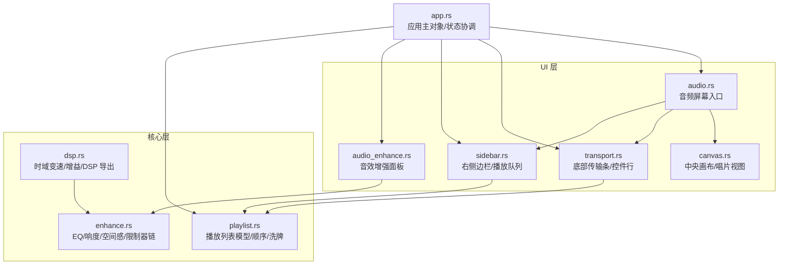
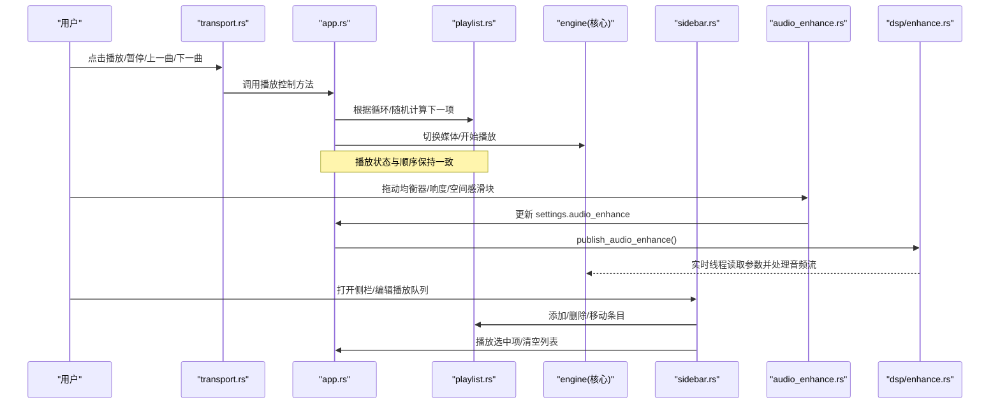
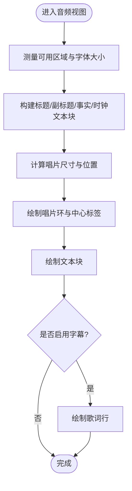
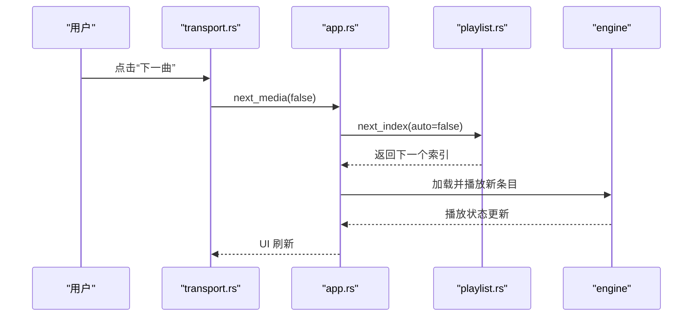
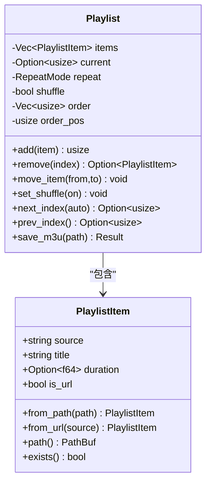
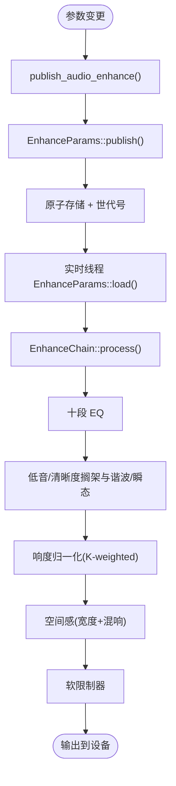
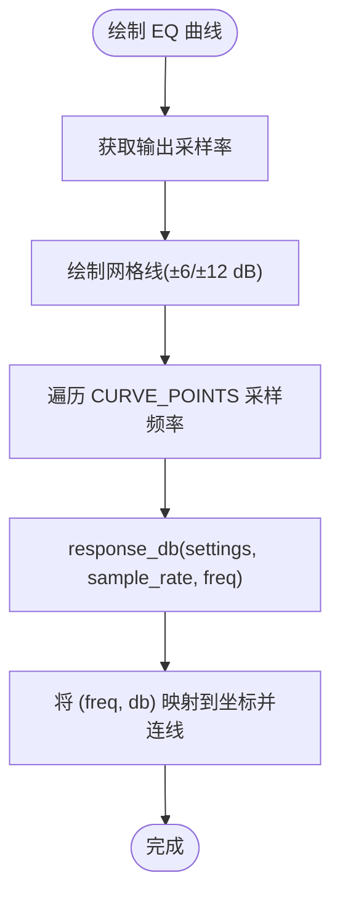
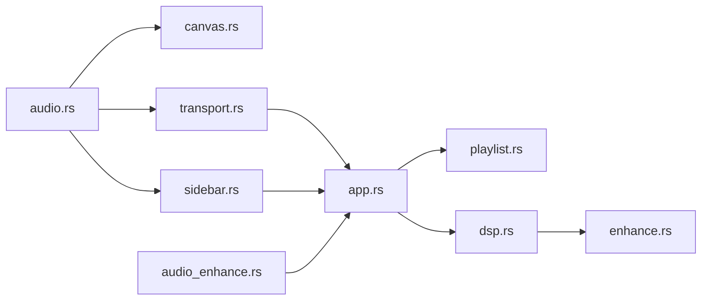

# 音频播放界面

<cite>
**本文引用的文件**   
- [audio.rs](file://crates/mvp-player/src/ui/screens/audio.rs)
- [canvas.rs](file://crates/mvp-player/src/ui/canvas.rs)
- [transport.rs](file://crates/mvp-player/src/ui/transport.rs)
- [sidebar.rs](file://crates/mvp-player/src/ui/sidebar.rs)
- [audio_enhance.rs](file://crates/mvp-player/src/ui/audio_enhance.rs)
- [dsp.rs](file://crates/mvp-core/src/dsp.rs)
- [enhance.rs](file://crates/mvp-core/src/dsp/enhance.rs)
- [playlist.rs](file://crates/mvp-core/src/playlist.rs)
- [app.rs](file://crates/mvp-player/src/app.rs)
</cite>

## 目录
1. [简介](#简介)
2. [项目结构](#项目结构)
3. [核心组件](#核心组件)
4. [架构总览](#架构总览)
5. [详细组件分析](#详细组件分析)
6. [依赖关系分析](#依赖关系分析)
7. [性能与体验特性](#性能与体验特性)
8. [故障排查指南](#故障排查指南)
9. [结论](#结论)
10. [附录：扩展与定制指南](#附录扩展与定制指南)

## 简介
本文件面向“音频播放界面”的完整技术文档，覆盖以下目标：
- 音频播放器布局设计：专辑封面展示区、播放列表面板、频谱分析与可视化区域的布局结构。
- 播放控制功能：播放/暂停、上一首/下一首、循环模式、随机播放等交互逻辑。
- 音效增强系统：十段均衡器、响度归一化、空间感增强等 DSP 效果的控制界面与实现。
- 播放列表管理：歌曲排序、收藏标记（当前实现为选择与移动）、搜索过滤（可扩展点）。
- 频谱分析与可视化：基于均衡器响应曲线的可视化技术说明。
- 开发指南：如何扩展自定义可视化效果与集成音效插件。

## 项目结构
本项目采用多 crate 分层组织：
- mvp-core：核心引擎与 DSP、播放列表模型、工具函数。
- mvp-player：UI 层（egui），包括屏幕、控件、主题、状态机与应用主对象。
- mvp-platform：平台相关能力（电源、单实例、Shell 等）。
- mvp-subtitle：字幕解析与渲染数据模型。

与音频播放界面直接相关的代码主要位于：
- UI 层：screens/audio.rs、canvas.rs、transport.rs、sidebar.rs、audio_enhance.rs
- 核心层：dsp.rs、dsp/enhance.rs、playlist.rs
- 应用协调：app.rs

图表来源
- [audio.rs:15-23](file://crates/mvp-player/src/ui/screens/audio.rs#L15-L23)
- [canvas.rs:51-63](file://crates/mvp-player/src/ui/canvas.rs#L51-L63)
- [transport.rs:79-93](file://crates/mvp-player/src/ui/transport.rs#L79-L93)
- [sidebar.rs:14-64](file://crates/mvp-player/src/ui/sidebar.rs#L14-L64)
- [audio_enhance.rs:53-94](file://crates/mvp-player/src/ui/audio_enhance.rs#L53-L94)
- [dsp.rs:1-20](file://crates/mvp-core/src/dsp.rs#L1-L20)
- [enhance.rs:1-33](file://crates/mvp-core/src/dsp/enhance.rs#L1-L33)
- [playlist.rs:101-114](file://crates/mvp-core/src/playlist.rs#L101-L114)
- [app.rs:66-134](file://crates/mvp-player/src/app.rs#L66-L134)

章节来源
- [audio.rs:15-23](file://crates/mvp-player/src/ui/screens/audio.rs#L15-L23)
- [canvas.rs:51-63](file://crates/mvp-player/src/ui/canvas.rs#L51-L63)
- [transport.rs:79-93](file://crates/mvp-player/src/ui/transport.rs#L79-L93)
- [sidebar.rs:14-64](file://crates/mvp-player/src/ui/sidebar.rs#L14-L64)
- [audio_enhance.rs:53-94](file://crates/mvp-player/src/ui/audio_enhance.rs#L53-L94)
- [dsp.rs:1-20](file://crates/mvp-core/src/dsp.rs#L1-L20)
- [enhance.rs:1-33](file://crates/mvp-core/src/dsp/enhance.rs#L1-L33)
- [playlist.rs:101-114](file://crates/mvp-core/src/playlist.rs#L101-L114)
- [app.rs:66-134](file://crates/mvp-player/src/app.rs#L66-L134)

## 核心组件
- 音频屏幕入口：负责在侧栏可见时绘制侧栏，非全屏时绘制底部传输条，并绘制中央画布的音频视图。
- 中央画布：音频模式下不显示视频帧，而是绘制“唱片式”视觉区域，包含标题、信息、进度环和歌词（若存在字幕轨道）。
- 传输条：提供播放控制、音量、速度、输出设备选择、A-B 循环、随机播放、循环模式切换等。
- 侧边栏：播放队列、音轨/字幕轨道选择、章节、媒体信息与歌词滚动。
- 音效增强面板：浮动窗口，提供 EQ 曲线、十段均衡器、低音/清晰度、响度与保护、空间感等参数调节。
- 核心 DSP：时间拉伸（SOLA）、增益软限幅、十段 EQ、响度归一化、空间混响、限制器等。
- 播放列表：条目模型、顺序/洗牌、循环模式、M3U/PLS 导入导出、自然排序。

章节来源
- [audio.rs:15-23](file://crates/mvp-player/src/ui/screens/audio.rs#L15-L23)
- [canvas.rs:737-800](file://crates/mvp-player/src/ui/canvas.rs#L737-L800)
- [transport.rs:114-320](file://crates/mvp-player/src/ui/transport.rs#L114-L320)
- [sidebar.rs:100-432](file://crates/mvp-player/src/ui/sidebar.rs#L100-L432)
- [audio_enhance.rs:97-259](file://crates/mvp-player/src/ui/audio_enhance.rs#L97-L259)
- [dsp.rs:21-50](file://crates/mvp-core/src/dsp.rs#L21-L50)
- [enhance.rs:58-105](file://crates/mvp-core/src/dsp/enhance.rs#L58-L105)
- [playlist.rs:44-114](file://crates/mvp-core/src/playlist.rs#L44-L114)

## 架构总览
音频播放界面的关键流程如下：
- 用户操作（播放/暂停、切歌、循环/随机、音量、速度、设备）通过 transport.rs 调用 app.rs 的方法。
- app.rs 协调 engine、playlist、settings 与 UI 状态，必要时触发保存或提示。
- 音效增强面板将参数写入 settings.audio_enhance，并通过 publish_audio_enhance 发布到 EnhanceParams，供实时 DSP 链读取。
- 中央画布在音频模式下绘制唱片视图与歌词；若有字幕轨道则叠加歌词。
- 播放列表由 sidebar.rs 提供增删改查与拖拽重排，底层由 playlist.rs 维护顺序与洗牌序列。

图表来源
- [transport.rs:114-320](file://crates/mvp-player/src/ui/transport.rs#L114-L320)
- [sidebar.rs:100-432](file://crates/mvp-player/src/ui/sidebar.rs#L100-L432)
- [audio_enhance.rs:97-259](file://crates/mvp-player/src/ui/audio_enhance.rs#L97-L259)
- [enhance.rs:206-321](file://crates/mvp-core/src/dsp/enhance.rs#L206-L321)
- [playlist.rs:250-332](file://crates/mvp-core/src/playlist.rs#L250-L332)

## 详细组件分析

### 音频屏幕布局与唱片视图
- 布局组成：
  - 顶部/左侧：可选侧边栏（播放队列、歌词、轨道信息等）。
  - 中央：唱片式视觉区域，包含标题、副标题（编码信息）、进度环、时钟行。
  - 底部：传输条（播放控制、音量、速度、设备选择、循环/随机等）。
- 唱片视图绘制：
  - 使用固定比例与间距，按可用区域计算 artwork 尺寸与文本块高度。
  - 标题优先取媒体标签，否则回退到文件名；事实信息来自引擎探测结果。
  - 若存在字幕轨道且开启字幕，则在唱片下方叠加歌词。

图表来源
- [canvas.rs:737-800](file://crates/mvp-player/src/ui/canvas.rs#L737-L800)
- [canvas.rs:51-63](file://crates/mvp-player/src/ui/canvas.rs#L51-L63)

章节来源
- [audio.rs:15-23](file://crates/mvp-player/src/ui/screens/audio.rs#L15-L23)
- [canvas.rs:737-800](file://crates/mvp-player/src/ui/canvas.rs#L737-L800)

### 播放控制与交互逻辑
- 播放/暂停：
  - 根据引擎状态决定图标与提示（播放/暂停/重播）。
  - 点击后调用 engine.toggle_pause()。
- 上一首/下一首：
  - 调用 app.prev_media()/next_media(false)，内部依据 playlist.next_index()/prev_index() 与 RepeatMode 计算。
- 循环模式：
  - 按钮循环 Off → All → One → Off，并在 OSD 中显示当前模式。
- 随机播放：
  - 切换 app.settings.shuffle，影响 playlist.rebuild_order() 与 next_index()。
- 音量与静音：
  - 音量滑块与百分比显示；静音按钮切换 muted 标志。
- 速度与设备：
  - 速度菜单支持预设档位与恢复默认；输出设备菜单仅在下一次启动生效。
- A-B 循环：
  - 切换 engine.ab_loop()，用于单曲片段循环。

图表来源
- [transport.rs:114-320](file://crates/mvp-player/src/ui/transport.rs#L114-L320)
- [playlist.rs:260-332](file://crates/mvp-core/src/playlist.rs#L260-L332)

章节来源
- [transport.rs:114-320](file://crates/mvp-player/src/ui/transport.rs#L114-L320)
- [playlist.rs:260-332](file://crates/mvp-core/src/playlist.rs#L260-L332)

### 播放列表面板
- 功能：
  - 添加文件/文件夹/网络地址；保存/清空列表；移除不存在文件。
  - 列表项显示序号/标题/类型/时长；悬停显示移除、上移、下移操作。
  - 双击播放，单击高亮选择；右键上下文菜单支持播放、显示文件、移除、清空。
- 数据结构：
  - PlaylistItem：source/title/duration/is_url。
  - Playlist：items/current/repeat/shuffle/order/order_pos。
- 行为：
  - 插入/删除/移动条目时保持 current 指向合理位置。
  - 洗牌使用 Fisher–Yates 算法生成 order 序列。
  - 支持 M3U/PLS 导入与 M3U 导出。

图表来源
- [playlist.rs:44-114](file://crates/mvp-core/src/playlist.rs#L44-L114)
- [playlist.rs:159-228](file://crates/mvp-core/src/playlist.rs#L159-L228)
- [playlist.rs:250-332](file://crates/mvp-core/src/playlist.rs#L250-L332)
- [playlist.rs:365-380](file://crates/mvp-core/src/playlist.rs#L365-L380)

章节来源
- [sidebar.rs:100-432](file://crates/mvp-player/src/ui/sidebar.rs#L100-L432)
- [playlist.rs:44-114](file://crates/mvp-core/src/playlist.rs#L44-L114)
- [playlist.rs:159-228](file://crates/mvp-core/src/playlist.rs#L159-L228)
- [playlist.rs:250-332](file://crates/mvp-core/src/playlist.rs#L250-L332)
- [playlist.rs:365-380](file://crates/mvp-core/src/playlist.rs#L365-L380)

### 音效增强系统与 DSP 链
- 面板结构：
  - 开关“启用音效增强”，无输出设备时禁用控制并提示。
  - 预设下拉框，一键应用 EQ 预设。
  - 均衡器曲线图：按输出采样率绘制，频率轴对数刻度，垂直轴 ±12 dB。
  - 十段均衡器：31 Hz 至 16 kHz，每段增益 -12..=12 dB。
  - 低音与清晰度：低通/高通搁架滤波器与谐波/瞬态增强。
  - 响度与保护：目标响度、跟随速度、限制器上限。
  - 空间感：立体声宽度、空间残响。
- 参数发布与读取：
  - 界面修改 settings.audio_enhance，调用 app.publish_audio_enhance()。
  - EnhanceParams 使用原子变量与世代号保证实时线程一致性读取。
- DSP 链顺序：
  - EQ → 低音搁架+谐波 → 清晰度搁架+瞬态 → 响度归一化 → 空间感 → 限制器。
  - 所有参数平滑过渡，避免“拉链噪声”。

图表来源
- [audio_enhance.rs:97-259](file://crates/mvp-player/src/ui/audio_enhance.rs#L97-L259)
- [enhance.rs:206-321](file://crates/mvp-core/src/dsp/enhance.rs#L206-L321)
- [enhance.rs:439-512](file://crates/mvp-core/src/dsp/enhance.rs#L439-L512)
- [enhance.rs:620-743](file://crates/mvp-core/src/dsp/enhance.rs#L620-L743)

章节来源
- [audio_enhance.rs:97-259](file://crates/mvp-player/src/ui/audio_enhance.rs#L97-L259)
- [enhance.rs:58-105](file://crates/mvp-core/src/dsp/enhance.rs#L58-L105)
- [enhance.rs:206-321](file://crates/mvp-core/src/dsp/enhance.rs#L206-L321)
- [enhance.rs:439-512](file://crates/mvp-core/src/dsp/enhance.rs#L439-L512)
- [enhance.rs:620-743](file://crates/mvp-core/src/dsp/enhance.rs#L620-L743)

### 频谱分析与可视化技术
- 当前可视化：
  - 并非实时 FFT 频谱，而是基于 EQ 系数的频响曲线可视化。
  - 曲线按输出采样率绘制，频率轴对数刻度，垂直轴以 dB 表示。
  - 每个频段增益通过 Coeffs::peaking 计算幅度响应，搁架滤波器贡献相加。
- 技术要点：
  - 曲线与 DSP 实际使用的 RBJ 系数一致，确保所见即所得。
  - 当所有参数中性时曲线平坦；移动某频段会在其中心频率附近出现峰值。
  - 频率轴几何中点对应范围的中频，符合人耳感知习惯。

图表来源
- [audio_enhance.rs:297-384](file://crates/mvp-player/src/ui/audio_enhance.rs#L297-L384)
- [dsp.rs:16-19](file://crates/mvp-core/src/dsp.rs#L16-L19)

章节来源
- [audio_enhance.rs:297-384](file://crates/mvp-player/src/ui/audio_enhance.rs#L297-L384)
- [dsp.rs:16-19](file://crates/mvp-core/src/dsp.rs#L16-L19)

## 依赖关系分析
- UI 层依赖：
  - audio.rs 依赖 canvas.rs、sidebar.rs、transport.rs。
  - transport.rs 依赖 app.rs、icons、state、theme、widgets。
  - sidebar.rs 依赖 app.rs、icons、settings、state、theme、widgets。
  - audio_enhance.rs 依赖 app.rs、settings、theme、surface、widgets。
- 核心层依赖：
  - dsp.rs 导出 TimeStretcher、Coeffs、EnhanceChain 等。
  - enhance.rs 实现 EQ/响度/空间感/限制器链，依赖 biquad.rs。
  - playlist.rs 提供播放列表模型与 M3U/PLS 读写。
- 应用协调：
  - app.rs 持有 Engine、Playlist、Settings、UiState，协调各模块。

图表来源
- [audio.rs:15-23](file://crates/mvp-player/src/ui/screens/audio.rs#L15-L23)
- [transport.rs:1-12](file://crates/mvp-player/src/ui/transport.rs#L1-L12)
- [sidebar.rs:1-12](file://crates/mvp-player/src/ui/sidebar.rs#L1-L12)
- [audio_enhance.rs:23-30](file://crates/mvp-player/src/ui/audio_enhance.rs#L23-L30)
- [app.rs:66-134](file://crates/mvp-player/src/app.rs#L66-L134)
- [dsp.rs:1-20](file://crates/mvp-core/src/dsp.rs#L1-L20)
- [enhance.rs:1-33](file://crates/mvp-core/src/dsp/enhance.rs#L1-L33)
- [playlist.rs:101-114](file://crates/mvp-core/src/playlist.rs#L101-L114)

章节来源
- [audio.rs:15-23](file://crates/mvp-player/src/ui/screens/audio.rs#L15-L23)
- [transport.rs:1-12](file://crates/mvp-player/src/ui/transport.rs#L1-L12)
- [sidebar.rs:1-12](file://crates/mvp-player/src/ui/sidebar.rs#L1-L12)
- [audio_enhance.rs:23-30](file://crates/mvp-player/src/ui/audio_enhance.rs#L23-L30)
- [app.rs:66-134](file://crates/mvp-player/src/app.rs#L66-L134)
- [dsp.rs:1-20](file://crates/mvp-core/src/dsp.rs#L1-L20)
- [enhance.rs:1-33](file://crates/mvp-core/src/dsp/enhance.rs#L1-L33)
- [playlist.rs:101-114](file://crates/mvp-core/src/playlist.rs#L101-L114)

## 性能与体验特性
- 实时 DSP 零分配：
  - EnhanceParams 使用原子变量与世代号，避免锁与分配，适合音频回调线程。
  - 参数平滑过渡，避免“拉链噪声”。
- 延迟与旁路：
  - 当所有参数中性时自动旁路，音质与未启用一致。
  - 面板显示引入的延迟毫秒数。
- 变速与增益：
  - SOLA 时间拉伸保持音高不变，速度范围 0.25x–4.0x。
  - 增益使用软限幅 tanh 膝部，避免削波失真。
- UI 优化：
  - 传输条与侧边栏按需裁剪可选控件，适应窄窗口。
  - 列表项离屏跳过绘制，减少文本排版成本。

章节来源
- [enhance.rs:206-321](file://crates/mvp-core/src/dsp/enhance.rs#L206-L321)
- [audio_enhance.rs:103-125](file://crates/mvp-player/src/ui/audio_enhance.rs#L103-L125)
- [dsp.rs:21-50](file://crates/mvp-core/src/dsp.rs#L21-L50)
- [dsp.rs:302-355](file://crates/mvp-core/src/dsp.rs#L302-L355)
- [sidebar.rs:213-224](file://crates/mvp-player/src/ui/sidebar.rs#L213-L224)

## 故障排查指南
- 没有可用的音频输出设备：
  - 音效增强面板会提示“当前没有可用的音频输出设备，音效不会生效”。
  - 检查系统声音设置与驱动，确认设备已连接。
- 音效无效或延迟异常：
  - 确认“启用音效增强”已打开，且参数非全部中性。
  - 观察面板显示的延迟值，确认是否在可接受范围。
- 播放列表无法播放：
  - 使用“移除不存在的文件”清理无效条目。
  - 检查文件路径或网络地址是否有效。
- 歌词不显示：
  - 确认已加载字幕轨道或外部字幕文件，并开启字幕显示。
  - 检查字幕延迟设置是否正确。

章节来源
- [audio_enhance.rs:103-125](file://crates/mvp-player/src/ui/audio_enhance.rs#L103-L125)
- [sidebar.rs:146-163](file://crates/mvp-player/src/ui/sidebar.rs#L146-L163)
- [canvas.rs:401-408](file://crates/mvp-player/src/ui/canvas.rs#L401-L408)

## 结论
音频播放界面以清晰的布局与丰富的控制为核心，结合强大的 DSP 链与灵活的播放列表管理，提供了专业级的听音体验。EQ 曲线可视化确保所见即所得，实时参数更新保证流畅交互。未来可在现有基础上扩展更多可视化效果与音效插件，进一步提升可定制性与专业性。

## 附录：扩展与定制指南
- 自定义可视化效果：
  - 在 canvas.rs 的 audio_view 中添加新的绘制逻辑，例如实时频谱柱状图或波形显示。
  - 如需 FFT 频谱，可在核心层新增 FFT 模块，并在 UI 层按帧采集数据绘制。
- 音效插件集成：
  - 在 enhance.rs 中扩展 EnhanceChain，增加新的处理阶段（如压缩器、混响、合唱等）。
  - 在 audio_enhance.rs 中添加对应控制面板，并将参数通过 EnhanceParams 发布。
- 播放列表增强：
  - 在 sidebar.rs 的 playlist_tab 中添加搜索过滤输入框，按标题/类型/时长筛选。
  - 在 playlist.rs 中扩展 PlaylistItem，增加收藏标记字段，并在 UI 中显示星标。
- 快捷键与手势：
  - 在 transport.rs 中扩展键盘快捷键映射，支持更多快捷操作。
  - 在 canvas.rs 中增加鼠标手势（如滚轮缩放、拖拽平移）以提升交互体验。

章节来源
- [canvas.rs:737-800](file://crates/mvp-player/src/ui/canvas.rs#L737-L800)
- [enhance.rs:1-33](file://crates/mvp-core/src/dsp/enhance.rs#L1-L33)
- [audio_enhance.rs:97-259](file://crates/mvp-player/src/ui/audio_enhance.rs#L97-L259)
- [sidebar.rs:100-432](file://crates/mvp-player/src/ui/sidebar.rs#L100-L432)
- [transport.rs:114-320](file://crates/mvp-player/src/ui/transport.rs#L114-L320)