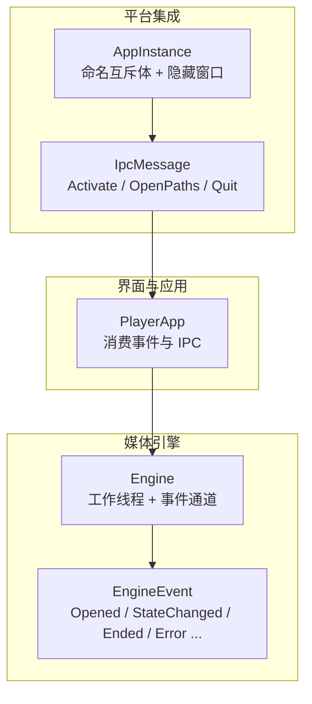
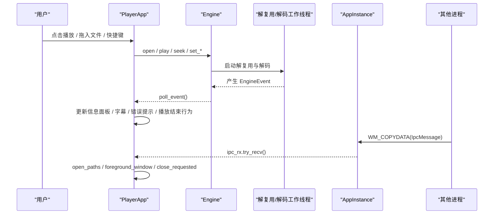
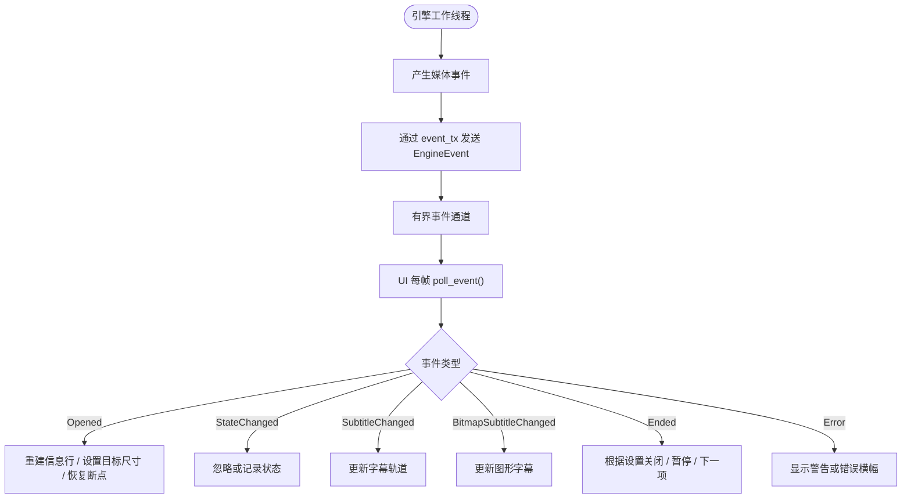
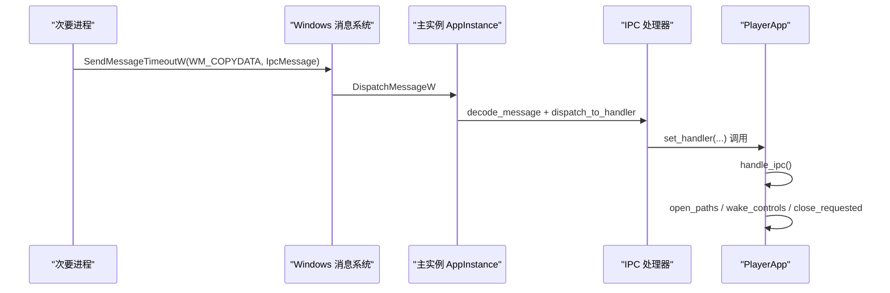
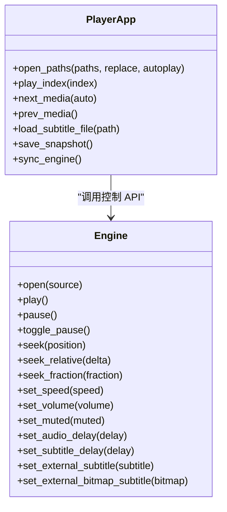
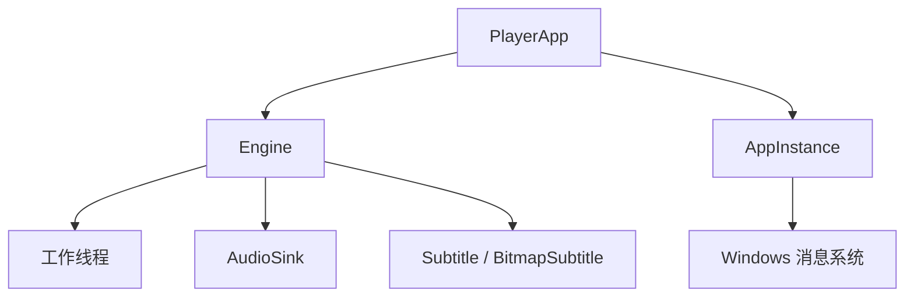
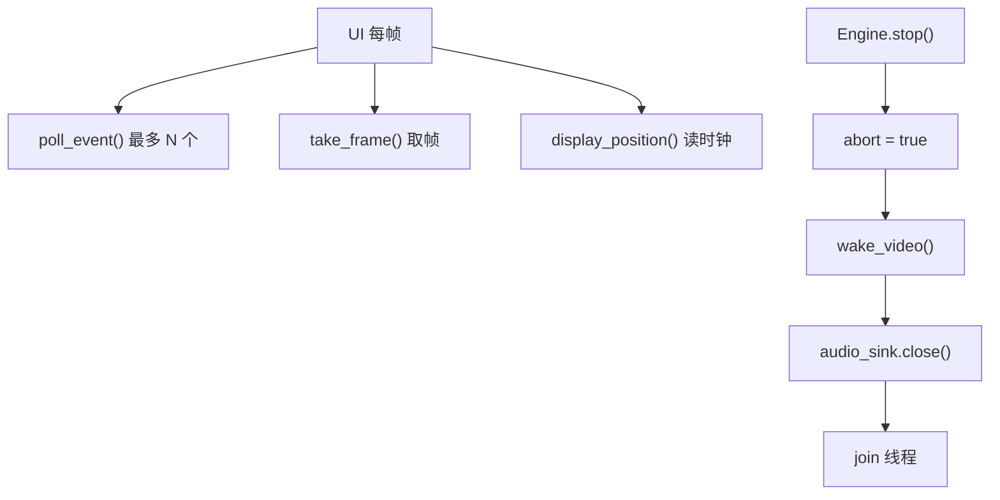
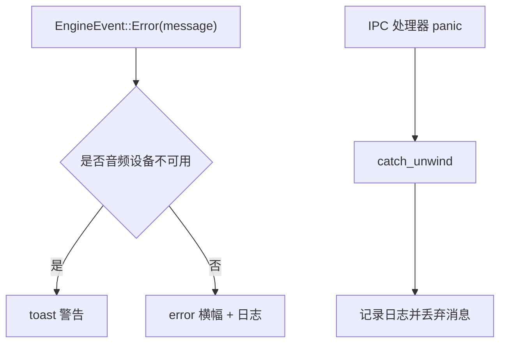

# 事件系统

<cite>
**本文引用的文件**   
- [README.md](file://README.md)
- [app.rs](file://crates/mvp-player/src/app.rs)
- [engine.rs](file://crates/mvp-core/src/engine.rs)
- [single_instance.rs](file://crates/mvp-platform/src/single_instance.rs)
- [playback.rs](file://crates/mvp-core/tests/playback.rs)
- [player_loop.rs](file://crates/mvp-core/tests/player_loop.rs)
- [seek_storm.rs](file://crates/mvp-core/tests/seek_storm.rs)
</cite>

## 目录
1. [引言](#引言)
2. [项目结构](#项目结构)
3. [核心组件](#核心组件)
4. [架构总览](#架构总览)
5. [详细组件分析](#详细组件分析)
6. [依赖关系分析](#依赖关系分析)
7. [性能与队列特性](#性能与队列特性)
8. [错误处理与异常恢复](#错误处理与异常恢复)
9. [调试与使用示例](#调试与使用示例)
10. [结论](#结论)

## 引言
本文件面向“事件系统”这一主题，围绕 MVP-Versatile-Player 的播放引擎、界面应用层与 Windows 单实例 IPC 通道，统一说明以下能力：
- 用户交互事件如何驱动播放器状态变化。
- 媒体事件（打开、结束、字幕变更、错误）如何从工作线程上报到 UI。
- 系统事件（单实例激活、打开路径、退出请求）如何通过 IPC 跨进程到达主窗口。
- 事件队列、异步事件处理、优先级策略与观察者模式的应用。
- 错误事件处理与异常恢复机制。
- 基于现有测试与示例的调试方法和使用范式。

本项目采用“引擎发布事件 + 应用层订阅处理”的分层设计：底层 `mvp-core` 暴露 `EngineEvent`，上层 `mvp-player` 在每帧中轮询并消费；Windows 单实例通过隐藏窗口与 `WM_COPYDATA` 把跨进程消息转换为 `IpcMessage`，再由应用层消费。

## 项目结构
从事件视角看，仓库中与事件相关的关键位置如下：
- `crates/mvp-core/src/engine.rs`：定义播放引擎、生命周期状态、异步事件类型与事件通道。
- `crates/mvp-player/src/app.rs`：应用主对象，负责消费引擎事件、IPC 消息，并驱动界面状态。
- `crates/mvp-platform/src/single_instance.rs`：实现单实例互斥体与 IPC 通道，提供 `IpcMessage`。
- `crates/mvp-core/tests/*.rs`：端到端与行为测试，展示事件轮询、错误收集、停止时序等用法。

**图表来源**
- [engine.rs:138-153](file://crates/mvp-core/src/engine.rs#L138-L153)
- [app.rs:837-891](file://crates/mvp-player/src/app.rs#L837-L891)
- [single_instance.rs:53-62](file://crates/mvp-platform/src/single_instance.rs#L53-L62)

**章节来源**
- [README.md:315-323](file://README.md#L315-L323)

## 核心组件
本节聚焦三类核心事件载体与处理器：
1. **媒体事件**：`EngineEvent`，由引擎在工作线程中产生，UI 通过 `poll_event()` 拉取。
2. **IPC 消息**：`IpcMessage`，由其他进程发送到当前主实例，UI 通过 `ipc_rx` 拉取。
3. **应用层事件处理**：`PlayerApp::handle_engine_events` 与 `PlayerApp::handle_ipc`，是事件汇聚点。

### 媒体事件模型
`EngineEvent` 是引擎对外发布的异步通知，包括：
- `Opened(Arc<MediaInfo>)`：文件探测完成，携带媒体信息。
- `StateChanged(PlaybackState)`：生命周期状态变化。
- `SubtitleChanged(Arc<Subtitle>)`：文本字幕可用。
- `BitmapSubtitleChanged(Arc<BitmapSubtitle>)`：图形字幕可用。
- `Ended`：媒体播放结束。
- `Error(String)`：非致命或致命错误，字符串面向用户呈现。

这些事件通过有界通道发送，避免 UI 被失控的生产者阻塞。

**章节来源**
- [engine.rs:138-153](file://crates/mvp-core/src/engine.rs#L138-L153)

### IPC 消息模型
`IpcMessage` 用于单实例控制与跨进程通信：
- `Activate`：将已有窗口带到前台并唤醒控件。
- `OpenPaths(Vec<PathBuf>)`：在其他实例中打开或追加文件列表。
- `Quit`：请求主实例保存会话并关闭。

IPC 传输基于 Windows 隐藏顶层窗口和 `WM_COPYDATA`，并通过命名互斥体判断主实例。

**章节来源**
- [single_instance.rs:53-62](file://crates/mvp-platform/src/single_instance.rs#L53-L62)

### 应用层事件处理器
`PlayerApp` 维护两个关键入口：
- `handle_ipc`：从 `ipc_rx` 非阻塞取出 IPC 消息，并调用对应业务逻辑。
- `handle_engine_events`：每帧最多拉取固定数量的引擎事件，防止 UI 被卡住。

**章节来源**
- [app.rs:837-891](file://crates/mvp-player/src/app.rs#L837-L891)

## 架构总览
下图展示事件从来源到消费的完整链路：

**图表来源**
- [app.rs:837-891](file://crates/mvp-player/src/app.rs#L837-L891)
- [engine.rs:537-594](file://crates/mvp-core/src/engine.rs#L537-L594)
- [single_instance.rs:658-715](file://crates/mvp-platform/src/single_instance.rs#L658-L715)

## 详细组件分析

### 引擎事件发布与消费
引擎通过 `Shared::event_tx` 发送 `EngineEvent`，并在构造时创建有界接收器。UI 侧通过 `engine.poll_event()` 拉取事件。

关键点：
- 事件通道容量有限，避免 UI 被无限事件阻塞。
- UI 每帧限制最大事件数，保证界面响应。
- 事件类型覆盖打开、状态、字幕、结束、错误等完整生命周期。

**图表来源**
- [engine.rs:537-549](file://crates/mvp-core/src/engine.rs#L537-L549)
- [app.rs:857-891](file://crates/mvp-player/src/app.rs#L857-L891)

**章节来源**
- [engine.rs:138-153](file://crates/mvp-core/src/engine.rs#L138-L153)
- [app.rs:857-891](file://crates/mvp-player/src/app.rs#L857-L891)

### IPC 单实例与跨进程事件
IPC 分为两部分：
- 主实例检测：命名互斥体决定谁是主进程。
- 消息传输：隐藏窗口 + `WM_COPYDATA`，带魔法值校验与超时保护。

主实例收到消息后，通过全局 handler 回调交给应用层；应用层再调用 `open_paths`、`foreground_window`、`close_requested` 等行为。

**图表来源**
- [single_instance.rs:658-715](file://crates/mvp-platform/src/single_instance.rs#L658-L715)
- [app.rs:837-854](file://crates/mvp-player/src/app.rs#L837-L854)

**章节来源**
- [single_instance.rs:1-62](file://crates/mvp-platform/src/single_instance.rs#L1-L62)
- [single_instance.rs:317-331](file://crates/mvp-platform/src/single_instance.rs#L317-L331)
- [single_instance.rs:626-655](file://crates/mvp-platform/src/single_instance.rs#L626-L655)
- [app.rs:837-854](file://crates/mvp-player/src/app.rs#L837-L854)

### 用户交互事件到媒体控制的映射
用户交互（点击播放、拖动进度条、切换音轨、加载字幕等）最终会调用 `Engine` 的控制 API，例如：
- `open`：打开媒体源。
- `play` / `pause` / `toggle_pause`：控制播放状态。
- `seek` / `seek_relative` / `seek_fraction`：跳转。
- `set_speed` / `set_volume` / `set_muted`：播放参数。
- `set_audio_delay` / `set_subtitle_delay`：延迟调整。
- `set_external_subtitle` / `set_external_bitmap_subtitle`：外部字幕。

这些调用不进入包队列，而是通过共享原子或锁修改状态，确保控制指令优先于积压数据。

**图表来源**
- [app.rs:368-443](file://crates/mvp-player/src/app.rs#L368-L443)
- [app.rs:609-668](file://crates/mvp-player/src/app.rs#L609-L668)
- [app.rs:970-984](file://crates/mvp-player/src/app.rs#L970-L984)
- [engine.rs:663-770](file://crates/mvp-core/src/engine.rs#L663-L770)

**章节来源**
- [app.rs:368-443](file://crates/mvp-player/src/app.rs#L368-L443)
- [app.rs:609-668](file://crates/mvp-player/src/app.rs#L609-L668)
- [app.rs:970-984](file://crates/mvp-player/src/app.rs#L970-L984)
- [engine.rs:663-770](file://crates/mvp-core/src/engine.rs#L663-L770)

### 事件订阅模式与观察者模式
该工程没有使用传统的事件总线，但实现了清晰的“生产者-消费者”观察者模式：
- 生产者：引擎工作线程、IPC 线程。
- 消费者：`PlayerApp` 每帧轮询。
- 订阅接口：`poll_event()` 与 `ipc_rx.try_recv()`。

这种设计简单可靠，且通过有界通道与每帧上限保证 UI 不会被后台线程拖垮。

**图表来源**
- [engine.rs:537-549](file://crates/mvp-core/src/engine.rs#L537-L549)
- [app.rs:837-891](file://crates/mvp-player/src/app.rs#L837-L891)

**章节来源**
- [engine.rs:537-549](file://crates/mvp-core/src/engine.rs#L537-L549)
- [app.rs:837-891](file://crates/mvp-player/src/app.rs#L837-L891)

## 依赖关系分析
事件系统的依赖关系可以概括为：
- `PlayerApp` 依赖 `Engine` 与 `AppInstance`。
- `Engine` 依赖工作线程、音频设备、字幕解析与 FFmpeg。
- `AppInstance` 依赖 Windows API 与进程间消息。

**图表来源**
- [app.rs:65-165](file://crates/mvp-player/src/app.rs#L65-L165)
- [engine.rs:310-372](file://crates/mvp-core/src/engine.rs#L310-L372)
- [single_instance.rs:76-92](file://crates/mvp-platform/src/single_instance.rs#L76-L92)

**章节来源**
- [app.rs:65-165](file://crates/mvp-player/src/app.rs#L65-L165)
- [engine.rs:310-372](file://crates/mvp-core/src/engine.rs#L310-L372)
- [single_instance.rs:76-92](file://crates/mvp-platform/src/single_instance.rs#L76-L92)

## 性能与队列特性
事件系统与播放管线共同决定了整体性能与稳定性：
- 视频帧队列按字节数、帧数和时间预算三重限制，避免内存爆炸与高延迟。
- 控制指令不走包队列，而是直接修改共享状态，保证跳转、切轨等指令即时生效。
- UI 每帧最多处理固定数量事件，防止坏生产者冻结界面。
- 停止流程先置 abort 标志、唤醒等待中的视频工作线程、关闭声卡，再 join 线程，确保关闭窗口快速返回。

**图表来源**
- [app.rs:857-891](file://crates/mvp-player/src/app.rs#L857-L891)
- [engine.rs:613-661](file://crates/mvp-core/src/engine.rs#L613-L661)

**章节来源**
- [engine.rs:155-213](file://crates/mvp-core/src/engine.rs#L155-L213)
- [engine.rs:613-661](file://crates/mvp-core/src/engine.rs#L613-L661)
- [app.rs:857-891](file://crates/mvp-player/src/app.rs#L857-L891)

## 错误处理与异常恢复
错误事件通过 `EngineEvent::Error` 上报，应用层区分“音频输出不可用”等可容忍错误与其他错误：
- 可容忍错误：显示警告 toast。
- 其他错误：显示错误横幅并记录日志。

此外，IPC 处理器对 panic 进行捕获，避免 IPC 线程崩溃导致整个进程异常退出；引擎工作线程也通过测试验证损坏输入不会拖垮播放器。

**图表来源**
- [app.rs:877-885](file://crates/mvp-player/src/app.rs#L877-L885)
- [single_instance.rs:317-331](file://crates/mvp-platform/src/single_instance.rs#L317-L331)

**章节来源**
- [app.rs:877-885](file://crates/mvp-player/src/app.rs#L877-L885)
- [single_instance.rs:317-331](file://crates/mvp-platform/src/single_instance.rs#L317-L331)
- [playback.rs:681-699](file://crates/mvp-core/tests/playback.rs#L681-L699)

## 调试与使用示例
以下是基于仓库测试与示例的实践建议：

### 观察引擎事件
在测试中，常见模式是循环调用 `engine.poll_event()`，直到收到 `Opened` 或 `Error`，然后继续播放、跳转、停止。

参考路径：
- [playback.rs:535-555](file://crates/mvp-core/tests/playback.rs#L535-L555)
- [player_loop.rs:54-61](file://crates/mvp-core/tests/player_loop.rs#L54-L61)
- [seek_storm.rs:35-48](file://crates/mvp-core/tests/seek_storm.rs#L35-L48)

### 收集错误事件
测试中通过 `collect_errors` 收集 `EngineEvent::Error` 与 `PlaybackState::Error`，验证极端操作下引擎仍可恢复。

参考路径：
- [seek_storm.rs:35-48](file://crates/mvp-core/tests/seek_storm.rs#L35-L48)

### 验证停止时序
测试验证暂停中停止与播放中停止都应在短时间内返回，避免 UI 卡顿。

参考路径：
- [player_loop.rs:621-653](file://crates/mvp-core/tests/player_loop.rs#L621-L653)

### 使用 IPC 消息
应用层通过 `handle_ipc` 消费 `IpcMessage`：
- `OpenPaths`：追加或替换播放列表并打开。
- `Activate`：前置窗口并唤醒控件。
- `Quit`：保存会话并请求关闭。

参考路径：
- [app.rs:837-854](file://crates/mvp-player/src/app.rs#L837-L854)
- [single_instance.rs:53-62](file://crates/mvp-platform/src/single_instance.rs#L53-L62)

**章节来源**
- [playback.rs:535-555](file://crates/mvp-core/tests/playback.rs#L535-L555)
- [player_loop.rs:54-61](file://crates/mvp-core/tests/player_loop.rs#L54-L61)
- [seek_storm.rs:35-48](file://crates/mvp-core/tests/seek_storm.rs#L35-L48)
- [player_loop.rs:621-653](file://crates/mvp-core/tests/player_loop.rs#L621-L653)
- [app.rs:837-854](file://crates/mvp-player/src/app.rs#L837-L854)
- [single_instance.rs:53-62](file://crates/mvp-platform/src/single_instance.rs#L53-L62)

## 结论
MVP-Versatile-Player 的事件系统以“引擎发布、应用订阅”为核心，结合 Windows 单实例 IPC，形成统一的跨进程与跨线程事件处理框架：
- 媒体事件通过 `EngineEvent` 表达播放生命周期。
- IPC 消息通过 `IpcMessage` 表达单实例控制。
- `PlayerApp` 作为事件汇聚点，将用户交互、媒体事件与系统事件统一到界面状态与播放控制。
- 有界通道、每帧事件上限、控制指令优先、停止快速返回等设计，保证了事件处理的稳定性与性能。
- 错误事件与 panic 捕获提供了基础异常恢复能力。
- 测试与示例展示了如何正确轮询事件、收集错误、验证停止时序与使用 IPC。

对于扩展新的事件类型，推荐遵循现有模式：在引擎或平台层定义明确的消息类型，通过有界通道或 IPC 发送，并在 `PlayerApp` 中增加对应的轮询与处理分支，同时补充测试用例以保证行为稳定。