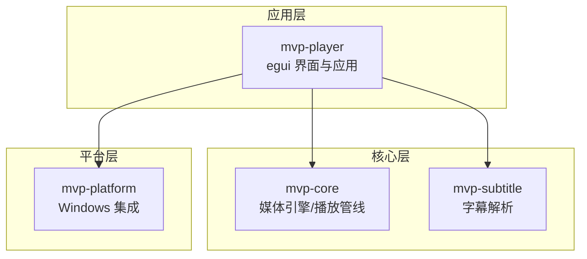
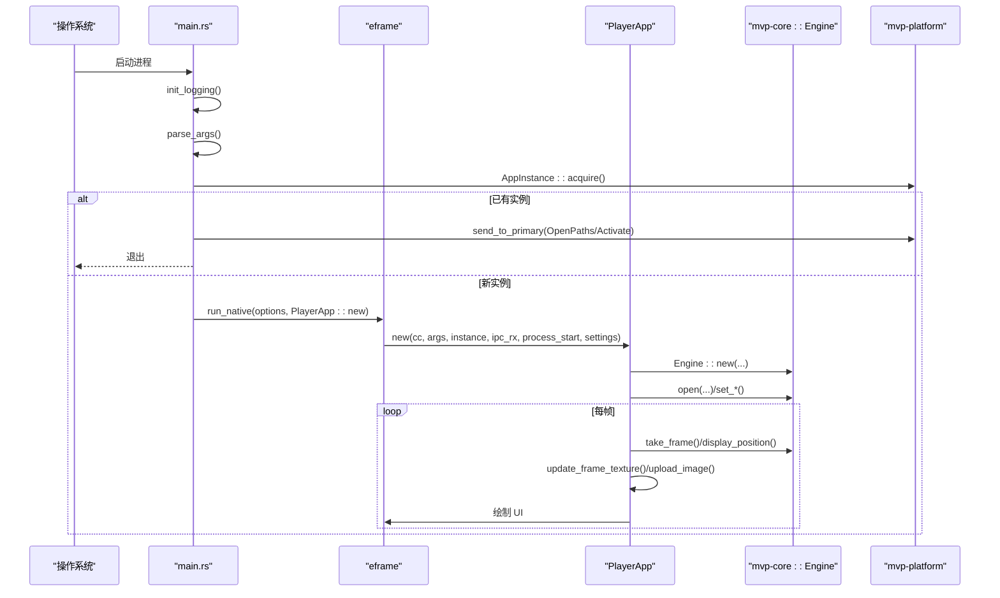
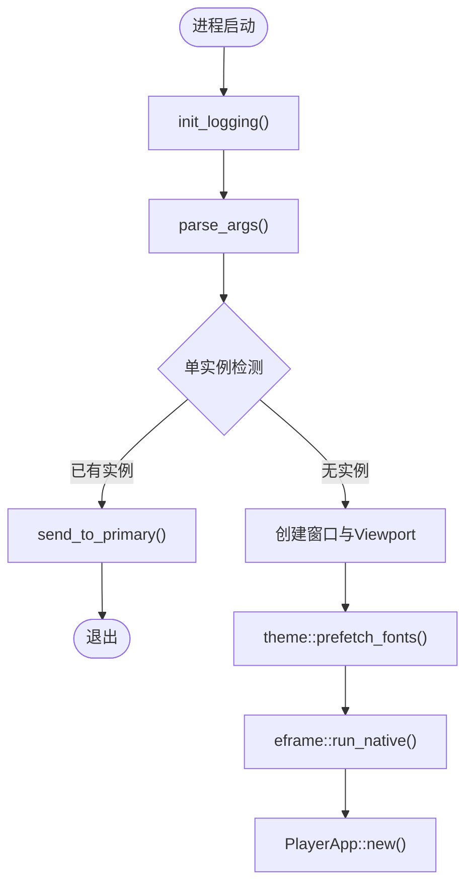
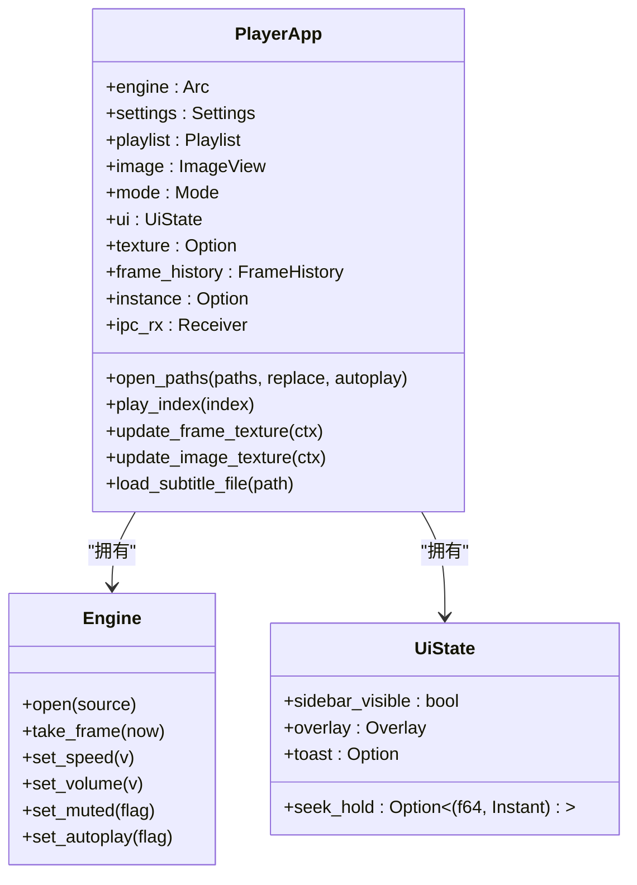
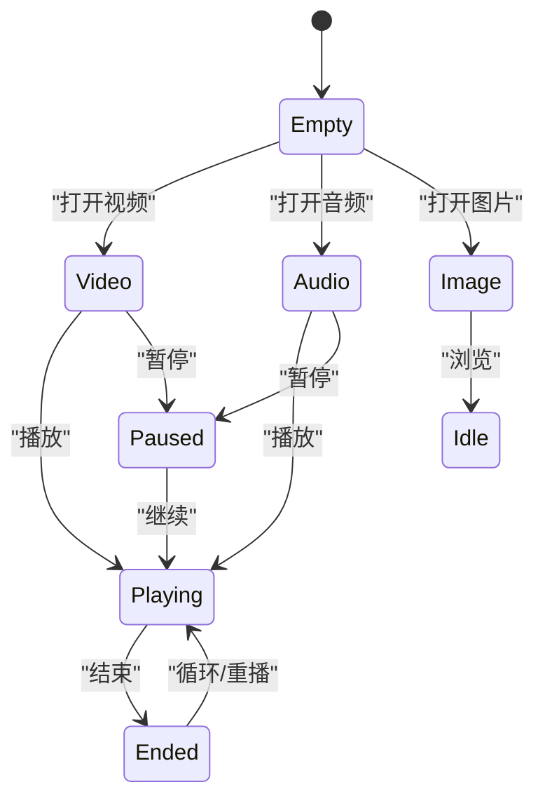
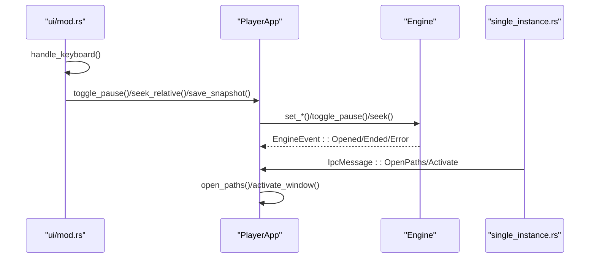
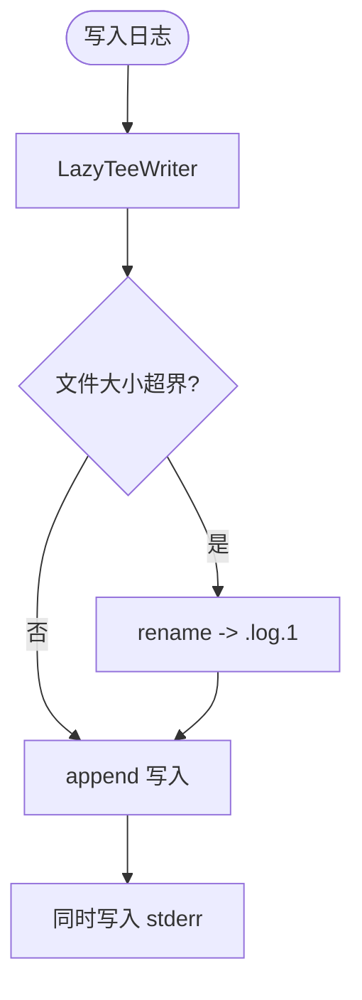
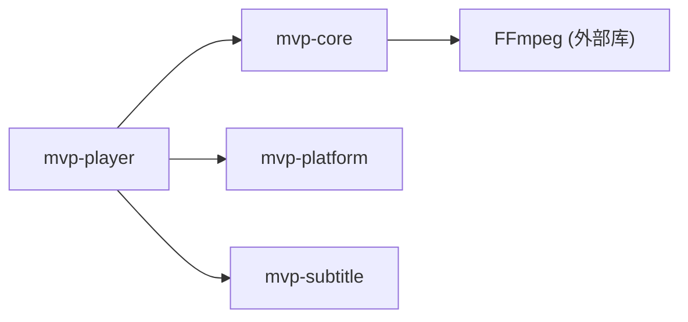

# 应用架构

<cite>
**本文引用的文件**   
- [README.md](file://README.md)
- [main.rs](file://crates/mvp-player/src/main.rs)
- [app.rs](file://crates/mvp-player/src/app.rs)
- [state.rs](file://crates/mvp-player/src/state.rs)
- [ui/mod.rs](file://crates/mvp-player/src/ui/mod.rs)
- [lib.rs](file://crates/mvp-core/src/lib.rs)
- [workers.rs](file://crates/mvp-core/src/engine/workers.rs)
- [single_instance.rs](file://crates/mvp-platform/src/single_instance.rs)
- [platform_lib.rs](file://crates/mvp-platform/src/lib.rs)
</cite>

## 目录
1. [简介](#简介)
2. [项目结构](#项目结构)
3. [核心组件](#核心组件)
4. [架构总览](#架构总览)
5. [详细组件分析](#详细组件分析)
6. [依赖关系分析](#依赖关系分析)
7. [性能与启动优化](#性能与启动优化)
8. [故障排查指南](#故障排查指南)
9. [扩展点与自定义开发指南](#扩展点与自定义开发指南)
10. [结论](#结论)

## 简介
本仓库是一个面向 Windows 的跨平台 GUI 播放器，基于 eframe/egui 构建界面，直接链接 FFmpeg 内核实现音视频解码、字幕渲染与图片查看。整体采用“引擎 + 平台集成 + 字幕解析 + 界面应用”的分层架构：mvp-core 提供媒体引擎与播放管线；mvp-platform 封装 Windows 单实例、文件关联、电源与显示器能力；mvp-subtitle 负责多格式字幕解析；mvp-player 是 egui 应用入口、主循环、状态管理与 UI 布局。

文档重点说明：
- 应用程序启动流程：命令行参数解析、单实例控制、窗口初始化、资源预加载。
- PlayerApp 主应用类的职责与生命周期管理。
- 状态管理机制：应用状态、播放状态、UI 状态的分离设计。
- 事件处理机制、消息传递模式、线程间通信。
- 配置管理、日志系统、错误处理策略。
- 架构扩展点与自定义开发建议。

## 项目结构
仓库采用 Cargo workspace 组织多个 crate：
- mvp-core：FFmpeg 绑定、时钟、队列、工作线程、图片查看器、播放列表等。
- mvp-platform：Windows 系统集成（单实例 IPC、文件关联、任务栏、电源、显示器）。
- mvp-subtitle：SRT/ASS/VTT/MicroDVD 等字幕解析与编码识别。
- mvp-player：egui 界面、PlayerApp 主类、主题、设置、布局与交互。

图表来源
- [README.md:315-323](file://README.md#L315-L323)
- [platform_lib.rs:1-34](file://crates/mvp-platform/src/lib.rs#L1-L34)

章节来源
- [README.md:315-323](file://README.md#L315-L323)
- [platform_lib.rs:1-34](file://crates/mvp-platform/src/lib.rs#L1-L34)

## 核心组件
- 应用入口 main.rs：负责进程启动、日志初始化、命令行解析、单实例检测、窗口创建与 eframe 运行。
- 主应用 PlayerApp（app.rs）：拥有引擎、播放列表、设置、UI 状态、纹理缓存、缩略图缓存、IPC 通道等，协调打开媒体、帧上传、截图、侧边栏与全屏等。
- UI 框架 ui/mod.rs：绘制主循环、菜单、侧边栏、传输控件、键盘与拖放事件、最小化节流、渲染统计。
- 状态 state.rs：Mode（视频/音频/图片）、UiState（临时 UI 状态）、Toast（提示）、FrameHistory（回退帧历史）、PresentStats（呈现统计）。
- 引擎 lib.rs 与 workers.rs：FFmpeg 懒初始化、Engine/EngineConfig、解复用与解码工作线程、队列与背压、跳转与 A-B 循环、字幕发布。
- 平台 single_instance.rs：命名互斥体 + 隐藏窗口 + WM_COPYDATA 的单实例 IPC。

章节来源
- [main.rs:1-182](file://crates/mvp-player/src/main.rs#L1-L182)
- [app.rs:65-204](file://crates/mvp-player/src/app.rs#L65-L204)
- [ui/mod.rs:48-144](file://crates/mvp-player/src/ui/mod.rs#L48-L144)
- [state.rs:15-49](file://crates/mvp-player/src/state.rs#L15-L49)
- [lib.rs:1-44](file://crates/mvp-core/src/lib.rs#L1-L44)
- [workers.rs:1-103](file://crates/mvp-core/src/engine/workers.rs#L1-L103)
- [single_instance.rs:1-62](file://crates/mvp-platform/src/single_instance.rs#L1-L62)

## 架构总览
应用以 eframe 为窗口与渲染后端，PlayerApp 作为唯一协调者：
- 启动阶段：main.rs 解析参数、单实例检测、字体预取、窗口几何恢复、eframe::run_native 创建 PlayerApp。
- 运行阶段：ui/mod.rs 驱动 draw 循环，PlayerApp.update 拉取帧并上传 GPU，引擎在后台线程解码，IPC 线程转发其他实例的消息。
- 关闭阶段：快速退出，丢弃积压数据，停止声卡等待，落盘设置。

图表来源
- [main.rs:40-182](file://crates/mvp-player/src/main.rs#L40-L182)
- [app.rs:206-353](file://crates/mvp-player/src/app.rs#L206-L353)
- [workers.rs:134-152](file://crates/mvp-core/src/engine/workers.rs#L134-L152)
- [single_instance.rs:94-169](file://crates/mvp-platform/src/single_instance.rs#L94-L169)

## 详细组件分析

### 应用启动流程
- 命令行参数解析：支持 -f/--fullscreen、--no-autoplay、--volume、--speed、-s/--subtitle、-h/--help、-v/--version；未知选项报错；非选项视为文件路径。
- 单实例控制：通过命名互斥体判断是否已有实例；若存在，则通过 WM_COPYDATA 发送激活或打开路径消息，当前进程退出。
- 窗口初始化：读取上次窗口尺寸与位置，校验屏幕可达性；设置标题、图标、最小尺寸、全屏/最大化；使用 Glow 渲染器与 vsync。
- 资源预加载：theme::prefetch_fonts() 异步预取中文字体，避免阻塞首帧；FFmpeg 表懒初始化，声卡在首次播放时打开。

图表来源
- [main.rs:40-182](file://crates/mvp-player/src/main.rs#L40-L182)
- [main.rs:302-347](file://crates/mvp-player/src/main.rs#L302-L347)
- [single_instance.rs:94-169](file://crates/mvp-platform/src/single_instance.rs#L94-L169)

章节来源
- [main.rs:40-182](file://crates/mvp-player/src/main.rs#L40-L182)
- [main.rs:302-347](file://crates/mvp-player/src/main.rs#L302-L347)
- [single_instance.rs:94-169](file://crates/mvp-platform/src/single_instance.rs#L94-L169)

### PlayerApp 主应用类与生命周期
PlayerApp 的职责包括：
- 持有引擎 Arc<Engine>、播放列表 Playlist、ImageView、设置 Settings、主题 Theme、UI 状态 UiState。
- 管理 GPU 纹理、帧历史、缩略图缓存、截图任务、对话框线程。
- 协调打开本地路径与 URL、选择图像/视频/音频模式、附加外部字幕、恢复断点续播。
- 帧上传与展示：update_frame_texture/update_image_texture，零拷贝重解释像素数据到 ColorImage。
- 生命周期：构造时合并命令行覆盖值、安装主题、创建 Engine、恢复播放列表、根据参数自动播放或暂停。

图表来源
- [app.rs:65-204](file://crates/mvp-player/src/app.rs#L65-L204)
- [app.rs:206-353](file://crates/mvp-player/src/app.rs#L206-L353)
- [app.rs:715-769](file://crates/mvp-player/src/app.rs#L715-L769)

章节来源
- [app.rs:65-204](file://crates/mvp-player/src/app.rs#L65-L204)
- [app.rs:206-353](file://crates/mvp-player/src/app.rs#L206-L353)
- [app.rs:715-769](file://crates/mvp-player/src/app.rs#L715-L769)

### 状态管理机制
- 应用状态：Mode（Empty/Video/Audio/Image），决定主区域显示逻辑与侧边栏页面。
- 播放状态：PlaybackState（Idle/Opening/Playing/Paused/Ended/Error），由引擎维护并通过事件通知 UI。
- UI 状态：UiState 包含侧边栏可见性、悬浮面板、Toast、拖动进度条、画布视图、全屏状态、关闭请求等。
- 呈现统计：PresentStats 记录实际呈现间隔、帧率、手转耗时，用于性能面板诊断。

图表来源
- [state.rs:15-49](file://crates/mvp-player/src/state.rs#L15-L49)
- [state.rs:591-667](file://crates/mvp-player/src/state.rs#L591-L667)

章节来源
- [state.rs:15-49](file://crates/mvp-player/src/state.rs#L15-L49)
- [state.rs:591-667](file://crates/mvp-player/src/state.rs#L591-L667)

### 事件处理机制、消息传递与线程通信
- 键盘与指针：ui/mod.rs 收集按键事件，映射到 PlayerApp 方法（播放/暂停、跳转、音量、全屏、截图、循环模式等），并在输入焦点不在全局时让位于控件。
- 拖放文件：handle_dropped_files 将路径加入播放列表并播放。
- IPC 消息：IpcMessage（Activate/OpenPaths/Quit）通过 WM_COPYDATA 在主实例的隐藏窗口线程接收，调用 set_handler 回调，主实例将消息投递给 PlayerApp。
- 引擎事件：EngineEvent（Opened/Ended/Error）由 workers.rs 报告，UI 在 draw 循环中消费并更新状态。

图表来源
- [ui/mod.rs:315-510](file://crates/mvp-player/src/ui/mod.rs#L315-L510)
- [single_instance.rs:113-124](file://crates/mvp-platform/src/single_instance.rs#L113-L124)
- [workers.rs:134-152](file://crates/mvp-core/src/engine/workers.rs#L134-L152)

章节来源
- [ui/mod.rs:315-510](file://crates/mvp-player/src/ui/mod.rs#L315-L510)
- [single_instance.rs:113-124](file://crates/mvp-platform/src/single_instance.rs#L113-L124)
- [workers.rs:134-152](file://crates/mvp-core/src/engine/workers.rs#L134-L152)

### 配置管理、日志系统与错误处理
- 配置管理：Settings 持久化到 settings.json，PlayerApp 在构造时合并命令行覆盖值（LaunchOverrides），store.mark_dirty() 延迟落盘。
- 日志系统：env_logger 输出到 stderr 与 LazyTeeWriter 文件，超过 2MB 自动轮转；发布版本无控制台，日志是唯一排错途径。
- 错误处理：引擎每个工作线程捕获 panic，转为 PlaybackState::Error 并发送 EngineEvent::Error；UI 显示错误横幅并可关闭。

图表来源
- [main.rs:184-294](file://crates/mvp-player/src/main.rs#L184-L294)
- [workers.rs:134-152](file://crates/mvp-core/src/engine/workers.rs#L134-L152)

章节来源
- [main.rs:184-294](file://crates/mvp-player/src/main.rs#L184-L294)
- [workers.rs:134-152](file://crates/mvp-core/src/engine/workers.rs#L134-L152)

## 依赖关系分析
- mvp-player 依赖 mvp-core（Engine、Playlist、ImageView、MediaInfo 等）、mvp-platform（AppInstance、Power、Monitor、Shell）、mvp-subtitle（Subtitle）。
- mvp-core 暴露 Engine、EngineConfig、EngineEvent、PlaybackState、MediaSource 等公共 API。
- mvp-platform 对 Windows 特性进行抽象，非 Windows 平台提供空实现或错误返回。

图表来源
- [README.md:315-323](file://README.md#L315-L323)
- [lib.rs:32-44](file://crates/mvp-core/src/lib.rs#L32-L44)
- [platform_lib.rs:1-34](file://crates/mvp-platform/src/lib.rs#L1-L34)

章节来源
- [README.md:315-323](file://README.md#L315-L323)
- [lib.rs:32-44](file://crates/mvp-core/src/lib.rs#L32-L44)
- [platform_lib.rs:1-34](file://crates/mvp-platform/src/lib.rs#L1-L34)

## 性能与启动优化
- 启动速度：窗口出现前仅做命令行解析、单实例互斥、字体预取；FFmpeg 表懒初始化，声卡首次播放才打开。
- 渲染节流：最小化窗口时每 500ms 唤醒一次；打开文件时每 100ms 轮询；播放中按下一帧时间调度 repaint。
- 帧上传优化：update_frame_texture 零拷贝重解释 u8 到 Color32，避免复制；已上传帧通过 serial 去重。
- 队列与背压：视频/音频队列按字节数限制，避免 4K RGBA 帧占用过大内存；视频落后时钟时丢包，音频保持背压。
- 关闭速度：丢弃积压数据包，声卡暂停后不再阻塞等待，设置落盘轻量。

章节来源
- [README.md:425-453](file://README.md#L425-L453)
- [ui/mod.rs:228-283](file://crates/mvp-player/src/ui/mod.rs#L228-L283)
- [app.rs:715-769](file://crates/mvp-player/src/app.rs#L715-L769)
- [workers.rs:25-118](file://crates/mvp-core/src/engine/workers.rs#L25-L118)

## 故障排查指南
- 无法打开文件：检查 Engine::open 的错误信息，确认容器类型与流是否存在；对于光盘镜像需先装载。
- 画面冻结：检查视频队列是否落后时钟导致丢包；确认 seek 自死锁修复路径（MPEG-TS 二分查找回调）。
- 声音断续：检查音频设备是否可用；暂停时声卡回调不运行，停止时需标记关闭以避免 500ms 超时。
- 日志定位：发布版本查看 %APPDATA%\MVP-Versatile-Player\mvp.log；帮助菜单可直接打开日志。
- 单实例异常：检查命名互斥体与隐藏窗口是否成功创建；WM_COPYDATA 超时或拒绝时重新以新窗口启动。

章节来源
- [workers.rs:134-152](file://crates/mvp-core/src/engine/workers.rs#L134-L152)
- [main.rs:184-294](file://crates/mvp-player/src/main.rs#L184-L294)
- [single_instance.rs:378-457](file://crates/mvp-platform/src/single_instance.rs#L378-L457)

## 扩展点与自定义开发指南
- 新增媒体源：在 MediaSource 与 open_engine/open_local 分支中添加新的路径或协议处理。
- 新增字幕格式：在 mvp-subtitle 中实现解析器，并在 load_subtitle_file/load_graphic_subtitle_file 中接入。
- 新增画质增强：在 picture_pass 与 EnhanceState 中增加着色器 pass，并在 update_picture_state 中平滑参数。
- 新增快捷键：在 ui/mod.rs 的 handle_keyboard 中添加键位映射，调用 PlayerApp 对应方法。
- 新增设置项：在 Settings/LaunchOverrides 中定义字段，合并覆盖值并持久化。
- 新增平台功能：在 mvp-platform 中扩展 shell/power/monitor 能力，保持非 Windows 空实现。

章节来源
- [app.rs:445-544](file://crates/mvp-player/src/app.rs#L445-L544)
- [ui/mod.rs:315-510](file://crates/mvp-player/src/ui/mod.rs#L315-L510)
- [platform_lib.rs:1-34](file://crates/mvp-platform/src/lib.rs#L1-L34)

## 结论
该播放器以清晰的层次划分与严格的线程边界实现了高性能、可维护的媒体播放体验。PlayerApp 作为唯一协调者，统一管理引擎、播放列表、设置与 UI 状态；引擎通过解复用与解码工作线程保证音视频独立处理与稳定背压；平台层提供可靠的单实例与系统集成能力。通过日志、错误状态与性能统计，系统在复杂场景下仍具备良好可观测性与健壮性。未来可在画质增强、多轨道支持与零拷贝渲染等方面继续扩展。