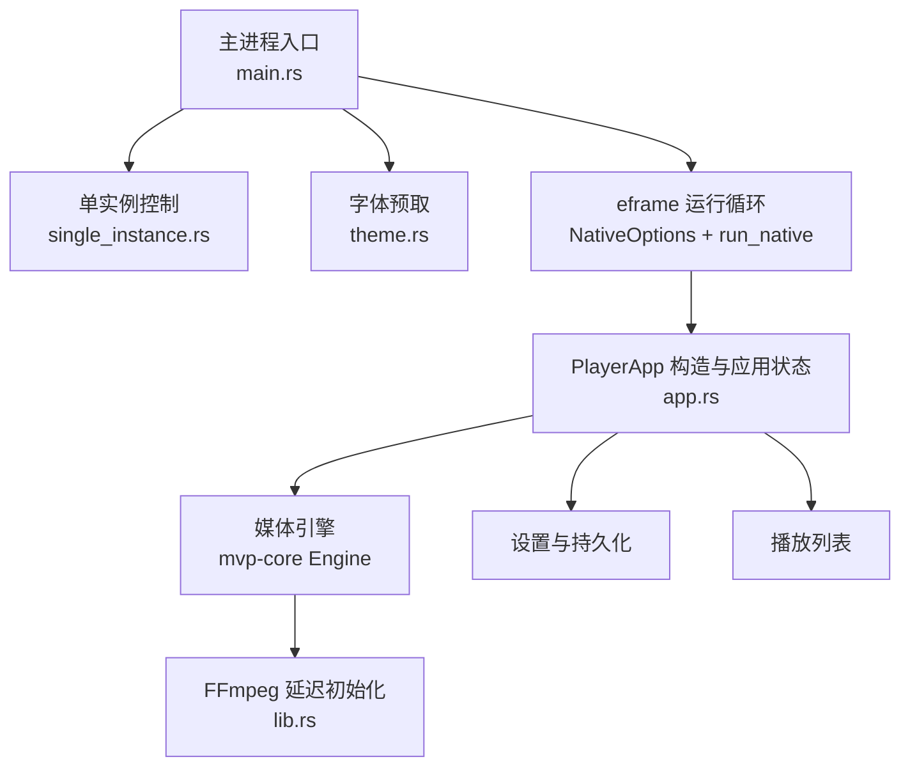
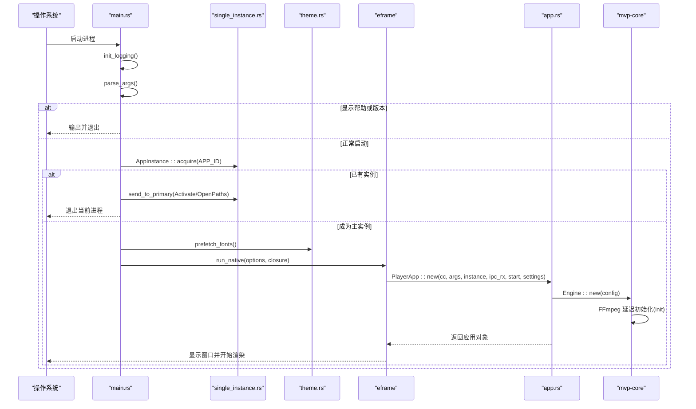
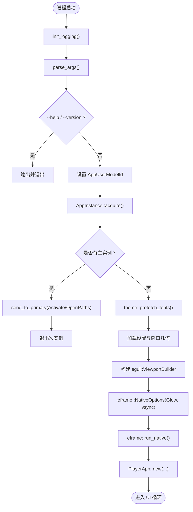
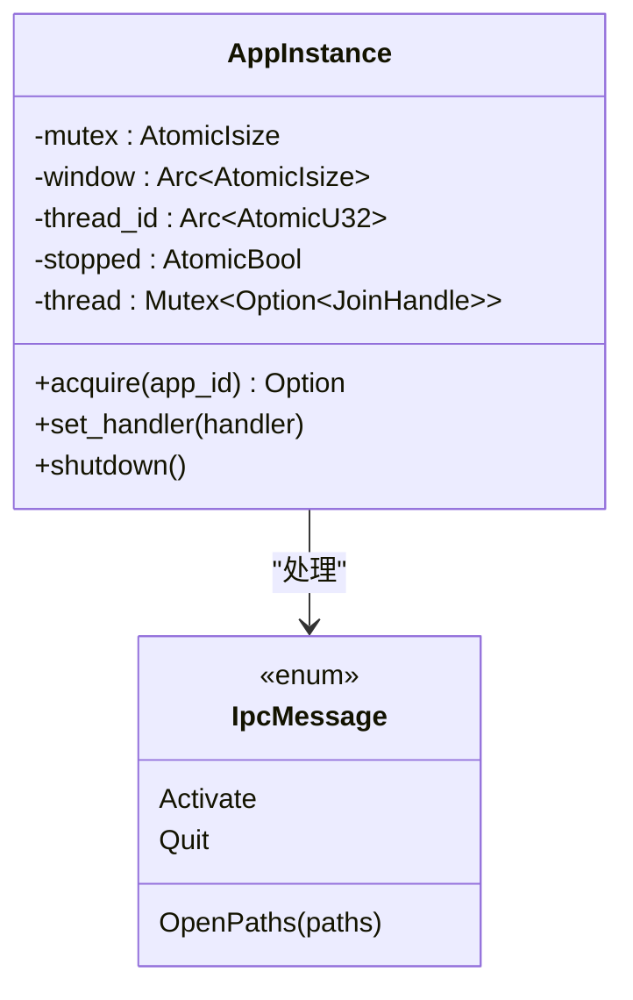
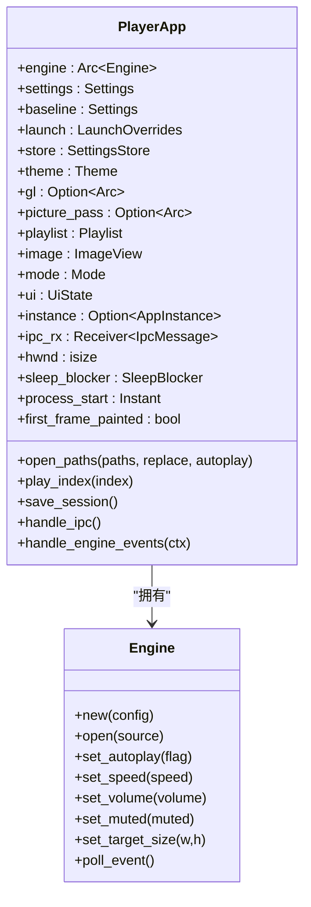
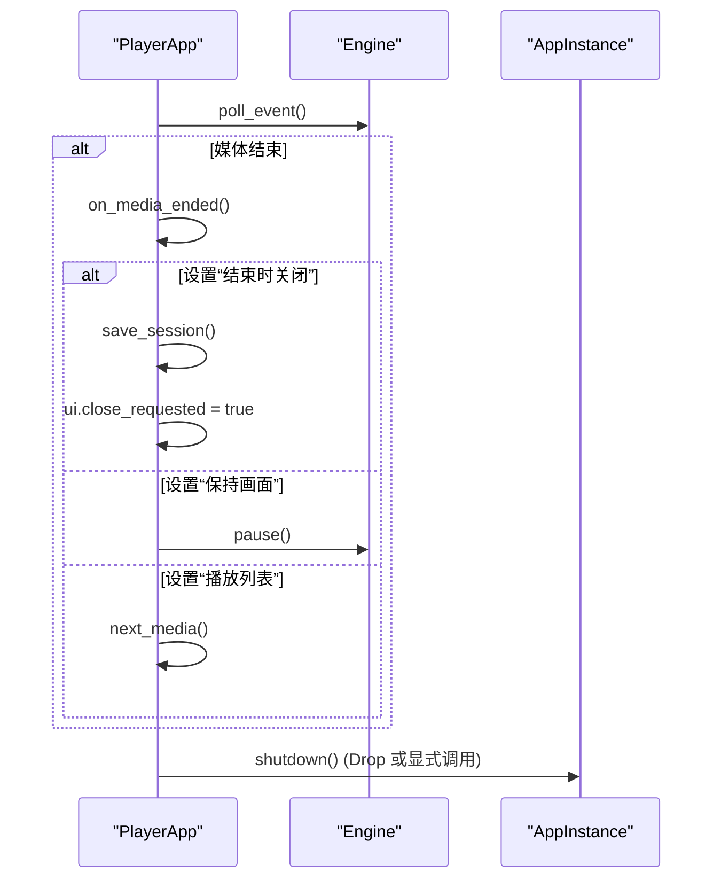
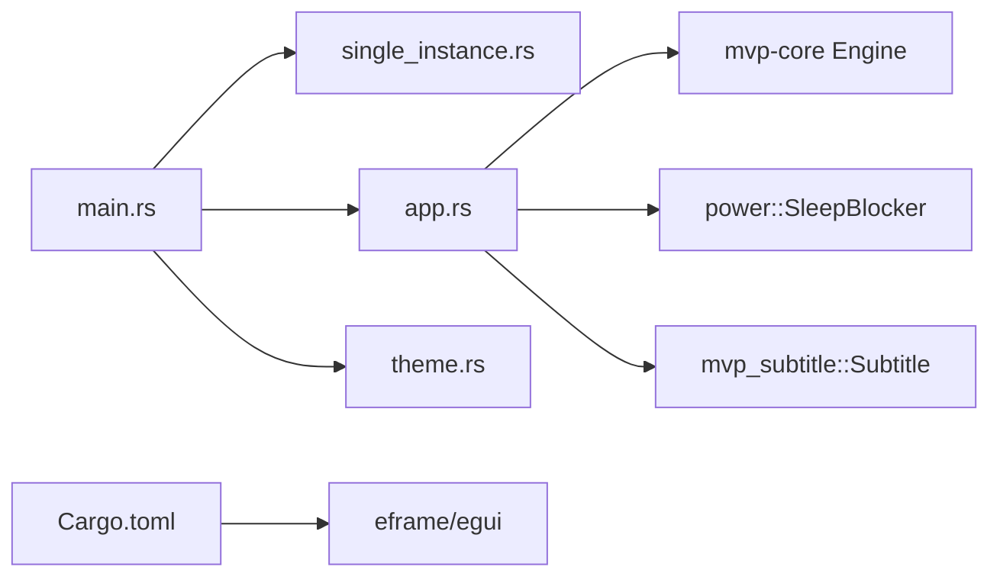

# 应用生命周期

<cite>
**本文引用的文件**   
- [main.rs](file://crates/mvp-player/src/main.rs)
- [app.rs](file://crates/mvp-player/src/app.rs)
- [single_instance.rs](file://crates/mvp-platform/src/single_instance.rs)
- [theme.rs](file://crates/mvp-player/src/theme.rs)
- [lib.rs](file://crates/mvp-core/src/lib.rs)
- [Cargo.toml](file://Cargo.toml)
</cite>

## 目录
1. [引言](#引言)
2. [项目结构](#项目结构)
3. [核心组件](#核心组件)
4. [架构总览](#架构总览)
5. [详细组件分析](#详细组件分析)
6. [依赖关系分析](#依赖关系分析)
7. [性能与启动优化](#性能与启动优化)
8. [故障排除指南](#故障排除指南)
9. [结论](#结论)

## 引言
本文面向“MVP-Versatile-Player”的完整应用生命周期，重点覆盖：
- 命令行参数解析
- 单实例控制机制
- 窗口初始化、渲染器选择与 eframe 集成
- 资源预加载（字体、图标）
- FFmpeg 延迟初始化策略
- PlayerApp 构造过程
- 应用关闭流程与资源清理
- 启动性能优化策略
- 启动故障排除与调试技巧

该播放器在启动时尽量保持轻量：不提前打开音频设备，FFmpeg 表仅在首次需要时初始化，系统字体在后台线程预取，从而让窗口尽快出现。

## 项目结构
从生命周期角度，关键代码分布在以下模块：
- `mvp-player`：应用入口、UI 框架集成、应用状态、播放控制
- `mvp-platform`：平台能力，包括单实例控制、电源管理、Shell 集成等
- `mvp-core`：媒体引擎封装、FFmpeg 初始化、播放列表、图像视图等

**图表来源**
- [main.rs:40-181](file://crates/mvp-player/src/main.rs#L40-L181)
- [single_instance.rs:94-146](file://crates/mvp-platform/src/single_instance.rs#L94-L146)
- [theme.rs:888-910](file://crates/mvp-player/src/theme.rs#L888-L910)
- [app.rs:206-353](file://crates/mvp-player/src/app.rs#L206-L353)
- [lib.rs:50-66](file://crates/mvp-core/src/lib.rs#L50-L66)

**章节来源**
- [main.rs:1-181](file://crates/mvp-player/src/main.rs#L1-L181)
- [app.rs:1-353](file://crates/mvp-player/src/app.rs#L1-L353)
- [single_instance.rs:1-146](file://crates/mvp-platform/src/single_instance.rs#L1-L146)
- [theme.rs:846-1034](file://crates/mvp-player/src/theme.rs#L846-L1034)
- [lib.rs:48-66](file://crates/mvp-core/src/lib.rs#L48-L66)

## 核心组件
- 主进程入口：负责日志、参数解析、单实例、窗口配置、启动计时和 eframe 集成。
- 单实例控制：通过命名互斥量与隐藏 IPC 窗口实现“激活已有窗口/转发文件列表/请求退出”。
- PlayerApp：应用状态中心，持有引擎、播放列表、设置、UI 状态、截图通道、IPC 通道等。
- 主题与字体：后台预取系统字体栈，避免首帧阻塞。
- 媒体引擎：封装 FFmpeg，提供解码、事件、字幕、图片浏览等能力。
- 设置与持久化：保存播放列表、窗口几何、最近文件、音量速度等。

**章节来源**
- [main.rs:40-181](file://crates/mvp-player/src/main.rs#L40-L181)
- [app.rs:27-204](file://crates/mvp-player/src/app.rs#L27-L204)
- [single_instance.rs:53-146](file://crates/mvp-platform/src/single_instance.rs#L53-L146)
- [theme.rs:888-910](file://crates/mvp-player/src/theme.rs#L888-L910)
- [lib.rs:50-66](file://crates/mvp-core/src/lib.rs#L50-L66)

## 架构总览
下图展示从进程启动到第一个 UI 帧的关键路径：

**图表来源**
- [main.rs:40-181](file://crates/mvp-player/src/main.rs#L40-L181)
- [single_instance.rs:94-146](file://crates/mvp-platform/src/single_instance.rs#L94-L146)
- [theme.rs:888-910](file://crates/mvp-player/src/theme.rs#L888-L910)
- [app.rs:206-353](file://crates/mvp-player/src/app.rs#L206-L353)
- [lib.rs:50-66](file://crates/mvp-core/src/lib.rs#L50-L66)

## 详细组件分析

### 主进程启动流程（main.rs）
- 日志系统初始化：使用 `env_logger`，目标为“惰性写入文件的 TeeWriter”，同时输出到 stderr；文件按运行次数滚动，防止无限增长。
- 命令行参数解析：支持 `-h/--help`、`-v/--version`、`-f/--fullscreen`、`--no-autoplay/--paused`、`--no-audio/--mute`、`--subtitle`、`--volume`、`--speed`；未知选项报错；非 `--` 开头的参数视为文件路径。
- 单实例控制：尝试获取命名互斥量；若已有实例，则通过 IPC 发送激活或打开文件消息后退出；失败时记录警告并继续独立运行。
- 字体预取：调用 `theme::prefetch_fonts()`，在窗口创建前后台读取系统字体栈，避免首帧 I/O 阻塞。
- 窗口几何与设置：加载设置，计算初始尺寸与最小尺寸，校验上次位置是否仍可达；构建 `egui::ViewportBuilder`，设置标题、应用 ID、尺寸、最小尺寸、图标、全屏/最大化。
- eframe 集成：使用 `Renderer::Glow`，开启 VSync，禁用自动持久化窗口几何；启动耗时统计；回调中构造 `PlayerApp`。

**图表来源**
- [main.rs:40-181](file://crates/mvp-player/src/main.rs#L40-L181)
- [main.rs:189-294](file://crates/mvp-player/src/main.rs#L189-L294)
- [main.rs:302-347](file://crates/mvp-player/src/main.rs#L302-L347)
- [theme.rs:888-910](file://crates/mvp-player/src/theme.rs#L888-L910)

**章节来源**
- [main.rs:40-181](file://crates/mvp-player/src/main.rs#L40-L181)
- [main.rs:189-294](file://crates/mvp-player/src/main.rs#L189-L294)
- [main.rs:302-347](file://crates/mvp-player/src/main.rs#L302-L347)

### 单实例控制机制（single_instance.rs）
- 主实例检测：Windows 下使用命名互斥量 `Local\...Mutex`；首个进程获得所有权，后续进程视为次实例。
- IPC 通道：主实例在独立线程上创建隐藏顶层窗口（`WS_EX_TOOLWINDOW`），泵送消息循环；次实例通过 `FindWindowW` 定位并使用 `WM_COPYDATA` 发送消息，带超时保护。
- 消息类型：`Activate`（激活窗口）、`OpenPaths`（打开文件列表）、`Quit`（请求退出）。
- 生命周期：`AppInstance::shutdown` 安全地停止 IPC 线程、释放互斥量；可重入且自保护。

**图表来源**
- [single_instance.rs:81-146](file://crates/mvp-platform/src/single_instance.rs#L81-L146)
- [single_instance.rs:53-62](file://crates/mvp-platform/src/single_instance.rs#L53-L62)

**章节来源**
- [single_instance.rs:1-146](file://crates/mvp-platform/src/single_instance.rs#L1-L146)
- [single_instance.rs:378-458](file://crates/mvp-platform/src/single_instance.rs#L378-L458)
- [single_instance.rs:658-715](file://crates/mvp-platform/src/single_instance.rs#L658-L715)

### PlayerApp 构造与应用状态（app.rs）
- 启动参数合并：将命令行覆盖项（音量、速度）与磁盘设置合并，保留基线设置用于持久化区分。
- 主题安装：根据用户选择的调色板安装主题到 egui 上下文。
- 引擎初始化：构造 `EngineConfig`，启用硬件解码、HDR 色调映射、杜比视界重塑、音频开关、设备、音量、速度、自动播放等；随后设置各项运行时参数。
- 播放列表恢复：若启用恢复播放列表，则加载历史条目与重复/随机模式。
- 窗口句柄与截图通道：获取原生窗口句柄，建立截图离屏渲染通道。
- 其他状态：图片查看器、UI 状态、缩略图缓存、纹理与帧历史、IPC 通道、睡眠阻止器等。
- 启动行为：若命令行传入文件，则加入播放列表并打开第一项；否则恢复上次播放位置；外部字幕优先处理。

**图表来源**
- [app.rs:66-204](file://crates/mvp-player/src/app.rs#L66-L204)
- [app.rs:206-353](file://crates/mvp-player/src/app.rs#L206-L353)

**章节来源**
- [app.rs:206-353](file://crates/mvp-player/src/app.rs#L206-L353)
- [app.rs:359-544](file://crates/mvp-player/src/app.rs#L359-L544)

### FFmpeg 延迟初始化策略（lib.rs）
- 一次性初始化：使用 `OnceLock` 确保 FFmpeg 仅初始化一次；注册编解码器、复用器/解复用器，并将 FFmpeg 日志级别设为错误级，避免噪音。
- 延迟触发：仅在真正需要媒体能力时初始化，保证命令行错误或快速退出场景下的启动瞬时性。

**章节来源**
- [lib.rs:48-66](file://crates/mvp-core/src/lib.rs#L48-L66)

### 字体预取与主题安装（theme.rs）
- 背景预取：`prefetch_fonts()` 在独立线程读取系统字体栈（约 37 MB），避免 GL 上下文初始化完成后才进行 I/O 导致首帧卡顿。
- 字体槽位：定义 UI、等宽、中日韩、粗体等候选字体，按优先级读取第一个存在的字体文件，并校正字面索引。
- 安装逻辑：从预取结果或磁盘回退加载字体数据，注册到 egui 字体定义，并构建比例/等宽/粗体家族链。

**章节来源**
- [theme.rs:846-1034](file://crates/mvp-player/src/theme.rs#L846-L1034)

### 应用关闭流程与资源清理
- 会话保存：在媒体结束或收到退出指令时，保存播放列表、侧边栏状态、设置变更。
- 关闭请求：设置 UI 关闭标志，交由 eframe 循环处理。
- 单实例退出：通过 IPC 向主实例发送 `Quit`，主实例保存会话并请求关闭窗口；`AppInstance::shutdown` 安全停止 IPC 线程并释放互斥量。

**图表来源**
- [app.rs:886-924](file://crates/mvp-player/src/app.rs#L886-L924)
- [app.rs:986-1004](file://crates/mvp-player/src/app.rs#L986-L1004)
- [single_instance.rs:126-146](file://crates/mvp-platform/src/single_instance.rs#L126-L146)

**章节来源**
- [app.rs:886-924](file://crates/mvp-player/src/app.rs#L886-L924)
- [app.rs:986-1004](file://crates/mvp-player/src/app.rs#L986-L1004)
- [single_instance.rs:126-146](file://crates/mvp-platform/src/single_instance.rs#L126-L146)

## 依赖关系分析
- main.rs 依赖：
  - mvp_platform::single_instance：单实例控制
  - crate::app::PlayerApp：应用状态
  - crate::settings：应用设置
  - crate::display：显示器与工作区信息
  - crate::theme：主题与字体预取
- app.rs 依赖：
  - mvp_core::Engine：媒体引擎
  - mvp_platform::power::SleepBlocker：播放时阻止休眠
  - mvp_subtitle::Subtitle：字幕解析
  - 内部模块：gl、picture、settings、state、theme、ui
- single_instance.rs 依赖：
  - Windows API：互斥量、窗口类、消息循环、WM_COPYDATA
- Cargo.toml 依赖：
  - eframe 与 egui：UI 框架
  - rfd：跨平台文件对话框
  - 发布配置：优化启动延迟与二进制体积

**图表来源**
- [main.rs:19-38](file://crates/mvp-player/src/main.rs#L19-L38)
- [app.rs:5-25](file://crates/mvp-player/src/app.rs#L5-L25)
- [Cargo.toml:49-77](file://Cargo.toml#L49-L77)

**章节来源**
- [main.rs:19-38](file://crates/mvp-player/src/main.rs#L19-L38)
- [app.rs:5-25](file://crates/mvp-player/src/app.rs#L5-L25)
- [Cargo.toml:49-77](file://Cargo.toml#L49-L77)

## 性能与启动优化
- 日志延迟写入：`LazyTeeWriter` 首次写入时才打开日志文件，避免启动阶段因杀毒软件或网络配置文件导致的 I/O 延迟。
- 字体预取：在窗口创建前后台读取系统字体栈，与 GL 驱动初始化并行，减少首帧停顿。
- 图标生成：程序内绘制图标，避免启动时解码 PNG。
- FFmpeg 延迟初始化：仅在首次需要媒体能力时初始化，避免命令行错误场景下的额外开销。
- 发布配置：启用 LTO、单 codegen unit、strip symbols，提升启动速度与减小二进制体积。

**章节来源**
- [main.rs:189-294](file://crates/mvp-player/src/main.rs#L189-L294)
- [theme.rs:888-910](file://crates/mvp-player/src/theme.rs#L888-L910)
- [main.rs:376-432](file://crates/mvp-player/src/main.rs#L376-L432)
- [lib.rs:50-66](file://crates/mvp-core/src/lib.rs#L50-L66)
- [Cargo.toml:53-77](file://Cargo.toml#L53-L77)

## 故障排除指南
- 无法打开文件或文件夹：检查命令行参数是否正确，确认路径存在；播放器会将未知参数视为文件路径。
- 单实例失效：若单实例检测失败，播放器会记录警告并以独立进程运行；可通过日志排查 IPC 通信问题。
- 窗口位置异常：若上次窗口位置不可达（显示器分辨率变化），播放器会自动居中显示；可在设置中调整窗口几何。
- 音频设备不可用：播放器会发出警告而非错误横幅，视频仍可播放；检查音频输出设备状态。
- 截图失败：若离屏渲染超时，播放器会回退到原始帧；检查 GPU 驱动与截图设置。
- 启动缓慢：检查日志文件位置与大小，确认未受杀毒软件影响；观察字体预取与 GL 初始化时间。

**章节来源**
- [main.rs:302-347](file://crates/mvp-player/src/main.rs#L302-L347)
- [main.rs:92-98](file://crates/mvp-player/src/main.rs#L92-L98)
- [main.rs:124-130](file://crates/mvp-player/src/main.rs#L124-L130)
- [app.rs:877-884](file://crates/mvp-player/src/app.rs#L877-L884)
- [app.rs:1074-1099](file://crates/mvp-player/src/app.rs#L1074-L1099)

## 结论
本播放器通过精细的启动流程设计，实现了快速响应与稳定运行：
- 命令行参数解析简洁可靠，支持常见交互场景
- 单实例机制确保多开时的用户体验一致
- 窗口初始化与渲染器选择合理，避免首帧阻塞
- 资源预取与 FFmpeg 延迟初始化显著提升启动性能
- PlayerApp 作为状态中心，统一管理引擎、播放列表与 UI
- 关闭流程与资源清理完善，保障会话持久化与系统资源释放

这些设计共同构成了一个高性能、易维护、可扩展的多功能播放器应用生命周期。