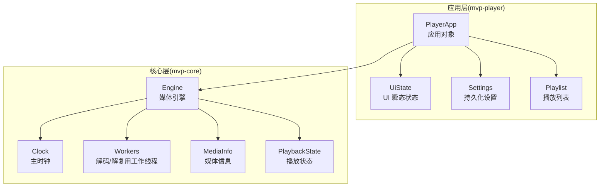
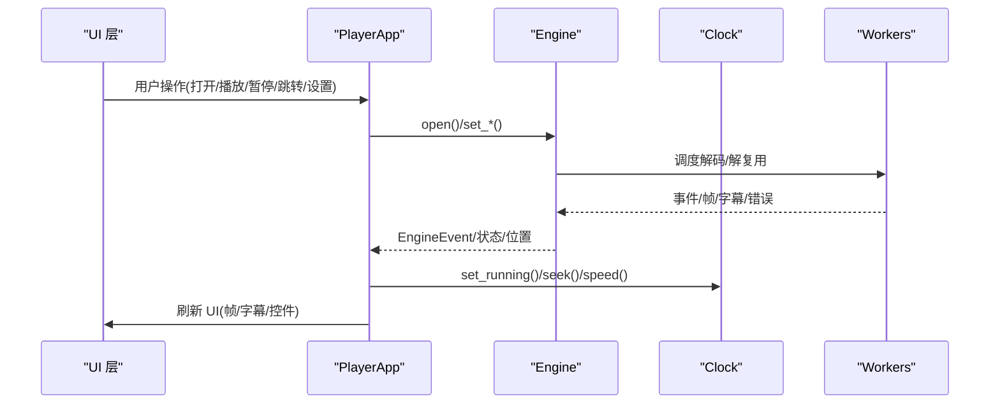
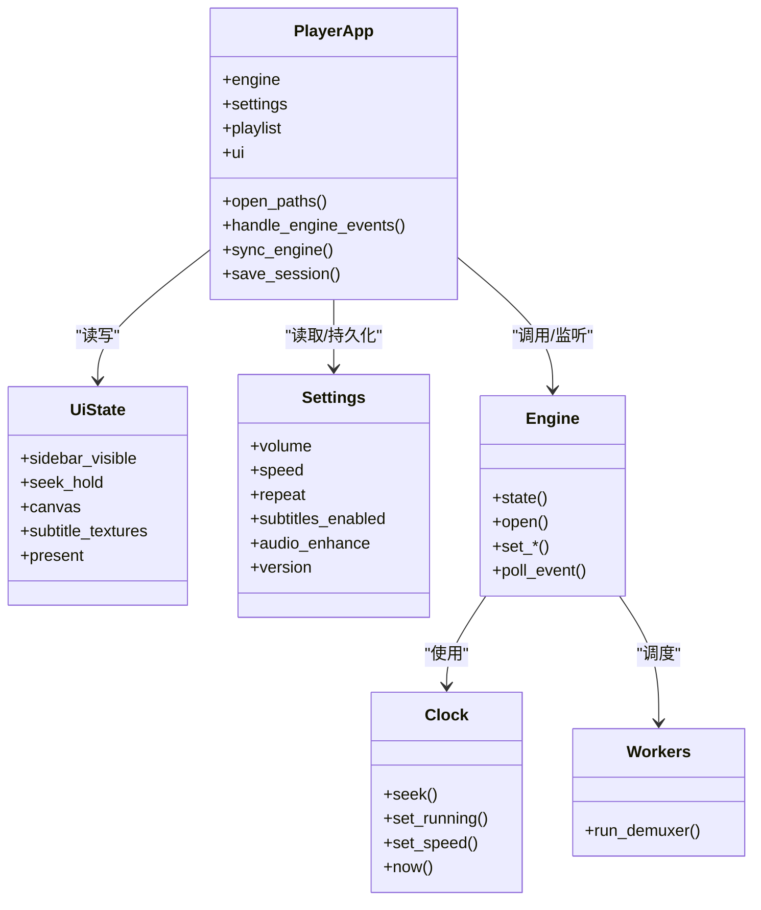

# 状态管理

<cite>
**本文引用的文件**   
- [state.rs](file://crates/mvp-player/src/state.rs)
- [app.rs](file://crates/mvp-player/src/app.rs)
- [settings.rs](file://crates/mvp-player/src/settings.rs)
- [lib.rs](file://crates/mvp-core/src/lib.rs)
- [clock.rs](file://crates/mvp-core/src/engine/clock.rs)
- [workers.rs](file://crates/mvp-core/src/engine/workers.rs)
</cite>

## 目录
1. [引言](#引言)
2. [项目结构](#项目结构)
3. [核心组件](#核心组件)
4. [架构总览](#架构总览)
5. [详细组件分析](#详细组件分析)
6. [依赖关系分析](#依赖关系分析)
7. [性能考量](#性能考量)
8. [故障排查指南](#故障排查指南)
9. [结论](#结论)
10. [附录](#附录)

## 引言
本文件系统性梳理 MVP-Versatile-Player 的状态管理机制，重点说明应用状态、播放状态与 UI 状态的分离原则；解释 State 结构体的职责划分（媒体源信息、播放控制、字幕、音频设置等）；阐述状态更新机制、线程安全保证、持久化策略；介绍 UI 与底层引擎的状态同步方法；并给出状态迁移、版本兼容、调试工具与性能监控的实践建议。

## 项目结构
播放器采用分层架构：
- mvp-core：媒体引擎核心，负责解码、时钟、队列、工作线程、媒体信息与播放状态。
- mvp-player：UI 与应用层，聚合 Engine、Playlist、Settings 与 UiState，协调事件与渲染。
- mvp-platform / mvp-subtitle：平台能力与字幕解析库。

图表来源
- [app.rs:66-204](file://crates/mvp-player/src/app.rs#L66-L204)
- [state.rs:449-576](file://crates/mvp-player/src/state.rs#L449-L576)
- [settings.rs:596-772](file://crates/mvp-player/src/settings.rs#L596-L772)
- [lib.rs:32-43](file://crates/mvp-core/src/lib.rs#L32-L43)
- [clock.rs:44-46](file://crates/mvp-core/src/engine/clock.rs#L44-L46)
- [workers.rs:134-152](file://crates/mvp-core/src/engine/workers.rs#L134-L152)

章节来源
- [app.rs:66-204](file://crates/mvp-player/src/app.rs#L66-L204)
- [lib.rs:1-43](file://crates/mvp-core/src/lib.rs#L1-L43)

## 核心组件
- PlayerApp：应用对象，唯一允许 Engine、Playlist、Settings、UiState 相互通信的地方。持有 Engine、Settings、Playlist、UiState、图片视图、缩略图缓存、截图任务、IPC 通道等。
- UiState：UI 瞬态状态，包含侧边栏可见性、当前标签页、信息行、拖拽进度、轮盘音量/快进、画布缩放、字幕纹理、覆盖窗口、全屏状态、启动耗时、呈现统计等。
- Settings：持久化用户设置，包括外观、音频、播放、视频、画面调节、字幕、图片、系统集成、窗口、历史、快捷键等，支持 schema version 与迁移。
- Engine/Clock/Workers：媒体引擎、主时钟与解码工作线程，提供播放状态、媒体信息、帧、字幕、音频设备等能力。

章节来源
- [app.rs:66-204](file://crates/mvp-player/src/app.rs#L66-L204)
- [state.rs:449-576](file://crates/mvp-player/src/state.rs#L449-L576)
- [settings.rs:596-772](file://crates/mvp-player/src/settings.rs#L596-L772)
- [lib.rs:32-43](file://crates/mvp-core/src/lib.rs#L32-L43)

## 架构总览
应用状态、播放状态与 UI 状态严格分离：
- 应用状态：由 PlayerApp 维护，组合 Engine、Playlist、Settings、UiState，负责生命周期、事件分发、会话保存、截图、窗口与主题等。
- 播放状态：由 Engine 内部维护（PlaybackState），通过事件与查询接口暴露给上层。
- UI 状态：UiState 仅承载界面显示所需的数据与交互临时状态，不直接驱动解码。

图表来源
- [app.rs:484-544](file://crates/mvp-player/src/app.rs#L484-L544)
- [app.rs:856-891](file://crates/mvp-player/src/app.rs#L856-L891)
- [clock.rs:74-126](file://crates/mvp-core/src/engine/clock.rs#L74-L126)
- [workers.rs:134-152](file://crates/mvp-core/src/engine/workers.rs#L134-L152)

## 详细组件分析

### 应用状态：PlayerApp
职责与关键状态字段
- 引擎与配置：engine、settings、baseline、launch、store、theme、picture_pass、picture_state 等。
- 播放列表与模式：playlist、image、mode（Empty/Video/Audio/Image）。
- UI 状态：ui（UiState）、thumbs（ThumbCache）。
- 帧与纹理：texture、uploaded_serial/pts/size、displayed、frame_history、redo_frame。
- 系统能力：instance、ipc_rx、hwnd、window_fit、sleep_blocker、video_target。
- 其他：pending_sidecar、pending_audio、process_start、info_source、last_duration、first_frame_painted、last_title。

关键流程
- 构造与初始化：加载设置、创建 Engine、应用初始参数、恢复播放列表、处理命令行参数。
- 打开媒体：open_paths/open_url/play_index_with/open_local/open_engine，决定 Mode，重置 UI 与 Engine 状态。
- 事件处理：handle_engine_events 将 EngineEvent 映射为 UI 行为（信息重建、动态范围提示、错误横幅、结束逻辑）。
- 帧上传：update_frame_texture/update_image_texture/upload_image，零拷贝或按需转换，记录 PresentStats。
- 会话保存：save_session 将 playlist、sidebar 等写入 SettingsStore。
- 截图：save_snapshot/take_snapshot_render/collect_snapshot/write_snapshot，支持离屏渲染与回退策略。

章节来源
- [app.rs:66-204](file://crates/mvp-player/src/app.rs#L66-L204)
- [app.rs:359-544](file://crates/mvp-player/src/app.rs#L359-L544)
- [app.rs:715-831](file://crates/mvp-player/src/app.rs#L715-L831)
- [app.rs:856-924](file://crates/mvp-player/src/app.rs#L856-L924)
- [app.rs:987-1004](file://crates/mvp-player/src/app.rs#L987-L1004)
- [app.rs:1019-1193](file://crates/mvp-player/src/app.rs#L1019-L1193)

### UI 状态：UiState
职责与关键字段
- 界面布局：sidebar_visible/sidebar_tab、overlay、picture_panel_open、audio_enhance_open、settings_tab。
- 交互缓冲：seek_drag、seek_hold、wheel_volume/wheel_seek。
- 画布与图片：canvas、picture、subtitle_key/subtitle_textures、playlist_selection。
- 通知与错误：toast、error_banner。
- 窗口与全屏：controls_until、last_pointer_move/pos、fullscreen/last_reported_fullscreen/close_requested/chrome_ready/startup_ms。
- 性能统计：present（PresentStats）。
- 辅助信息：ffmpeg_version/config、last_snapshot。

辅助类型
- Mode：Empty/Video/Audio/Image，用于区分主区域展示模式。
- Toast/ToastKind：短时消息与严重级别。
- FrameHistory/ShownFrame：有限帧环，支持“后退一帧”。
- ThumbCache：异步缩略图缓存，后台线程解码，按路径去重与上限清理。
- PresentStats：呈现间隔、手到时间、FPS、已呈现帧计数。

章节来源
- [state.rs:22-49](file://crates/mvp-player/src/state.rs#L22-L49)
- [state.rs:99-182](file://crates/mvp-player/src/state.rs#L99-L182)
- [state.rs:237-333](file://crates/mvp-player/src/state.rs#L237-L333)
- [state.rs:335-447](file://crates/mvp-player/src/state.rs#L335-L447)
- [state.rs:449-576](file://crates/mvp-player/src/state.rs#L449-L576)
- [state.rs:591-667](file://crates/mvp-player/src/state.rs#L591-L667)

### 播放状态：Engine/Clock/Workers
- Engine：对外暴露 PlaybackState、MediaInfo、帧、字幕、设备信息等；内部通过 Shared 与事件通道与 Worker 线程协作。
- Clock：主时钟，基于系统单调时钟与音频设备位置进行平滑对齐，提供 seek/set_running/speed/now/is_audio_driven。
- Workers：解复用与解码线程，带 panic 保护，将错误转为 PlaybackState::Error 并通过事件上报。

章节来源
- [lib.rs:32-43](file://crates/mvp-core/src/lib.rs#L32-L43)
- [clock.rs:1-46](file://crates/mvp-core/src/engine/clock.rs#L1-L46)
- [clock.rs:74-126](file://crates/mvp-core/src/engine/clock.rs#L74-L126)
- [workers.rs:1-24](file://crates/mvp-core/src/engine/workers.rs#L1-L24)
- [workers.rs:134-152](file://crates/mvp-core/src/engine/workers.rs#L134-L152)

### 设置与持久化：Settings
- 分类字段：外观、音频、播放、视频、画面调节、字幕、图片、系统集成、窗口、历史、快捷键等。
- 持久化策略：JSON 文档，原子写（临时文件+rename），仅在变更时写入；支持 persisted 过滤掉本次启动的命令行覆盖值。
- 版本兼容：version 字段用于未来迁移；对废弃字段忽略而非拒绝。
- 典型迁移点：AspectMode::Source 被迁移为 Fit；PictureSettings/EQ 预设等默认值与 clamp 校验。

章节来源
- [settings.rs:1-10](file://crates/mvp-player/src/settings.rs#L1-L10)
- [settings.rs:29-86](file://crates/mvp-player/src/settings.rs#L29-L86)
- [settings.rs:183-266](file://crates/mvp-player/src/settings.rs#L183-L266)
- [settings.rs:385-594](file://crates/mvp-player/src/settings.rs#L385-L594)
- [settings.rs:596-772](file://crates/mvp-player/src/settings.rs#L596-L772)

## 依赖关系分析
- PlayerApp 依赖 Engine、Settings、Playlist、UiState，是状态协调中心。
- UiState 依赖 egui 图形资源与少量 core 枚举（如 RepeatMode、PlaybackState 的标签映射）。
- Engine 依赖 Clock、Workers、AudioSink、Subtitle 等。
- Settings 与 Engine 通过 sync_engine/publish_audio_enhance 等方法同步运行时参数。

图表来源
- [app.rs:66-204](file://crates/mvp-player/src/app.rs#L66-L204)
- [state.rs:449-576](file://crates/mvp-player/src/state.rs#L449-L576)
- [settings.rs:596-772](file://crates/mvp-player/src/settings.rs#L596-L772)
- [clock.rs:44-126](file://crates/mvp-core/src/engine/clock.rs#L44-L126)
- [workers.rs:134-152](file://crates/mvp-core/src/engine/workers.rs#L134-L152)

## 性能考量
- 帧上传零拷贝：视频帧数据以 Vec<u8> 重新解释为 Color32，避免像素复制。
- 帧环限制：FrameHistory 同时受帧数与字节预算限制，防止内存膨胀。
- 缩略图异步：ThumbCache 使用独立线程解码，UI 仅消费已完成结果，避免卡顿。
- 呈现统计：PresentStats 记录 handoff 时间与呈现间隔，计算真实 FPS，过滤异常大间隔。
- 事件批处理：每帧最多处理固定数量 EngineEvent，防止恶意生产者阻塞 UI。
- 设置写入节流：SettingsStore 仅在脏标记时写入，且使用原子写保障一致性。

章节来源
- [app.rs:715-831](file://crates/mvp-player/src/app.rs#L715-L831)
- [state.rs:269-333](file://crates/mvp-player/src/state.rs#L269-L333)
- [state.rs:335-447](file://crates/mvp-player/src/state.rs#L335-L447)
- [state.rs:591-667](file://crates/mvp-player/src/state.rs#L591-L667)
- [app.rs:856-891](file://crates/mvp-player/src/app.rs#L856-L891)

## 故障排查指南
- 引擎错误：Workers 捕获 panic 并转为 PlaybackState::Error，通过 EngineEvent::Error 上报；App 根据消息前缀区分警告与横幅。
- 音频设备不可用：作为警告 toast 显示，不影响视频播放。
- 截图失败：若离屏渲染超时，回退到原始帧并提示；否则报告具体错误。
- 首帧延迟：首次绘制后才构建 picture pass，避免启动阶段 GPU 编译阻塞。
- 状态不一致：检查 sync_media_mode 是否将无视频流文件切换到 Audio 模式；核对 Engine info 与 pending_audio 标志。

章节来源
- [workers.rs:134-152](file://crates/mvp-core/src/engine/workers.rs#L134-L152)
- [app.rs:856-891](file://crates/mvp-player/src/app.rs#L856-L891)
- [app.rs:1019-1193](file://crates/mvp-player/src/app.rs#L1019-L1193)
- [app.rs:1419-1431](file://crates/mvp-player/src/app.rs#L1419-L1431)

## 结论
本项目通过清晰的分层与职责分离，实现了稳健的状态管理：PlayerApp 协调应用状态，Engine 管理播放状态，UiState 专注 UI 表现。借助 Clock 的主时钟与 Workers 的健壮线程模型，结合 Settings 的持久化与迁移机制，系统在多线程环境下保持状态一致性与可恢复性。PresentStats 与 ThumbCache/FrameHistory 等设计在性能与体验之间取得平衡。

## 附录

### 状态同步机制
- 引擎事件驱动：App.handle_engine_events 将 Opened/StateChanged/SubtitleChanged/BitmapSubtitleChanged/Error/Ended 映射为 UI 更新。
- 媒体模式同步：sync_media_mode 依据 Engine.info 或 pending_audio 修正 Mode，确保 UI 布局正确。
- 设置同步：sync_engine 将 Settings 中的音量、速度、静音、延时、循环、HDR/DV 等实时推送到 Engine。
- 字幕同步：attach_sidecar_subtitle/resolve_pending_sidecar/load_subtitle_file 根据内嵌轨道与外部偏好选择字幕。

章节来源
- [app.rs:484-544](file://crates/mvp-player/src/app.rs#L484-L544)
- [app.rs:546-581](file://crates/mvp-player/src/app.rs#L546-L581)
- [app.rs:614-668](file://crates/mvp-player/src/app.rs#L614-L668)
- [app.rs:970-984](file://crates/mvp-player/src/app.rs#L970-L984)
- [app.rs:1419-1431](file://crates/mvp-player/src/app.rs#L1419-L1431)

### 状态迁移与版本兼容
- Settings.version 用于检测旧配置文件，未知键忽略，废弃字段迁移（如 AspectMode::Source -> Fit）。
- PictureSettings/EQ 预设等具备默认值与 clamp 校验，防止非法值进入着色器或 DSP。
- 播放列表与最近文件等历史数据在写入时裁剪上限，避免配置文件无限增长。

章节来源
- [settings.rs:29-86](file://crates/mvp-player/src/settings.rs#L29-L86)
- [settings.rs:183-266](file://crates/mvp-player/src/settings.rs#L183-L266)
- [settings.rs:385-594](file://crates/mvp-player/src/settings.rs#L385-L594)
- [settings.rs:596-772](file://crates/mvp-player/src/settings.rs#L596-L772)

### 状态调试与性能监控
- 调试输出：UiState::Debug 自定义实现，避免打印 TextureHandle 等大对象。
- 性能指标：PresentStats.fps/handoff_ms/presented/reset_timing 提供呈现帧率与开销统计。
- 日志与提示：Engine 错误与 HDR/DV 动态范围提示通过 toast/error_banner 反馈。
- 首帧计时：startup_ms 记录进程启动到首帧绘制的时间。

章节来源
- [state.rs:578-589](file://crates/mvp-player/src/state.rs#L578-L589)
- [state.rs:591-667](file://crates/mvp-player/src/state.rs#L591-L667)
- [app.rs:1201-1235](file://crates/mvp-player/src/app.rs#L1201-L1235)
- [app.rs:320-324](file://crates/mvp-player/src/app.rs#L320-L324)