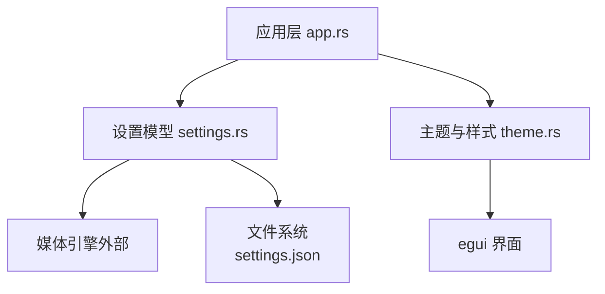
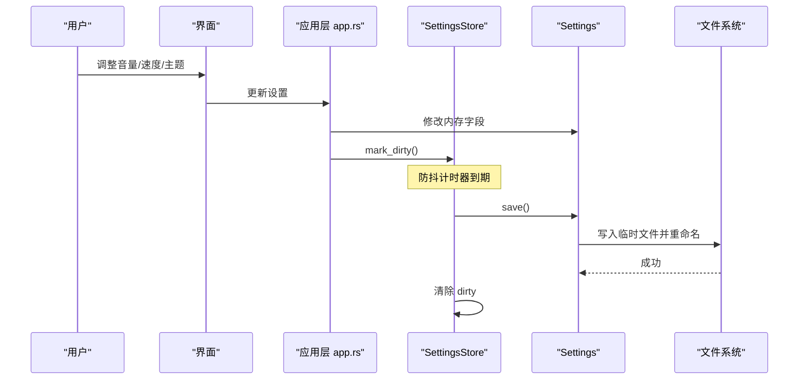
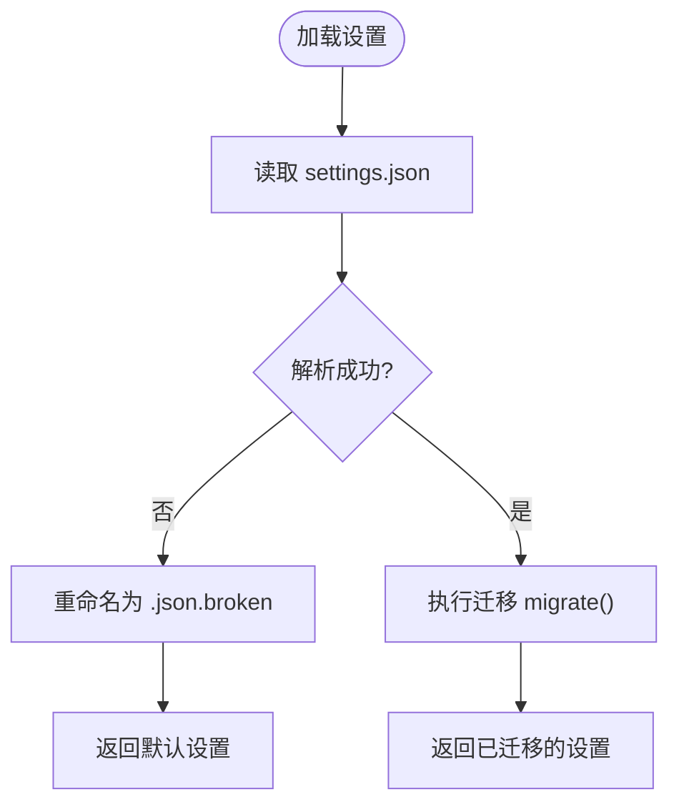
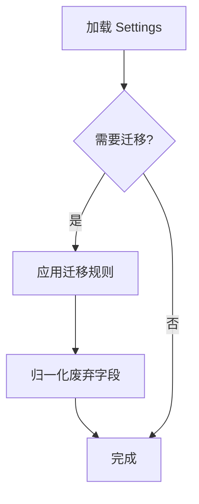
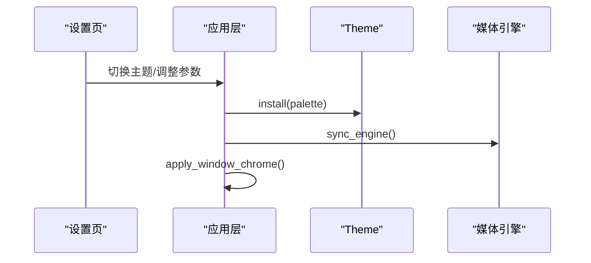
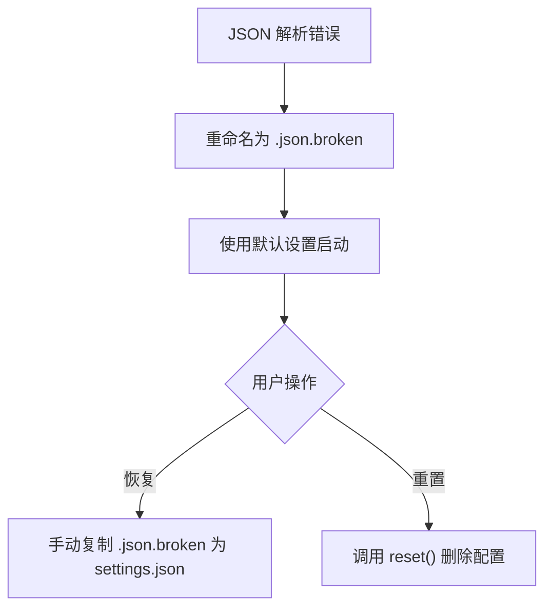
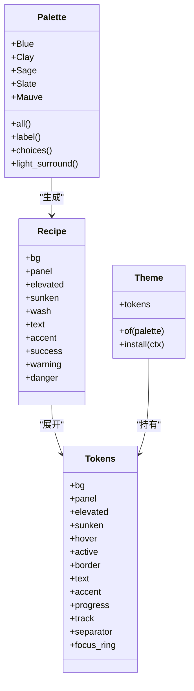
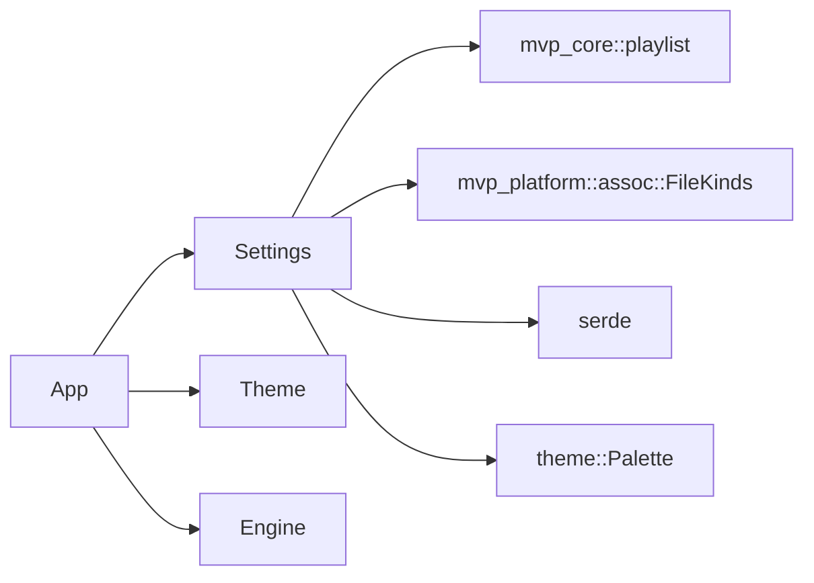

# 配置系统

<cite>
**本文引用的文件**   
- [settings.rs](file://crates/mvp-player/src/settings.rs)
- [theme.rs](file://crates/mvp-player/src/theme.rs)
- [app.rs](file://crates/mvp-player/src/app.rs)
</cite>

## 目录
1. [简介](#简介)
2. [项目结构](#项目结构)
3. [核心组件](#核心组件)
4. [架构总览](#架构总览)
5. [详细组件分析](#详细组件分析)
6. [依赖关系分析](#依赖关系分析)
7. [性能与可靠性](#性能与可靠性)
8. [故障排除指南](#故障排除指南)
9. [结论](#结论)

## 简介
本文件面向 MVP-Versatile-Player 的配置系统，覆盖以下目标：
- 应用配置架构与 Settings 结构设计
- 配置项分类、默认值管理与边界约束
- 配置的持久化机制、文件格式与版本迁移策略
- 主题系统与五种配色方案、动态切换与扩展点
- 配置校验、热重载、备份恢复机制
- 配置导入导出与批量管理建议
- 最佳实践与常见问题排查

## 项目结构
配置相关代码集中在播放器 crate 中：
- `crates/mvp-player/src/settings.rs`：用户设置的数据模型、持久化、迁移、防抖写入等
- `crates/mvp-player/src/theme.rs`：主题、调色板、视觉令牌、字体栈与 egui 样式安装
- `crates/mvp-player/src/app.rs`：应用层将设置同步到引擎、保存会话、应用窗口外观等

**图示来源**
- [app.rs:970-984](file://crates/mvp-player/src/app.rs#L970-L984)
- [settings.rs:886-934](file://crates/mvp-player/src/settings.rs#L886-L934)
- [theme.rs:588-731](file://crates/mvp-player/src/theme.rs#L588-L731)

**章节来源**
- [settings.rs:1-27](file://crates/mvp-player/src/settings.rs#L1-L27)
- [theme.rs:1-41](file://crates/mvp-player/src/theme.rs#L1-L41)
- [app.rs:970-984](file://crates/mvp-player/src/app.rs#L970-L984)

## 核心组件
- Settings：所有可持久化的用户偏好集合，包含外观、音频、播放、视频、字幕、图片、系统集成、窗口、历史、快捷键等类别。
- Palette/Theme/Tokens：主题系统，定义五种内置配色和一套视觉令牌，并安装到 egui。
- SettingsStore：防抖写入器，避免高频拖动滑块时频繁落盘。
- LaunchOverrides：单次启动的命令行覆盖值，不写回配置文件。

关键职责划分：
- Settings 负责数据模型、默认值、校验与范围限制、持久化路径、迁移、最近文件与回放位置记忆等。
- Theme 负责颜色、间距、圆角、字体栈与 egui 样式注入。
- App 负责把运行时设置同步到引擎、保存会话、应用原生标题栏着色等。

**章节来源**
- [settings.rs:375-772](file://crates/mvp-player/src/settings.rs#L375-L772)
- [settings.rs:1093-1153](file://crates/mvp-player/src/settings.rs#L1093-L1153)
- [theme.rs:76-98](file://crates/mvp-player/src/theme.rs#L76-L98)
- [theme.rs:178-241](file://crates/mvp-player/src/theme.rs#L178-L241)
- [app.rs:970-984](file://crates/mvp-player/src/app.rs#L970-L984)

## 架构总览
配置系统采用“单一 JSON 文档 + 内存模型 + 防抖落盘”的模式：
- 启动时从 `%APPDATA%\MVP-Versatile-Player\settings.json` 加载，缺失或损坏则回退默认值并保留损坏副本。
- 运行期通过 Settings 暴露的 setter 修改内存状态；UI 与引擎消费这些值。
- 变更标记为 dirty，按时间间隔批量 flush 到磁盘；每次落盘使用临时文件 + rename 保证原子性。
- 主题由 Palette 选择，Theme.install 将 Tokens 注入 egui，支持运行时切换。

**图示来源**
- [settings.rs:1093-1153](file://crates/mvp-player/src/settings.rs#L1093-L1153)
- [settings.rs:920-934](file://crates/mvp-player/src/settings.rs#L920-L934)
- [app.rs:986-995](file://crates/mvp-player/src/app.rs#L986-L995)

## 详细组件分析

### Settings 结构与配置项分类
Settings 是一个扁平的 JSON 文档映射，字段按功能分组：
- 外观：palette
- 音频：volume、muted、audio_device、audio_delay、audio_enhance
- 播放：speed、repeat、shuffle、remember_position、resume_min_seconds、end_action
- 视频：hardware_decoding、hdr_tone_map、dv_reshape、aspect、rotation、flip_h、flip_v、control_scrim、minimap、hide_controls_after
- 画面调节：picture、picture_scope、per_file_picture、enhance
- 字幕：subtitles_enabled、subtitle_size、subtitle_color、subtitle_outline、subtitle_margin、subtitle_delay、prefer_external_subtitles、autoload_sidecar_subtitles、last_subtitle_dir
- 图片：slideshow_interval、slideshow_active、animate_images、image_background
- 系统集成：file_kinds、context_menu、set_as_default
- 窗口：window_size、window_pos、maximized、start_fullscreen、always_on_top、dark_title_bar、sidebar_visible、sidebar_tab、show_statistics
- 历史：recent_files、recent_limit、last_dir、snapshot_dir、snapshot_includes_picture、resume_positions、restore_playlist、playlist、playlist_index
- 快捷键：seek_step、seek_step_large、wheel_controls_volume、double_click_fullscreen
- 版本：version

默认值设计原则：
- 所有“中性”值表示“不做任何处理”，例如 PictureSettings 的亮度对比度为 0、gamma 为 1.0；AudioEnhanceSettings 默认关闭且参数处于中立位置。
- 枚举类型提供 label 与 all/choices 列表，确保菜单与设置页保持一致。

**章节来源**
- [settings.rs:28-86](file://crates/mvp-player/src/settings.rs#L28-L86)
- [settings.rs:168-266](file://crates/mvp-player/src/settings.rs#L168-L266)
- [settings.rs:268-314](file://crates/mvp-player/src/settings.rs#L268-L314)
- [settings.rs:473-594](file://crates/mvp-player/src/settings.rs#L473-L594)
- [settings.rs:596-772](file://crates/mvp-player/src/settings.rs#L596-L772)
- [settings.rs:774-854](file://crates/mvp-player/src/settings.rs#L774-L854)

### 配置持久化与文件格式
- 存储位置：`%APPDATA%\MVP-Versatile-Player\settings.json`
- 格式：人类可读的 JSON，便于检查、重置与跨机器迁移
- 写入策略：
  - 仅当有变更时才写入
  - 先写 `.json.tmp`，再删除原文件并 rename 为新文件，避免崩溃导致损坏
- 加载策略：
  - 文件不存在则返回默认值
  - 解析失败则记录警告并将原文件重命名为 `.json.broken`，然后使用默认值启动

**图示来源**
- [settings.rs:886-918](file://crates/mvp-player/src/settings.rs#L886-L918)

**章节来源**
- [settings.rs:1-10](file://crates/mvp-player/src/settings.rs#L1-L10)
- [settings.rs:860-870](file://crates/mvp-player/src/settings.rs#L860-L870)
- [settings.rs:886-934](file://crates/mvp-player/src/settings.rs#L886-L934)

### 版本迁移策略
- SCHEMA_VERSION 用于标识磁盘文档形状；当前为 1
- migrate() 对废弃字段进行安全转换，例如 AspectMode::Source 被迁移为 Fit
- 未知或缺失字段不会导致整个文档失效，而是回退默认值，保证向后兼容

**图示来源**
- [settings.rs:856-918](file://crates/mvp-player/src/settings.rs#L856-L918)

**章节来源**
- [settings.rs:856-918](file://crates/mvp-player/src/settings.rs#L856-L918)

### 配置校验与范围约束
- PictureSettings.clamp：将亮度、对比度、饱和度、温度、色相限制在 [-1, 1]，锐化 [0, 2]，伽马 [0.5, 2.5]，并确保有限数
- EnhanceSettings.clamp：强度、降噪、去块、锐化限制在 [0, 1]
- AudioEnhanceSettings.snapshot：构建 DSP Snapshot 前统一 clamp，防止非法值进入实时线程
- 其他数值型字段在 UI 层与引擎层也有合理范围，例如速度、音量等

注意：当前仓库未实现独立的“配置验证器”对象，校验逻辑分散在各结构的 clamp/is_finite/is_neutral 等方法中。

**章节来源**
- [settings.rs:232-266](file://crates/mvp-player/src/settings.rs#L232-L266)
- [settings.rs:306-314](file://crates/mvp-player/src/settings.rs#L306-L314)
- [settings.rs:536-562](file://crates/mvp-player/src/settings.rs#L536-L562)

### 配置热重载
- 主题切换：Theme.install 可重复调用，重新安装 egui 样式与字体栈，无需重启
- 引擎同步：App.sync_engine 将音量、静音、速度、延迟、HDR/DV 等设置推送到引擎
- 窗口外观：App.apply_window_chrome 根据 dark_title_bar 设置即时应用原生标题栏着色

**图示来源**
- [theme.rs:596-731](file://crates/mvp-player/src/theme.rs#L596-L731)
- [app.rs:970-984](file://crates/mvp-player/src/app.rs#L970-L984)
- [app.rs:1297-1325](file://crates/mvp-player/src/app.rs#L1297-L1325)

**章节来源**
- [theme.rs:588-731](file://crates/mvp-player/src/theme.rs#L588-L731)
- [app.rs:970-984](file://crates/mvp-player/src/app.rs#L970-L984)
- [app.rs:1297-1325](file://crates/mvp-player/src/app.rs#L1297-L1325)

### 配置备份与恢复
- 损坏备份：解析失败时将 settings.json 重命名为 settings.json.broken，保留原始内容供恢复
- 重置：Settings.reset 删除配置文件并返回默认值
- 快照目录：可通过 snapshot_dir 配置截图输出位置，默认位于“图片\MVP Snapshots”

**图示来源**
- [settings.rs:886-907](file://crates/mvp-player/src/settings.rs#L886-L907)
- [settings.rs:936-941](file://crates/mvp-player/src/settings.rs#L936-L941)
- [settings.rs:872-884](file://crates/mvp-player/src/settings.rs#L872-L884)

**章节来源**
- [settings.rs:886-907](file://crates/mvp-player/src/settings.rs#L886-L907)
- [settings.rs:936-941](file://crates/mvp-player/src/settings.rs#L936-L941)
- [settings.rs:872-884](file://crates/mvp-player/src/settings.rs#L872-L884)

### 配置导入导出与批量管理
- 导入：由于配置是标准 JSON，可直接编辑 settings.json 或使用脚本合并多个配置片段
- 导出：settings.json 即为完整导出文件，可用于备份或分发
- 批量管理：
  - 最近文件 recent_files 自动去重并按 limit 裁剪
  - 每文件画面调节 per_file_picture 最多保留固定数量，按最近使用淘汰
  - 回放位置 resume_positions 限制大小，避免无限增长

注意：仓库未提供专门的“导入/导出 API”，但 Settings 的序列化/反序列化能力使 JSON 成为天然交换格式。

**章节来源**
- [settings.rs:943-956](file://crates/mvp-player/src/settings.rs#L943-L956)
- [settings.rs:1014-1053](file://crates/mvp-player/src/settings.rs#L1014-L1053)
- [settings.rs:958-996](file://crates/mvp-player/src/settings.rs#L958-L996)

### 主题系统与五种配色方案
Palette 提供五种内置深色主题：
- Blue：原版蓝灰调
- Clay：暖灰配陶土强调色
- Sage：暖灰配鼠尾草绿强调色
- Slate：冷灰配雾蓝强调色
- Mauve：暖灰配藕紫强调色

Theme 负责：
- 将 Palette 转换为 Tokens（颜色令牌）
- 安装 egui Visuals 与 Style，包括面板、窗口、控件、滚动条、阴影、字体栈等
- 强制暗色主题，不跟随系统主题

动态切换：
- 用户在设置中选择新 Palette
- App 调用 Theme.install 重新注入样式
- 同时应用原生标题栏着色以匹配主题

自定义主题支持：
- 当前 Palette 为枚举，新增主题需添加变体并实现 recipe/tokens
- 若需完全自定义，可在 Theme 层扩展新的构造方式，但需保持 Tokens 语义一致

**图示来源**
- [theme.rs:76-98](file://crates/mvp-player/src/theme.rs#L76-L98)
- [theme.rs:178-241](file://crates/mvp-player/src/theme.rs#L178-L241)
- [theme.rs:243-364](file://crates/mvp-player/src/theme.rs#L243-L364)
- [theme.rs:588-731](file://crates/mvp-player/src/theme.rs#L588-L731)

**章节来源**
- [theme.rs:1-41](file://crates/mvp-player/src/theme.rs#L1-L41)
- [theme.rs:76-98](file://crates/mvp-player/src/theme.rs#L76-L98)
- [theme.rs:178-241](file://crates/mvp-player/src/theme.rs#L178-L241)
- [theme.rs:588-731](file://crates/mvp-player/src/theme.rs#L588-L731)

## 依赖关系分析
- Settings 依赖：
  - mvp_core::playlist（RepeatMode、PlaylistItem）
  - mvp_platform::assoc::FileKinds
  - serde（序列化/反序列化）
  - crate::theme::Palette（外观）
- App 依赖：
  - Settings（读取/保存）
  - Theme（安装主题）
  - 媒体引擎（设置音量、速度、HDR/DV 等）

**图示来源**
- [settings.rs:12-20](file://crates/mvp-player/src/settings.rs#L12-L20)
- [app.rs:970-984](file://crates/mvp-player/src/app.rs#L970-L984)

**章节来源**
- [settings.rs:12-20](file://crates/mvp-player/src/settings.rs#L12-L20)
- [app.rs:970-984](file://crates/mvp-player/src/app.rs#L970-L984)

## 性能与可靠性
- 防抖写入：SettingsStore 默认 2 秒刷新一次，避免高频拖动滑块造成磁盘抖动
- 原子写入：临时文件 + rename，降低崩溃风险
- 资源保护：
  - per_file_picture 限制最大条目数
  - resume_positions 限制大小并清理旧项
  - recent_files 去重并按 limit 裁剪
- 主题安装：
  - 字体预取在后台线程加载，减少首帧阻塞
  - Theme.install 复用 OnceLock，避免重复初始化

**章节来源**
- [settings.rs:1093-1153](file://crates/mvp-player/src/settings.rs#L1093-L1153)
- [settings.rs:1014-1053](file://crates/mvp-player/src/settings.rs#L1014-L1053)
- [settings.rs:958-996](file://crates/mvp-player/src/settings.rs#L958-L996)
- [theme.rs:862-934](file://crates/mvp-player/src/theme.rs#L862-L934)
- [theme.rs:982-1053](file://crates/mvp-player/src/theme.rs#L982-L1053)

## 故障排除指南
常见问题与建议：
- 配置损坏无法启动：
  - 检查是否存在 settings.json.broken，可手动恢复为 settings.json
  - 若仍异常，删除 settings.json 让程序重建默认配置
- 主题显示异常：
  - 确认 Theme.install 已被调用，且 Palette 选择正确
  - 检查 egui 是否被系统主题干扰；程序强制暗色主题
- 设置未保存：
  - 检查是否频繁修改但未等待防抖刷新
  - 查看日志是否有“无法保存设置”警告
- 字幕或画面调节无效：
  - 确认 PictureSettings/AudioEnhanceSettings 的 clamp 后值有效
  - 检查引擎是否已同步设置（sync_engine）

**章节来源**
- [settings.rs:886-907](file://crates/mvp-player/src/settings.rs#L886-L907)
- [settings.rs:1140-1153](file://crates/mvp-player/src/settings.rs#L1140-L1153)
- [theme.rs:588-731](file://crates/mvp-player/src/theme.rs#L588-L731)
- [app.rs:970-984](file://crates/mvp-player/src/app.rs#L970-L984)

## 结论
MVP-Versatile-Player 的配置系统以简洁、健壮为核心：
- 单一 JSON 文档便于人类阅读与迁移
- Settings 结构清晰分类，默认值中性且安全
- 防抖写入与原子落盘保障性能与可靠性
- 主题系统提供五种内置配色，支持运行时切换
- 校验逻辑内聚于各结构方法，确保输入安全
- 通过 JSON 即可实现导入导出与批量管理

未来可扩展方向：
- 增加独立配置验证器，集中校验规则
- 提供配置导入导出工具函数或 CLI
- 扩展主题系统以支持更多自定义方案
- 引入配置差异比较与增量迁移框架