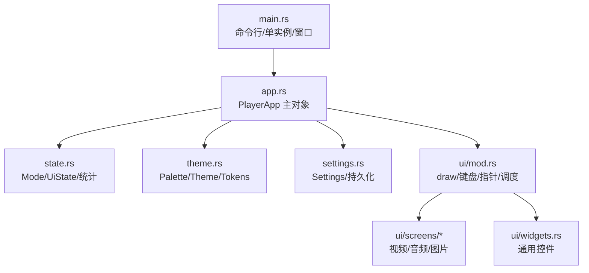
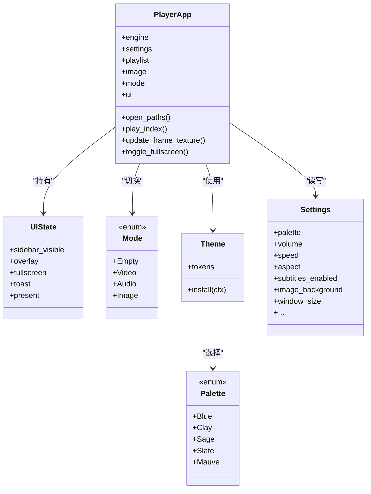
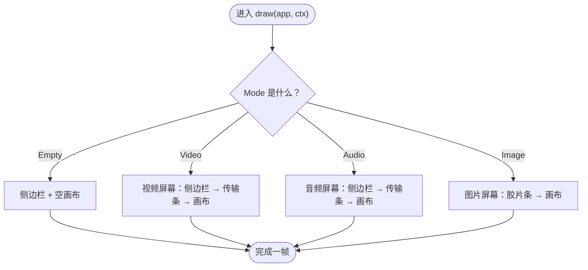
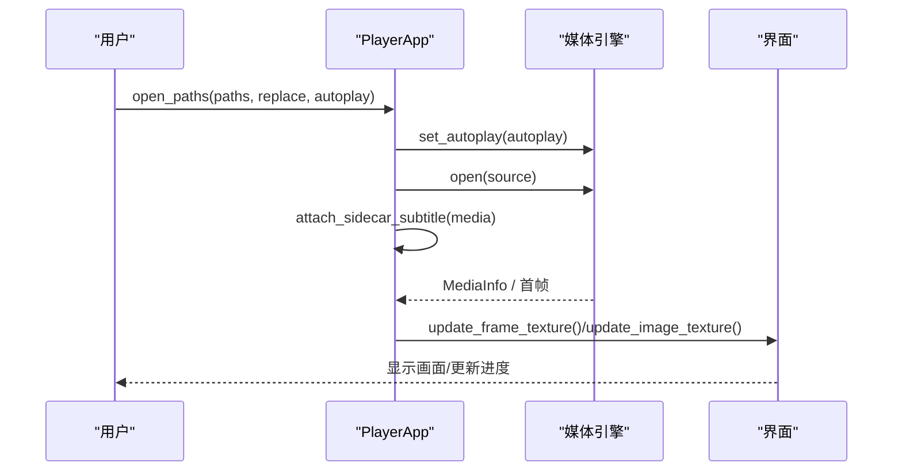
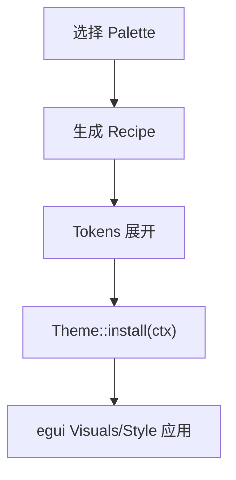
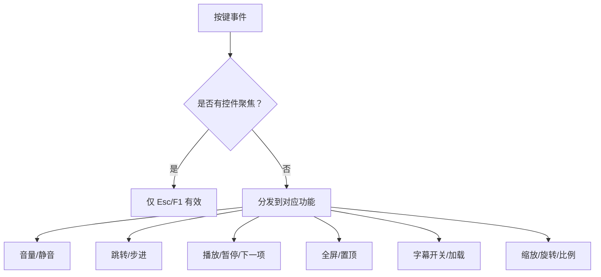
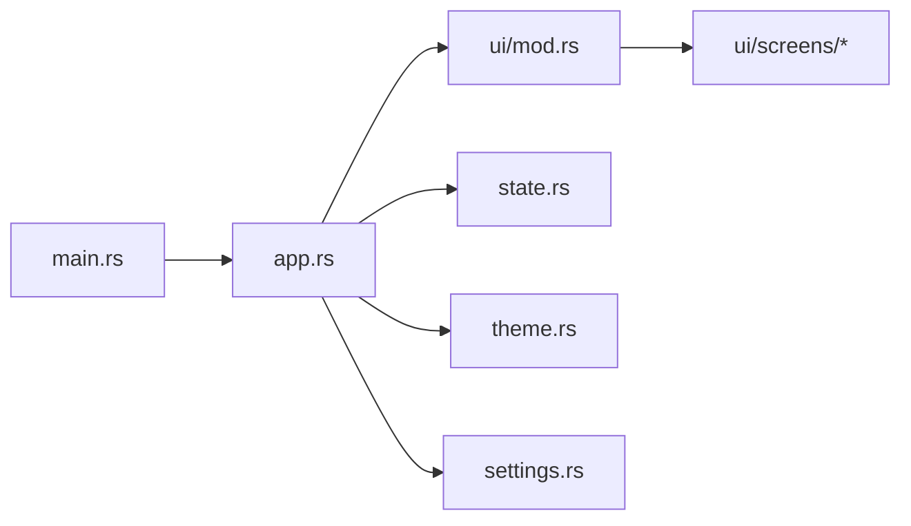

# 用户界面

<cite>
**本文引用的文件**   
- [README.md](file://README.md)
- [main.rs](file://crates/mvp-player/src/main.rs)
- [app.rs](file://crates/mvp-player/src/app.rs)
- [state.rs](file://crates/mvp-player/src/state.rs)
- [theme.rs](file://crates/mvp-player/src/theme.rs)
- [settings.rs](file://crates/mvp-player/src/settings.rs)
- [ui/mod.rs](file://crates/mvp-player/src/ui/mod.rs)
- [ui/screens/mod.rs](file://crates/mvp-player/src/ui/screens/mod.rs)
- [ui/screens/video.rs](file://crates/mvp-player/src/ui/screens/video.rs)
- [ui/screens/audio.rs](file://crates/mvp-player/src/ui/screens/audio.rs)
- [ui/screens/image.rs](file://crates/mvp-player/src/ui/screens/image.rs)
- [ui/widgets.rs](file://crates/mvp-player/src/ui/widgets.rs)
</cite>

## 目录
1. [简介](#简介)
2. [项目结构](#项目结构)
3. [核心组件](#核心组件)
4. [架构总览](#架构总览)
5. [详细组件分析](#详细组件分析)
6. [依赖关系分析](#依赖关系分析)
7. [性能与响应式布局](#性能与响应式布局)
8. [故障排查指南](#故障排查指南)
9. [结论](#结论)
10. [附录：开发指南](#附录开发指南)

## 简介
本文件面向基于 egui/eframe 的跨平台 GUI 层，系统性说明 MVP-Versatile-Player 的用户界面设计、状态管理、设置持久化、主题配色、三套独立界面（视频播放器、音频播放器、图片查看器），以及屏幕管理、对话框、菜单、侧边栏等组件的组织方式。文档同时覆盖键盘与鼠标事件处理、响应式布局策略、界面定制与主题扩展方法，并给出可操作的 UI 组件使用示例与最佳实践。

## 项目结构
mvp-player 是 egui 界面与应用程序入口所在 crate，负责窗口创建、单实例 IPC、命令解析、应用状态、主题与设置、UI 布局与交互。其关键模块如下：
- 应用入口与启动流程：main.rs
- 应用主对象与引擎集成：app.rs
- 瞬态界面状态与统计：state.rs
- 主题与视觉令牌：theme.rs
- 设置与持久化：settings.rs
- UI 框架与全局交互：ui/mod.rs
- 三类媒体屏幕：ui/screens/{video,audio,image}.rs
- 通用控件与绘制工具：ui/widgets.rs

**图表来源**
- [main.rs:40-181](file://crates/mvp-player/src/main.rs#L40-L181)
- [app.rs:66-204](file://crates/mvp-player/src/app.rs#L66-L204)
- [ui/mod.rs:49-144](file://crates/mvp-player/src/ui/mod.rs#L49-L144)

**章节来源**
- [main.rs:40-181](file://crates/mvp-player/src/main.rs#L40-L181)
- [README.md:315-323](file://README.md#L315-L323)

## 核心组件
- PlayerApp：应用唯一所有者，持有媒体引擎、播放列表、图片查看器、设置、主题、纹理缓存、帧历史、IPC 通道、全屏/置顶控制、字幕加载等。所有状态变更都通过它协调。
- UiState：非持久化的界面状态，包括侧边栏可见性、当前模式、悬浮面板、Toast、全屏状态、渲染统计等。
- Mode：主区域显示模式枚举，区分 Empty/Video/Audio/Image，驱动不同屏幕布局。
- Theme/Palette/Tokens：主题系统，提供五种深色配色方案与统一的视觉令牌，安装到 egui 的 Visuals 中。
- Settings：JSON 持久化配置，涵盖外观、音视频、画面调节、字幕、图片、系统集成、窗口几何、快捷键等。
- ui/mod.draw：统一绘制入口，负责拖放、键盘、指针空闲、错误横幅、最小化节流、按模式分派到具体屏幕、浮层与对话框。

**章节来源**
- [app.rs:66-204](file://crates/mvp-player/src/app.rs#L66-L204)
- [state.rs:15-49](file://crates/mvp-player/src/state.rs#L15-L49)
- [state.rs:449-576](file://crates/mvp-player/src/state.rs#L449-L576)
- [theme.rs:76-98](file://crates/mvp-player/src/theme.rs#L76-L98)
- [settings.rs:596-772](file://crates/mvp-player/src/settings.rs#L596-L772)
- [ui/mod.rs:49-144](file://crates/mvp-player/src/ui/mod.rs#L49-L144)

## 架构总览
界面采用“屏幕 + 侧边栏 + 底部条”的经典桌面播放器布局，三种媒体类型各自拥有独立的屏幕模块，共享同一套主题、控件与状态基础设施。

**图表来源**
- [app.rs:66-204](file://crates/mvp-player/src/app.rs#L66-L204)
- [state.rs:15-49](file://crates/mvp-player/src/state.rs#L15-L49)
- [theme.rs:76-98](file://crates/mvp-player/src/theme.rs#L76-L98)
- [settings.rs:596-772](file://crates/mvp-player/src/settings.rs#L596-L772)

## 详细组件分析

### 屏幕管理与三套独立界面
- 屏幕分发：ui/screens/mod.rs 根据 Mode 将绘制任务交给 video/audio/image 三个子模块。每个屏幕模块负责自身的面板顺序：先侧边栏，再底部条或胶片条，最后画布。
- 视频屏幕：右侧为播放列表/轨道/章节/信息；底部为时间轴、快进/暂停/音量等；画布最大化显示视频帧。
- 音频屏幕：左侧唱片海报与进度环，右侧队列/歌词/参数；底部为大音量滑杆、变速与输出设备选择。
- 图片查看器：底部缩略图胶片条；画布工具条含缩放、适应/填充/100%、旋转、翻转、背景与幻灯片；侧边栏为 EXIF 信息。

**图表来源**
- [ui/screens/mod.rs:28-39](file://crates/mvp-player/src/ui/screens/mod.rs#L28-L39)
- [ui/screens/video.rs:16-24](file://crates/mvp-player/src/ui/screens/video.rs#L16-L24)
- [ui/screens/audio.rs:15-23](file://crates/mvp-player/src/ui/screens/audio.rs#L15-L23)
- [ui/screens/image.rs:24-34](file://crates/mvp-player/src/ui/screens/image.rs#L24-L34)

**章节来源**
- [ui/screens/mod.rs:1-71](file://crates/mvp-player/src/ui/screens/mod.rs#L1-L71)
- [ui/screens/video.rs:1-25](file://crates/mvp-player/src/ui/screens/video.rs#L1-L25)
- [ui/screens/audio.rs:1-24](file://crates/mvp-player/src/ui/screens/audio.rs#L1-L24)
- [ui/screens/image.rs:1-186](file://crates/mvp-player/src/ui/screens/image.rs#L1-L186)

### 应用状态管理机制
- 模式切换：打开本地路径时，若分类为图片则进入 ImageView 并切换到 Mode::Image；否则走 Engine 管线，并根据是否仅有音频决定初始 Mode::Audio 或 Mode::Video。
- 帧上传与历史：视频帧零拷贝转 ColorImage 后上传至 GPU；同时记录最近若干帧用于“上一帧”步进。图片帧按 (viewer serial, frame index) 去重上传。
- 播放列表与断点续播：打开条目时保存上次位置，时长已知后恢复；设置中可开启/关闭记忆。
- 字幕：支持外部文本字幕与图形字幕（PGS/VobSub）；可按同名字幕优先或内嵌优先策略自动加载。

**图表来源**
- [app.rs:368-443](file://crates/mvp-player/src/app.rs#L368-L443)
- [app.rs:446-544](file://crates/mvp-player/src/app.rs#L446-L544)
- [app.rs:715-769](file://crates/mvp-player/src/app.rs#L715-L769)

**章节来源**
- [app.rs:368-544](file://crates/mvp-player/src/app.rs#L368-L544)
- [app.rs:715-769](file://crates/mvp-player/src/app.rs#L715-L769)
- [state.rs:237-333](file://crates/mvp-player/src/state.rs#L237-L333)

### 设置系统的持久化存储
- 存储位置：`%APPDATA%\MVP-Versatile-Player\settings.json`，以 JSON 形式保存全部偏好。
- 写入策略：仅当有变化时写盘，临时文件+原子替换避免损坏；会话每 2 秒落盘一次，退出时只写最后一个文档。
- 主要字段：
  - 外观：palette、dark_title_bar、always_on_top、sidebar_visible/tab
  - 音视频：volume、muted、audio_device、speed、repeat、shuffle、hardware_decoding、hdr_tone_map、dv_reshape、aspect、rotation、flip_h/v
  - 画面调节：picture（七项滑块）、per_file_picture、enhance（实时增强）
  - 字幕：subtitles_enabled、subtitle_size/color/outline/margin/delay、prefer_external_subtitles、autoload_sidecar_subtitles
  - 图片：slideshow_interval/active、animate_images、image_background
  - 窗口：window_size/pos/maximized/start_fullscreen
  - 快捷键：seek_step、wheel_controls_volume、double_click_fullscreen
  - 历史：recent_files、last_dir、snapshot_dir/snapshot_includes_picture、resume_positions、restore_playlist/playlist/playlist_index

**章节来源**
- [settings.rs:1-10](file://crates/mvp-player/src/settings.rs#L1-L10)
- [settings.rs:596-772](file://crates/mvp-player/src/settings.rs#L596-L772)
- [README.md:435-453](file://README.md#L435-L453)

### 主题系统与配色方案
- 五种深色调色板：原版蓝（默认）、陶土灰、灰绿、雾蓝、藕紫。切换即生效并写入 settings.json。
- Tokens 体系：bg/panel/elevated/sunken/text/accent/progress/track/separator/focus_ring 等，保证层级由颜色表达而非线条。
- 透明度配方：alpha 常量集中定义，确保 hover/active/selection/focus 在不同 palette 下保持一致强度。
- 字体与排版：固定字号阶梯、4pt 网格、Apple 风格圆角；标题使用系统粗体或回退到正文面。
- 安装逻辑：Theme::install 设置 egui Visuals，并锁定 Dark 主题，避免系统浅色主题导致弹窗与自定义控件颜色分裂。

**图表来源**
- [theme.rs:76-98](file://crates/mvp-player/src/theme.rs#L76-L98)
- [theme.rs:178-241](file://crates/mvp-player/src/theme.rs#L178-L241)
- [theme.rs:322-364](file://crates/mvp-player/src/theme.rs#L322-L364)
- [theme.rs:614-730](file://crates/mvp-player/src/theme.rs#L614-L730)

**章节来源**
- [theme.rs:1-41](file://crates/mvp-player/src/theme.rs#L1-L41)
- [theme.rs:76-98](file://crates/mvp-player/src/theme.rs#L76-L98)
- [theme.rs:178-241](file://crates/mvp-player/src/theme.rs#L178-L241)
- [theme.rs:322-364](file://crates/mvp-player/src/theme.rs#L322-L364)
- [theme.rs:614-730](file://crates/mvp-player/src/theme.rs#L614-L730)

### 界面组件架构：菜单、对话框、侧边栏、传输条
- 菜单：顶部菜单栏，包含文件/播放/视频/音频/字幕/工具/帮助等入口。
- 对话框：URL 输入、设置窗口、关于、快捷键参考等 Overlay 或浮动窗口。
- 侧边栏：播放列表、轨道、章节、信息、歌词、EXIF 等页面，可通过快捷键 T/Ctrl+L 切换可见性与标签。
- 传输条：视频/音频各自的底部条，包含时间轴、A–B 循环、音量、变速、设备选择等。
- 通用控件：分段控件、胶囊标签、开关、滑块、下拉、图标按钮、SeekBar 等，均使用 Tokens 绘制。

**章节来源**
- [ui/mod.rs:49-144](file://crates/mvp-player/src/ui/mod.rs#L49-L144)
- [ui/widgets.rs:20-43](file://crates/mvp-player/src/ui/widgets.rs#L20-L43)
- [ui/widgets.rs:149-168](file://crates/mvp-player/src/ui/widgets.rs#L149-L168)
- [ui/widgets.rs:254-381](file://crates/mvp-player/src/ui/widgets.rs#L254-L381)
- [ui/widgets.rs:502-561](file://crates/mvp-player/src/ui/widgets.rs#L502-L561)
- [ui/widgets.rs:569-661](file://crates/mvp-player/src/ui/widgets.rs#L569-L661)
- [ui/widgets.rs:749-800](file://crates/mvp-player/src/ui/widgets.rs#L749-L800)

### 响应式布局与绘图顺序
- 面板顺序：顶部菜单 → 错误横幅 → 侧边栏 → 底部条/胶片条 → 画布。这样中央画布得到剩余空间，避免被底部条遮挡。
- 首次帧优化：第一帧仅绘制画布内容，随后请求下一帧绘制完整 chrome，降低首帧延迟。
- 最小化节流：窗口最小化时降低刷新频率，避免后台解码与纹理上传造成卡顿。
- 自适应控件：滑块宽度在行内动态计算，避免窄窗口下控件溢出；分段控件在窄侧边栏中按比例缩放。

**章节来源**
- [ui/mod.rs:49-144](file://crates/mvp-player/src/ui/mod.rs#L49-L144)
- [ui/mod.rs:228-283](file://crates/mvp-player/src/ui/mod.rs#L228-L283)
- [ui/widgets.rs:58-137](file://crates/mvp-player/src/ui/widgets.rs#L58-L137)
- [ui/widgets.rs:254-381](file://crates/mvp-player/src/ui/widgets.rs#L254-L381)

### 键盘快捷键与鼠标事件处理
- 键盘：空格/K 播放/暂停，方向键快进/后退，Shift+方向大跳，上/下音量，M 静音，N/P 上下项，S 截图，F/Alt+Enter 全屏，Esc 退出全屏或关闭弹窗，Z/H/B 比例/随机/A-B 循环，V/G 字幕开关/加载，R 旋转，T/Ctrl+L 侧边栏，Ctrl+O/U 打开文件/网络串流，Ctrl+, 设置，F1 快捷键帮助。滚轮在画面上调音量或快进/后退。
- 指针：移动唤醒控制栏，全屏下自动隐藏；拖拽画面平移图片；点击胶片条切换图片。
- 焦点优先级：文本输入控件优先接管键盘，全局快捷键避让；按钮点击后主动释放焦点以便后续快捷键工作。

**图表来源**
- [ui/mod.rs:315-510](file://crates/mvp-player/src/ui/mod.rs#L315-L510)

**章节来源**
- [ui/mod.rs:315-510](file://crates/mvp-player/src/ui/mod.rs#L315-L510)
- [README.md:286-312](file://README.md#L286-L312)

### 界面定制方法与最佳实践
- 主题扩展：新增 Palette 变体需实现 recipe()，并确保语义色与对比度测试通过；透明度配方集中在 alpha 模块，不要为每个 palette 重复定义。
- 控件使用：优先使用 widgets 中的 row/slider_row/combo_row/switch/tool_button/toggle_tool_button/icon_menu_button/segmented/tab_strip/seek_bar，以保证一致的外观与行为。
- 布局建议：遵循“先声明面板尺寸，再让画布取剩余空间”的顺序；避免在画布之后声明底部条。
- 性能要点：仅在需要时请求重绘；最小化窗口时降低刷新频率；避免每帧做昂贵 I/O（如设备枚举、注册表查询）应缓存并在访问页刷新。
- 可访问性：保持高对比度与清晰的焦点环；使用 Tokens.on_accent 作为强调色上的文字颜色；避免用纯装饰性高饱和色。

**章节来源**
- [theme.rs:1-41](file://crates/mvp-player/src/theme.rs#L1-L41)
- [theme.rs:322-364](file://crates/mvp-player/src/theme.rs#L322-L364)
- [ui/widgets.rs:58-137](file://crates/mvp-player/src/ui/widgets.rs#L58-L137)
- [ui/widgets.rs:502-561](file://crates/mvp-player/src/ui/widgets.rs#L502-L561)
- [ui/widgets.rs:569-661](file://crates/mvp-player/src/ui/widgets.rs#L569-L661)
- [ui/widgets.rs:749-800](file://crates/mvp-player/src/ui/widgets.rs#L749-L800)

## 依赖关系分析
- main.rs 负责解析命令行、单实例互斥、窗口创建与 eframe 运行；将控制权交给 PlayerApp。
- PlayerApp 聚合 Engine、Playlist、ImageView、Settings、Theme、UiState，并通过 ui/mod.draw 驱动界面。
- ui/screens 模块依赖 app 的状态与引擎能力，但不直接操作底层引擎细节。
- theme.rs 与 settings.rs 分别提供视觉令牌与持久化数据，被 PlayerApp 与 UI 共同消费。

**图表来源**
- [main.rs:40-181](file://crates/mvp-player/src/main.rs#L40-L181)
- [app.rs:66-204](file://crates/mvp-player/src/app.rs#L66-L204)
- [ui/mod.rs:49-144](file://crates/mvp-player/src/ui/mod.rs#L49-L144)

**章节来源**
- [main.rs:40-181](file://crates/mvp-player/src/main.rs#L40-L181)
- [app.rs:66-204](file://crates/mvp-player/src/app.rs#L66-L204)

## 性能与响应式布局
- 首帧优化：首次仅绘制画布，随后补全 chrome，减少窗口出现前的等待。
- 渲染计时：记录每帧渲染耗时、平均值与最慢帧，超过阈值时告警日志。
- 最小化节流：后台刷新降至约 2Hz，避免无谓解码与纹理上传。
- 按需重绘：根据引擎状态（Opening/Playing/Paused）与媒体类型（视频/音频/图片）调整 request_repaint_after 间隔。
- 资源复用：帧上传去重（serial/frame index），缩略图异步解码与缓存，避免大图每帧转换。

**章节来源**
- [ui/mod.rs:49-144](file://crates/mvp-player/src/ui/mod.rs#L49-L144)
- [ui/mod.rs:163-226](file://crates/mvp-player/src/ui/mod.rs#L163-L226)
- [ui/mod.rs:228-283](file://crates/mvp-player/src/ui/mod.rs#L228-L283)
- [state.rs:591-667](file://crates/mvp-player/src/state.rs#L591-L667)
- [state.rs:335-438](file://crates/mvp-player/src/state.rs#L335-L438)

## 故障排查指南
- 无法打开文件或字幕：检查 load_subtitle_file/load_graphic_subtitle_file 的错误提示与 toast；确认外部字幕路径与编码识别。
- 画面不更新：检查 update_frame_texture/update_image_texture 的去重逻辑与尺寸校验；确认引擎已产出帧且 mode 正确。
- 设置未持久化：确认 store.mark_dirty() 被调用；检查 settings.json 是否存在且可写；注意临时文件+rename 的原子写入。
- 主题异常：确认 Theme::install 被调用；检查 Palette 的 recipe 与 alpha 一致性；避免混用系统浅色主题。
- 卡顿或掉帧：查看 ui/mod.rs 的 note_frame 与 SLOW_FRAME_MS 告警；检查最小化节流与重绘调度；确认无每帧 I/O。

**章节来源**
- [app.rs:614-668](file://crates/mvp-player/src/app.rs#L614-L668)
- [app.rs:715-769](file://crates/mvp-player/src/app.rs#L715-L769)
- [settings.rs:1-10](file://crates/mvp-player/src/settings.rs#L1-L10)
- [theme.rs:614-730](file://crates/mvp-player/src/theme.rs#L614-L730)
- [ui/mod.rs:198-226](file://crates/mvp-player/src/ui/mod.rs#L198-L226)

## 结论
该界面以 egui/eframe 为基础，围绕 PlayerApp 统一管理引擎、设置与状态，通过 Mode 分流到三套独立屏幕，配合主题系统、通用控件与严格的布局顺序，实现了高性能、可定制、易维护的跨平台 GUI。三套界面各司其职：视频强调时间与轨道控制，音频强调封面与队列，图片强调浏览与参数展示。设置持久化与主题扩展提供了良好的用户体验与二次开发空间。

## 附录：开发指南
- 新增界面元素：优先复用 widgets 中的 row/slider_row/combo_row/switch/tool_button/toggle_tool_button/segmented/tab_strip/seek_bar，确保与主题一致。
- 新增主题：在 Palette 中添加新变体，实现 recipe()，并确保对比度与透明度测试通过；在 settings 中暴露 palette 选择。
- 新增快捷键：在 ui/mod.rs 的 handle_keyboard 中添加映射，注意焦点优先级与 Esc/F1 的全局行为。
- 新增设置项：在 Settings 中添加字段，提供默认值与 clamp 校验；在 UI 中增加 row/switch_row/combo_row/slider_row 绑定；必要时在 PlayerApp 中同步到引擎。
- 图标资源：使用矢量绘制图标（icons 模块），避免位图资源；在工具按钮与菜单中使用 icon_button 与 icon_menu_button。

**章节来源**
- [ui/widgets.rs:58-137](file://crates/mvp-player/src/ui/widgets.rs#L58-L137)
- [ui/widgets.rs:502-561](file://crates/mvp-player/src/ui/widgets.rs#L502-L561)
- [ui/widgets.rs:569-661](file://crates/mvp-player/src/ui/widgets.rs#L569-L661)
- [ui/widgets.rs:749-800](file://crates/mvp-player/src/ui/widgets.rs#L749-L800)
- [theme.rs:76-98](file://crates/mvp-player/src/theme.rs#L76-L98)
- [settings.rs:596-772](file://crates/mvp-player/src/settings.rs#L596-L772)
- [ui/mod.rs:315-510](file://crates/mvp-player/src/ui/mod.rs#L315-L510)