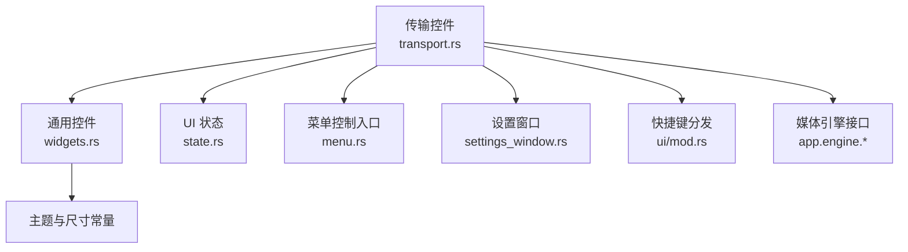
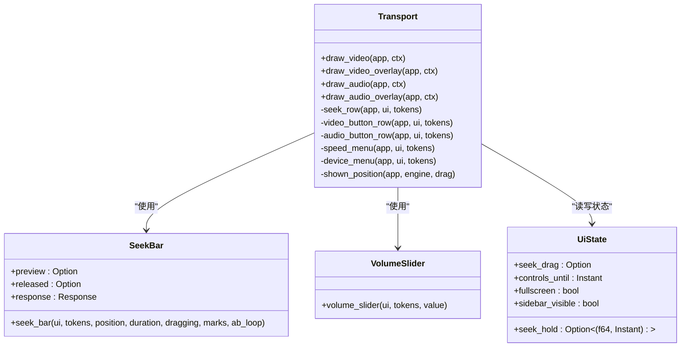
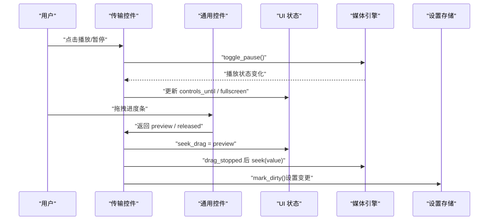
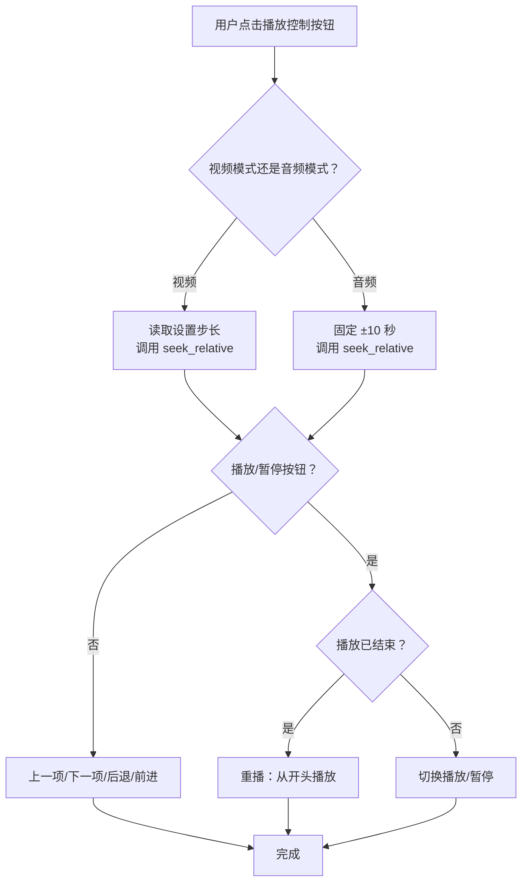
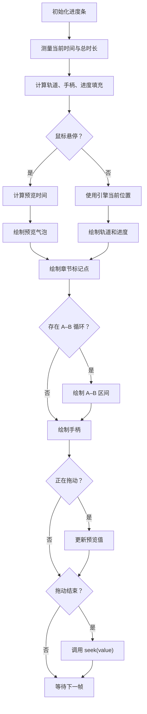
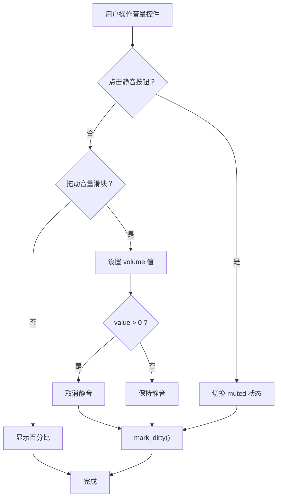
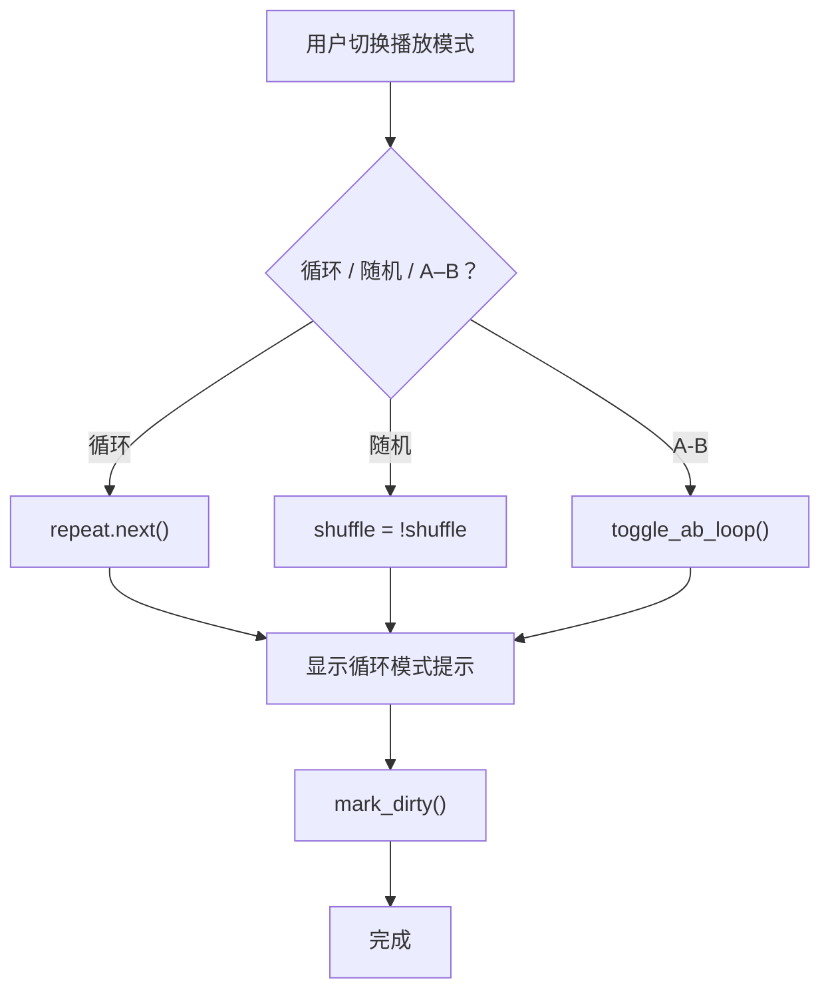
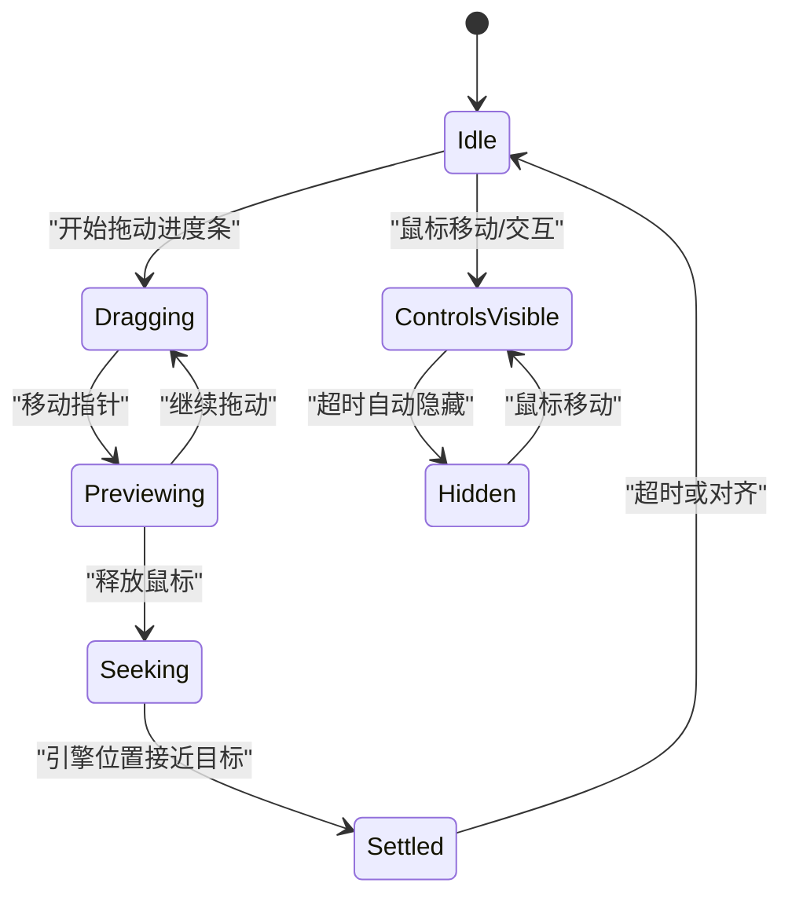
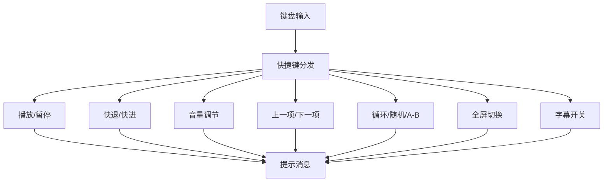

# 传输控件

<cite>
**本文引用的文件**   
- [transport.rs](file://crates/mvp-player/src/ui/transport.rs)
- [widgets.rs](file://crates/mvp-player/src/ui/widgets.rs)
- [state.rs](file://crates/mvp-player/src/state.rs)
- [menu.rs](file://crates/mvp-player/src/ui/menu.rs)
- [settings_window.rs](file://crates/mvp-player/src/ui/settings_window.rs)
- [mod.rs](file://crates/mvp-player/src/ui/mod.rs)
- [README.md](file://README.md)
</cite>

## 目录
1. [简介](#简介)
2. [项目结构定位](#项目结构定位)
3. [核心组件总览](#核心组件总览)
4. [架构与数据流](#架构与数据流)
5. [播放控制按钮实现](#播放控制按钮实现)
6. [进度条自定义实现](#进度条自定义实现)
7. [音量控制滑块设计](#音量控制滑块设计)
8. [播放模式切换逻辑](#播放模式切换逻辑)
9. [状态管理与动画效果](#状态管理与动画效果)
10. [键盘快捷键支持](#键盘快捷键支持)
11. [可访问性与响应式设计](#可访问性与响应式设计)
12. [性能与交互优化](#性能与交互优化)
13. [故障排查指南](#故障排查指南)
14. [结论](#结论)

## 简介
传输控件是播放器界面中负责“时间轴 + 播放控制”的核心区域。它同时承担以下职责：
- 提供播放、暂停、上一首、下一首等基础播放控制。
- 提供可拖拽的进度条，支持时间预览、章节标记点显示和 A–B 循环区间可视化。
- 提供静音按钮、音量滑块、百分比读数和速度菜单。
- 提供循环模式、随机播放、A–B 循环等播放模式切换。
- 在视频模式和音频模式下分别渲染不同的控制组合。
- 在全屏时以浮动岛形式呈现，并支持自动隐藏。
- 与全局状态、引擎状态、设置持久化以及快捷键系统联动。

该文档聚焦于传输控件的实现细节、用户交互流程、状态管理、动画表现、可访问性支持和响应式布局策略。

## 项目结构定位
传输控件位于 `mvp-player` 的 UI 层，主要代码集中在两个文件中：
- `ui/transport.rs`：负责传输栏布局、按钮行、进度行、全屏浮层、音频和视频两种模式的控制差异。
- `ui/widgets.rs`：负责通用控件绘制，包括进度条、音量滑块、工具按钮、开关、分段控件等。

相关状态和快捷键逻辑分布在：
- `state.rs`：UI 临时状态、提示消息、播放状态标签、循环模式标签、拖动跳转状态。
- `ui/menu.rs`：菜单栏中的播放控制入口。
- `ui/settings_window.rs`：设置窗口中与传输控件相关的配置项。
- `ui/mod.rs`：全局快捷键分发。
- `README.md`：快捷键说明和用户指南。

**图表来源**
- [transport.rs:23-111](file://crates/mvp-player/src/ui/transport.rs#L23-L111)
- [widgets.rs:749-927](file://crates/mvp-player/src/ui/widgets.rs#L749-L927)
- [state.rs:449-576](file://crates/mvp-player/src/state.rs#L449-L576)

**章节来源**
- [transport.rs:23-111](file://crates/mvp-player/src/ui/transport.rs#L23-L111)
- [widgets.rs:1-19](file://crates/mvp-player/src/ui/widgets.rs#L1-L19)

## 核心组件总览
传输控件由以下关键部分组成：
- 视频传输栏：固定在视频下方的面板，包含进度行和控制行。
- 视频全屏浮层：覆盖在画面上的浮动岛，内容与视频传输栏一致。
- 音频传输栏：针对无画面场景的控制行，强调音量、速度、输出设备和歌词开关。
- 音频全屏浮层：音频模式下的全屏浮动控制。
- 进度行：当前时间、进度条、总时长，以及悬浮时间预览气泡。
- 控制行：播放控制、音量、速度、全屏、设置、侧边栏、循环、随机等按钮。
- 通用控件：进度条、音量滑块、工具按钮、切换按钮、图标菜单、开关、分段控件。

**图表来源**
- [transport.rs:23-111](file://crates/mvp-player/src/ui/transport.rs#L23-L111)
- [transport.rs:412-592](file://crates/mvp-player/src/ui/transport.rs#L412-L592)
- [widgets.rs:749-927](file://crates/mvp-player/src/ui/widgets.rs#L749-L927)
- [state.rs:449-576](file://crates/mvp-player/src/state.rs#L449-L576)

**章节来源**
- [transport.rs:23-111](file://crates/mvp-player/src/ui/transport.rs#L23-L111)
- [transport.rs:412-592](file://crates/mvp-player/src/ui/transport.rs#L412-L592)
- [widgets.rs:749-927](file://crates/mvp-player/src/ui/widgets.rs#L749-L927)
- [state.rs:449-576](file://crates/mvp-player/src/state.rs#L449-L576)

## 架构与数据流
传输控件的数据流遵循“界面驱动状态，状态驱动引擎”的模式：
1. 用户点击或拖拽进度条、控制按钮。
2. 传输控件读取当前引擎状态（是否播放、当前位置、总时长）。
3. 传输控件更新 UI 状态（例如拖动预览、跳转请求、全屏状态、侧边栏可见性）。
4. 需要时调用引擎方法（播放/暂停、停止、跳转、快进/快退）。
5. 设置变更通过存储标记为脏，触发持久化。
6. 提示消息用于反馈循环模式、随机播放、字幕开关等操作结果。

**图表来源**
- [transport.rs:412-592](file://crates/mvp-player/src/ui/transport.rs#L412-L592)
- [transport.rs:603-806](file://crates/mvp-player/src/ui/transport.rs#L603-L806)
- [widgets.rs:749-927](file://crates/mvp-player/src/ui/widgets.rs#L749-L927)
- [state.rs:449-576](file://crates/mvp-player/src/state.rs#L449-L576)

**章节来源**
- [transport.rs:412-592](file://crates/mvp-player/src/ui/transport.rs#L412-L592)
- [transport.rs:603-806](file://crates/mvp-player/src/ui/transport.rs#L603-L806)
- [widgets.rs:749-927](file://crates/mvp-player/src/ui/widgets.rs#L749-L927)
- [state.rs:449-576](file://crates/mvp-player/src/state.rs#L449-L576)

## 播放控制按钮实现
播放控制按钮包括：
- 上一首/上一项
- 后退指定秒数
- 播放/暂停
- 前进指定秒数
- 下一首/下一项

这些按钮在视频模式和音频模式中略有差异：
- 视频模式：后退/前进步长来自设置；播放按钮在无媒体时打开文件，有媒体时切换播放/暂停。
- 音频模式：后退/前进固定为 10 秒；播放按钮直接切换引擎暂停状态。

按钮行为关键点：
- 播放按钮根据引擎状态动态选择图标和提示文本。
- 已结束状态会显示“重播”，而不是继续显示“播放”。
- 上一项/下一项依赖播放列表状态，禁用不可用项。
- 后退/前进按钮在音频模式下始终可用，在视频模式下受媒体激活状态控制。

**图表来源**
- [transport.rs:114-154](file://crates/mvp-player/src/ui/transport.rs#L114-L154)
- [transport.rs:603-679](file://crates/mvp-player/src/ui/transport.rs#L603-L679)

**章节来源**
- [transport.rs:114-154](file://crates/mvp-player/src/ui/transport.rs#L114-L154)
- [transport.rs:603-679](file://crates/mvp-player/src/ui/transport.rs#L603-L679)
- [menu.rs:223-257](file://crates/mvp-player/src/ui/menu.rs#L223-L257)

## 进度条自定义实现
进度条是传输控件中最复杂的自定义控件之一，其功能包括：
- 显示当前时间和总时长。
- 支持鼠标拖拽跳转。
- 支持悬停时间预览。
- 显示章节标记点。
- 显示 A–B 循环区间。
- 在拖动期间优先显示用户指针位置，避免引擎异步 seek 造成的跳回现象。

实现要点：
- 进度条宽度由剩余空间决定，最小宽度保证可拖拽。
- 轨道高度在悬停或拖动时变粗，手柄半径也变大。
- 已播放部分使用进度色填充。
- A–B 循环区间以警告色半透明带显示，并在两端绘制硬边界标记。
- 章节起点绘制垂直刻度线，便于用户瞄准导航。
- 悬停时显示时间气泡，若命中章节则显示“时间 · 章节名”。
- 拖动结束时才执行真实跳转，避免频繁 seek。

**图表来源**
- [transport.rs:412-592](file://crates/mvp-player/src/ui/transport.rs#L412-L592)
- [widgets.rs:749-927](file://crates/mvp-player/src/ui/widgets.rs#L749-L927)

**章节来源**
- [transport.rs:412-592](file://crates/mvp-player/src/ui/transport.rs#L412-L592)
- [widgets.rs:749-927](file://crates/mvp-player/src/ui/widgets.rs#L749-L927)

## 音量控制滑块设计
音量控制采用统一的滑块实现，并在传输控件中以工具按钮 + 可选滑块 + 百分比读数的形式呈现：
- 静音按钮：切换静音状态，图标随音量变化。
- 音量滑块：共享 `widgets::slider` 实现，范围 0–200%。
- 百分比读数：非交互文本，仅显示当前音量百分比。
- 窄窗口下优先保留静音按钮，再决定是否显示滑块和百分比。

设计模式特点：
- 滑块与设置页滑块共用同一绘制逻辑，保证视觉一致性。
- 音量滑块仅在可用宽度足够时显示，避免挤压其他控件。
- 调整音量后自动取消静音。
- 设置变更后标记存储脏，触发持久化。

**图表来源**
- [transport.rs:158-201](file://crates/mvp-player/src/ui/transport.rs#L158-L201)
- [transport.rs:683-731](file://crates/mvp-player/src/ui/transport.rs#L683-L731)
- [widgets.rs:917-927](file://crates/mvp-player/src/ui/widgets.rs#L917-L927)

**章节来源**
- [transport.rs:158-201](file://crates/mvp-player/src/ui/transport.rs#L158-L201)
- [transport.rs:683-731](file://crates/mvp-player/src/ui/transport.rs#L683-L731)
- [widgets.rs:917-927](file://crates/mvp-player/src/ui/widgets.rs#L917-L927)

## 播放模式切换逻辑
播放模式主要包括：
- 循环模式：不循环、列表循环、单个循环。
- 随机播放：开启或关闭。
- A–B 循环：设置起止点并循环播放片段。

切换方式：
- 传输控件按钮：循环模式按钮按 `next()` 切换，随机播放按钮切换布尔值。
- 快捷键：C 切换循环模式，H 切换随机播放，B 切换 A–B 循环。
- 菜单：提供循环模式单选和随机播放复选框。
- 提示消息：每次切换都会显示当前模式标签。

循环模式标签：
- 不循环
- 列表循环
- 单个循环

**图表来源**
- [transport.rs:284-317](file://crates/mvp-player/src/ui/transport.rs#L284-L317)
- [transport.rs:773-806](file://crates/mvp-player/src/ui/transport.rs#L773-L806)
- [state.rs:791-798](file://crates/mvp-player/src/state.rs#L791-L798)
- [menu.rs:288-328](file://crates/mvp-player/src/ui/menu.rs#L288-L328)

**章节来源**
- [transport.rs:284-317](file://crates/mvp-player/src/ui/transport.rs#L284-L317)
- [transport.rs:773-806](file://crates/mvp-player/src/ui/transport.rs#L773-L806)
- [state.rs:791-798](file://crates/mvp-player/src/state.rs#L791-L798)
- [menu.rs:288-328](file://crates/mvp-player/src/ui/menu.rs#L288-L328)

## 状态管理与动画效果
传输控件的状态管理围绕 UI 临时状态展开，重点字段包括：
- `seek_drag`：拖动进度条时的预览时间。
- `seek_hold`：用户请求跳转但引擎尚未到达的位置及时间戳。
- `controls_until`：控制栏保持可见的时间点。
- `fullscreen`：全屏状态。
- `sidebar_visible`：侧边栏可见性。

动画效果主要体现在：
- 进度条手柄在悬停/拖动时变大。
- 轨道在活跃状态下变粗。
- 按钮按下时有轻微缩放动画。
- 开关、滑块、分段控件使用统一动画时间常量。
- 提示消息具有淡入淡出透明度动画。

**图表来源**
- [state.rs:449-576](file://crates/mvp-player/src/state.rs#L449-L576)
- [state.rs:669-683](file://crates/mvp-player/src/state.rs#L669-L683)
- [widgets.rs:1032-1065](file://crates/mvp-player/src/ui/widgets.rs#L1032-L1065)

**章节来源**
- [state.rs:449-576](file://crates/mvp-player/src/state.rs#L449-L576)
- [state.rs:669-683](file://crates/mvp-player/src/state.rs#L669-L683)
- [widgets.rs:1032-1065](file://crates/mvp-player/src/ui/widgets.rs#L1032-L1065)

## 键盘快捷键支持
传输控件相关的快捷键包括：
- 空格/K：播放/暂停
- 方向键：快退/快进
- Shift+方向键：大步进快退/快进
- 逗号/句号：上一帧/下一帧
- 上/下箭头：音量调节
- M：静音
- N/P：下一项/上一项
- C：循环模式
- H：随机播放
- B：A–B 循环
- F：全屏
- V：字幕开关

快捷键分发在 UI 模块中集中处理，并通过提示消息反馈操作结果。

**图表来源**
- [mod.rs:451-483](file://crates/mvp-player/src/ui/mod.rs#L451-L483)
- [settings_window.rs:792-832](file://crates/mvp-player/src/ui/settings_window.rs#L792-L832)
- [README.md:286-312](file://README.md#L286-L312)

**章节来源**
- [mod.rs:451-483](file://crates/mvp-player/src/ui/mod.rs#L451-L483)
- [settings_window.rs:792-832](file://crates/mvp-player/src/ui/settings_window.rs#L792-L832)
- [README.md:286-312](file://README.md#L286-L312)

## 可访问性与响应式设计
可访问性方面：
- 所有按钮提供 tooltip，显示功能描述和快捷键。
- 焦点环通过统一函数绘制，确保键盘导航可见。
- 开关、滑块、分段控件均支持键盘操作。
- 控件状态通过 `WidgetInfo` 暴露给辅助技术。

响应式设计方面：
- 进度条根据可用宽度自适应，必要时隐藏总时长。
- 音量滑块和百分比读数在窄窗口下逐步隐藏。
- 速度菜单、截图、循环、随机等右侧控件按预算逐步放弃。
- 全屏浮层宽度根据屏幕尺寸计算，避免超出画面边缘。
- 控制栏在全屏时自动隐藏，鼠标移动时重新显示。

最佳实践总结：
- 使用 `available_width` 判断控件是否显示，而不是固定宽度。
- 将重要控件放在左侧，次要控件放在右侧并从右向左布局。
- 使用主题 token 控制颜色、圆角、间距，保证多窗口一致性。
- 对交互元素设置合适的点击热区，避免过小目标。
- 使用提示消息反馈用户操作，减少歧义。

**章节来源**
- [transport.rs:412-592](file://crates/mvp-player/src/ui/transport.rs#L412-L592)
- [transport.rs:603-806](file://crates/mvp-player/src/ui/transport.rs#L603-L806)
- [widgets.rs:1052-1065](file://crates/mvp-player/src/ui/widgets.rs#L1052-L1065)
- [widgets.rs:1067-1161](file://crates/mvp-player/src/ui/widgets.rs#L1067-L1161)

## 性能与交互优化
传输控件在性能和交互体验上做了多项优化：
- 拖动进度条时只更新预览，真正跳转在释放时执行，避免频繁磁盘 I/O。
- 使用 `seek_hold` 和 `SEEK_SETTLED` 防止跳转过程中进度条跳回。
- 提示消息使用淡入淡出动画，避免每帧重绘造成卡顿。
- 设置变更通过 `mark_dirty()` 批量持久化，而非每帧写入。
- 进度条和音量滑块复用同一绘制逻辑，减少重复代码和视觉不一致。
- 全屏控制栏自动隐藏，减少干扰并提升沉浸感。

**章节来源**
- [transport.rs:534-550](file://crates/mvp-player/src/ui/transport.rs#L534-L550)
- [state.rs:669-683](file://crates/mvp-player/src/state.rs#L669-L683)
- [widgets.rs:929-987](file://crates/mvp-player/src/ui/widgets.rs#L929-L987)

## 故障排查指南
常见问题及排查建议：
- 进度条拖动后跳回：检查 `seek_hold` 是否超时或引擎位置是否接近目标。
- 音量滑块不显示：检查窗口宽度是否小于阈值，或是否被其他控件挤占。
- 循环模式提示未显示：确认 toast 是否被覆盖或透明度为 0。
- 快捷键无效：检查快捷键分发逻辑是否被其他窗口拦截。
- 全屏控制栏不出现：检查 `controls_until` 是否过期，或鼠标移动事件是否触发。

建议调试步骤：
1. 查看 UI 状态字段：`seek_drag`、`seek_hold`、`controls_until`、`fullscreen`。
2. 检查引擎状态：是否处于播放、暂停、结束或错误状态。
3. 检查设置是否持久化成功：观察 `mark_dirty()` 是否被调用。
4. 检查快捷键分发：确认按键映射是否正确。
5. 检查提示消息：确认 toast 生命周期是否正常。

**章节来源**
- [state.rs:449-576](file://crates/mvp-player/src/state.rs#L449-L576)
- [state.rs:729-766](file://crates/mvp-player/src/state.rs#L729-L766)
- [widgets.rs:929-987](file://crates/mvp-player/src/ui/widgets.rs#L929-L987)

## 结论
传输控件是播放器界面的核心交互区域，实现了播放控制、进度条、音量控制、播放模式切换等功能。其设计注重用户体验、性能优化和可访问性，同时在视频和音频模式下提供差异化控制。通过状态管理、动画效果和响应式布局，传输控件能够在不同窗口尺寸和交互场景下保持一致的体验。未来扩展时可考虑进一步细化快捷键配置、增强进度条标记点样式、优化全屏控制栏动画过渡。