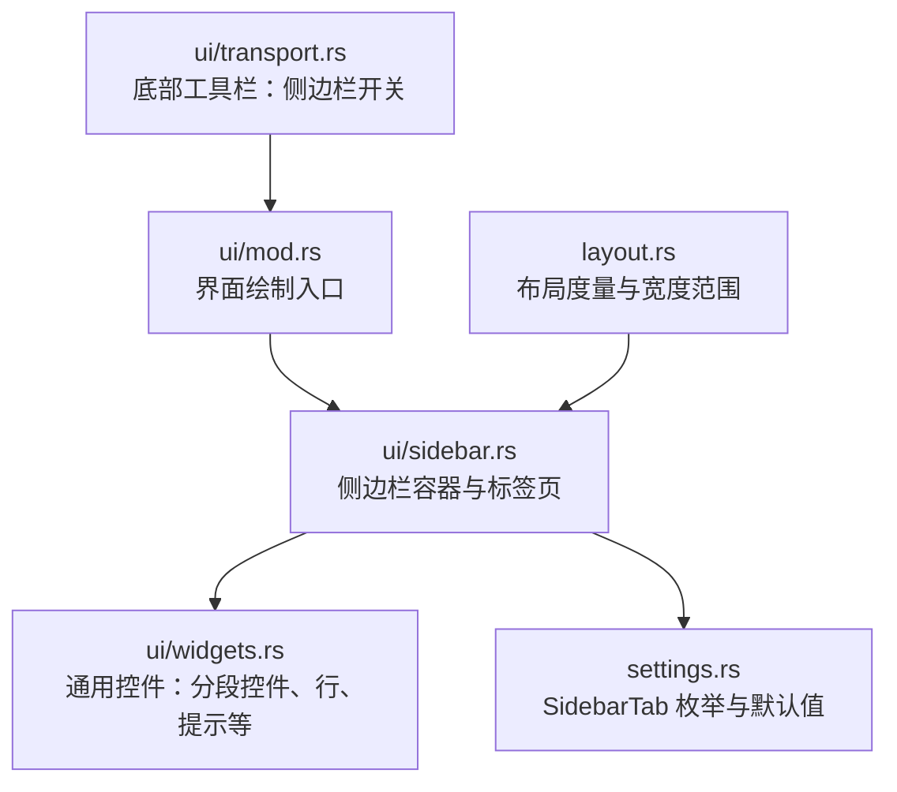
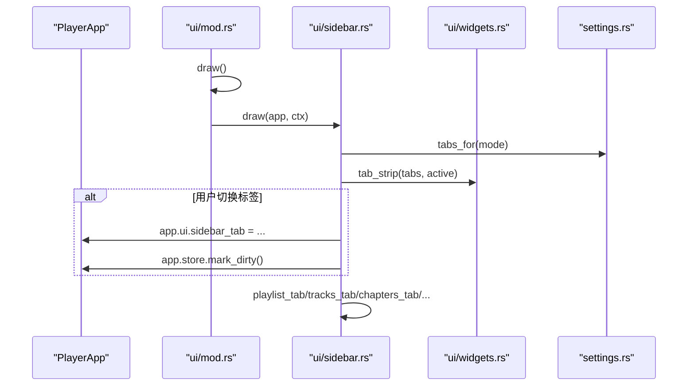
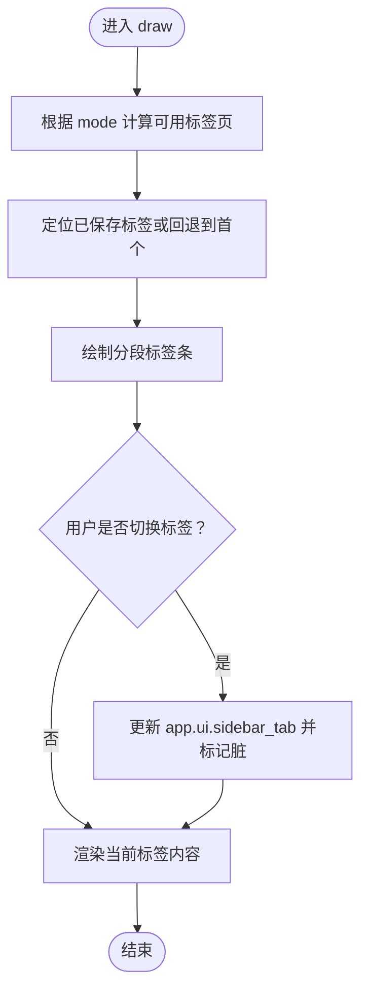
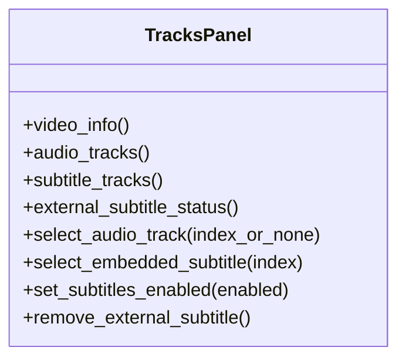
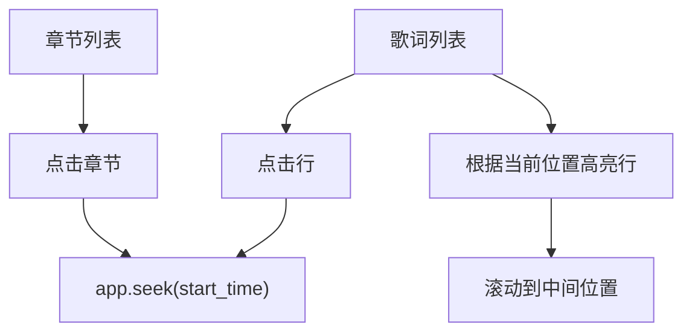
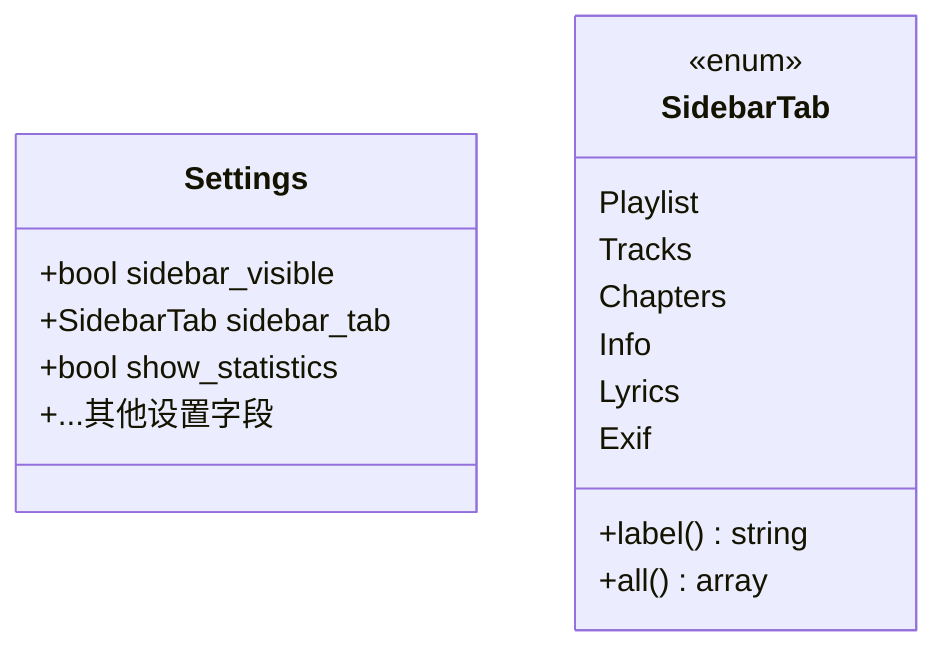
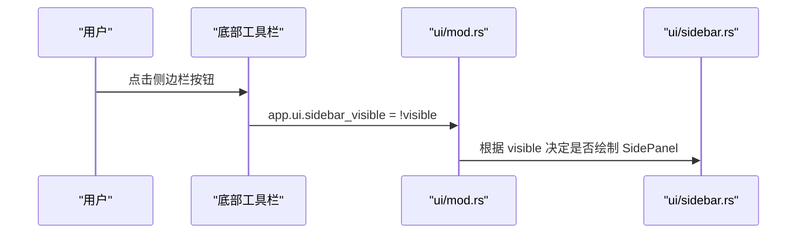
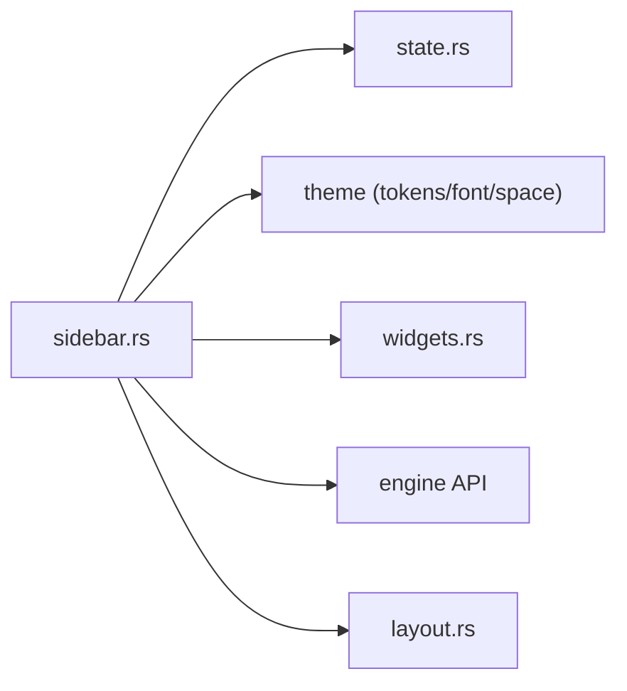
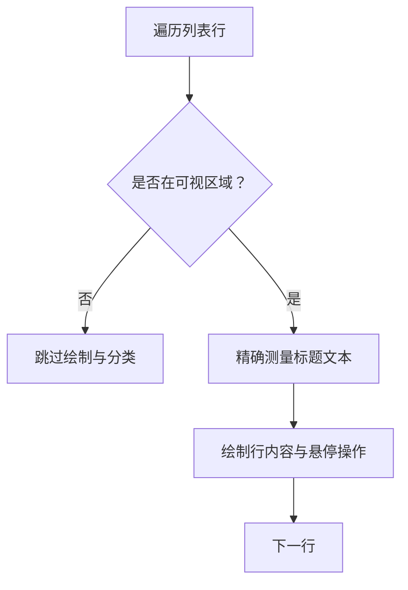

# 侧边栏组件

<cite>
**本文引用的文件**   
- [sidebar.rs](file://crates/mvp-player/src/ui/sidebar.rs)
- [widgets.rs](file://crates/mvp-player/src/ui/widgets.rs)
- [mod.rs](file://crates/mvp-player/src/ui/mod.rs)
- [transport.rs](file://crates/mvp-player/src/ui/transport.rs)
- [settings.rs](file://crates/mvp-player/src/settings.rs)
- [state.rs](file://crates/mvp-player/src/state.rs)
- [layout.rs](file://crates/mvp-player/src/layout.rs)
</cite>

## 目录
1. [引言](#引言)
2. [项目结构](#项目结构)
3. [核心组件](#核心组件)
4. [架构总览](#架构总览)
5. [详细组件分析](#详细组件分析)
6. [依赖关系分析](#依赖关系分析)
7. [性能与虚拟化](#性能与虚拟化)
8. [扩展指南](#扩展指南)
9. [故障排查](#故障排查)
10. [结论](#结论)

## 引言
本文件面向“侧边栏组件”的完整技术文档，覆盖以下目标：
- 文件列表功能：浏览、选择、批量操作、右键菜单、行内移动等。
- 轨道选择面板：视频轨道只读展示、音频轨道切换、字幕轨道动态切换与状态管理。
- 设置面板组织：侧边栏标签页定义、可见性与默认标签持久化。
- 折叠展开逻辑：侧边栏显示/隐藏控制、快捷键与工具栏按钮联动。
- 搜索过滤：当前实现说明与扩展建议。
- 列表虚拟化与性能优化：可视区域裁剪、文本测量优化、渲染帧调度。
- 扩展能力：自定义列表项、拖拽排序、右键菜单增强。

## 项目结构
侧边栏位于 UI 层，由统一的界面入口绘制，并通过共享控件库提供一致的视觉风格。

**图表来源**
- [mod.rs:49-144](file://crates/mvp-player/src/ui/mod.rs#L49-L144)
- [sidebar.rs:14-64](file://crates/mvp-player/src/ui/sidebar.rs#L14-L64)
- [widgets.rs:246-397](file://crates/mvp-player/src/ui/widgets.rs#L246-L397)
- [settings.rs:88-134](file://crates/mvp-player/src/settings.rs#L88-L134)
- [transport.rs:881-894](file://crates/mvp-player/src/ui/transport.rs#L881-L894)
- [layout.rs:436-444](file://crates/mvp-player/src/layout.rs#L436-L444)

**章节来源**
- [mod.rs:49-144](file://crates/mvp-player/src/ui/mod.rs#L49-L144)
- [sidebar.rs:14-64](file://crates/mvp-player/src/ui/sidebar.rs#L14-L64)

## 核心组件
- 侧边栏容器：负责右侧面板创建、尺寸范围、标签条、内容滚动区与按媒体模式动态显示页面。
- 播放列表页：文件添加、保存、清空、移除无效条目、行内操作（删除、上移、下移）、双击播放、右键菜单。
- 轨道页：视频轨道信息展示、音频轨道选择、字幕轨道选择与外部字幕管理。
- 章节页：章节跳转。
- 歌词页：以字幕形式滚动高亮并支持点击跳转。
- 图片信息与媒体信息页：EXIF 与媒体元数据展示。
- 通用控件：分段控件（标签条）、列表行、空提示、键值行等。

**章节来源**
- [sidebar.rs:14-64](file://crates/mvp-player/src/ui/sidebar.rs#L14-L64)
- [sidebar.rs:100-440](file://crates/mvp-player/src/ui/sidebar.rs#L100-L440)
- [sidebar.rs:446-596](file://crates/mvp-player/src/ui/sidebar.rs#L446-L596)
- [sidebar.rs:602-701](file://crates/mvp-player/src/ui/sidebar.rs#L602-L701)
- [sidebar.rs:709-773](file://crates/mvp-player/src/ui/sidebar.rs#L709-L773)
- [widgets.rs:246-397](file://crates/mvp-player/src/ui/widgets.rs#L246-L397)
- [widgets.rs:989-1020](file://crates/mvp-player/src/ui/widgets.rs#L989-L1020)

## 架构总览
侧边栏在每帧绘制流程中被调用，根据应用模式决定可用标签页；用户交互通过 PlayerApp 方法驱动引擎与状态变更。

**图表来源**
- [mod.rs:49-144](file://crates/mvp-player/src/ui/mod.rs#L49-L144)
- [sidebar.rs:14-64](file://crates/mvp-player/src/ui/sidebar.rs#L14-L64)
- [settings.rs:88-134](file://crates/mvp-player/src/settings.rs#L88-L134)
- [widgets.rs:383-397](file://crates/mvp-player/src/ui/widgets.rs#L383-L397)

## 详细组件分析

### 侧边栏容器与标签页
- 使用右侧面板，固定最小/最大宽度，可调整大小。
- 根据当前媒体模式（空、视频、音频、图片）动态计算可用标签页集合。
- 标签条采用分段控件样式，选中态动画平滑。
- 内容区为垂直滚动区域，按当前标签分发到对应子页面。

**图表来源**
- [sidebar.rs:14-64](file://crates/mvp-player/src/ui/sidebar.rs#L14-L64)
- [sidebar.rs:67-94](file://crates/mvp-player/src/ui/sidebar.rs#L67-L94)
- [widgets.rs:383-397](file://crates/mvp-player/src/ui/widgets.rs#L383-L397)

**章节来源**
- [sidebar.rs:14-64](file://crates/mvp-player/src/ui/sidebar.rs#L14-L64)
- [sidebar.rs:67-94](file://crates/mvp-player/src/ui/sidebar.rs#L67-L94)
- [widgets.rs:383-397](file://crates/mvp-player/src/ui/widgets.rs#L383-L397)

### 播放列表页：文件浏览、选择与批量操作
- 工具栏：添加文件、添加文件夹、添加网络地址、保存播放列表、清空列表、移除不存在文件。
- 列表项：索引/播放指示、标题、类型图标与时长；悬停显示行内操作（删除、上移、下移）。
- 交互：单击选择、双击播放、右键菜单（播放、在资源管理器中显示、从列表移除、清空列表）。
- 批量操作：清空列表、移除无效条目；移动后重置选择以避免错位。

```mermaid
flowchart TD
Toolbar["工具栏按钮"] --> AddFile["打开文件对话框"]
Toolbar --> AddFolder["打开文件夹对话框"]
Toolbar --> AddURL["打开 URL 输入弹窗"]
Toolbar --> SavePL["保存播放列表"]
Toolbar --> ClearPL["清空列表并停止播放"]
Toolbar --> Prune["移除无效条目并提示数量"]
ListRow["列表行"] --> Click["单击：选择"]
ListRow --> DblClick["双击：播放"]
ListRow --> HoverActions["悬停：删除/上移/下移"]
ListRow --> ContextMenu["右键：播放/显示/移除/清空"]
Actions["动作汇总"] --> Play["app.play_index(index)"]
Actions --> Select["app.ui.playlist_selection = Some(index)"]
Actions --> Remove["app.playlist.remove(index)"]
Actions --> Move["app.playlist.move_item(from,to)"]
Actions --> Clear["app.playlist.clear()"]
```

**图表来源**
- [sidebar.rs:100-440](file://crates/mvp-player/src/ui/sidebar.rs#L100-L440)

**章节来源**
- [sidebar.rs:100-440](file://crates/mvp-player/src/ui/sidebar.rs#L100-L440)

### 轨道选择面板：视频、音频、字幕轨
- 视频轨道：仅信息展示，不支持切换；若有多条视频流会提示始终使用第一条。
- 音频轨道：可选择具体音轨或关闭声音；选择后立即生效。
- 字幕轨道：可选择内嵌字幕或关闭字幕；若选择了内嵌字幕，会自动移除外部字幕；不可渲染的字幕禁用选择并标注。
- 外部字幕：当未选择内嵌字幕但加载了外部字幕时，显示状态并提供移除按钮。

**图表来源**
- [sidebar.rs:446-596](file://crates/mvp-player/src/ui/sidebar.rs#L446-L596)

**章节来源**
- [sidebar.rs:446-596](file://crates/mvp-player/src/ui/sidebar.rs#L446-L596)

### 章节页与歌词页
- 章节页：列出章节标题与起始时间，点击跳转到对应时间点。
- 歌词页：将当前字幕作为歌词滚动显示，自动滚动保持高亮行居中；点击任意行跳转到对应时间。

**图表来源**
- [sidebar.rs:602-701](file://crates/mvp-player/src/ui/sidebar.rs#L602-L701)

**章节来源**
- [sidebar.rs:602-701](file://crates/mvp-player/src/ui/sidebar.rs#L602-L701)

### 图片信息与媒体信息页
- 图片信息：文件名、路径、像素、EXIF 方向、动画帧数、格式信息等。
- 媒体信息：统一的信息行列表；可选显示性能统计（状态、时钟来源、解码/丢弃/跳过帧等）。

**章节来源**
- [sidebar.rs:709-773](file://crates/mvp-player/src/ui/sidebar.rs#L709-L773)

### 设置面板的组织结构与配置项管理
- 侧边栏标签页枚举：Playlist、Tracks、Chapters、Info、Lyrics、Exif。
- 默认值与持久化：sidebar_visible、sidebar_tab 等字段在设置结构中定义，并在修改后标记脏以落盘。
- 设置窗口：通过 widgets.row/switch_row/combo_row/slider_row 等控件组织不同分类的设置项。

**图表来源**
- [settings.rs:88-134](file://crates/mvp-player/src/settings.rs#L88-L134)
- [settings.rs:826-834](file://crates/mvp-player/src/settings.rs#L826-L834)

**章节来源**
- [settings.rs:88-134](file://crates/mvp-player/src/settings.rs#L88-L134)
- [settings.rs:826-834](file://crates/mvp-player/src/settings.rs#L826-L834)

### 侧边栏折叠展开逻辑
- 工具栏按钮：底部工具栏提供侧边栏开关，点击切换 app.ui.sidebar_visible。
- 快捷键：全局键盘处理中支持快捷键切换侧边栏可见性。
- 可见性影响：主绘制流程中根据可见性决定是否绘制侧边栏面板。

**图表来源**
- [transport.rs:881-894](file://crates/mvp-player/src/ui/transport.rs#L881-L894)
- [mod.rs:421-424](file://crates/mvp-player/src/ui/mod.rs#L421-L424)
- [mod.rs:485-488](file://crates/mvp-player/src/ui/mod.rs#L485-L488)

**章节来源**
- [transport.rs:881-894](file://crates/mvp-player/src/ui/transport.rs#L881-L894)
- [mod.rs:421-424](file://crates/mvp-player/src/ui/mod.rs#L421-L424)
- [mod.rs:485-488](file://crates/mvp-player/src/ui/mod.rs#L485-L488)

### 搜索过滤功能
- 当前实现：侧边栏未内置搜索框与过滤逻辑。
- 扩展建议：
  - 在播放列表页顶部增加搜索输入框，维护过滤后的索引映射。
  - 对标题、类型、时长进行模糊匹配，支持多关键词。
  - 过滤结果保持原顺序，避免频繁重排导致性能问题。
  - 结合现有行内虚拟化策略，仅在可视区域内渲染过滤结果。

[本节为概念性扩展建议，不直接分析具体文件]

## 依赖关系分析
侧边栏依赖多个模块：
- 应用状态与模式：Mode、Overlay、Toast、Settings。
- 主题与空间常量：Tokens、font、space。
- 通用控件：widgets（分段控件、列表行、空提示等）。
- 布局度量：Metrics（侧边栏宽度范围）。
- 引擎信息：engine.info()、engine.audio_track()、engine.subtitle_track() 等。

**图表来源**
- [sidebar.rs:1-12](file://crates/mvp-player/src/ui/sidebar.rs#L1-L12)
- [layout.rs:436-444](file://crates/mvp-player/src/layout.rs#L436-L444)

**章节来源**
- [sidebar.rs:1-12](file://crates/mvp-player/src/ui/sidebar.rs#L1-L12)
- [layout.rs:436-444](file://crates/mvp-player/src/layout.rs#L436-L444)

## 性能与虚拟化
- 可视区域裁剪：列表行在绘制前检查是否与 clip_rect 相交，不在屏幕内的行跳过复杂绘制与分类计算。
- 文本测量优化：使用精确的文本布局测量与省略号截断，避免错误估算 CJK 字符宽度导致的溢出。
- 渲染帧调度：根据媒体状态与窗口可见性动态请求重绘，避免后台无意义的高频刷新。
- 骨架屏与占位：轨道信息读取期间使用骨架行提升感知性能。

**图表来源**
- [sidebar.rs:213-224](file://crates/mvp-player/src/ui/sidebar.rs#L213-L224)
- [sidebar.rs:251-278](file://crates/mvp-player/src/ui/sidebar.rs#L251-L278)
- [mod.rs:228-283](file://crates/mvp-player/src/ui/mod.rs#L228-L283)
- [sidebar.rs:455-470](file://crates/mvp-player/src/ui/sidebar.rs#L455-L470)

**章节来源**
- [sidebar.rs:213-224](file://crates/mvp-player/src/ui/sidebar.rs#L213-L224)
- [sidebar.rs:251-278](file://crates/mvp-player/src/ui/sidebar.rs#L251-L278)
- [mod.rs:228-283](file://crates/mvp-player/src/ui/mod.rs#L228-L283)
- [sidebar.rs:455-470](file://crates/mvp-player/src/ui/sidebar.rs#L455-L470)

## 扩展指南

### 自定义列表项
- 复用 widgets.list_row 获取标准行背景、悬停与焦点行为。
- 使用 widgets.clipped_line 精确测量并截断长文本，确保对齐与省略号正确。
- 在行内绘制图标与副标题，参考播放列表行的类型图标与时长显示。

**章节来源**
- [widgets.rs:989-1008](file://crates/mvp-player/src/ui/widgets.rs#L989-L1008)
- [widgets.rs:220-244](file://crates/mvp-player/src/ui/widgets.rs#L220-L244)
- [sidebar.rs:226-320](file://crates/mvp-player/src/ui/sidebar.rs#L226-L320)

### 拖拽排序
- 当前播放列表通过行内箭头实现移动，未实现鼠标拖放排序。
- 扩展建议：
  - 引入 egui 的 drag-and-drop 机制，监听 drag 开始、拖动与释放事件。
  - 在释放时计算目标索引并调用 app.playlist.move_item。
  - 注意在拖动过程中保持选择状态稳定，避免索引偏移导致误操作。

**章节来源**
- [README.md:572-574](file://README.md#L572-L574)
- [sidebar.rs:345-371](file://crates/mvp-player/src/ui/sidebar.rs#L345-L371)

### 右键菜单增强
- 当前右键菜单支持播放、显示文件、移除、清空列表。
- 扩展建议：
  - 新增“复制路径”“添加到收藏夹”“查看属性”等选项。
  - 对网络串流与本地文件区分可用菜单项。
  - 使用 response.context_menu 扩展菜单内容，保持与现有交互一致。

**章节来源**
- [sidebar.rs:381-403](file://crates/mvp-player/src/ui/sidebar.rs#L381-L403)

## 故障排查
- 侧边栏未显示：检查工具栏按钮或快捷键是否正确切换 app.ui.sidebar_visible。
- 标签页异常：确认当前媒体模式与可用标签页匹配；持久化的标签可能不属于当前模式，应回退到首个可用标签。
- 轨道选择无效：确认引擎已返回媒体信息；视频轨道不支持切换，需使用音频/字幕轨道。
- 列表性能问题：检查是否存在大量行绘制；利用可视区域裁剪与文本测量优化减少开销。

**章节来源**
- [transport.rs:881-894](file://crates/mvp-player/src/ui/transport.rs#L881-L894)
- [sidebar.rs:39-50](file://crates/mvp-player/src/ui/sidebar.rs#L39-L50)
- [sidebar.rs:472-501](file://crates/mvp-player/src/ui/sidebar.rs#L472-L501)
- [sidebar.rs:213-224](file://crates/mvp-player/src/ui/sidebar.rs#L213-L224)

## 结论
侧边栏组件通过清晰的标签页划分与丰富的交互能力，提供了播放列表管理、轨道选择、章节导航、歌词滚动与信息展示等功能。其设计注重性能优化与用户体验，包括可视区域裁剪、精确文本测量、骨架屏与动态渲染调度。未来可在搜索过滤、拖拽排序与右键菜单方面进一步扩展，以满足更复杂的用户需求。