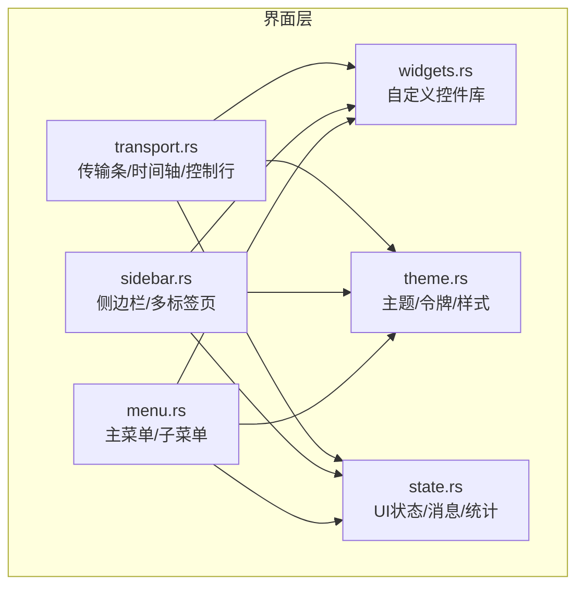
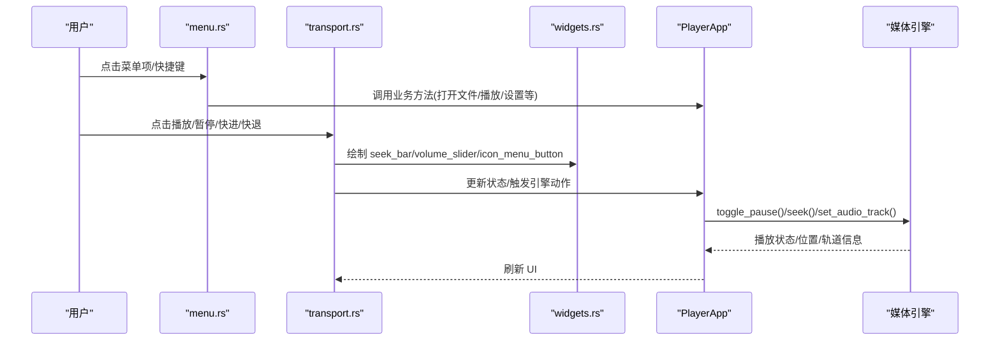
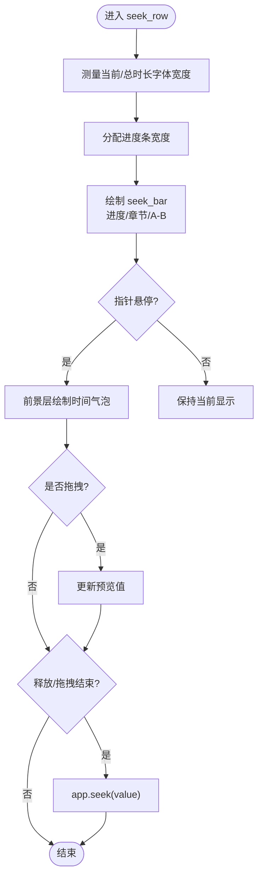
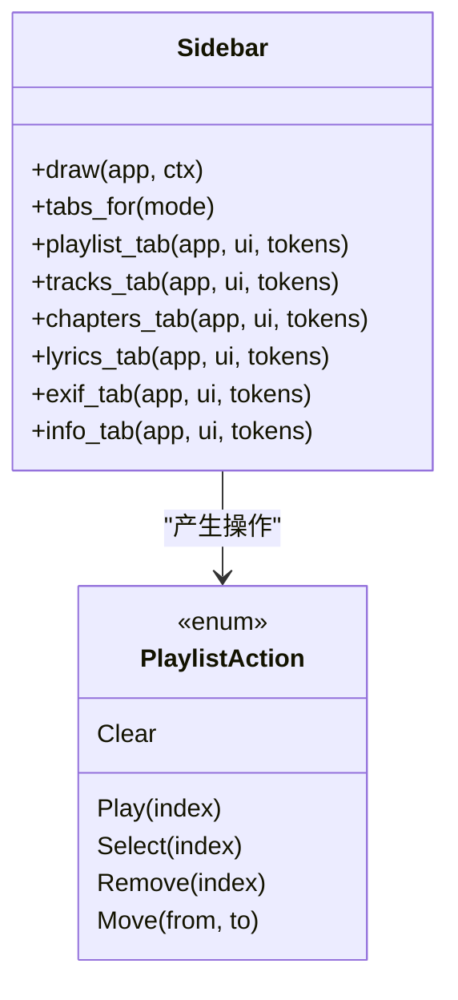
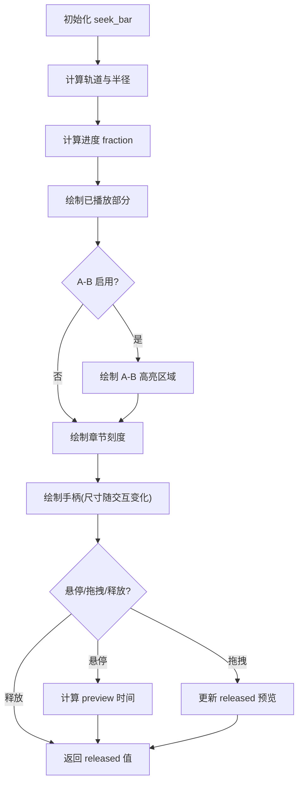
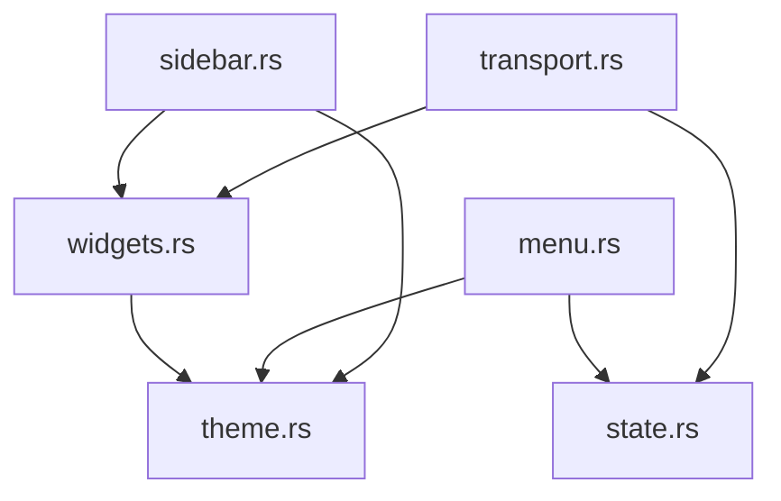

# 界面控件

<cite>
**本文引用的文件**   
- [transport.rs](file://crates/mvp-player/src/ui/transport.rs)
- [sidebar.rs](file://crates/mvp-player/src/ui/sidebar.rs)
- [menu.rs](file://crates/mvp-player/src/ui/menu.rs)
- [widgets.rs](file://crates/mvp-player/src/ui/widgets.rs)
- [theme.rs](file://crates/mvp-player/src/theme.rs)
- [state.rs](file://crates/mvp-player/src/state.rs)
</cite>

## 目录
1. [简介](#简介)
2. [项目结构](#项目结构)
3. [核心组件](#核心组件)
4. [架构总览](#架构总览)
5. [详细组件分析](#详细组件分析)
6. [依赖关系分析](#依赖关系分析)
7. [性能与体验特性](#性能与体验特性)
8. [故障排查指南](#故障排查指南)
9. [结论](#结论)
10. [附录：最佳实践清单](#附录最佳实践清单)

## 简介
本文件面向 MVP-Versatile-Player 的界面控件体系，聚焦以下目标：
- 自定义 UI 控件的设计模式与实现方式
- 传输控件（播放、暂停、停止、跳转）的实现逻辑与用户交互
- 侧边栏组件的功能边界：播放列表、轨道选择、章节、信息、歌词、EXIF
- 菜单系统的层级结构、快捷键绑定与上下文菜单
- 进度条、滑块、按钮等基础控件的样式定制与行为扩展
- 控件状态管理、事件处理与动画效果
- 控件复用、组合使用与主题适配的最佳实践

## 项目结构
界面层位于 mvp-player 的 ui 模块中，按职责拆分为：
- transport.rs：视频/音频传输条、时间轴、控制行、悬浮覆盖层
- sidebar.rs：右侧边栏（播放列表、轨道、章节、信息、歌词、EXIF）
- menu.rs：主菜单栏（文件/播放/视频/音频/字幕/工具/帮助）
- widgets.rs：通用自定义控件（进度条、滑块、按钮、开关、列表行、提示等）
- theme.rs：设计令牌、调色板、字体与间距、阴影与 egui 样式安装
- state.rs：瞬时 UI 状态（模式、叠加面板、Toast、帧历史、缩略图缓存等）

图表来源
- [transport.rs:1-1179](file://crates/mvp-player/src/ui/transport.rs#L1-L1179)
- [sidebar.rs:1-890](file://crates/mvp-player/src/ui/sidebar.rs#L1-L890)
- [menu.rs:1-805](file://crates/mvp-player/src/ui/menu.rs#L1-L805)
- [widgets.rs:1-2019](file://crates/mvp-player/src/ui/widgets.rs#L1-L2019)
- [theme.rs:1-1666](file://crates/mvp-player/src/theme.rs#L1-L1666)
- [state.rs:1-919](file://crates/mvp-player/src/state.rs#L1-L919)

章节来源
- [transport.rs:1-1179](file://crates/mvp-player/src/ui/transport.rs#L1-L1179)
- [sidebar.rs:1-890](file://crates/mvp-player/src/ui/sidebar.rs#L1-L890)
- [menu.rs:1-805](file://crates/mvp-player/src/ui/menu.rs#L1-L805)
- [widgets.rs:1-2019](file://crates/mvp-player/src/ui/widgets.rs#L1-L2019)
- [theme.rs:1-1666](file://crates/mvp-player/src/theme.rs#L1-L1666)
- [state.rs:1-919](file://crates/mvp-player/src/state.rs#L1-L919)

## 核心组件
- 传输控件
  - 视频传输条：固定高度面板，包含时间轴与视频控制行；全屏时提供悬浮覆盖层。
  - 音频传输条：更宽音量滑块、速度菜单、输出设备选择、歌词开关等。
  - 时间轴：可预览、支持章节标记、A-B 循环高亮、拖拽释放后统一 seek。
- 侧边栏
  - 多标签页：根据当前模式动态显示（播放列表、轨道、章节、信息、歌词、EXIF）。
  - 播放列表：增删改查、右键上下文菜单、悬停快捷操作、滚动优化。
  - 轨道选择：视频轨道只读展示，音频/字幕轨道可选择切换。
- 菜单系统
  - 主菜单：文件/播放/视频/音频/字幕/工具/帮助，含大量快捷键。
  - 子菜单：播放速度、循环模式、画面比例、字幕延迟等。
  - 上下文菜单：播放列表项右键操作。
- 基础控件
  - 进度条 seek_bar：预览、章节刻度、A-B 区域、手柄尺寸随交互变化。
  - 滑块 slider/volume_slider：键盘步进、悬停加粗、白色圆点手柄。
  - 按钮 pill_button/primary_button/secondary_button：主/次角色、按压缩放、焦点环。
  - 开关 switch：平滑过渡动画、键盘支持。
  - 分段控件 segmented/tab_strip：胶囊式选中态与滑动动画。
  - 列表行 list_row：选中/悬停填充、裁剪标题、图标与副标题。
- 主题与样式
  - Tokens：背景、面板、卡片、强调色、文本、分隔线、进度、轨道等。
  - Palette：默认蓝与四种莫兰迪配色，仅改变颜色不改变布局。
  - Theme.install：安装 egui Visuals、字体栈、间距、滚动条、动画时长等。

章节来源
- [transport.rs:23-111](file://crates/mvp-player/src/ui/transport.rs#L23-L111)
- [sidebar.rs:14-84](file://crates/mvp-player/src/ui/sidebar.rs#L14-L84)
- [menu.rs:27-126](file://crates/mvp-player/src/ui/menu.rs#L27-L126)
- [widgets.rs:20-43](file://crates/mvp-player/src/ui/widgets.rs#L20-L43)
- [widgets.rs:246-397](file://crates/mvp-player/src/ui/widgets.rs#L246-L397)
- [widgets.rs:569-661](file://crates/mvp-player/src/ui/widgets.rs#L569-L661)
- [widgets.rs:749-915](file://crates/mvp-player/src/ui/widgets.rs#L749-L915)
- [widgets.rs:1082-1179](file://crates/mvp-player/src/ui/widgets.rs#L1082-L1179)
- [theme.rs:178-241](file://crates/mvp-player/src/theme.rs#L178-L241)
- [theme.rs:588-731](file://crates/mvp-player/src/theme.rs#L588-L731)

## 架构总览
界面层以“视图函数 + 共享控件”的方式组织：
- transport.rs 负责绘制传输条与覆盖层，调用 widgets 中的 seek_bar、volume_slider、icon_menu_button 等。
- sidebar.rs 根据 Mode 决定可用标签页，渲染播放列表、轨道、章节、信息、歌词、EXIF。
- menu.rs 构建主菜单与子菜单，暴露快捷键并驱动 PlayerApp 的行为。
- widgets.rs 提供跨面板复用的自定义控件，所有视觉细节由 painter 绘制以保证一致性。
- theme.rs 提供 Tokens 与 Theme.install，贯穿所有控件的颜色、字体、间距与动画。
- state.rs 维护瞬时 UI 状态，如 seek_hold、seek_drag、toast、fullscreen、overlay 等。

图表来源
- [menu.rs:128-167](file://crates/mvp-player/src/ui/menu.rs#L128-L167)
- [transport.rs:603-897](file://crates/mvp-player/src/ui/transport.rs#L603-L897)
- [widgets.rs:749-915](file://crates/mvp-player/src/ui/widgets.rs#L749-L915)
- [state.rs:449-576](file://crates/mvp-player/src/state.rs#L449-L576)

## 详细组件分析

### 传输控件（播放、暂停、停止、跳转）
- 视频传输条
  - draw_video：底部固定高度面板，包含 seek_row 与 video_button_row。
  - draw_video_overlay：全屏悬浮覆盖层，宽度自适应屏幕，层级为 Middle，避免遮挡设置窗口与对话框。
- 音频传输条
  - draw_audio/draw_audio_overlay：更宽音量滑块、速度菜单、输出设备选择、歌词开关、A-B 循环、随机/循环模式。
- 时间轴 seek_row
  - 计算当前时间与总时长，测量字体宽度以决定是否显示总时长。
  - 使用 widgets::seek_bar 绘制进度条，支持章节标记与 A-B 循环高亮。
  - hover 预览：在前景层绘制气泡，显示章节名与时间。
  - 拖拽预览与释放 seek：drag 期间仅预览，release 或 drag_stopped 时执行 seek。
  - shown_position：优先显示用户请求的位置，直到引擎时钟收敛或超时。
- 控制行
  - video_button_row：上一项、后退、播放/暂停/重播、前进、下一项、静音、音量滑块、百分比、速度菜单、全屏、设置、截图、循环/随机、字幕/轨道/画面/A-B/侧边栏。
  - audio_button_row：上一曲、后退 10 秒、播放/暂停/重播、前进 10 秒、下一曲、静音、音量滑块、速度菜单、全屏、设置、播放队列、歌词/字幕、输出设备、A-B 循环、随机、循环模式。
- 子菜单
  - speed_menu：预设速度选项与恢复 1x。
  - device_menu：系统默认与具体输出设备，切换需重启生效。
  - track_menu：音效增强入口、音频轨道选择、关闭声音。
  - subtitle_menu：关闭字幕、内嵌字幕选择、加载外部字幕、移除外部字幕、字幕延迟与样式。
  - pan_scan_menu：画面调节、画面比例、旋转、翻转。

图表来源
- [transport.rs:412-565](file://crates/mvp-player/src/ui/transport.rs#L412-L565)
- [widgets.rs:749-915](file://crates/mvp-player/src/ui/widgets.rs#L749-L915)

章节来源
- [transport.rs:23-111](file://crates/mvp-player/src/ui/transport.rs#L23-L111)
- [transport.rs:412-565](file://crates/mvp-player/src/ui/transport.rs#L412-L565)
- [transport.rs:603-897](file://crates/mvp-player/src/ui/transport.rs#L603-L897)
- [transport.rs:904-1118](file://crates/mvp-player/src/ui/transport.rs#L904-L1118)
- [widgets.rs:749-915](file://crates/mvp-player/src/ui/widgets.rs#L749-L915)

### 侧边栏组件（播放列表、轨道、章节、信息、歌词、EXIF）
- 标签页选择
  - tabs_for：根据 Mode 返回可用标签页（Empty/Video/Audio/Image）。
  - tab_label：音频模式下“播放列表”标签文案特殊化。
- 播放列表 playlist_tab
  - 工具栏：添加文件/文件夹/网络地址、保存/清空、移除不存在条目。
  - 列表项：索引/播放指示、标题裁剪、类型图标与时长、悬停操作（移除/上移/下移）、双击播放、单击选择、右键上下文菜单。
  - 性能：离屏行跳过绘制与交互，标题精确测量与省略号。
- 轨道 tracks_tab
  - 视频轨道：只读展示，始终使用第一条。
  - 音频轨道：可选择不同音轨或关闭声音。
  - 字幕轨道：可选择内嵌字幕或关闭字幕，支持外部字幕加载/移除。
- 章节 chapters_tab
  - 列出章节标题与开始时间，点击跳转到对应时间点。
- 歌词 lyrics_tab
  - 将字幕作为歌词滚动显示，当前行高亮并自动居中滚动，点击行跳转。
- EXIF exif_tab
  - 图片基本信息、格式信息、像素数、方向、动画帧数等。
- 信息 info_tab
  - 媒体信息与性能统计（解码/丢弃/呈现帧率、音视频缓冲、渲染耗时等）。

图表来源
- [sidebar.rs:14-84](file://crates/mvp-player/src/ui/sidebar.rs#L14-L84)
- [sidebar.rs:100-440](file://crates/mvp-player/src/ui/sidebar.rs#L100-L440)
- [sidebar.rs:446-596](file://crates/mvp-player/src/ui/sidebar.rs#L446-L596)
- [sidebar.rs:602-701](file://crates/mvp-player/src/ui/sidebar.rs#L602-L701)
- [sidebar.rs:709-753](file://crates/mvp-player/src/ui/sidebar.rs#L709-L753)
- [sidebar.rs:759-890](file://crates/mvp-player/src/ui/sidebar.rs#L759-L890)

章节来源
- [sidebar.rs:14-84](file://crates/mvp-player/src/ui/sidebar.rs#L14-L84)
- [sidebar.rs:100-440](file://crates/mvp-player/src/ui/sidebar.rs#L100-L440)
- [sidebar.rs:446-596](file://crates/mvp-player/src/ui/sidebar.rs#L446-L596)
- [sidebar.rs:602-701](file://crates/mvp-player/src/ui/sidebar.rs#L602-L701)
- [sidebar.rs:709-753](file://crates/mvp-player/src/ui/sidebar.rs#L709-L753)
- [sidebar.rs:759-890](file://crates/mvp-player/src/ui/sidebar.rs#L759-L890)

### 菜单系统（层级结构、快捷键、上下文菜单）
- 主菜单
  - 文件：打开文件/文件夹/网络串流、加载字幕、保存播放列表、最近打开、截图、退出。
  - 播放：播放/暂停/重播/停止、上一项/下一项、快退/快进、逐帧、速度/循环/随机、A-B 循环。
  - 视频：画面比例、画面调节、旋转、水平/垂直翻转、缩放/平移、幻灯片、硬件解码、全屏、置顶。
  - 音频：音轨选择、音量增减/静音、音频延迟、音效增强、音频输出设置。
  - 字幕：关闭/内嵌字幕选择、加载外部字幕、移除外部字幕、字幕延迟与样式。
  - 工具：侧边栏开关/标签页、性能统计、设置、文件关联、播放结束行为、重置设置。
  - 帮助：快捷键、关于、打开设置文件夹、查看日志、项目主页。
- 快捷键
  - 空格：播放/暂停/重播
  - P/N：上一项/下一项
  - ←/→：快退/快进（Shift+←/→ 大步进）
  - F：全屏
  - G：加载字幕
  - B：A-B 循环
  - Ctrl+O/U/L/+,W 等
- 上下文菜单
  - 播放列表项右键：播放、在资源管理器中显示、从列表移除、清空列表。

```mermaid
graph LR
File["文件"] --> OpenFile["打开文件"]
File --> OpenFolder["打开文件夹"]
File --> OpenURL["打开网络串流"]
File --> LoadSub["加载字幕"]
File --> SavePL["保存播放列表"]
File --> Recent["最近打开"]
File --> Snapshot["截图并保存"]
File --> Exit["退出"]
Playback["播放"] --> Toggle["播放/暂停/重播"]
Playback --> PrevNext["上一项/下一项"]
Playback --> Seek["快退/快进/逐帧"]
Playback --> Speed["播放速度"]
Playback --> Loop["循环模式/随机"]
Playback --> AB["A-B 循环"]
Video["视频"] --> Aspect["画面比例"]
Video --> Panel["画面调节"]
Video --> Rotate["旋转/翻转"]
Video --> Zoom["缩放/平移"]
Video --> Slideshow["幻灯片"]
Video --> HW["硬件解码"]
Video --> Fullscreen["全屏/置顶"]
Audio["音频"] --> Tracks["音轨选择"]
Audio --> Volume["音量/静音"]
Audio --> Delay["音频延迟"]
Audio --> Enhance["音效增强"]
Subtitle["字幕"] --> Enable["开启/关闭"]
Subtitle --> Embedded["内嵌字幕"]
Subtitle --> External["外部字幕"]
Subtitle --> Style["延迟与样式"]
Tools["工具"] --> Sidebar["侧边栏/标签页"]
Tools --> Stats["性能统计"]
Tools --> Settings["设置"]
Tools --> Assoc["文件关联"]
Tools --> EndAction["播放结束行为"]
Tools --> Reset["重置设置"]
Help["帮助"] --> Shortcuts["快捷键"]
Help --> About["关于"]
Help --> ConfigDir["打开设置文件夹"]
Help --> Log["查看运行日志"]
Help --> Website["项目主页"]
```

图表来源
- [menu.rs:128-167](file://crates/mvp-player/src/ui/menu.rs#L128-L167)
- [menu.rs:210-327](file://crates/mvp-player/src/ui/menu.rs#L210-L327)
- [menu.rs:329-426](file://crates/mvp-player/src/ui/menu.rs#L329-L426)
- [menu.rs:428-524](file://crates/mvp-player/src/ui/menu.rs#L428-L524)
- [menu.rs:526-598](file://crates/mvp-player/src/ui/menu.rs#L526-L598)
- [menu.rs:600-669](file://crates/mvp-player/src/ui/menu.rs#L600-L669)
- [menu.rs:671-699](file://crates/mvp-player/src/ui/menu.rs#L671-L699)

章节来源
- [menu.rs:27-126](file://crates/mvp-player/src/ui/menu.rs#L27-L126)
- [menu.rs:128-167](file://crates/mvp-player/src/ui/menu.rs#L128-L167)
- [menu.rs:210-327](file://crates/mvp-player/src/ui/menu.rs#L210-L327)
- [menu.rs:329-426](file://crates/mvp-player/src/ui/menu.rs#L329-L426)
- [menu.rs:428-524](file://crates/mvp-player/src/ui/menu.rs#L428-L524)
- [menu.rs:526-598](file://crates/mvp-player/src/ui/menu.rs#L526-L598)
- [menu.rs:600-669](file://crates/mvp-player/src/ui/menu.rs#L600-L669)
- [menu.rs:671-699](file://crates/mvp-player/src/ui/menu.rs#L671-L699)

### 基础控件（进度条、滑块、按钮、开关、分段控件）
- 进度条 seek_bar
  - 输入：position、duration、dragging、marks、ab_loop。
  - 输出：preview（悬停时间）、released（释放时间）、response。
  - 特性：章节刻度、A-B 区域高亮、手柄尺寸随交互变化、悬停/拖拽光标。
- 滑块 slider/volume_slider
  - 键盘步进：方向键按范围百分比步进。
  - 视觉：轨道悬停加粗、白色圆点手柄、黑色描边确保可见性。
  - 返回值：仅在值变化时返回 Some(new)。
- 按钮 pill_button/primary_button/secondary_button
  - 主/次角色：主按钮使用强调色填充，次按钮使用半透明背景。
  - 交互：按压缩小、悬停/按下渐变、焦点环、键盘 Enter/Space。
- 开关 switch
  - 动画：滑杆位置基于 animate_bool_with_time 平滑过渡。
  - 键盘：Space/Enter 切换。
- 分段控件 segmented/tab_strip
  - 胶囊式选中态，带滑动动画，窄屏自动缩放。
- 列表行 list_row
  - 选中/悬停填充、裁剪标题、图标与副标题、点击/双击/右键。

图表来源
- [widgets.rs:749-915](file://crates/mvp-player/src/ui/widgets.rs#L749-L915)
- [widgets.rs:569-661](file://crates/mvp-player/src/ui/widgets.rs#L569-L661)
- [widgets.rs:1082-1179](file://crates/mvp-player/src/ui/widgets.rs#L1082-L1179)
- [widgets.rs:246-397](file://crates/mvp-player/src/ui/widgets.rs#L246-L397)
- [widgets.rs:989-1008](file://crates/mvp-player/src/ui/widgets.rs#L989-L1008)

章节来源
- [widgets.rs:749-915](file://crates/mvp-player/src/ui/widgets.rs#L749-L915)
- [widgets.rs:569-661](file://crates/mvp-player/src/ui/widgets.rs#L569-L661)
- [widgets.rs:1082-1179](file://crates/mvp-player/src/ui/widgets.rs#L1082-L1179)
- [widgets.rs:246-397](file://crates/mvp-player/src/ui/widgets.rs#L246-L397)
- [widgets.rs:989-1008](file://crates/mvp-player/src/ui/widgets.rs#L989-L1008)

## 依赖关系分析
- 组件耦合
  - transport.rs 依赖 widgets.rs 的基础控件与 icons 图标，依赖 state.rs 的 UiState 与 mode。
  - sidebar.rs 依赖 widgets.rs 的通用控件与 theme.rs 的 Tokens。
  - menu.rs 依赖 settings 与 state 枚举，驱动 PlayerApp 的业务方法。
- 外部依赖
  - egui：面板、菜单、弹出层、绘图、字体、动画。
  - mvp_core：播放状态、媒体类型、工具函数（格式化时间、分类）。
  - mvp_platform：系统能力（文件关联、资源管理器、URL 打开）。
- 潜在循环依赖
  - ui 模块内部通过函数拆分避免循环；状态与主题被多处引用但无直接循环。

图表来源
- [transport.rs:1-1179](file://crates/mvp-player/src/ui/transport.rs#L1-L1179)
- [sidebar.rs:1-890](file://crates/mvp-player/src/ui/sidebar.rs#L1-L890)
- [menu.rs:1-805](file://crates/mvp-player/src/ui/menu.rs#L1-L805)
- [widgets.rs:1-2019](file://crates/mvp-player/src/ui/widgets.rs#L1-L2019)
- [theme.rs:1-1666](file://crates/mvp-player/src/theme.rs#L1-L1666)
- [state.rs:1-919](file://crates/mvp-player/src/state.rs#L1-L919)

章节来源
- [transport.rs:1-1179](file://crates/mvp-player/src/ui/transport.rs#L1-L1179)
- [sidebar.rs:1-890](file://crates/mvp-player/src/ui/sidebar.rs#L1-L890)
- [menu.rs:1-805](file://crates/mvp-player/src/ui/menu.rs#L1-L805)
- [widgets.rs:1-2019](file://crates/mvp-player/src/ui/widgets.rs#L1-L2019)
- [theme.rs:1-1666](file://crates/mvp-player/src/theme.rs#L1-L1666)
- [state.rs:1-919](file://crates/mvp-player/src/state.rs#L1-L919)

## 性能与体验特性
- 进度条与时间轴
  - seek_row 先测量字体宽度再决定布局，避免溢出。
  - hover 预览使用前景层 painter，避免被面板裁剪。
  - drag 期间仅预览，release 或 drag_stopped 才执行 seek，减少频繁磁盘 I/O。
  - shown_position 使用 seek_hold 与 SEEK_SETTLED/SEEK_HOLD_LIMIT 保证拖动与异步 seek 的一致性。
- 播放列表
  - 离屏行跳过绘制与交互，显著降低长列表开销。
  - 标题精确测量与省略号，CJK 友好。
- 缩略图与帧历史
  - ThumbCache 后台线程解码缩略图，限制缓存大小与数量。
  - FrameHistory 有界环形缓冲，限制帧数与字节预算，支持回退一帧。
- 主题与动画
  - Theme.install 设置 egui Visuals、字体栈、滚动条、动画时长（0.14s）。
  - 控件动画使用 animate_bool_with_time，避免突兀状态切换。
- 全屏与覆盖层
  - 悬浮传输条使用 Area 与 Order::Middle，避免遮挡设置窗口与对话框。
  - scrim 渐变确保控制面板可读性。

章节来源
- [transport.rs:412-565](file://crates/mvp-player/src/ui/transport.rs#L412-L565)
- [transport.rs:578-592](file://crates/mvp-player/src/ui/transport.rs#L578-L592)
- [sidebar.rs:213-224](file://crates/mvp-player/src/ui/sidebar.rs#L213-L224)
- [state.rs:335-438](file://crates/mvp-player/src/state.rs#L335-L438)
- [state.rs:237-333](file://crates/mvp-player/src/state.rs#L237-L333)
- [theme.rs:614-731](file://crates/mvp-player/src/theme.rs#L614-L731)
- [widgets.rs:1251-1284](file://crates/mvp-player/src/ui/widgets.rs#L1251-L1284)

## 故障排查指南
- 进度条点击无效或跳动
  - 检查 seek_hold 与 shown_position 逻辑，确认异步 seek 收敛条件 SEEK_SETTLED 与超时 SEEK_HOLD_LIMIT。
  - 确认 drag 期间仅预览，release 后才执行 seek。
- 播放列表卡顿
  - 确认离屏行跳过绘制与交互，标题精确测量与省略号。
- 菜单无法展开或嵌套菜单不可达
  - 使用 SubMenuButton 而非 MenuButton 作为嵌套菜单，避免父菜单立即关闭。
- 主题不一致或文字不可见
  - 检查 Theme.install 是否正确安装 Visuals 与字体栈，确认 Tokens 使用一致。
- 全屏覆盖层遮挡设置窗口
  - 确认悬浮传输条使用 Order::Middle，避免 Foreground 层。

章节来源
- [transport.rs:578-592](file://crates/mvp-player/src/ui/transport.rs#L578-L592)
- [sidebar.rs:213-224](file://crates/mvp-player/src/ui/sidebar.rs#L213-L224)
- [menu.rs:1-16](file://crates/mvp-player/src/ui/menu.rs#L1-L16)
- [theme.rs:614-731](file://crates/mvp-player/src/theme.rs#L614-L731)
- [transport.rs:40-70](file://crates/mvp-player/src/ui/transport.rs#L40-L70)

## 结论
MVP-Versatile-Player 的界面控件体系以“视图函数 + 共享控件 + 主题令牌”为核心，实现了：
- 一致的视觉语言与交互体验
- 高性能的列表与进度条交互
- 灵活的菜单与快捷键体系
- 可扩展的主题与控件定制
建议在实际开发中遵循本文的最佳实践，确保控件复用、状态管理与主题适配的一致性。

## 附录：最佳实践清单
- 控件复用
  - 使用 widgets.rs 中的 seek_bar、slider、pill_button、switch、segmented、list_row 等通用控件。
  - 避免重复绘制，统一使用 painter 与 Tokens。
- 组合使用
  - transport.rs 组合 seek_row 与 control row，sidebar.rs 组合多个标签页。
  - menu.rs 组合主菜单与子菜单，暴露快捷键。
- 主题适配
  - 使用 Theme.install 安装 egui 样式，Tokens 提供颜色与几何常量。
  - Palette 仅改变颜色，不改变布局。
- 状态管理
  - 使用 state.rs 的 UiState 管理瞬时状态，如 seek_hold、seek_drag、toast、overlay。
  - 区分持久设置与非持久状态。
- 事件处理
  - 区分 click/hover/drag/release，合理处理键盘输入（Space/Enter/方向键）。
  - 使用 animate_bool_with_time 实现平滑动画。
- 性能优化
  - 离屏行跳过绘制与交互。
  - 后台线程处理缩略图解码。
  - 进度条拖拽期间仅预览，释放后 seek。
- 无障碍与可访问性
  - 提供焦点环与键盘导航。
  - 使用语义化控件（Checkbox/Button/Slider）提升辅助技术兼容性。