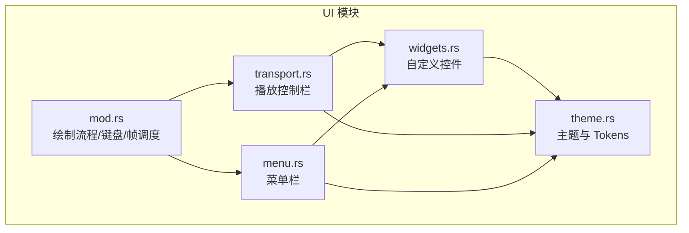
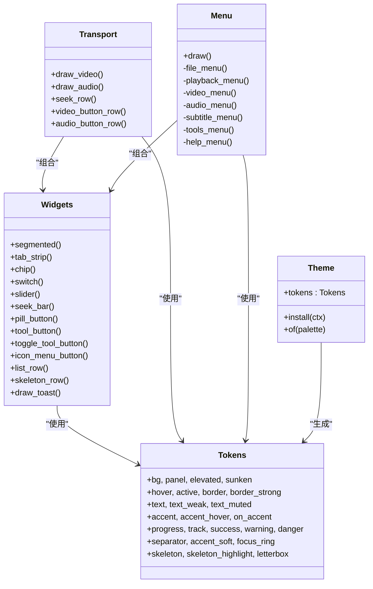
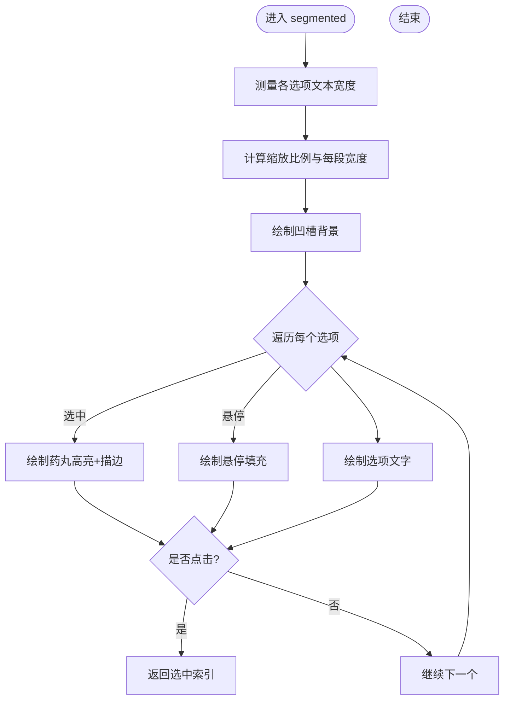
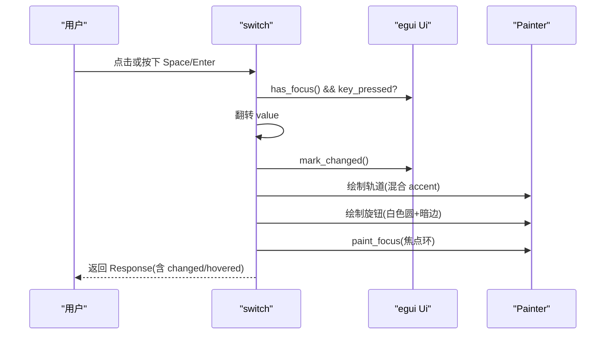
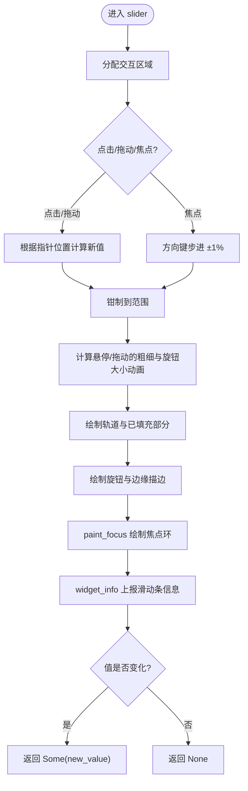
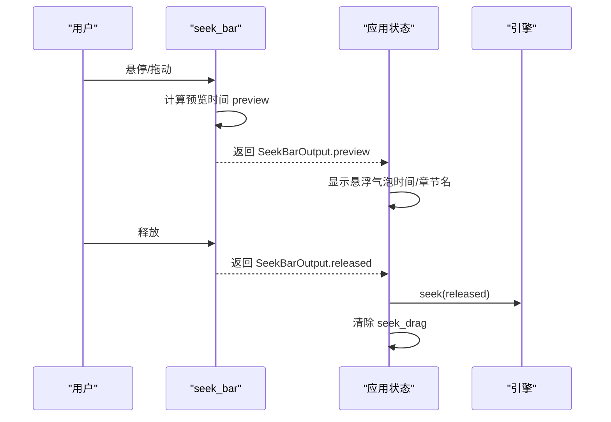
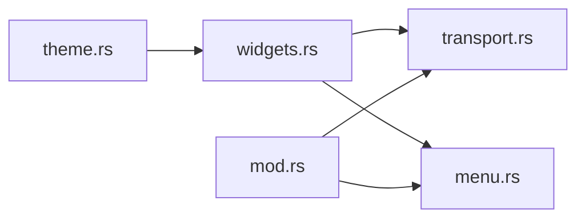
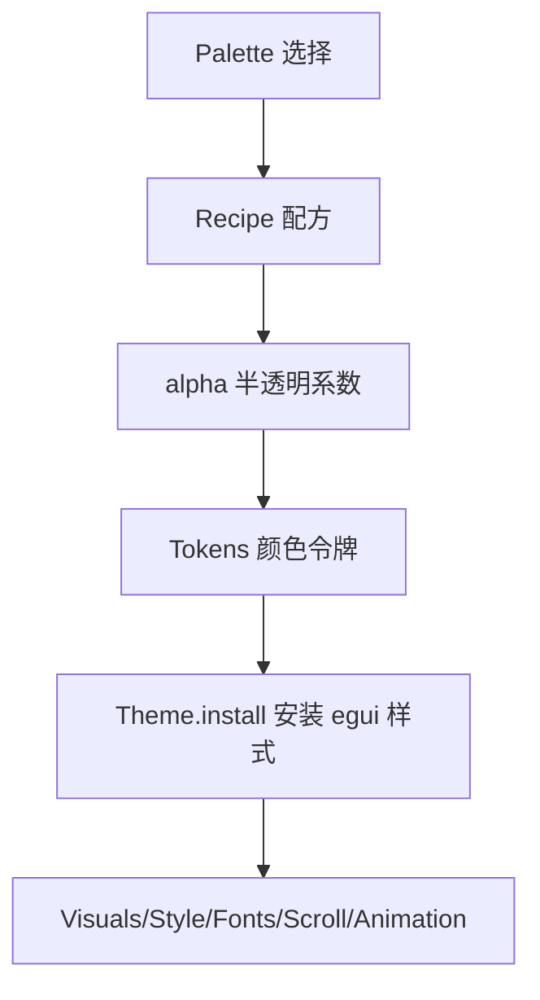
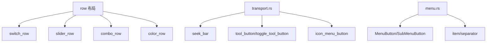

# 自定义控件

<cite>
**本文引用的文件**   
- [widgets.rs](file://crates/mvp-player/src/ui/widgets.rs)
- [theme.rs](file://crates/mvp-player/src/theme.rs)
- [mod.rs](file://crates/mvp-player/src/ui/mod.rs)
- [transport.rs](file://crates/mvp-player/src/ui/transport.rs)
- [menu.rs](file://crates/mvp-player/src/ui/menu.rs)
</cite>

## 目录
1. [引言](#引言)
2. [项目结构](#项目结构)
3. [核心组件](#核心组件)
4. [架构总览](#架构总览)
5. [详细组件分析](#详细组件分析)
6. [依赖关系分析](#依赖关系分析)
7. [性能与动画特性](#性能与动画特性)
8. [可访问性与键盘导航](#可访问性与键盘导航)
9. [主题与样式定制系统](#主题与样式定制系统)
10. [组合复用模式](#组合复用模式)
11. [故障排查指南](#故障排查指南)
12. [结论](#结论)

## 引言
本文件面向 MVP-Versatile-Player 的自定义控件体系，系统性说明分段控制器、标签页、胶囊标签、开关控件、滑块、进度条等基础控件的实现方式；解释主题与样式定制机制；梳理状态管理、事件处理与动画实现；总结可复用设计模式与组合用法；并给出可访问性支持、键盘导航与屏幕阅读器兼容的实践建议。文档同时提供代码级图示与“章节来源”定位，便于读者在仓库中快速定位实现细节。

## 项目结构
UI 层位于 crates/mvp-player/src/ui，其中：
- widgets.rs 集中实现了跨面板复用的自定义控件与通用绘制逻辑。
- theme.rs 定义主题调色板、Tokens 颜色令牌、间距与圆角规范，以及 egui 全局样式安装。
- transport.rs 负责播放控制栏（时间轴、播放按钮、音量、速度等）。
- menu.rs 负责主菜单栏与菜单项交互。
- mod.rs 负责界面绘制流程、帧调度、键盘快捷键与错误横幅等。

**图表来源**
- [widgets.rs:1-20](file://crates/mvp-player/src/ui/widgets.rs#L1-L20)
- [theme.rs:1-40](file://crates/mvp-player/src/theme.rs#L1-L40)
- [transport.rs:1-20](file://crates/mvp-player/src/ui/transport.rs#L1-L20)
- [menu.rs:1-20](file://crates/mvp-player/src/ui/menu.rs#L1-L20)
- [mod.rs:1-20](file://crates/mvp-player/src/ui/mod.rs#L1-L20)

**章节来源**
- [mod.rs:1-50](file://crates/mvp-player/src/ui/mod.rs#L1-L50)
- [widgets.rs:1-20](file://crates/mvp-player/src/ui/widgets.rs#L1-L20)
- [theme.rs:1-40](file://crates/mvp-player/src/theme.rs#L1-L40)

## 核心组件
本节聚焦以下自定义控件与相关能力：
- 分段控制器 segmented / 标签页 tab_strip
- 胶囊标签 chip
- 开关 switch / 开关行 switch_row
- 滑块 slider / 滑块行 slider_row / 音量滑块 volume_slider
- 进度条 seek_bar
- 按钮 pill_button / primary_button / secondary_button
- 工具图标按钮 tool_button / toggle_tool_button / icon_menu_button
- 列表行 list_row / 骨架行 skeleton_row / 提示 empty_hint
- Toast 消息 draw_toast

这些控件统一通过 painter 绘制，以 Tokens 驱动视觉风格，并通过 egui 的 Response、WidgetInfo 暴露交互语义。

**章节来源**
- [widgets.rs:246-397](file://crates/mvp-player/src/ui/widgets.rs#L246-L397)
- [widgets.rs:495-561](file://crates/mvp-player/src/ui/widgets.rs#L495-L561)
- [widgets.rs:569-661](file://crates/mvp-player/src/ui/widgets.rs#L569-L661)
- [widgets.rs:749-915](file://crates/mvp-player/src/ui/widgets.rs#L749-L915)
- [widgets.rs:1082-1179](file://crates/mvp-player/src/ui/widgets.rs#L1082-L1179)
- [widgets.rs:399-493](file://crates/mvp-player/src/ui/widgets.rs#L399-L493)
- [widgets.rs:989-1020](file://crates/mvp-player/src/ui/widgets.rs#L989-L1020)
- [widgets.rs:1211-1233](file://crates/mvp-player/src/ui/widgets.rs#L1211-L1233)
- [widgets.rs:929-987](file://crates/mvp-player/src/ui/widgets.rs#L929-L987)

## 架构总览
控件体系围绕“Tokens + painter 绘制 + egui 响应”展开：
- 主题层：Theme/Tokens 提供颜色、间距、圆角、字体等设计令牌。
- 控件层：widgets.rs 中的控件函数直接调用 painter 绘制，并使用 egui::Response 表达交互。
- 场景层：transport.rs、menu.rs 等将控件组合为完整界面区域。
- 框架层：mod.rs 编排绘制顺序、键盘输入、帧调度与全屏浮层。

**图表来源**
- [theme.rs:178-241](file://crates/mvp-player/src/theme.rs#L178-L241)
- [theme.rs:588-730](file://crates/mvp-player/src/theme.rs#L588-L730)
- [widgets.rs:246-397](file://crates/mvp-player/src/ui/widgets.rs#L246-L397)
- [transport.rs:23-93](file://crates/mvp-player/src/ui/transport.rs#L23-L93)
- [menu.rs:27-126](file://crates/mvp-player/src/ui/menu.rs#L27-L126)

**章节来源**
- [theme.rs:178-241](file://crates/mvp-player/src/theme.rs#L178-L241)
- [theme.rs:588-730](file://crates/mvp-player/src/theme.rs#L588-L730)
- [widgets.rs:246-397](file://crates/mvp-player/src/ui/widgets.rs#L246-L397)
- [transport.rs:23-93](file://crates/mvp-player/src/ui/transport.rs#L23-L93)
- [menu.rs:27-126](file://crates/mvp-player/src/ui/menu.rs#L27-L126)

## 详细组件分析

### 分段控制器 segmented 与标签页 tab_strip
- segmented 实现 macOS 风格的分段选择器：一个半透明凹槽内放置多个选项，当前选中项以“药丸”高亮显示，并在切换时进行平滑过渡动画。
- tab_strip 是 segmented 的语义别名，用于标签页场景，保持相同的交互与动画。

关键要点：
- 每个 segment 宽度基于文本测量结果加上固定内边距，保证药丸形状一致。
- 使用 animate_bool_with_time 实现选中态的淡入淡出。
- 通过 widget_info 向辅助技术报告当前选择。

**图表来源**
- [widgets.rs:246-397](file://crates/mvp-player/src/ui/widgets.rs#L246-L397)

**章节来源**
- [widgets.rs:246-397](file://crates/mvp-player/src/ui/widgets.rs#L246-L397)

### 胶囊标签 chip
- chip 用于状态标签或轨道类型标记，采用胶囊形状与浅色背景，文字颜色经过提亮以保证可读性。
- 半径按高度的一半计算，确保在任何尺寸下都是标准胶囊形状。

**章节来源**
- [widgets.rs:139-168](file://crates/mvp-player/src/ui/widgets.rs#L139-L168)

### 开关控件 switch 与开关行 switch_row
- switch 是一个药丸形开关，白色旋钮沿轨道移动，位置即状态载体，避免跳跃感。
- 支持键盘 Space/Enter 切换，焦点环通过 paint_focus 绘制。
- switch_row 将 switch 嵌入设置行布局，提供标签与可选说明。

**图表来源**
- [widgets.rs:495-561](file://crates/mvp-player/src/ui/widgets.rs#L495-L561)

**章节来源**
- [widgets.rs:495-561](file://crates/mvp-player/src/ui/widgets.rs#L495-L561)

### 滑块 slider、滑块行 slider_row 与音量滑块 volume_slider
- slider 实现系统风格滑块：细轨道在悬停/拖动时变粗，小白色旋钮，无刻度数字。
- 支持键盘方向键微调（步长为范围的 1%），拖动和点击更新值。
- slider_row 提供带数值读出的设置行布局，保证对齐与最小可用宽度。
- volume_slider 复用 slider 实现音量控制，范围 0–2.0，适配传输栏尺寸。

**图表来源**
- [widgets.rs:569-661](file://crates/mvp-player/src/ui/widgets.rs#L569-L661)
- [widgets.rs:668-711](file://crates/mvp-player/src/ui/widgets.rs#L668-L711)
- [widgets.rs:917-927](file://crates/mvp-player/src/ui/widgets.rs#L917-L927)

**章节来源**
- [widgets.rs:569-661](file://crates/mvp-player/src/ui/widgets.rs#L569-L661)
- [widgets.rs:668-711](file://crates/mvp-player/src/ui/widgets.rs#L668-L711)
- [widgets.rs:917-927](file://crates/mvp-player/src/ui/widgets.rs#L917-L927)

### 进度条 seek_bar
- seek_bar 是播放器时间轴的核心控件，支持预览时间、A–B 循环区高亮、章节标记。
- 拖动期间仅更新预览，释放后执行实际跳转，避免频繁 seek。
- 返回 SeekBarOutput，包含 preview、released 与底层 response。

**图表来源**
- [widgets.rs:749-915](file://crates/mvp-player/src/ui/widgets.rs#L749-L915)
- [transport.rs:412-565](file://crates/mvp-player/src/ui/transport.rs#L412-L565)

**章节来源**
- [widgets.rs:749-915](file://crates/mvp-player/src/ui/widgets.rs#L749-L915)
- [transport.rs:412-565](file://crates/mvp-player/src/ui/transport.rs#L412-L565)

### 按钮 pill_button、primary_button、secondary_button
- pill_button 统一实现五种系统状态（静止、悬停、按下、焦点、禁用），并提供主/次两种角色。
- primary_button 强调主要操作，secondary_button 用于取消或次要操作。
- 支持键盘 Enter/Space 激活，焦点环由 paint_focus 绘制。

**章节来源**
- [widgets.rs:1082-1179](file://crates/mvp-player/src/ui/widgets.rs#L1082-L1179)

### 工具图标按钮 tool_button、toggle_tool_button、icon_menu_button
- tool_button 用于工具栏图标按钮，支持启用/禁用与 tooltip。
- toggle_tool_button 在激活时使用强调色，适合开关类功能。
- icon_menu_button 将图标按钮与弹出菜单结合，适用于轨道、字幕等菜单入口。

**章节来源**
- [widgets.rs:399-493](file://crates/mvp-player/src/ui/widgets.rs#L399-L493)

### 列表行 list_row、骨架行 skeleton_row、空提示 empty_hint
- list_row 提供整行悬停高亮，常用于播放列表。
- skeleton_row 展示骨架屏动画，提升加载体验。
- empty_hint 提供统一的空状态提示。

**章节来源**
- [widgets.rs:989-1020](file://crates/mvp-player/src/ui/widgets.rs#L989-L1020)
- [widgets.rs:1211-1233](file://crates/mvp-player/src/ui/widgets.rs#L1211-L1233)

### Toast 消息 draw_toast
- 在窗口顶部居中显示短暂消息，支持图标与状态色，透明度随时间变化。
- 使用前景图层绘制，确保在视频画面上方可见。

**章节来源**
- [widgets.rs:929-987](file://crates/mvp-player/src/ui/widgets.rs#L929-L987)

## 依赖关系分析
- widgets.rs 依赖 theme.rs 的 Tokens、space、radius、font 等设计令牌。
- transport.rs 组合 widgets.rs 的 seek_bar、volume_slider、tool_button 等控件，构建播放控制栏。
- menu.rs 组合 widgets.rs 的二级按钮与菜单行为，构建主菜单栏。
- mod.rs 协调 UI 绘制流程、键盘输入与帧调度，间接影响控件的渲染时机与交互。

**图表来源**
- [widgets.rs:1-20](file://crates/mvp-player/src/ui/widgets.rs#L1-L20)
- [transport.rs:1-20](file://crates/mvp-player/src/ui/transport.rs#L1-L20)
- [menu.rs:1-20](file://crates/mvp-player/src/ui/menu.rs#L1-L20)
- [mod.rs:1-20](file://crates/mvp-player/src/ui/mod.rs#L1-L20)

**章节来源**
- [widgets.rs:1-20](file://crates/mvp-player/src/ui/widgets.rs#L1-L20)
- [transport.rs:1-20](file://crates/mvp-player/src/ui/transport.rs#L1-L20)
- [menu.rs:1-20](file://crates/mvp-player/src/ui/menu.rs#L1-L20)
- [mod.rs:1-20](file://crates/mvp-player/src/ui/mod.rs#L1-L20)

## 性能与动画特性
- 动画时间：Theme.install 设置 style.animation_time = 0.14，使控件状态切换顺滑且即时。
- 局部动画：segmented、switch、slider 等控件使用 animate_bool_with_time 对特定属性做淡入/缩放动画。
- 帧调度：mod.rs 根据播放状态与媒体类型请求合适的重绘间隔，避免后台空转。
- 进度条优化：拖动期间仅更新预览，释放后才执行真实 seek，减少磁盘/解码压力。

**章节来源**
- [theme.rs:614-730](file://crates/mvp-player/src/theme.rs#L614-L730)
- [widgets.rs:326-330](file://crates/mvp-player/src/ui/widgets.rs#L326-L330)
- [widgets.rs:524-527](file://crates/mvp-player/src/ui/widgets.rs#L524-L527)
- [widgets.rs:618-622](file://crates/mvp-player/src/ui/widgets.rs#L618-L622)
- [mod.rs:228-283](file://crates/mvp-player/src/ui/mod.rs#L228-L283)
- [transport.rs:534-550](file://crates/mvp-player/src/ui/transport.rs#L534-L550)

## 可访问性与键盘导航
- 键盘支持：
  - switch 支持 Space/Enter 切换。
  - slider 支持方向键微调（步长 1%）。
  - pill_button 支持 Enter/Space 激活。
  - 全局快捷键在 mod.rs 中集中处理，如空格暂停、F 全屏、M 静音等。
- 焦点环：
  - paint_focus 在所有可交互控件上绘制焦点环，确保键盘用户可见。
- 屏幕阅读器：
  - segmented 使用 WidgetInfo::labeled 报告当前选择。
  - switch 使用 WidgetInfo::selected 报告选中状态。
  - slider 使用 WidgetInfo::slider 上报滑动条信息。
- 光标反馈：
  - 悬停/拖动时设置 CursorIcon::PointingHand，增强交互感知。

**章节来源**
- [widgets.rs:516-522](file://crates/mvp-player/src/ui/widgets.rs#L516-L522)
- [widgets.rs:606-615](file://crates/mvp-player/src/ui/widgets.rs#L606-L615)
- [widgets.rs:1157-1161](file://crates/mvp-player/src/ui/widgets.rs#L1157-L1161)
- [widgets.rs:375-379](file://crates/mvp-player/src/ui/widgets.rs#L375-L379)
- [widgets.rs:557-559](file://crates/mvp-player/src/ui/widgets.rs#L557-L559)
- [widgets.rs:652-652](file://crates/mvp-player/src/ui/widgets.rs#L652-L652)
- [mod.rs:315-510](file://crates/mvp-player/src/ui/mod.rs#L315-L510)

## 主题与样式定制系统
- Palette 枚举提供多种深色主题（原版蓝、陶土灰、灰绿、雾蓝、藕紫），默认为首选。
- Tokens 集中所有颜色令牌，包括背景、面板、强调色、文本、轨道、警告、危险等。
- Recipe 与 alpha 模块派生半透明填充，确保不同主题下的对比度与一致性。
- Theme.install 安装 egui 全局样式，包括 Visuals、Spacing、字体栈、滚动条、动画时间等。
- space 与 radius 提供统一的间距与圆角规范，保证控件几何一致性。
- font 提供字号层级，strong_font 使用系统粗体字族增强标题层次。

**图表来源**
- [theme.rs:85-176](file://crates/mvp-player/src/theme.rs#L85-L176)
- [theme.rs:243-364](file://crates/mvp-player/src/theme.rs#L243-L364)
- [theme.rs:500-586](file://crates/mvp-player/src/theme.rs#L500-L586)
- [theme.rs:588-730](file://crates/mvp-player/src/theme.rs#L588-L730)

**章节来源**
- [theme.rs:85-176](file://crates/mvp-player/src/theme.rs#L85-L176)
- [theme.rs:243-364](file://crates/mvp-player/src/theme.rs#L243-L364)
- [theme.rs:500-586](file://crates/mvp-player/src/theme.rs#L500-L586)
- [theme.rs:588-730](file://crates/mvp-player/src/theme.rs#L588-L730)

## 组合复用模式
- 行布局 row：统一左右列布局，右侧控件固定宽度，左侧标签自适应，支持可选说明行。
- 设置行组合：switch_row、slider_row、combo_row、color_row 均基于 row 构建一致的设置页面体验。
- 工具栏组合：transport.rs 将 seek_bar、tool_button、toggle_tool_button、icon_menu_button 组合为播放控制栏。
- 菜单组合：menu.rs 使用 MenuButton/SubMenuButton 构建多级菜单，结合 widgets 的 item/separator 绘制。

**图表来源**
- [widgets.rs:57-137](file://crates/mvp-player/src/ui/widgets.rs#L57-L137)
- [widgets.rs:495-500](file://crates/mvp-player/src/ui/widgets.rs#L495-L500)
- [widgets.rs:668-711](file://crates/mvp-player/src/ui/widgets.rs#L668-L711)
- [widgets.rs:714-747](file://crates/mvp-player/src/ui/widgets.rs#L714-L747)
- [widgets.rs:1296-1353](file://crates/mvp-player/src/ui/widgets.rs#L1296-L1353)
- [transport.rs:412-565](file://crates/mvp-player/src/ui/transport.rs#L412-L565)
- [menu.rs:27-126](file://crates/mvp-player/src/ui/menu.rs#L27-L126)

**章节来源**
- [widgets.rs:57-137](file://crates/mvp-player/src/ui/widgets.rs#L57-L137)
- [widgets.rs:495-500](file://crates/mvp-player/src/ui/widgets.rs#L495-L500)
- [widgets.rs:668-711](file://crates/mvp-player/src/ui/widgets.rs#L668-L711)
- [widgets.rs:714-747](file://crates/mvp-player/src/ui/widgets.rs#L714-L747)
- [widgets.rs:1296-1353](file://crates/mvp-player/src/ui/widgets.rs#L1296-L1353)
- [transport.rs:412-565](file://crates/mvp-player/src/ui/transport.rs#L412-L565)
- [menu.rs:27-126](file://crates/mvp-player/src/ui/menu.rs#L27-L126)

## 故障排查指南
- 控件 ID 冲突导致动画串扰：
  - 现象：同一页面的多个开关动画同步移动，但值不独立。
  - 原因：子 Ui 共享 id，导致 animate_bool_with_time 共用状态。
  - 解决：使用 id_salt 或 label 作为 salt，确保每个控件有唯一 id。
- 点击命中失败：
  - 现象：行内的按钮或下拉框无法点击。
  - 原因：父 Ui 的 id 重复导致内部控件 id 冲突，指针事件被抢占。
  - 解决：为每个行控件 scope 使用唯一 id_salt，并确保 allocate_space 与 max_rect 正确。
- 弹出菜单无法打开：
  - 现象：图标菜单或下拉框点击无反应。
  - 原因：Popup 锚定到错误的 Response 或嵌套菜单使用了 MenuButton 而非 SubMenuButton。
  - 解决：将 Popup 锚定到控件自身的 Response；嵌套菜单使用 SubMenuButton。
- 滑块点击无效：
  - 现象：滑块点击不改变值。
  - 原因：行布局裁剪了控件区域或 width 计算错误。
  - 解决：确保 slider_row 的 available_width 正确，且不重复减去 READOUT。

**章节来源**
- [widgets.rs:103-120](file://crates/mvp-player/src/ui/widgets.rs#L103-L120)
- [widgets.rs:1410-1451](file://crates/mvp-player/src/ui/widgets.rs#L1410-L1451)
- [widgets.rs:1453-1548](file://crates/mvp-player/src/ui/widgets.rs#L1453-L1548)
- [widgets.rs:1550-1626](file://crates/mvp-player/src/ui/widgets.rs#L1550-L1626)
- [widgets.rs:1628-1730](file://crates/mvp-player/src/ui/widgets.rs#L1628-L1730)
- [widgets.rs:1732-1802](file://crates/mvp-player/src/ui/widgets.rs#L1732-L1802)
- [widgets.rs:1804-1893](file://crates/mvp-player/src/ui/widgets.rs#L1804-L1893)
- [widgets.rs:1895-1971](file://crates/mvp-player/src/ui/widgets.rs#L1895-L1971)

## 结论
本项目通过 tokens 驱动的 painter 绘制与 egui 响应模型，构建了高度一致、可复用、可访问的自定义控件体系。分段控制器、标签页、胶囊标签、开关、滑块、进度条等控件在主题适配、状态管理、动画效果与键盘导航方面表现稳健。通过行布局与组合模式，控件在不同场景中保持一致的视觉与交互体验。建议在扩展控件时遵循现有模式：使用 Tokens 着色、使用 animate_bool_with_time 做轻量动画、使用 WidgetInfo 暴露语义、使用 id_salt 避免冲突，并通过测试覆盖点击、弹出、下拉与键盘路径。