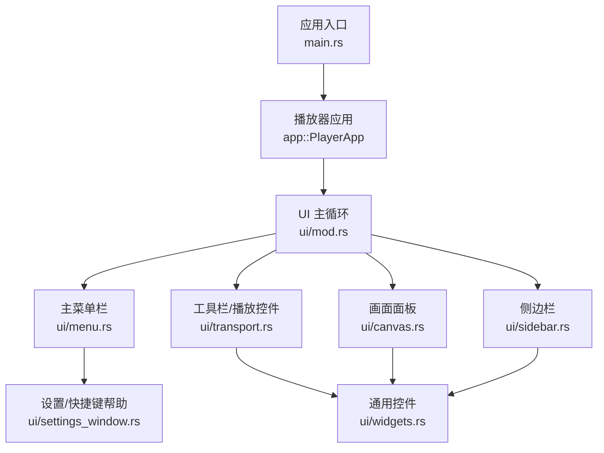
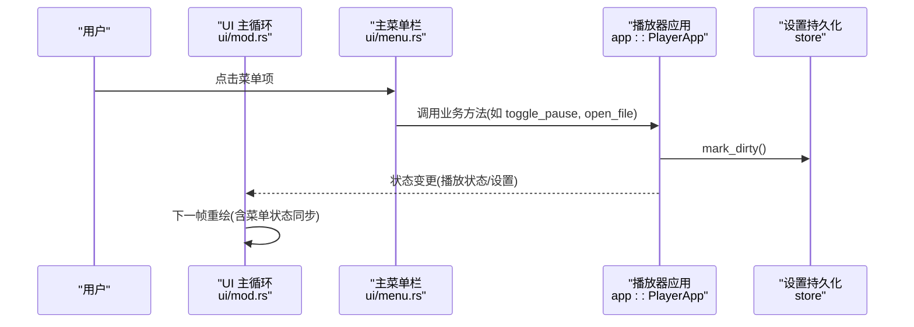
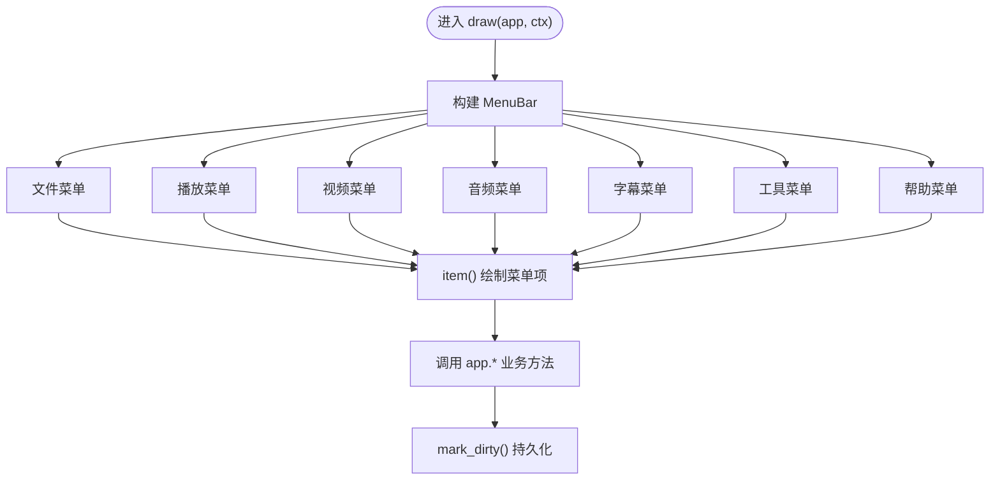
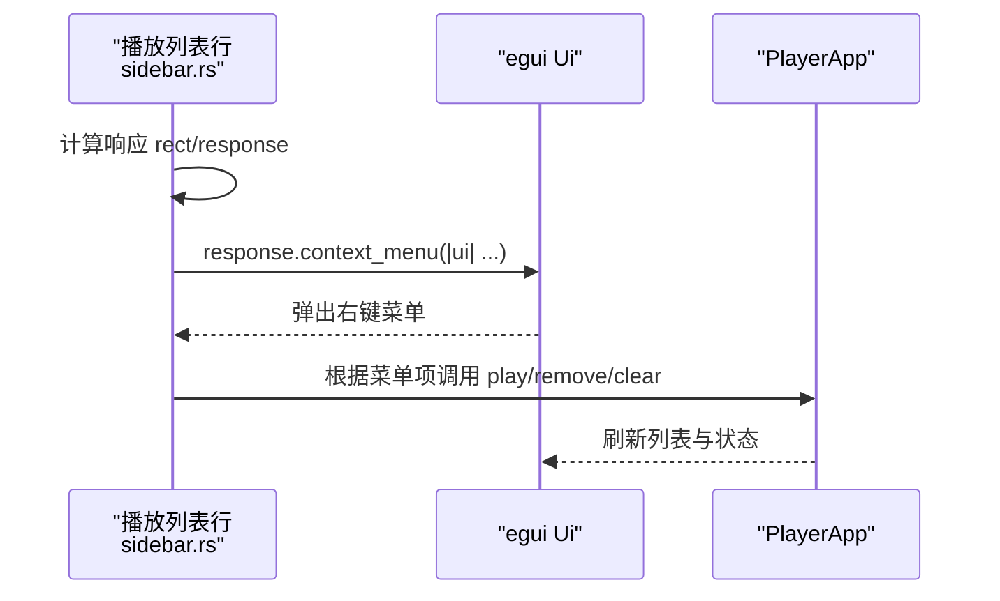
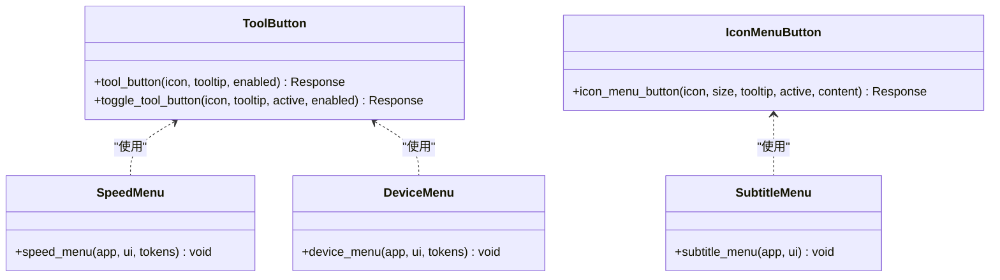
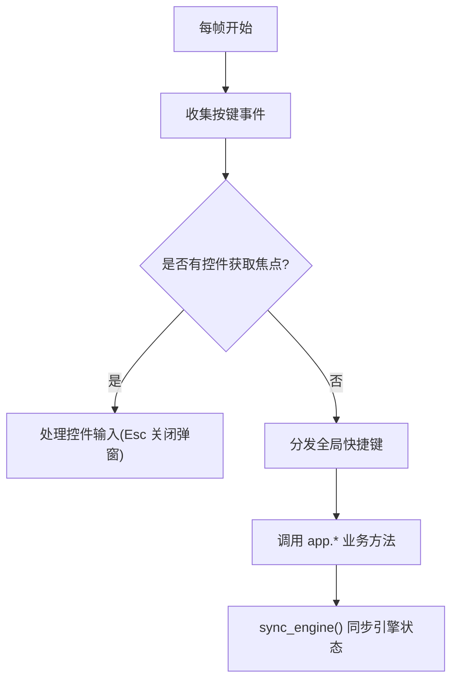
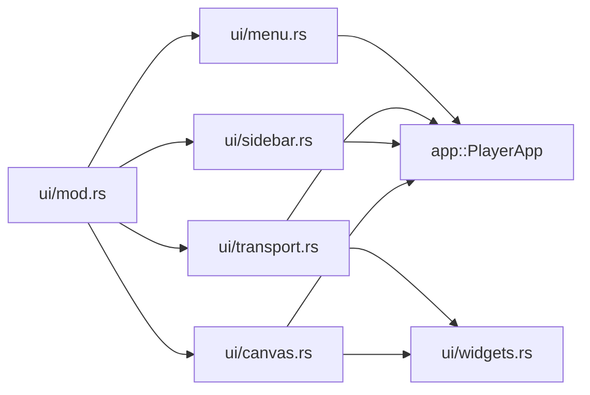

# 菜单系统

<cite>
**本文引用的文件**   
- [menu.rs](file://crates/mvp-player/src/ui/menu.rs)
- [mod.rs](file://crates/mvp-player/src/ui/mod.rs)
- [transport.rs](file://crates/mvp-player/src/ui/transport.rs)
- [widgets.rs](file://crates/mvp-player/src/ui/widgets.rs)
- [sidebar.rs](file://crates/mvp-player/src/ui/sidebar.rs)
- [canvas.rs](file://crates/mvp-player/src/ui/canvas.rs)
- [settings_window.rs](file://crates/mvp-player/src/ui/settings_window.rs)
- [main.rs](file://crates/mvp-player/src/main.rs)
</cite>

## 目录
1. [引言](#引言)
2. [项目结构](#项目结构)
3. [核心组件](#核心组件)
4. [架构总览](#架构总览)
5. [详细组件分析](#详细组件分析)
6. [依赖关系分析](#依赖关系分析)
7. [性能与交互特性](#性能与交互特性)
8. [故障排查指南](#故障排查指南)
9. [结论](#结论)
10. [附录：最佳实践清单](#附录最佳实践清单)

## 引言
本文件面向 MVP-Versatile-Player 的菜单系统，覆盖主菜单栏、上下文菜单、工具栏下拉菜单、快捷键绑定与全局热键处理，并说明菜单状态同步、权限控制（可用性）、国际化支持现状，以及自定义菜单项、子菜单嵌套和动态菜单更新的最佳实践。文档以代码级实现为依据，配合架构图与时序图帮助读者理解从 UI 渲染到业务动作的完整链路。

## 项目结构
菜单相关代码集中在 `mvp-player` 的 UI 层：
- 主菜单栏：`ui/menu.rs`
- 全局键盘与快捷键分发：`ui/mod.rs`
- 工具栏与播放控件中的下拉菜单：`ui/transport.rs`
- 通用图标按钮与图标菜单按钮：`ui/widgets.rs`
- 侧边栏右键上下文菜单：`ui/sidebar.rs`
- 画面面板中的下拉菜单：`ui/canvas.rs`
- 快捷键帮助与设置窗口：`ui/settings_window.rs`
- 应用入口与窗口初始化：`main.rs`

**图表来源**
- [main.rs:40-181](file://crates/mvp-player/src/main.rs#L40-L181)
- [mod.rs:48-144](file://crates/mvp-player/src/ui/mod.rs#L48-L144)
- [menu.rs:27-126](file://crates/mvp-player/src/ui/menu.rs#L27-L126)
- [transport.rs:23-93](file://crates/mvp-player/src/ui/transport.rs#L23-L93)
- [sidebar.rs:14-64](file://crates/mvp-player/src/ui/sidebar.rs#L14-L64)
- [canvas.rs:1175-1283](file://crates/mvp-player/src/ui/canvas.rs#L1175-L1283)
- [widgets.rs:400-493](file://crates/mvp-player/src/ui/widgets.rs#L400-L493)
- [settings_window.rs:807-832](file://crates/mvp-player/src/ui/settings_window.rs#L807-L832)

**章节来源**
- [main.rs:40-181](file://crates/mvp-player/src/main.rs#L40-L181)
- [mod.rs:48-144](file://crates/mvp-player/src/ui/mod.rs#L48-L144)

## 核心组件
- 主菜单栏：提供“文件 / 播放 / 视频 / 音频 / 字幕 / 工具 / 帮助”七大顶级菜单，包含常用命令、最近打开列表、播放速度、循环模式、画面比例、全屏等。
- 工具栏下拉菜单：在播放条中提供速度选择、输出设备选择、字幕轨道选择、画面适配等下拉菜单。
- 上下文菜单：侧边栏播放列表行支持右键菜单，提供播放、显示文件、移除、清空等操作。
- 快捷键系统：集中式键盘事件收集与分发，支持全局热键与局部输入优先策略。
- 通用控件：统一的图标按钮、切换按钮、图标菜单按钮，保证视觉一致性与可访问性。

**章节来源**
- [menu.rs:1-25](file://crates/mvp-player/src/ui/menu.rs#L1-L25)
- [transport.rs:329-403](file://crates/mvp-player/src/ui/transport.rs#L329-L403)
- [sidebar.rs:381-403](file://crates/mvp-player/src/ui/sidebar.rs#L381-L403)
- [mod.rs:315-510](file://crates/mvp-player/src/ui/mod.rs#L315-L510)
- [widgets.rs:400-493](file://crates/mvp-player/src/ui/widgets.rs#L400-L493)

## 架构总览
菜单系统的渲染由 UI 主循环驱动，按固定顺序绘制顶部菜单、错误横幅、侧边栏、底部工具栏、画布、浮动控件、设置窗口与对话框。每个菜单项点击后调用 `PlayerApp` 的业务方法，修改设置或引擎状态，并通过持久化存储标记脏数据，触发后续保存。

**图表来源**
- [mod.rs:48-144](file://crates/mvp-player/src/ui/mod.rs#L48-L144)
- [menu.rs:128-167](file://crates/mvp-player/src/ui/menu.rs#L128-L167)
- [transport.rs:329-360](file://crates/mvp-player/src/ui/transport.rs#L329-L360)

**章节来源**
- [mod.rs:48-144](file://crates/mvp-player/src/ui/mod.rs#L48-L144)

## 详细组件分析

### 主菜单栏设计与导航逻辑
- 顶级菜单使用 `MenuButton`，嵌套子菜单必须使用 `SubMenuButton`，否则会出现父菜单立即关闭导致子菜单不可达的问题。
- 每个顶级菜单函数负责自身区域：文件、播放、视频、音频、字幕、工具、帮助。
- 菜单项通过统一辅助函数 `item` 绘制，右侧显示快捷键提示；分隔线通过 `separator` 绘制。
- 右上角显示当前播放状态与文件名，宽度自适应，超长截断并提供悬停全名。

**图表来源**
- [menu.rs:27-126](file://crates/mvp-player/src/ui/menu.rs#L27-L126)
- [menu.rs:128-167](file://crates/mvp-player/src/ui/menu.rs#L128-L167)
- [menu.rs:210-327](file://crates/mvp-player/src/ui/menu.rs#L210-L327)
- [menu.rs:329-426](file://crates/mvp-player/src/ui/menu.rs#L329-L426)
- [menu.rs:428-524](file://crates/mvp-player/src/ui/menu.rs#L428-L524)
- [menu.rs:526-598](file://crates/mvp-player/src/ui/menu.rs#L526-L598)
- [menu.rs:600-669](file://crates/mvp-player/src/ui/menu.rs#L600-L669)
- [menu.rs:671-699](file://crates/mvp-player/src/ui/menu.rs#L671-L699)
- [menu.rs:716-761](file://crates/mvp-player/src/ui/menu.rs#L716-L761)

**章节来源**
- [menu.rs:1-25](file://crates/mvp-player/src/ui/menu.rs#L1-L25)
- [menu.rs:27-126](file://crates/mvp-player/src/ui/menu.rs#L27-L126)
- [menu.rs:128-167](file://crates/mvp-player/src/ui/menu.rs#L128-L167)
- [menu.rs:210-327](file://crates/mvp-player/src/ui/menu.rs#L210-L327)
- [menu.rs:329-426](file://crates/mvp-player/src/ui/menu.rs#L329-L426)
- [menu.rs:428-524](file://crates/mvp-player/src/ui/menu.rs#L428-L524)
- [menu.rs:526-598](file://crates/mvp-player/src/ui/menu.rs#L526-L598)
- [menu.rs:600-669](file://crates/mvp-player/src/ui/menu.rs#L600-L669)
- [menu.rs:671-699](file://crates/mvp-player/src/ui/menu.rs#L671-L699)
- [menu.rs:716-761](file://crates/mvp-player/src/ui/menu.rs#L716-L761)

### 上下文菜单触发机制与内容动态生成
- 侧边栏播放列表行在响应对象上注册 `context_menu`，根据当前行索引与媒体类型动态生成“播放”“在资源管理器中显示”“从列表移除”“清空列表”等选项。
- 右键菜单通过 egui 的 Popup 机制弹出，点击后执行对应操作并关闭菜单。

**图表来源**
- [sidebar.rs:381-403](file://crates/mvp-player/src/ui/sidebar.rs#L381-L403)

**章节来源**
- [sidebar.rs:381-403](file://crates/mvp-player/src/ui/sidebar.rs#L381-L403)

### 工具栏菜单的图标按钮与下拉选项管理
- 工具栏使用 `tool_button` 与 `toggle_tool_button` 绘制图标按钮，并在需要时挂载下拉菜单。
- 速度选择使用文本按钮形式的 `MenuButton`，列出预设速度并高亮当前值。
- 输出设备选择列出系统可用设备，默认设备名称来自引擎。
- 字幕轨道选择通过 `icon_menu_button` 将图标作为菜单按钮，内部再渲染轨道列表、外部字幕加载与延迟设置入口。

**图表来源**
- [widgets.rs:400-493](file://crates/mvp-player/src/ui/widgets.rs#L400-L493)
- [transport.rs:329-403](file://crates/mvp-player/src/ui/transport.rs#L329-L403)
- [transport.rs:975-1055](file://crates/mvp-player/src/ui/transport.rs#L975-L1055)

**章节来源**
- [widgets.rs:400-493](file://crates/mvp-player/src/ui/widgets.rs#L400-L493)
- [transport.rs:329-403](file://crates/mvp-player/src/ui/transport.rs#L329-L403)
- [transport.rs:975-1055](file://crates/mvp-player/src/ui/transport.rs#L975-L1055)

### 快捷键绑定系统与全局热键处理
- 键盘事件在每帧开始时收集，若某个控件拥有焦点则优先处理该控件的输入；否则执行全局快捷键。
- 特殊键（Esc、F1）始终生效；全屏键 F 在非聚焦状态下也生效。
- 快捷键映射包括播放暂停、快进快退、音量调节、静音、截图、上一项/下一项、打开文件/文件夹/网络串流、设置、侧边栏开关、速度调节、画面比例、旋转、窗口置顶、A-B 循环、随机播放、幻灯片等。
- 快捷键帮助通过设置窗口的快捷键页面展示。

**图表来源**
- [mod.rs:315-510](file://crates/mvp-player/src/ui/mod.rs#L315-L510)
- [settings_window.rs:807-832](file://crates/mvp-player/src/ui/settings_window.rs#L807-L832)

**章节来源**
- [mod.rs:315-510](file://crates/mvp-player/src/ui/mod.rs#L315-L510)
- [settings_window.rs:807-832](file://crates/mvp-player/src/ui/settings_window.rs#L807-L832)

### 菜单状态同步、权限控制与国际化支持
- 状态同步：菜单项的启用状态基于当前媒体模式与引擎状态判断，例如“播放/暂停”根据是否播放与是否结束决定标签，“下一帧”仅在图片模式下可用。
- 权限控制：通过 `enabled` 参数控制菜单项是否可点击；某些功能即使存在也会灰显，表示“当前媒体不支持”。
- 国际化支持：当前所有菜单文案为中文硬编码，未引入 i18n 框架；快捷键帮助与设置窗口同样使用中文文案。

**章节来源**
- [menu.rs:210-327](file://crates/mvp-player/src/ui/menu.rs#L210-L327)
- [menu.rs:329-426](file://crates/mvp-player/src/ui/menu.rs#L329-L426)
- [menu.rs:428-524](file://crates/mvp-player/src/ui/menu.rs#L428-L524)
- [menu.rs:526-598](file://crates/mvp-player/src/ui/menu.rs#L526-L598)
- [menu.rs:600-669](file://crates/mvp-player/src/ui/menu.rs#L600-L669)
- [menu.rs:671-699](file://crates/mvp-player/src/ui/menu.rs#L671-L699)

### 自定义菜单项、子菜单嵌套与动态菜单更新最佳实践
- 子菜单嵌套：务必使用 `SubMenuButton` 而非 `MenuButton`，以避免父菜单在同一帧关闭导致子菜单不可达。
- 动态菜单：根据 `app.engine.info()` 动态生成轨道列表、设备列表、最近打开文件列表；空列表时显示占位提示。
- 状态反馈：选择后立即 `ui.close()` 关闭菜单，避免误触；对设置变更调用 `app.store.mark_dirty()` 触发持久化。
- 一致性：菜单项样式统一通过 `item` 绘制，快捷键提示右对齐，分隔线间距一致。

**章节来源**
- [menu.rs:1-25](file://crates/mvp-player/src/ui/menu.rs#L1-L25)
- [menu.rs:169-208](file://crates/mvp-player/src/ui/menu.rs#L169-L208)
- [menu.rs:428-524](file://crates/mvp-player/src/ui/menu.rs#L428-L524)
- [menu.rs:526-598](file://crates/mvp-player/src/ui/menu.rs#L526-L598)
- [menu.rs:716-761](file://crates/mvp-player/src/ui/menu.rs#L716-L761)

## 依赖关系分析
- UI 主循环依赖各模块的绘制函数，按顺序调用菜单、侧边栏、工具栏、画布等。
- 菜单模块依赖 `PlayerApp` 的业务方法与 `Settings` 配置；工具栏依赖 `icons` 与 `widgets`。
- 快捷键分发直接调用 `PlayerApp` 的方法，不经过菜单渲染路径。

**图表来源**
- [mod.rs:48-144](file://crates/mvp-player/src/ui/mod.rs#L48-L144)
- [menu.rs:20-24](file://crates/mvp-player/src/ui/menu.rs#L20-L24)
- [transport.rs:6-11](file://crates/mvp-player/src/ui/transport.rs#L6-L11)
- [sidebar.rs:5-11](file://crates/mvp-player/src/ui/sidebar.rs#L5-L11)
- [canvas.rs:1175-1283](file://crates/mvp-player/src/ui/canvas.rs#L1175-L1283)

**章节来源**
- [mod.rs:48-144](file://crates/mvp-player/src/ui/mod.rs#L48-L144)

## 性能与交互特性
- 首帧优化：首次仅绘制画布，随后请求一帧绘制完整界面，减少启动延迟。
- 最小化窗口：降低重绘频率至每 500ms，避免后台解码与纹理上传浪费。
- 播放状态下的重绘调度：根据引擎帧时间动态安排下一次重绘，避免无意义的高频刷新。
- 菜单绘制：菜单项测量宽度避免溢出，长文件名截断并提供悬停全名。

**章节来源**
- [mod.rs:55-69](file://crates/mvp-player/src/ui/mod.rs#L55-L69)
- [mod.rs:98-102](file://crates/mvp-player/src/ui/mod.rs#L98-L102)
- [mod.rs:229-283](file://crates/mvp-player/src/ui/mod.rs#L229-L283)
- [menu.rs:66-126](file://crates/mvp-player/src/ui/menu.rs#L66-L126)

## 故障排查指南
- 子菜单无法展开：检查是否误用 `MenuButton` 代替 `SubMenuButton`。
- 菜单项点击无效：确认 `enabled` 参数是否正确；某些功能在当前媒体模式下不可用。
- 快捷键冲突：若控件拥有焦点，全局快捷键会被跳过；尝试先点击空白区域再试。
- 菜单文案不一致：确保使用 `item` 绘制菜单项，保持快捷键提示与分隔线风格一致。

**章节来源**
- [menu.rs:1-25](file://crates/mvp-player/src/ui/menu.rs#L1-L25)
- [menu.rs:716-761](file://crates/mvp-player/src/ui/menu.rs#L716-L761)
- [mod.rs:315-361](file://crates/mvp-player/src/ui/mod.rs#L315-L361)

## 结论
MVP-Versatile-Player 的菜单系统以清晰的层级结构与一致的交互模式为用户提供高效的操作体验。主菜单栏覆盖核心功能，工具栏提供快捷下拉菜单，侧边栏右键菜单增强列表操作，快捷键系统保证高频操作的可达性。尽管当前未实现国际化框架，但代码结构便于未来扩展。遵循子菜单使用规范、动态菜单生成与状态同步最佳实践，可进一步提升用户体验与可维护性。

## 附录：最佳实践清单
- 子菜单嵌套一律使用 `SubMenuButton`。
- 动态菜单基于 `engine.info()` 与 `settings` 实时生成，空列表显示占位。
- 菜单项启用状态与媒体模式、引擎状态严格同步。
- 设置变更后调用 `mark_dirty()` 触发持久化。
- 快捷键帮助与菜单文案保持一致，便于用户对照。
- 未来可引入 i18n 框架，将菜单文案与快捷键提示外置。