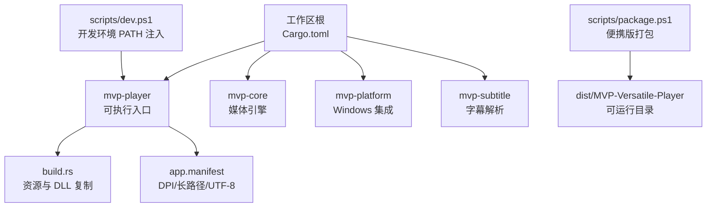
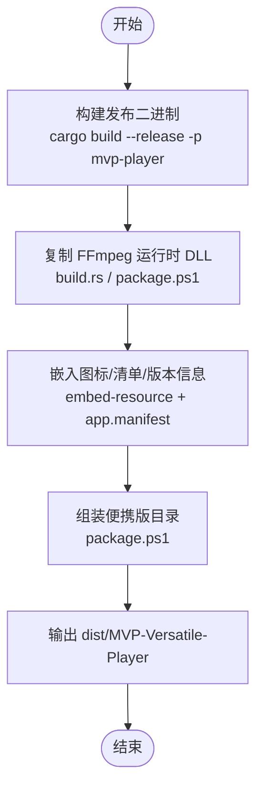
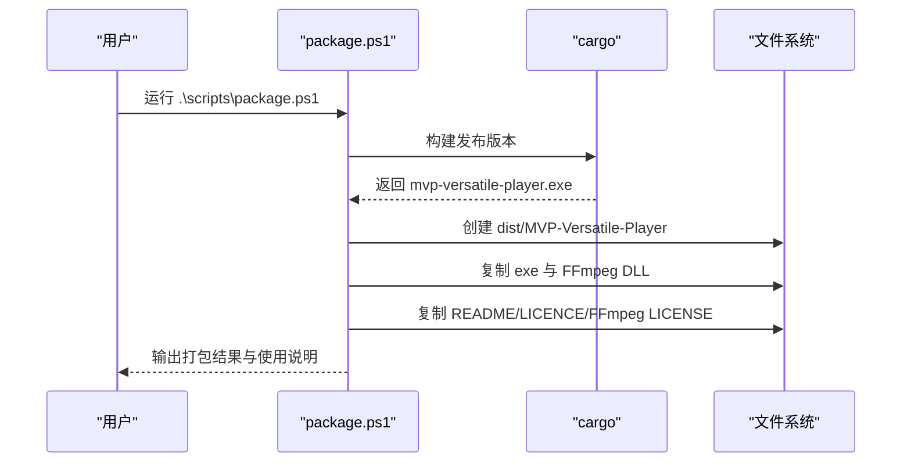
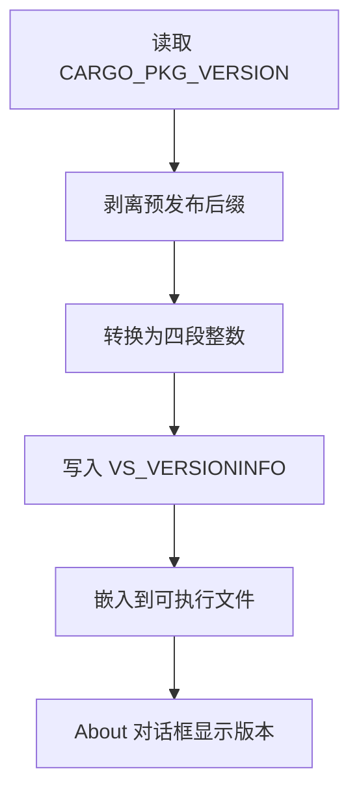
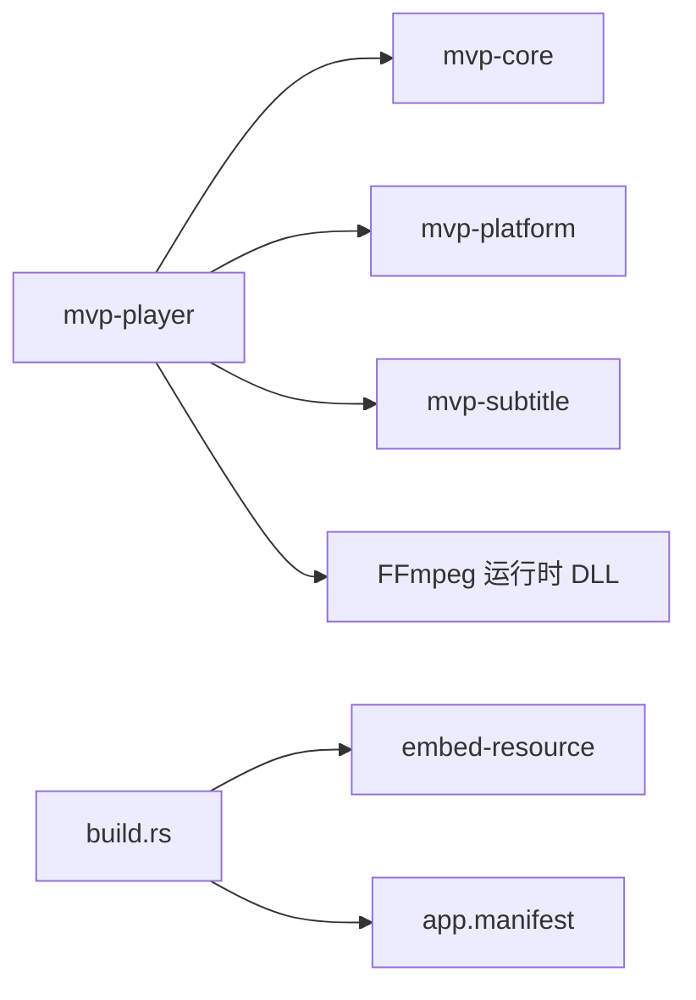

# 分发渠道

<cite>
**本文引用的文件**   
- [Cargo.toml](file://Cargo.toml)
- [README.md](file://README.md)
- [scripts/package.ps1](file://scripts/package.ps1)
- [scripts/dev.ps1](file://scripts/dev.ps1)
- [assets/app.manifest](file://assets/app.manifest)
- [crates/mvp-player/Cargo.toml](file://crates/mvp-player/Cargo.toml)
- [crates/mvp-player/build.rs](file://crates/mvp-player/build.rs)
</cite>

## 目录
1. [引言](#引言)
2. [项目结构与现有分发能力](#项目结构与现有分发能力)
3. [核心分发组件](#核心分发组件)
4. [架构总览](#架构总览)
5. [详细组件分析](#详细组件分析)
6. [依赖关系分析](#依赖关系分析)
7. [性能与体积考量](#性能与体积考量)
8. [故障排查指南](#故障排查指南)
9. [结论](#结论)
10. [附录：分发渠道实践建议](#附录分发渠道实践建议)

## 引言
本文件面向 MVP-Versatile-Player 的分发与发布，目标包括：
- 说明当前仓库已实现的便携版分发机制。
- 给出安装器制作、Microsoft Store 发布、代码签名、版本管理与增量更新的系统化方案。
- 对比不同分发渠道的优缺点与适用场景。
- 提供自动化发布流水线配置示例与最佳实践。

本项目是面向 Windows 的多功能音视频与图片播放器，使用 Rust 编写，直接集成 FFmpeg 共享库，并通过 PowerShell 脚本完成构建与打包。仓库中已有“便携版”产物生成逻辑，但尚未包含安装包、Store 清单或自动签名流程。

## 项目结构与现有分发能力
仓库采用多 crate workspace 结构，可执行入口位于 `crates/mvp-player`；Windows 平台相关能力集中在 `crates/mvp-platform`；媒体引擎在 `crates/mvp-core`；字幕解析在 `crates/mvp-subtitle`。

**图表来源**
- [Cargo.toml:1-15](file://Cargo.toml#L1-L15)
- [crates/mvp-player/Cargo.toml:1-11](file://crates/mvp-player/Cargo.toml#L1-L11)
- [crates/mvp-player/build.rs:1-12](file://crates/mvp-player/build.rs#L1-L12)
- [assets/app.manifest:1-17](file://assets/app.manifest#L1-L17)
- [scripts/package.ps1:1-14](file://scripts/package.ps1#L1-L14)
- [scripts/dev.ps1:1-15](file://scripts/dev.ps1#L1-L15)

**章节来源**
- [Cargo.toml:1-15](file://Cargo.toml#L1-L15)
- [README.md:315-323](file://README.md#L315-L323)

## 核心分发组件
- 工作区与版本定义：workspace 统一版本、Rust 版本与发行配置。
- 可执行包体：`mvp-versatile-player.exe`，链接 FFmpeg 共享库。
- 运行时依赖：FFmpeg 的多个 DLL，由构建脚本复制到输出目录。
- Windows 应用清单：DPI 感知、长路径支持、UTF-8 代码页。
- 便携版打包脚本：构建发布二进制、拷贝 FFmpeg DLL、附带文档与许可证。
- 开发辅助脚本：为 `cargo run/test` 注入 FFmpeg 运行时 PATH。

**章节来源**
- [Cargo.toml:10-15](file://Cargo.toml#L10-L15)
- [crates/mvp-player/Cargo.toml:1-11](file://crates/mvp-player/Cargo.toml#L1-L11)
- [assets/app.manifest:5-16](file://assets/app.manifest#L5-L16)
- [scripts/package.ps1:1-14](file://scripts/package.ps1#L1-L14)
- [scripts/dev.ps1:1-15](file://scripts/dev.ps1#L1-L15)

## 架构总览
下图展示从源码到可分发包的关键步骤：

**图表来源**
- [scripts/package.ps1:27-33](file://scripts/package.ps1#L27-L33)
- [scripts/package.ps1:43-55](file://scripts/package.ps1#L43-L55)
- [crates/mvp-player/build.rs:70-79](file://crates/mvp-player/build.rs#L70-L79)
- [crates/mvp-player/build.rs:119-128](file://crates/mvp-player/build.rs#L119-L128)

## 详细组件分析

### 便携版分发
- 文件夹结构
  - 根目录包含 `mvp-versatile-player.exe`。
  - 同目录包含 FFmpeg 的所有运行时 DLL。
  - 可选包含 `README.md`、`LICENSE`、`LICENSE-FFmpeg.txt`。
- 自包含特性
  - 可执行文件链接 FFmpeg 共享库，因此需要与其 DLL 在同一目录。
  - 无需安装程序、无需注册表写入、无需额外运行时。
  - 首次使用时通过菜单进行文件关联（HKCU），不需要管理员权限。
- 用户部署步骤
  - 将 `dist/MVP-Versatile-Player` 整个目录拷贝到目标机器。
  - 双击 `mvp-versatile-player.exe` 即可运行。
  - 如需右键打开方式与文件关联，进入「工具 → 文件关联」并点击「注册文件关联」。

**图表来源**
- [scripts/package.ps1:27-33](file://scripts/package.ps1#L27-L33)
- [scripts/package.ps1:40-66](file://scripts/package.ps1#L40-L66)
- [scripts/package.ps1:71-79](file://scripts/package.ps1#L71-L79)

**章节来源**
- [scripts/package.ps1:1-79](file://scripts/package.ps1#L1-L79)
- [README.md:255-263](file://README.md#L255-L263)
- [README.md:115-124](file://README.md#L115-L124)

### 安装器制作
当前仓库未内置安装包生成逻辑。推荐方案如下：
- 安装包格式选择
  - MSI：适合企业域环境、组策略管理、静默安装与卸载。
  - EXE 自解压：适合普通用户，体积小、上手快。
  - NSIS/Inno Setup：灵活控制安装流程、注册表、快捷方式、卸载程序。
- 安装流程设计
  - 检测系统版本与架构。
  - 安装到用户目录或 Program Files（根据权限）。
  - 复制可执行文件与 FFmpeg DLL。
  - 可选：注册文件关联、添加右键菜单、创建桌面/开始菜单快捷方式。
  - 记录安装位置以便卸载。
- 卸载程序实现
  - 删除安装目录中的文件。
  - 清理注册表项（HKCU/HKLM 中由安装器写入的内容）。
  - 移除快捷方式与文件关联（可选）。
  - 保留用户数据目录（如设置与日志）或提供清理选项。

由于仓库未包含安装包脚本，本节为通用指导，不直接引用具体代码文件。

### Microsoft Store 发布
当前仓库未包含 Store 清单或 Store 发布流程。建议补充以下能力：
- 应用清单配置
  - 生成 UWP/MSIX 清单，声明应用 ID、显示名称、版本、发布者、图标、扩展名关联、协议等。
  - 确保 DPI 感知、长路径、UTF-8 行为与桌面桥一致。
- 数字签名要求
  - 使用受信任的 EV 代码签名证书对 MSIX 包及其中可执行文件签名。
  - 时间戳服务必须可用，保证证书过期后签名仍有效。
- 商店提交流程
  - 准备测试设备与沙箱环境。
  - 上传 MSIX 包与截图、描述、隐私政策。
  - 提交审核并发布到生产通道。

由于仓库未包含 Store 清单或发布脚本，本节为通用指导，不直接引用具体代码文件。

### 代码签名
当前仓库未包含自动签名流程。建议流程如下：
- 证书获取
  - 申请企业级 EV 代码签名证书。
  - 将证书导入 CI 密钥库或安全存储。
- 签名工具使用
  - Windows SDK 的 `signtool`。
  - 对 `.exe`、`.dll`、`.msi`、`.msix` 分别签名。
- 时间戳服务配置
  - 配置 RFC 3161 时间戳服务器。
  - 确保证书过期后仍可验证历史签名。

由于仓库未包含签名脚本，本节为通用指导，不直接引用具体代码文件。

### 版本管理机制
仓库已具备基础版本能力：
- 版本号规范
  - 工作区统一版本：`version = "2.0.0"`。
  - 预发布后缀（如 `-beta.1`）会被剥离后写入 Windows 资源中的 `FILEVERSION`。
- 更新检测
  - 仓库未实现自动更新逻辑。可在应用中增加远程检查接口，比较本地 `ProductVersion` 与远端最新版本。
- 增量更新策略
  - 便携版可通过差异包与补丁校验实现增量更新。
  - 安装包可通过 MSI 补丁或现代 MSIX 增量更新机制实现。

**图表来源**
- [crates/mvp-player/build.rs:40-58](file://crates/mvp-player/build.rs#L40-L58)
- [crates/mvp-player/build.rs:144-181](file://crates/mvp-player/build.rs#L144-L181)

**章节来源**
- [Cargo.toml:10-15](file://Cargo.toml#L10-L15)
- [crates/mvp-player/build.rs:40-58](file://crates/mvp-player/build.rs#L40-L58)
- [crates/mvp-player/build.rs:144-181](file://crates/mvp-player/build.rs#L144-L181)

## 依赖关系分析
- 工作区成员
  - `mvp-core`、`mvp-platform`、`mvp-player`、`mvp-subtitle`。
- 可执行包体依赖
  - `mvp-player` 依赖其他三个 crate。
  - 运行时依赖 FFmpeg 共享库 DLL。
- 构建期依赖
  - `embed-resource` 用于编译 Windows 资源。
  - Windows SDK 的 `rc.exe` 被隐式调用。

**图表来源**
- [Cargo.toml:1-8](file://Cargo.toml#L1-L8)
- [crates/mvp-player/Cargo.toml:13-34](file://crates/mvp-player/Cargo.toml#L13-L34)
- [crates/mvp-player/build.rs:119-128](file://crates/mvp-player/build.rs#L119-L128)

**章节来源**
- [Cargo.toml:1-8](file://Cargo.toml#L1-L8)
- [crates/mvp-player/Cargo.toml:13-34](file://crates/mvp-player/Cargo.toml#L13-L34)

## 性能与体积考量
- 发布构建优化
  - `opt-level = 3`、`lto = "fat"`、`codegen-units = 1`、`strip = "symbols"`。
  - 可执行文件约 14 MB（不含 FFmpeg 的 180 MB DLL）。
- 启动速度
  - 窗口出现前只做必要初始化；FFmpeg 表按需初始化，声卡按需打开。
- 关闭速度
  - 快速退出，避免等待解码积压与声卡超时。

这些优化直接影响分发包的体积与用户体验，尤其在便携版与安装器中应保持一致的发布 profile。

**章节来源**
- [Cargo.toml:53-64](file://Cargo.toml#L53-L64)
- [README.md:425-437](file://README.md#L425-L437)
- [README.md:439-453](file://README.md#L439-L453)

## 故障排查指南
- 找不到 FFmpeg 开发包
  - 先运行 `scripts/setup-ffmpeg.ps1`。
  - 确认 `.cargo/config.toml` 中路径正确。
- 构建失败提示缺少 libclang
  - 重新运行 `scripts/setup-ffmpeg.ps1`，或手动设置 `LIBCLANG_PATH`。
- 可执行文件无法启动，提示缺少 DLL
  - 确保 FFmpeg DLL 与 exe 在同一目录。
  - 使用 `scripts/package.ps1` 重新打包。
- 文件关联无效
  - 在应用内「工具 → 文件关联」中重新注册。
  - 确认只写入 HKCU，无需管理员权限。

**章节来源**
- [README.md:164-230](file://README.md#L164-L230)
- [scripts/package.ps1:48-55](file://scripts/package.ps1#L48-L55)
- [README.md:115-124](file://README.md#L115-L124)

## 结论
仓库已具备完善的便携版分发能力：构建发布二进制、复制 FFmpeg 运行时、嵌入 Windows 资源与应用清单、输出可直接运行的目录。若需更正式的分发渠道，可在此基础上扩展安装器、Store 发布与代码签名流程，并结合 CI 实现自动化流水线。

## 附录：分发渠道实践建议

### 便携版分发
- 优点
  - 部署简单，无需安装。
  - 便于测试与回滚。
  - 适合内部工具与高级用户。
- 缺点
  - 用户需自行处理文件关联与更新。
  - 缺乏统一的卸载与清理机制。
- 适用场景
  - 开发者预览、技术评测、企业内部分发。

### 安装器分发
- 优点
  - 标准化安装与卸载。
  - 可集成文件关联、快捷方式、注册表。
  - 适合企业批量部署。
- 缺点
  - 维护成本较高。
  - 需要处理权限与兼容性问题。
- 适用场景
  - 面向普通用户的稳定版本。
  - 企业域环境。

### Microsoft Store 发布
- 优点
  - 自动更新、沙箱隔离、可信分发。
  - 简化安装与卸载。
- 缺点
  - 审核周期与限制较多。
  - 需要 MSIX 与签名体系。
- 适用场景
  - 希望获得商店流量与自动更新能力的产品。

### 自动化发布流水线建议
- 触发条件
  - 推送 tag 或合并到主分支。
- 关键步骤
  - 安装 Rust 与 MSVC 工具链。
  - 准备 FFmpeg 开发包。
  - 构建发布二进制。
  - 生成便携版目录。
  - 生成安装包（可选）。
  - 对产物签名（可选）。
  - 上传工件与发布说明。
- 产物归档
  - 便携版 ZIP。
  - 安装包 MSI/EXE（可选）。
  - MSIX（可选）。
  - 签名报告与校验和。

由于仓库未包含 CI 配置文件，以上为通用建议，不直接引用具体代码文件。