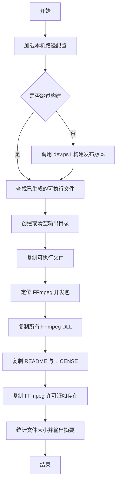
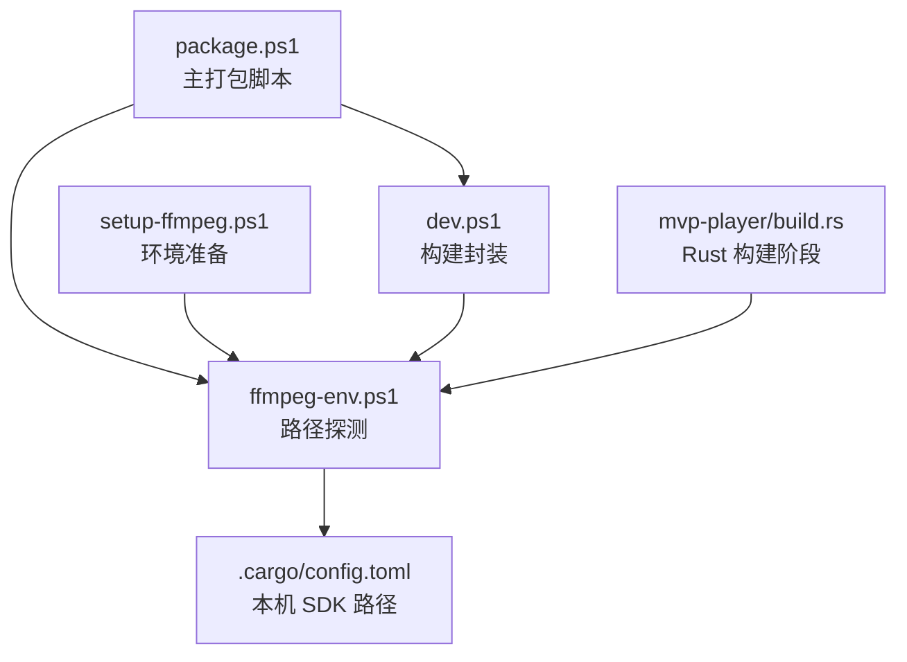
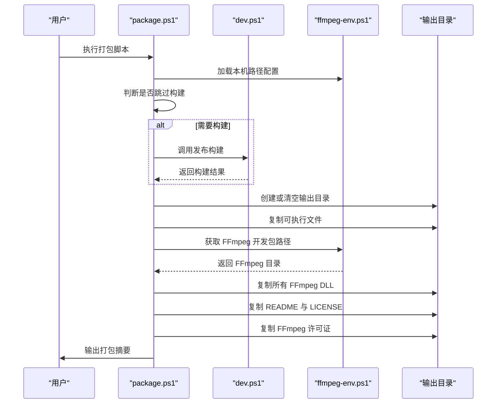
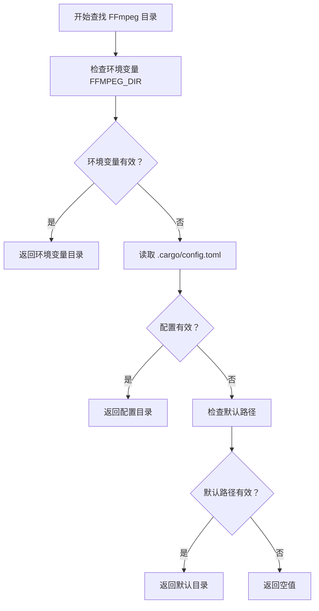
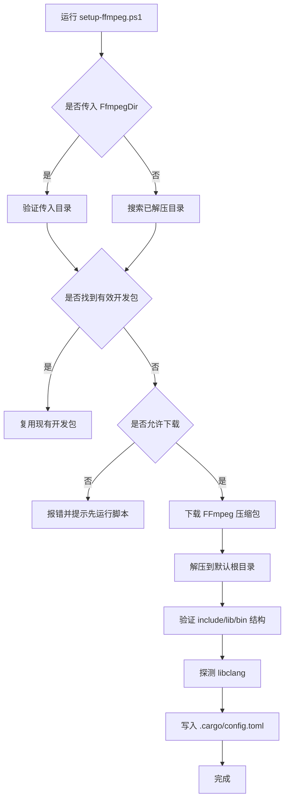
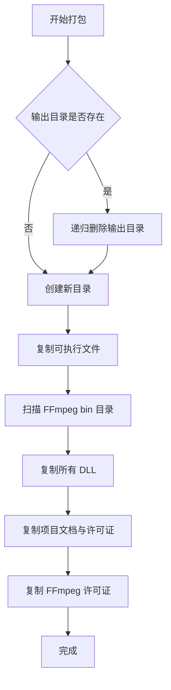
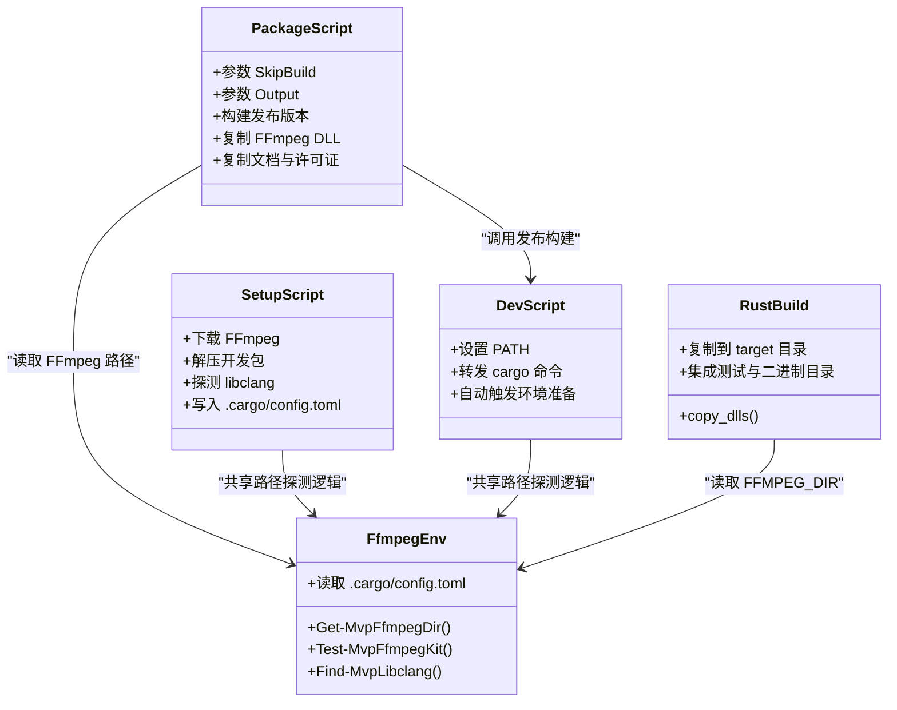

# 打包脚本

<cite>
**本文引用的文件**   
- [scripts/package.ps1](file://scripts/package.ps1)
- [scripts/ffmpeg-env.ps1](file://scripts/ffmpeg-env.ps1)
- [scripts/setup-ffmpeg.ps1](file://scripts/setup-ffmpeg.ps1)
- [scripts/dev.ps1](file://scripts/dev.ps1)
- [crates/mvp-player/build.rs](file://crates/mvp-player/build.rs)
- [README.md](file://README.md)
</cite>

## 目录

1. [简介](#简介)
2. [项目结构与脚本职责](#项目结构与脚本职责)
3. [核心打包流程](#核心打包流程)
4. [环境变量与 FFmpeg 开发包检测](#环境变量与-ffmpeg-开发包检测)
5. [环境准备脚本](#环境准备脚本)
6. [打包输出结构](#打包输出结构)
7. [自定义打包参数](#自定义打包参数)
8. [依赖关系与构建协作](#依赖关系与构建协作)
9. [性能与体积特征](#性能与体积特征)
10. [故障排除指南](#故障排除指南)
11. [最佳实践](#最佳实践)
12. [结论](#结论)

## 简介

本仓库的打包脚本围绕一个目标：**生成可直接拷贝到任意 Windows 机器上运行的播放器分发目录**。播放器直接链接 FFmpeg 共享库，因此发布产物不是“单个安装程序”，而是：

- 可执行文件；
- FFmpeg 运行时 DLL；
- 必要的说明与许可证文本。

这套机制不需要安装器、注册表引导或系统级运行库，适合快速分发和测试。



**图表来源**   
- [scripts/package.ps1:1-79](file://scripts/package.ps1#L1-L79)

**章节来源**   
- [scripts/package.ps1:1-79](file://scripts/package.ps1#L1-L79)
- [README.md:255-263](file://README.md#L255-L263)

## 项目结构与脚本职责

脚本目录中的 PowerShell 文件分工明确：

| 脚本 | 主要职责 | 关键行为 |
|---|---|---|
| `package.ps1` | 主打包脚本 | 构建发布版本、收集 FFmpeg DLL、复制文档与许可证、输出分发目录 |
| `ffmpeg-env.ps1` | 本机路径探测中心 | 提供 FFmpeg 目录、libclang 目录、仓库根路径等共享函数 |
| `setup-ffmpeg.ps1` | 环境准备脚本 | 下载或复用 FFmpeg 开发包、探测 libclang、写入 `.cargo/config.toml` |
| `dev.ps1` | 开发命令封装 | 为 cargo 设置 PATH、转发构建与测试命令 |
| `build.rs` | Rust 构建阶段辅助 | 在开发构建时把 FFmpeg DLL 复制到 target 目录，方便调试运行 |



**图表来源**   
- [scripts/package.ps1:21-30](file://scripts/package.ps1#L21-L30)
- [scripts/ffmpeg-env.ps1:1-21](file://scripts/ffmpeg-env.ps1#L1-L21)
- [scripts/setup-ffmpeg.ps1:172-213](file://scripts/setup-ffmpeg.ps1#L172-L213)
- [scripts/dev.ps1:30-64](file://scripts/dev.ps1#L30-L64)
- [crates/mvp-player/build.rs:190-225](file://crates/mvp-player/build.rs#L190-L225)

**章节来源**   
- [scripts/package.ps1:1-79](file://scripts/package.ps1#L1-L79)
- [scripts/ffmpeg-env.ps1:1-21](file://scripts/ffmpeg-env.ps1#L1-L21)
- [scripts/setup-ffmpeg.ps1:1-32](file://scripts/setup-ffmpeg.ps1#L1-L32)
- [scripts/dev.ps1:1-16](file://scripts/dev.ps1#L1-L16)
- [crates/mvp-player/build.rs:190-225](file://crates/mvp-player/build.rs#L190-L225)

## 核心打包流程

`package.ps1` 的执行顺序可以理解为一条清晰的流水线：

1. **启用继续错误处理**，避免 PowerShell 原生命令退出码被误判。
2. **加载 `ffmpeg-env.ps1`**，统一读取本机 FFmpeg 与 libclang 路径。
3. **根据参数决定是否构建**：默认会调用 `dev.ps1 build --release -p mvp-player`。
4. **验证发布可执行文件是否存在**，不存在则抛出错误。
5. **清理并创建输出目录**，默认位于仓库根下的 `dist\MVP-Versatile-Player`。
6. **复制可执行文件**。
7. **通过 `Get-MvpFfmpegDir` 定位 FFmpeg 开发包**，并复制其 `bin` 目录下所有 DLL。
8. **复制仓库根目录的 `README.md` 与 `LICENSE`**。
9. **如果 FFmpeg 开发包包含 `LICENSE.txt`，则复制为 `LICENSE-FFmpeg.txt`**。
10. **统计总大小与可执行文件大小**，输出打包摘要。



**图表来源**   
- [scripts/package.ps1:27-75](file://scripts/package.ps1#L27-L75)
- [scripts/ffmpeg-env.ps1:62-72](file://scripts/ffmpeg-env.ps1#L62-L72)

**章节来源**   
- [scripts/package.ps1:16-79](file://scripts/package.ps1#L16-L79)

## 环境变量与 FFmpeg 开发包检测

`ffmpeg-env.ps1` 是所有脚本共享的本机路径探测层。它不下载、不安装、不修改项目代码，只负责回答：“这台机器上的 FFmpeg 和 libclang 在哪里”。

### 关键变量

| 变量 | 含义 | 默认值或来源 |
|---|---|---|
| `$MvpFfmpegVersion` | 使用的 FFmpeg 发行分支版本 | `9.0` |
| `$MvpFfmpegRoot` | FFmpeg 开发包默认根目录 | `C:\ffmpeg-dev` |
| `$MvpRepoRoot` | 仓库根目录 | 由脚本所在目录向上推导 |
| `$MvpConfigPath` | `.cargo/config.toml` 路径 | 仓库根下的 `.cargo\config.toml` |

### 关键函数

| 函数 | 作用 | 返回值 |
|---|---|---|
| `Get-MvpDefaultFfmpegDir` | 计算默认 FFmpeg 目录 | 形如 `C:\ffmpeg-dev\ffmpeg-n9.0-latest-win64-gpl-shared-9.0` |
| `Test-MvpFfmpegKit` | 验证目录是否为可用的 shared 开发包 | 布尔值 |
| `Get-MvpConfigValue` | 从 `.cargo/config.toml` 解析已保存的路径 | 字符串或空值 |
| `Get-MvpFfmpegDir` | 按优先级找到可用 FFmpeg 目录 | 目录路径或空值 |
| `Find-MvpLibclangDirs` | 搜索可能包含 `libclang.dll` 的目录 | 目录列表 |
| `Find-MvpLibclang` | 找到第一个真正包含 `libclang.dll` 的位置 | 目录路径或空值 |

### FFmpeg 目录查找优先级

`Get-MvpFfmpegDir` 的查找顺序非常重要：

1. **环境变量 `FFMPEG_DIR`**：如果设置了且目录有效，直接使用。
2. **`.cargo/config.toml` 中已配置的 `FFMPEG_DIR`**：如果配置存在且目录有效，使用配置值。
3. **默认路径**：`C:\ffmpeg-dev\ffmpeg-n9.0-latest-win64-gpl-shared-9.0`。
4. **以上都不满足**：返回空值，表示需要先运行环境准备脚本。



**图表来源**   
- [scripts/ffmpeg-env.ps1:62-72](file://scripts/ffmpeg-env.ps1#L62-L72)

### FFmpeg 开发包有效性校验

`Test-MvpFfmpegKit` 要求目录必须同时具备：

- `include` 目录；
- `lib` 目录；
- `bin` 目录；
- `lib` 下至少 5 个 `.lib` 导入库。

这是为了避免把静态库构建包误当作共享库构建包使用。

**章节来源**   
- [scripts/ffmpeg-env.ps1:15-72](file://scripts/ffmpeg-env.ps1#L15-L72)

## 环境准备脚本

`setup-ffmpeg.ps1` 是首次克隆仓库后最重要的脚本。它负责让机器具备构建和打包所需的外部依赖。

### 主要功能

1. **确定 FFmpeg 开发包位置**：
   - 如果传入 `-FfmpegDir`，直接验证该目录；
   - 否则在默认根目录下查找已解压的 FFmpeg 目录；
   - 如果都没有，则从 BtbN 的 FFmpeg-Builds 发布页下载。
2. **下载 FFmpeg 压缩包**：
   - 使用 PowerShell 内置 `Invoke-WebRequest`，避免 Windows `curl.exe` 的证书吊销检查问题；
   - 支持最多 3 次重试；
   - 自动删除半下载的临时文件。
3. **解压并验证开发包结构**。
4. **探测 libclang**：
   - 优先使用 `-LibclangPath`；
   - 其次尝试 Python 安装的 `libclang`；
   - 最后扫描常见 LLVM 安装位置。
5. **写入 `.cargo/config.toml`**：
   - 记录 `FFMPEG_DIR`；
   - 记录 `LIBCLANG_PATH`（如找到）；
   - 添加 bindgen 所需的额外 clang 参数。

### 关键参数

| 参数 | 类型 | 作用 |
|---|---|---|
| `-Destination` | 字符串 | 指定 FFmpeg 默认根目录，例如 `C:\ffmpeg-dev` |
| `-Version` | 字符串 | 指定 FFmpeg 版本，例如 `9.0` |
| `-FfmpegDir` | 字符串 | 指定已有 FFmpeg 开发包目录 |
| `-LibclangPath` | 字符串 | 指定 libclang 目录或 `libclang.dll` 路径 |
| `-NoDownload` | 开关 | 不联网下载，找不到就报错 |
| `-Force` | 开关 | 强制重写 `.cargo/config.toml` |

### 为什么必须是 shared 构建

播放器直接链接 FFmpeg 共享库，并在运行时加载 DLL。静态构建无法提供运行时 DLL，因此打包时会失败或运行时报错。



**图表来源**   
- [scripts/setup-ffmpeg.ps1:99-150](file://scripts/setup-ffmpeg.ps1#L99-L150)
- [scripts/setup-ffmpeg.ps1:157-213](file://scripts/setup-ffmpeg.ps1#L157-L213)

**章节来源**   
- [scripts/setup-ffmpeg.ps1:1-32](file://scripts/setup-ffmpeg.ps1#L1-L32)
- [scripts/setup-ffmpeg.ps1:41-92](file://scripts/setup-ffmpeg.ps1#L41-L92)
- [scripts/setup-ffmpeg.ps1:94-150](file://scripts/setup-ffmpeg.ps1#L94-L150)
- [scripts/setup-ffmpeg.ps1:152-213](file://scripts/setup-ffmpeg.ps1#L152-L213)

## 打包输出结构

打包完成后，输出目录通常位于：

```
dist/MVP-Versatile-Player/
├── mvp-versatile-player.exe
├── avcodec-*.dll
├── avformat-*.dll
├── avutil-*.dll
├── swscale-*.dll
├── ...（其他 FFmpeg DLL）
├── README.md
├── LICENSE
└── LICENSE-FFmpeg.txt
```

### 输出内容规则

| 内容 | 是否复制 | 条件 |
|---|---:|---|
| 可执行文件 | 是 | 发布构建成功且文件存在 |
| FFmpeg DLL | 是 | 能定位到 FFmpeg 开发包的 `bin` 目录 |
| `README.md` | 是 | 仓库根目录存在该文件 |
| `LICENSE` | 是 | 仓库根目录存在该文件 |
| `LICENSE-FFmpeg.txt` | 条件复制 | FFmpeg 开发包中存在 `LICENSE.txt` |

### 输出目录清理策略

每次打包前，如果输出目录已存在，脚本会递归删除后再重建。这意味着：

- 重复打包不会累积旧文件；
- 手动放入的非预期文件会被清理；
- 如果需要保留历史产物，应在打包前先备份。



**图表来源**   
- [scripts/package.ps1:40-66](file://scripts/package.ps1#L40-L66)

**章节来源**   
- [scripts/package.ps1:40-75](file://scripts/package.ps1#L40-L75)
- [README.md:255-263](file://README.md#L255-L263)

## 自定义打包参数

`package.ps1` 暴露了两个主要参数：

| 参数 | 类型 | 默认值 | 作用 |
|---|---|---|---|
| `-SkipBuild` | 开关 | 关闭 | 跳过构建步骤，直接使用已有的发布可执行文件 |
| `-Output` | 字符串 | `dist\MVP-Versatile-Player` | 指定打包输出目录 |

### 常用用法

| 场景 | 命令 |
|---|---|
| 完整打包 | `.\scripts\package.ps1` |
| 跳过构建，仅重新收集 DLL | `.\scripts\package.ps1 -SkipBuild` |
| 指定输出目录 | `.\scripts\package.ps1 -Output C:\temp\MVP-Dist` |
| 跳过构建并指定输出目录 | `.\scripts\package.ps1 -SkipBuild -Output C:\temp\MVP-Dist` |

### SkipBuild 的使用时机

`-SkipBuild` 适用于以下情况：

- 已经运行过 `.\scripts\dev.ps1 build --release -p mvp-player`；
- 只想重新收集 FFmpeg DLL；
- 想复用已有发布产物，避免长时间编译；
- CI 环境中构建与打包分离。

但需要注意：如果可执行文件与 FFmpeg DLL 版本不一致，运行时可能出现符号缺失或 ABI 不匹配。

**章节来源**   
- [scripts/package.ps1:10-14](file://scripts/package.ps1#L10-L14)
- [scripts/package.ps1:27-38](file://scripts/package.ps1#L27-L38)

## 依赖关系与构建协作

打包脚本并不是孤立存在的，它与多个组件协作：



**图表来源**   
- [scripts/package.ps1:21-30](file://scripts/package.ps1#L21-L30)
- [scripts/ffmpeg-env.ps1:43-72](file://scripts/ffmpeg-env.ps1#L43-L72)
- [scripts/setup-ffmpeg.ps1:172-213](file://scripts/setup-ffmpeg.ps1#L172-L213)
- [scripts/dev.ps1:30-64](file://scripts/dev.ps1#L30-L64)
- [crates/mvp-player/build.rs:190-225](file://crates/mvp-player/build.rs#L190-L225)

### 构建阶段与运行阶段的 DLL 差异

| 阶段 | DLL 来源 | 目的 |
|---|---|---|
| 开发构建 | `build.rs` 复制到 `target/<profile>/` | 让 `cargo run` 和单元测试能找到 DLL |
| 打包发布 | `package.ps1` 复制到输出目录 | 生成独立分发目录 |
| 运行时 | 操作系统加载 exe 同目录下的 DLL | 播放器启动时动态加载 FFmpeg |

**章节来源**   
- [scripts/package.ps1:27-55](file://scripts/package.ps1#L27-L55)
- [scripts/dev.ps1:1-16](file://scripts/dev.ps1#L1-L16)
- [crates/mvp-player/build.rs:190-225](file://crates/mvp-player/build.rs#L190-L225)

## 性能与体积特征

### 打包性能

打包脚本本身很快，主要耗时来自：

- 发布构建（如果未跳过）；
- 复制大量 FFmpeg DLL；
- 统计输出目录总大小。

由于 FFmpeg 共享库较大，打包过程会涉及较多磁盘 IO。

### 体积特征

根据项目文档：

- 发布构建的可执行文件约 14 MB；
- FFmpeg DLL 合计约 180 MB；
- 打包产物是一个无需安装的目录。


**图表来源**   
- [README.md:425-433](file://README.md#L425-L433)

**章节来源**   
- [scripts/package.ps1:68-75](file://scripts/package.ps1#L68-L75)
- [README.md:425-433](file://README.md#L425-L433)

## 故障排除指南

### 常见问题与解决方案

| 现象 | 可能原因 | 解决方案 |
|---|---|---|
| 提示找不到 FFmpeg 开发包 | 未运行 `setup-ffmpeg.ps1`，或 FFmpeg 不在预期位置 | 运行 `.\scripts\setup-ffmpeg.ps1`，或使用 `-FfmpegDir` 指定目录 |
| 构建失败，提示找不到 `avcodec.lib` | `FFMPEG_DIR` 指向了错误的目录或未配置 | 重新运行环境准备脚本，确认 `.cargo/config.toml` 正确 |
| 构建失败，提示找不到 libclang | 未安装 LLVM 或 `pip install libclang` | 安装 LLVM 或运行 `setup-ffmpeg.ps1` 让其自动探测 |
| 打包后运行报缺少 DLL | 可执行文件与 FFmpeg DLL 版本不一致 | 重新执行完整打包，不要混用不同版本的产物 |
| 打包输出为空或只有部分文件 | 输出目录权限不足或 FFmpeg 路径无效 | 检查输出目录权限，确认 `Get-MvpFfmpegDir` 能返回有效路径 |
| 重复打包很慢 | 正在重新构建或复制大文件 | 使用 `-SkipBuild` 跳过构建，或提前准备好发布构建 |
| 网络下载失败 | 防火墙、代理或证书链不可达 | 检查网络，必要时手动下载 FFmpeg 并使用 `-FfmpegDir` |

### 关键错误信息对照

| 错误信息片段 | 含义 | 处理建议 |
|---|---|---|
| `找不到 mvp-versatile-player.exe，请先运行构建` | 发布构建未生成可执行文件 | 先运行 `.\scripts\dev.ps1 build --release -p mvp-player` |
| `找不到 FFmpeg 开发包，请先运行 .\scripts\setup-ffmpeg.ps1` | 无法定位 FFmpeg shared 开发包 | 运行环境准备脚本 |
| `指定的 FFmpeg 目录不是可用的 shared 开发包` | 传入目录缺少 `include`、`lib/*.lib` 或 `bin` | 使用正确的 FFmpeg shared 构建 |
| `Unable to find libclang` | bindgen 找不到 `libclang.dll` | 安装 LLVM 或 `pip install libclang` |
| `FFMPEG_DIR 相关的链接错误` | 链接阶段找不到 FFmpeg 导入库 | 检查 `.cargo/config.toml` 中的 `FFMPEG_DIR` |

### 推荐排查顺序

1. 确认已运行 `.\scripts\setup-ffmpeg.ps1`。
2. 检查 `.cargo/config.toml` 是否存在且包含 `FFMPEG_DIR`。
3. 确认 FFmpeg 目录包含 `include`、`lib`、`bin`。
4. 确认 libclang 可通过环境变量、Python 或 LLVM 安装路径找到。
5. 重新运行 `.\scripts\dev.ps1 build --release -p mvp-player`。
6. 再运行 `.\scripts\package.ps1`。

**章节来源**   
- [scripts/package.ps1:27-51](file://scripts/package.ps1#L27-L51)
- [scripts/setup-ffmpeg.ps1:100-148](file://scripts/setup-ffmpeg.ps1#L100-L148)
- [README.md:220-231](file://README.md#L220-L231)

## 最佳实践

### 日常开发

- 初次克隆仓库后，先运行 `.\scripts\setup-ffmpeg.ps1`。
- 使用 `.\scripts\dev.ps1 test --workspace` 验证环境。
- 使用 `.\scripts\dev.ps1 build --release -p mvp-player` 构建发布版本。
- 使用 `.\scripts\package.ps1` 生成最终分发目录。

### 持续集成

- 缓存 FFmpeg 开发包，避免每次下载 1 GB 压缩包。
- 缓存 Rust 构建产物，缩短构建时间。
- 将构建与打包分为两个步骤：
  - 构建步骤生成 `target\release\mvp-versatile-player.exe`；
  - 打包步骤使用 `-SkipBuild` 复用构建产物。

### 分发注意事项

- 整个输出目录应整体拷贝到目标机器。
- 首次使用时可在播放器内注册文件关联。
- 不要只复制可执行文件，必须包含 FFmpeg DLL。
- 如需合规分发，保留 `LICENSE` 与 `LICENSE-FFmpeg.txt`。

**章节来源**   
- [README.md:164-189](file://README.md#L164-L189)
- [README.md:255-263](file://README.md#L255-L263)
- [scripts/package.ps1:71-79](file://scripts/package.ps1#L71-L79)

## 结论

这套打包脚本的核心设计原则是：**本机路径与项目代码分离、构建与分发解耦、对外部依赖最小化人工干预**。

- `ffmpeg-env.ps1` 集中管理本机路径，避免硬编码。
- `setup-ffmpeg.ps1` 负责一次性环境准备，支持下载、复用与配置写入。
- `dev.ps1` 让开发命令能直接找到 FFmpeg 运行时。
- `package.ps1` 把发布产物组织成可直接分发的目录。
- `build.rs` 在开发阶段协助复制 DLL，提升本地调试体验。

对于使用者来说，最简路径是：

1. 运行 `.\scripts\setup-ffmpeg.ps1`；
2. 运行 `.\scripts\dev.ps1 build --release -p mvp-player`；
3. 运行 `.\scripts\package.ps1`；
4. 将 `dist\MVP-Versatile-Player` 整体拷贝到目标机器运行。

**章节来源**   
- [scripts/package.ps1:1-79](file://scripts/package.ps1#L1-L79)
- [scripts/ffmpeg-env.ps1:1-171](file://scripts/ffmpeg-env.ps1#L1-L171)
- [scripts/setup-ffmpeg.ps1:1-224](file://scripts/setup-ffmpeg.ps1#L1-L224)
- [scripts/dev.ps1:1-72](file://scripts/dev.ps1#L1-L72)
- [README.md:164-263](file://README.md#L164-L263)