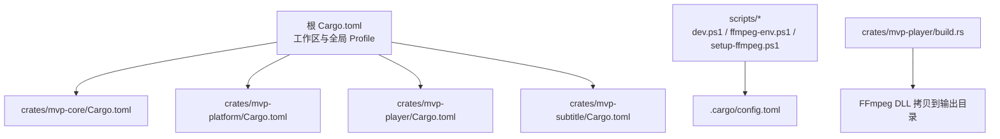
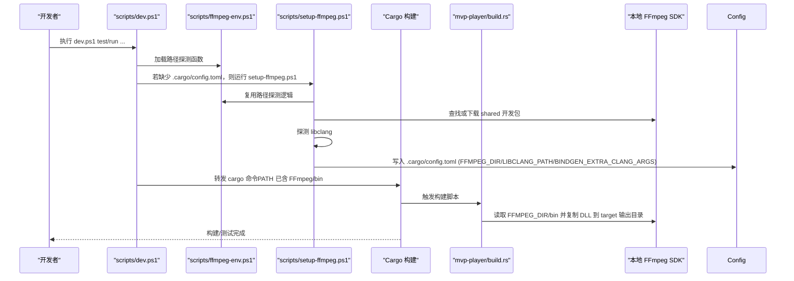
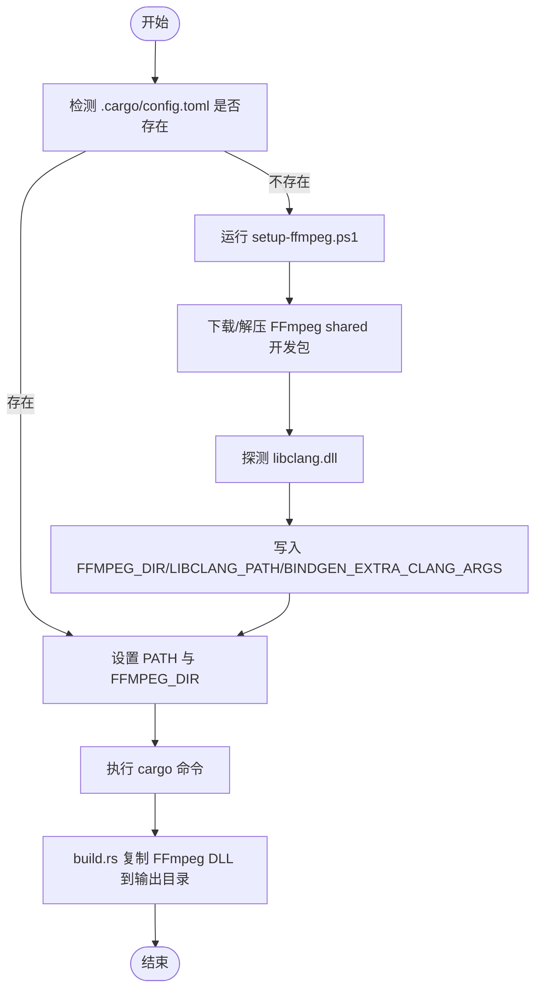

# 构建配置

<cite>
**本文引用的文件**   
- [Cargo.toml](file://Cargo.toml)
- [.cargo/config.toml](file://.cargo/config.toml)
- [scripts/dev.ps1](file://scripts/dev.ps1)
- [scripts/ffmpeg-env.ps1](file://scripts/ffmpeg-env.ps1)
- [scripts/setup-ffmpeg.ps1](file://scripts/setup-ffmpeg.ps1)
- [crates/mvp-core/Cargo.toml](file://crates/mvp-core/Cargo.toml)
- [crates/mvp-platform/Cargo.toml](file://crates/mvp-platform/Cargo.toml)
- [crates/mvp-player/Cargo.toml](file://crates/mvp-player/Cargo.toml)
- [crates/mvp-subtitle/Cargo.toml](file://crates/mvp-subtitle/Cargo.toml)
- [crates/mvp-player/build.rs](file://crates/mvp-player/build.rs)
</cite>

## 目录
1. [简介](#简介)
2. [项目结构](#项目结构)
3. [核心构建组件](#核心构建组件)
4. [架构总览](#架构总览)
5. [详细组件分析](#详细组件分析)
6. [依赖与目标平台差异](#依赖与目标平台差异)
7. [性能优化与调优建议](#性能优化与调优建议)
8. [常见问题排查](#常见问题排查)
9. [结论](#结论)

## 简介
本文件面向 MVP-Versatile-Player 的构建系统，系统性说明 Cargo 工作区配置、依赖版本管理、特征开关、发布优化参数（LTO、codegen-units、strip 等）、本地 FFmpeg 集成方式、开发环境脚本流程，以及不同目标平台的构建差异与交叉编译注意事项。文档同时给出可操作的调优建议与问题定位方法，帮助开发者在 Windows 上高效完成构建、调试与打包。

## 项目结构
该项目采用多 crate 的 Cargo 工作区组织：
- 根 Cargo.toml 定义工作区成员、统一包元数据、集中化的 workspace.dependencies 与全局 profile。
- crates 下包含四个 crate：mvp-core、mvp-platform、mvp-player、mvp-subtitle。
- scripts 提供本地环境准备与开发辅助脚本，尤其是 FFmpeg 动态库集成与路径探测。
- .cargo/config.toml 由 setup-ffmpeg.ps1 生成，记录本机 FFmpeg 与 libclang 路径，避免将机器相关路径提交到仓库。

图示来源
- [Cargo.toml:1-78](file://Cargo.toml#L1-L78)
- [crates/mvp-player/build.rs:183-233](file://crates/mvp-player/build.rs#L183-L233)

章节来源
- [Cargo.toml:1-78](file://Cargo.toml#L1-L78)

## 核心构建组件
- 工作区与工作区依赖
  - 通过 [workspace] 声明成员 crate，统一 resolver 为 "2"。
  - [workspace.package] 统一 version、edition、rust-version、license 等元数据。
  - [workspace.dependencies] 集中管理第三方依赖版本，子 crate 使用 workspace = true 引用，确保版本一致。
- 全局 Profile
  - release 开启 opt-level=3、fat LTO、单 codegen-unit、关闭增量、strip=symbols、关闭 debug 与溢出检查，追求最终二进制体积与启动性能。
  - dev 对源码 opt-level=1，依赖 opt-level=2，保留增量编译，兼顾 UI 迭代速度。
- 本地 FFmpeg 集成
  - .cargo/config.toml 由 setup-ffmpeg.ps1 生成，设置 FFMPEG_DIR、LIBCLANG_PATH、BINDGEN_EXTRA_CLANG_ARGS。
  - build.rs 在构建时根据 FFMPEG_DIR 复制 FFmpeg 运行时 DLL 到目标目录，使 cargo run/test 可直接运行。
- 开发脚本
  - scripts/dev.ps1 封装 cargo 命令，自动加载 FFmpeg 环境变量并调用 setup-ffmpeg.ps1 初始化本地配置。
  - scripts/ffmpeg-env.ps1 提供路径探测与验证逻辑，供多个脚本复用。
  - scripts/setup-ffmpeg.ps1 负责下载/解压 FFmpeg shared 开发包、探测 libclang、写入 .cargo/config.toml。

章节来源
- [Cargo.toml:10-78](file://Cargo.toml#L10-L78)
- [.cargo/config.toml:1-23](file://.cargo/config.toml#L1-L23)
- [crates/mvp-player/build.rs:183-233](file://crates/mvp-player/build.rs#L183-L233)
- [scripts/dev.ps1:1-72](file://scripts/dev.ps1#L1-L72)
- [scripts/ffmpeg-env.ps1:1-171](file://scripts/ffmpeg-env.ps1#L1-L171)
- [scripts/setup-ffmpeg.ps1:1-224](file://scripts/setup-ffmpeg.ps1#L1-L224)

## 架构总览
下图展示从开发脚本到 Cargo 构建、再到 FFmpeg 集成的整体流程。

图示来源
- [scripts/dev.ps1:30-67](file://scripts/dev.ps1#L30-L67)
- [scripts/setup-ffmpeg.ps1:152-213](file://scripts/setup-ffmpeg.ps1#L152-L213)
- [crates/mvp-player/build.rs:183-233](file://crates/mvp-player/build.rs#L183-L233)

## 详细组件分析

### 工作区与依赖版本管理
- 工作区成员
  - mvp-core：媒体播放引擎、图像视图模型与播放列表。
  - mvp-platform：Windows 平台集成（文件关联、单实例、Shell 辅助）。
  - mvp-player：应用主程序（UI 基于 eframe/egui）。
  - mvp-subtitle：字幕解析与时间轴查询。
- 依赖管理策略
  - 所有公共依赖集中在 [workspace.dependencies]，子 crate 通过 workspace = true 引用，保证版本一致性。
  - GUI 相关依赖（eframe、egui、rfd）关闭默认特性，仅启用 glow 等必要特性，减少二进制体积与字体冗余。
  - FFmpeg 绑定使用 ffmpeg-next 9.0.0，与本地 FFmpeg 9.0 分支保持一致。
- 子 crate 依赖示例
  - mvp-core 依赖 ffmpeg-next、cpal、image 及内部 crate mvp-subtitle。
  - mvp-platform 仅在 windows 目标启用 windows crate 的特定功能集。
  - mvp-player 依赖 eframe、egui、rfd、raw-window-handle 与内部 crate。

章节来源
- [Cargo.toml:17-52](file://Cargo.toml#L17-L52)
- [crates/mvp-core/Cargo.toml:8-25](file://crates/mvp-core/Cargo.toml#L8-L25)
- [crates/mvp-platform/Cargo.toml:14-39](file://crates/mvp-platform/Cargo.toml#L14-L39)
- [crates/mvp-player/Cargo.toml:13-34](file://crates/mvp-player/Cargo.toml#L13-L34)

### 发布优化参数与性能特性
- 发布模式（release）
  - opt-level=3：最大化优化。
  - lto="fat"：全量链接时优化，提升跨 crate 内联与死代码消除效果。
  - codegen-units=1：单一代码生成单元，利于 LTO 与跨模块优化，但会延长编译时间。
  - incremental=false：禁用增量编译以获取更稳定的发布产物。
  - strip="symbols"：剥离符号表，减小二进制体积。
  - debug=false、overflow-checks=false：进一步缩小体积与提升性能。
- 开发模式（dev）
  - 源码 opt-level=1，依赖 opt-level=2，保留增量编译，平衡 UI 迭代速度与运行性能。
- 注意事项
  - 注释明确保留 unwinding panic，以便媒体引擎在工作线程中安全处理损坏文件导致的 panic，不崩溃整个播放器。

章节来源
- [Cargo.toml:53-78](file://Cargo.toml#L53-L78)

### 本地 FFmpeg 集成配置
- .cargo/config.toml
  - FFMPEG_DIR：指向 FFmpeg 9.0 shared 开发包根目录，force=false 允许环境变量覆盖。
  - LIBCLANG_PATH：指向 libclang.dll 所在目录，供 bindgen 使用。
  - BINDGEN_EXTRA_CLANG_ARGS：为 ffmpeg-sys-next 的 hwcontext 垫片提供宏替换，兼容 FFmpeg 9 新增类型。
- 脚本协作
  - setup-ffmpeg.ps1 负责下载/解压 FFmpeg shared 开发包、探测 libclang、写入 .cargo/config.toml。
  - dev.ps1 在运行 cargo 前将 FFmpeg/bin 加入 PATH，并将 FFMPEG_DIR 标准化为正向斜杠，避免重复 bindgen。
  - ffmpeg-env.ps1 提供路径探测与校验函数，被多个脚本复用。

图示来源
- [scripts/dev.ps1:30-67](file://scripts/dev.ps1#L30-L67)
- [scripts/setup-ffmpeg.ps1:152-213](file://scripts/setup-ffmpeg.ps1#L152-L213)
- [crates/mvp-player/build.rs:183-233](file://crates/mvp-player/build.rs#L183-L233)

章节来源
- [.cargo/config.toml:15-23](file://.cargo/config.toml#L15-L23)
- [scripts/setup-ffmpeg.ps1:152-213](file://scripts/setup-ffmpeg.ps1#L152-L213)
- [scripts/dev.ps1:44-67](file://scripts/dev.ps1#L44-L67)
- [crates/mvp-player/build.rs:183-233](file://crates/mvp-player/build.rs#L183-L233)

### 开发环境构建流程（dev.ps1）
- 作用
  - 为任何 cargo 命令注入 FFmpeg 运行时 PATH，使 cargo run/test 可直接运行。
  - 首次使用时自动引导 setup-ffmpeg.ps1 生成 .cargo/config.toml。
  - 标准化 FFMPEG_DIR 路径分隔符，避免重复 bindgen。
- 关键行为
  - 若未找到 FFmpeg 开发包，提示先运行 setup-ffmpeg.ps1。
  - 将 FFmpeg/bin 前置到 PATH，便于运行时加载 DLL。
  - 将 FFMPEG_DIR 的正向斜杠形式导出，确保与 .cargo/config.toml 一致。

章节来源
- [scripts/dev.ps1:1-72](file://scripts/dev.ps1#L1-L72)

### 构建脚本与资源嵌入（build.rs）
- 主要职责
  - 在 Windows 上编译图标、清单与版本信息资源，确保 Explorer 与任务栏显示正确图标与版本。
  - 根据 FFMPEG_DIR 复制 FFmpeg 运行时 DLL 到目标输出目录，使 cargo run/test 无需手动设置 PATH。
- 关键点
  - 语言与代码页固定为简体中文与 Unicode，保证资源确定性。
  - 版本号取自 CARGO_PKG_VERSION，避免资源与 About 对话框不一致。
  - embed-resource 要求 Windows SDK（rc.exe），缺失时会失败。
  - DLL 复制跳过相同大小且更新较新的文件，避免每次增量构建重写大文件。

章节来源
- [crates/mvp-player/build.rs:1-249](file://crates/mvp-player/build.rs#L1-L249)

## 依赖与目标平台差异
- 平台相关依赖
  - mvp-platform 仅在 cfg(windows) 下启用 windows crate，并显式启用所需 Win32 API 功能集，如 GDI、DWM、Shell、HiDpi、Registry、Threading 等。
- 特征开关
  - mvp-platform 提供 serde 特征，默认启用；可通过 default-features=false 关闭，以省略 derive 实现。
- 目标平台差异
  - 资源编译（图标、清单、版本信息）仅在 Windows 目标生效。
  - FFmpeg 运行时 DLL 复制逻辑在所有平台均尝试执行，但实际依赖 FFMPEG_DIR 与 bin 目录存在性。
- 交叉编译注意事项
  - 当前脚本与配置针对 Windows MSVC 工具链与 FFmpeg shared 开发包。
  - 若需交叉编译到其他平台，需要调整 .cargo/config.toml 中的路径与编译器/LLVM 设置，并确保对应平台的 FFmpeg SDK 可用。

章节来源
- [crates/mvp-platform/Cargo.toml:14-48](file://crates/mvp-platform/Cargo.toml#L14-L48)
- [crates/mvp-player/build.rs:77-132](file://crates/mvp-player/build.rs#L77-L132)

## 性能优化与调优建议
- 发布构建优化
  - 保持 lto="fat" 与 codegen-units=1，以获得最佳跨 crate 优化效果；代价是编译时间较长。
  - 若 CI 构建时间敏感，可在非发布流水线临时降低 LTO 强度或启用并行构建（注意与 LTO 的兼容性）。
- 开发构建优化
  - 保持 dev 模式下增量编译开启，依赖 opt-level=2，源码 opt-level=1，以平衡 UI 迭代速度。
  - 若频繁修改 UI 代码，可考虑在 dev 模式下进一步降低依赖优化级别，但可能影响运行性能。
- FFmpeg 集成优化
  - 确保使用 shared 开发包，避免静态库导致链接阶段出现大量未解析符号。
  - 保持 FFMPEG_DIR 路径稳定，避免频繁变更导致重复 bindgen。
- 二进制体积优化
  - 发布模式启用 strip="symbols"，有效减小体积。
  - GUI 依赖关闭默认字体特性，避免冗余字体占用空间。

[本节为通用指导，不直接分析具体文件]

## 常见问题排查
- 找不到 FFmpeg 开发包
  - 现象：dev.ps1 提示找不到 FFmpeg 开发包。
  - 解决：运行 scripts/setup-ffmpeg.ps1 下载或指定已有 shared 开发包目录。
- 缺少 libclang
  - 现象：bindgen 无法找到 libclang.dll。
  - 解决：安装 LLVM 或通过 pip install libclang，脚本会自动探测常见位置；也可手动设置 LIBCLANG_PATH。
- 运行时无法加载 FFmpeg DLL
  - 现象：cargo run 报错找不到 avcodec-*.dll。
  - 解决：确保 PATH 包含 FFmpeg/bin，或确认 build.rs 已将 DLL 复制到输出目录。
- 重复 bindgen 导致构建缓慢
  - 现象：切换 dev.ps1 与直接 cargo 命令后反复触发 bindgen。
  - 解决：确保 FFMPEG_DIR 使用正向斜杠，且 .cargo/config.toml 未被意外修改。
- Windows SDK 缺失
  - 现象：embed-resource 编译资源失败。
  - 解决：安装 Windows SDK（包含 rc.exe），或在 VS 命令行环境中构建。

章节来源
- [scripts/dev.ps1:33-51](file://scripts/dev.ps1#L33-L51)
- [scripts/setup-ffmpeg.ps1:152-213](file://scripts/setup-ffmpeg.ps1#L152-L213)
- [crates/mvp-player/build.rs:119-128](file://crates/mvp-player/build.rs#L119-L128)

## 结论
该项目的构建系统围绕 Cargo 工作区与脚本化环境准备展开：通过集中化的依赖管理与全局 profile 控制构建性能，借助 setup-ffmpeg.ps1 与 .cargo/config.toml 实现本地 FFmpeg 集成，并通过 build.rs 自动化运行时 DLL 拷贝。开发脚本 dev.ps1 简化了日常开发与测试流程。建议在发布构建中保持强优化参数，在开发构建中利用增量编译与适度优化级别以提升迭代效率。遇到问题时优先检查 FFmpeg 与 libclang 路径、SDK 完整性与路径分隔符一致性。