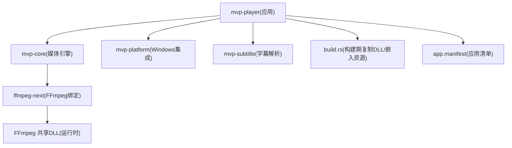
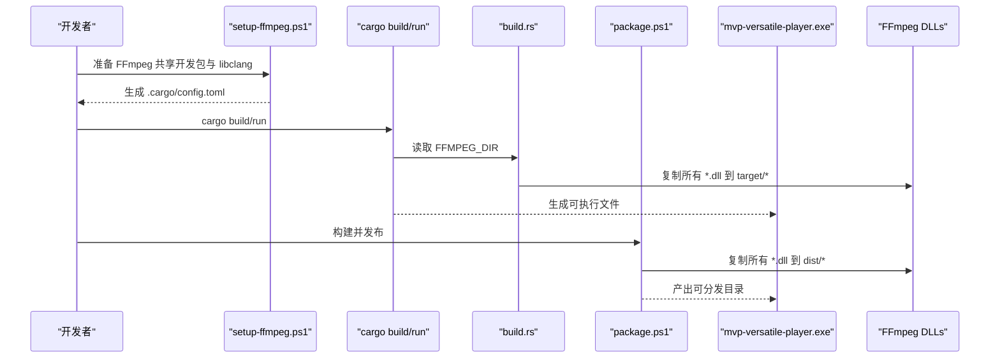
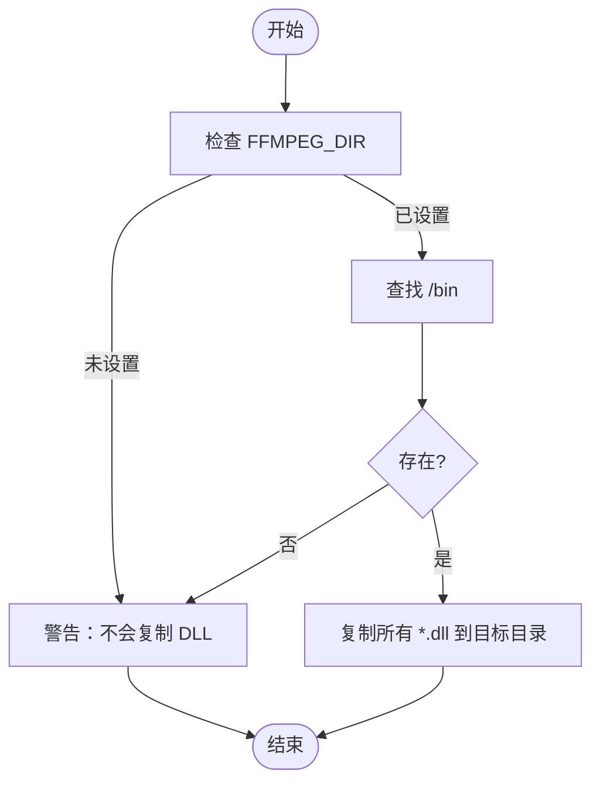
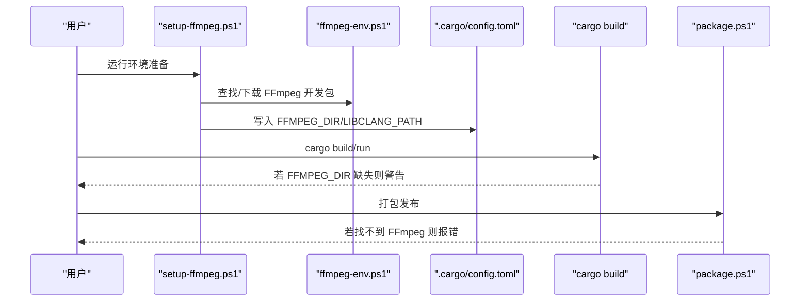
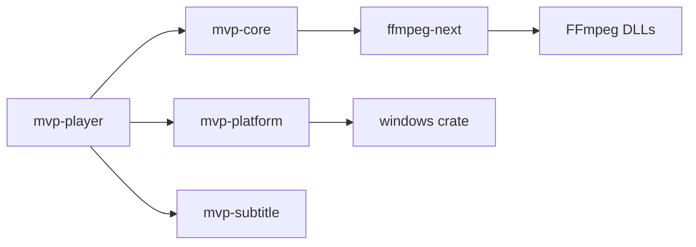

# 运行时依赖

<cite>
**本文引用的文件**
- [assets/app.manifest](file://assets/app.manifest)
- [scripts/ffmpeg-env.ps1](file://scripts/ffmpeg-env.ps1)
- [scripts/setup-ffmpeg.ps1](file://scripts/setup-ffmpeg.ps1)
- [scripts/package.ps1](file://scripts/package.ps1)
- [crates/mvp-player/build.rs](file://crates/mvp-player/build.rs)
- [Cargo.toml](file://Cargo.toml)
- [crates/mvp-core/Cargo.toml](file://crates/mvp-core/Cargo.toml)
- [crates/mvp-platform/Cargo.toml](file://crates/mvp-platform/Cargo.toml)
</cite>

## 目录
1. [简介](#简介)
2. [项目结构](#项目结构)
3. [核心组件](#核心组件)
4. [架构总览](#架构总览)
5. [详细组件分析](#详细组件分析)
6. [依赖关系分析](#依赖关系分析)
7. [性能考虑](#性能考虑)
8. [故障排查指南](#故障排查指南)
9. [结论](#结论)
10. [附录](#附录)

## 简介
本文件聚焦于 MVP-Versatile-Player 的“运行时依赖管理”，围绕以下目标展开：
- FFmpeg 共享库依赖：需要随分发的 DLL 数量、版本兼容性、系统架构支持。
- 应用程序清单配置：UAC 权限、Windows 版本要求、程序图标与 DPI/长路径等设置。
- 系统要求检查：Windows 版本兼容、Visual C++ 运行库需求、DirectX 依赖。
- 依赖验证机制：启动时检查、缺失提示、自动修复建议。
- 分发渠道策略：便携版、安装器、Microsoft Store 的差异处理。
- 诊断方法与解决方案：如何定位并解决依赖问题。

## 项目结构
本项目为 Rust 多 crate 工作区，播放器二进制由 mvp-player 构建，媒体引擎基于 ffmpeg-next（FFmpeg）；平台相关能力集中在 mvp-platform；字幕解析在 mvp-subtitle。构建期通过 build.rs 将 Windows 资源（图标、清单、版本信息）嵌入，并将 FFmpeg 的共享 DLL 复制到输出目录，便于开发与测试直接运行。打包脚本会收集可执行文件与所有 FFmpeg DLL，形成无需安装的便携包。

图表来源
- [crates/mvp-player/build.rs:183-233](file://crates/mvp-player/build.rs#L183-L233)
- [assets/app.manifest:1-27](file://assets/app.manifest#L1-L27)
- [Cargo.toml:33-37](file://Cargo.toml#L33-L37)

章节来源
- [Cargo.toml:1-15](file://Cargo.toml#L1-L15)
- [crates/mvp-player/build.rs:1-13](file://crates/mvp-player/build.rs#L1-L13)

## 核心组件
- FFmpeg 共享库依赖
  - 使用 ffmpeg-next 9.0.0 绑定到 FFmpeg 9.0 的共享开发包。
  - 构建期通过环境变量 FFMPEG_DIR 指向包含 include/lib/bin 的开发包，链接导入库并在运行时加载 bin 下的 DLL。
  - 打包脚本会将 bin 下所有 DLL 复制到发布目录，形成“可执行 + 若干 DLL”的自包含分发。
- 应用清单与资源
  - 通过 embed-resource 编译 .rc，嵌入 app.manifest 与图标、版本信息。
  - 清单声明 PerMonitorV2 DPI 感知、长路径支持、UTF-8 代码页，以及支持的 Windows 版本。
- 构建期复制 DLL
  - build.rs 在每次构建时将 FFmpeg DLL 复制到 target/release 及 deps 目录，使 cargo run/test 可直接运行。
- 打包流程
  - package.ps1 构建 release 并复制所有 FFmpeg DLL 到 dist 目录，附带 README/LICENCE/FFmpeg LICENSE。

章节来源
- [Cargo.toml:33-37](file://Cargo.toml#L33-L37)
- [crates/mvp-player/build.rs:183-233](file://crates/mvp-player/build.rs#L183-L233)
- [scripts/package.ps1:1-79](file://scripts/package.ps1#L1-L79)
- [assets/app.manifest:1-27](file://assets/app.manifest#L1-L27)

## 架构总览
下图展示了从源码到可运行包的依赖流转：构建期确定 FFmpeg 开发包位置，链接导入库；运行时加载同目录下的 FFmpeg DLL；打包阶段将这些 DLL 一并收集。

图表来源
- [scripts/setup-ffmpeg.ps1:1-224](file://scripts/setup-ffmpeg.ps1#L1-L224)
- [crates/mvp-player/build.rs:183-233](file://crates/mvp-player/build.rs#L183-L233)
- [scripts/package.ps1:1-79](file://scripts/package.ps1#L1-L79)

## 详细组件分析

### FFmpeg 共享库依赖与分发
- 版本与架构
  - 绑定版本：ffmpeg-next 9.0.0，对应 FFmpeg 9.0 分支。
  - 架构：脚本默认下载 win64 共享开发包，因此产物面向 x64。
- 所需 DLL 数量
  - 打包脚本会复制 bin 目录下所有 DLL，统计显示“FFmpeg DLL : N 个”。该数量取决于所用 FFmpeg 构建包含的模块，通常约为 7 个左右（具体以实际 bin 目录为准）。
- 版本兼容性
  - 必须使用与 ffmpeg-next 9.0.0 匹配的 FFmpeg 9.0 共享开发包；master 分支头文件可能引入新枚举导致绑定失败。
- 构建与运行
  - 构建期：通过 FFMPEG_DIR 找到 include/lib/bin，链接导入库。
  - 运行期：Windows 按进程目录优先搜索 DLL，因此需将 DLL 置于 exe 同级目录。

图表来源
- [crates/mvp-player/build.rs:183-233](file://crates/mvp-player/build.rs#L183-L233)

章节来源
- [Cargo.toml:33-37](file://Cargo.toml#L33-L37)
- [scripts/ffmpeg-env.ps1:15-72](file://scripts/ffmpeg-env.ps1#L15-L72)
- [scripts/setup-ffmpeg.ps1:94-150](file://scripts/setup-ffmpeg.ps1#L94-L150)
- [scripts/package.ps1:45-75](file://scripts/package.ps1#L45-L75)
- [crates/mvp-player/build.rs:183-233](file://crates/mvp-player/build.rs#L183-L233)

### 应用程序清单配置（app.manifest）
- UAC 权限
  - 清单中未请求提升权限，默认以当前用户权限运行。
- Windows 版本要求
  - 通过 supportedOS 声明对多个 Windows 版本的兼容性（含较新的 Windows 版本 GUID）。
- 其他关键设置
  - DPI 感知：PerMonitorV2, PerMonitor，避免跨显示器缩放模糊。
  - 长路径支持：启用 longPathAware，适配深层媒体路径。
  - 活动代码页：UTF-8，改善国际化文本处理。
- 程序图标
  - 构建期通过 embed-resource 将 assets/icon.ico 嵌入到可执行文件中，用于资源管理器、任务栏和关联项显示。

章节来源
- [assets/app.manifest:1-27](file://assets/app.manifest#L1-L27)
- [crates/mvp-player/build.rs:81-129](file://crates/mvp-player/build.rs#L81-L129)
- [crates/mvp-player/build.rs:134-181](file://crates/mvp-player/build.rs#L134-L181)

### 系统要求检查
- Windows 版本兼容性
  - 清单声明了多个 supportedOS，覆盖主流 Windows 版本。
- Visual C++ 运行库
  - 项目未显式声明对 VC++ 运行库的依赖；若运行时出现入口点或 CRT 相关错误，请确认系统已安装与编译器匹配的最新 VC++ 运行库。
- DirectX 依赖
  - 项目未直接依赖 DirectX SDK；图形渲染通过 eframe/glow 抽象，底层驱动由系统提供。如遇图形异常，请确保显卡驱动与系统更新到位。

章节来源
- [assets/app.manifest:19-26](file://assets/app.manifest#L19-L26)
- [crates/mvp-player/build.rs:119-128](file://crates/mvp-player/build.rs#L119-L128)

### 依赖验证机制
- 构建期验证
  - setup-ffmpeg.ps1 会校验 FFmpeg 开发包是否包含 include/lib/bin 且至少 5 个 .lib 导入库；否则报错并给出指引。
  - 同时探测 libclang 位置，写入 .cargo/config.toml，供 bindgen 使用。
- 运行期行为
  - 若未设置 FFMPEG_DIR，build.rs 会发出警告且不复制 DLL；此时 cargo run/test 将无法找到 DLL。
  - 打包脚本在找不到 FFmpeg 开发包时会抛出错误，阻止生成不完整包。
- 缺失组件的错误提示与修复建议
  - 缺少 FFmpeg 开发包：运行 setup-ffmpeg.ps1 或指定 -FfmpegDir。
  - 缺少 libclang：安装 LLVM 或 pip install libclang，脚本会自动探测。
  - 打包失败：确保已完成构建且 FFMPEG_DIR 正确。

图表来源
- [scripts/setup-ffmpeg.ps1:1-224](file://scripts/setup-ffmpeg.ps1#L1-L224)
- [scripts/ffmpeg-env.ps1:15-171](file://scripts/ffmpeg-env.ps1#L15-L171)
- [crates/mvp-player/build.rs:183-233](file://crates/mvp-player/build.rs#L183-L233)
- [scripts/package.ps1:1-79](file://scripts/package.ps1#L1-L79)

章节来源
- [scripts/setup-ffmpeg.ps1:94-170](file://scripts/setup-ffmpeg.ps1#L94-L170)
- [scripts/ffmpeg-env.ps1:28-72](file://scripts/ffmpeg-env.ps1#L28-L72)
- [crates/mvp-player/build.rs:183-233](file://crates/mvp-player/build.rs#L183-L233)
- [scripts/package.ps1:45-55](file://scripts/package.ps1#L45-L55)

### 不同分发渠道的依赖处理策略
- 便携版（推荐）
  - 使用 package.ps1 生成的目录，包含 mvp-versatile-player.exe 与所有 FFmpeg DLL，无需安装即可运行。
  - 首次使用需在“工具 → 文件关联”中注册关联。
- 安装器
  - 可将便携目录整体部署为目标路径；如需静默安装、创建快捷方式或注册文件关联，可在安装器中调用相应逻辑。
  - 注意：安装器不应修改系统 PATH，因为应用期望 DLL 与 exe 同目录。
- Microsoft Store
  - Store 沙箱限制访问外部路径，建议将 FFmpeg DLL 作为应用包的一部分随包分发；避免依赖 FFMPEG_DIR 或系统全局路径。
  - 清单中的 DPI/长路径设置仍适用，但需注意 Store 对文件系统访问的限制。

章节来源
- [scripts/package.ps1:1-79](file://scripts/package.ps1#L1-L79)
- [crates/mvp-player/build.rs:183-233](file://crates/mvp-player/build.rs#L183-L233)

## 依赖关系分析
- 工作区与 crate
  - mvp-player 依赖 mvp-core、mvp-platform、mvp-subtitle。
  - mvp-core 依赖 ffmpeg-next、cpal、image 等。
  - mvp-platform 仅在 Windows 上启用，使用 windows crate 进行系统集成。
- 外部依赖
  - FFmpeg 9.0 共享库（通过 ffmpeg-next 绑定）。
  - 构建期需要 libclang（bindgen 使用）。
  - 运行时依赖 Windows API 与系统图形栈（通过 eframe/glow）。

图表来源
- [Cargo.toml:1-15](file://Cargo.toml#L1-L15)
- [crates/mvp-core/Cargo.toml:8-25](file://crates/mvp-core/Cargo.toml#L8-L25)
- [crates/mvp-platform/Cargo.toml:8-39](file://crates/mvp-platform/Cargo.toml#L8-L39)

章节来源
- [Cargo.toml:1-15](file://Cargo.toml#L1-L15)
- [crates/mvp-core/Cargo.toml:8-25](file://crates/mvp-core/Cargo.toml#L8-L25)
- [crates/mvp-platform/Cargo.toml:8-39](file://crates/mvp-platform/Cargo.toml#L8-L39)

## 性能考虑
- 增量构建优化
  - build.rs 在复制 DLL 前比较文件大小与修改时间，避免重复拷贝大体积 FFmpeg 运行时。
- 启动延迟
  - 发布配置启用 LTO、strip 符号、单 codegen unit，减少二进制体积并提升启动性能。
- 运行时
  - 保持 DLL 与 exe 同目录可减少动态加载时的搜索开销。

章节来源
- [crates/mvp-player/build.rs:212-233](file://crates/mvp-player/build.rs#L212-L233)
- [Cargo.toml:53-78](file://Cargo.toml#L53-L78)

## 故障排查指南
- 无法运行/报 DLL 缺失
  - 确认已将 FFmpeg DLL 复制到 exe 同级目录（构建期由 build.rs 完成；发布包由 package.ps1 完成）。
  - 检查 FFMPEG_DIR 是否正确指向包含 bin 的开发包。
- 构建失败/找不到 libclang
  - 安装 LLVM 或将 libclang.dll 所在目录加入 LIBCLANG_PATH；也可使用 pip install libclang。
- 打包失败
  - 先运行 setup-ffmpeg.ps1 准备环境，再执行 package.ps1。
- 文件关联/图标/版本信息异常
  - 确保 Windows SDK（rc.exe）可用；构建脚本会强制要求清单与资源编译成功。
- 图形异常
  - 更新显卡驱动；确保系统支持清单中声明的 DPI/长路径特性。

章节来源
- [scripts/setup-ffmpeg.ps1:152-170](file://scripts/setup-ffmpeg.ps1#L152-L170)
- [crates/mvp-player/build.rs:119-128](file://crates/mvp-player/build.rs#L119-L128)
- [scripts/package.ps1:45-55](file://scripts/package.ps1#L45-L55)

## 结论
本项目采用“共享库 + 构建期复制 + 打包期收集”的策略管理 FFmpeg 运行时依赖，确保开发与发布体验一致。应用清单明确了 DPI、长路径与 Windows 版本兼容性，图标与版本信息通过构建脚本稳定嵌入。通过脚本化的环境准备与校验，降低了依赖配置复杂度。针对不同分发渠道，建议优先采用便携包形式，Store 场景下应将 DLL 内嵌至应用包。

## 附录
- 快速上手
  - 运行 scripts/setup-ffmpeg.ps1 准备 FFmpeg 与 libclang。
  - 使用 scripts/dev.ps1 运行 cargo 命令（自动设置 PATH）。
  - 使用 scripts/package.ps1 生成可分发目录。
- 参考路径
  - FFmpeg 绑定版本：[Cargo.toml:33-37](file://Cargo.toml#L33-L37)
  - 清单与资源：[assets/app.manifest:1-27](file://assets/app.manifest#L1-L27)、[crates/mvp-player/build.rs:81-181](file://crates/mvp-player/build.rs#L81-L181)
  - 依赖复制与打包：[crates/mvp-player/build.rs:183-233](file://crates/mvp-player/build.rs#L183-L233)、[scripts/package.ps1:1-79](file://scripts/package.ps1#L1-L79)