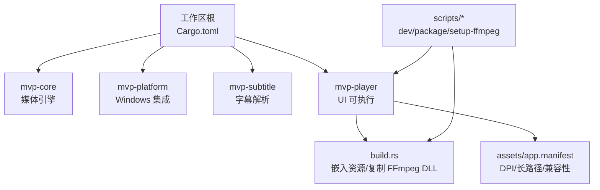
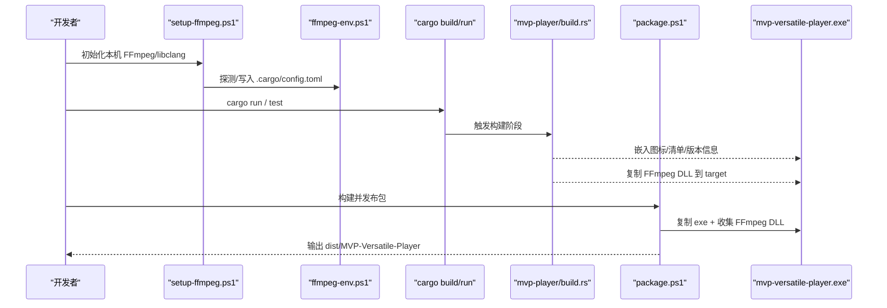
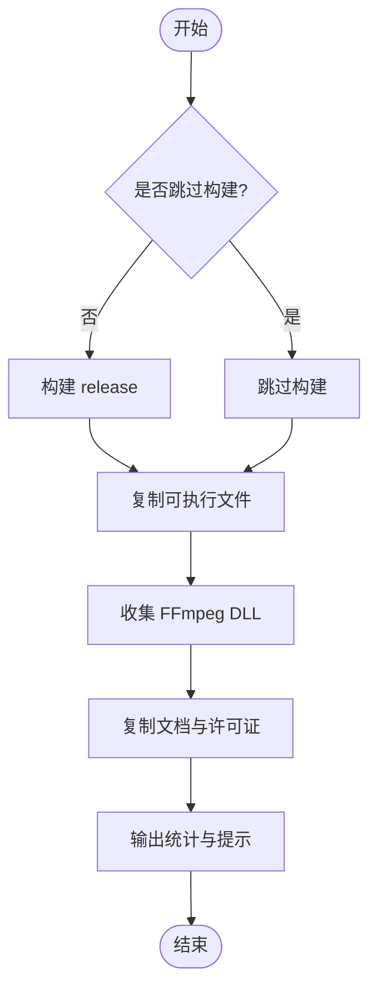
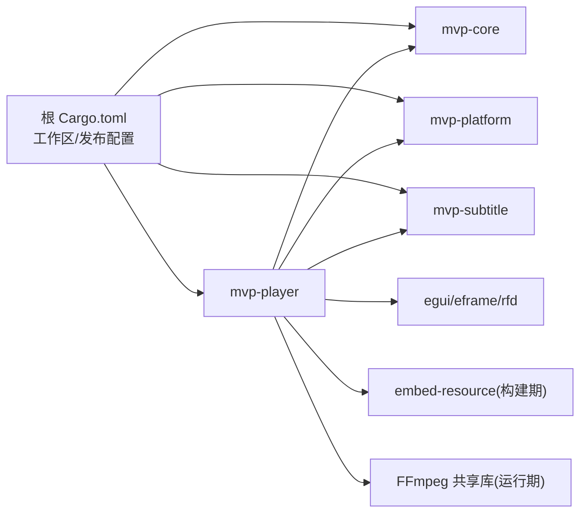

# 部署分发

<cite>
**本文引用的文件**
- [Cargo.toml](file://Cargo.toml)
- [assets/app.manifest](file://assets/app.manifest)
- [scripts/package.ps1](file://scripts/package.ps1)
- [scripts/ffmpeg-env.ps1](file://scripts/ffmpeg-env.ps1)
- [scripts/setup-ffmpeg.ps1](file://scripts/setup-ffmpeg.ps1)
- [scripts/dev.ps1](file://scripts/dev.ps1)
- [crates/mvp-player/Cargo.toml](file://crates/mvp-player/Cargo.toml)
- [crates/mvp-player/build.rs](file://crates/mvp-player/build.rs)
- [crates/mvp-platform/src/assoc.rs](file://crates/mvp-platform/src/assoc.rs)
- [README.md](file://README.md)
</cite>

## 目录
1. [简介](#简介)
2. [项目结构](#项目结构)
3. [核心组件](#核心组件)
4. [架构总览](#架构总览)
5. [详细组件分析](#详细组件分析)
6. [依赖关系分析](#依赖关系分析)
7. [性能与构建优化](#性能与构建优化)
8. [故障排查指南](#故障排查指南)
9. [结论](#结论)
10. [附录：渠道与自动化模板](#附录渠道与自动化模板)

## 简介
本指南面向 MVP-Versatile-Player 的部署与分发，覆盖以下主题：
- 构建配置：Cargo 工作区、发布优化（LTO、codegen-units、strip）
- 打包脚本：依赖收集、DLL 复制、安装包制作流程
- 运行时依赖管理：FFmpeg DLL 分发、系统要求、权限说明
- 应用程序清单：UAC、DPI/长路径、程序图标、版本信息
- 版本管理、签名验证、更新机制建议
- 分发渠道：便携版、安装器、Microsoft Store 等
- 部署自动化与环境配置模板

## 项目结构
仓库采用 Cargo 工作区组织，包含核心引擎、平台集成、字幕解析与播放器 UI。构建与打包由 PowerShell 脚本驱动，Windows 资源通过构建脚本嵌入。

图表来源
- [Cargo.toml:1-15](file://Cargo.toml#L1-L15)
- [crates/mvp-player/Cargo.toml:1-12](file://crates/mvp-player/Cargo.toml#L1-L12)
- [crates/mvp-player/build.rs:60-79](file://crates/mvp-player/build.rs#L60-L79)
- [assets/app.manifest:1-28](file://assets/app.manifest#L1-L28)
- [scripts/package.ps1:1-14](file://scripts/package.ps1#L1-L14)

章节来源
- [Cargo.toml:1-15](file://Cargo.toml#L1-L15)
- [README.md:595-609](file://README.md#L595-L609)

## 核心组件
- 工作区与发布配置：统一版本、发行目标、优化选项
- 构建脚本：生成并编译 Windows 资源（图标、清单、版本信息），拷贝 FFmpeg 运行时 DLL
- 打包脚本：构建发布产物、收集 FFmpeg DLL、输出便携包
- 环境准备：自动发现/下载 FFmpeg 开发包与 libclang，写入本地 .cargo/config.toml
- 运行期集成：文件关联、能力注册、上下文菜单（仅 HKCU，无需 UAC）

章节来源
- [Cargo.toml:10-78](file://Cargo.toml#L10-L78)
- [crates/mvp-player/build.rs:60-129](file://crates/mvp-player/build.rs#L60-L129)
- [scripts/package.ps1:1-79](file://scripts/package.ps1#L1-L79)
- [scripts/setup-ffmpeg.ps1:1-224](file://scripts/setup-ffmpeg.ps1#L1-L224)
- [crates/mvp-platform/src/assoc.rs:1-200](file://crates/mvp-platform/src/assoc.rs#L1-L200)

## 架构总览
下图展示从“环境准备”到“构建/打包/运行”的端到端流程，以及关键工件与依赖。

图表来源
- [scripts/setup-ffmpeg.ps1:152-213](file://scripts/setup-ffmpeg.ps1#L152-L213)
- [scripts/ffmpeg-env.ps1:43-72](file://scripts/ffmpeg-env.ps1#L43-L72)
- [crates/mvp-player/build.rs:60-129](file://crates/mvp-player/build.rs#L60-L129)
- [scripts/package.ps1:27-79](file://scripts/package.ps1#L27-L79)

## 详细组件分析

### 构建配置与工作区
- 工作区成员：core、platform、subtitle、player
- 统一版本与元数据：workspace.package.version/edition/rust-version/license/description
- 发布优化：opt-level=3、lto=fat、codegen-units=1、incremental=false、strip=symbols、debug=false
- 开发体验：dev opt-level=1，依赖 opt-level=2，提升迭代速度

章节来源
- [Cargo.toml:1-15](file://Cargo.toml#L1-L15)
- [Cargo.toml:53-78](file://Cargo.toml#L53-L78)

### 应用清单与资源嵌入
- app.manifest 启用每显示器 DPI 感知（PerMonitorV2）、长路径支持、UTF-8 代码页、多系统兼容
- build.rs 生成 .rc 并调用 embed-resource 编译资源：
  - 语言与子语言固定为简体中文，保证资源确定性
  - 版本号来自 CARGO_PKG_VERSION，确保 Explorer 与内部一致
  - 强制 manifest 存在，否则构建失败
- 非 Windows 平台跳过资源编译

章节来源
- [assets/app.manifest:1-28](file://assets/app.manifest#L1-L28)
- [crates/mvp-player/build.rs:18-79](file://crates/mvp-player/build.rs#L18-L79)
- [crates/mvp-player/build.rs:81-132](file://crates/mvp-player/build.rs#L81-L132)
- [crates/mvp-player/build.rs:134-181](file://crates/mvp-player/build.rs#L134-L181)

### FFmpeg 运行时与依赖收集
- 链接时通过 FFMPEG_DIR 查找头文件与导入库；运行时需要 bin/*.dll
- build.rs 在构建时将 FFmpeg DLL 复制到 target 对应目录，使 cargo run/test 免 PATH 即可运行
- package.ps1 将 release 可执行与 FFmpeg DLL、许可证文档一起复制到 dist 目录，形成便携包
- ffmpeg-env.ps1 提供统一的 FFmpeg 与 libclang 探测逻辑，避免重复实现

章节来源
- [crates/mvp-player/build.rs:183-233](file://crates/mvp-player/build.rs#L183-L233)
- [scripts/package.ps1:43-66](file://scripts/package.ps1#L43-L66)
- [scripts/ffmpeg-env.ps1:59-72](file://scripts/ffmpeg-env.ps1#L59-L72)

### 环境准备与本地配置
- setup-ffmpeg.ps1 负责：
  - 下载或复用 FFmpeg 共享开发包（含 include/lib/bin）
  - 探测 libclang（优先 pip 安装的 clang/native）
  - 写入 .cargo/config.toml 的 env 段（FFMPEG_DIR、LIBCLANG_PATH、BINDGEN_EXTRA_CLANG_ARGS）
  - 安全重试下载、进度静默、解压校验
- dev.ps1 在运行 cargo 前注入 PATH 与 FFMPEG_DIR，便于测试与调试

章节来源
- [scripts/setup-ffmpeg.ps1:1-224](file://scripts/setup-ffmpeg.ps1#L1-L224)
- [scripts/dev.ps1:1-72](file://scripts/dev.ps1#L1-L72)
- [scripts/ffmpeg-env.ps1:74-171](file://scripts/ffmpeg-env.ps1#L74-L171)

### 文件关联与权限模型
- 所有注册操作仅写入 HKCU（当前用户），不触发 UAC，可逆且安全
- 支持视频/音频/图片/播放列表扩展名注册，并提供“默认应用”设置跳转
- 报告是否需要用户确认（Windows 8+ 受保护区域）

章节来源
- [crates/mvp-platform/src/assoc.rs:1-200](file://crates/mvp-platform/src/assoc.rs#L1-L200)
- [crates/mvp-platform/src/assoc.rs:717-753](file://crates/mvp-platform/src/assoc.rs#L717-L753)

### 打包流程与产物
- package.ps1 参数：
  - -SkipBuild：跳过构建，直接使用已有 release 产物
  - -Output：指定输出目录（默认 dist/MVP-Versatile-Player）
- 步骤：
  - 调用 dev.ps1 构建 release
  - 复制 mvp-versatile-player.exe
  - 收集 FFmpeg DLL（bin/*.dll）
  - 复制 README/LICENCE/FFmpeg 许可证
  - 打印大小统计与使用说明

图表来源
- [scripts/package.ps1:10-79](file://scripts/package.ps1#L10-L79)

章节来源
- [scripts/package.ps1:1-79](file://scripts/package.ps1#L1-L79)

## 依赖关系分析
- 工作区依赖集中声明于根 Cargo.toml，各 crate 通过 workspace.dependencies 引用
- mvp-player 依赖 mvp-core、mvp-platform、mvp-subtitle 及 GUI 框架
- 构建期依赖 embed-resource 用于资源编译
- 运行期依赖 FFmpeg 共享库（动态加载）

图表来源
- [Cargo.toml:17-52](file://Cargo.toml#L17-L52)
- [crates/mvp-player/Cargo.toml:13-38](file://crates/mvp-player/Cargo.toml#L13-L38)

章节来源
- [Cargo.toml:17-52](file://Cargo.toml#L17-L52)
- [crates/mvp-player/Cargo.toml:1-38](file://crates/mvp-player/Cargo.toml#L1-L38)

## 性能与构建优化
- LTO=fat：最大化跨 crate 内联与优化，减小体积并提升启动性能
- codegen-units=1：单线程编译单元，利于优化但增加编译时间
- strip=symbols：移除符号表，减小二进制体积
- incremental=false：关闭增量以换取更彻底的优化
- dev 配置保留快速迭代：依赖 opt-level=2，crate 自身 opt-level=1

建议
- CI 构建使用 --release 并缓存目标目录
- 如需更快构建，可在本地临时调整 codegen-units（不建议提交）
- 对大依赖进行按需特性裁剪（如 eframe/egui 已关闭默认字体）

章节来源
- [Cargo.toml:53-78](file://Cargo.toml#L53-L78)

## 故障排查指南
常见问题与定位要点：
- 找不到 FFmpeg 开发包
  - 现象：构建或打包时报错提示未找到 FFmpeg
  - 处理：运行 setup-ffmpeg.ps1 或使用 -FfmpegDir 指向已有目录
  - 参考：[scripts/setup-ffmpeg.ps1:115-150](file://scripts/setup-ffmpeg.ps1#L115-L150)
- 缺少 libclang
  - 现象：bindgen 阶段失败
  - 处理：安装 LLVM 或 pip install libclang，脚本会自动探测
  - 参考：[scripts/ffmpeg-env.ps1:74-171](file://scripts/ffmpeg-env.ps1#L74-L171)
- 运行时报 DLL 缺失
  - 现象：cargo run 或双击 exe 报找不到 DLL
  - 处理：确保 FFmpeg DLL 与 exe 同目录；检查 build.rs 是否成功复制
  - 参考：[crates/mvp-player/build.rs:183-233](file://crates/mvp-player/build.rs#L183-L233)
- 资源未生效（无图标/无版本）
  - 现象：Explorer 显示默认图标，版本为空
  - 处理：确认 assets/icon.ico 与 app.manifest 存在；Windows SDK 可用
  - 参考：[crates/mvp-player/build.rs:81-129](file://crates/mvp-player/build.rs#L81-L129)
- 文件关联无效或被系统覆盖
  - 现象：注册后仍无法打开
  - 处理：在“默认应用”中确认；必要时引导用户手动设置
  - 参考：[crates/mvp-platform/src/assoc.rs:1-200](file://crates/mvp-platform/src/assoc.rs#L1-L200)

章节来源
- [scripts/setup-ffmpeg.ps1:115-150](file://scripts/setup-ffmpeg.ps1#L115-L150)
- [scripts/ffmpeg-env.ps1:74-171](file://scripts/ffmpeg-env.ps1#L74-L171)
- [crates/mvp-player/build.rs:81-129](file://crates/mvp-player/build.rs#L81-L129)
- [crates/mvp-player/build.rs:183-233](file://crates/mvp-player/build.rs#L183-L233)
- [crates/mvp-platform/src/assoc.rs:1-200](file://crates/mvp-platform/src/assoc.rs#L1-L200)

## 结论
本项目通过工作区与脚本化构建实现了“零安装、即拷即用”的便携分发模式。发布构建采用强优化策略，结合资源嵌入与 FFmpeg 运行时随包分发，确保用户体验与体积平衡。文件关联与能力注册遵循最小权限原则，仅在 HKCU 下操作，避免 UAC 干扰。后续可按需扩展签名、更新与商店渠道。

## 附录：渠道与自动化模板

### 便携版（推荐）
- 命令示例
  - 首次环境准备：.\scripts\setup-ffmpeg.ps1
  - 构建并打包：.\scripts\package.ps1
  - 跳过构建直接打包：.\scripts\package.ps1 -SkipBuild -Output "dist\MyRelease"
- 产物：dist/MVP-Versatile-Player（exe + FFmpeg DLL + 许可证）
- 适用：个人分发、内网部署、快速交付

章节来源
- [scripts/package.ps1:1-79](file://scripts/package.ps1#L1-L79)
- [scripts/setup-ffmpeg.ps1:1-224](file://scripts/setup-ffmpeg.ps1#L1-L224)

### 安装器（可选）
- 基于便携包内容，使用第三方安装器（如 Inno Setup、NSIS）封装
- 建议步骤
  - 先执行 package.ps1 生成便携包
  - 在安装器中复制便携包内容到目标目录
  - 可选：调用 mvp-platform 提供的文件关联接口完成注册
- 注意：保持与便携包一致的 FFmpeg 版本与许可证文件

章节来源
- [scripts/package.ps1:43-66](file://scripts/package.ps1#L43-L66)
- [crates/mvp-platform/src/assoc.rs:1-200](file://crates/mvp-platform/src/assoc.rs#L1-L200)

### Microsoft Store（规划）
- 当前为桌面共享库直连方案，Store 分发需评估沙箱与文件系统限制
- 建议
  - 将 FFmpeg 作为 Side-by-Side 组件或按 Store 要求重新打包静态库
  - 使用 MSIX 打包，并在清单中声明所需功能与协议
  - 文件关联通过 AppX 能力注册（需在 Store 流程中配置）
- 风险：GPL 组件与 Store 许可政策需合规审查

章节来源
- [README.md:586-593](file://README.md#L586-L593)

### 版本管理与签名
- 版本来源：CARGO_PKG_VERSION（由工作区统一维护）
- 资源版本：build.rs 将 FILEVERSION/PRODUCTVERSION 写入可执行文件
- 建议
  - 使用 Git 标签与 CI 流水线统一打号
  - 使用 signtool 对最终产物进行代码签名（证书管理见企业规范）
  - 在 CI 中固化签名步骤，确保签名链完整

章节来源
- [crates/mvp-player/build.rs:40-58](file://crates/mvp-player/build.rs#L40-L58)
- [crates/mvp-player/build.rs:134-181](file://crates/mvp-player/build.rs#L134-L181)

### 更新机制（建议）
- 轻量级自更新：比较远程版本与本地版本，差异下载补丁或全量包
- 校验：下载后校验哈希与签名
- 回滚：保留上一版本目录，失败时回滚
- 注意：若使用安装器/Store，请遵循各自更新策略

[本节为通用建议，不直接引用具体源码]

### 部署自动化脚本与环境模板
- 开发机一键准备
  - 运行 setup-ffmpeg.ps1 完成 FFmpeg 与 libclang 配置
  - 使用 dev.ps1 包装 cargo 命令，自动注入 PATH
- CI 流水线模板（概念）
  - 步骤1：setup-ffmpeg.ps1（允许 NoDownload，复用缓存）
  - 步骤2：cargo build --release -p mvp-player
  - 步骤3：scripts/package.ps1 -SkipBuild
  - 步骤4：上传 dist 产物与日志
- 环境变量模板
  - FFMPEG_DIR：指向 FFmpeg 开发包根目录（可选，优先于配置文件）
  - LIBCLANG_PATH：指向 libclang.dll 所在目录（可选）
  - PSNativeCommandUseErrorActionPreference：PowerShell 7.4+ 行为控制（脚本内部已处理）

章节来源
- [scripts/dev.ps1:1-72](file://scripts/dev.ps1#L1-L72)
- [scripts/ffmpeg-env.ps1:43-72](file://scripts/ffmpeg-env.ps1#L43-L72)
- [scripts/setup-ffmpeg.ps1:172-213](file://scripts/setup-ffmpeg.ps1#L172-L213)