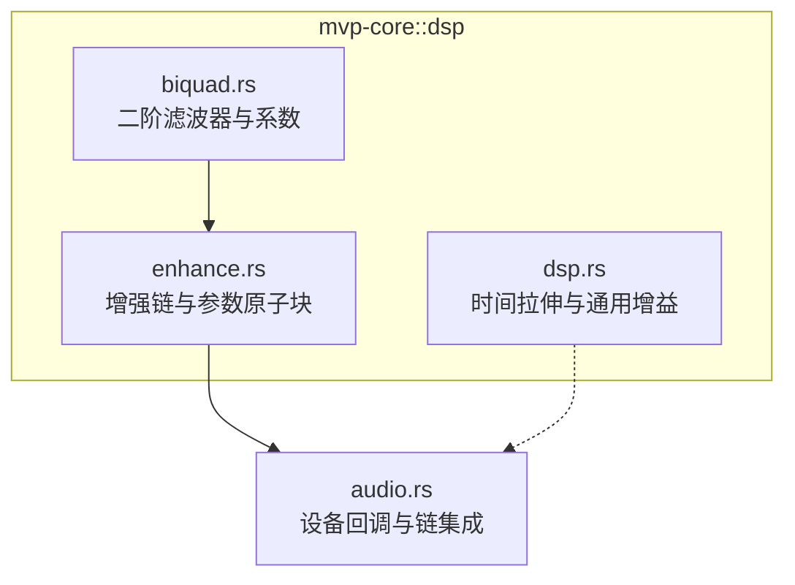
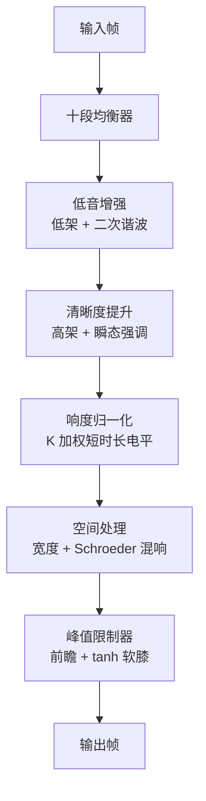
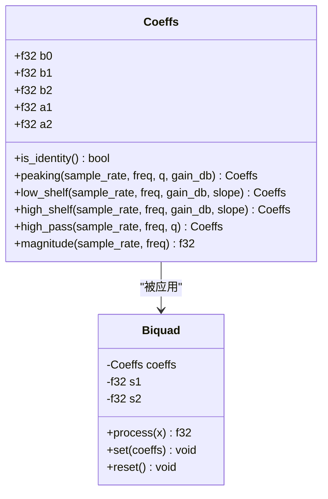
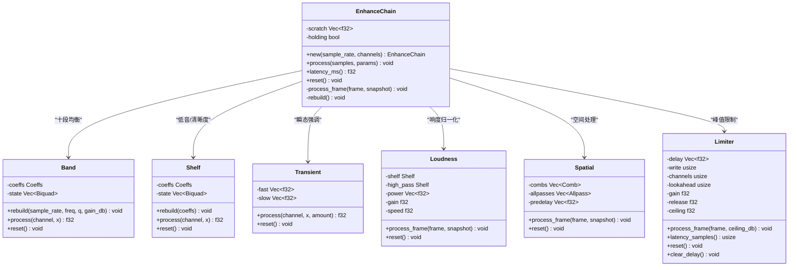
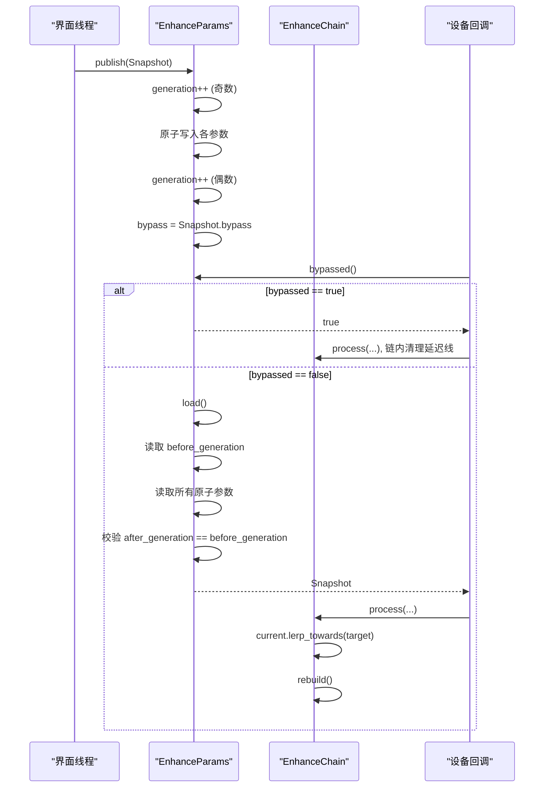
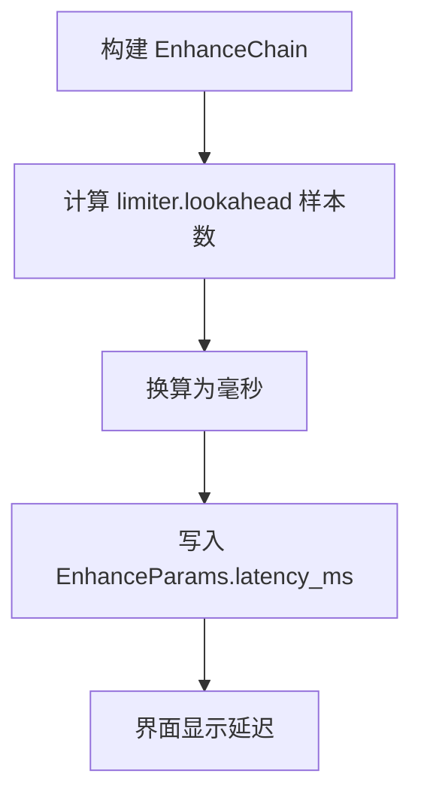
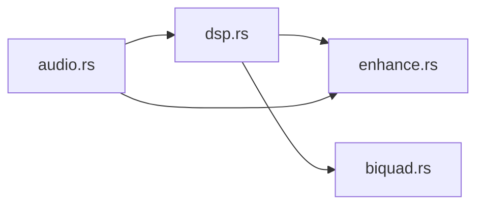
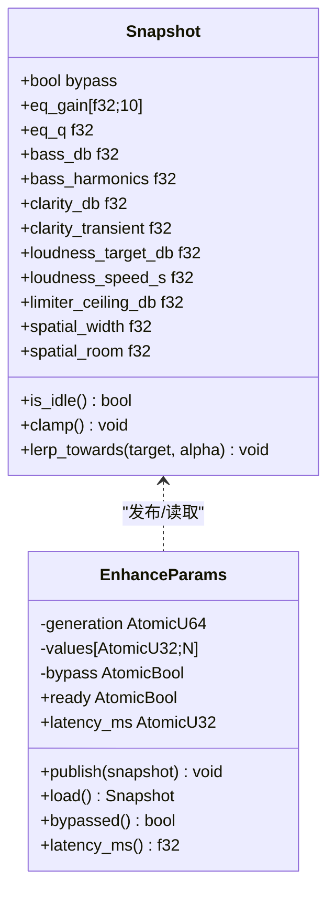
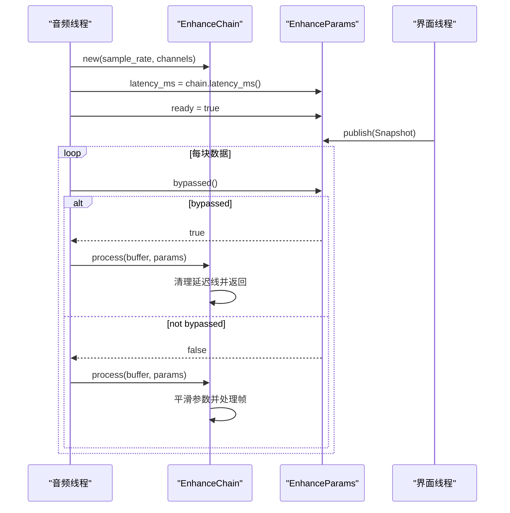

# DSP 链管理

<cite>
**本文引用的文件**   
- [crates/mvp-core/src/dsp.rs](file://crates/mvp-core/src/dsp.rs)
- [crates/mvp-core/src/dsp/biquad.rs](file://crates/mvp-core/src/dsp/biquad.rs)
- [crates/mvp-core/src/dsp/enhance.rs](file://crates/mvp-core/src/dsp/enhance.rs)
- [crates/mvp-core/src/audio.rs](file://crates/mvp-core/src/audio.rs)
</cite>

## 目录
1. [引言](#引言)
2. [项目结构](#项目结构)
3. [核心组件](#核心组件)
4. [架构总览](#架构总览)
5. [详细组件分析](#详细组件分析)
6. [依赖关系分析](#依赖关系分析)
7. [性能与实时性](#性能与实时性)
8. [延迟管理与补偿](#延迟管理与补偿)
9. [配置接口与状态监控](#配置接口与状态监控)
10. [故障恢复与健壮性](#故障恢复与健壮性)
11. [集成与使用示例](#集成与使用示例)
12. [结论](#结论)

## 引言
本技术文档围绕 mvp-versatile-player 中的音频增强子系统，系统化说明“DSP 链管理”的整体设计：从均衡器、低音增强、清晰度提升、响度归一化、空间处理到峰值限制器的执行顺序；从原子参数更新、世代计数器与快照模式，到零分配处理、SIMD 友好结构与缓存友好的数据布局；从延迟测量与上报，到线程安全、故障恢复与可观测性。目标是让非专业读者也能理解系统如何保证低延迟、高保真和稳定运行，同时为开发者提供可直接落地的集成路径。

## 项目结构
DSP 相关代码集中在 `mvp-core` 的 `dsp` 模块中，分为三层：
- 基础信号处理单元：二阶滤波器（Biquad）及其系数计算。
- 增强链：将多个处理阶段组合成一条无分配、可平滑切换的实时处理管线。
- 顶层时间拉伸与增益工具：用于变速播放与音量软膝控制。

**图表来源**
- [crates/mvp-core/src/dsp.rs:13-19](file://crates/mvp-core/src/dsp.rs#L13-L19)
- [crates/mvp-core/src/dsp/biquad.rs:1-12](file://crates/mvp-core/src/dsp/biquad.rs#L1-L12)
- [crates/mvp-core/src/dsp/enhance.rs:1-33](file://crates/mvp-core/src/dsp/enhance.rs#L1-L33)
- [crates/mvp-core/src/audio.rs:325-350](file://crates/mvp-core/src/audio.rs#L325-L350)

**章节来源**
- [crates/mvp-core/src/dsp.rs:1-20](file://crates/mvp-core/src/dsp.rs#L1-L20)
- [crates/mvp-core/src/dsp/biquad.rs:1-12](file://crates/mvp-core/src/dsp/biquad.rs#L1-L12)
- [crates/mvp-core/src/dsp/enhance.rs:1-33](file://crates/mvp-core/src/dsp/enhance.rs#L1-L33)
- [crates/mvp-core/src/audio.rs:325-350](file://crates/mvp-core/src/audio.rs#L325-L350)

## 核心组件
- 二阶滤波器与系数：实现 RBJ 配方的峰化、低通/高通、高低架等变换，并提供恒等系数以跳过计算。
- 增强链：封装十段均衡、低音谐波、清晰度瞬态、K 加权响度、空间混响与峰值限制器，提供零分配、可平滑切换的处理入口。
- 参数原子块：通过原子值加世代计数器的 seqlock 机制，向实时线程发布一致的参数快照。
- 时间拉伸与增益：SOLA 时间拉伸与软膝增益，作为播放器层面的辅助 DSP。

**章节来源**
- [crates/mvp-core/src/dsp/biquad.rs:16-74](file://crates/mvp-core/src/dsp/biquad.rs#L16-L74)
- [crates/mvp-core/src/dsp/enhance.rs:58-105](file://crates/mvp-core/src/dsp/enhance.rs#L58-L105)
- [crates/mvp-core/src/dsp/enhance.rs:213-239](file://crates/mvp-core/src/dsp/enhance.rs#L213-L239)
- [crates/mvp-core/src/dsp.rs:21-78](file://crates/mvp-core/src/dsp.rs#L21-L78)
- [crates/mvp-core/src/dsp.rs:302-355](file://crates/mvp-core/src/dsp.rs#L302-L355)

## 架构总览
增强链的执行顺序是刻意设计的：先做用户可见的频域整形，再做低频/高频增强，随后进行响度归一化，再添加空间尾音，最后用带前瞻的峰值限制器封顶。这样既保证曲线可视化与首段处理一致，又避免后续阶段对前面的调节产生二次扰动。

**图表来源**
- [crates/mvp-core/src/dsp/enhance.rs:10-26](file://crates/mvp-core/src/dsp/enhance.rs#L10-L26)
- [crates/mvp-core/src/dsp/enhance.rs:1058-1077](file://crates/mvp-core/src/dsp/enhance.rs#L1058-L1077)

**章节来源**
- [crates/mvp-core/src/dsp/enhance.rs:10-26](file://crates/mvp-core/src/dsp/enhance.rs#L10-L26)
- [crates/mvp-core/src/dsp/enhance.rs:1058-1077](file://crates/mvp-core/src/dsp/enhance.rs#L1058-L1077)

## 详细组件分析

### 二阶滤波器与系数
- 系数类型：标准化后的五元组，支持恒等系数判断，异常输入回退到恒等，确保稳定性。
- 滤波器类型：峰化、低架、高架、高通，对应均衡、低音、清晰度与响度 K 加权。
- 单样本处理：转置直接形式 II，每样本四次乘法，双状态变量，适合 SIMD 展开与缓存局部性。
- 数值安全：检测非有限值并重置状态，防止 NaN/Inf 污染整段会话。

**图表来源**
- [crates/mvp-core/src/dsp/biquad.rs:16-74](file://crates/mvp-core/src/dsp/biquad.rs#L16-L74)
- [crates/mvp-core/src/dsp/biquad.rs:172-210](file://crates/mvp-core/src/dsp/biquad.rs#L172-L210)

**章节来源**
- [crates/mvp-core/src/dsp/biquad.rs:16-74](file://crates/mvp-core/src/dsp/biquad.rs#L16-L74)
- [crates/mvp-core/src/dsp/biquad.rs:172-210](file://crates/mvp-core/src/dsp/biquad.rs#L172-L210)

### 增强链与处理阶段
增强链由以下子阶段组成：
- 十段均衡：按固定中心频率排列，系数按当前平滑参数重建。
- 低音增强：低架滤波 + 二次谐波非线性项，增强小音箱缺失的低频基音暗示。
- 清晰度提升：高架滤波 + 快慢包络差分的瞬态强调，突出起音。
- 响度归一化：K 加权两节滤波器后估计短时功率，缓慢调整增益，目标低于阈值时自动回归单位增益。
- 空间处理：中侧宽度控制 + Schroeder 混响（多梳状延迟 + 全通扩散），仅在前两通道工作，保持多声道定位。
- 峰值限制器：前瞻缓冲 + 跨通道共享衰减 + tanh 软膝，确保任何阶段都不会把过载送到设备。

**图表来源**
- [crates/mvp-core/src/dsp/enhance.rs:323-403](file://crates/mvp-core/src/dsp/enhance.rs#L323-L403)
- [crates/mvp-core/src/dsp/enhance.rs:405-437](file://crates/mvp-core/src/dsp/enhance.rs#L405-L437)
- [crates/mvp-core/src/dsp/enhance.rs:439-512](file://crates/mvp-core/src/dsp/enhance.rs#L439-L512)
- [crates/mvp-core/src/dsp/enhance.rs:642-798](file://crates/mvp-core/src/dsp/enhance.rs#L642-L798)
- [crates/mvp-core/src/dsp/enhance.rs:828-916](file://crates/mvp-core/src/dsp/enhance.rs#L828-L916)
- [crates/mvp-core/src/dsp/enhance.rs:934-1104](file://crates/mvp-core/src/dsp/enhance.rs#L934-L1104)

**章节来源**
- [crates/mvp-core/src/dsp/enhance.rs:323-403](file://crates/mvp-core/src/dsp/enhance.rs#L323-L403)
- [crates/mvp-core/src/dsp/enhance.rs:405-437](file://crates/mvp-core/src/dsp/enhance.rs#L405-L437)
- [crates/mvp-core/src/dsp/enhance.rs:439-512](file://crates/mvp-core/src/dsp/enhance.rs#L439-L512)
- [crates/mvp-core/src/dsp/enhance.rs:642-798](file://crates/mvp-core/src/dsp/enhance.rs#L642-L798)
- [crates/mvp-core/src/dsp/enhance.rs:828-916](file://crates/mvp-core/src/dsp/enhance.rs#L828-L916)
- [crates/mvp-core/src/dsp/enhance.rs:934-1104](file://crates/mvp-core/src/dsp/enhance.rs#L934-L1104)

### 无锁参数更新：原子操作、世代计数器与快照模式
参数通过 `EnhanceParams` 暴露给界面线程写入，设备回调线程读取。关键机制：
- 原子值数组：每个参数以 `AtomicU32` 存储 `f32` 的位表示，避免浮点原子语义问题。
- 世代计数器：写端在开始写入前递增奇数世代，写完所有字段后再递增偶数世代；读端检查奇偶，若奇数则自旋重试，直到读到一致快照。
- 快速旁路：独立的 `AtomicBool` bypass 标志允许回调第一时间跳过整个链，连参数块都不访问。
- 平滑过渡：链内部维护 `current` 快照，按时间比例向目标 `Snapshot` 线性插值，避免滑块拖动时的阶梯噪声。

**图表来源**
- [crates/mvp-core/src/dsp/enhance.rs:241-320](file://crates/mvp-core/src/dsp/enhance.rs#L241-L320)
- [crates/mvp-core/src/dsp/enhance.rs:992-1018](file://crates/mvp-core/src/dsp/enhance.rs#L992-L1018)

**章节来源**
- [crates/mvp-core/src/dsp/enhance.rs:206-320](file://crates/mvp-core/src/dsp/enhance.rs#L206-L320)
- [crates/mvp-core/src/dsp/enhance.rs:992-1018](file://crates/mvp-core/src/dsp/enhance.rs#L992-L1018)

### 延迟管理与补偿
- 延迟来源：只有峰值限制器的前瞻缓冲引入真实延迟；空间混响是湿信号叠加，不增加延迟。
- 延迟测量：`Limiter::latency_samples()` 返回前瞻样本数，`EnhanceChain::latency_ms()` 将其换算为毫秒。
- 延迟上报：音频初始化时，设备回调构建链并将延迟写入 `EnhanceParams.latency_ms`，界面据此显示。
- 延迟补偿：文档未实现显式的时间戳对齐或队列补偿；延迟主要用于 UI 展示与感知一致性。

**图表来源**
- [crates/mvp-core/src/dsp/enhance.rs:859-861](file://crates/mvp-core/src/dsp/enhance.rs#L859-L861)
- [crates/mvp-core/src/dsp/enhance.rs:980-989](file://crates/mvp-core/src/dsp/enhance.rs#L980-L989)
- [crates/mvp-core/src/audio.rs:346-350](file://crates/mvp-core/src/audio.rs#L346-L350)

**章节来源**
- [crates/mvp-core/src/dsp/enhance.rs:828-916](file://crates/mvp-core/src/dsp/enhance.rs#L828-L916)
- [crates/mvp-core/src/dsp/enhance.rs:980-989](file://crates/mvp-core/src/dsp/enhance.rs#L980-L989)
- [crates/mvp-core/src/audio.rs:346-350](file://crates/mvp-core/src/audio.rs#L346-L350)

### 性能优化策略
- 零分配处理：链在 `new` 时一次性分配所有缓冲区，`process` 只复用 scratch 帧，不在回调中分配内存。
- 跳过恒等路径：当系数为恒等或参数处于中性位置时，直接返回原样，避免无用计算。
- 缓存友好布局：每通道一个滤波器状态向量，按通道索引访问，减少跨步访问。
- 轻量级算法：二阶滤波器每样本四次乘加；混响采用梳状延迟与全通网络，避免长卷积。
- 平滑而非逐样本重算：参数平滑发生在块级别，避免频繁重建系数导致“拉链噪声”。
- SIMD 利用：代码未显式使用 SIMD 指令，但数据结构与循环形态便于编译器自动矢量化。

**章节来源**
- [crates/mvp-core/src/dsp/enhance.rs:1-9](file://crates/mvp-core/src/dsp/enhance.rs#L1-L9)
- [crates/mvp-core/src/dsp/enhance.rs:108-118](file://crates/mvp-core/src/dsp/enhance.rs#L108-L118)
- [crates/mvp-core/src/dsp/enhance.rs:338-347](file://crates/mvp-core/src/dsp/enhance.rs#L338-L347)
- [crates/mvp-core/src/dsp/enhance.rs:934-978](file://crates/mvp-core/src/dsp/enhance.rs#L934-L978)
- [crates/mvp-core/src/dsp/biquad.rs:1-12](file://crates/mvp-core/src/dsp/biquad.rs#L1-L12)

## 依赖关系分析
- `dsp.rs` 导出时间拉伸与通用增益，并重新导出增强链相关类型。
- `enhance.rs` 依赖 `biquad.rs` 的滤波器与系数。
- `audio.rs` 在设备回调中创建 `EnhanceChain`，并在每块数据上调用 `process`，同时将延迟与就绪状态写入 `EnhanceParams`。

**图表来源**
- [crates/mvp-core/src/dsp.rs:13-19](file://crates/mvp-core/src/dsp.rs#L13-L19)
- [crates/mvp-core/src/dsp/enhance.rs:34-36](file://crates/mvp-core/src/dsp/enhance.rs#L34-L36)
- [crates/mvp-core/src/audio.rs:34-35](file://crates/mvp-core/src/audio.rs#L34-L35)

**章节来源**
- [crates/mvp-core/src/dsp.rs:13-19](file://crates/mvp-core/src/dsp.rs#L13-L19)
- [crates/mvp-core/src/dsp/enhance.rs:34-36](file://crates/mvp-core/src/dsp/enhance.rs#L34-L36)
- [crates/mvp-core/src/audio.rs:34-35](file://crates/mvp-core/src/audio.rs#L34-L35)

## 性能与实时性
- 实时约束：设备回调不允许阻塞、分配、日志或文件系统访问；所有缓冲在构造期分配。
- 快速旁路：bypass 标志为一次 relaxed 加载，命中时直接清理延迟线并返回。
- 参数更新成本：publish 为多次 relaxed 存储，load 最多重试四次，避免极端情况下阻塞实时线程。
- 平滑窗口：参数平滑时间与采样率无关，按实际时间推进，避免不同驱动缓冲大小导致平滑速度差异。
- 数值安全：滤波器输出非有限值会触发重置，限制器使用软膝避免硬削波。

**章节来源**
- [crates/mvp-core/src/dsp/enhance.rs:1-9](file://crates/mvp-core/src/dsp/enhance.rs#L1-L9)
- [crates/mvp-core/src/dsp/enhance.rs:264-295](file://crates/mvp-core/src/dsp/enhance.rs#L264-L295)
- [crates/mvp-core/src/dsp/enhance.rs:992-1007](file://crates/mvp-core/src/dsp/enhance.rs#L992-L1007)
- [crates/mvp-core/src/dsp/biquad.rs:180-196](file://crates/mvp-core/src/dsp/biquad.rs#L180-L196)

## 延迟管理与补偿
- 延迟来源单一：仅限制器前瞻带来延迟；空间混响不贡献延迟。
- 延迟上报：链构造后立即计算并写入 `EnhanceParams.latency_ms`，界面据此显示。
- 补偿现状：未见显式的时间戳对齐或队列补偿逻辑；延迟主要用于 UI 提示与听感一致性。
- 建议扩展：如需严格同步，可在上游解码队列中加入基于延迟的偏移量，或在呈现层根据 `latency_ms` 调整播放头。

**章节来源**
- [crates/mvp-core/src/dsp/enhance.rs:980-989](file://crates/mvp-core/src/dsp/enhance.rs#L980-L989)
- [crates/mvp-core/src/audio.rs:346-350](file://crates/mvp-core/src/audio.rs#L346-L350)

## 配置接口与状态监控
- 参数快照：`Snapshot` 包含均衡、低音、清晰度、响度、限制器、空间等全部可调参数，并提供范围钳制与空闲检测。
- 参数发布：`EnhanceParams::publish` 将快照写入原子块，并设置 bypass 与 ready 状态。
- 参数读取：`EnhanceParams::load` 返回一致快照，供链内部平滑与重建系数。
- 状态监控：
  - `bypassed()`：快速旁路判断。
  - `ready`：链是否已为当前设备构建。
  - `latency_ms()`：链引入的延迟。
  - `is_idle()`：所有参数处于中性位置时可跳过处理。

**图表来源**
- [crates/mvp-core/src/dsp/enhance.rs:58-182](file://crates/mvp-core/src/dsp/enhance.rs#L58-L182)
- [crates/mvp-core/src/dsp/enhance.rs:213-320](file://crates/mvp-core/src/dsp/enhance.rs#L213-L320)

**章节来源**
- [crates/mvp-core/src/dsp/enhance.rs:58-182](file://crates/mvp-core/src/dsp/enhance.rs#L58-L182)
- [crates/mvp-core/src/dsp/enhance.rs:213-320](file://crates/mvp-core/src/dsp/enhance.rs#L213-L320)

## 故障恢复与健壮性
- 参数非法保护：`Snapshot::clamp` 将所有参数钳制到有效范围，NaN/Inf 不会进入滤波器。
- 滤波器稳定性：异常系数回退到恒等；滤波器输出非有限值时重置状态。
- 限制器安全：软膝限制确保峰值不超过天花板，且跨通道共享衰减避免声像漂移。
- 空间尾音清理：关闭空间效果或链旁路时清空延迟缓冲，避免旧尾音泄漏。
- 搜索与重置：时间拉伸与均衡链在 seek 后重置状态，避免陈旧能量影响新位置。

**章节来源**
- [crates/mvp-core/src/dsp/enhance.rs:120-138](file://crates/mvp-core/src/dsp/enhance.rs#L120-L138)
- [crates/mvp-core/src/dsp/biquad.rs:53-74](file://crates/mvp-core/src/dsp/biquad.rs#L53-L74)
- [crates/mvp-core/src/dsp/biquad.rs:180-196](file://crates/mvp-core/src/dsp/biquad.rs#L180-L196)
- [crates/mvp-core/src/dsp/enhance.rs:869-874](file://crates/mvp-core/src/dsp/enhance.rs#L869-L874)
- [crates/mvp-core/src/dsp.rs:100-103](file://crates/mvp-core/src/dsp.rs#L100-L103)

## 集成与使用示例
以下示例展示如何在播放器中集成 DSP 链：

- 在音频设备回调中构建链：
  - 使用设备采样率与声道数创建 `EnhanceChain`。
  - 将链延迟写入 `EnhanceParams.latency_ms`，并标记 `ready`。
  - 每块数据调用 `chain.process(buffer, &enhance)`。

- 在界面线程更新参数：
  - 构造 `Snapshot`，设置均衡、低音、清晰度、响度、空间与限制器参数。
  - 调用 `params.publish(snapshot)`，链会在下一次处理中平滑过渡。

- 旁路与空闲优化：
  - 若 `params.bypassed()` 为真，链会清理延迟线并返回，不做任何处理。
  - 若 `snapshot.is_idle()` 为真，链可跳过处理，保持比特透明。

**图表来源**
- [crates/mvp-core/src/audio.rs:346-350](file://crates/mvp-core/src/audio.rs#L346-L350)
- [crates/mvp-core/src/audio.rs:433-439](file://crates/mvp-core/src/audio.rs#L433-L439)
- [crates/mvp-core/src/dsp/enhance.rs:992-1007](file://crates/mvp-core/src/dsp/enhance.rs#L992-L1007)
- [crates/mvp-core/src/dsp/enhance.rs:241-320](file://crates/mvp-core/src/dsp/enhance.rs#L241-L320)

**章节来源**
- [crates/mvp-core/src/audio.rs:346-350](file://crates/mvp-core/src/audio.rs#L346-L350)
- [crates/mvp-core/src/audio.rs:433-439](file://crates/mvp-core/src/audio.rs#L433-L439)
- [crates/mvp-core/src/dsp/enhance.rs:992-1007](file://crates/mvp-core/src/dsp/enhance.rs#L992-L1007)
- [crates/mvp-core/src/dsp/enhance.rs:241-320](file://crates/mvp-core/src/dsp/enhance.rs#L241-L320)

## 结论
该 DSP 链管理系统以清晰的阶段划分、严格的实时约束与无分配设计为核心，实现了从频域整形到动态控制的完整音频增强流程。通过原子参数块与世代计数器，系统在界面线程与设备回调之间提供了线程安全的参数传递；通过平滑过渡与恒等路径跳过，保证了操控顺滑与极致透明；通过限制器与数值安全机制，确保了输出稳定与可预测。对于需要更高精度的延迟同步场景，可在上层队列或呈现层引入基于 `latency_ms` 的补偿策略，从而进一步完善端到端的时序一致性。