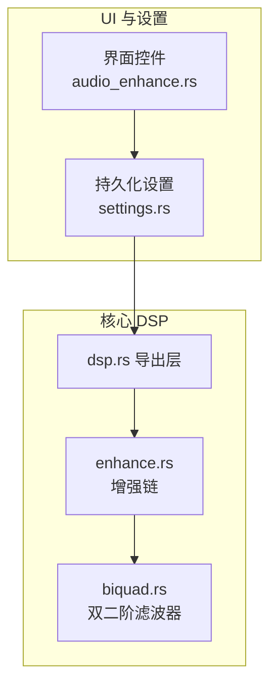
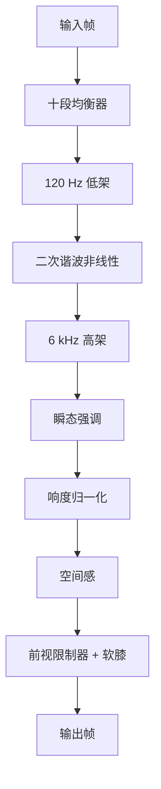
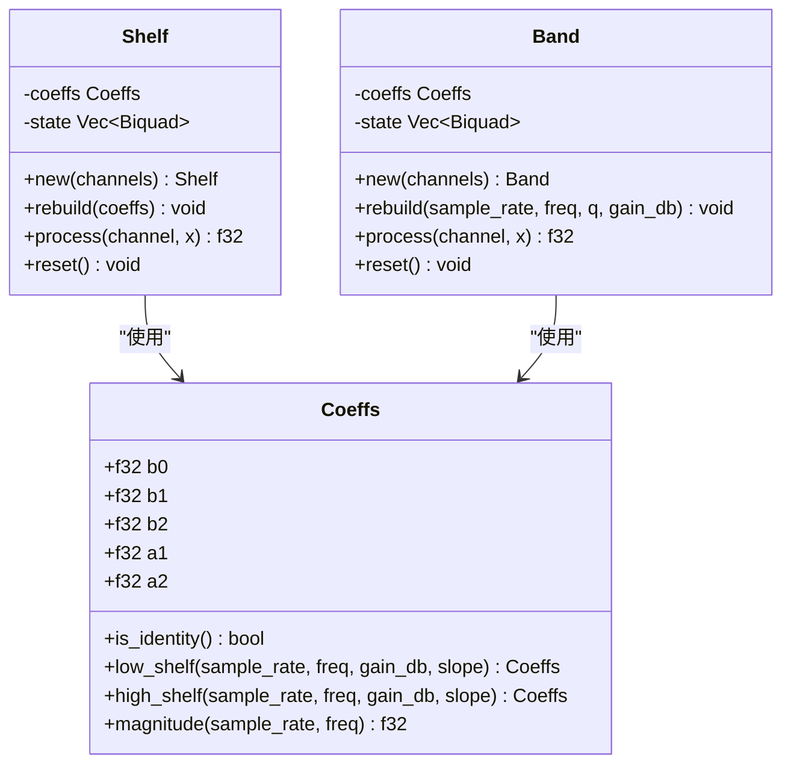
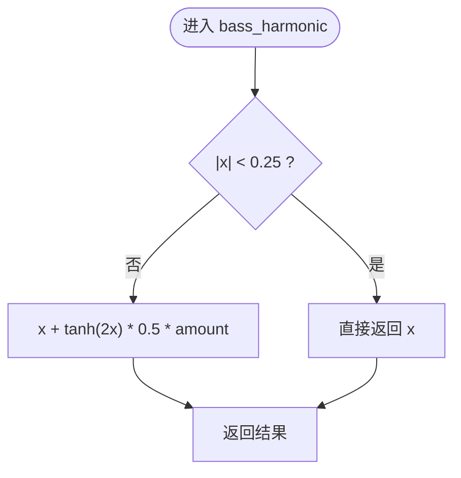
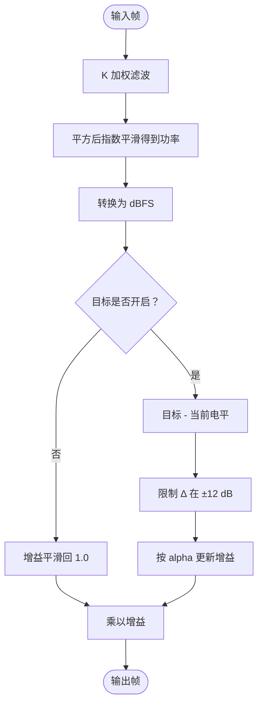
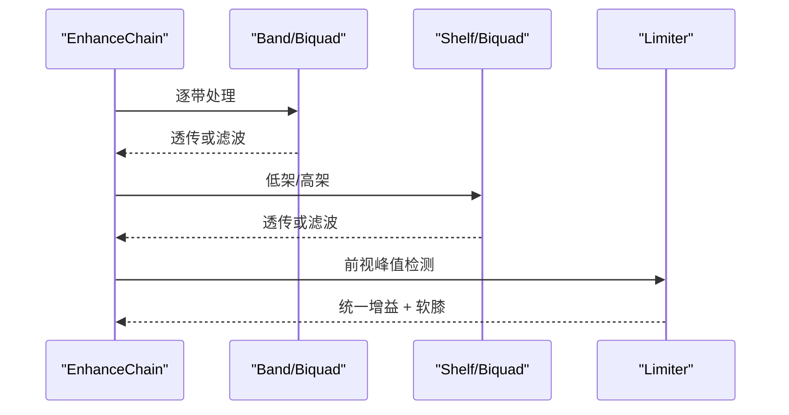
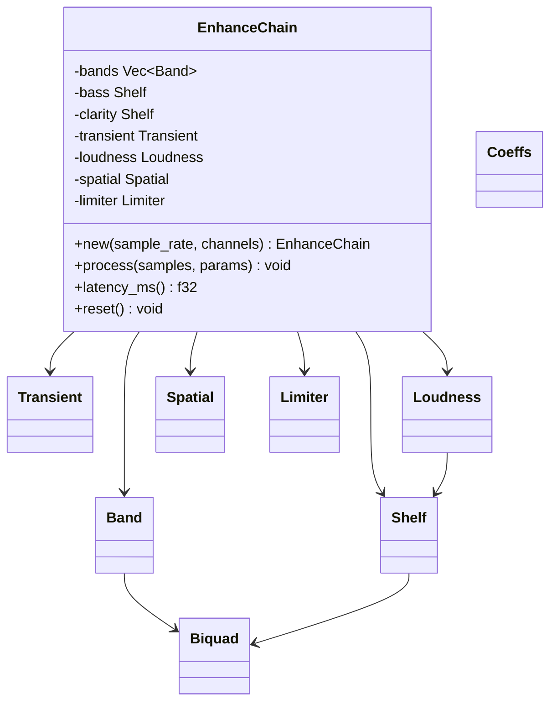

# 低音增强

<cite>
**本文引用的文件**   
- [enhance.rs](file://crates/mvp-core/src/dsp/enhance.rs)
- [biquad.rs](file://crates/mvp-core/src/dsp/biquad.rs)
- [dsp.rs](file://crates/mvp-core/src/dsp.rs)
- [README.md](file://README.md)
- [audio_enhance.rs](file://crates/mvp-player/src/ui/audio_enhance.rs)
- [settings.rs](file://crates/mvp-player/src/settings.rs)
</cite>

## 目录
1. [引言](#引言)
2. [项目结构](#项目结构)
3. [核心组件](#核心组件)
4. [架构总览](#架构总览)
5. [详细组件分析](#详细组件分析)
6. [依赖关系分析](#依赖关系分析)
7. [性能与实时性](#性能与实时性)
8. [音质评估与失真控制](#音质评估与失真控制)
9. [故障排查](#故障排查)
10. [结论](#结论)

## 引言
本文面向“低音增强”这一音频处理子系统，重点解释以下目标：
- 低架滤波器（low-shelf）的设计原理与 120 Hz 截止频率选择依据。
- 低音增益控制范围 0.0..=12.0 dB 的约束与实现位置。
- 二次谐波增强算法如何通过非线性处理产生低频谐波，从而提升小音箱的低音感知。
- 阈值检测、动态范围控制、相位保持等关键技术点。
- 低音增强与十段均衡器的协同工作方式，以及在整体音效链中的位置。
- 音质评估方法、失真控制策略与性能优化技巧。

该功能位于播放器核心 DSP 模块中，运行在设备回调线程，强调零分配、无锁参数传递、可旁路、可预测延迟。

**章节来源**
- [README.md:71-92](file://README.md#L71-L92)

## 项目结构
低音增强相关代码集中在 `mvp-core` 的 DSP 层：
- `dsp.rs`：导出公共类型，并包含时间拉伸与通用增益工具。
- `dsp/biquad.rs`：RBJ 双二阶滤波器系数与状态机，提供峰化、低架、高架、高通等滤波器。
- `dsp/enhance.rs`：音效增强链，包括十段均衡器、低音/清晰度架式滤波、瞬态增强、响度归一化、空间感与限制器。
- UI 与设置层将用户控件映射到 `Snapshot` 参数，并通过 `EnhanceParams` 发布到实时路径。

**图表来源**
- [dsp.rs:13-19](file://crates/mvp-core/src/dsp.rs#L13-L19)
- [enhance.rs:1-36](file://crates/mvp-core/src/dsp/enhance.rs#L1-L36)
- [biquad.rs:1-12](file://crates/mvp-core/src/dsp/biquad.rs#L1-L12)
- [audio_enhance.rs:161-188](file://crates/mvp-player/src/ui/audio_enhance.rs#L161-L188)
- [settings.rs:490-525](file://crates/mvp-player/src/settings.rs#L490-L525)

**章节来源**
- [dsp.rs:1-20](file://crates/mvp-core/src/dsp.rs#L1-L20)
- [enhance.rs:1-36](file://crates/mvp-core/src/dsp/enhance.rs#L1-L36)
- [biquad.rs:1-12](file://crates/mvp-core/src/dsp/biquad.rs#L1-L12)
- [audio_enhance.rs:161-188](file://crates/mvp-player/src/ui/audio_enhance.rs#L161-L188)
- [settings.rs:490-525](file://crates/mvp-player/src/settings.rs#L490-L525)

## 核心组件
- 十段均衡器：固定中心频率 31..16 kHz，每带 ±12 dB，Q 可调。
- 低音增强：120 Hz 低架 + 二次谐波非线性处理。
- 清晰度增强：6 kHz 高架 + 瞬态强调。
- 响度归一化：K 加权短时电平，向目标缓慢逼近。
- 空间感：中侧宽度 + Schroeder 残响（梳状+全通）。
- 限制器：前视峰值限制 + −3 dBFS 软膝，链尾保护。

关键参数结构体 `Snapshot` 集中描述所有实时参数，并提供钳制、平滑、空闲检测等方法；`EnhanceParams` 通过原子块与世代号在 UI 线程与设备回调线程之间安全传递。

**章节来源**
- [enhance.rs:38-86](file://crates/mvp-core/src/dsp/enhance.rs#L38-L86)
- [enhance.rs:107-182](file://crates/mvp-core/src/dsp/enhance.rs#L107-L182)
- [enhance.rs:192-321](file://crates/mvp-core/src/dsp/enhance.rs#L192-L321)

## 架构总览
增强链的处理顺序为：
EQ（10 带）→ 低音低架 + 二次谐波 → 清晰度高架 + 瞬态 → 响度归一化 → 空间感 → 软限制器。

**图表来源**
- [enhance.rs:10-26](file://crates/mvp-core/src/dsp/enhance.rs#L10-L26)
- [enhance.rs:1058-1077](file://crates/mvp-core/src/dsp/enhance.rs#L1058-L1077)

**章节来源**
- [enhance.rs:10-26](file://crates/mvp-core/src/dsp/enhance.rs#L10-L26)
- [enhance.rs:1058-1077](file://crates/mvp-core/src/dsp/enhance.rs#L1058-L1077)

## 详细组件分析

### 低架滤波器与 120 Hz 截止频率
- 低架滤波器由 RBJ cookbook 实现，使用 `Coeffs::low_shelf`，斜率参数为 1.0。
- 截止频率常量 `BASS_CORNER_HZ = 120.0`，用于低音增强。
- 增益范围被钳制到 0.0..=12.0 dB，避免负增益或过大增益导致不稳定或不必要的衰减。
- 当增益接近 0 时，直接返回恒等滤波器以跳过计算，保证“关闭即透明”。

设计要点：
- 120 Hz 是经典低音边界附近，既能覆盖鼓点与贝斯基频，又不会过度影响中低频。
- 低架滤波器在远低于 120 Hz 处提供恒定增益，远高于 120 Hz 处基本不染色。
- 测试断言低架在高频处不应染色，确保只影响低音区域。

**图表来源**
- [biquad.rs:16-74](file://crates/mvp-core/src/dsp/biquad.rs#L16-L74)
- [biquad.rs:97-114](file://crates/mvp-core/src/dsp/biquad.rs#L97-L114)
- [enhance.rs:323-403](file://crates/mvp-core/src/dsp/enhance.rs#L323-L403)

**章节来源**
- [enhance.rs:54-56](file://crates/mvp-core/src/dsp/enhance.rs#L54-L56)
- [enhance.rs:124-138](file://crates/mvp-core/src/dsp/enhance.rs#L124-L138)
- [enhance.rs:1106-1112](file://crates/mvp-core/src/dsp/enhance.rs#L1106-L1112)
- [biquad.rs:97-114](file://crates/mvp-core/src/dsp/biquad.rs#L97-L114)
- [biquad.rs:273-286](file://crates/mvp-core/src/dsp/biquad.rs#L273-L286)

### 二次谐波增强算法
二次谐波增强用于在小扬声器无法重放极低频时，通过非线性处理生成其倍频成分，从而让听感上“存在低音”。

实现要点：
- 非线性函数 `bass_harmonic` 对幅度大于 0.25 的部分叠加一个正切项，产生偶次谐波。
- 增益强度由 `bass_harmonics ∈ 0.0..=1.0` 控制，0 表示完全旁路。
- 仅在低音低架之后应用，使谐波主要来源于已被提升的低频能量。
- 该处理是样本级非线性，但幅度较小且受控，避免明显失真。

**图表来源**
- [enhance.rs:1122-1132](file://crates/mvp-core/src/dsp/enhance.rs#L1122-L1132)

**章节来源**
- [enhance.rs:1067-1069](file://crates/mvp-core/src/dsp/enhance.rs#L1067-L1069)
- [enhance.rs:1122-1132](file://crates/mvp-core/src/dsp/enhance.rs#L1122-L1132)
- [audio_enhance.rs:173-188](file://crates/mvp-player/src/ui/audio_enhance.rs#L173-L188)

### 阈值检测与动态范围控制
- 响度归一化采用 K 加权（BS.1770 的两级双二阶），测量短时功率，并以慢速一阶滤波器跟踪目标电平。
- 目标电平低于 -59.0 dBFS 时，归一化关闭，增益平滑回到 1.0，避免误触发。
- 每次帧更新计算当前电平与目标的差值，并将增益变化限制在 ±12 dB 内，防止泵浦效应。
- 动态范围控制的“阈值”体现在：只有当目标开启且当前电平低于目标时才提升增益；否则逐步恢复单位增益。

**图表来源**
- [enhance.rs:439-511](file://crates/mvp-core/src/dsp/enhance.rs#L439-L511)

**章节来源**
- [enhance.rs:439-511](file://crates/mvp-core/src/dsp/enhance.rs#L439-L511)

### 相位保持与透明度
- 双二阶滤波器使用转置直接 II 型，状态变量仅两个浮点数，计算稳定且开销低。
- 当滤波器系数为恒等时，`is_identity()` 返回真，处理路径直接透传，保证“关闭即比特一致”。
- 参数平滑是对参数本身进行线性插值，而不是对系数逐样本重算，避免“拉链噪声”。
- 限制器前的软膝在低于 −3 dBFS 时完全透明，高于阈值才折叠，保证静音段落不被改变。

**图表来源**
- [biquad.rs:172-210](file://crates/mvp-core/src/dsp/biquad.rs#L172-L210)
- [enhance.rs:323-403](file://crates/mvp-core/src/dsp/enhance.rs#L323-L403)
- [enhance.rs:828-932](file://crates/mvp-core/src/dsp/enhance.rs#L828-L932)

**章节来源**
- [biquad.rs:172-210](file://crates/mvp-core/src/dsp/biquad.rs#L172-L210)
- [enhance.rs:120-163](file://crates/mvp-core/src/dsp/enhance.rs#L120-L163)
- [enhance.rs:918-932](file://crates/mvp-core/src/dsp/enhance.rs#L918-L932)

### 低音增强与均衡器的协同
- 十段均衡器先于低音增强，这样用户看到的曲线与信号首遇阶段一致。
- 低音增强在均衡器之后，使得“低音提升”和“谐波”在任何预设下具有相同语义。
- 若某频段增益接近 0，对应带直接跳过，减少计算量并保持透明度。
- 界面绘制的响应曲线基于同一套 `Coeffs::magnitude`，保证所见即所得。

**章节来源**
- [enhance.rs:10-26](file://crates/mvp-core/src/dsp/enhance.rs#L10-L26)
- [enhance.rs:1079-1089](file://crates/mvp-core/src/dsp/enhance.rs#L1079-L1089)
- [biquad.rs:152-169](file://crates/mvp-core/src/dsp/biquad.rs#L152-L169)

## 依赖关系分析
- `EnhanceChain` 依赖 `Band`、`Shelf`、`Transient`、`Loudness`、`Spatial`、`Limiter`。
- `Band` 与 `Shelf` 都依赖 `Biquad` 与 `Coeffs`。
- `Loudness` 内部也使用 `Shelf` 实现 K 加权。
- `Spatial` 使用梳状滤波器与全通滤波器构建 Schroeder 残响。
- `Limiter` 提供前视限制与软膝，是整个链的最后保护。

**图表来源**
- [enhance.rs:934-1104](file://crates/mvp-core/src/dsp/enhance.rs#L934-L1104)
- [enhance.rs:323-403](file://crates/mvp-core/src/dsp/enhance.rs#L323-L403)
- [enhance.rs:405-511](file://crates/mvp-core/src/dsp/enhance.rs#L405-L511)
- [enhance.rs:514-798](file://crates/mvp-core/src/dsp/enhance.rs#L514-L798)
- [enhance.rs:828-932](file://crates/mvp-core/src/dsp/enhance.rs#L828-L932)
- [biquad.rs:172-210](file://crates/mvp-core/src/dsp/biquad.rs#L172-L210)

**章节来源**
- [enhance.rs:934-1104](file://crates/mvp-core/src/dsp/enhance.rs#L934-L1104)
- [biquad.rs:172-210](file://crates/mvp-core/src/dsp/biquad.rs#L172-L210)

## 性能与实时性
- 所有缓冲在 `EnhanceChain::new` 中一次性分配，后续 `process` 不分配、不加锁、不做 IO。
- 参数通过原子块与世代号发布，回调线程最多重试 4 次读取，避免阻塞。
- 参数平滑时间约 30 ms，按块而非逐样本平滑，避免拉链噪声。
- 限制器前视约 1 ms，是链中唯一显著延迟来源；空间残响为湿声叠加，不增加延迟。
- 当所有参数处于中性值时，链自动旁路，保证与关闭时逐样本一致。

优化技巧：
- 恒等滤波器直接透传，避免无用计算。
- 参数接近时跳过重建系数，减少重复工作。
- 限制器释放时间约 50 ms，避免泵浦同时允许快速恢复。
- 空间残响的梳状延迟与全通延迟按采样率缩放，避免高频设备上的过长延迟。

**章节来源**
- [enhance.rs:1-36](file://crates/mvp-core/src/dsp/enhance.rs#L1-L36)
- [enhance.rs:206-321](file://crates/mvp-core/src/dsp/enhance.rs#L206-L321)
- [enhance.rs:957-1007](file://crates/mvp-core/src/dsp/enhance.rs#L957-L1007)
- [enhance.rs:1079-1104](file://crates/mvp-core/src/dsp/enhance.rs#L1079-L1104)
- [enhance.rs:844-857](file://crates/mvp-core/src/dsp/enhance.rs#L844-L857)

## 音质评估与失真控制
评估维度：
- 频谱一致性：低架在高频不应染色，高架在低频不应染色。
- 谐波可控性：二次谐波增强应只在较大振幅处作用，避免引入明显失真。
- 动态范围：响度归一化不应造成剧烈泵浦，增益变化需平滑。
- 峰值保护：限制器必须保证输出不超过真峰值上限，且软膝在阈值以下透明。
- 立体像稳定：限制器取声道最大值统一衰减，避免大声段声像漂移。
- 空间感自然：残响尾音应随房间控制变长变响，且单声道源也能获得非单声道尾音。

失真控制策略：
- 双二阶滤波器系数异常时回退到恒等，避免 NaN/Inf 污染整场。
- 限制器使用 `tanh` 软膝，超过阈值渐进饱和，避免硬削波。
- 响度归一化限制单次增益调整幅度，防止泵浦。
- 二次谐波增强幅度受限，且仅在低音低架之后应用，降低整体失真风险。

评估方法建议：
- 使用稳态正弦扫频验证均衡器与架式滤波器的幅频响应。
- 使用白噪声脉冲观察残响尾音长度与衰减。
- 使用大动态节目材料检查限制器与响度归一化的协调。
- 使用单声道源验证空间感的去相关性。

**章节来源**
- [biquad.rs:273-325](file://crates/mvp-core/src/dsp/biquad.rs#L273-L325)
- [enhance.rs:918-932](file://crates/mvp-core/src/dsp/enhance.rs#L918-L932)
- [enhance.rs:1122-1132](file://crates/mvp-core/src/dsp/enhance.rs#L1122-L1132)
- [enhance.rs:1407-1533](file://crates/mvp-core/src/dsp/enhance.rs#L1407-L1533)

## 故障排查
常见问题与定位：
- 低音提升无效：检查 `bass_db` 是否被钳制到 0.0，确认低架未回退到恒等。
- 谐波增强不明显：检查 `bass_harmonics` 是否为 0，确认信号幅度是否足够触发非线性。
- 声音突然变小或泵浦：检查响度目标是否过低，或速度参数是否过快。
- 输出削波：检查限制器天花板是否过高，或前端增益是否过大。
- 空间感消失：检查 `spatial_room` 是否为 0，确认残响未被关闭。
- 延迟异常：确认仅限制器贡献延迟，空间残响不应计入延迟。

排查步骤：
1. 确认 `Snapshot::clamp` 已执行，参数落在合法范围。
2. 确认 `EnhanceParams::publish` 与 `load` 的世代号一致，避免读到半更新参数。
3. 确认链未处于 idle 旁路状态，必要时移动任一参数唤醒链。
4. 使用单元测试思路：分别验证恒等、限制、谐波、残响的行为。

**章节来源**
- [enhance.rs:120-182](file://crates/mvp-core/src/dsp/enhance.rs#L120-L182)
- [enhance.rs:241-321](file://crates/mvp-core/src/dsp/enhance.rs#L241-L321)
- [enhance.rs:1020-1030](file://crates/mvp-core/src/dsp/enhance.rs#L1020-L1030)
- [enhance.rs:1173-1183](file://crates/mvp-core/src/dsp/enhance.rs#L1173-L1183)

## 结论
低音增强系统通过 120 Hz 低架与二次谐波非线性处理，在小音箱场景下有效提升低频感知；配合十段均衡器、瞬态强调、响度归一化、空间感与前视限制器，形成一条完整、可旁路、可预测延迟的实时音效链。其设计强调：
- 参数安全钳制与平滑过渡，避免拉链噪声与不稳定。
- 滤波器恒等旁路与链级 idle 检测，保证关闭即透明。
- 限制器与软膝保障峰值安全，避免硬削波。
- 空间残响采用 Schroeder 布局，兼顾自然感与低开销。

在实际使用中，建议优先调低音提升与谐波比例，再根据节目内容微调清晰度与瞬态，最后用响度归一化与限制器统一动态范围，以获得稳定、自然、不失真的低音体验。