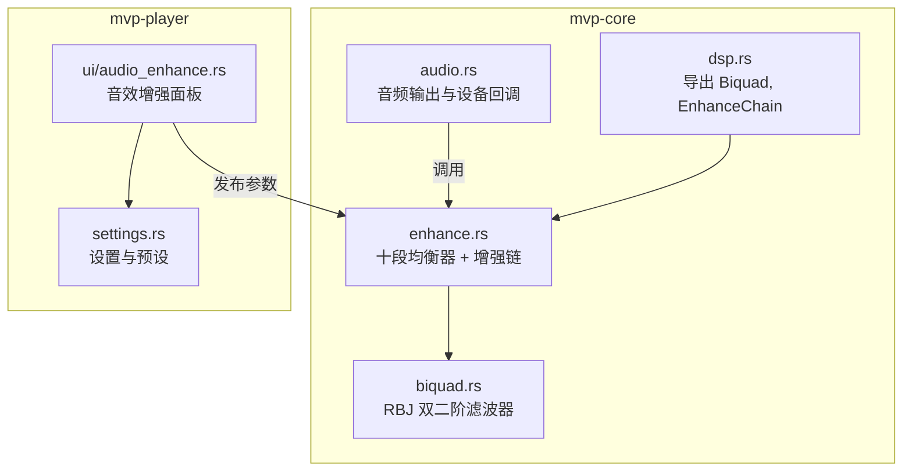
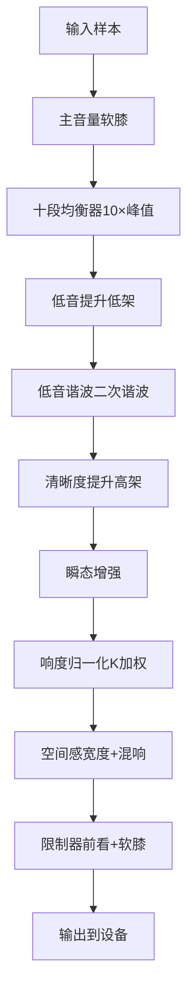
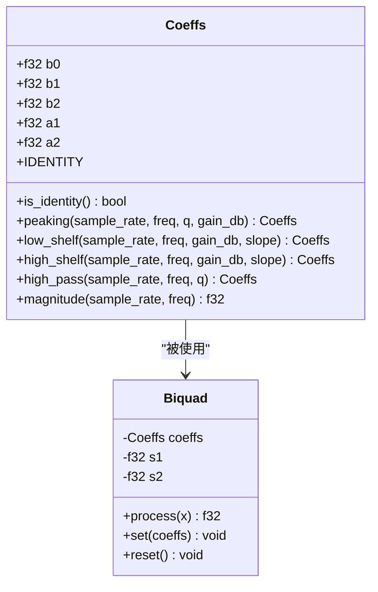
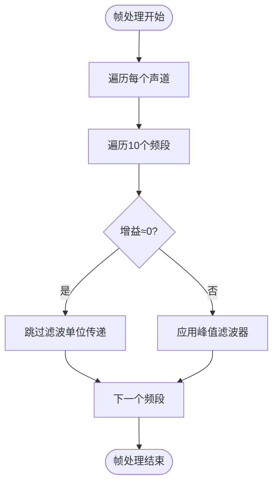
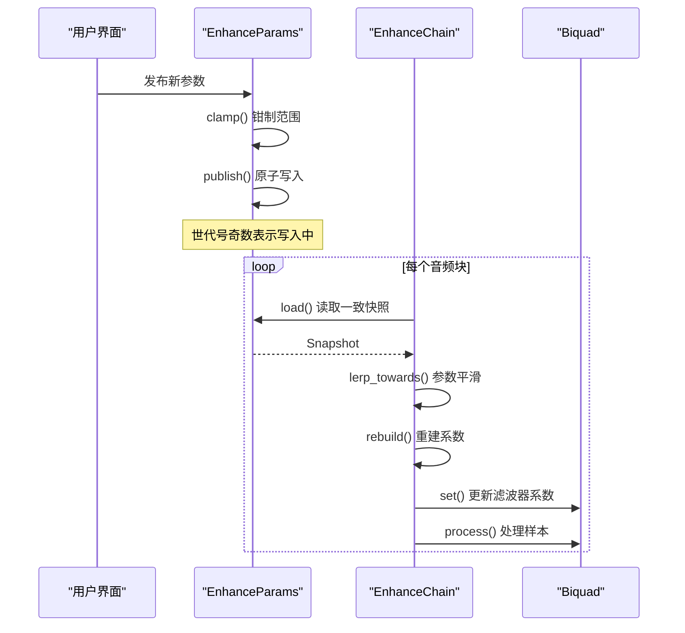
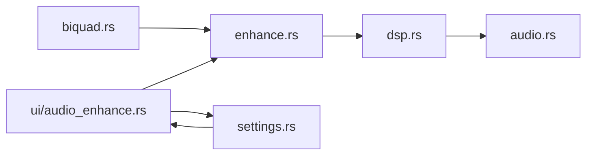
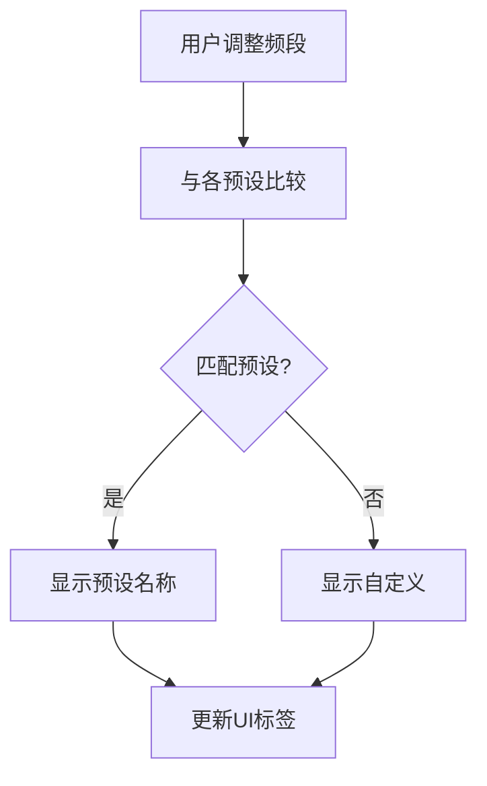
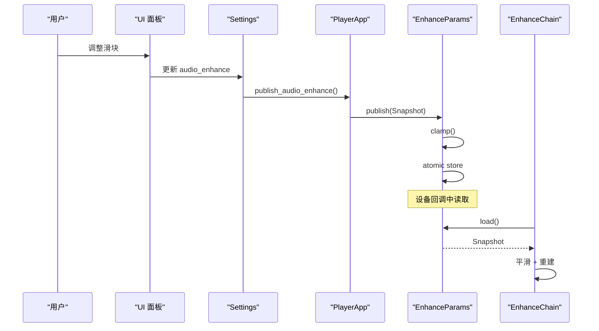

# 十段均衡器

<cite>
**本文引用的文件**   
- [dsp.rs](file://crates/mvp-core/src/dsp.rs)
- [biquad.rs](file://crates/mvp-core/src/dsp/biquad.rs)
- [enhance.rs](file://crates/mvp-core/src/dsp/enhance.rs)
- [audio.rs](file://crates/mvp-core/src/audio.rs)
- [audio_enhance.rs](file://crates/mvp-player/src/ui/audio_enhance.rs)
- [settings.rs](file://crates/mvp-player/src/settings.rs)
</cite>

## 目录
1. [引言](#引言)
2. [项目结构](#项目结构)
3. [核心组件](#核心组件)
4. [架构总览](#架构总览)
5. [详细组件分析](#详细组件分析)
6. [依赖关系分析](#依赖关系分析)
7. [性能与实时性](#性能与实时性)
8. [预设曲线生成算法](#预设曲线生成算法)
9. [用户界面与DSP参数映射](#用户界面与dsp参数映射)
10. [故障排查指南](#故障排查指南)
11. [结论](#结论)

## 引言
本技术文档聚焦于项目中的“十段均衡器”及其在音频增强链中的实现。该均衡器采用经典的十频段八度中心频率布局，覆盖 31 Hz 到 16 kHz，使用 RBJ 双二阶滤波器（Biquad）的峰值滤波实现每个频段的增益控制。其设计目标是在实时音频输出回调中提供零分配、无锁、可平滑过渡的参数更新，同时保证旁路时完全透明、不引入额外延迟或失真。

文档将深入解释：
- 中心频率选择与 Q 值调节机制
- 峰值滤波器的数学实现与系数计算
- 每个频段的增益范围 -12.0..=12.0 dB 的约束与处理
- 实时参数平滑与防“拉链噪声”策略
- 均衡器在 DSP 链中的位置与作用
- 与其他增强效果（低音/清晰度提升、响度归一化、空间感、限制器）的交互
- 预设曲线生成算法与 UI 映射
- 性能优化与错误防护

## 项目结构
本项目将音频增强功能拆分为核心 DSP 模块与播放器 UI 层：
- mvp-core 提供底层 DSP：双二阶滤波器、十段均衡器、增强链、音频输出集成
- mvp-player 提供 UI：音效增强面板、预设选择、曲线绘制、参数持久化

**图表来源**
- [dsp.rs:13-19](file://crates/mvp-core/src/dsp.rs#L13-L19)
- [enhance.rs:1-33](file://crates/mvp-core/src/dsp/enhance.rs#L1-L33)
- [audio.rs:34-35](file://crates/mvp-core/src/audio.rs#L34-L35)
- [audio_enhance.rs:1-22](file://crates/mvp-player/src/ui/audio_enhance.rs#L1-L22)
- [settings.rs:473-588](file://crates/mvp-player/src/settings.rs#L473-L588)

**章节来源**
- [dsp.rs:1-19](file://crates/mvp-core/src/dsp.rs#L1-L19)
- [enhance.rs:1-33](file://crates/mvp-core/src/dsp/enhance.rs#L1-L33)
- [audio.rs:1-35](file://crates/mvp-core/src/audio.rs#L1-L35)
- [audio_enhance.rs:1-22](file://crates/mvp-player/src/ui/audio_enhance.rs#L1-L22)
- [settings.rs:473-588](file://crates/mvp-player/src/settings.rs#L473-L588)

## 核心组件
- 双二阶滤波器（Biquad）：基于 RBJ 配方，支持峰值、低通、高通、低架、高架等滤波器类型；提供单位传递函数常量、幅度响应计算、状态管理与复位。
- 十段均衡器（EnhanceChain）：包含 10 个 Band（每带一个 Biquad），以及低音/清晰度架式滤波器、瞬态增强、响度归一化、空间感（混响）、限制器。
- 参数同步（EnhanceParams）：通过原子变量和世代号实现线程安全的参数发布与读取，避免实时线程阻塞。
- 音频输出（AudioSink）：在 cpal 设备回调中调用增强链，应用音量软膝限幅，并报告延迟。

关键特性：
- 零分配：所有缓冲区在构建时一次性分配，回调中复用。
- 实时安全：不使用锁、日志、文件系统访问。
- 平滑过渡：参数按块平滑插值，避免“拉链噪声”。
- 旁路透明：关闭或中性参数时，信号原样通过，不引入延迟或失真。

**章节来源**
- [biquad.rs:1-12](file://crates/mvp-core/src/dsp/biquad.rs#L1-L12)
- [enhance.rs:1-33](file://crates/mvp-core/src/dsp/enhance.rs#L1-L33)
- [enhance.rs:58-105](file://crates/mvp-core/src/dsp/enhance.rs#L58-L105)
- [enhance.rs:206-321](file://crates/mvp-core/src/dsp/enhance.rs#L206-L321)
- [audio.rs:320-461](file://crates/mvp-core/src/audio.rs#L320-L461)

## 架构总览
音频数据流从解码器进入 AudioSink，在设备回调中先应用主音量（带软膝限幅），再进入 EnhanceChain。增强链内部顺序为：
1. 十段均衡器（10 个峰值滤波器级联）
2. 低音提升（低架滤波器）
3. 低音谐波（二次谐波注入）
4. 清晰度提升（高架滤波器）
5. 瞬态增强（快速/慢速包络差）
6. 响度归一化（K 加权测量 + 增益跟随）
7. 空间感（立体声宽度 + Schroeder 混响）
8. 限制器（前看峰值限制 + 软膝）

**图表来源**
- [enhance.rs:10-27](file://crates/mvp-core/src/dsp/enhance.rs#L10-L27)
- [enhance.rs:1058-1077](file://crates/mvp-core/src/dsp/enhance.rs#L1058-L1077)
- [audio.rs:414-439](file://crates/mvp-core/src/audio.rs#L414-L439)

**章节来源**
- [enhance.rs:10-27](file://crates/mvp-core/src/dsp/enhance.rs#L10-L27)
- [enhance.rs:1058-1077](file://crates/mvp-core/src/dsp/enhance.rs#L1058-L1077)
- [audio.rs:414-439](file://crates/mvp-core/src/audio.rs#L414-L439)

## 详细组件分析

### 双二阶滤波器（Biquad）
Biquad 是均衡器的基础构建块，采用转置直接 II 型结构，每样本仅需 4 次乘法，状态变量仅两个浮点数。

关键方法：
- `Coeffs::peaking`：根据采样率、中心频率、Q 值和增益（dB）计算峰值滤波器系数
- `Coeffs::magnitude`：计算指定频率处的幅度响应（用于 UI 曲线绘制）
- `Biquad::process`：单样本处理，含 NaN/Inf 保护
- `Biquad::set`：更新系数但保留状态，实现参数平滑
- `Biquad::reset`：清除状态，用于 seek 后避免残留能量

**图表来源**
- [biquad.rs:16-74](file://crates/mvp-core/src/dsp/biquad.rs#L16-L74)
- [biquad.rs:172-210](file://crates/mvp-core/src/dsp/biquad.rs#L172-L210)

**章节来源**
- [biquad.rs:1-12](file://crates/mvp-core/src/dsp/biquad.rs#L1-L12)
- [biquad.rs:16-74](file://crates/mvp-core/src/dsp/biquad.rs#L16-L74)
- [biquad.rs:172-210](file://crates/mvp-core/src/dsp/biquad.rs#L172-L210)

### 十段均衡器（EnhanceChain）
EnhanceChain 管理 10 个 Band，每个 Band 对应一个中心频率和一个 Biquad。

中心频率定义：
- EQ_FREQS = [31, 62, 125, 250, 500, 1000, 2000, 4000, 8000, 16000] Hz

Band 行为：
- 当增益接近 0 时，使用单位传递函数（跳过滤波）
- 频率超过奈奎斯特频率时被钳制到 sample_rate * 0.45
- 每个声道维护独立的 Biquad 状态

**图表来源**
- [enhance.rs:323-365](file://crates/mvp-core/src/dsp/enhance.rs#L323-L365)
- [enhance.rs:1058-1077](file://crates/mvp-core/src/dsp/enhance.rs#L1058-L1077)

**章节来源**
- [enhance.rs:38-45](file://crates/mvp-core/src/dsp/enhance.rs#L38-L45)
- [enhance.rs:323-365](file://crates/mvp-core/src/dsp/enhance.rs#L323-L365)
- [enhance.rs:1058-1077](file://crates/mvp-core/src/dsp/enhance.rs#L1058-L1077)

### 峰值滤波器数学实现
峰值滤波器的系数由 RBJ 配方计算：

给定：
- 采样率 fs
- 中心频率 f0
- Q 值（带宽控制）
- 增益 G（dB）

步骤：
1. 计算角频率 ω0 = 2π·f0/fs
2. 计算 sin(ω0), cos(ω0)
3. 计算 α = sin(ω0)/(2·Q)
4. 计算线性增益 a = 10^(G/40)
5. 计算分子分母系数并归一化（除以 a0）

关键点：
- 增益为正时为峰值提升，为负时为衰减
- Q 值越小，带宽越宽；Q 值越大，带宽越窄
- 系数计算包含数值稳定性检查，非法输入返回单位传递函数

**章节来源**
- [biquad.rs:76-95](file://crates/mvp-core/src/dsp/biquad.rs#L76-L95)
- [biquad.rs:152-170](file://crates/mvp-core/src/dsp/biquad.rs#L152-L170)

### 实时参数平滑处理
为避免滑块拖动时的“拉链噪声”，系统对参数进行块级平滑：

- 平滑时间常数：30 ms
- 平滑方式：对 Snapshot 参数进行线性插值，而非对系数插值
- 重建触发：当平滑后的参数变化超过阈值时，重新计算滤波器系数
- 限制器上限不平滑：安全限制必须立即生效

**图表来源**
- [enhance.rs:47-52](file://crates/mvp-core/src/dsp/enhance.rs#L47-L52)
- [enhance.rs:140-163](file://crates/mvp-core/src/dsp/enhance.rs#L140-L163)
- [enhance.rs:241-262](file://crates/mvp-core/src/dsp/enhance.rs#L241-L262)
- [enhance.rs:269-295](file://crates/mvp-core/src/dsp/enhance.rs#L269-L295)
- [enhance.rs:1009-1018](file://crates/mvp-core/src/dsp/enhance.rs#L1009-L1018)

**章节来源**
- [enhance.rs:47-52](file://crates/mvp-core/src/dsp/enhance.rs#L47-L52)
- [enhance.rs:140-163](file://crates/mvp-core/src/dsp/enhance.rs#L140-L163)
- [enhance.rs:241-262](file://crates/mvp-core/src/dsp/enhance.rs#L241-L262)
- [enhance.rs:269-295](file://crates/mvp-core/src/dsp/enhance.rs#L269-L295)
- [enhance.rs:1009-1018](file://crates/mvp-core/src/dsp/enhance.rs#L1009-L1018)

### 增益控制范围与约束
每个频段的增益控制范围为 -12.0..=12.0 dB：
- UI 滑块限制在此范围内
- Snapshot::clamp() 确保存储参数合法
- 异常值（NaN、Inf）会被替换为边界值
- 增益为 0 时，滤波器自动旁路

其他相关参数范围：
- Q 值：0.3..=6.0
- 低音提升：0.0..=12.0 dB
- 清晰度提升：0.0..=12.0 dB
- 响度目标：-60.0..=-10.0 dBFS
- 限制器上限：-6.0..=0.0 dBFS
- 立体声宽度：0.0..=2.0
- 空间残响：0.0..=1.0

**章节来源**
- [enhance.rs:120-138](file://crates/mvp-core/src/dsp/enhance.rs#L120-L138)
- [audio_enhance.rs:270-285](file://crates/mvp-player/src/ui/audio_enhance.rs#L270-L285)

## 依赖关系分析

**图表来源**
- [dsp.rs:13-19](file://crates/mvp-core/src/dsp.rs#L13-L19)
- [enhance.rs:34-36](file://crates/mvp-core/src/dsp/enhance.rs#L34-L36)
- [audio.rs:34-35](file://crates/mvp-core/src/audio.rs#L34-L35)
- [audio_enhance.rs:23-29](file://crates/mvp-player/src/ui/audio_enhance.rs#L23-L29)
- [settings.rs:473-588](file://crates/mvp-player/src/settings.rs#L473-L588)

**章节来源**
- [dsp.rs:13-19](file://crates/mvp-core/src/dsp.rs#L13-L19)
- [enhance.rs:34-36](file://crates/mvp-core/src/dsp/enhance.rs#L34-L36)
- [audio.rs:34-35](file://crates/mvp-core/src/audio.rs#L34-L35)
- [audio_enhance.rs:23-29](file://crates/mvp-player/src/ui/audio_enhance.rs#L23-L29)
- [settings.rs:473-588](file://crates/mvp-player/src/settings.rs#L473-L588)

## 性能与实时性
### 零分配设计
- 所有缓冲区在 EnhanceChain::new 中一次性分配
- 回调中只复用已有缓冲区，不进行动态分配
- 原子参数块避免锁竞争

### 实时安全
- 设备回调中不使用锁、日志、文件系统操作
- 参数通过原子变量和世代号同步
- 读取失败时回退到默认值，避免阻塞

### 优化策略
- 单位传递函数检测：增益为 0 时跳过滤波
- 空闲检测：所有参数中性时跳过整个处理链
- 预计算：斜坡函数、滤波器系数预先计算
- 内存池：Scratch 缓冲区复用

### 延迟特性
- 限制器引入约 1 ms 的前看延迟
- 空间感阶段为湿信号，不增加延迟
- 总延迟可通过 EnhanceChain::latency_ms() 查询

**章节来源**
- [enhance.rs:934-978](file://crates/mvp-core/src/dsp/enhance.rs#L934-L978)
- [enhance.rs:980-989](file://crates/mvp-core/src/dsp/enhance.rs#L980-L989)
- [enhance.rs:1020-1030](file://crates/mvp-core/src/dsp/enhance.rs#L1020-L1030)
- [audio.rs:343-351](file://crates/mvp-core/src/audio.rs#L343-L351)

## 预设曲线生成算法
预设是一组固定的 10 频段增益值，定义了不同的音色风格：

预设列表：
- 平直（Flat）：全 0 dB
- 温暖（Warm）：低频提升，高频略降
- 明亮（Bright）：中高频提升
- 人声（Voice）：中频突出
- 摇滚（Rock）：低频和高频提升，中频凹陷
- 低音增强（Bass）：仅低频提升
- 高音增强（Treble）：仅高频提升
- 流行（Pop）：平衡的低频和高频提升
- 自定义（Custom）：用户手动调整

预设匹配逻辑：
- 当用户调整任意频段时，系统自动判断是否匹配某个预设
- 如果增益与预设差异小于 0.05 dB，则显示对应预设名称
- 否则显示“自定义”

**图表来源**
- [settings.rs:391-471](file://crates/mvp-player/src/settings.rs#L391-L471)
- [settings.rs:571-587](file://crates/mvp-player/src/settings.rs#L571-L587)

**章节来源**
- [settings.rs:391-471](file://crates/mvp-player/src/settings.rs#L391-L471)
- [settings.rs:571-587](file://crates/mvp-player/src/settings.rs#L571-L587)

## 用户界面与DSP参数映射
UI 面板将用户操作映射到 DSP 参数：

### 均衡器部分
- 10 个滑块对应 10 个频段增益（-12.0..=12.0 dB）
- 预设下拉框选择预设曲线
- 实时曲线图显示当前响应

### 低音与清晰度
- 低音提升：0.0..=12.0 dB（低架滤波器）
- 低音谐波：0.0..=1.0（二次谐波强度）
- 清晰度：0.0..=12.0 dB（高架滤波器）
- 瞬态增强：0.0..=1.0（攻击检测强度）

### 响度与保护
- 响度目标：-60.0..=-10.0 dBFS（低于 -59.0 关闭）
- 跟随速度：0.5..=10.0 秒
- 限制器上限：-6.0..=0.0 dBFS

### 空间感
- 立体声宽度：0.0..=2.0（1.0 为原始）
- 空间残响：0.0..=1.0（0.0 为关闭）

参数发布流程：
1. UI 修改 settings.audio_enhance
2. 调用 app.publish_audio_enhance()
3. 创建 Snapshot 并调用 clamp()
4. 通过 EnhanceParams::publish() 原子发布
5. 设备回调中通过 EnhanceParams::load() 读取

**图表来源**
- [audio_enhance.rs:270-285](file://crates/mvp-player/src/ui/audio_enhance.rs#L270-L285)
- [audio_enhance.rs:254-258](file://crates/mvp-player/src/ui/audio_enhance.rs#L254-L258)
- [settings.rs:553-562](file://crates/mvp-player/src/settings.rs#L553-L562)
- [enhance.rs:241-262](file://crates/mvp-core/src/dsp/enhance.rs#L241-L262)

**章节来源**
- [audio_enhance.rs:270-285](file://crates/mvp-player/src/ui/audio_enhance.rs#L270-L285)
- [audio_enhance.rs:254-258](file://crates/mvp-player/src/ui/audio_enhance.rs#L254-L258)
- [settings.rs:553-562](file://crates/mvp-player/src/settings.rs#L553-L562)
- [enhance.rs:241-262](file://crates/mvp-core/src/dsp/enhance.rs#L241-L262)

## 故障排查指南

### 常见问题与解决方案

#### 问题：均衡器声音有“拉链噪声”
**原因**：参数变化过快，滤波器系数频繁重建  
**解决**：系统已内置 30ms 平滑，确保滑块拖动时不会卡顿

#### 问题：开启均衡器后音质变差
**原因**：某些频段增益过大导致削波  
**解决**：检查限制器上限设置，确保不超过 0 dBFS

#### 问题：UI 曲线与实际声音不符
**原因**：采样率不匹配或频率超出奈奎斯特限制  
**解决**：系统会自动将频率钳制到 sample_rate * 0.45

#### 问题：切换音源后有残留声音
**原因**：滤波器状态未正确重置  
**解决**：系统在 seek 时自动调用 reset() 清除状态

#### 问题：实时播放卡顿
**原因**：CPU 负载过高或缓冲区不足  
**解决**：检查系统资源，考虑降低采样率或减少其他效果

### 调试技巧
- 使用 bypass 模式验证原始信号
- 观察 latency_ms 确认延迟是否正常
- 检查 is_idle() 确认参数是否中性
- 查看测试用例了解预期行为

**章节来源**
- [enhance.rs:1091-1103](file://crates/mvp-core/src/dsp/enhance.rs#L1091-L1103)
- [enhance.rs:1173-1183](file://crates/mvp-core/src/dsp/enhance.rs#L1173-L1183)
- [enhance.rs:1318-1333](file://crates/mvp-core/src/dsp/enhance.rs#L1318-L1333)

## 结论
该十段均衡器实现了一个高性能、实时安全的音频增强系统。通过 RBJ 双二阶滤波器、参数平滑、零分配设计和严格的范围约束，系统在保持音质的同时提供了灵活的音色控制能力。

主要优势：
- **实时安全**：无锁、无分配、无阻塞
- **音质保证**：旁路透明、数值稳定、防削波
- **用户体验**：平滑参数过渡、直观 UI、预设丰富
- **性能优化**：智能旁路、预计算、内存复用

该系统不仅适用于音乐播放，也适合视频播放中的对白增强和音效美化，为用户提供了专业级的音频处理能力。