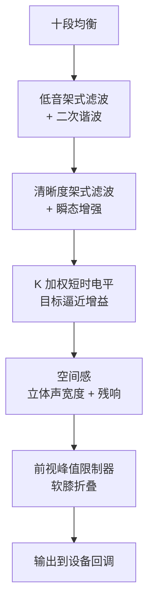
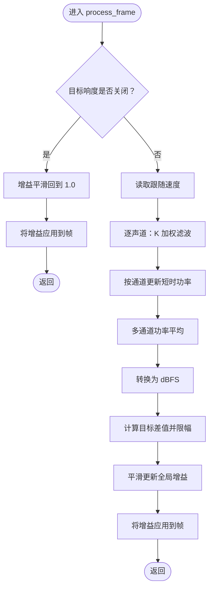
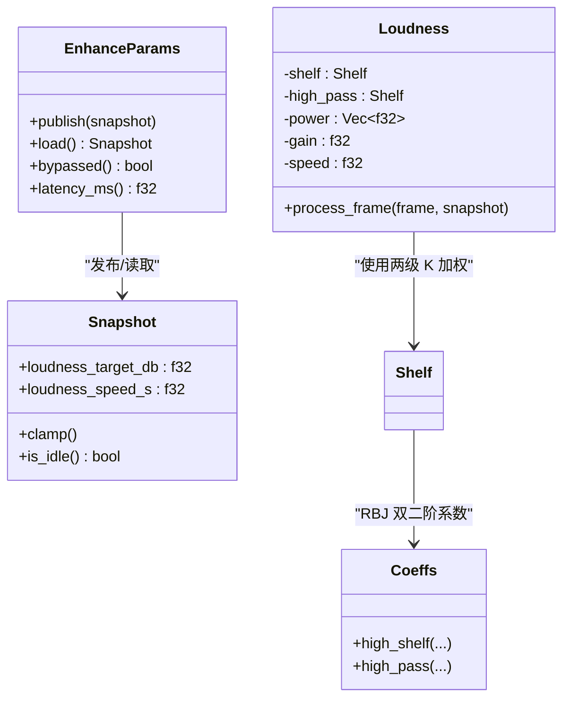
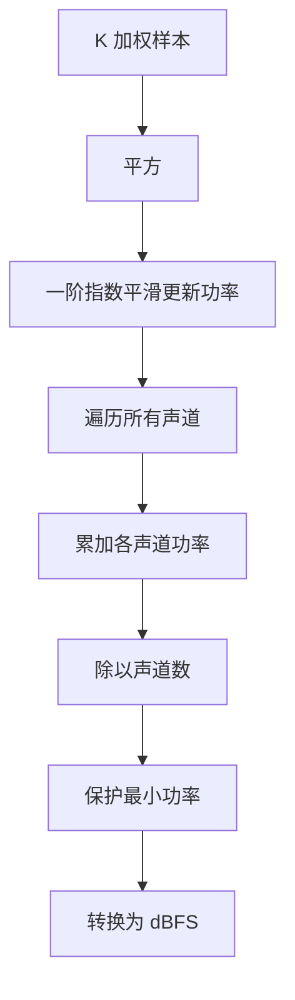
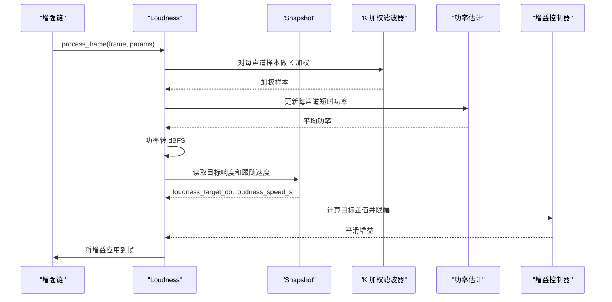
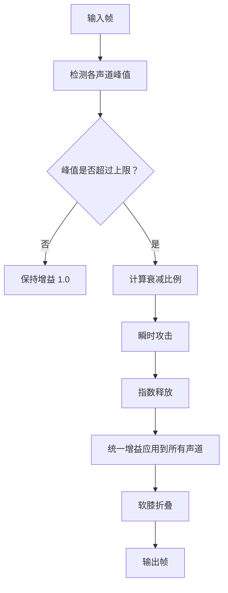
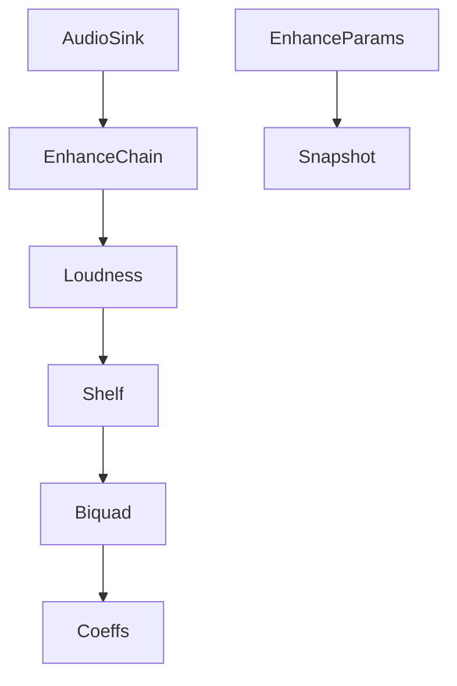
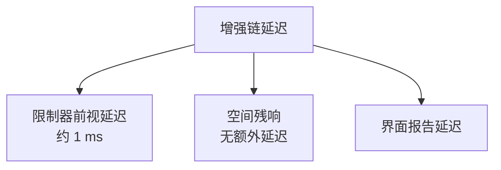
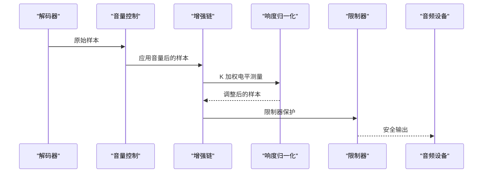

# 响度归一化

<cite>
**本文引用的文件**   
- [enhance.rs](file://crates/mvp-core/src/dsp/enhance.rs)
- [biquad.rs](file://crates/mvp-core/src/dsp/biquad.rs)
- [audio.rs](file://crates/mvp-core/src/audio.rs)
- [README.md](file://README.md)
- [audio_enhance.rs](file://crates/mvp-player/src/ui/audio_enhance.rs)
</cite>

## 目录
1. [引言](#引言)
2. [项目结构中的响度模块位置](#项目结构中的响度模块位置)
3. [核心组件与数据流](#核心组件与数据流)
4. [架构总览](#架构总览)
5. [详细组件分析](#详细组件分析)
6. [依赖关系分析](#依赖关系分析)
7. [性能与延迟特性](#性能与延迟特性)
8. [不同音频内容下的行为](#不同音频内容下的行为)
9. [与音量控制的协调](#与音量控制的协调)
10. [精度、误差与限制](#精度误差与限制)
11. [故障排查](#故障排查)
12. [结论](#结论)

## 引言
本技术文档聚焦于该播放器中的“响度归一化”子系统。它基于 ITU-R BS.1770 的 K 加权思想，实现了一个面向实时播放器的近似短时电平测量与目标逼近控制：通过两级双二阶滤波器完成 K 加权，计算多通道功率平均值，再用平滑增益把当前电平拉向用户设定的目标值。系统同时包含限制器保护、增益平滑、参数原子发布、以及空间残响等增强链环节。

需要特别强调：该实现是“播放器侧的近似方案”，并非完整的 BS.1770 集成响度测量；完整标准还包含门限和秒级积分平均，属于母带工具的职责，而播放器更关注听感上对话与音乐音量差异过大的问题。

## 项目结构中的响度模块位置
响度归一化位于音频增强链中，具体在 `mvp-core` 的 DSP 模块内。增强链的整体顺序为：十段均衡 → 低音架式滤波与二次谐波 → 清晰度架式滤波与瞬态增强 → **响度归一化** → 空间感（立体声宽度 + Schroeder 残响）→ 前视限制器。

**图表来源**
- [enhance.rs:10-26](file://crates/mvp-core/src/dsp/enhance.rs#L10-L26)
- [enhance.rs:934-1077](file://crates/mvp-core/src/dsp/enhance.rs#L934-L1077)

**章节来源**
- [enhance.rs:10-26](file://crates/mvp-core/src/dsp/enhance.rs#L10-L26)
- [README.md:71-92](file://README.md#L71-L92)

## 核心组件与数据流
响度归一化的核心数据结构是 `Loudness`，它维护：
- K 加权前置的两级滤波器状态：高频架式滤波器和低通/高通组合中的高频部分。
- 每通道的短时功率估计。
- 当前全局增益。
- 跟随速度参数。

处理流程如下：
1. 如果目标响度低于关闭阈值，则让增益平滑回到 1.0，并直接乘以样本。
2. 否则，对每个声道样本依次经过 K 加权滤波器。
3. 用一阶指数平滑更新每声道功率。
4. 对所有声道功率求平均，转换为分贝。
5. 计算目标差值，并限制单次调整幅度，避免“泵浦效应”。
6. 用平滑系数更新全局增益，再应用到整帧。

**图表来源**
- [enhance.rs:439-511](file://crates/mvp-core/src/dsp/enhance.rs#L439-L511)

**章节来源**
- [enhance.rs:439-511](file://crates/mvp-core/src/dsp/enhance.rs#L439-L511)

## 架构总览
从系统角度看，响度归一化不是独立服务，而是增强链的一个阶段。它与以下部分紧密耦合：
- 参数发布层：`EnhanceParams` 使用原子块和世代号，保证实时线程读到一致快照。
- 参数快照层：`Snapshot` 提供响度目标值和跟随速度，并在边界范围内钳制。
- 滤波器层：`Coeffs` 和 `Biquad` 提供 RBJ 双二阶实现，K 加权由高频架式滤波和低通/高通组合构成。
- 输出层：`AudioSink` 的设备回调负责调用增强链，并在链前后应用音量与格式转换。

**图表来源**
- [enhance.rs:58-86](file://crates/mvp-core/src/dsp/enhance.rs#L58-L86)
- [enhance.rs:213-321](file://crates/mvp-core/src/dsp/enhance.rs#L213-L321)
- [enhance.rs:439-511](file://crates/mvp-core/src/dsp/enhance.rs#L439-L511)
- [biquad.rs:16-170](file://crates/mvp-core/src/dsp/biquad.rs#L16-L170)

**章节来源**
- [enhance.rs:58-86](file://crates/mvp-core/src/dsp/enhance.rs#L58-L86)
- [enhance.rs:213-321](file://crates/mvp-core/src/dsp/enhance.rs#L213-L321)
- [enhance.rs:439-511](file://crates/mvp-core/src/dsp/enhance.rs#L439-L511)
- [biquad.rs:16-170](file://crates/mvp-core/src/dsp/biquad.rs#L16-L170)

## 详细组件分析

### K 加权滤波器设计
K 加权用于模拟人耳对不同频率能量的感知权重。该实现采用 ITU-R BS.1770 定义的两级双二阶结构：
- 高频架式滤波器：中心频率约 1682 Hz，Q 值约 0.707，作为 K 加权的高频提升部分。
- 高通滤波器：截止频率约 38 Hz，Q 值约 0.5，作为低频衰减部分。

这两级滤波器串联后，对低频能量进行抑制，对中高频能量给予更接近主观响度的权重。

**图表来源**
- [enhance.rs:453-466](file://crates/mvp-core/src/dsp/enhance.rs#L453-L466)
- [biquad.rs:116-150](file://crates/mvp-core/src/dsp/biquad.rs#L116-L150)

**章节来源**
- [enhance.rs:453-466](file://crates/mvp-core/src/dsp/enhance.rs#L453-L466)
- [biquad.rs:116-150](file://crates/mvp-core/src/dsp/biquad.rs#L116-L150)

### 短时功率计算与多通道平均
K 加权后的样本平方后，通过一阶指数平滑更新每声道功率。随后将所有声道功率相加并除以声道数，得到平均功率。为避免对数运算出现零或极小值，代码中对功率做了最小值保护，再转换为分贝。

关键点：
- 功率更新系数与“跟随时间”相关，时间越长，响应越慢。
- 多通道功率平均使单声道或双声道内容都能被合理评估。
- 分贝转换使用 `10 * log10(power)`，符合功率量纲。

**图表来源**
- [enhance.rs:491-505](file://crates/mvp-core/src/dsp/enhance.rs#L491-L505)

**章节来源**
- [enhance.rs:491-505](file://crates/mvp-core/src/dsp/enhance.rs#L491-L505)

### 目标逼近算法与反馈控制
响度归一化是一个闭环反馈控制系统：
- 当前电平：由 K 加权短时功率转换得到的 dBFS。
- 目标电平：用户设置的 `loudness_target_db`。
- 误差：目标电平减去当前电平。
- 增益目标：将误差转换为线性增益比例。
- 平滑：增益不突变，而是以较小步长趋近目标。

为防止剧烈增益变化导致“泵浦效应”，代码对单次增益变化进行了限幅，并将最大调整范围限制在 ±12 dB。

**图表来源**
- [enhance.rs:475-511](file://crates/mvp-core/src/dsp/enhance.rs#L475-L511)

**章节来源**
- [enhance.rs:475-511](file://crates/mvp-core/src/dsp/enhance.rs#L475-L511)

### 响应速度控制
跟随速度由 `loudness_speed_s` 控制，取值范围为 0.5 到 10.0 秒。该值越大，增益变化越慢；越小，增益变化越快。实现中通过一个与采样率、帧长和跟随时间相关的系数 `alpha` 控制平滑速度。

注意：
- 默认值为 2.0 秒。
- 当目标响度低于关闭阈值时，响度归一化关闭，但增益仍会平滑回到 1.0，避免突然跳变。
- 界面允许用户在 0.5 到 10.0 秒之间调节跟随速度。

**章节来源**
- [enhance.rs:98-134](file://crates/mvp-core/src/dsp/enhance.rs#L98-L134)
- [enhance.rs:477-495](file://crates/mvp-core/src/dsp/enhance.rs#L477-L495)
- [audio_enhance.rs:190-208](file://crates/mvp-player/src/ui/audio_enhance.rs#L190-L208)

### 限制器保护
限制器位于增强链末尾，职责是防止任何后续处理或用户音量设置导致输出超过安全上限。其特点包括：
- 前视延迟：约 1 ms，用于提前检测峰值。
- 全声道统一增益：取所有声道中的最大峰值决定衰减，避免立体声像偏移。
- 软膝折叠：超过阈值时使用 `tanh` 平滑折叠，避免硬削波。
- 释放时间：约 50 ms，避免快速波动造成泵浦。

**图表来源**
- [enhance.rs:828-932](file://crates/mvp-core/src/dsp/enhance.rs#L828-L932)

**章节来源**
- [enhance.rs:828-932](file://crates/mvp-core/src/dsp/enhance.rs#L828-L932)

### 增益平滑处理
增益平滑有两个层面：
1. 参数平滑：`Snapshot` 的参数变化不是立即生效，而是按时间常数平滑过渡，避免滤波器系数频繁重建导致的“台阶噪声”。
2. 增益平滑：响度归一化的增益本身也通过一阶指数平滑更新，避免电平突变。

此外，输出层的音量控制也有自己的平滑机制：在设备回调中，音量变化在一个缓冲区内渐变，而不是瞬间跳变。

**章节来源**
- [enhance.rs:47-52](file://crates/mvp-core/src/dsp/enhance.rs#L47-L52)
- [enhance.rs:140-163](file://crates/mvp-core/src/dsp/enhance.rs#L140-L163)
- [enhance.rs:506-510](file://crates/mvp-core/src/dsp/enhance.rs#L506-L510)
- [audio.rs:332-374](file://crates/mvp-core/src/audio.rs#L332-L374)

### 多通道功率平均
响度归一化对多通道内容进行功率平均，而不是单独对每个声道做独立归一化。这样做的好处是：
- 保持声道间相对电平关系。
- 避免立体声像因左右声道分别调整而发生偏移。
- 对单声道内容也能给出合理的整体电平估计。

**章节来源**
- [enhance.rs:496-504](file://crates/mvp-core/src/dsp/enhance.rs#L496-L504)

## 依赖关系分析
响度归一化依赖以下关键模块：

**图表来源**
- [enhance.rs:934-1077](file://crates/mvp-core/src/dsp/enhance.rs#L934-L1077)
- [enhance.rs:439-511](file://crates/mvp-core/src/dsp/enhance.rs#L439-L511)
- [biquad.rs:172-210](file://crates/mvp-core/src/dsp/biquad.rs#L172-L210)
- [audio.rs:332-439](file://crates/mvp-core/src/audio.rs#L332-L439)

**章节来源**
- [enhance.rs:934-1077](file://crates/mvp-core/src/dsp/enhance.rs#L934-L1077)
- [enhance.rs:439-511](file://crates/mvp-core/src/dsp/enhance.rs#L439-L511)
- [biquad.rs:172-210](file://crates/mvp-core/src/dsp/biquad.rs#L172-L210)
- [audio.rs:332-439](file://crates/mvp-core/src/audio.rs#L332-L439)

## 性能与延迟特性

### 实时性保障
增强链运行在 cpal 设备回调线程上，遵循以下原则：
- 不在回调中分配内存。
- 不使用锁。
- 不做 I/O。
- 参数通过原子块和世代号传递，保证一致性。

这确保了响度归一化不会成为实时路径上的瓶颈。

**章节来源**
- [enhance.rs:1-33](file://crates/mvp-core/src/dsp/enhance.rs#L1-L33)
- [enhance.rs:206-239](file://crates/mvp-core/src/dsp/enhance.rs#L206-L239)

### 延迟特性
增强链的主要延迟来自限制器的前视延迟，约为 1 ms。空间残响是湿信号叠加，不增加额外延迟。界面报告的延迟仅反映真实引入的延迟。

**图表来源**
- [enhance.rs:980-989](file://crates/mvp-core/src/dsp/enhance.rs#L980-L989)

**章节来源**
- [enhance.rs:980-989](file://crates/mvp-core/src/dsp/enhance.rs#L980-L989)
- [README.md:80-92](file://README.md#L80-L92)

### 性能优化策略
- 滤波器系数按块重建，而非每样本重建。
- 中性参数下跳过整个增强链。
- 参数平滑避免频繁重建滤波器。
- 功率估计使用一阶指数平滑，计算成本低。
- 限制器使用环形缓冲区，避免动态分配。

**章节来源**
- [enhance.rs:1079-1089](file://crates/mvp-core/src/dsp/enhance.rs#L1079-L1089)
- [enhance.rs:1020-1030](file://crates/mvp-core/src/dsp/enhance.rs#L1020-L1030)
- [enhance.rs:844-857](file://crates/mvp-core/src/dsp/enhance.rs#L844-L857)

## 不同音频内容下的行为

### 对白内容
对白通常集中在中频范围，K 加权对其影响较小。响度归一化主要根据整体短时电平调整增益，使对话在不同节目之间保持相对一致的音量。

### 音乐内容
音乐可能包含大量低频和高频能量。K 加权会抑制低频、提升中高频，使测量更接近主观响度。对于动态较大的音乐，跟随速度较慢可以避免明显的泵浦效应。

### 单声道内容
多通道功率平均确保单声道内容也能被正确评估。空间残响会对左右声道尾音进行去相关处理，使单声道源听起来更有宽度。

**章节来源**
- [enhance.rs:496-504](file://crates/mvp-core/src/dsp/enhance.rs#L496-L504)
- [enhance.rs:704-743](file://crates/mvp-core/src/dsp/enhance.rs#L704-L743)

## 与音量控制的协调
音量控制和响度归一化是两个独立的增益控制环节：
- 音量控制：由 `AudioSink` 在设备回调中应用，负责用户主音量。
- 响度归一化：由 `Loudness` 在增强链中应用，负责节目响度接近。

两者的协调方式：
1. 音量先应用，然后进入增强链。
2. 限制器最后应用，确保最终输出不超过安全上限。
3. 音量变化的平滑在缓冲区内完成，避免突变。

**图表来源**
- [audio.rs:414-439](file://crates/mvp-core/src/audio.rs#L414-L439)
- [enhance.rs:1058-1077](file://crates/mvp-core/src/dsp/enhance.rs#L1058-L1077)

**章节来源**
- [audio.rs:414-439](file://crates/mvp-core/src/audio.rs#L414-L439)
- [enhance.rs:1058-1077](file://crates/mvp-core/src/dsp/enhance.rs#L1058-L1077)

## 精度、误差与限制

### 与 BS.1770 的关系
该实现是 BS.1770 的近似：
- 使用了 K 加权的两级双二阶滤波器。
- 没有实现完整的门限逻辑。
- 没有实现秒级积分平均。
- 目标是播放器侧的听感改善，而非专业响度测量。

### 精度考虑
- 功率估计使用一阶指数平滑，存在时间常数带来的滞后。
- 分贝转换对极小功率值做了保护，避免数值不稳定。
- 增益调整范围限制在 ±12 dB，避免极端情况。

### 已知限制
- 不是真正的 BS.1770 集成响度测量。
- 短时功率估计对突发峰值不够敏感。
- 多通道平均可能掩盖个别声道的异常电平。
- 跟随速度固定为单一参数，不能针对不同频段分别控制。

**章节来源**
- [enhance.rs:439-444](file://crates/mvp-core/src/dsp/enhance.rs#L439-L444)
- [enhance.rs:502-507](file://crates/mvp-core/src/dsp/enhance.rs#L502-L507)

## 故障排查

### 响度归一化无效
检查以下项：
- 目标响度是否低于关闭阈值（默认 -60.0 dBFS）。
- 跟随速度是否设置过大，导致响应太慢。
- 增强链是否被旁路。

**章节来源**
- [enhance.rs:98-134](file://crates/mvp-core/src/dsp/enhance.rs#L98-L134)
- [enhance.rs:477-490](file://crates/mvp-core/src/dsp/enhance.rs#L477-L490)

### 声音忽大忽小
可能的原因：
- 跟随速度过快，导致增益变化明显。
- 内容动态极大，短时功率估计波动较大。
- 限制器释放时间不足，造成泵浦效应。

建议：
- 增大跟随速度（例如从 2.0 秒增加到 5.0 秒）。
- 检查限制器上限设置。
- 观察内容是否为极端动态材料。

**章节来源**
- [enhance.rs:491-510](file://crates/mvp-core/src/dsp/enhance.rs#L491-L510)
- [enhance.rs:853-856](file://crates/mvp-core/src/dsp/enhance.rs#L853-L856)

### 延迟过高
检查：
- 是否启用了不必要的增强效果。
- 限制器前视延迟是否正常。
- 空间残响是否误报延迟。

**章节来源**
- [enhance.rs:980-989](file://crates/mvp-core/src/dsp/enhance.rs#L980-L989)

## 结论
该响度归一化系统是一个面向实时播放器的近似实现，基于 ITU-R BS.1770 的 K 加权思想，通过短时功率测量和目标逼近控制，使不同节目之间的响度更加一致。它在功能完整性、实时性能和听感之间取得了平衡：

- 优点：实现简洁、计算开销低、延迟可控、与音量控制协调良好。
- 局限：不是完整的 BS.1770 标准实现，缺少门限和积分平均。
- 适用场景：日常播放、对话与音乐混合内容、对实时性要求高的环境。

对于专业响度测量需求，建议使用专门的母带工具；而对于播放器内的听感优化，该实现提供了实用且高效的解决方案。