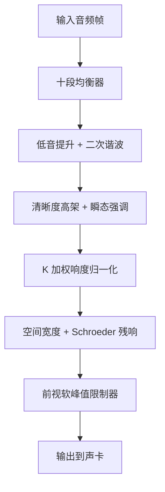
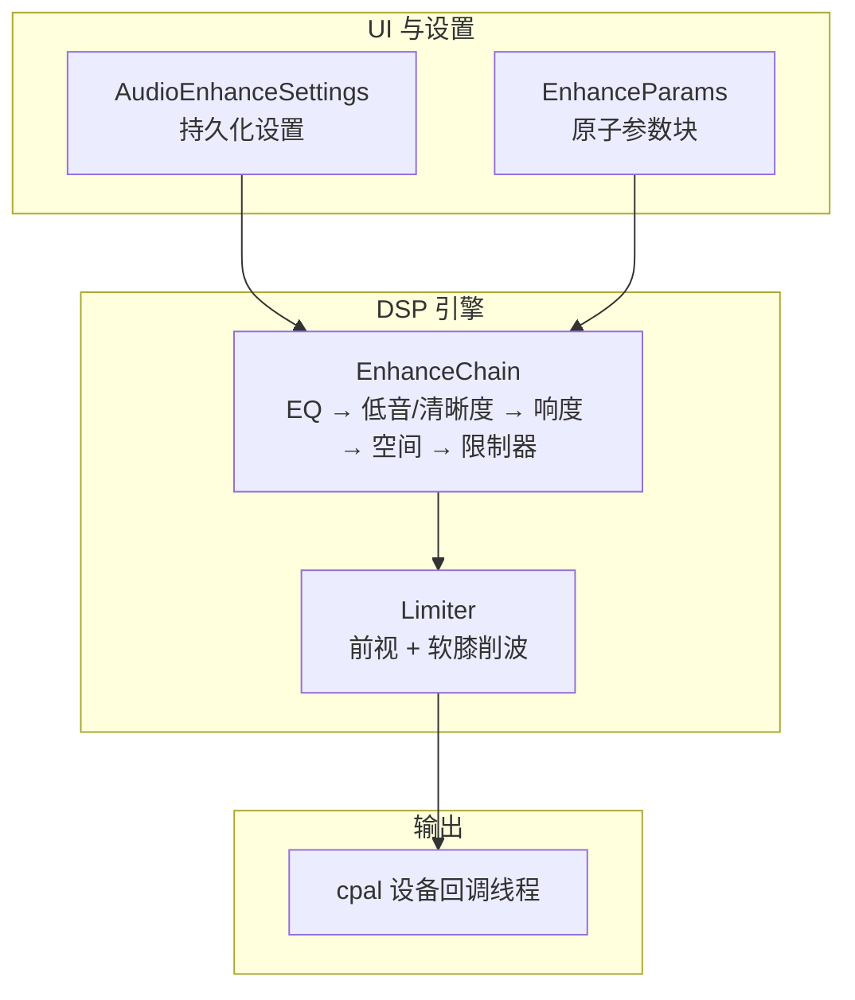
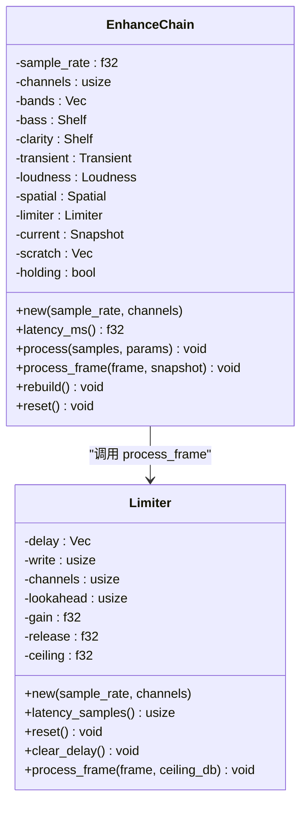
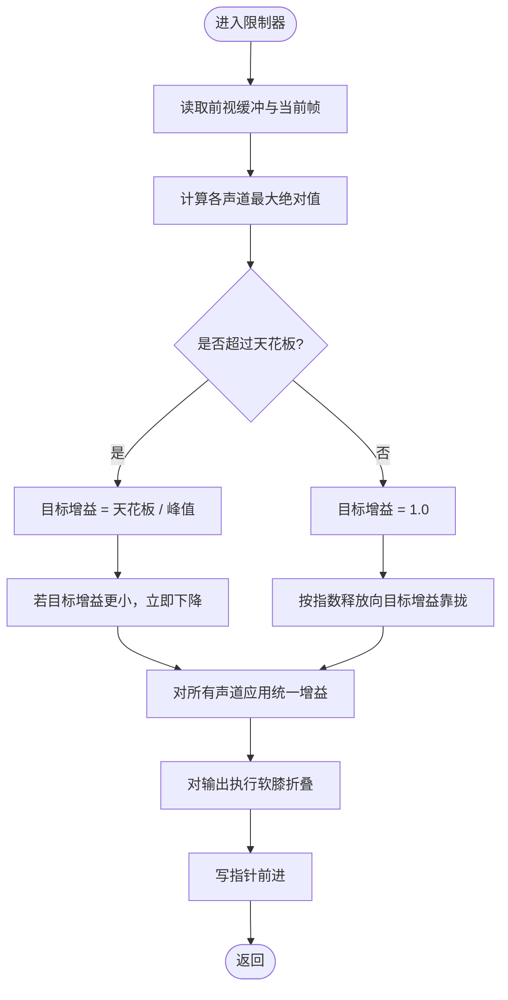
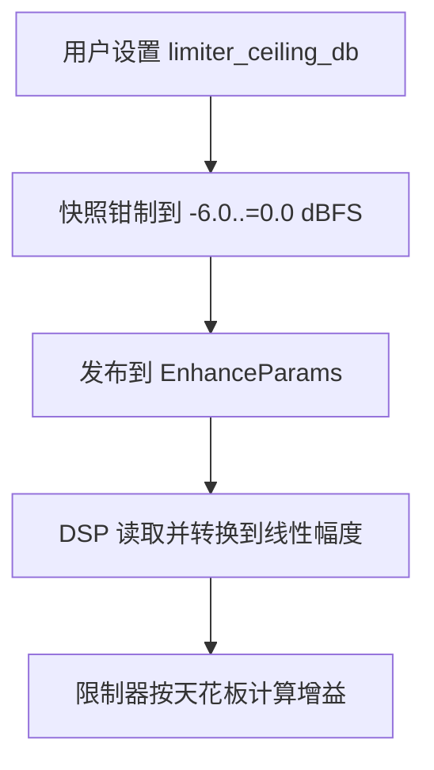
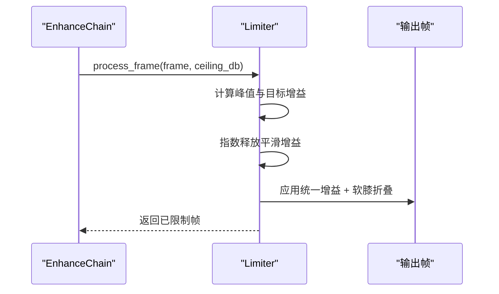
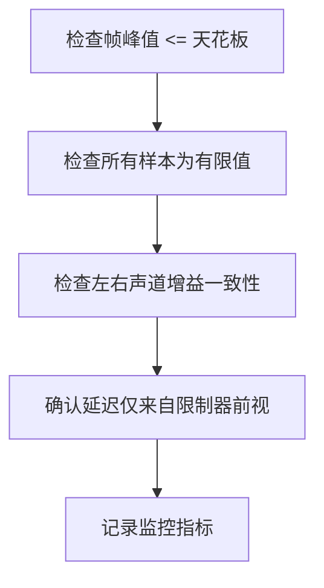

# 峰值限制器

<cite>
**本文引用的文件**   
- [enhance.rs](file://crates/mvp-core/src/dsp/enhance.rs)
- [settings.rs](file://crates/mvp-player/src/settings.rs)
- [README.md](file://README.md)
</cite>

## 目录
1. [引言](#引言)
2. [项目结构中的音频增强链](#项目结构中的音频增强链)
3. [核心组件](#核心组件)
4. [架构总览](#架构总览)
5. [详细组件分析](#详细组件分析)
6. [依赖关系分析](#依赖关系分析)
7. [性能与实时性](#性能与实时性)
8. [参数调优指南](#参数调优指南)
9. [失真检测与监控指标](#失真检测与监控指标)
10. [故障排查](#故障排查)
11. [结论](#结论)

## 引言
本文围绕 MVP-Versatile-Player 的“真峰值限制器”展开，聚焦其在音效链中的最终安全位置、前视（look-ahead）软削波实现、天花板限制范围的设计原则、快速响应与平滑过渡的实现方式，以及它如何保护后续设备、避免量化失真并维持整体音质。文档同时给出与其他动态处理设备的协调策略、参数调优方法和可观测的监控指标，帮助工程师和高级用户在不牺牲听感的前提下稳定控制峰值。

## 项目结构中的音频增强链
音频增强功能位于 `mvp-core` 的 DSP 模块中，以固定顺序串联多个处理阶段：十段均衡器、低音提升与二次谐波、清晰度高架与瞬态强调、K 加权响度归一化、空间宽度与残响，最后才是软峰值限制器。该顺序保证：
- 均衡器最先作用，使界面显示的曲线与实际信号路径一致；
- 响度归一化放在低频/高频增强之后，避免追逐每一次均衡变化；
- 空间效果在限制器之前，因为残响尾音会抬高峰值；
- 限制器处于链尾，其后不再有任何能增加增益的阶段。

**图示来源**
- [enhance.rs:10-26](file://crates/mvp-core/src/dsp/enhance.rs#L10-L26)
- [enhance.rs:938-1077](file://crates/mvp-core/src/dsp/enhance.rs#L938-L1077)

**章节来源**
- [enhance.rs:1-26](file://crates/mvp-core/src/dsp/enhance.rs#L1-L26)
- [README.md:71-92](file://README.md#L71-L92)

## 核心组件
- 参数快照与发布机制：`Snapshot` 与 `EnhanceParams` 负责将 UI 设置转换为 DSP 可读取的无分配、无锁参数块，并通过原子序列号保证回调线程读到一致的参数集。
- 音效链主体：`EnhanceChain` 持有所有阶段的内部状态，按固定顺序处理每一帧。
- 真峰值限制器：`Limiter` 提供约 1 ms 的前视缓冲、跨声道统一增益、指数释放与软膝削波，确保数字过载被抑制且听感自然。
- 设置映射：`AudioEnhanceSettings` 将持久化的用户设置翻译为引擎内部的 `Snapshot`，并在进入引擎前完成数值钳制。

**章节来源**
- [enhance.rs:58-86](file://crates/mvp-core/src/dsp/enhance.rs#L58-L86)
- [enhance.rs:206-321](file://crates/mvp-core/src/dsp/enhance.rs#L206-L321)
- [enhance.rs:938-1104](file://crates/mvp-core/src/dsp/enhance.rs#L938-L1104)
- [settings.rs:483-562](file://crates/mvp-player/src/settings.rs#L483-L562)

## 架构总览
从系统角度看，峰值限制器是音频增强链的最终安全门。它不改变声音的音色意图，而是把前面所有可能抬高峰值的处理结果约束在安全的数字电平范围内。延迟由限制器的前视决定，界面会如实显示这一延迟。

**图示来源**
- [settings.rs:483-562](file://crates/mvp-player/src/settings.rs#L483-L562)
- [enhance.rs:206-321](file://crates/mvp-core/src/dsp/enhance.rs#L206-L321)
- [enhance.rs:938-1104](file://crates/mvp-core/src/dsp/enhance.rs#L938-L1104)

## 详细组件分析

### 真峰值限制器设计原理
限制器采用“前视 + 软膝”的组合：
- 前视缓冲：根据采样率计算约 1 ms 的延迟，用于观察即将输出的样本，提前计算所需衰减。
- 跨声道统一增益：取所有声道当前帧的最大绝对值作为峰值依据，再对全部声道应用同一增益，避免立体像漂移。
- 快速攻击与平滑释放：超过阈值时立即降低增益；恢复时使用指数型释放时间常数，避免“呼吸泵浦”。
- 软膝削波：使用双曲正切函数对超过阈值的信号进行非线性折叠，避免硬削波的方形波失真。

**图示来源**
- [enhance.rs:828-932](file://crates/mvp-core/src/dsp/enhance.rs#L828-L932)
- [enhance.rs:938-1104](file://crates/mvp-core/src/dsp/enhance.rs#L938-L1104)

**章节来源**
- [enhance.rs:828-932](file://crates/mvp-core/src/dsp/enhance.rs#L828-L932)
- [enhance.rs:938-1104](file://crates/mvp-core/src/dsp/enhance.rs#L938-L1104)

### 过采样检测与软削波
代码中的限制器并非传统意义上的多倍过采样检测器，而是通过“前视缓冲 + 全帧峰值扫描”来近似真峰值行为：
- 每个帧内对所有声道写入前视缓冲，并比较缓冲中的历史样本与当前样本，得到帧级峰值。
- 若峰值超过天花板，则计算目标增益；否则保持单位增益。
- 增益更新遵循“瞬时攻击、指数释放”，避免阶跃式音量变化。
- 输出经过软膝函数，低于阈值完全透明，高于阈值逐渐压缩，避免硬限幅带来的高频谐波。

**图示来源**
- [enhance.rs:876-915](file://crates/mvp-core/src/dsp/enhance.rs#L876-L915)
- [enhance.rs:918-932](file://crates/mvp-core/src/dsp/enhance.rs#L918-L932)

**章节来源**
- [enhance.rs:876-915](file://crates/mvp-core/src/dsp/enhance.rs#L876-L915)
- [enhance.rs:918-932](file://crates/mvp-core/src/dsp/enhance.rs#L918-L932)

### 天花板限制范围与设置原则
- 用户可配置的“真峰值天花板”范围为 `-6.0..=0.0 dBFS`。默认值为 `-0.3 dBFS`，为常见播放器留出少量余量。
- 该范围在参数快照的钳制逻辑中被强制约束，防止非法或危险值进入滤波器系数计算。
- 限制器内部会将 dBFS 转换为线性幅度，用于实际增益计算。

**图示来源**
- [enhance.rs:124-138](file://crates/mvp-core/src/dsp/enhance.rs#L124-L138)
- [enhance.rs:882-883](file://crates/mvp-core/src/dsp/enhance.rs#L882-L883)

**章节来源**
- [enhance.rs:124-138](file://crates/mvp-core/src/dsp/enhance.rs#L124-L138)
- [enhance.rs:882-883](file://crates/mvp-core/src/dsp/enhance.rs#L882-L883)

### 响应特性：快速响应、平滑过渡、无振铃
- 快速响应：当检测到峰值超过天花板时，增益立即下降到所需值，避免在延迟缓冲中发生削波。
- 平滑过渡：参数更新采用时间平滑（约 30 ms），但限制器天花板本身不做平滑，以保证安全边界始终准确。
- 无振铃效应：软膝使用 `tanh` 折叠，避免硬限幅产生的方形波和高频谐波；空间残响采用梳状滤波与全通网络，避免单一延迟造成的梳状滤波共振。

**图示来源**
- [enhance.rs:876-915](file://crates/mvp-core/src/dsp/enhance.rs#L876-L915)
- [enhance.rs:918-932](file://crates/mvp-core/src/dsp/enhance.rs#L918-L932)

**章节来源**
- [enhance.rs:876-915](file://crates/mvp-core/src/dsp/enhance.rs#L876-L915)
- [enhance.rs:918-932](file://crates/mvp-core/src/dsp/enhance.rs#L918-L932)

### 在音效链中的最终位置与作用
- 保护后续处理设备：限制器排在 EQ、低音/清晰度、响度归一化、空间效果之后，确保这些阶段可能增加的峰值不会到达声卡。
- 防止量化失真：软膝削波避免硬限幅导致的波形截断，减少高频谐波与量化噪声。
- 维持音频质量：跨声道统一增益避免立体像偏移；指数释放避免音量泵浦；前视延迟仅约 1 ms，界面如实报告。

**章节来源**
- [enhance.rs:10-26](file://crates/mvp-core/src/dsp/enhance.rs#L10-L26)
- [enhance.rs:828-833](file://crates/mvp-core/src/dsp/enhance.rs#L828-L833)
- [enhance.rs:980-989](file://crates/mvp-core/src/dsp/enhance.rs#L980-L989)

### 与其他动态处理设备的协调
- 与响度归一化：响度归一化先于限制器工作，将整体电平向目标逼近；限制器负责兜底，防止归一化后的峰值越界。
- 与空间效果：残响尾音会增加瞬时峰值，因此必须在限制器之前；空间效果为“湿声叠加”，不引入额外延迟。
- 与音量滑块：音量增益在增强链之后独立运行，限制器提供第二道安全上限，即使音量开到 200% 也不会爆音。

**章节来源**
- [enhance.rs:439-512](file://crates/mvp-core/src/dsp/enhance.rs#L439-L512)
- [enhance.rs:620-743](file://crates/mvp-core/src/dsp/enhance.rs#L620-L743)
- [enhance.rs:22-26](file://crates/mvp-core/src/dsp/enhance.rs#L22-L26)

## 依赖关系分析
限制器依赖以下关键结构与数据流：
- `Snapshot`：包含 `limiter_ceiling_db` 等参数，经 `clamp()` 后发布。
- `EnhanceParams`：通过原子存储与世代号保证回调线程一致性。
- `EnhanceChain`：按固定顺序调用各阶段，最后调用限制器。
- `soft_knee`：实现软膝折叠，保证低于阈值透明、高于阈值平滑压缩。

**图示来源**
- [enhance.rs:58-86](file://crates/mvp-core/src/dsp/enhance.rs#L58-L86)
- [enhance.rs:206-321](file://crates/mvp-core/src/dsp/enhance.rs#L206-L321)
- [enhance.rs:938-1104](file://crates/mvp-core/src/dsp/enhance.rs#L938-L1104)
- [enhance.rs:918-932](file://crates/mvp-core/src/dsp/enhance.rs#L918-L932)

**章节来源**
- [enhance.rs:58-86](file://crates/mvp-core/src/dsp/enhance.rs#L58-L86)
- [enhance.rs:206-321](file://crates/mvp-core/src/dsp/enhance.rs#L206-L321)
- [enhance.rs:918-932](file://crates/mvp-core/src/dsp/enhance.rs#L918-L932)
- [enhance.rs:938-1104](file://crates/mvp-core/src/dsp/enhance.rs#L938-L1104)

## 性能与实时性
- 零分配：DSP 在设备回调线程内不分配内存、不加锁、不调用文件系统。
- 参数平滑：参数更新时间约为 30 ms，避免每样本重算滤波器系数导致“拉链噪声”。
- 延迟透明：仅限制器的前视产生约 1 ms 延迟，空间残响不增加延迟；界面显示真实延迟。
- 空闲旁路：当所有控件处于中性值时，整个链可跳过处理，保证“开启但未调节”与“关闭”完全一致。

**章节来源**
- [enhance.rs:1-9](file://crates/mvp-core/src/dsp/enhance.rs#L1-L9)
- [enhance.rs:47-52](file://crates/mvp-core/src/dsp/enhance.rs#L47-L52)
- [enhance.rs:980-989](file://crates/mvp-core/src/dsp/enhance.rs#L980-L989)
- [enhance.rs:1020-1030](file://crates/mvp-core/src/dsp/enhance.rs#L1020-L1030)

## 参数调优指南
- 天花板设置：
  - 推荐从默认 `-0.3 dBFS` 开始，逐步下调至 `-1.0..=-3.0 dBFS`，以应对强动态内容。
  - 不要设为 0 dBFS，以免保留过多风险；也不要低于 `-6.0 dBFS`，否则会过度压缩听感。
- 响度归一化：
  - 目标值低于 `-59.0 dBFS` 表示关闭；常用对话/音乐场景可在 `-18..=-24 dBFS` 之间调整。
  - 速度参数影响跟随快慢，过快易泵浦，过慢响应不足。
- 空间效果：
  - 宽度控制在 1.0 附近微调；房间混响从 0 开始，逐步增加以获得自然尾音。
- 限制器与响度的配合：
  - 若响度归一化频繁触发限制器，说明目标值偏高或前置增益过大；应降低响度目标或前置增益。
  - 若限制器几乎不动作，说明天花板过高或前置处理未产生足够峰值。

**章节来源**
- [enhance.rs:124-138](file://crates/mvp-core/src/dsp/enhance.rs#L124-L138)
- [enhance.rs:477-512](file://crates/mvp-core/src/dsp/enhance.rs#L477-L512)
- [enhance.rs:704-743](file://crates/mvp-core/src/dsp/enhance.rs#L704-L743)

## 失真检测与监控指标
- 峰值监测：
  - 检查限制器处理后帧的最大绝对值是否不超过天花板对应的线性幅度。
  - 关注是否出现接近 1.0 的样本，这通常意味着软膝正在工作。
- 有限值检查：
  - 确保所有输出样本为有限数，避免 NaN 或 Inf 传播。
- 通道一致性：
  - 验证左右声道增益一致，避免立体像偏移。
- 延迟报告：
  - 界面报告的延迟应与限制器前视一致，不应因空间效果而虚高。

**图示来源**
- [enhance.rs:1198-1213](file://crates/mvp-core/src/dsp/enhance.rs#L1198-L1213)
- [enhance.rs:1215-1242](file://crates/mvp-core/src/dsp/enhance.rs#L1215-L1242)
- [enhance.rs:1317-1333](file://crates/mvp-core/src/dsp/enhance.rs#L1317-L1333)

**章节来源**
- [enhance.rs:1198-1213](file://crates/mvp-core/src/dsp/enhance.rs#L1198-L1213)
- [enhance.rs:1215-1242](file://crates/mvp-core/src/dsp/enhance.rs#L1215-L1242)
- [enhance.rs:1317-1333](file://crates/mvp-core/src/dsp/enhance.rs#L1317-L1333)

## 故障排查
- 现象：限制器后仍有削波或爆音。
  - 检查天花板是否设置为 0 dBFS 或更高；应保持在 `-6.0..=0.0 dBFS`。
  - 检查前置 EQ 或响度归一化是否过度提升增益。
- 现象：立体像在 loud passage 中偏移。
  - 确认限制器使用跨声道统一增益，而非逐声道独立限制。
- 现象：切换空间效果后听到旧尾音。
  - 检查空间效果的复位逻辑，确保关闭时清空延迟缓冲。
- 现象：界面延迟显示异常。
  - 确认延迟仅来自限制器前视，空间效果不应计入延迟。

**章节来源**
- [enhance.rs:124-138](file://crates/mvp-core/src/dsp/enhance.rs#L124-L138)
- [enhance.rs:876-915](file://crates/mvp-core/src/dsp/enhance.rs#L876-L915)
- [enhance.rs:980-989](file://crates/mvp-core/src/dsp/enhance.rs#L980-L989)

## 结论
MVP-Versatile-Player 的真峰值限制器通过前视缓冲、跨声道统一增益、指数释放与软膝折叠，在音效链末尾提供可靠的安全保障。其设计兼顾快速响应与平滑过渡，避免硬削波带来的量化失真与听感劣化。合理设置天花板、协调响度归一化与空间效果，并结合峰值监测与延迟报告，可以在不同节目源下稳定维持高质量音频输出。