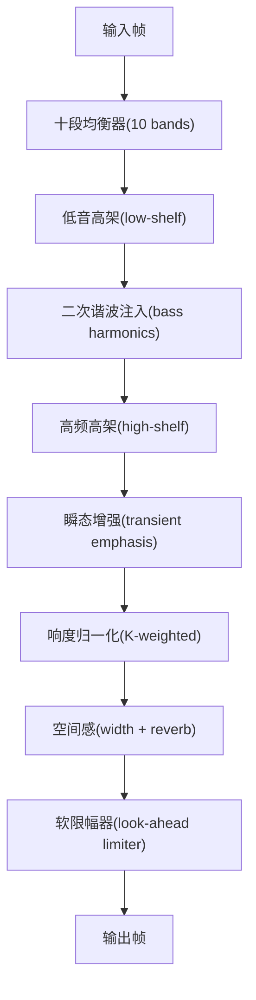
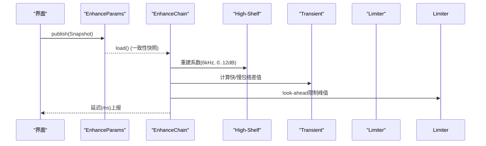
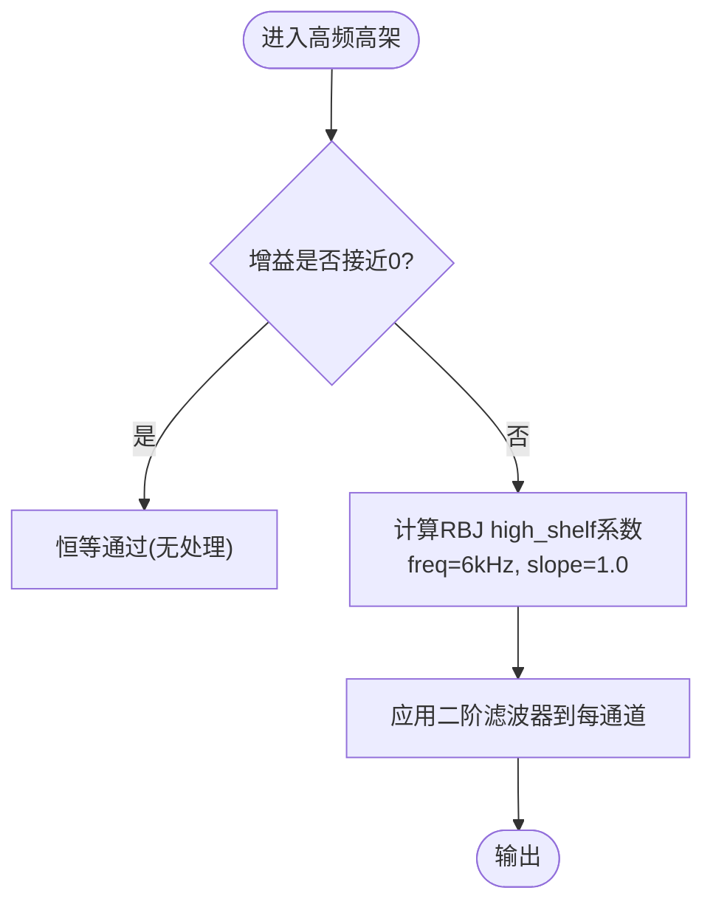
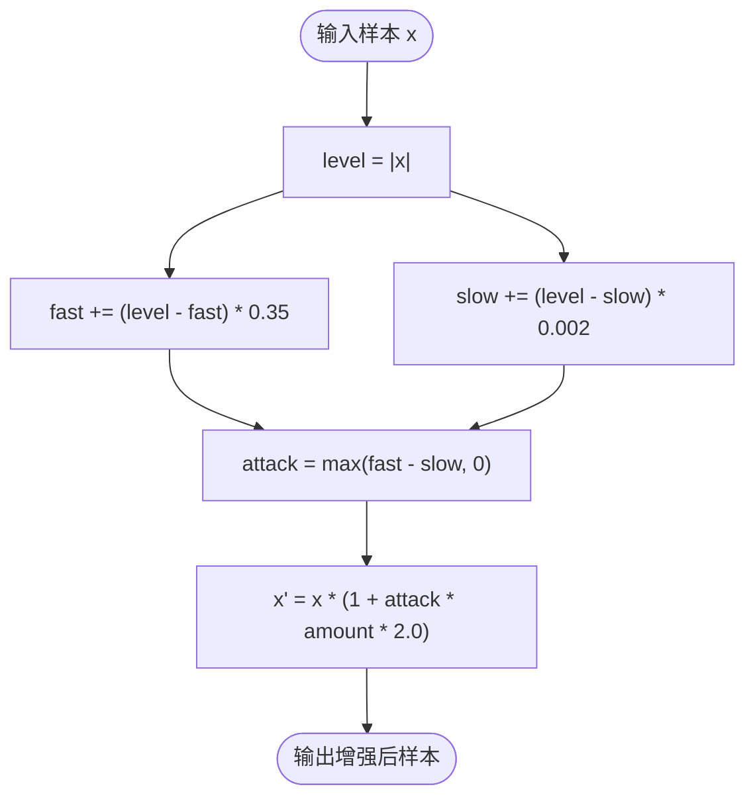
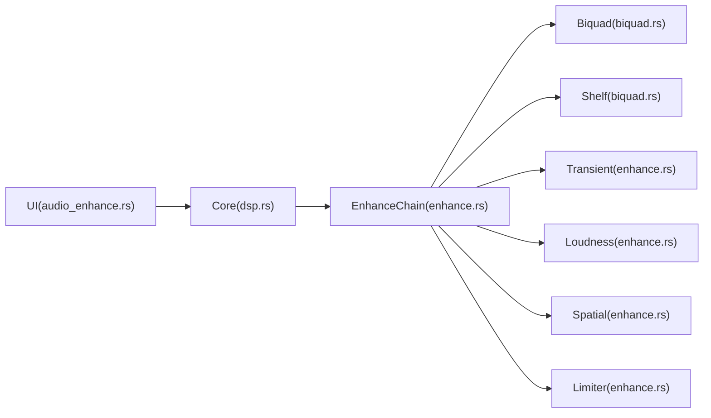

# 清晰度提升

<cite>
**本文引用的文件**
- [enhance.rs](file://crates/mvp-core/src/dsp/enhance.rs)
- [biquad.rs](file://crates/mvp-core/src/dsp/biquad.rs)
- [dsp.rs](file://crates/mvp-core/src/dsp.rs)
- [audio_enhance.rs](file://crates/mvp-player/src/ui/audio_enhance.rs)
</cite>

## 目录
1. [简介](#简介)
2. [项目结构](#项目结构)
3. [核心组件](#核心组件)
4. [架构总览](#架构总览)
5. [详细组件分析](#详细组件分析)
6. [依赖关系分析](#依赖关系分析)
7. [性能考量](#性能考量)
8. [故障排查指南](#故障排查指南)
9. [结论](#结论)
10. [附录：参数调优与听感评估](#附录参数调优与听感评估)

## 简介
本技术文档聚焦于“清晰度提升”子系统，围绕高架滤波器（high-shelf）设计与瞬态增强算法展开，解释其数学模型、关键参数与实现细节，并给出针对不同音频内容的效果差异、避免过度处理的策略以及与其他效果的配合建议。系统基于实时音频处理链，在设备回调中运行，保证零分配、无锁、无阻塞。

## 项目结构
清晰度提升位于 DSP 模块的增强链中，包含以下关键部分：
- 十段均衡器（peaking EQ）
- 低音高架（low-shelf）与谐波生成
- 高频高架（high-shelf）与瞬态增强
- 响度归一化（K-weighted）
- 空间感（立体声宽度 + 混响）
- 软限幅器（look-ahead limiter）

图表来源
- [enhance.rs:10-26](file://crates/mvp-core/src/dsp/enhance.rs#L10-L26)
- [enhance.rs:934-1077](file://crates/mvp-core/src/dsp/enhance.rs#L934-L1077)

章节来源
- [enhance.rs:10-26](file://crates/mvp-core/src/dsp/enhance.rs#L10-L26)
- [dsp.rs:13-19](file://crates/mvp-core/src/dsp.rs#L13-L19)

## 核心组件
- 高架滤波器（high-shelf）：用于清晰度提升的高频增益控制，截止频率为 6 kHz，增益范围 0.0..=12.0 dB。
- 瞬态增强：通过快速与慢速包络跟随器的差值检测瞬态事件，对打击乐与人声的起音进行增强。
- 参数平滑与原子发布：使用原子参数块与生成计数，确保实时线程读取一致快照；参数变化以时间常数平滑，避免“拉链噪声”。
- 安全限幅：look-ahead 软膝限幅器，防止任何阶段引入的增益导致削波。

章节来源
- [enhance.rs:54-74](file://crates/mvp-core/src/dsp/enhance.rs#L54-L74)
- [enhance.rs:120-138](file://crates/mvp-core/src/dsp/enhance.rs#L120-L138)
- [enhance.rs:206-321](file://crates/mvp-core/src/dsp/enhance.rs#L206-L321)
- [enhance.rs:828-932](file://crates/mvp-core/src/dsp/enhance.rs#L828-L932)

## 架构总览
清晰度提升链按固定顺序处理每一帧，保证用户可见的均衡曲线与实际信号路径一致，且所有参数变化平滑过渡。

图表来源
- [enhance.rs:241-321](file://crates/mvp-core/src/dsp/enhance.rs#L241-L321)
- [enhance.rs:957-1077](file://crates/mvp-core/src/dsp/enhance.rs#L957-L1077)
- [enhance.rs:1114-1119](file://crates/mvp-core/src/dsp/enhance.rs#L1114-L1119)

## 详细组件分析

### 高架滤波器（high-shelf）设计原理
- 截止频率选择：6 kHz 作为清晰度提升的拐点，覆盖人声辅音与乐器泛音的关键频段，同时避免影响低频与极高频。
- 增益范围：0.0..=12.0 dB，提供从轻微到显著的清晰度增强。
- 实现方式：RBJ cookbook high_shelf 系数，斜率 S=1.0，系数按当前采样率重建，避免 Nyquist 以上不稳定。
- 透明性：当增益接近 0 时，系数退化为恒等，整条链可旁路，保证“开启但中性”与“关闭”完全一致。

图表来源
- [biquad.rs:116-133](file://crates/mvp-core/src/dsp/biquad.rs#L116-L133)
- [enhance.rs:1114-1119](file://crates/mvp-core/src/dsp/enhance.rs#L1114-L1119)
- [enhance.rs:1080-1089](file://crates/mvp-core/src/dsp/enhance.rs#L1080-L1089)

章节来源
- [biquad.rs:116-133](file://crates/mvp-core/src/dsp/biquad.rs#L116-L133)
- [enhance.rs:54-56](file://crates/mvp-core/src/dsp/enhance.rs#L54-L56)
- [enhance.rs:120-138](file://crates/mvp-core/src/dsp/enhance.rs#L120-L138)

### 瞬态增强算法
- 数学模型：对每个样本取绝对值作为瞬时电平，分别通过快速与慢速一阶指数平滑得到包络 fast 与 slow。攻击时刻 fast 上升更快，差值 attack = max(fast - slow, 0) 表征瞬态强度。
- 增强公式：x * (1 + attack * amount * 2.0)，amount 为瞬态增强强度（0.0..=1.0）。
- 参数含义：
  - 快速时间常数：0.35（近似），使包络迅速响应起音。
  - 慢速时间常数：0.002（近似），跟踪稳态电平。
  - 增强量：amount 越大，打击乐起音与人声辅音越突出。
- 适用内容：打击乐（鼓、镲）、人声（齿音、辅音）；对持续音（弦乐长音）影响较小。
- 避免刺耳：若出现刺耳感，优先降低 clarity_db 或 clarity_transient，再微调其他段落 EQ。

图表来源
- [enhance.rs:405-437](file://crates/mvp-core/src/dsp/enhance.rs#L405-L437)

章节来源
- [enhance.rs:405-437](file://crates/mvp-core/src/dsp/enhance.rs#L405-L437)

### 参数平滑与原子发布
- 平滑时间常数：0.030 秒，跨块平滑参数，避免系数跳变导致的“拉链噪声”。
- 原子参数块：使用 AtomicU32 数组与 generation 计数（seqlock），确保实时线程读到完整一致的 Snapshot。
- 旁路与空闲检测：当所有参数处于中性位置时，整条链跳过处理，保持比特级透明。

章节来源
- [enhance.rs:47-52](file://crates/mvp-core/src/dsp/enhance.rs#L47-L52)
- [enhance.rs:206-321](file://crates/mvp-core/src/dsp/enhance.rs#L206-L321)
- [enhance.rs:108-118](file://crates/mvp-core/src/dsp/enhance.rs#L108-L118)

### 响度归一化与限幅
- K-weighting：采用 ITU-R BS.1770 的两段式滤波（高通 + 高架），测量短时能量，目标响度可配置，默认关闭。
- 限幅器：look-ahead 软膝限幅，上限可配（-6.0..=0.0 dBFS），释放时间约 50 ms，避免泵浦效应。

章节来源
- [enhance.rs:439-512](file://crates/mvp-core/src/dsp/enhance.rs#L439-L512)
- [enhance.rs:828-932](file://crates/mvp-core/src/dsp/enhance.rs#L828-L932)

### 空间感（宽度与混响）
- 宽度：mid/side 变换调整左右比例，仅影响前两个声道。
- 混响：Schroeder 结构（8个梳状滤波器 + 4个全通），预延迟 18 ms，反馈随房间大小变化，湿信号叠加干信号，不引入额外延迟。

章节来源
- [enhance.rs:514-798](file://crates/mvp-core/src/dsp/enhance.rs#L514-L798)

## 依赖关系分析
- biquad.rs 提供 RBJ 二阶滤波器（peaking、low_shelf、high_shelf、high_pass）及状态机。
- enhance.rs 组合多个 Stage（Band、Shelf、Transient、Loudness、Spatial、Limiter），形成完整处理链。
- dsp.rs 暴露公共接口（Coeffs、Biquad、EnhanceChain、EnhanceParams）。
- audio_enhance.rs 提供 UI 面板，绘制真实系数对应的响应曲线，并将用户设置发布到 DSP。

图表来源
- [dsp.rs:13-19](file://crates/mvp-core/src/dsp.rs#L13-L19)
- [enhance.rs:934-1077](file://crates/mvp-core/src/dsp/enhance.rs#L934-L1077)
- [biquad.rs:16-170](file://crates/mvp-core/src/dsp/biquad.rs#L16-L170)

章节来源
- [dsp.rs:13-19](file://crates/mvp-core/src/dsp.rs#L13-L19)
- [enhance.rs:934-1077](file://crates/mvp-core/src/dsp/enhance.rs#L934-L1077)
- [biquad.rs:16-170](file://crates/mvp-core/src/dsp/biquad.rs#L16-L170)
- [audio_enhance.rs:296-372](file://crates/mvp-player/src/ui/audio_enhance.rs#L296-L372)

## 性能考量
- 实时安全：所有缓冲在构建时分配，process 内无分配、无锁、无日志。
- 系数重建：仅在参数变化时重建，且跨块平滑，避免频繁重算。
- 透明旁路：当所有参数中性时，整条链跳过处理，保证与未启用时无差异。
- 限幅延迟：仅 look-ahead 引入约 1 ms 延迟，界面会如实上报。

章节来源
- [enhance.rs:3-8](file://crates/mvp-core/src/dsp/enhance.rs#L3-L8)
- [enhance.rs:1009-1030](file://crates/mvp-core/src/dsp/enhance.rs#L1009-L1030)
- [enhance.rs:980-989](file://crates/mvp-core/src/dsp/enhance.rs#L980-L989)

## 故障排查指南
- 声音失真或削波：检查限幅器上限是否过低；确认清晰度与瞬态增强未过大；查看是否有极端参数被 clamp。
- 拉链噪声：确认参数平滑生效（0.030 s）；避免在极短块上剧烈改变系数。
- 瞬态过强导致刺耳：降低 clarity_transient 或 clarity_db；必要时减少高频 EQ 增益。
- 空间混响残留：切换房间大小为 0 时会清空内部缓冲，避免旧尾音泄漏。

章节来源
- [enhance.rs:120-138](file://crates/mvp-core/src/dsp/enhance.rs#L120-L138)
- [enhance.rs:47-52](file://crates/mvp-core/src/dsp/enhance.rs#L47-L52)
- [enhance.rs:730-743](file://crates/mvp-core/src/dsp/enhance.rs#L730-L743)

## 结论
清晰度提升系统通过 6 kHz 高架滤波器与瞬态增强算法，精准强化起音与高频细节，适用于打击乐与人声。参数平滑与原子发布确保实时稳定，限幅器保障输出安全。合理调参可在不同内容类型上取得自然清晰的听感，避免过度处理带来的刺耳感。

## 附录：参数调优与听感评估
- 参数调优建议
  - 清晰度（clarity_db）：从 0 开始逐步增加，观察辅音与泛音是否更清晰；超过 6 dB 需谨慎。
  - 瞬态增强（clarity_transient）：先小幅度提升，注意起音是否过于突兀；对人声齿音敏感时可降低。
  - 均衡器：针对性衰减刺耳频段（如 2–4 kHz 过高），或提升缺失的高频空气感（12–16 kHz）。
  - 响度归一化：目标响度设为 -18 dBFS 附近，跟随速度 2–3 s，避免泵浦。
  - 空间感：宽度 1.0 为中性；房间混响 0.2–0.4 可增加空间而不掩蔽主体。
- 听感评估方法
  - 对比开关前后同一曲目，重点听鼓边、三角铁、人声辅音（s、t、k）。
  - 使用频谱仪观察高频能量分布，确认未出现异常峰值。
  - 长时间聆听测试：若出现疲劳或刺耳，降低瞬态或高频增益。
- 与其他效果配合
  - 与压缩器：先清晰度提升，再适度压缩，避免瞬态被压平。
  - 与混响：清晰度提升在前，混响在后，避免尾音掩盖起音。
  - 与限幅器：确保限幅上限留有裕量，防止清晰度提升后的峰值触发限幅。

章节来源
- [audio_enhance.rs:161-238](file://crates/mvp-player/src/ui/audio_enhance.rs#L161-L238)
- [enhance.rs:54-74](file://crates/mvp-core/src/dsp/enhance.rs#L54-L74)
- [enhance.rs:405-437](file://crates/mvp-core/src/dsp/enhance.rs#L405-L437)