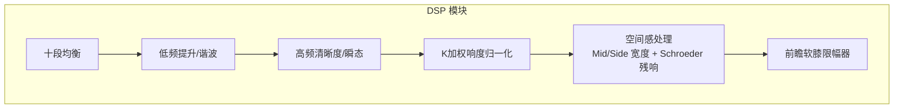
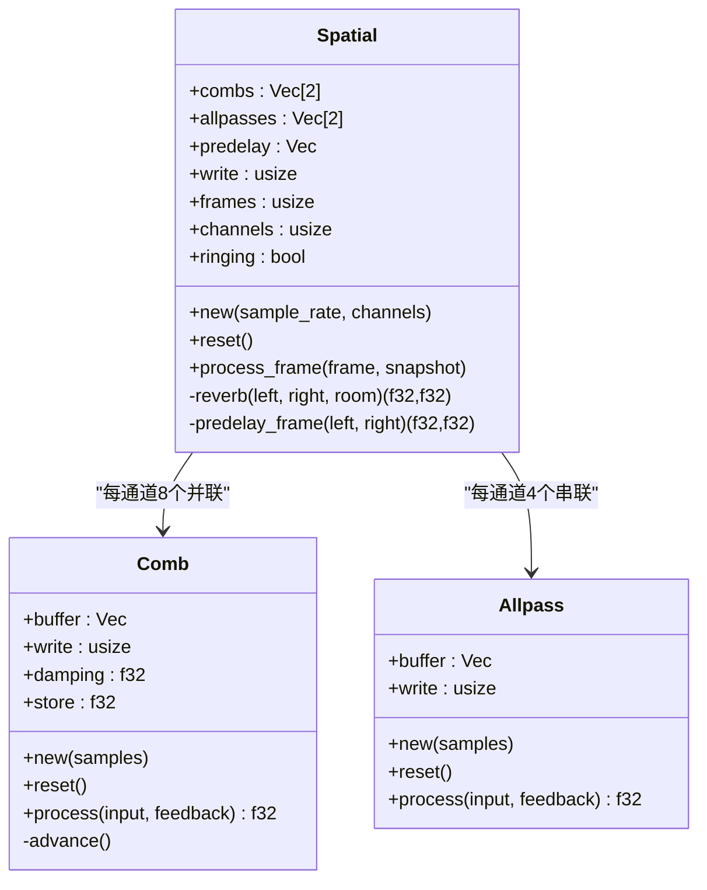
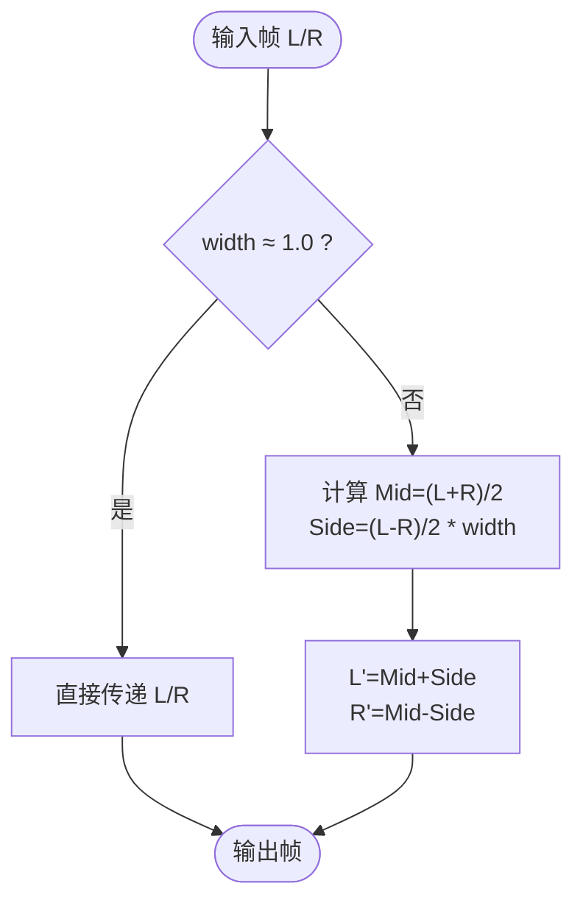
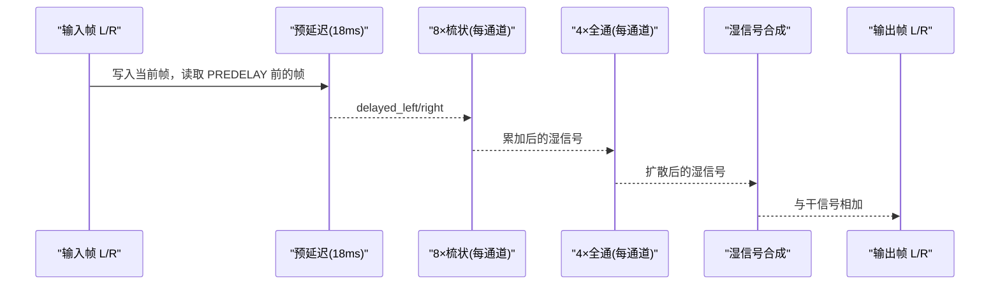
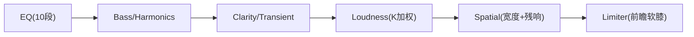
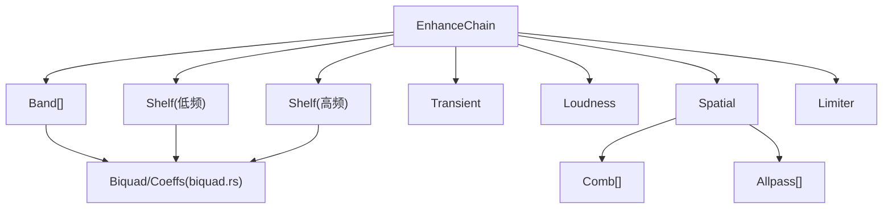

# 空间感处理

<cite>
**本文引用的文件**   
- [crates/mvp-core/src/dsp/enhance.rs](file://crates/mvp-core/src/dsp/enhance.rs)
- [crates/mvp-core/src/dsp/biquad.rs](file://crates/mvp-core/src/dsp/biquad.rs)
- [crates/mvp-core/src/dsp.rs](file://crates/mvp-core/src/dsp.rs)
- [AGENTS.md](file://AGENTS.md)
</cite>

## 目录
1. [简介](#简介)
2. [项目结构](#项目结构)
3. [核心组件](#核心组件)
4. [架构总览](#架构总览)
5. [详细组件分析](#详细组件分析)
6. [依赖关系分析](#依赖关系分析)
7. [性能与实时性](#性能与实时性)
8. [调参与听感指南](#调参与听感指南)
9. [故障排查](#故障排查)
10. [结论](#结论)

## 简介
本技术文档聚焦于“空间感处理”子系统，涵盖以下关键主题：
- Mid/Side 立体声宽度调节算法及其听感影响（控制范围 0.0..=2.0）
- Schroeder 残响实现：8 个并联梳状滤波器 + 4 个全通滤波器的架构、延迟线调谐依据
- 预延迟（18 ms）、反馈动态范围（0.70..=0.97）、高频阻尼的处理方式
- 空间处理对单声道与多声道音频的影响，以及如何保持原始定位信息
- 混响参数调优、空间感质量评估、与其他效果的级联建议

该子系统位于实时音频增强链中，作为“湿信号”阶段加入，不引入额外延迟，且仅在需要时改变样本。

## 项目结构
空间感处理属于 mvp-core 的 DSP 模块，具体实现在 enhance.rs 中，并由 biquad.rs 提供二阶滤波器基础能力。整体增强链顺序为：
- 十段均衡 → 低频/谐波 → 清晰度/瞬态 → 响度归一化 → 空间感（宽度+残响）→ 软膝限幅器

图示来源
- [crates/mvp-core/src/dsp/enhance.rs:10-26](file://crates/mvp-core/src/dsp/enhance.rs#L10-L26)
- [crates/mvp-core/src/dsp/enhance.rs:938-978](file://crates/mvp-core/src/dsp/enhance.rs#L938-L978)

章节来源
- [crates/mvp-core/src/dsp/enhance.rs:1-26](file://crates/mvp-core/src/dsp/enhance.rs#L1-L26)
- [crates/mvp-core/src/dsp.rs:1-19](file://crates/mvp-core/src/dsp.rs#L1-L19)

## 核心组件
- Snapshot：统一参数快照，包含 spatial_width（0.0..=2.0）与 spatial_room（0.0..=1.0），并提供 clamp、is_idle、lerp_towards 等方法保证参数安全与平滑过渡。
- Spatial：空间感处理器，负责 Mid/Side 宽度调节与 Schroeder 残响生成。
- Comb：带高频阻尼的梳状滤波器，内部使用环形缓冲与一阶低通平滑反馈。
- Allpass：全通滤波器，用于扩散尾音，不改变幅度响应，仅扰乱相位。
- EnhanceChain：增强链主控制器，按固定顺序调用各子模块，并管理延迟与状态。

章节来源
- [crates/mvp-core/src/dsp/enhance.rs:58-86](file://crates/mvp-core/src/dsp/enhance.rs#L58-L86)
- [crates/mvp-core/src/dsp/enhance.rs:642-654](file://crates/mvp-core/src/dsp/enhance.rs#L642-L654)
- [crates/mvp-core/src/dsp/enhance.rs:550-588](file://crates/mvp-core/src/dsp/enhance.rs#L550-L588)
- [crates/mvp-core/src/dsp/enhance.rs:590-618](file://crates/mvp-core/src/dsp/enhance.rs#L590-L618)
- [crates/mvp-core/src/dsp/enhance.rs:938-978](file://crates/mvp-core/src/dsp/enhance.rs#L938-L978)

## 架构总览
空间感处理采用经典的 Schroeder 混响布局：8 个并联梳状滤波器（每通道一组）输出后串联 4 个全通滤波器，左右通道通过不同的延迟调谐值产生去相关尾音，从而营造立体声空间感。Mid/Side 宽度控制在残响之前执行，以先扩展或压缩立体声场，再叠加房间尾音。

图示来源
- [crates/mvp-core/src/dsp/enhance.rs:642-654](file://crates/mvp-core/src/dsp/enhance.rs#L642-L654)
- [crates/mvp-core/src/dsp/enhance.rs:550-588](file://crates/mvp-core/src/dsp/enhance.rs#L550-L588)
- [crates/mvp-core/src/dsp/enhance.rs:590-618](file://crates/mvp-core/src/dsp/enhance.rs#L590-L618)

## 详细组件分析

### Mid/Side 立体声宽度调节
- 原理：将左/右声道转换为 Mid（和）与 Side（差）分量，Side 分量乘以 width 系数后再转回 L/R。width=1.0 表示无变化；width>1.0 扩展立体声场；width<1.0 压缩至更居中。
- 实现要点：
  - 当 spatial_width 接近 1.0 时跳过处理，避免不必要的计算。
  - 宽度控制作用于前两个声道，其他声道（如 5.1 的中心与环绕）保持不变，以保留原始定位信息。
- 听感影响：
  - 0.0：完全单声道（Mid 为主，Side 被抑制）。
  - 1.0：原始立体声。
  - 2.0：最大扩展，Side 分量加倍，声像外扩明显，但可能带来相位失真与中心定位变弱。

图示来源
- [crates/mvp-core/src/dsp/enhance.rs:703-743](file://crates/mvp-core/src/dsp/enhance.rs#L703-L743)

章节来源
- [crates/mvp-core/src/dsp/enhance.rs:703-743](file://crates/mvp-core/src/dsp/enhance.rs#L703-L743)

### Schroeder 残响实现
- 架构：
  - 8 个并联梳状滤波器（Comb），每个具有不同延迟长度，避免共振对齐产生音高伪影。
  - 4 个全通滤波器（Allpass）串联，用于扩散尾音，使回声序列听起来更像连续的房间反射。
  - 左右通道分别拥有独立的 Comb 与 Allpass 组，并通过 STEREO_SPREAD 偏移右通道延迟，增加去相关性，使尾音在立体声场中扩散。
- 延迟线调谐值数学依据：
  - COMB_TUNING 与 ALLPASS_TUNING 以 44.1 kHz 为基准给出采样数，实际设备采样率按比例缩放（scaled），确保在不同采样率下保持一致的物理延迟时间。
  - 梳状延迟互质以避免共振峰对齐；全通延迟较短，主要作用为相位扩散。
- 预延迟（PREDELAY_SECONDS = 0.018 s）：
  - 将直达声与早期反射分离，避免早期反射与直达声形成梳状滤波效应，同时保持事件感知的一致性。
- 反馈动态范围（FEEDBACK_MIN=0.70 .. FEEDBACK_MAX=0.97）：
  - 小房间（room≈0）反馈较低，尾音短促；大房间（room≈1）反馈较高，尾音较长且持续。
  - 反馈越高，梳状环路增益越大，需进行 comb_normalisation 补偿，以保持听感上尾音音量随 room 控制线性增长而非被放大或衰减。
- 高频阻尼（DAMPING=0.25）：
  - 在每个梳状环内对反馈路径施加一阶低通，模拟真实房间高频吸收特性，使尾音随时间衰减时高频逐渐损失。
- 全通反馈（ALLPASS_FEEDBACK=0.5）：
  - 平坦幅度响应，仅扰乱相位，增加扩散而不染色。
- 湿信号电平（WET_MAX=0.30）：
  - 在 room=1.0 时的最大湿信号增益，结合平方曲线（room*room）与 comb_normalisation，使得滑块底部为轻微空间提示，顶部为大厅感，且尾音不会淹没干信号。

图示来源
- [crates/mvp-core/src/dsp/enhance.rs:752-797](file://crates/mvp-core/src/dsp/enhance.rs#L752-L797)
- [crates/mvp-core/src/dsp/enhance.rs:514-548](file://crates/mvp-core/src/dsp/enhance.rs#L514-L548)

章节来源
- [crates/mvp-core/src/dsp/enhance.rs:514-548](file://crates/mvp-core/src/dsp/enhance.rs#L514-L548)
- [crates/mvp-core/src/dsp/enhance.rs:752-797](file://crates/mvp-core/src/dsp/enhance.rs#L752-L797)

### 单声道与多声道音频的空间处理
- 单声道源：
  - 由于左右通道延迟调谐不同，尾音在左右通道之间去相关，避免单声道源仍停留在中间的问题。
  - 测试断言尾音通道相关性显著降低（<0.5），证明尾音具备立体声扩散。
- 多声道音频（如 5.1）：
  - 仅处理前两个声道（L/R），中心与环绕声道保持不变，尊重原始定位信息。
  - 空间尾音基于两通道构建，无论设备声道数如何，内存占用约 100 kB，且在回调中不再分配。

章节来源
- [crates/mvp-core/src/dsp/enhance.rs:620-641](file://crates/mvp-core/src/dsp/enhance.rs#L620-L641)
- [crates/mvp-core/src/dsp/enhance.rs:1472-1491](file://crates/mvp-core/src/dsp/enhance.rs#L1472-L1491)

### 与增强链的集成与时序
- 处理顺序：EQ → Bass/Harmonics → Clarity/Transient → Loudness → Spatial → Limiter。
- Spatial 是“湿”阶段：尾音叠加到未改变的干信号上，因此不引入额外延迟；只有 Limiter 的前瞻机制贡献约 1 ms 延迟。
- 参数平滑：Snapshot.lerp_towards 在块级别平滑参数变化，避免“拉链噪声”。

图示来源
- [crates/mvp-core/src/dsp/enhance.rs:10-26](file://crates/mvp-core/src/dsp/enhance.rs#L10-L26)
- [crates/mvp-core/src/dsp/enhance.rs:980-989](file://crates/mvp-core/src/dsp/enhance.rs#L980-L989)

章节来源
- [crates/mvp-core/src/dsp/enhance.rs:10-26](file://crates/mvp-core/src/dsp/enhance.rs#L10-L26)
- [crates/mvp-core/src/dsp/enhance.rs:980-989](file://crates/mvp-core/src/dsp/enhance.rs#L980-L989)

## 依赖关系分析
- EnhanceChain 依赖：
  - Band/Shelf/Biquad：来自 biquad.rs，提供 RBJ 二阶滤波器实现。
  - Spatial：内部组合 Comb 与 Allpass，以及 predelay 环形缓冲。
  - Limiter：前瞻限幅器，保护后续输出不过载。
- 外部依赖：
  - 无运行时分配与锁操作（除初始化阶段），所有缓冲区在 EnhanceChain::new 中一次性分配。
  - 参数通过 EnhanceParams（原子块+生成号）从 UI 线程传递到实时回调线程，保证一致性。

图示来源
- [crates/mvp-core/src/dsp/enhance.rs:938-978](file://crates/mvp-core/src/dsp/enhance.rs#L938-L978)
- [crates/mvp-core/src/dsp/biquad.rs:16-29](file://crates/mvp-core/src/dsp/biquad.rs#L16-L29)

章节来源
- [crates/mvp-core/src/dsp/enhance.rs:938-978](file://crates/mvp-core/src/dsp/enhance.rs#L938-L978)
- [crates/mvp-core/src/dsp/biquad.rs:1-12](file://crates/mvp-core/src/dsp/biquad.rs#L1-L12)

## 性能与实时性
- 零分配与零锁：EnhanceChain 在设备回调中不分配内存、不加锁、不调用文件系统；所有状态与缓冲区在 new 时创建。
- 参数更新：EnhanceParams 使用原子块与生成号（seqlock），回调线程最多重试 4 次读取一致快照，避免阻塞。
- 平滑过渡：参数在块级别 lerp，避免滤波器系数频繁重算导致的“拉链噪声”。
- 延迟报告：仅 Limiter 的前瞻贡献约 1 ms 延迟；Spatial 不增加延迟，因为它是湿信号叠加。

章节来源
- [crates/mvp-core/src/dsp/enhance.rs:1-9](file://crates/mvp-core/src/dsp/enhance.rs#L1-L9)
- [crates/mvp-core/src/dsp/enhance.rs:206-321](file://crates/mvp-core/src/dsp/enhance.rs#L206-L321)
- [crates/mvp-core/src/dsp/enhance.rs:980-989](file://crates/mvp-core/src/dsp/enhance.rs#L980-L989)

## 调参与听感指南

### 立体声宽度（spatial_width，0.0..=2.0）
- 推荐设置：
  - 0.0：适合单声道内容或希望声音集中在中央的场景。
  - 1.0：默认值，保持原始立体声定位。
  - 1.2–1.6：适度扩展，增强空间感而不严重破坏中心定位。
  - 2.0：最大扩展，适合音乐或环境声，但可能削弱人声居中感。
- 注意事项：
  - 过宽的宽度可能导致相位问题与中心定位模糊，尤其在单声道源上。
  - 与残响配合时，先调整宽度再添加残响，以获得自然的扩散效果。

### 残响量（spatial_room，0.0..=1.0）
- 推荐设置：
  - 0.0：关闭残响。
  - 0.2–0.4：小型房间感，适合对话或小空间。
  - 0.5–0.7：中型房间，适合一般音乐播放。
  - 0.8–1.0：大厅感，尾音长且明亮，适合大型空间或氛围音乐。
- 听感校准：
  - 滑块底部应为“轻微空间提示”，顶部为“可闻尾音但仍低于干信号”。
  - 尾音持续时间与音量应随 room 增大而增加，测试断言已验证这一点。

### 预延迟（18 ms）
- 作用：分离直达声与早期反射，避免梳状滤波效应，同时保持事件感知一致性。
- 调参建议：通常无需用户调整；若感觉早期反射与直达声冲突，可适当增加预延迟（需修改源码常量）。

### 反馈与阻尼
- 反馈范围（0.70..=0.97）：
  - 小房间（低反馈）尾音短促，大房间（高反馈）尾音持久。
  - 注意高反馈可能提升峰值，需由 Limiter 限制。
- 高频阻尼（0.25）：
  - 模拟真实房间高频吸收，使尾音自然衰减；不建议用户调整。

### 与其他效果的级联
- 顺序建议：
  - EQ → Bass/Harmonics → Clarity/Transient → Loudness → Spatial → Limiter。
  - 先做频率与动态处理，再做空间感，最后限幅，避免空间尾音导致过载。
- 与响度归一化的关系：
  - Spatial 在 Loudness 之后，确保归一化针对的是经过 EQ 与空间处理的信号。
- 与限幅器的关系：
  - Limiter 保护 Spatial 增加的尾音峰值，确保输出不超过天花板。

章节来源
- [crates/mvp-core/src/dsp/enhance.rs:10-26](file://crates/mvp-core/src/dsp/enhance.rs#L10-L26)
- [crates/mvp-core/src/dsp/enhance.rs:771-775](file://crates/mvp-core/src/dsp/enhance.rs#L771-L775)
- [crates/mvp-core/src/dsp/enhance.rs:1407-1457](file://crates/mvp-core/src/dsp/enhance.rs#L1407-L1457)

## 故障排查
- 问题：开启空间感后出现“拉链噪声”或参数突变。
  - 原因：参数未在块级别平滑。
  - 解决：确保使用 Snapshot.lerp_towards，避免每样本重算滤波器系数。
- 问题：单声道源仍居中，无法听到空间感。
  - 原因：旧版本单交叉馈送 tap 无法去相关。
  - 解决：确认使用 8×Comb + 4×Allpass 架构，且左右通道延迟不同（STEREO_SPREAD）。
- 问题：关闭残响后仍有尾音泄漏。
  - 原因：缓冲未清空。
  - 解决：确保 Spatial.reset 在 room=0 时被调用，测试已断言此行为。
- 问题：尾音过大导致削波。
  - 原因：未启用 Limiter 或天花板设置过高。
  - 解决：启用 Limiter 并设置合理 ceiling_db（默认 -0.3 dBFS）。

章节来源
- [crates/mvp-core/src/dsp/enhance.rs:1493-1533](file://crates/mvp-core/src/dsp/enhance.rs#L1493-L1533)
- [crates/mvp-core/src/dsp/enhance.rs:828-916](file://crates/mvp-core/src/dsp/enhance.rs#L828-L916)

## 结论
空间感处理系统通过 Mid/Side 宽度调节与 Schroeder 残响（8×Comb + 4×Allpass）实现高效、低延迟的立体声扩展与房间感营造。其设计强调：
- 实时性与零分配：在设备回调中稳定运行。
- 听感优先：预延迟、反馈动态范围、高频阻尼与湿信号电平均经过校准。
- 兼容性与定位保持：仅处理前两个声道，尊重多声道原始定位。
- 可扩展性：参数平滑与链式架构便于与其他效果协同工作。

对于用户而言，建议从 moderate width（1.2–1.6）与小至中型房间（0.2–0.7）开始，逐步调整至符合内容类型与听音环境的最佳平衡。