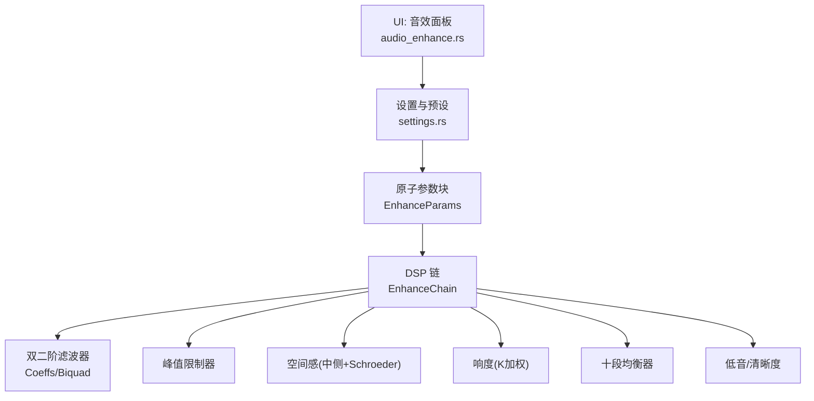
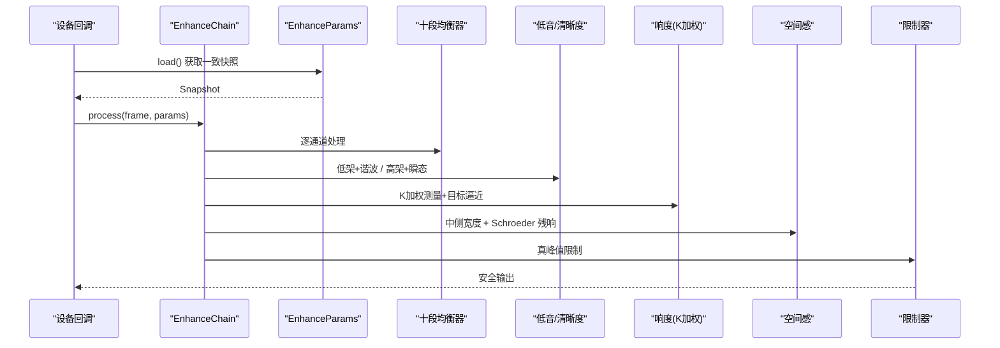
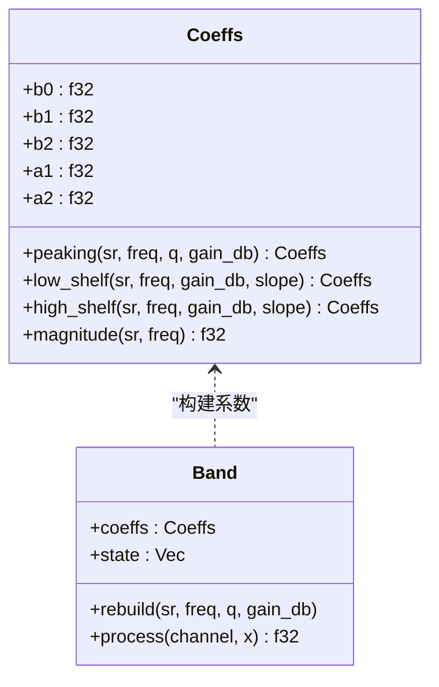
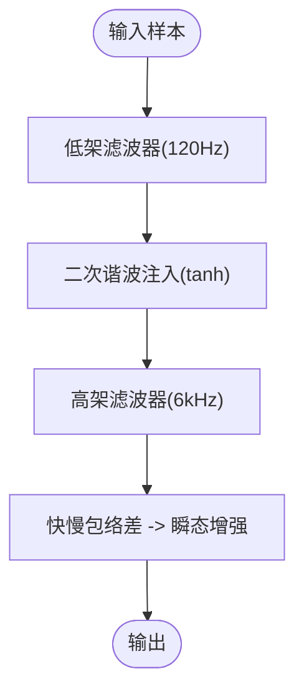
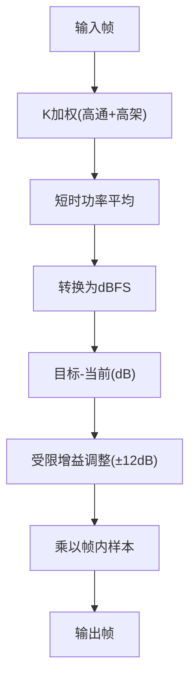
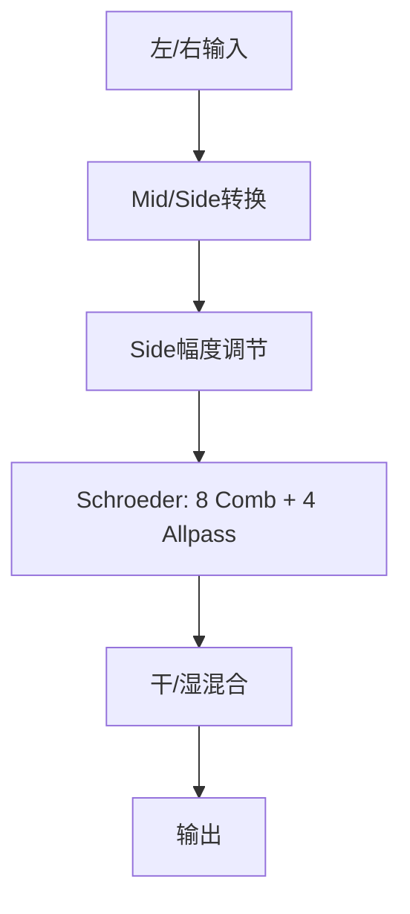
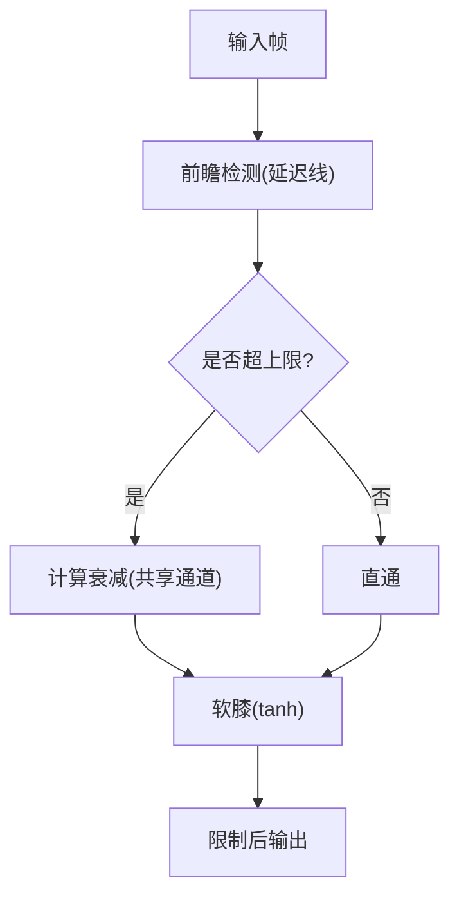
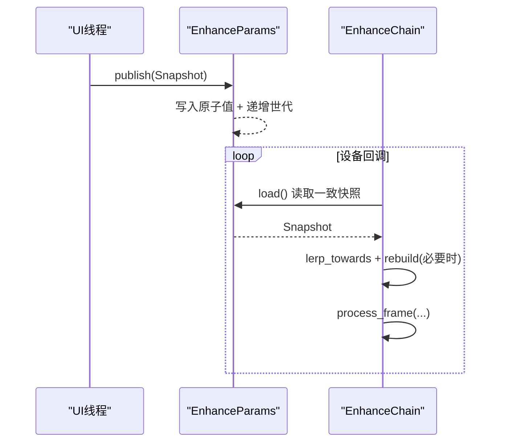
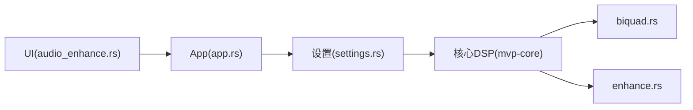

# 音效增强

<cite>
**本文引用的文件**
- [enhance.rs](file://crates/mvp-core/src/dsp/enhance.rs)
- [biquad.rs](file://crates/mvp-core/src/dsp/biquad.rs)
- [dsp.rs](file://crates/mvp-core/src/dsp.rs)
- [audio_enhance.rs](file://crates/mvp-player/src/ui/audio_enhance.rs)
- [settings.rs](file://crates/mvp-player/src/settings.rs)
- [app.rs](file://crates/mvp-player/src/app.rs)
</cite>

## 目录
1. [简介](#简介)
2. [项目结构](#项目结构)
3. [核心组件](#核心组件)
4. [架构总览](#架构总览)
5. [详细组件分析](#详细组件分析)
6. [依赖关系分析](#依赖关系分析)
7. [性能与延迟优化](#性能与延迟优化)
8. [故障排查指南](#故障排查指南)
9. [结论](#结论)
10. [附录](#附录)

## 简介
本技术文档面向“音效增强系统”，系统性说明十段均衡器、低音增强、清晰度提升、响度归一化（基于 K 加权）、空间感处理（中侧宽度与 Schroeder 残响）以及峰值限制器的实现原理与执行顺序。同时覆盖实时参数更新机制、无锁原子参数块、音频质量评估与延迟/性能调优要点，帮助开发者与高级用户理解并正确使用该 DSP 链。

## 项目结构
- 核心 DSP 位于 mvp-core：
  - 双二阶滤波器与系数计算：biquad.rs
  - 增强链（EQ、低音/清晰度、响度、空间、限制器）：enhance.rs
  - 模块导出与通用增益工具：dsp.rs
- 用户界面与设置：
  - 音效面板 UI：audio_enhance.rs
  - 持久化设置与预设：settings.rs
  - 应用层同步与状态查询：app.rs

图表来源
- [enhance.rs:1-120](file://crates/mvp-core/src/dsp/enhance.rs#L1-L120)
- [biquad.rs:1-170](file://crates/mvp-core/src/dsp/biquad.rs#L1-L170)
- [audio_enhance.rs:1-120](file://crates/mvp-player/src/ui/audio_enhance.rs#L1-L120)
- [settings.rs:473-562](file://crates/mvp-player/src/settings.rs#L473-L562)

章节来源
- [enhance.rs:1-120](file://crates/mvp-core/src/dsp/enhance.rs#L1-L120)
- [biquad.rs:1-170](file://crates/mvp-core/src/dsp/biquad.rs#L1-L170)
- [audio_enhance.rs:1-120](file://crates/mvp-player/src/ui/audio_enhance.rs#L1-L120)
- [settings.rs:473-562](file://crates/mvp-player/src/settings.rs#L473-L562)

## 核心组件
- 十段均衡器：10 个固定中心频率的峰谷滤波器（31 Hz–16 kHz），按八度布局，支持 Q 调节与 ±12 dB 增益。
- 低音增强：低架滤波器 + 二次谐波注入，用于在小型扬声器上重建低频存在感。
- 清晰度提升：高架滤波器 + 瞬态增强（快慢包络差），突出起音细节。
- 响度归一化：近似 BS.1770 K 加权短时电平测量 + 目标逼近增益控制，避免对白与音乐音量差异过大。
- 空间感处理：中侧立体声宽度调节 + Schroeder 残响（多梳状滤波 + 全通扩散）。
- 峰值限制器：前馈式真峰值限制，带软膝限幅，保护输出不削波。
- 无锁参数更新：原子参数块 + 世代计数，保证实时线程读取一致快照；参数平滑过渡避免“拉链噪声”。

章节来源
- [enhance.rs:38-182](file://crates/mvp-core/src/dsp/enhance.rs#L38-L182)
- [enhance.rs:439-512](file://crates/mvp-core/src/dsp/enhance.rs#L439-L512)
- [enhance.rs:620-776](file://crates/mvp-core/src/dsp/enhance.rs#L620-L776)
- [enhance.rs:828-932](file://crates/mvp-core/src/dsp/enhance.rs#L828-L932)
- [biquad.rs:76-170](file://crates/mvp-core/src/dsp/biquad.rs#L76-L170)

## 架构总览
DSP 链执行顺序（从输入到输出）：
1) 十段均衡器 → 2) 低音增强（低架 + 二次谐波）→ 3) 清晰度提升（高架 + 瞬态增强）→ 4) 响度归一化（K 加权）→ 5) 空间感（中侧宽度 + Schroeder 残响）→ 6) 峰值限制器（真峰值保护）

设计要点：
- 均衡器在最前，确保屏幕曲线与实际信号一致。
- 响度归一化放在效果之后，避免追逐均衡变化。
- 空间感在前，其尾音可能抬高峰值，由限制器兜底。
- 限制器在最后，防止任何后续增益导致削波。
- 所有参数通过原子块发布，实时线程以无锁方式读取，且参数平滑过渡。

图表来源
- [enhance.rs:10-24](file://crates/mvp-core/src/dsp/enhance.rs#L10-L24)
- [enhance.rs:991-1077](file://crates/mvp-core/src/dsp/enhance.rs#L991-L1077)

章节来源
- [enhance.rs:10-24](file://crates/mvp-core/src/dsp/enhance.rs#L10-L24)
- [enhance.rs:991-1077](file://crates/mvp-core/src/dsp/enhance.rs#L991-L1077)

## 详细组件分析

### 十段均衡器（31 Hz–16 kHz 八度分段）
- 频段：固定 10 个中心频率，覆盖经典八度布局。
- 滤波器：RBJ 双二阶峰谷滤波器，Q 可调，增益范围 ±12 dB。
- 系数生成：根据采样率与频率计算，自动限制低于奈奎斯特频率，避免不稳定。
- 可视化：UI 使用与 DSP 相同的系数计算响应曲线，保证所见即所得。

图表来源
- [biquad.rs:16-170](file://crates/mvp-core/src/dsp/biquad.rs#L16-L170)
- [enhance.rs:323-365](file://crates/mvp-core/src/dsp/enhance.rs#L323-L365)

章节来源
- [enhance.rs:38-45](file://crates/mvp-core/src/dsp/enhance.rs#L38-L45)
- [enhance.rs:323-365](file://crates/mvp-core/src/dsp/enhance.rs#L323-L365)
- [biquad.rs:76-170](file://crates/mvp-core/src/dsp/biquad.rs#L76-L170)
- [audio_enhance.rs:296-372](file://crates/mvp-player/src/ui/audio_enhance.rs#L296-L372)

### 低音增强与清晰度提升
- 低音增强：低架滤波器（截止约 120 Hz）叠加二次谐波注入，在小扬声器上重建低频感知。
- 清晰度提升：高架滤波器（截止约 6 kHz）叠加瞬态增强，利用快慢包络差突出起音细节。
- 参数平滑：参数变化采用块级平滑，避免每样本重算系数导致的“拉链噪声”。

图表来源
- [enhance.rs:54-56](file://crates/mvp-core/src/dsp/enhance.rs#L54-L56)
- [enhance.rs:405-437](file://crates/mvp-core/src/dsp/enhance.rs#L405-L437)
- [enhance.rs:1122-1132](file://crates/mvp-core/src/dsp/enhance.rs#L1122-L1132)

章节来源
- [enhance.rs:405-437](file://crates/mvp-core/src/dsp/enhance.rs#L405-L437)
- [enhance.rs:1122-1132](file://crates/mvp-core/src/dsp/enhance.rs#L1122-L1132)

### 响度归一化（K 加权，BS.1770 近似）
- 测量路径：先通过 ITU-R BS.1770 定义的 K 加权（高通 + 高架），再计算短时功率均值。
- 目标逼近：将当前电平与目标 dBFS 比较，得到所需增益，并以受控速度跟踪（避免泵浦效应）。
- 关闭策略：目标低于阈值时，增益平滑回归 unity，不引入额外处理。

图表来源
- [enhance.rs:439-512](file://crates/mvp-core/src/dsp/enhance.rs#L439-L512)
- [biquad.rs:135-150](file://crates/mvp-core/src/dsp/biquad.rs#L135-L150)

章节来源
- [enhance.rs:439-512](file://crates/mvp-core/src/dsp/enhance.rs#L439-L512)

### 空间感处理（中侧宽度 + Schroeder 残响）
- 中侧宽度：将左右声道转换为 Mid/Side，调节 Side 分量比例后还原，实现立体声宽度扩展或收缩。
- Schroeder 残响：8 条梳状滤波器并联 + 4 条全通串联，产生自然混响尾音；左右通道延迟微调以去相关。
- 预延迟：避免早期反射与干信号形成梳状干涉。
- 湿信号混合：残响作为湿信号加回干信号，不引入额外延迟。

图表来源
- [enhance.rs:620-776](file://crates/mvp-core/src/dsp/enhance.rs#L620-L776)
- [enhance.rs:514-548](file://crates/mvp-core/src/dsp/enhance.rs#L514-L548)

章节来源
- [enhance.rs:620-776](file://crates/mvp-core/src/dsp/enhance.rs#L620-L776)

### 峰值限制器（真峰值保护）
- 前馈式限制：使用短延迟线进行前瞻检测，发现峰值超过上限时降低增益。
- 软膝限幅：在 −3 dBFS 附近使用 tanh 软膝，避免硬削波失真。
- 通道共享增益：取各通道最大峰值决定统一衰减，避免立体像漂移。
- 释放时间：约 50 ms，兼顾恢复速度与听感稳定。

图表来源
- [enhance.rs:828-932](file://crates/mvp-core/src/dsp/enhance.rs#L828-L932)

章节来源
- [enhance.rs:828-932](file://crates/mvp-core/src/dsp/enhance.rs#L828-L932)

### 无锁参数更新与平滑
- 原子参数块：所有参数以 AtomicU32 存储，配合 AtomicU64 世代计数，保证读一致性。
- 快速旁路：AtomicBool 旁路标志，实时线程可零开销跳过整条链。
- 参数平滑：目标快照与当前快照线性插值，平滑时间常数约 30 ms，避免滑块拖动时的阶梯/拉链噪声。
- 重建优化：仅当参数显著变化时重建滤波器系数，减少 CPU 开销。

图表来源
- [enhance.rs:192-321](file://crates/mvp-core/src/dsp/enhance.rs#L192-L321)
- [enhance.rs:140-182](file://crates/mvp-core/src/dsp/enhance.rs#L140-L182)
- [enhance.rs:991-1077](file://crates/mvp-core/src/dsp/enhance.rs#L991-L1077)

章节来源
- [enhance.rs:192-321](file://crates/mvp-core/src/dsp/enhance.rs#L192-L321)
- [enhance.rs:140-182](file://crates/mvp-core/src/dsp/enhance.rs#L140-L182)

## 依赖关系分析
- UI 层：
  - 显示延迟、就绪状态、采样率等元信息，绘制响应曲线。
  - 提供预设选择与参数调节，调用应用层发布。
- 设置层：
  - 持久化 AudioEnhanceSettings，包含预设、频段增益、带宽、低音/清晰度、响度、限制器、空间感等。
  - 将设置映射为 DSP 所需的 Snapshot，并进行边界钳制。
- 核心 DSP：
  - 提供 EnhanceChain、EnhanceParams、Snapshot、Coeffs、Biquad 等类型与算法。
  - 严格无分配、无锁、无阻塞的实时处理约束。

图表来源
- [audio_enhance.rs:1-120](file://crates/mvp-player/src/ui/audio_enhance.rs#L1-L120)
- [settings.rs:473-562](file://crates/mvp-player/src/settings.rs#L473-L562)
- [dsp.rs:13-19](file://crates/mvp-core/src/dsp.rs#L13-L19)

章节来源
- [audio_enhance.rs:1-120](file://crates/mvp-player/src/ui/audio_enhance.rs#L1-L120)
- [settings.rs:473-562](file://crates/mvp-player/src/settings.rs#L473-L562)
- [dsp.rs:13-19](file://crates/mvp-core/src/dsp.rs#L13-L19)

## 性能与延迟优化
- 零分配与无锁：
  - 所有缓冲区在链初始化时一次性分配，运行时不再增长。
  - 参数通过原子块传递，避免互斥锁与上下文切换。
- 快速旁路与空闲检测：
  - 当所有参数中性时，链直接返回，不进入处理流程，保持比特级透明。
- 系数重建节流：
  - 仅在参数显著变化时重建滤波器系数，减少 CPU 占用。
- 延迟控制：
  - 链延迟主要来自限制器的前瞻缓冲（约 1 ms），其他阶段（如残响）为湿信号叠加，不增加延迟。
- 稳定性与数值安全：
  - 滤波器系数异常时回退至直通，避免 NaN/Inf 污染后续处理。
  - 限制器软膝确保输出不超过单位区间，避免削波。

章节来源
- [enhance.rs:934-1007](file://crates/mvp-core/src/dsp/enhance.rs#L934-L1007)
- [enhance.rs:1079-1103](file://crates/mvp-core/src/dsp/enhance.rs#L1079-L1103)
- [biquad.rs:180-210](file://crates/mvp-core/src/dsp/biquad.rs#L180-L210)

## 故障排查指南
- 没有声音或无声：
  - 检查是否处于旁路模式或所有参数中性，此时链会跳过处理。
  - 确认已启用输出设备，UI 会提示“当前没有可用的音频输出设备”。
- 声音失真或削波：
  - 提高限制器上限或降低整体增益；检查是否有过高的均衡增益或空间残响。
- 延迟过高：
  - 链延迟主要由限制器前瞻决定，无法完全消除；可通过降低采样率或减少复杂效果来缓解。
- 参数突变噪声：
  - 确保使用滑块拖动而非瞬时跳变；参数平滑可避免拉链噪声。
- 空间感无效：
  - 确认立体声宽度与残响未设为中性值；单声道源需依赖去相关尾音才能感知空间。

章节来源
- [enhance.rs:28-32](file://crates/mvp-core/src/dsp/enhance.rs#L28-L32)
- [enhance.rs:991-1007](file://crates/mvp-core/src/dsp/enhance.rs#L991-L1007)
- [audio_enhance.rs:111-125](file://crates/mvp-player/src/ui/audio_enhance.rs#L111-L125)

## 结论
该音效增强系统以严格的实时约束为核心，实现了从均衡、低音/清晰度、响度归一到空间感与限制器的完整 DSP 链。通过原子参数块与平滑过渡，系统在保持音质与低延迟的同时，提供了直观的用户控制与稳定的运行保障。对于高质量播放体验，建议合理设置响度目标与限制器上限，并根据内容特性调整空间感与清晰度。

## 附录
- 预设与配置：
  - 内置多种均衡预设（温暖、明亮、人声、摇滚、流行等），也可自定义。
  - 所有参数持久化于 settings.json，支持热加载与边界校验。
- 质量评估：
  - 使用 RBJ 系数计算的频响曲线与测试用例验证均衡器准确性。
  - 限制器与残响行为通过单元测试确保符合预期。

章节来源
- [settings.rs:433-471](file://crates/mvp-player/src/settings.rs#L433-L471)
- [settings.rs:473-562](file://crates/mvp-player/src/settings.rs#L473-L562)
- [biquad.rs:212-326](file://crates/mvp-core/src/dsp/biquad.rs#L212-L326)
- [enhance.rs:1134-1535](file://crates/mvp-core/src/dsp/enhance.rs#L1134-L1535)