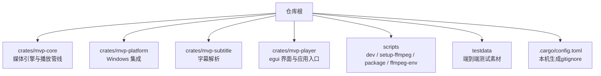
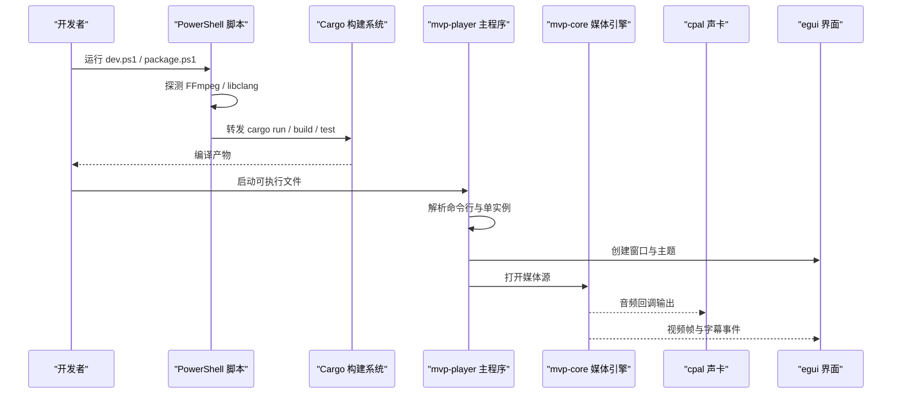
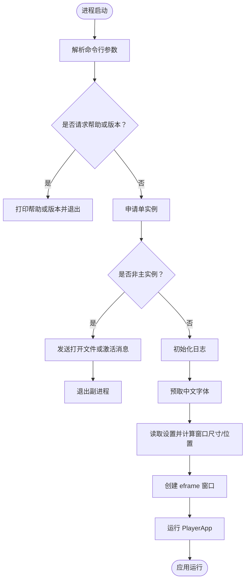
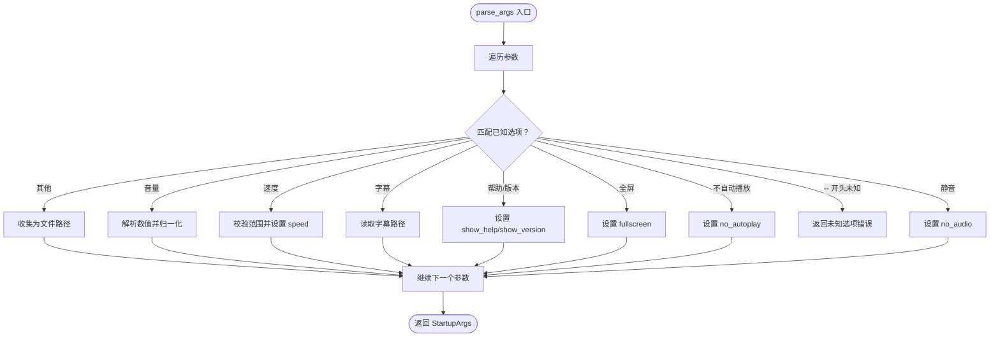
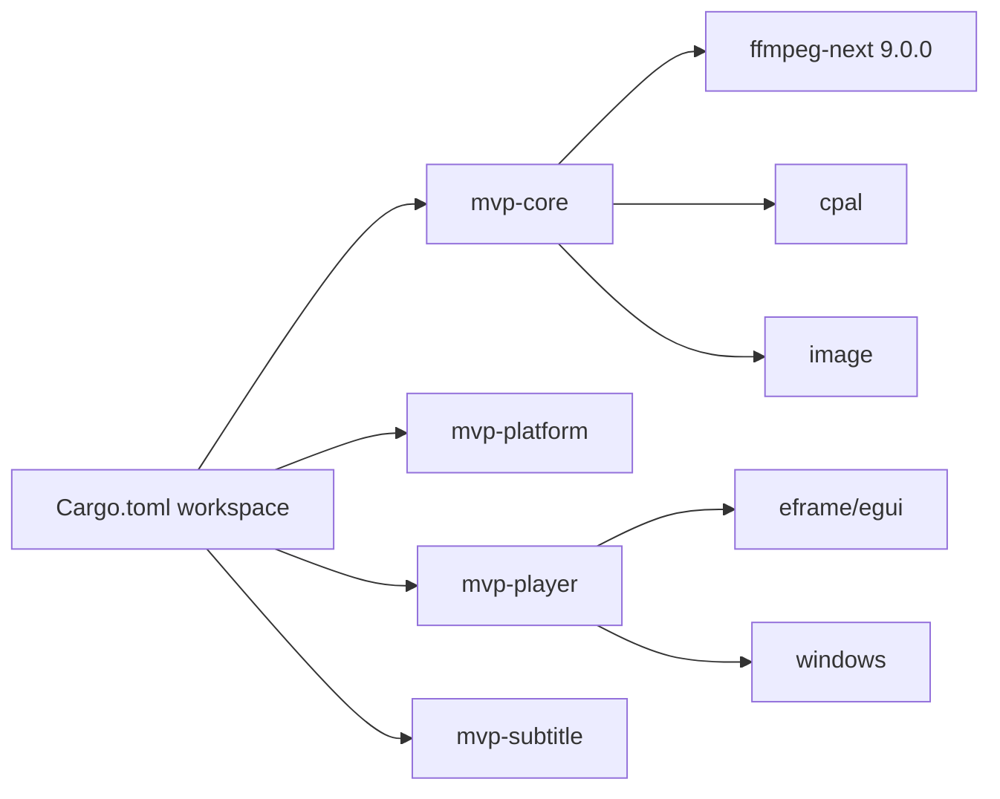

# 快速开始指南

<cite>
**本文引用的文件**   
- [README.md](file://README.md)
- [Cargo.toml](file://Cargo.toml)
- [scripts/dev.ps1](file://scripts/dev.ps1)
- [scripts/setup-ffmpeg.ps1](file://scripts/setup-ffmpeg.ps1)
- [scripts/ffmpeg-env.ps1](file://scripts/ffmpeg-env.ps1)
- [scripts/package.ps1](file://scripts/package.ps1)
- [crates/mvp-player/src/main.rs](file://crates/mvp-player/src/main.rs)
</cite>

## 目录
1. [简介](#简介)
2. [项目结构](#项目结构)
3. [核心组件](#核心组件)
4. [架构总览](#架构总览)
5. [详细组件分析](#详细组件分析)
6. [依赖关系分析](#依赖关系分析)
7. [性能注意事项](#性能注意事项)
8. [故障排查](#故障排查)
9. [结论](#结论)
10. [附录：命令行与快捷键](#附录命令行与快捷键)

## 简介
本指南面向首次接触 MVP-Versatile-Player 的新贡献者，目标是让你在尽可能少的步骤内完成开发环境搭建、运行、测试、构建与打包分发。项目是一个面向 Windows 的多功能音视频与图片播放器，直接链接 FFmpeg 共享库，使用 Rust 编写，并通过 PowerShell 脚本统一准备本机依赖。

## 项目结构
仓库采用 Cargo workspace 组织，核心由四个 crate 组成：媒体引擎、Windows 平台集成、字幕解析和 egui 界面应用。脚本目录提供开发、打包与本地环境探测工具。

图表来源
- [Cargo.toml:1-8](file://Cargo.toml#L1-L8)
- [README.md:315-323](file://README.md#L315-L323)

章节来源
- [Cargo.toml:1-8](file://Cargo.toml#L1-L8)
- [README.md:315-323](file://README.md#L315-L323)

## 核心组件
- mvp-core：FFmpeg 绑定、A/V 时钟、队列与工作线程、播放列表、图片查看器与 HDR/Dolby Vision 处理逻辑。
- mvp-platform：Windows 文件关联、单实例 IPC、外壳交互、电源与显示器信息。
- mvp-subtitle：SRT/ASS/VTT/MicroDVD 等字幕格式解析与编码识别。
- mvp-player：egui 界面、窗口生命周期、命令行参数解析、日志与启动流程。

章节来源
- [README.md:315-323](file://README.md#L315-L323)
- [crates/mvp-player/src/main.rs:1-14](file://crates/mvp-player/src/main.rs#L1-L14)

## 架构总览
MVP-Versatile-Player 的启动与运行路径如下：PowerShell 脚本负责准备 FFmpeg 与 libclang 的环境变量并转发 cargo；应用入口解析命令行、建立单实例、创建窗口并交给 PlayerApp；媒体解码在后台线程进行，音频通过 cpal 输出，视频帧进入渲染管线。

图表来源
- [scripts/dev.ps1:1-16](file://scripts/dev.ps1#L1-L16)
- [scripts/setup-ffmpeg.ps1:1-23](file://scripts/setup-ffmpeg.ps1#L1-L23)
- [crates/mvp-player/src/main.rs:40-181](file://crates/mvp-player/src/main.rs#L40-L181)

## 详细组件分析

### 开发环境搭建
1. 安装 Rust 工具链（x86_64-pc-windows-msvc），版本要求 1.85+。
2. 安装 Visual Studio 2022 的 MSVC 生成工具，确保包含 link.exe 与 Windows SDK。
3. 准备 FFmpeg 9.0 共享库开发包：
   - 推荐通过 `scripts/setup-ffmpeg.ps1` 自动下载或复用已有开发包。
   - 脚本会写入 `.cargo/config.toml`，记录本机 FFmpeg 与 libclang 路径。
4. 配置 libclang：
   - 若未找到，脚本会在配置文件中给出安装建议。
   - 可通过环境变量、pip 安装的 libclang、LLVM 或 Visual Studio 内置 LLVM 被探测到。
5. 克隆仓库后，可直接运行 `scripts/dev.ps1`，它会在缺少本机配置时自动调用 `setup-ffmpeg.ps1 -NoDownload`。

章节来源
- [README.md:153-231](file://README.md#L153-L231)
- [scripts/setup-ffmpeg.ps1:1-23](file://scripts/setup-ffmpeg.ps1#L1-L23)
- [scripts/ffmpeg-env.ps1:1-21](file://scripts/ffmpeg-env.ps1#L1-L21)

### 克隆与运行
- 克隆仓库后，推荐使用 PowerShell 运行开发脚本：
  - 测试工作区：`.\scripts\dev.ps1 test --workspace`
  - 构建应用：`.\scripts\dev.ps1 build -p mvp-player`
  - 运行应用：`.\scripts\dev.ps1 run -p mvp-player`
  - 发布构建：`.\scripts\dev.ps1 build --release -p mvp-player`
- dev.ps1 会把 FFmpeg 的 bin 目录加入 PATH，使 cargo run/test 能在运行时找到 DLL。
- 如果已经构建过，也可直接运行 target/release/mvp-versatile-player.exe。

章节来源
- [README.md:233-253](file://README.md#L233-L253)
- [scripts/dev.ps1:1-16](file://scripts/dev.ps1#L1-L16)
- [scripts/dev.ps1:30-71](file://scripts/dev.ps1#L30-L71)

### 构建与打包分发
- 构建命令：
  - 开发构建：`.\scripts\dev.ps1 build -p mvp-player`
  - 发布构建：`.\scripts\dev.ps1 build --release -p mvp-player`
- 打包分发：
  - 运行 `.\scripts\package.ps1`，它会构建 release 版本，复制可执行文件与 FFmpeg DLL，并附带 README/LICENCE。
  - 产物位于 dist/MVP-Versatile-Player，可直接拷贝到其他机器运行。

章节来源
- [README.md:255-262](file://README.md#L255-L262)
- [scripts/package.ps1:1-14](file://scripts/package.ps1#L1-L14)
- [scripts/package.ps1:27-79](file://scripts/package.ps1#L27-L79)

### 基本测试流程
- 运行全部测试：`.\scripts\dev.ps1 test --workspace`
- 测试覆盖端到端播放、界面行为、引擎单元、字幕解析与 Windows 集成。
- 需要注册表的测试默认跳过，可使用指定命令启用。

章节来源
- [README.md:457-499](file://README.md#L457-L499)

### 应用入口与控制流
应用入口 main.rs 的职责包括：
- 解析命令行参数。
- 获取单实例互斥体，或将文件列表发送给已运行的主实例。
- 初始化日志、加载字体、计算窗口尺寸与位置。
- 创建 eframe 窗口并交给 PlayerApp。

图表来源
- [crates/mvp-player/src/main.rs:40-181](file://crates/mvp-player/src/main.rs#L40-L181)

章节来源
- [crates/mvp-player/src/main.rs:1-14](file://crates/mvp-player/src/main.rs#L1-L14)
- [crates/mvp-player/src/main.rs:40-181](file://crates/mvp-player/src/main.rs#L40-L181)

### 命令行参数解析
main.rs 中的 parse_args 实现了一个轻量级参数解析器，支持：
- -f/--fullscreen：全屏启动
- --no-autoplay/--paused：本次启动不自动播放
- --no-audio/--mute：不打开音频输出
- --volume <值>：初始音量，支持 0.0-2.0 或百分比
- --speed <值>：初始速度，范围 0.25-4.0
- -s/--subtitle <文件>：为第一个文件加载外部字幕
- -h/--help：显示帮助
- -v/--version：显示版本与 FFmpeg 版本

未知以 -- 开头的选项会被拒绝并提示错误。

图表来源
- [crates/mvp-player/src/main.rs:296-347](file://crates/mvp-player/src/main.rs#L296-L347)

章节来源
- [crates/mvp-player/src/main.rs:296-347](file://crates/mvp-player/src/main.rs#L296-L347)

## 依赖关系分析
- 工作区成员：mvp-core、mvp-platform、mvp-player、mvp-subtitle。
- 关键外部依赖：
  - FFmpeg：通过 ffmpeg-next 9.0.0 绑定，需共享库开发包。
  - libclang：bindgen 生成绑定所需。
  - cpal：音频输出。
  - image：图片处理。
  - eframe/egui：图形界面。
  - windows：Windows API 绑定。

图表来源
- [Cargo.toml:1-8](file://Cargo.toml#L1-L8)
- [Cargo.toml:17-51](file://Cargo.toml#L17-L51)

章节来源
- [Cargo.toml:1-8](file://Cargo.toml#L1-L8)
- [Cargo.toml:17-51](file://Cargo.toml#L17-L51)

## 性能注意事项
- 发布构建优化：启用 LTO、减少 codegen-units、strip symbols，以获得更小更快的二进制。
- 启动速度：窗口出现前只做必要初始化；FFmpeg 表懒加载，声卡在首次播放时打开。
- 关闭速度：避免等待积压解码与声卡超时，提升退出响应。
- 日志轮转：日志文件超过阈值自动轮转，避免长时间运行占用过多磁盘。

章节来源
- [Cargo.toml:53-78](file://Cargo.toml#L53-L78)
- [README.md:425-453](file://README.md#L425-L453)
- [crates/mvp-player/src/main.rs:184-294](file://crates/mvp-player/src/main.rs#L184-L294)

## 故障排查
常见问题与解决方案：
- 找不到 libclang：
  - 重新运行 `scripts/setup-ffmpeg.ps1`，脚本会提示如何安装 LLVM 或通过 pip 安装 libclang。
  - 检查 LIBCLANG_PATH 环境变量或 .cargo/config.toml 中的配置。
- 找不到 FFmpeg 开发包：
  - 使用 `scripts/setup-ffmpeg.ps1 -FfmpegDir <目录>` 指向已有的 shared 开发包。
  - 确认目录包含 include/、lib/*.lib 与 bin/*.dll。
- 构建失败且提示 bindgen 相关错误：
  - 确认 ffmpeg-sys-next 能正确找到 libclang。
  - 检查 BINDGEN_EXTRA_CLANG_ARGS 是否被写入配置。
- 运行时找不到 DLL：
  - 使用 dev.ps1 运行 cargo run/test，它会自动把 FFmpeg bin 加入 PATH。
  - 或直接运行已构建的可执行文件，build.rs 会复制 DLL 到 target/<profile>/。

章节来源
- [README.md:191-231](file://README.md#L191-L231)
- [scripts/setup-ffmpeg.ps1:152-205](file://scripts/setup-ffmpeg.ps1#L152-L205)
- [scripts/ffmpeg-env.ps1:96-170](file://scripts/ffmpeg-env.ps1#L96-L170)
- [scripts/dev.ps1:44-64](file://scripts/dev.ps1#L44-L64)

## 结论
通过以上步骤，你可以快速完成 MVP-Versatile-Player 的开发环境搭建、运行与测试。脚本体系将本机依赖管理从“手动配置”转为“一次准备、长期复用”，让新贡献者专注于代码开发与功能验证。遇到依赖问题时，优先检查 FFmpeg 与 libclang 的路径配置，并使用 dev.ps1 作为统一入口。

## 附录：命令行与快捷键

### 命令行参数
- -f, --fullscreen：以全屏启动
- --no-autoplay：本次启动打开文件后暂停
- --no-audio：不打开音频输出
- --volume <值>：初始音量（0.0-2.0 或 0-200）
- --speed <值>：初始速度（0.25-4.0）
- -s, --subtitle <文件>：为第一个文件加载字幕
- -h, --help：帮助
- -v, --version：版本与 FFmpeg 版本

章节来源
- [README.md:266-283](file://README.md#L266-L283)
- [crates/mvp-player/src/main.rs:349-374](file://crates/mvp-player/src/main.rs#L349-L374)

### 常用快捷键
- 空格/K：播放/暂停
- 左右方向键：快退/快进 5 秒
- Shift + 左右方向键：快退/快进 30 秒
- ,/.：上一帧/下一帧（暂停时逐帧查看）
- 上下方向键：音量 ±5%
- M：静音
- N/P：下一项/上一项
- S：截图
- F/Alt+Enter：全屏
- Esc：退出全屏或关闭弹窗
- [/]/\：减速/加速/恢复 1.0x
- C/H/B：循环模式/随机播放/A–B 循环
- V/G：字幕开关/加载字幕文件
- Z/R/A：画面比例/旋转/窗口置顶
- Ctrl+P：画面调节（仅视频）
- T/Ctrl+L：显示/隐藏侧边栏
- Ctrl+O/Ctrl+Shift+O：打开文件/打开文件夹
- Ctrl+U：打开网络串流
- Ctrl+,：设置
- F1：快捷键帮助
- 滚轮（指针在画面上）：调节音量或快进/快退

章节来源
- [README.md:286-312](file://README.md#L286-L312)